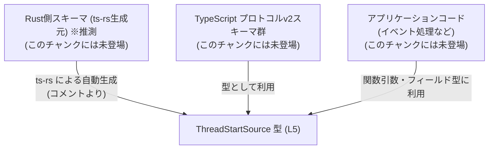
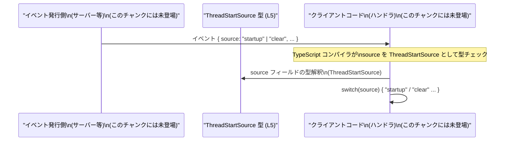

# app-server-protocol/schema/typescript/v2/ThreadStartSource.ts

## 0. ざっくり一言

- スレッド開始の「原因」や「きっかけ」を表す 2 値の文字列リテラル union 型 `ThreadStartSource` を定義する、**型定義専用のモジュール**です（ThreadStartSource.ts:L5-5）。
- Rust 側から `ts-rs` で自動生成されており、**手で編集しない前提**になっています（ThreadStartSource.ts:L1-3）。

---

## 1. このモジュールの役割

### 1.1 概要

- このモジュールは、スレッド開始イベントなどで使用されると考えられる「開始ソース」を型として表現し、**取りうる文字列値を `"startup"` と `"clear"` に限定**するために存在しています（ThreadStartSource.ts:L5-5）。
- TypeScript の **文字列リテラル union 型**を用いることで、コンパイル時に不正な値（例: `"start"` のような typo）を検出可能にします。

> 利用箇所やビジネス上の意味は、このチャンクには現れていないため不明です。型名と値の名前からの推測にとどまります。

### 1.2 アーキテクチャ内での位置づけ

- ファイルパス `schema/typescript/v2` から、このモジュールは「アプリケーションサーバープロトコル v2」の TypeScript スキーマ群の一部であると考えられます。
- 実際のロジック（スレッド管理やイベント処理）は別モジュールが担当し、**その入力・出力の型定義だけ**をこのファイルが提供している構造です（ThreadStartSource.ts:L5-5）。

推定される依存関係（このファイル内からは呼び出しはなく、あくまで利用される側としての位置づけ）を図にすると、次のようになります。



※ A, C, D は **コメントとパス名からの推測**であり、このチャンクにはコードは現れていません。

### 1.3 設計上のポイント

コードから読み取れる特徴は次のとおりです。

- **自動生成コードであることが明示**されています（ThreadStartSource.ts:L1-3）。
  - `// GENERATED CODE! DO NOT MODIFY BY HAND!`（ThreadStartSource.ts:L1-1）
  - `ts-rs` による生成であり、手動編集禁止とコメントされています（ThreadStartSource.ts:L3-3）。
- `ThreadStartSource` は **状態やロジックを持たない純粋な型エイリアス**です（ThreadStartSource.ts:L5-5）。
- 文字列リテラル union 型にすることで、**列挙値を型レベルで制限**し、TypeScript の型チェックを最大限に活用する設計になっています（ThreadStartSource.ts:L5-5）。
- 実行時のエラーハンドリングや並行性制御は一切含まれず、**全てコンパイル時の型安全性に関する責務のみ**です。

---

## 2. 主要な機能一覧

このモジュールが提供する機能は 1 つだけです。

- `ThreadStartSource`: スレッド開始のソースを表す **文字列リテラル union 型**。 `"startup"` または `"clear"` のみを許可します（ThreadStartSource.ts:L5-5）。

---

## 3. 公開 API と詳細解説

### 3.1 型一覧（構造体・列挙体など）

| 名前                | 種別               | 役割 / 用途                                                                 | 定義箇所                       |
|---------------------|--------------------|-----------------------------------------------------------------------------|--------------------------------|
| `ThreadStartSource` | 型エイリアス（union） | `"startup"` または `"clear"` の 2 値のみを許可する、スレッド開始ソースの型 | `ThreadStartSource.ts:L5-5` |

### 3.2 関数詳細（最大 7 件）

このファイルには **関数定義は存在しません**（ThreadStartSource.ts:L1-5）。  
代わりに、公開 API の中心である `ThreadStartSource` 型について詳しく説明します。

#### `type ThreadStartSource = "startup" | "clear"`

**概要**

- スレッド開始の「ソース」を表す文字列リテラル union 型です（ThreadStartSource.ts:L5-5）。
- 許可される値は `"startup"` と `"clear"` の 2 つに限定されます（ThreadStartSource.ts:L5-5）。
- TypeScript の型システム上の概念であり、**実行時にはただの文字列**として扱われます。

**定義**

```typescript
export type ThreadStartSource = "startup" | "clear";
```

- `export type` により、他モジュールからインポート可能な公開型になっています（ThreadStartSource.ts:L5-5）。
- `"startup" | "clear"` は **union 型**で、2 つの文字列リテラルのどちらかを表す型です。

**使用例（基本的な利用）**

ThreadStartSource 型を使って、スレッド開始イベントの型とハンドラ関数を定義する例です。

```typescript
// ThreadStartSource.ts から型をインポートする（相対パスはプロジェクト構造に依存）
import type { ThreadStartSource } from "./ThreadStartSource";

// スレッド開始イベントの形を表すインターフェース
interface ThreadStartEvent {
    source: ThreadStartSource;        // source は "startup" か "clear" のいずれか
    // 他のフィールド（id, timestamp など）は実際の仕様に応じて追加する
}

// ThreadStartSource を受け取って処理を分岐する関数
function handleThreadStart(event: ThreadStartEvent): void {
    switch (event.source) {
        case "startup":
            // アプリケーション起動時に開始されたスレッドの処理
            break;
        case "clear":
            // 「クリア」操作により開始されたスレッドの処理
            break;
        // default は不要: ThreadStartSource が 2 値に限定されているため
    }
}
```

> 上記は **一般的な利用例**であり、このリポジトリに実際に存在するコードではありません。

**Errors / Panics（エラー発生条件）**

型エイリアス自体は実行時のエラーを発生させませんが、TypeScript の型チェックにおいて次のようなコンパイルエラーが発生し得ます。

- `ThreadStartSource` 型の変数に `"startup"` / `"clear"` 以外の文字列リテラルを代入しようとすると、**型エラー**になります。
  - 例: `const src: ThreadStartSource = "start";` はコンパイルエラー。
- `ThreadStartSource` を引数に要求する関数に、`string` 型などより広い型をそのまま渡そうとすると、場合によっては型互換性のチェックでエラーになります。

実行時について:

- コンパイル済み JavaScript では型情報は消えるため、**実行時にはエラーが自動発生するわけではありません**。
- ネットワーク経由のデータや外部入力は、TypeScript では `any` / `unknown` / `string` として入ってくることが多く、呼び出し側で `ThreadStartSource` にキャストする前に **バリデーションを行う必要**があります。

**Edge cases（エッジケース）**

`ThreadStartSource` 自体の性質に基づく注意点は次のとおりです。

- **想定外の文字列**  
  `"startup"` / `"clear"` 以外の文字列は型的に許されません。  
  型チェックが有効な環境ではコンパイルエラーになり、安全です。
- **plain JavaScript や `any` との混在**  
  - `any` や `unknown` から代入するとき、型アサーション（`as ThreadStartSource`）を使うと**コンパイラチェックを回避できてしまう**ため、実行時には `"startup"` / `"clear"` 以外が入りうる点に注意が必要です。
- **将来の値追加**  
  将来 `"manual"` などの値が Rust 側で追加されても、TypeScript 側に最新の生成コードを取り込んでいなければ、**型定義が古いまま**になる可能性があります（コメントから自動生成であることは分かりますが、生成のタイミング管理はこのチャンクからは不明です）。

**使用上の注意点**

- **手動で編集しない**  
  冒頭コメントで「自動生成コード」「手動で編集しない」と明示されています（ThreadStartSource.ts:L1-3）。  
  仕様変更は、生成元（おそらく Rust 側の型）を変更し、`ts-rs` で再生成するべきです。
- **文字列の typo を防ぐために必ずこの型を利用する**  
  `"startup"` / `"clear"` をそのまま文字列でハードコードするのではなく、`ThreadStartSource` 型の変数・プロパティとして扱うと、IDE 補完や型チェックの恩恵を最大限受けられます。
- **外部入力の検証**  
  ネットワークから受信した JSON などに `source` フィールドが含まれる場合は、**実行時に `"startup"` / `"clear"` のいずれかであるかをチェック**した上で `ThreadStartSource` として扱う必要があります。
- **並行性・スレッド安全性**  
  型定義のみで状態を持たず、TypeScript の単一スレッド実行モデルの上に乗るため、**このファイル単体では並行性に関する懸念はありません**。

### 3.3 その他の関数

- このファイルには、補助関数やラッパー関数を含め **一切の関数定義が存在しません**（ThreadStartSource.ts:L1-5）。

---

## 4. データフロー

このモジュールは型定義のみであり、**実行時処理の「データフロー」はコードとして存在しません**。  
ただし、一般的な利用シナリオとしては次のような流れが想定されます。

1. サーバーまたは別コンポーネントが、スレッド開始イベントを表すオブジェクトを生成する。
2. そのオブジェクトの `source` フィールドに、`"startup"` または `"clear"` の文字列を設定する。
3. TypeScript 側では `source` を `ThreadStartSource` 型として扱い、`switch` 文などで分岐する。

これを概念的なシーケンス図で表すと次のようになります。



> 図はあくまで **一般的な利用イメージ**であり、実際にこのリポジトリに存在する処理フローは、このチャンクからは分かりません。

---

## 5. 使い方（How to Use）

### 5.1 基本的な使用方法

`ThreadStartSource` を使って、スレッド開始イベントの型とハンドラを定義する最小例です。

```typescript
// ThreadStartSource 型のインポート
import type { ThreadStartSource } from "./ThreadStartSource"; // 実際のパスはプロジェクト構成に依存する

// ThreadStartSource をプロパティ型に使ったインターフェース
interface ThreadInfo {
    id: string;                         // スレッドを識別する ID
    source: ThreadStartSource;          // "startup" または "clear" のみ許可
}

// ThreadStartSource を引数に取る関数
function logThreadStart(info: ThreadInfo): void {
    console.log(`thread started from: ${info.source}`);
}

// 利用例
const info: ThreadInfo = {
    id: "thread-1",
    source: "startup",                   // OK: ThreadStartSource の一員
};

logThreadStart(info);

// 次はコンパイルエラーの一例（コメントアウト）
// const badInfo: ThreadInfo = {
//     id: "thread-2",
//     // エラー: Type '"manual"' is not assignable to type 'ThreadStartSource'.
//     source: "manual",
// };
```

### 5.2 よくある使用パターン

1. **イベント型のフィールドとして使う**

```typescript
interface ThreadStartEvent {
    source: ThreadStartSource;          // 開始ソース
    timestamp: string;                  // 例: ISO 8601 形式の文字列
}
```

1. **関数の引数の種類を制限する**

```typescript
function startThreadBy(source: ThreadStartSource): void {
    if (source === "startup") {
        // アプリケーション起動時のスレッド開始処理
    } else {
        // source === "clear" のケース
    }
}
```

1. **switch 文で分岐し、default を不要にする**

```typescript
function handleSource(source: ThreadStartSource): void {
    switch (source) {
        case "startup":
            // "startup" 用処理
            break;
        case "clear":
            // "clear" 用処理
            break;
        // default: コンパイラ的には不要
    }
}
```

### 5.3 よくある間違い

**間違い例: 単なる `string` として扱ってしまう**

```typescript
// 間違い例: string 型にしてしまうと、何でも入ってしまう
function badHandleSource(source: string): void {
    // "スタートアップ" のような typo も通ってしまう
}
```

**正しい例: `ThreadStartSource` を使う**

```typescript
// 正しい例: ThreadStartSource 型にすることで値を 2 値に制限
function goodHandleSource(source: ThreadStartSource): void {
    // "startup" / "clear" 以外はコンパイルエラーになる
}
```

**間違い例: 型アサーションで無理に通す**

```typescript
declare const rawSource: string;

// 間違い例: 実行時には不正な値かもしれないのに、型アサーションで黙認してしまう
const unsafeSource = rawSource as ThreadStartSource; // コンパイルは通るが、安全性は呼び出し側に依存
```

このような場合は、実行時チェックを行ってから代入する方が安全です。

```typescript
function toThreadStartSource(value: string): ThreadStartSource | null {
    if (value === "startup" || value === "clear") {
        return value;
    }
    return null;
}
```

### 5.4 使用上の注意点（まとめ）

- **自動生成ファイルのため直接編集しない**（ThreadStartSource.ts:L1-3）。
- `"startup"` / `"clear"` のような文字列を直接ハードコードせず、`ThreadStartSource` 型・変数を通じて扱うと型安全性が高まります。
- 外部入力から `source` を受け取る場合は、実行時に `"startup"` / `"clear"` のチェックを行った上で `ThreadStartSource` として扱うことが推奨されます。
- 並行実行や共有状態は存在せず、この型定義自体にはスレッド安全性・ロックなどの懸念はありません。

---

## 6. 変更の仕方（How to Modify）

### 6.1 新しい機能を追加する場合

このファイルのコメントに「自動生成コード」「手で編集しない」とあるため（ThreadStartSource.ts:L1-3）、**直接この TypeScript ファイルを編集すべきではありません**。

`ThreadStartSource` に値を追加したい場合の一般的な手順（推測を含みます）は次のとおりです。

1. 生成元（おそらく Rust 側の型定義）に新しいバリアントを追加する。  
   - このチャンクには Rust コードが存在しないため、具体的な場所や型名は不明です。
2. `ts-rs` のコード生成コマンドを実行し、TypeScript スキーマ群（本ファイルを含む）を再生成する。
3. 生成後の `ThreadStartSource` が `"startup" | "clear" | "newVariant"` のように更新されていることを確認する。

### 6.2 既存の機能を変更する場合

`"startup"` / `"clear"` の名称を変更・削除する場合も、同様に **生成元の型を変更し、再生成**する必要があります。

変更時の注意点:

- `ThreadStartSource` を使用しているすべての TypeScript コードが影響を受けるため、**コンパイルエラーを確認して利用箇所を修正**する必要があります。
- 既存の永続化データや外部 API との互換性にも影響しうるため、プロトコルバージョン（`v2` ディレクトリ）との整合性も考慮する必要がありますが、その詳細はこのチャンクからは分かりません。

---

## 7. 関連ファイル

このチャンクには `ThreadStartSource` 以外のファイルは含まれていません。  
したがって、厳密な意味で「密接に関係するファイル」をコードから特定することはできません。

推測を含めつつ整理すると次のとおりです。

| パス / コンポーネント         | 役割 / 関係 | 根拠 |
|-------------------------------|-------------|------|
| `schema/typescript/v2/*`      | 同じ v2 スキーマに属する他の TypeScript 型定義が存在すると想定されますが、このチャンクには現れません。 | ディレクトリパス名からの推測のみ |
| Rust 側の ts-rs 生成元の型 | `ThreadStartSource` と対応する Rust 型が存在すると考えられますが、具体的なファイル名・型名は不明です。 | ts-rs による生成コメント（ThreadStartSource.ts:L3-3）からの推測 |

> 以上の関連ファイル・コンポーネントについては、**このチャンク単体から実コードを確認することはできません**。
