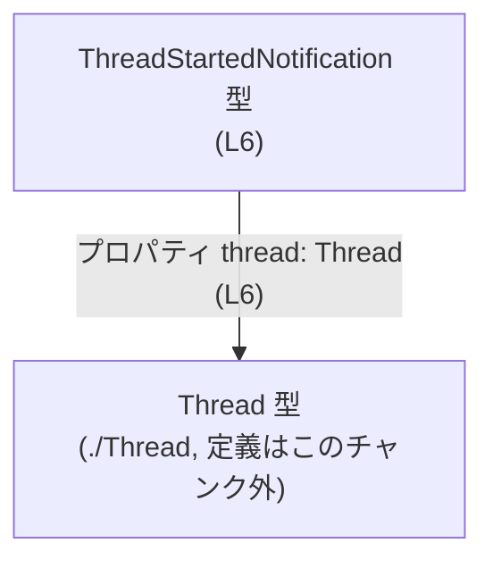
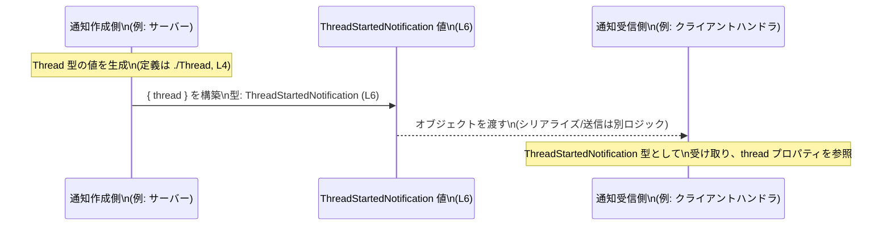

# app-server-protocol/schema/typescript/v2/ThreadStartedNotification.ts

---

## 0. ざっくり一言

`ThreadStartedNotification` は、`Thread` 型の値を `thread` プロパティとして 1 つだけ持つ通知ペイロードを表す **TypeScript の型エイリアス**です（ThreadStartedNotification.ts:L4-6）。  
このファイル自体は ts-rs により自動生成され、手動編集しないことが明記されています（ThreadStartedNotification.ts:L1-3）。

---

## 1. このモジュールの役割

### 1.1 概要

- このモジュールは、`Thread` 型のスレッドが「開始された」ことを表す通知の **データ構造（型定義）** を提供します（ThreadStartedNotification.ts:L4-6）。
- 実行時の処理ロジックや関数は一切含まず、**型情報のみ** をエクスポートします（ThreadStartedNotification.ts:L1-6）。
- ファイル先頭のコメントから、`ts-rs` によって生成されたコードであり、上位のスキーマ定義（おそらく Rust 側）から同期されることが示されています（ThreadStartedNotification.ts:L1-3）。

### 1.2 アーキテクチャ内での位置づけ

このモジュールは、同じディレクトリにある `./Thread` モジュールで定義された `Thread` 型に依存しています（ThreadStartedNotification.ts:L4）。

```mermaid
graph LR
  ThreadStartedNotification_ts["ThreadStartedNotification.ts\n(L1-6)"]
  Thread_ts["\"./Thread\" モジュール\n(定義はこのチャンク外)"]

  ThreadStartedNotification_ts -->|"import type { Thread } (L4)"| Thread_ts
```

- 依存先の `./Thread` モジュール内で `Thread` がどのように定義されているかは、このチャンクには現れません。
- 逆に `ThreadStartedNotification` をどのモジュールが利用しているかも、このファイルからは分かりません（ThreadStartedNotification.ts:L1-6）。

### 1.3 設計上のポイント

- **自動生成コード**  
  - 「GENERATED CODE」「Do not edit this file manually」とあり、プログラム的に生成される前提です（ThreadStartedNotification.ts:L1-3）。
- **型専用インポート (`import type`) の利用**  
  - `import type { Thread } from "./Thread";` により、`Thread` はコンパイル時のみ利用される型として読み込まれ、JavaScript への出力時にはインポートが削除されます（ThreadStartedNotification.ts:L4）。
- **オブジェクト型エイリアス**  
  - `ThreadStartedNotification` は `{ thread: Thread }` という 1 プロパティのオブジェクト型として定義されています（ThreadStartedNotification.ts:L6）。
  - プロパティ `thread` はオプショナル（`?`）ではなく、必須プロパティです（ThreadStartedNotification.ts:L6）。

---

## 2. 主要な機能一覧（コンポーネントインベントリー）

### 2.1 コンポーネント一覧

このファイルに現れる型・モジュールの一覧です。

| 種別 | 名前 | 説明 | 根拠 |
|------|------|------|------|
| コメント | 自動生成警告 | 「GENERATED CODE」「Do not modify by hand」と明示されるヘッダコメント | ThreadStartedNotification.ts:L1-3 |
| インポート（型） | `Thread` | 同一ディレクトリの `"./Thread"` モジュールから読み込まれる型。通知内の `thread` プロパティの型として使用される | ThreadStartedNotification.ts:L4 |
| 型エイリアス（エクスポート） | `ThreadStartedNotification` | `{ thread: Thread }` 型のオブジェクトを表す通知ペイロードの型 | ThreadStartedNotification.ts:L6 |

### 2.2 主要な機能（役割）

- `ThreadStartedNotification`:  
  スレッド開始通知のペイロード構造（`thread` プロパティに `Thread` 型を持つオブジェクト）を表す型エイリアスです（ThreadStartedNotification.ts:L4-6）。

このファイルには関数やクラスなどの実行時ロジックは含まれていません（ThreadStartedNotification.ts:L1-6）。

---

## 3. 公開 API と詳細解説

### 3.1 型一覧（構造体・列挙体など）

| 名前 | 種別 | 役割 / 用途 | フィールド概要 | 根拠 |
|------|------|-------------|----------------|------|
| `ThreadStartedNotification` | 型エイリアス（オブジェクト型） | スレッド開始を表す通知ペイロードの型。外部モジュールから利用可能（`export type`） | プロパティ `thread: Thread`（必須） | ThreadStartedNotification.ts:L6 |
| `Thread` | 型（インポート） | `ThreadStartedNotification.thread` プロパティの型。スレッド情報の詳細を表すと考えられるが、定義はこのチャンクには現れない | フィールド構成不明 | ThreadStartedNotification.ts:L4 |

#### `ThreadStartedNotification` の構造

```ts
export type ThreadStartedNotification = { thread: Thread, };
```

- オブジェクトリテラル型に 1 つのプロパティ `thread` を持つ定義です（ThreadStartedNotification.ts:L6）。
- 末尾にカンマが付いていますが、TypeScript の構文としては許容されています（複数プロパティを持つ場合の書式と一貫性を保つためと考えられます）。

### 3.2 関数詳細

このファイルには **関数・メソッドは一切定義されていません**（ThreadStartedNotification.ts:L1-6）。

そのため、関数用の詳細テンプレートに該当する対象はありません。

### 3.3 その他の関数

- 補助的な関数やラッパー関数も定義されていません（ThreadStartedNotification.ts:L1-6）。

---

## 4. データフロー

### 4.1 型レベルのデータ構造の関係

このファイル内で確認できるのは、「`Thread` 型を `thread` プロパティとして内包する `ThreadStartedNotification` 型」という **型レベルの依存関係**です（ThreadStartedNotification.ts:L4-6）。



- `ThreadStartedNotification` 型のインスタンスは、少なくとも `thread` プロパティに `Thread` 型の値を 1 つ保持します（ThreadStartedNotification.ts:L6）。
- `Thread` 型の詳細なフィールド構造やシリアライズ形式は、このチャンクには現れません（ThreadStartedNotification.ts:L4）。

### 4.2 典型的な利用シナリオ（概念図）

以下は、この型がどのように使われうるかを示す **概念的なシーケンス図**です。  
※これは一般的な利用イメージであり、このファイル単体から呼び出し元ロジックは確認できません。



- この図で示している `Producer` / `Consumer` / 送受信ロジックは、あくまで想定例です。
- 実際にどのモジュールが `ThreadStartedNotification` を生成・消費するかは、このファイルからは分かりません（ThreadStartedNotification.ts:L1-6）。

---

## 5. 使い方（How to Use）

### 5.1 基本的な使用方法

`ThreadStartedNotification` 型を利用して、通知オブジェクトの構造を型安全に表現する例です。

```ts
// ThreadStartedNotification と Thread をインポートする
import type { ThreadStartedNotification } from "./ThreadStartedNotification"; // このファイル自身
import type { Thread } from "./Thread";                                       // L4 で定義されている型インポートと同じ

// Thread 型の値を用意する（実際のフィールド構造は ./Thread 側の定義による）
const thread: Thread = {
    // ... Thread 型の必須フィールドをここに記述 ...
};

// ThreadStartedNotification 型のオブジェクトを構築する
const notification: ThreadStartedNotification = {
    thread, // プロパティ名は必ず thread（L6）
};

// 例: 関数の引数として渡す（関数定義は利用側で作成）
function handleThreadStarted(notify: ThreadStartedNotification) {
    // notify.thread から Thread 情報にアクセスできる
    console.log("Started thread:", notify.thread);
}
```

このように、`ThreadStartedNotification` は **構造を保証する型** として機能し、`thread` プロパティの存在と型をコンパイル時にチェックできます（ThreadStartedNotification.ts:L6）。

### 5.2 よくある使用パターン

1. **イベントハンドラの引数型に使う**

```ts
// イベントハンドラのコールバック型
type ThreadStartedHandler = (payload: ThreadStartedNotification) => void;

// ハンドラ登録関数の例
function onThreadStarted(handler: ThreadStartedHandler) {
    // 実装は通知システム側に依存
}
```

1. **通知メッセージの汎用型に組み込む（例）**

```ts
// 他の通知型と組み合わせる例（他の型は利用側で定義）
type AppNotification =
    | ThreadStartedNotification
    // | ThreadFinishedNotification
    // | ThreadUpdatedNotification
    ;
```

上記のようなユニオン型への組み込みは、このファイルには書かれていませんが、型エイリアスとしての `ThreadStartedNotification` はこのような利用が可能です（ThreadStartedNotification.ts:L6）。

### 5.3 よくある間違い

**1. プロパティ名の誤り**

```ts
// 誤り: プロパティ名が thread ではない
const wrong1: ThreadStartedNotification = {
    // threadId: thread, // コンパイルエラー: 'thread' プロパティがない
};

// 正しい例
const correct: ThreadStartedNotification = {
    thread, // プロパティ名は thread（L6）
};
```

**2. `thread` を `null` や不完全な値にする**

```ts
// 誤り: Thread 型ではなく Thread | null を渡そうとしている例
// const wrong2: ThreadStartedNotification = {
//     thread: null, // 型チェックでエラー（Thread 型が要求される, L6）
// };
```

- `thread` プロパティは `Thread` 型として定義されており、`null` や `undefined` は許可されていません（ThreadStartedNotification.ts:L6）。

### 5.4 使用上の注意点（まとめ）

- このファイルは **自動生成コード** なので、直接編集すると再生成時に上書きされる可能性が高く、型定義の整合性が失われます（ThreadStartedNotification.ts:L1-3）。
- `ThreadStartedNotification` は **コンパイル時のみの型情報** であり、実行時のバリデーションは行いません。  
  たとえば JSON やネットワークから受け取った値が本当に `{ thread: Thread }` の形かどうかは、別途実行時チェックが必要です（ThreadStartedNotification.ts:L6）。
- `import type` の利用により、ランタイムの import 文は生成されず、バンドルサイズや実行時依存関係に影響を与えません（ThreadStartedNotification.ts:L4）。

---

## 6. 変更の仕方（How to Modify）

### 6.1 新しい機能を追加する場合

このファイルは `ts-rs` による自動生成であり、「Do not edit this file manually」と明記されています（ThreadStartedNotification.ts:L1-3）。

- `ThreadStartedNotification` に新しいプロパティを追加する、あるいは構造を変えたい場合は、  
  **生成元（おそらく Rust 側の型定義や ts-rs の設定）を変更し、再生成する必要があります。**
- このチャンクからは、生成元の具体的なファイルパスや型名は分かりません（ThreadStartedNotification.ts:L1-3）。

### 6.2 既存の機能を変更する場合

- `thread` プロパティの型や必須／任意を変更したい場合も、同様に生成元の定義変更が必要です（ThreadStartedNotification.ts:L6）。
- 変更の影響範囲としては、`ThreadStartedNotification` を利用するすべてのコード（関数引数・戻り値・ユニオン型など）が含まれる可能性がありますが、その利用箇所はこのファイルからは特定できません（ThreadStartedNotification.ts:L1-6）。
- 手動でこのファイルだけを変更すると、他の自動生成された TypeScript 型や Rust 側の定義と不整合を起こす危険があります。

---

## 7. 関連ファイル

このチャンクから確実に分かる関連モジュールは次の 1 件です。

| パス / モジュール指定 | 役割 / 関係 | 根拠 |
|-----------------------|------------|------|
| `./Thread` | `Thread` 型を提供するモジュール。`ThreadStartedNotification.thread` プロパティの型として利用される | ThreadStartedNotification.ts:L4 |

- `./Thread` がどのファイル（`Thread.ts` など）に解決されるか、またその中身がどうなっているかは、このチャンクには現れません。
- `ts-rs` の生成元（Rust 側プロジェクト）やその他の通知型ファイル（例: `ThreadFinishedNotification` など）の存在は、このファイルからは分かりません（ThreadStartedNotification.ts:L1-6）。

---

### 言語固有の安全性・エラー・並行性についての補足

- **安全性 / エラー**  
  - TypeScript の静的型チェックにより、`thread` プロパティが欠けている、あるいは `Thread` と互換性のない型を渡そうとするとコンパイル時にエラーになります（ThreadStartedNotification.ts:L6）。
  - ただし、実行時には型情報が消えるため、外部入力（JSON 等）の検証は別途必要です。
- **並行性**  
  - このファイルは純粋な型定義のみであり、状態や非同期処理を持たないため、並行性やスレッドセーフティに関する特別な懸念はありません（ThreadStartedNotification.ts:L1-6）。
