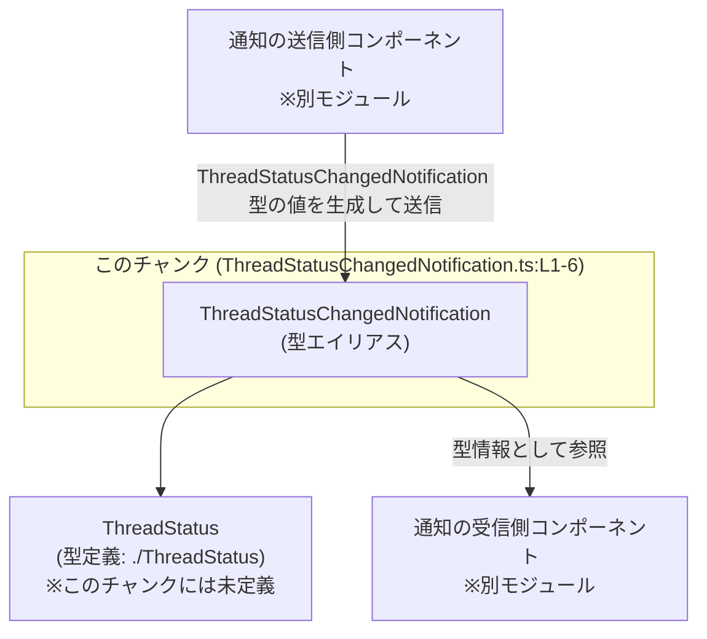
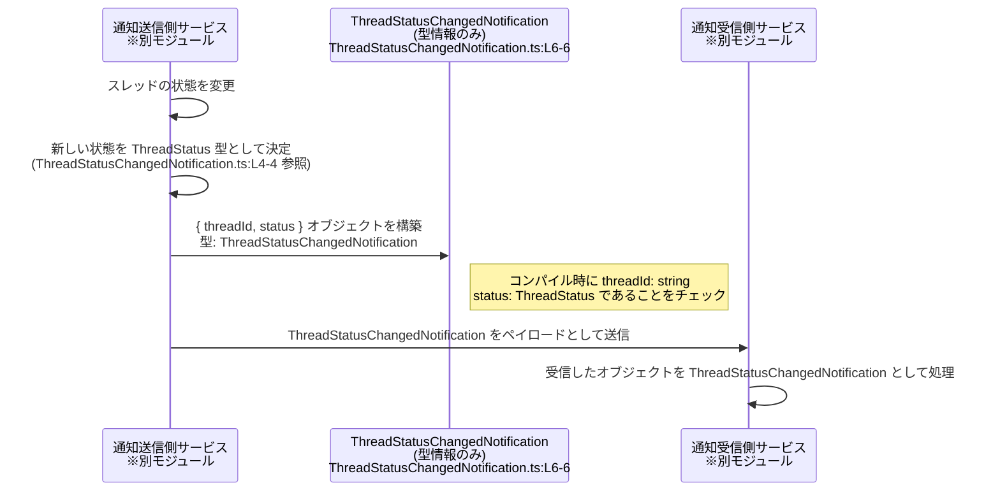

# app-server-protocol\schema\typescript\v2\ThreadStatusChangedNotification.ts コード解説

## 0. ざっくり一言

`ThreadStatusChangedNotification` 型は、`threadId` と `status` という 2 つのプロパティを持つ通知オブジェクトを表す、TypeScript の型エイリアスです（`ThreadStatusChangedNotification.ts:L6-6`）。

---

## 1. このモジュールの役割

### 1.1 概要

- このモジュールは、`ThreadStatusChangedNotification` という **通知メッセージの形** を表す型定義を提供します（`ThreadStatusChangedNotification.ts:L6-6`）。
- 通知の内容は、文字列の `threadId` と、別モジュールで定義された `ThreadStatus` 型の `status` から構成されます（`ThreadStatusChangedNotification.ts:L4-4, L6-6`）。
- ファイル先頭のコメントから、この型定義は `ts-rs` によって自動生成されており、手動編集しないことが明示されています（`ThreadStatusChangedNotification.ts:L1-3`）。

### 1.2 アーキテクチャ内での位置づけ

このモジュールは「**スレッド状態を表す型 (`ThreadStatus`) を取り込み、それを使った通知用の型をエクスポートする層**」に位置づけられます。



- `ThreadStatus` は `import type` で参照されるのみで、このチャンク内には定義がありません（`ThreadStatusChangedNotification.ts:L4-4`）。
- 実際の送信・受信ロジックは、本ファイルには存在せず、このチャンクからは分かりません。

### 1.3 設計上のポイント

- **自動生成コード**  
  - ファイル先頭に「GENERATED CODE」「Do not edit manually」とあり、コード生成された型定義であることが明記されています（`ThreadStatusChangedNotification.ts:L1-3`）。
- **型のみのモジュール**  
  - 関数やクラスは定義されておらず、`export type` による型エイリアスのみを提供します（`ThreadStatusChangedNotification.ts:L6-6`）。
- **依存関係の単純さ**  
  - 依存は `ThreadStatus` 型への 1 件のみで、循環依存や複雑な依存関係は、このチャンクからは確認できません（`ThreadStatusChangedNotification.ts:L4-4`）。
- **エラー・並行性に関する要素はなし**  
  - 実行時処理や非同期処理は一切含まれておらず、型レベルの安全性のみを提供します。

---

## 2. 主要な機能一覧

このモジュールは **型定義のみ** を提供し、実行時の機能（関数・クラス）は持ちません。

- `ThreadStatusChangedNotification` 型:  
  `threadId: string` と `status: ThreadStatus` をプロパティに持つ通知オブジェクトの形を表す（`ThreadStatusChangedNotification.ts:L4-4, L6-6`）。

---

## 3. 公開 API と詳細解説

### 3.1 型一覧（構造体・列挙体など） — コンポーネントインベントリー

このチャンクに登場する型コンポーネントを一覧にします。

| 名前 | 種別 | 公開か | 役割 / 用途 | 根拠 |
|------|------|--------|-------------|------|
| `ThreadStatusChangedNotification` | 型エイリアス（オブジェクト型） | `export` されている | `threadId: string` と `status: ThreadStatus` から構成される通知オブジェクトの形を表す | `ThreadStatusChangedNotification.ts:L6-6` |
| `ThreadStatus` | 型（詳細不明） | このモジュールからは再エクスポートされていない | 通知の `status` プロパティの型。内容はこのチャンクからは不明 | `ThreadStatusChangedNotification.ts:L4-4, L6-6` |

#### `ThreadStatusChangedNotification`（型エイリアス）

**概要**

- 以下の 2 プロパティを持つオブジェクト型です（`ThreadStatusChangedNotification.ts:L6-6`）。
  - `threadId: string`
  - `status: ThreadStatus`

**フィールド**

| フィールド名 | 型 | 説明 | 根拠 |
|-------------|----|------|------|
| `threadId`  | `string` | あるスレッドを識別する ID を表す文字列と解釈できますが、形式や意味の詳細はコードからは分かりません | `ThreadStatusChangedNotification.ts:L6-6` |
| `status`    | `ThreadStatus` | スレッドの状態を表すと推測される型ですが、実際にどのような状態が定義されているかはこのチャンクには現れません | `ThreadStatusChangedNotification.ts:L4-4, L6-6` |

> 「スレッド」「状態」「通知」という意味づけは、型名・プロパティ名から推測されるものであり、ドメイン上の厳密な定義はこのファイルからは分かりません。

**TypeScript の型安全性との関係**

- `threadId` は `string` に固定されているため、数値などを渡すとコンパイルエラーになります（静的型チェック）。
- `status` に渡せる値は `ThreadStatus` 型に制限されるため、存在しない状態文字列を直接渡すことはコンパイル時に防がれます（`any` を使った場合などを除く）。

### 3.2 関数詳細

このモジュールには関数・メソッドが定義されていないため、このセクションで詳細解説する対象はありません（`ThreadStatusChangedNotification.ts:L1-6`）。

### 3.3 その他の関数

- 関数は 1 つも定義されていません（`ThreadStatusChangedNotification.ts:L1-6`）。

---

## 4. データフロー

このモジュール自体は型定義だけですが、`ThreadStatusChangedNotification` が典型的にどのように使われるかを **想定した** データフロー例を示します。  
※ 以下は型名に基づくモデルケースであり、実際の処理フローは別ファイルの実装によります。



- このチャートは「**この型が通知メッセージの形だけを定義し、実際の送受信ロジックは別コンポーネントが担う**」という役割分担を表現しています。
- 実際にどのトランスポート（WebSocket, HTTP, etc.）を使っているかは、このチャンクには現れません。

---

## 5. 使い方（How to Use）

### 5.1 基本的な使用方法

`ThreadStatusChangedNotification` 型を使って通知オブジェクトを作成し、別の関数に渡す例です。

```typescript
// ThreadStatusChangedNotification 型と ThreadStatus 型をインポートする
import type { ThreadStatusChangedNotification } from "./ThreadStatusChangedNotification"; // このファイル
import type { ThreadStatus } from "./ThreadStatus";                                      // 別ファイル（このチャンクには未定義）

// ThreadStatus を使うときは、その定義に従った値を用意する必要があります
declare const newStatus: ThreadStatus; // 実際にはどこかで決定された状態

// 通知オブジェクトを作成する                                  // ThreadStatusChangedNotification 型に適合するオブジェクト
const notification: ThreadStatusChangedNotification = {         // 型注釈により threadId と status の型がチェックされる
    threadId: "thread-123",                                     // string 型なのでOK。number を入れるとコンパイルエラー
    status: newStatus,                                          // ThreadStatus 型に合う値である必要がある
};

// 例えば、通知送信関数に渡す                                   // sendNotification はこのモジュール外の任意の関数
sendNotification(notification);
```

このコードにより：

- `threadId` に数値などを誤って渡すとコンパイルエラーになります。
- `status` に `ThreadStatus` に含まれない値を直接渡すことは（`any` などを使わない限り）防止されます。

### 5.2 よくある使用パターン

1. **イベントハンドラ内での利用**

```typescript
import type { ThreadStatusChangedNotification } from "./ThreadStatusChangedNotification";
import type { ThreadStatus } from "./ThreadStatus";

// スレッド状態変更時に呼ばれるハンドラ                      // 実装場所は別ファイルを想定
function onThreadStatusChanged(id: string, status: ThreadStatus) {
    const notification: ThreadStatusChangedNotification = {     // ここで通知オブジェクトを組み立てる
        threadId: id,
        status,
    };

    broadcastToClients(notification);                           // クライアントへ一斉送信するなど
}
```

1. **受信側での型注釈**

```typescript
import type { ThreadStatusChangedNotification } from "./ThreadStatusChangedNotification";

function handleIncomingMessage(raw: unknown) {
    // 実際にはバリデーションが必要（ここでは省略）         // バリデーションはこの型定義ファイルには含まれない
    const msg = raw as ThreadStatusChangedNotification;         // 型アサーションで型付け

    console.log(msg.threadId, msg.status);                      // IDE 補完と型チェックが効く
}
```

> 受信側の例では、`unknown` → `ThreadStatusChangedNotification` への変換に **実行時バリデーションが必要** ですが、そのロジックはこのモジュールには含まれていないため別途実装が必要です。

### 5.3 よくある間違い

```typescript
import type { ThreadStatusChangedNotification } from "./ThreadStatusChangedNotification";

// 間違い例: プロパティ名・型の不一致
const wrongNotification: ThreadStatusChangedNotification = {
    // threadID: "thread-123",     // プロパティ名を間違えている（threadId が正しい）
    threadId: 123,                  // number を渡している（string でないためコンパイルエラー）
    // status: "RUNNING",          // ThreadStatus 型ではない可能性が高い（定義次第）
};

// 正しい例（型に従う）
const correctNotification: ThreadStatusChangedNotification = {
    threadId: "thread-123",         // string
    status: getThreadStatus(),      // ThreadStatus 型を返す関数を想定
};
```

この型定義により、こうした「プロパティ名の誤り」や「型の不一致」は **コンパイル時に検出** されます。

### 5.4 使用上の注意点（まとめ）

- **実行時バリデーションは別途必要**  
  ネットワーク越しに受信した JSON などをこの型に変換する場合、実行時に `threadId` が文字列であるか、`status` が `ThreadStatus` に適合するかをチェックする処理が別途必要です。この型定義だけでは実行時の不正値を防げません。
- **`any` の多用は型安全性を損なう**  
  `any` を経由して値を渡すと、`ThreadStatusChangedNotification` の制約が事実上無効化されるため、TypeScript の型チェックの恩恵が減少します。
- **並行性・エラー処理は呼び出し側の責務**  
  この型自体は同期/非同期やエラー、並行性に関する情報を持たず、通知を送受信するロジック側で適切に扱う必要があります。

---

## 6. 変更の仕方（How to Modify）

### 6.1 新しい機能を追加する場合

このファイルは `ts-rs` による自動生成コードであり、「手で修正しないこと」が明示されています（`ThreadStatusChangedNotification.ts:L1-3`）。

- 新しいフィールドを追加したい場合などは、**生成元（おそらく別言語側またはスキーマ定義）を変更し、`ts-rs` による再生成を行う**のが前提となります。
- このチャンクからは、生成元のファイルがどこにあるかは分かりません。

### 6.2 既存の機能を変更する場合

- `threadId` や `status` の型・名前を変更したい場合も、同様に生成元を変更し、`ts-rs` に再生成させる必要があります（`ThreadStatusChangedNotification.ts:L1-3, L6-6`）。
- 型を変更すると、この型を利用しているすべてのモジュールに影響が及ぶため、以下の点を確認する必要があります（確認対象はこのチャンクには現れません）:
  - `ThreadStatusChangedNotification` をインポートしているファイル
  - 送信・受信ロジックで、ペイロードとしてこの型を前提にしている箇所
  - `ThreadStatus` 自体の定義との整合性

> このファイル単体からは依存箇所を特定できないため、プロジェクト全体での検索などが必要です。

---

## 7. 関連ファイル

このチャンクから直接分かる関連ファイルは次の通りです。

| パス | 役割 / 関係 | 根拠 |
|------|------------|------|
| `./ThreadStatus` | `ThreadStatus` 型の定義を提供するモジュール。このファイルから `import type` されているが、内容はこのチャンクには現れない | `ThreadStatusChangedNotification.ts:L4-4` |
| （生成元ファイル: 不明） | `ts-rs` によるコード生成の元になっているスキーマまたは型定義。どこにあるか、どの言語かはこのファイルからは分からない | `ThreadStatusChangedNotification.ts:L1-3` |

---

### 補足: Bugs / Security / Contracts / Edge Cases / Tests / Performance に関するメモ

- **Bugs / Security**  
  - このファイルは型定義のみで、ロジックを含まないため、典型的なバグ（無限ループ、例外など）は存在しません。
  - ただし、受信データを適切にバリデーションせずに `as ThreadStatusChangedNotification` として扱うと、型が保証するはずの前提が破られ、セキュリティ問題やランタイムエラーの原因になります。
- **Contracts / Edge Cases**  
  - 契約として、「`threadId` は string」「`status` は ThreadStatus」という静的な制約のみが定義されています（`ThreadStatusChangedNotification.ts:L6-6`）。
  - `threadId` が空文字で良いのか、`status` のどの値が許可されるかといったドメイン上の制約は、このファイルからは分かりません。
- **Tests**  
  - テストコードは同一チャンク内に存在しません。
  - 型定義の妥当性は、主に生成元（`ts-rs` とその入力）側で担保されると考えられますが、この点もこのファイルからは直接は分かりません。
- **Performance / Scalability / Observability**  
  - 型定義のみであり、パフォーマンスやスケーラビリティに関わる処理は含まれていません。
  - ロギングやメトリクスなどの観測性に関する処理も、このモジュールにはありません。
