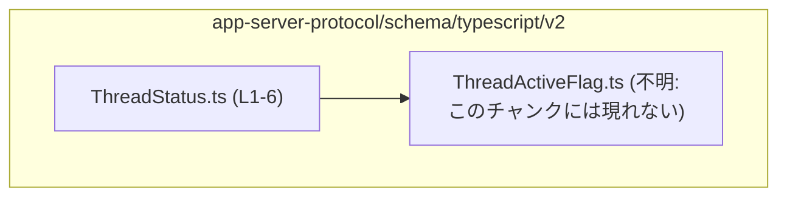
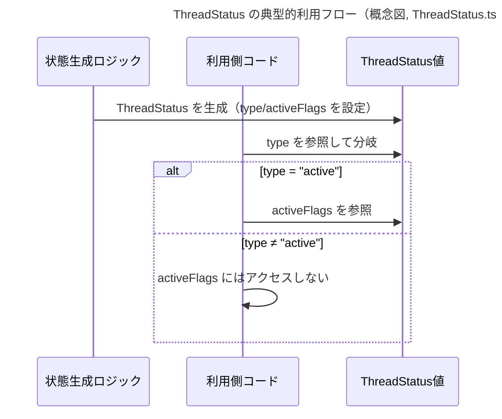

# app-server-protocol/schema/typescript/v2/ThreadStatus.ts コード解説

## 0. ざっくり一言

`ThreadStatus` は、スレッドの状態を `"notLoaded" / "idle" / "systemError" / "active"` の 4 パターンで表現する **判別可能な共用体（discriminated union）型** です（`ThreadStatus.ts:L6-6`）。

---

## 1. このモジュールの役割

### 1.1 概要

- このモジュールは、スレッドの状態を型安全に表現するための TypeScript 型 `ThreadStatus` を定義します（`ThreadStatus.ts:L6-6`）。
- 状態は `"type"` フィールドで区別され、`"active"` の場合のみ `activeFlags` プロパティに `ThreadActiveFlag` の配列を持ちます（`ThreadStatus.ts:L4-6`）。
- ファイル先頭のコメントから、この型定義は `ts-rs` により自動生成されるコードであり、手動編集は想定されていません（`ThreadStatus.ts:L1-3`）。

### 1.2 アーキテクチャ内での位置づけ

このモジュールは、スレッド状態ドメインの **型定義レイヤ** に位置し、他のモジュールからインポートされて利用されることが想定されます。  
本ファイル内からは `ThreadActiveFlag` のみを依存として参照しています（`ThreadStatus.ts:L4-4`）。



※ `ThreadActiveFlag.ts` の中身はこのチャンクには現れないため不明です。

### 1.3 設計上のポイント

- **自動生成コード**  
  - ファイル先頭コメントから、この型は `ts-rs` により生成されており、直接編集しない前提になっています（`ThreadStatus.ts:L1-3`）。
- **判別可能な共用体**  
  - `"type"` フィールドを共通に持つオブジェクトのユニオンで構成されており、TypeScript のナローイング機能と相性が良い構造です（`ThreadStatus.ts:L6-6`）。
- **状態と付随情報の分離**  
  - `"notLoaded" / "idle" / "systemError"` の状態には追加情報がなく、`"active"` のときだけ `activeFlags: Array<ThreadActiveFlag>` を持つ、という明確な分離になっています（`ThreadStatus.ts:L4-6`）。
- **実行時ロジック・状態保持はなし**  
  - このファイルには関数やクラスは存在せず、実行時のロジックや内部状態は一切持っていません（`ThreadStatus.ts:L1-6`）。

---

## 2. 主要な機能一覧

このモジュールは型定義のみを提供し、関数やクラスは含みません。

- `ThreadStatus` 型: スレッドの状態を 4 種類のバリアントで表現する判別可能共用体（`ThreadStatus.ts:L6-6`）

---

## 3. 公開 API と詳細解説

### 3.1 型一覧（構造体・列挙体など）

| 名前            | 種別            | 役割 / 用途                                                                                           | 定義位置                         |
|-----------------|-----------------|--------------------------------------------------------------------------------------------------------|----------------------------------|
| `ThreadStatus`  | 型エイリアス    | スレッドの状態を `"notLoaded" / "idle" / "systemError" / "active"` の 4 パターンで表現する共用体型。`"active"` の場合に `activeFlags` を伴う。 | `ThreadStatus.ts:L6-6`           |
| `ThreadActiveFlag` | 型（詳細不明） | アクティブ状態の付随フラグを表す型。`ThreadStatus` の `"active"` バリアントで配列として利用される。         | `ThreadActiveFlag.ts:不明`（インポートのみ `ThreadStatus.ts:L4-4`） |

#### `ThreadStatus` の構造（詳細）

```typescript
export type ThreadStatus =
  { "type": "notLoaded" }
| { "type": "idle" }
| { "type": "systemError" }
| { "type": "active", activeFlags: Array<ThreadActiveFlag> };
```

（根拠: `ThreadStatus.ts:L6-6`）

- 4 つのバリアントを持つユニオン型です。
  - `"notLoaded"`: 未ロード状態。追加プロパティなし。
  - `"idle"`: 待機状態。追加プロパティなし。
  - `"systemError"`: システムエラー状態。追加プロパティなし。
  - `"active"`: アクティブな状態。`activeFlags` に `ThreadActiveFlag` の配列を持ちます。

TypeScript の観点からは、**判別可能共用体（discriminated union）** に該当します。  
共通の `"type"` プロパティを持つことで、`switch (status.type)` などでバリアントごとに型が自動で絞り込まれます。

### 3.2 関数詳細（最大 7 件）

このファイルには関数は定義されていません（`ThreadStatus.ts:L1-6`）。  
したがって、このセクションで詳細解説すべき関数はありません。

### 3.3 その他の関数

このファイルには補助関数・ラッパー関数も一切定義されていません（`ThreadStatus.ts:L1-6`）。

---

## 4. データフロー

### 4.1 代表的な利用シナリオ（概念）

このファイルには `ThreadStatus` を生成・利用するコードは含まれていませんが（`ThreadStatus.ts:L1-6`）、型構造から一般的に次のようなデータフローが想定されます（ここからは一般的な TypeScript 利用パターンに基づく説明であり、実際の呼び出し元はこのチャンクには現れません）。

1. どこかの処理（例: スレッド管理ロジック）が現在の状態を計算し、`ThreadStatus` 型の値を生成する。
2. 呼び出し側はその値の `type` フィールドを確認し、`switch` や `if` 文でバリアントごとの処理を行う。
3. `"active"` の場合は `activeFlags` に含まれる `ThreadActiveFlag` 配列を参照して、より詳細な振る舞いを決定する。



※ 上記シーケンスはこのファイルには直接書かれていない概念的な利用例です。

### 4.2 安全性・エラー・並行性の観点

- **型安全性（コンパイル時）**  
  - `"type"` の値は 4 つの文字列リテラルに限定され、`"active"` 以外では `activeFlags` プロパティが存在しない型として扱われます（`ThreadStatus.ts:L6-6`）。
  - これにより、TypeScript コンパイラが「`type` をチェックせずに `activeFlags` にアクセスする」といった誤りを検出できます。
- **実行時エラー**  
  - このファイルは型定義のみであり、実行時のロジックが存在しないため、このモジュール単体から実行時エラーは発生しません（`ThreadStatus.ts:L1-6`）。
- **並行性（Concurrency）**  
  - JavaScript / TypeScript のオブジェクトであり、並行性制御やスレッドセーフティに関する情報は型からは読み取れません。
  - `ThreadStatus` 自体は **不変オブジェクトとして扱うと安全** ですが、その点は型では強制されません（このチャンクには並行性に関する記述は現れません）。

---

## 5. 使い方（How to Use）

### 5.1 基本的な使用方法

`ThreadStatus` を使って状態ごとに処理を分ける、典型的な TypeScript コード例です。  
この例は本ファイル外の使用例であり、理解のためのサンプルです。

```typescript
import type { ThreadStatus } from "./ThreadStatus";           // このファイルの公開APIをインポートする

function handleStatus(status: ThreadStatus) {                 // ThreadStatus 型の値を受け取る
    switch (status.type) {                                    // 判別フィールド type で分岐する
        case "notLoaded":                                     // まだロードされていない
            console.log("スレッドは未ロードです");
            break;
        case "idle":                                          // 待機状態
            console.log("スレッドは待機中です");
            break;
        case "systemError":                                   // システムエラーが発生
            console.error("スレッドでシステムエラーが発生しました");
            break;
        case "active":                                        // アクティブ状態
            console.log("スレッドはアクティブです");
            for (const flag of status.activeFlags) {          // activeFlags: Array<ThreadActiveFlag>
                console.log("フラグ:", flag);                 // ThreadActiveFlag の詳細は別ファイル
            }
            break;
        default:                                              // exhaustive check 用（理論上到達しない）
            const _exhaustive: never = status;                // 新しいバリアント追加時のコンパイルエラー検出に利用
            return _exhaustive;
    }
}
```

このように `switch (status.type)` を利用することで、TypeScript の型推論により各ケース内では対応するバリアントのプロパティのみがアクセス可能になります。

### 5.2 よくある使用パターン

1. **状態を返す関数の戻り値として**

```typescript
import type { ThreadStatus } from "./ThreadStatus";

function getThreadStatus(): ThreadStatus {
    // 実際の実装は別のロジックに依存（このチャンクには現れない）
    return { type: "idle" };                                  // "idle" バリアント
}
```

1. **API レスポンスの型として**

```typescript
import type { ThreadStatus } from "./ThreadStatus";

type ThreadStatusResponse = {                                // API のレスポンス型例
    status: ThreadStatus;                                    // フィールドとして ThreadStatus を持つ
    updatedAt: string;                                       // ISO8601 形式の日時など
};
```

※ これらの使用例は本ファイルには定義されておらず、一般的な利用イメージを示したものです。

### 5.3 よくある間違い

**誤用例: `"active"` 以外のバリアントで `activeFlags` にアクセスする**

```typescript
import type { ThreadStatus } from "./ThreadStatus";

function incorrect(status: ThreadStatus) {
    // 間違い例: type を確認せずに activeFlags にアクセスしている
    // console.log(status.activeFlags.length);                // 型エラー: 'activeFlags' は存在しない可能性がある
}
```

**正しい例: `"active"` の場合にのみ `activeFlags` を参照する**

```typescript
function correct(status: ThreadStatus) {
    if (status.type === "active") {                           // "active" バリアントに絞り込む
        console.log(status.activeFlags.length);               // OK: activeFlags が存在することが型で保証される
    }
}
```

### 5.4 使用上の注意点（まとめ）

- **このファイルを直接編集しない**  
  - 先頭コメントに「GENERATED CODE! DO NOT MODIFY BY HAND!」と明記されています（`ThreadStatus.ts:L1-3`）。
  - 振る舞いを変更したい場合は、生成元（Rust 側の型定義や `ts-rs` の設定）を変更する必要があります。このチャンクには生成元の情報は現れません。
- **バリアントごとのプロパティ有無に注意**  
  - `activeFlags` は `"active"` バリアントにのみ存在します（`ThreadStatus.ts:L6-6`）。
  - `"active"` 以外のバリアントで `activeFlags` にアクセスすると、コンパイラエラーか、型チェック回避時には実行時エラーの原因になります。
- **文字列リテラルのタイポ防止**  
  - `"notLoaded"`, `"idle"`, `"systemError"`, `"active"` は字句が固定されているため、手書きで文字列を指定する際にはタイプミスを避ける必要があります。
  - 可能であれば、値の生成も `ThreadStatus` を返す関数などに集約し、ハードコード箇所を減らすと安全です（このチャンクにはそうした関数は現れません）。
- **セキュリティ面**  
  - このモジュールは型定義のみで、外部入力の検証やサニタイズは行いません（`ThreadStatus.ts:L1-6`）。
  - 実際のデータを `ThreadStatus` に変換する際には、別の層で入力検証を行う必要があります。

---

## 6. 変更の仕方（How to Modify）

### 6.1 新しい機能を追加する場合（バリアント追加など）

- このファイルは自動生成コードのため、**直接編集するのではなく生成元を変更する必要がある** 点に注意します（`ThreadStatus.ts:L1-3`）。
- 一般的な手順（このチャンクには生成元は現れないため、以下は方針レベルの説明です）:
  1. Rust 側など `ts-rs` が参照する元の型定義に新しい状態（例: `Paused` など）を追加する。
  2. コード生成を再実行し、新しいバリアントが `ThreadStatus` に反映されたことを確認する。
  3. `ThreadStatus` を利用している TypeScript コードの `switch (status.type)` などを更新し、新バリアントを扱うロジックを追加する。

### 6.2 既存の機能を変更する場合（状態名や構造の変更）

- **影響範囲の確認**  
  - `"type"` の文字列値を変更すると、その値を参照しているすべての TypeScript コードが影響を受けます。
  - `"active"` バリアントの `activeFlags` の型や存在有無を変えると、`status.activeFlags` を参照している箇所がコンパイルエラーになる可能性があります。
- **契約（前提条件）の維持**  
  - 現状の型から読み取れる契約は「`type === "active"` のときだけ `activeFlags` がある」という点です（`ThreadStatus.ts:L6-6`）。
  - この契約を変更する場合は、使用側コードで `type` チェックに依存している部分をすべて見直す必要があります。
- **テストと型チェック**  
  - 変更後は TypeScript のコンパイルを実行し、`switch` 文などですべてのバリアントが網羅されているか（`never` チェックを利用している場合は特に）を確認することが推奨されます（このチャンクにテストコードは現れません）。

---

## 7. 関連ファイル

このモジュールと密接に関係するファイルは、インポート関係から次のものが挙げられます。

| パス                                     | 役割 / 関係                                                                                 |
|------------------------------------------|--------------------------------------------------------------------------------------------|
| `./ThreadActiveFlag`                     | `ThreadStatus` の `"active"` バリアントで利用される `ThreadActiveFlag` 型を提供する（詳細はこのチャンクには現れない）。インポートは `ThreadStatus.ts:L4-4` に記載。 |
| Rust 側の元定義（パス不明）             | コメントより、`ts-rs` による自動生成元となる型定義が存在すると推測されるが、ファイルパスや内容はこのチャンクには現れない（`ThreadStatus.ts:L1-3`）。 |

このファイル自体は型定義のみで構成されているため、実際のロジックや状態管理は別のモジュール・言語側（Rust 等）に存在しますが、その具体的な構成はこのチャンクからは分かりません。
