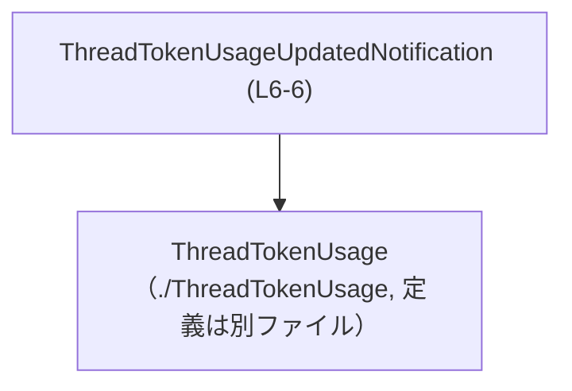
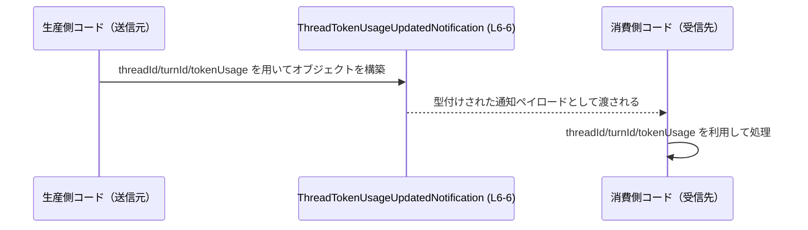

# app-server-protocol/schema/typescript/v2/ThreadTokenUsageUpdatedNotification.ts コード解説

## 0. ざっくり一言

`ThreadTokenUsageUpdatedNotification` という通知ペイロード用の TypeScript 型（型エイリアス）を 1 つだけ定義する、**生成コード**のファイルです (ThreadTokenUsageUpdatedNotification.ts:L1-3, L6-6)。

---

## 1. このモジュールの役割

### 1.1 概要

- このモジュールは、`ThreadTokenUsageUpdatedNotification` 型を定義しています (L6-6)。
- この型は、`threadId`, `turnId`, `tokenUsage` という 3 つのプロパティを持つオブジェクトを表現します (L6-6)。
- `tokenUsage` には別ファイルで定義された `ThreadTokenUsage` 型が使われます (L4-4)。

### 1.2 アーキテクチャ内での位置づけ

このファイルは `schema/typescript/v2` 配下にあり、**プロトコル／スキーマ定義用の TypeScript 型**をまとめるレイヤに属していると考えられますが、用途は名前とディレクトリ構造から推測できる範囲にとどまります。

依存関係は次のとおりです。

- 依存するもの
  - `./ThreadTokenUsage` からインポートされる `ThreadTokenUsage` 型 (L4-4)
- 依存されるもの
  - このチャンクには、どのモジュールがこの型を利用しているかは現れません（不明）。

概念的な依存関係を Mermaid で表すと次のようになります。



### 1.3 設計上のポイント

- **データのみ・ロジックなし**  
  関数やクラスは一切なく、オブジェクト型を定義するだけのモジュールです (L4-6)。
- **生成コード**  
  `// GENERATED CODE! DO NOT MODIFY BY HAND!` と `ts-rs` による生成であることが明示されています (L1-3)。直接編集は想定されていません。
- **プリミティブ ID と別型の組み合わせ**  
  - `threadId`, `turnId` は `string` 型で表現 (L6-6)。
  - `tokenUsage` は、詳細が別ファイルにある `ThreadTokenUsage` 型で表現 (L4, L6)。
- **エラー・並行性**  
  - このファイルは型定義のみで実行時処理を含まないため、このファイル自身が直接エラーを起こしたり、並行実行の問題を生むことはありません。

---

## 2. 主要な機能一覧

このモジュールが提供する「機能」は、型定義 1 つに集約されています。

- `ThreadTokenUsageUpdatedNotification`: スレッドに紐づくトークン使用情報付き通知ペイロードを表すオブジェクト型（命名からの読み取りであり、用途はコードからは断定不可）(L6-6)

---

## 3. 公開 API と詳細解説

### 3.1 型一覧（構造体・列挙体など）

| 名前 | 種別 | 役割 / 用途 | 定義位置（このチャンク内） |
|------|------|-------------|----------------------------|
| `ThreadTokenUsage` | 型（import） | `tokenUsage` プロパティに利用される詳細情報の型。定義は別ファイル `./ThreadTokenUsage` に存在し、このチャンクには現れません。 | ThreadTokenUsageUpdatedNotification.ts:L4-4（import のみ） |
| `ThreadTokenUsageUpdatedNotification` | 型エイリアス | `threadId`, `turnId`, `tokenUsage` をまとめた通知ペイロードのオブジェクト型。 | ThreadTokenUsageUpdatedNotification.ts:L6-6 |

### 3.2 関数詳細（該当なし）

- このファイルには関数・メソッドの定義は一切ありません (L1-6)。  
  したがって、詳細解説の対象となる公開関数も存在しません。

### 3.3 その他の関数

- 該当なし。

### 3.4 型 `ThreadTokenUsageUpdatedNotification` の詳細

#### `export type ThreadTokenUsageUpdatedNotification = { ... }`

**概要**

- 3 つのプロパティを持つオブジェクト型のエイリアスです (L6-6)。
- 命名からは「スレッドのトークン使用量が更新されたことを通知するためのペイロード」と読めますが、実際にどのイベント／API に使われるかはこのチャンクからは分かりません。

**フィールド**

| プロパティ名 | 型 | 説明 | 根拠 |
|-------------|----|------|------|
| `threadId` | `string` | ある「スレッド」を識別する ID。形式や意味はこのチャンクには現れません。 | ThreadTokenUsageUpdatedNotification.ts:L6-6 |
| `turnId` | `string` | ある「ターン」（会話の 1 手番など）を識別する ID と推測されますが、意味はコードからは断定できません。 | ThreadTokenUsageUpdatedNotification.ts:L6-6 |
| `tokenUsage` | `ThreadTokenUsage` | トークン使用量などの詳細を保持する型。定義は別ファイル `./ThreadTokenUsage` にあります。内容はこのチャンクには現れません。 | ThreadTokenUsageUpdatedNotification.ts:L4-4, L6-6 |

**戻り値 / 実行時挙動**

- 型エイリアスであり関数ではないため、「戻り値」という概念はありません。
- この型自体は **コンパイル時の静的型チェック** にのみ関与し、実行時の JS コードには現れません（TypeScript の型システムの一般的な性質）。

**使用例**

`ThreadTokenUsageUpdatedNotification` 型のオブジェクトを生成し、関数に渡す基本的な例です。

```typescript
// ThreadTokenUsageUpdatedNotification と ThreadTokenUsage を型としてインポートする       // 型情報のみを読み込む
import type {
    ThreadTokenUsageUpdatedNotification,                                           // 通知ペイロードの型
} from "./ThreadTokenUsageUpdatedNotification";                                   // このファイル（相対パスは例）

import type { ThreadTokenUsage } from "./ThreadTokenUsage";                       // tokenUsage 部分の型

// 通知を処理する関数の例                                                           // この型を引数に使う
function handleNotification(
    notification: ThreadTokenUsageUpdatedNotification,                            // 3 プロパティを持つオブジェクトが渡される
): void {
    console.log("thread:", notification.threadId);                                // threadId は string として扱える
    console.log("turn:", notification.turnId);                                    // turnId も string
    console.log("usage:", notification.tokenUsage);                               // tokenUsage は ThreadTokenUsage 型
}

// ThreadTokenUsage 値の用意（実際の構造は別ファイルの定義に依存）                 // ここでは仮のプレースホルダ
const tokenUsage: ThreadTokenUsage = {} as ThreadTokenUsage;                      // 実際には適切な値を設定する

// ThreadTokenUsageUpdatedNotification 型のオブジェクトを構築                       // 3 プロパティをすべて指定
const notification: ThreadTokenUsageUpdatedNotification = {
    threadId: "thread-123",                                                       // 任意のスレッド ID
    turnId: "turn-1",                                                             // 任意のターン ID
    tokenUsage,                                                                   // 先ほど用意した ThreadTokenUsage
};

// 関数に渡して利用する                                                              // 型安全にアクセスできる
handleNotification(notification);
```

**Errors / Panics（エラーに関する挙動）**

- この型定義そのものは実行時エラーや例外を引き起こしません。
- コンパイル時には、次のような場合に TypeScript の型エラーになります。
  - `threadId` を指定し忘れる、または `number` など `string` 以外の型を与える。
  - `tokenUsage` に `ThreadTokenUsage` と互換性のないオブジェクトを渡す。
- 実行時に受信する JSON などをこの型として扱う場合、**バリデーションを行わなければ** 実際のデータ構造が異なっていても TypeScript の型だけでは検出できません（TypeScript の一般的な制約）。

**Edge cases（エッジケース）**

この型に関する代表的なエッジケースは、主に「不正な値」や「欠損プロパティ」です。

- **プロパティ欠損**  
  `threadId` / `turnId` / `tokenUsage` のいずれかを省略すると、コンパイルエラーになります (L6-6)。  
  → 3 つとも **必須プロパティ** です。
- **空文字列**  
  `threadId: ""` のような空文字列は、型としては `string` に適合するためコンパイルが通りますが、ID の妥当性はこの型だけでは保証されません。
- **`null` や `undefined`**  
  - `threadId: null` などを指定すると、`string` と互換性がないため型エラーになります。
  - `threadId?: string` のようなオプショナル指定はされていないため、`undefined` を許したい場合は別の型定義が必要です（このファイルには含まれません）。
- **`tokenUsage` の中身**  
  `ThreadTokenUsage` の詳細が不明なため、その中のエッジケースはこのチャンクからは判断できません。

**使用上の注意点**

- **生成コードの編集禁止**  
  冒頭コメントに「手で変更しないこと」が明記されています (L1-3)。  
  振る舞いやフィールドを変更したい場合は、`ts-rs` の入力側（おそらく Rust の型）を変更し、再生成する必要があります。この場所はこのチャンクには現れません。
- **型はコンパイル時のみ有効**  
  実行時にはこの型は消えるため、外部からデータを受け取る際は、別途バリデーションやパース処理が必要です。
- **文字列 ID の妥当性**  
  `threadId` / `turnId` は単に `string` であり、形式（UUID かどうか等）や存在チェックはこの型だけでは担保されません。
- **並行性・スレッド安全性**  
  単なるイミュータブルなオブジェクト型として想定されるため、この型自体に特有の並行性の問題はありません。並行処理に関する挙動は、この型を利用するコード側の設計に依存します。

**Bugs / Security（バグ・セキュリティ観点）**

- **バグになりうる点**
  - 実行時に受け取った未検証のオブジェクトを `as ThreadTokenUsageUpdatedNotification` で型アサーションすると、プロパティ欠損や型不一致があっても実行時エラーとして即座には表面化しない可能性があります。
- **セキュリティ観点**
  - この型自体はデータ構造の表現に過ぎませんが、外部入力（ネットワーク、クライアント等）をこの型として扱う場合、**バリデーション不足による信頼しすぎ** が典型的なリスクになります。
  - 実際にどのような入力経路があるかはこのチャンクには現れません。

---

## 4. データフロー

このファイルは型定義のみを提供し、利用箇所はこのチャンクには現れないため、**具体的なコンポーネント同士のやり取り**は不明です。

ここでは、この型が利用される典型的なパターンを、抽象的なデータフローとして示します（実際のコンポーネント名・構造は別ファイルに依存します）。



- **生産側コード（P）**: `ThreadTokenUsageUpdatedNotification` 型の値を作成する関数やイベントハンドラ（このチャンクには現れません）。
- **N**: 本ファイルで定義された型 (L6-6)。
- **消費側コード（C）**: この通知ペイロードを受け取り、ログ出力・状態更新・他サービスへの転送などを行うコンポーネント（このチャンクには現れません）。

---

## 5. 使い方（How to Use）

### 5.1 基本的な使用方法

この型を他のファイルからインポートして利用する標準的な流れです。

```typescript
// 通知ペイロード型をインポート                                                           // 型情報のみ読み込む
import type {
    ThreadTokenUsageUpdatedNotification,                                             // このファイルで定義された型
} from "./schema/typescript/v2/ThreadTokenUsageUpdatedNotification";

// tokenUsage 部分の型をインポート                                                       // 詳細は別ファイル
import type { ThreadTokenUsage } from "./schema/typescript/v2/ThreadTokenUsage";

// 通知を処理するサービス関数の例                                                         // 引数に型を付ける
function processTokenUsageNotification(
    notification: ThreadTokenUsageUpdatedNotification,                                // 3 プロパティを持つオブジェクト
): void {
    // threadId と turnId にアクセス                                                     // string 型として扱える
    console.log(`Thread ${notification.threadId} / Turn ${notification.turnId}`);
    // tokenUsage の詳細にアクセス                                                       // ThreadTokenUsage に従って利用
    console.log("Token usage:", notification.tokenUsage);
}

// どこかで ThreadTokenUsage の値を構築                                                  // 実際には適切な構造体を生成する
const usage: ThreadTokenUsage = {} as ThreadTokenUsage;

// 通知オブジェクトを構築して関数に渡す                                                   // プロパティをすべて指定
const notification: ThreadTokenUsageUpdatedNotification = {
    threadId: "thread-001",
    turnId: "turn-003",
    tokenUsage: usage,
};

processTokenUsageNotification(notification);                                           // 型安全に利用
```

### 5.2 よくある使用パターン

1. **関数パラメータとして利用**

   - 通知を処理する関数・メソッドの引数型として指定するパターンです（上記例）。
   - これにより、利用側が `threadId` や `tokenUsage` に型安全にアクセスできます。

2. **通知種別のユニオン型に組み込む（概念例）**

   複数種類の通知ペイロードがある場合、それらをユニオン型にまとめる場面が想定されます（下記はあくまで概念例で、このリポジトリ内の別型はこのチャンクには現れません）。

   ```typescript
   // 他の通知型は例示用の仮名                                                            // 実在するかどうかはこのチャンクからは不明
   type OtherNotification = { kind: "other" };                                          // ダミー定義

   type NotificationPayload =
       | ThreadTokenUsageUpdatedNotification                                           // トークン使用通知
       | OtherNotification;                                                            // その他の通知
   ```

### 5.3 よくある間違い

型定義から推測できる、起こりがちな誤用例を示します。

```typescript
// 間違い例: 必須プロパティを省略している
const bad1: ThreadTokenUsageUpdatedNotification = {
    threadId: "thread-1",
    // turnId が欠けている → コンパイルエラー                                          // turnId プロパティが必須
    tokenUsage: {} as ThreadTokenUsage,
};

// 間違い例: 型の不一致（threadId に number を入れている）
const bad2: ThreadTokenUsageUpdatedNotification = {
    threadId: 123,                                                                     // number は string と互換性がない → エラー
    turnId: "turn-1",
    tokenUsage: {} as ThreadTokenUsage,
};

// 正しい例: 3 プロパティをすべて string / ThreadTokenUsage で指定
const good: ThreadTokenUsageUpdatedNotification = {
    threadId: "123",
    turnId: "turn-1",
    tokenUsage: {} as ThreadTokenUsage,
};
```

### 5.4 使用上の注意点（まとめ）

- 3 プロパティ `threadId`, `turnId`, `tokenUsage` は **すべて必須** です (L6-6)。
- このファイルは `ts-rs` による**生成コード**であり、直接編集すると再生成時に上書きされます (L1-3)。
- TypeScript の型は実行時には存在しないため、外部入力を扱う場合は別途バリデーションロジックが必要です。
- この型自体にスレッド安全性や非同期処理の要素はなく、並行処理上の注意はこの型を使う側のコードに依存します。

---

## 6. 変更の仕方（How to Modify）

### 6.1 新しい機能を追加する場合（フィールドの追加など）

- コメントに「Do not edit this file manually」とあるため (L1-3)、**直接このファイルを編集することは推奨されていません**。
- `ThreadTokenUsageUpdatedNotification` に新しいプロパティを追加したい場合の大まかな流れは次のとおりです。
  1. `ts-rs` が生成元としている Rust 側（または他の定義元）で対応する型にフィールドを追加する。  
     → その場所はこのチャンクには現れないため、リポジトリ全体の構成を確認する必要があります。
  2. `ts-rs` のコード生成を再実行し、このファイルを再生成する。
  3. 生成された TypeScript 型を利用するコードを更新し、新フィールドへの対応を行う。

### 6.2 既存の機能を変更する場合（型やプロパティの変更）

- `threadId` を `number` にしたいなど、既存プロパティの型を変えたい場合も、上記と同様に**生成元の定義を変更して再生成**することが前提です (L1-3)。
- 変更時の注意点:
  - 既存の利用箇所がコンパイルエラーになる可能性が高いため、**参照検索**で影響範囲を把握する必要があります。
  - プロトコルとして外部と通信している場合、型変更は**互換性の破壊**につながる可能性があります。このチャンクからは通信相手の情報は不明です。

---

## 7. 関連ファイル

このファイルと直接的に関係するものは、import によって特定できます。

| パス | 役割 / 関係 | 根拠 |
|------|------------|------|
| `./ThreadTokenUsage` | `ThreadTokenUsage` 型の定義を提供するモジュール。このファイルの `tokenUsage` プロパティで利用されます。具体的な内容はこのチャンクには現れません。 | ThreadTokenUsageUpdatedNotification.ts:L4-4 |
| （生成元の Rust ファイルなど） | `ts-rs` が参照する元の型定義。コメントから生成元が存在することはわかりますが、パスや内容はこのチャンクには現れません。 | ThreadTokenUsageUpdatedNotification.ts:L1-3 |

このように、`ThreadTokenUsageUpdatedNotification.ts` は、**型レベルのスキーマ定義**に専念した非常に薄いモジュールであり、コアロジックやエラー処理は別のレイヤに委ねられています。
