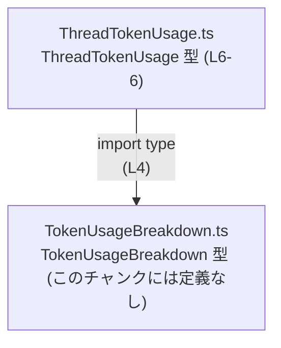
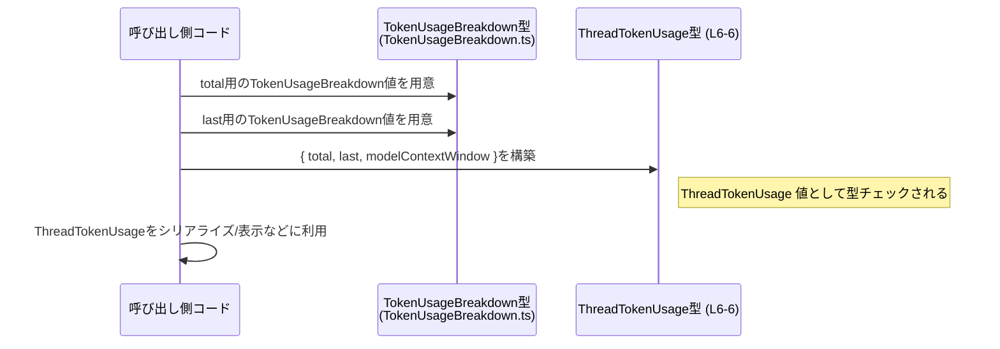

# app-server-protocol/schema/typescript/v2/ThreadTokenUsage.ts

## 0. ざっくり一言

スレッド単位のトークン使用量を表現するための **型エイリアス（オブジェクト型）** を定義している自動生成ファイルです（`ThreadTokenUsage.ts:L1-3, L6-6`）。

---

## 1. このモジュールの役割

### 1.1 概要

- このモジュールは、`ThreadTokenUsage` という型エイリアスを公開し、1つのスレッドにおけるトークン消費状況をまとめて表現できるようにしています（`ThreadTokenUsage.ts:L6-6`）。
- フィールドとして、2つの `TokenUsageBreakdown` 型（`total`, `last`）と、`number | null` の `modelContextWindow` を持ちます（`ThreadTokenUsage.ts:L4, L6-6`）。
- ファイル先頭のコメントから、この型定義は `ts-rs` によって自動生成されており、手動編集は想定されていません（`ThreadTokenUsage.ts:L1-3`）。

### 1.2 アーキテクチャ内での位置づけ

このファイル内で確認できる依存関係は、`TokenUsageBreakdown` への型依存のみです（`ThreadTokenUsage.ts:L4, L6-6`）。



- `ThreadTokenUsage` は `TokenUsageBreakdown` 型に依存しており、`total` と `last` フィールドとしてそれを利用します。
- `ThreadTokenUsage` をどのモジュールが利用しているかは、このチャンクからは分かりません（他ファイル参照がないため）。

### 1.3 設計上のポイント

- **自動生成コード**  
  - ファイル先頭コメントで自動生成であることが明示されており、手動編集は非推奨です（`ThreadTokenUsage.ts:L1-3`）。
- **状態を持たない型定義のみ**  
  - ランタイムの処理ロジックやクラスは存在せず、純粋に型定義だけが含まれます（`ThreadTokenUsage.ts:L4-6`）。
- **型の責務の分割**  
  - トークン使用量の詳細表現は `TokenUsageBreakdown` に委譲し、本ファイルはそれらを組み合わせた「スレッド単位の集約ビュー」を定義しています（`ThreadTokenUsage.ts:L4, L6-6`）。
- **null 許容のコンテキストウィンドウ**  
  - `modelContextWindow` が `number | null` となっており、「数値で表現される場合と、存在しない/未設定の可能性がある」ことを型レベルで表現しています（`ThreadTokenUsage.ts:L6-6`）。

---

## 2. 主要な機能一覧

このファイルには関数はなく、1つの型エイリアスが提供する「表現上の機能」を整理します（`ThreadTokenUsage.ts:L6-6`）。

- スレッド全体のトークン使用量: `total` フィールドで表現（型: `TokenUsageBreakdown`）
- 最終要素（例えば「最後のメッセージ」など）のトークン使用量: `last` フィールドで表現（型: `TokenUsageBreakdown`）
- モデルのコンテキストウィンドウサイズ: `modelContextWindow` フィールドで数値または `null` として保持（型: `number | null`）

※ `total` / `last` が「何を集計したものか」の厳密な意味は、このチャンクのコードからは分かりません。名前から推測は可能ですが、ここでは断定しません。

---

## 3. 公開 API と詳細解説

### 3.0 コンポーネント一覧（インベントリー）

このチャンクに現れる型・依存関係の一覧です。

| 名前                  | 種別         | 公開範囲     | 役割 / 用途                                             | 定義位置 / 根拠 |
|-----------------------|--------------|--------------|----------------------------------------------------------|-----------------|
| `ThreadTokenUsage`    | 型エイリアス | `export`あり | スレッド単位のトークン使用量情報をまとめたオブジェクト型 | `ThreadTokenUsage.ts:L6-6` |
| `TokenUsageBreakdown` | 型（外部）   | importのみ   | トークン使用量の詳細を表現する型。`total`/`last`の型に利用 | `ThreadTokenUsage.ts:L4, L6-6` |

`TokenUsageBreakdown` の具体的な構造は、このチャンクには現れていません。

### 3.1 型一覧（構造体・列挙体など）

#### `ThreadTokenUsage`（型エイリアス）

```typescript
export type ThreadTokenUsage = {
    total: TokenUsageBreakdown,
    last: TokenUsageBreakdown,
    modelContextWindow: number | null,
};
```

| 名前               | 種別         | 役割 / 用途                                                                 | 定義位置 |
|--------------------|--------------|------------------------------------------------------------------------------|----------|
| `ThreadTokenUsage` | 型エイリアス | トークン使用情報を 3 フィールド（`total`, `last`, `modelContextWindow`）に集約する | `ThreadTokenUsage.ts:L6-6` |

**フィールド構造**

| フィールド名          | 型                     | 説明（コードから読み取れる範囲）                                                          |
|-----------------------|------------------------|-------------------------------------------------------------------------------------------|
| `total`               | `TokenUsageBreakdown`  | スレッドに関連する何らかのトークン使用量の「合計」を表す詳細構造。意味の詳細は不明。     |
| `last`                | `TokenUsageBreakdown`  | スレッドに関連する何らかのトークン使用量の「最後の要素」の情報を表す詳細構造。意味は不明。|
| `modelContextWindow`  | `number \| null`       | モデルのコンテキストウィンドウサイズなど、数値情報または値が存在しない状態を表す。       |

> 上記の「合計」「最後の要素」という表現はフィールド名からの素直な読み取りであり、仕様上の厳密な定義はこのチャンクからは分かりません。

**型システム上のポイント**

- `TokenUsageBreakdown` は `import type` として読み込まれており、このファイルは実行時にはその型情報を参照しない純粋な型モジュールです（`ThreadTokenUsage.ts:L4`）。
- `modelContextWindow: number | null` によって、「数値が存在する場合」と「存在しない場合（null）」を区別できるため、呼び出し側では必ず null チェックを行う必要があります。

**Edge cases（エッジケース）**

`ThreadTokenUsage` 自体は型定義ですが、この型に従った値を扱う際の典型的なエッジケースとしては次が挙げられます。

- `modelContextWindow` が `null` の場合  
  - 型として `number | null` が許可されているため、数値であることを前提に `modelContextWindow` を使用すると、実行時エラーになる可能性があります。
- `total` または `last` の部分的なフィールド欠如  
  - `TokenUsageBreakdown` の構造は不明ですが、`ThreadTokenUsage` の型から見る限り `total` / `last` 自体が `undefined` になることは許可されていません。  
  - したがって、呼び出し側が `ThreadTokenUsage` 型を満たす値を作る際には、`total` と `last` を必ず設定する必要があります。

**使用上の注意点**

- 自動生成ファイルのため、**このファイルを直接編集しない** 前提で利用する必要があります（`ThreadTokenUsage.ts:L1-3`）。
- `modelContextWindow` を使用するコードでは、`null` チェック（`if (usage.modelContextWindow != null) { ... }` など）を行うことが前提条件になります。
- この型は純粋なデータコンテナであり、副作用やスレッド非安全性の要因を持ちません。そのため、どのスレッドから参照しても型レベルでは安全です。

### 3.2 関数詳細（最大 7 件）

このファイルには **関数定義が存在しません**（`ThreadTokenUsage.ts:L1-6`）。  
そのため、本セクションで説明すべき公開関数はありません。

### 3.3 その他の関数

- 該当なし（関数が1つも定義されていません）。

---

## 4. データフロー

このファイルには実行時ロジックはありませんが、`ThreadTokenUsage` 型に従って値を構築・利用する際の **概念的なデータの流れ** を示します。



- この図は「ThreadTokenUsage 型の値を作るには `total` / `last` の `TokenUsageBreakdown` と `modelContextWindow` の数値 or null を用意し、それらを1つのオブジェクトにまとめる」という **型レベルの関係** を表現しています。
- 実際にどのモジュールがこの値を生成・消費するかは、このチャンクからは分かりません。

---

## 5. 使い方（How to Use）

### 5.1 基本的な使用方法

`ThreadTokenUsage` 型の値を作成し、何らかの処理に渡すという基本的な使い方の例です。  
`TokenUsageBreakdown` の構造は不明なため、ここではプレースホルダコメントで表現します。

```typescript
import type { ThreadTokenUsage } from "./ThreadTokenUsage";           // このファイルで定義された型をインポート
import type { TokenUsageBreakdown } from "./TokenUsageBreakdown";     // フィールドで使われる型をインポート

// TokenUsageBreakdown 型の値を用意する（実際の構造は TokenUsageBreakdown.ts を参照）
const totalBreakdown: TokenUsageBreakdown = /* ... */;
const lastBreakdown: TokenUsageBreakdown = /* ... */;

// ThreadTokenUsage 型の値を構築する
const usage: ThreadTokenUsage = {
    total: totalBreakdown,         // スレッド全体のトークン使用情報
    last: lastBreakdown,           // 最後の要素のトークン使用情報
    modelContextWindow: 8192,      // 例えばコンテキストウィンドウサイズを表す数値
    // modelContextWindow: null    // 未設定・不明な場合は null も許容される
};

// usage をログ出力・APIレスポンス・画面表示などに利用できる
console.log(usage);
```

この例では、`usage` 変数に対して TypeScript の型チェックが行われ、`total` / `last` / `modelContextWindow` の型が合致しているかが検証されます。

### 5.2 よくある使用パターン

推測を混ぜずに言える範囲でのパターンは次のとおりです。

- **型注釈として利用**  
  関数の引数や戻り値に `ThreadTokenUsage` を指定することで、「この関数はスレッドのトークン使用量情報を扱う」という契約を明示できます。

```typescript
import type { ThreadTokenUsage } from "./ThreadTokenUsage";

// ThreadTokenUsage を引数として受け取り、何らかの処理を行う関数の例
function handleThreadUsage(usage: ThreadTokenUsage) {
    // usage.total, usage.last, usage.modelContextWindow を型安全に扱える
}
```

### 5.3 よくある間違い

この型に関して起こり得る誤用を、型情報から推測できる範囲で示します。

```typescript
import type { ThreadTokenUsage } from "./ThreadTokenUsage";

// 間違い例: modelContextWindow を number として決め打ちしている
function printContextWindowWrong(usage: ThreadTokenUsage) {
    // console.log(usage.modelContextWindow.toFixed(0)); // コンパイルエラー:
    // 'number | null' 型のオブジェクトを 'number' 型のパラメータに割り当てることはできません
}

// 正しい例: null を考慮して分岐する
function printContextWindow(usage: ThreadTokenUsage) {
    if (usage.modelContextWindow != null) {
        console.log(usage.modelContextWindow.toFixed(0));   // number として安全に利用できる
    } else {
        console.log("modelContextWindow is not set");
    }
}
```

### 5.4 使用上の注意点（まとめ）

- このファイルは自動生成されており、手動での編集は前提とされていません（`ThreadTokenUsage.ts:L1-3`）。
- `modelContextWindow` は `number | null` であるため、利用時には **必ず null を考慮する** 必要があります。
- `total` / `last` は `TokenUsageBreakdown` 型として必須フィールドです。`ThreadTokenUsage` 型を満たすためには、この2つを省略しないことが前提条件となります。
- 型定義のみで実行時ロジックを含まないため、パフォーマンスやスレッド安全性に関する問題はこのファイル単体では発生しません。

---

## 6. 変更の仕方（How to Modify）

### 6.1 新しい機能を追加する場合

- ファイル先頭のコメントにより、このファイルは `ts-rs` による **自動生成** であり、直接編集しないことが明示されています（`ThreadTokenUsage.ts:L1-3`）。
- そのため、`ThreadTokenUsage` にフィールドを追加・変更したい場合は、**生成元（おそらく Rust 側など）で定義されている元の型** を変更し、生成プロセスを再実行する必要があります。
- このチャンクでは生成元の場所は特定できないため、具体的なファイルパスやコマンドは分かりません。

一般的な手順（概念レベル）

1. 生成元の型定義（Rust の構造体など）を変更する。
2. `ts-rs` 等のコード生成ツールを再実行する。
3. 新しい `ThreadTokenUsage.ts` が生成され、変更が反映される。

### 6.2 既存の機能を変更する場合

`ThreadTokenUsage` の構造を変更する場合の注意点を、このファイルから読み取れる範囲でまとめます。

- **影響範囲の確認**  
  - `ThreadTokenUsage` 型を利用している TypeScript コード全体に影響します。  
  - 特に `modelContextWindow` の型変更（例えば `number | null` → `number`）などは、null チェックに依存しているコードを破壊する可能性があります。
- **契約としての前提条件**  
  - `total` / `last` が必須である契約を緩める（`TokenUsageBreakdown` を `TokenUsageBreakdown | null` にするなど）と、既存コードが「必ず存在する」と仮定している前提を崩す可能性があります。
- **テストの必要性**  
  - 型が変わるとコンパイルエラーとして多くの利用箇所が浮かび上がるため、それらを修正した後にはユニットテスト・統合テストでシリアライズ／デシリアライズや API レスポンス形式が期待どおりかを確認する必要があります。

---

## 7. 関連ファイル

このチャンクから直接参照されているファイルは次の1つです。

| パス                         | 役割 / 関係                                                                 |
|------------------------------|------------------------------------------------------------------------------|
| `./TokenUsageBreakdown`      | `ThreadTokenUsage` の `total` / `last` フィールドで使用される型を定義しているモジュール（`ThreadTokenUsage.ts:L4, L6-6`）。このチャンクにはその中身は現れていません。 |

テストコードやその他の関連ユーティリティについては、このチャンクには現れていないため不明です。
