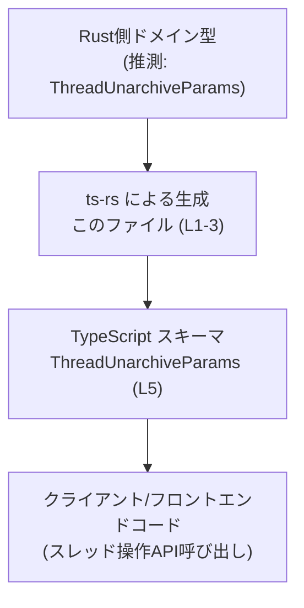
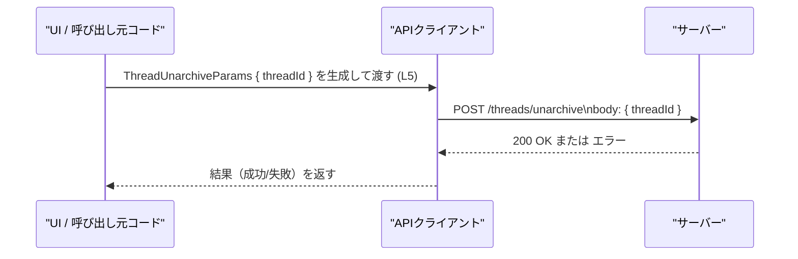

# app-server-protocol/schema/typescript/v2/ThreadUnarchiveParams.ts

## 0. ざっくり一言

`ThreadUnarchiveParams` は、スレッドの「アーカイブ解除」操作に使われると考えられる、`threadId` を 1 つだけ持つパラメータ用の TypeScript 型定義です（根拠: `ThreadUnarchiveParams.ts:L5-5`）。  
このファイルは `ts-rs` によって自動生成されており、手動での編集は禁止されています（根拠: `ThreadUnarchiveParams.ts:L1-1, L3-3`）。

---

## 1. このモジュールの役割

### 1.1 概要

- このモジュールは、スレッドを「アンアーカイブ（アーカイブ解除）」する際に必要となるパラメータを表す TypeScript 型 `ThreadUnarchiveParams` を提供します（名前とフィールド名からの解釈ですが、コードから利用箇所は分かりません）。
- 型は単一のプロパティ `threadId: string` を持つオブジェクト型として定義されています（根拠: `ThreadUnarchiveParams.ts:L5-5`）。
- ファイル全体には実行時ロジック（関数・クラスなど）は一切なく、純粋な型定義のみを含みます（根拠: `ThreadUnarchiveParams.ts:L1-5`）。

### 1.2 アーキテクチャ内での位置づけ

- ファイルコメントから、この型定義は `ts-rs` によって自動生成されていることが分かります（根拠: `ThreadUnarchiveParams.ts:L1-1, L3-3`）。
- `ts-rs` は Rust 側の型定義から TypeScript 型を生成するクレートとして知られており、一般的な利用形態から考えると、Rust サーバー側の「スレッドアンアーカイブ用パラメータ型」と対応している可能性が高いです。ただし、この Rust 側定義は本チャンクには現れていません。
- `schema/typescript/v2` というパスから、このファイルは「v2 版プロトコルの TypeScript スキーマ群」の一部として、クライアントコードから共通に利用されることが想定されますが、具体的な利用モジュールはこのチャンクだけからは特定できません。

上記を踏まえた、想定される高レベルの位置づけイメージを図示します（利用先は例示であり、本チャンクには現れません）。



### 1.3 設計上のポイント

- **自動生成コード**  
  - 冒頭コメントで「GENERATED CODE! DO NOT MODIFY BY HAND!」および「Do not edit this file manually.」と明記されています（根拠: `ThreadUnarchiveParams.ts:L1-1, L3-3`）。  
  - 設計上、変更は元となる定義（おそらく Rust 側）で行い、このファイルは再生成する前提になっています。

- **状態を持たない型定義のみ**  
  - 実行時の状態やロジックを持つクラス・関数はなく、`export type` による型エイリアス定義 1 つだけで構成されています（根拠: `ThreadUnarchiveParams.ts:L5-5`）。

- **型安全性（TypeScript 特有の観点）**  
  - `threadId` は `string` 型として必須プロパティになっており、`undefined` や `number` など他の型を代入するとコンパイル時エラーになります（根拠: `ThreadUnarchiveParams.ts:L5-5`）。
  - 実行時のバリデーションは行われないため、実際の文字列内容（空文字や不正な ID など）については利用側のロジックで検証する必要があります。

- **並行性・エラー処理**  
  - このファイル自体には実行時処理が存在しないため、直接的なエラー処理や並行性（非同期処理やスレッドセーフティ）に関するロジックは含まれていません。

---

## 2. 主要な機能一覧

このモジュールが提供する機能は 1 つです。

- `ThreadUnarchiveParams` 型: スレッドアンアーカイブ操作のパラメータを表すオブジェクト型（threadId を 1 つ保持）

（機能の用途は型名とプロパティ名からの解釈であり、実際の呼び出し元はこのチャンクには現れません。）

---

## 3. 公開 API と詳細解説

### 3.1 型一覧（構造体・列挙体など）

| 名前                   | 種別                           | 役割 / 用途                                                                                                          | 定義位置                          |
|------------------------|--------------------------------|----------------------------------------------------------------------------------------------------------------------|-----------------------------------|
| `ThreadUnarchiveParams` | 型エイリアス（オブジェクト型） | プロパティ `threadId: string` を持つオブジェクトの型。スレッドアンアーカイブ操作のパラメータとして利用されると解釈できる | `ThreadUnarchiveParams.ts:L5-5` |

`ThreadUnarchiveParams` の構造は次の通りです（根拠: `ThreadUnarchiveParams.ts:L5-5`）。

```typescript
export type ThreadUnarchiveParams = {
    threadId: string;  // スレッドを一意に識別するIDを表すと考えられる
};
```

> 注: `threadId` の意味（どのようなフォーマットか、どの範囲で一意かなど）は、このチャンクのコードからは分かりません。名称からそのように解釈できるにとどまります。

#### 言語固有の安全性

- **コンパイル時の型チェック**  
  - `threadId` は `string` 型として必須指定されているため、次のようなコードは TypeScript コンパイラによってエラーになります（例・概念説明）。
    - プロパティが欠けている: `{}` を `ThreadUnarchiveParams` として扱う
    - 型が異なる: `{ threadId: 123 }` のように `number` を渡す
- **実行時チェックはない**  
  - TypeScript の型はコンパイル時のみで、実行時には消えるため、`threadId` の内容（空文字・存在しない ID など）は別途アプリケーション側で検証する必要があります。

#### 並行性・エラー

- この型は単なるデータ構造の型であり、非同期処理やエラー制御を直接含みません。  
- この型を引数に取る関数（API クライアントなど）側で、プロミスの失敗やネットワークエラーなどが扱われることになりますが、それらはこのチャンクには現れません。

### 3.2 関数詳細（最大 7 件）

本ファイルには関数・メソッドが 1 つも定義されていません（根拠: `ThreadUnarchiveParams.ts:L1-5`）。  
そのため、このセクションで詳述すべき「関数のシグネチャやアルゴリズム」は存在しません。

### 3.3 その他の関数

同様に、ヘルパー関数やラッパー関数も定義されていません。

---

## 4. データフロー

このモジュール単体には処理フローはありませんが、典型的には「スレッドアンアーカイブ API 呼び出し」のパラメータとして利用される形が想定されます（名称からの利用例であり、実際の呼び出しコードはこのチャンクには現れません）。

### 想定される代表的なシナリオ

1. UI や別モジュールがアンアーカイブしたいスレッドの `threadId` を決定する。
2. `ThreadUnarchiveParams` 型に従って `{ threadId }` オブジェクトを構築する。
3. API クライアントがそのオブジェクトを HTTP リクエストボディ等としてサーバーに送信する。
4. サーバー側がリクエストを受け取り、対応するスレッドのアーカイブ解除処理を行う。

これをシーケンス図として表すと次のようになります（`ThreadUnarchiveParams` の定義は `L5` に存在します）。



> 繰り返しになりますが、上記の API パスや HTTP メソッド名は「よくある設計例」であり、このチャンクのコードから読み取れるものではありません。

---

## 5. 使い方（How to Use）

### 5.1 基本的な使用方法

`ThreadUnarchiveParams` を利用する典型的なフローとして、「API クライアントに渡すリクエストパラメータを型安全に構築する」例を示します。

```typescript
// ThreadUnarchiveParams 型をインポートする
// 実際のパスはプロジェクト構成によります。この例は同じディレクトリと仮定しています。
import type { ThreadUnarchiveParams } from "./ThreadUnarchiveParams";

// スレッドをアンアーカイブする関数の例
async function unarchiveThread(apiClient: { post: (path: string, body: unknown) => Promise<void> }, threadId: string) {
    // ThreadUnarchiveParams 型に従うオブジェクトを作成する
    const params: ThreadUnarchiveParams = {
        threadId,  // string 型の ID をそのまま設定
    };

    // API クライアントにパラメータを渡してリクエストを送る
    await apiClient.post("/threads/unarchive", params);
}
```

- `params` の型を `ThreadUnarchiveParams` にすることで、`threadId` の付け忘れや型間違いをコンパイル時に検出できます。
- `apiClient` の具体的な型・実装はこのファイルからは分からないため、例では最小限の想定インターフェースにとどめています。

### 5.2 よくある使用パターン

1. **インラインオブジェクトとして渡す**

```typescript
import type { ThreadUnarchiveParams } from "./ThreadUnarchiveParams";

async function unarchiveThreadInline(apiClient: { post: (path: string, body: ThreadUnarchiveParams) => Promise<void> }, id: string) {
    await apiClient.post("/threads/unarchive", { threadId: id });  // ここで型チェックされる
}
```

- 関数シグネチャで `body: ThreadUnarchiveParams` と指定しておくと、呼び出し側は必ず `threadId: string` を含むオブジェクトを渡す必要があります。

1. **別のドメイン型から変換して渡す**

```typescript
type Thread = {
    id: string;
    // ... 他のフィールド
};

function toUnarchiveParams(thread: Thread): ThreadUnarchiveParams {
    return { threadId: thread.id };  // Thread.id をそのまま threadId として利用
}
```

- アプリケーション内部のドメイン型と通信プロトコル用の型を変換する層を置くことで、境界が明確になります。

### 5.3 よくある間違い

#### 1. プロパティ名のタイプミス

```typescript
import type { ThreadUnarchiveParams } from "./ThreadUnarchiveParams";

const params: ThreadUnarchiveParams = {
    // 間違い: プロパティ名を typo している
    // threadID: "abc123", // コンパイルエラー: 'threadID' は ThreadUnarchiveParams に存在しない
    threadId: "abc123",      // 正しい
};
```

- **誤り**: `threadID` のように大文字/小文字を誤る。
- **正しい**: 型定義どおり `threadId` と書く必要があります（根拠: `ThreadUnarchiveParams.ts:L5-5`）。

#### 2. 型の不一致

```typescript
const paramsInvalid: ThreadUnarchiveParams = {
    // 間違い: number を渡している
    // threadId: 123, // コンパイルエラー: number は string に代入できない
    threadId: String(123),   // 正しい: string 型に変換する
};
```

- `threadId` は `string` 型である必要があり、`number` や `null` を直接渡すとコンパイルエラーになります（根拠: `ThreadUnarchiveParams.ts:L5-5`）。

### 5.4 使用上の注意点（まとめ）

- **前提条件**
  - `threadId` は必須プロパティであり、`ThreadUnarchiveParams` 型のオブジェクトでは常に存在している必要があります（根拠: `ThreadUnarchiveParams.ts:L5-5`）。
  - `threadId` の具体的なフォーマット（UUID、数値文字列など）はこのファイルからは分からないため、サーバー側仕様に合わせて値を用意する必要があります。

- **エッジケース**
  - 空文字 (`""`) や極端に長い文字列などについて、型レベルでは制限されません。これらが許容されるかどうかはサーバー実装依存であり、このチャンクからは判断できません。
  - `null` や `undefined` は `string` に代入できないため、コンパイル時に弾かれますが、`string | null` などに拡張したい場合は型定義の変更（および再生成）が必要になります。

- **セキュリティ**
  - この型自体はバリデーションやサニタイズを行いません。  
    - クライアント側でユーザー入力をそのまま `threadId` に入れる場合、サーバー側で適切な検証・認可チェックを行う必要があります。
  - ID 推測攻撃などに対しては、サーバー側で「アクセス可能なスレッドかどうか」のチェックを行う必要があり、それはこの型の範囲外です。

- **並行性・パフォーマンス**
  - 単なるデータ型であり、直接的な並行性やパフォーマンス上の懸念はありません。
  - 大量のリクエストにおける扱いなどは、これを利用する API クライアント/サーバー側の実装に依存します。

---

## 6. 変更の仕方（How to Modify）

### 6.1 新しい機能を追加する場合

このファイルは `ts-rs` による自動生成コードであり、「手動で編集してはならない」と明記されています（根拠: `ThreadUnarchiveParams.ts:L1-1, L3-3`）。  
そのため、新しいフィールドや機能を追加したい場合は、次のような手順が想定されます。

1. **元となる定義を変更する**
   - 一般的な `ts-rs` の利用形態から、元定義は Rust 側の構造体や型である可能性が高いですが、このチャンクにはその定義は現れていません。
   - プロジェクト内の Rust コードベース（例: `app-server-protocol` の Rust 版スキーマ）を探し、対応する `ThreadUnarchiveParams`（もしくは同等の名前）の型定義にフィールドを追加します。

2. **`ts-rs` による再生成を実行する**
   - プロジェクトのビルド/コード生成手順に従い、TypeScript スキーマを再生成します。
   - これにより、本ファイルの `export type ThreadUnarchiveParams` に新しいフィールドが反映されます。

3. **呼び出し側の修正**
   - 追加したフィールドは TypeScript 側でも必須/任意などの指定が反映されるため、クライアントコードで `ThreadUnarchiveParams` を利用している箇所を更新します。

### 6.2 既存の機能を変更する場合

例えば `threadId` の型を変更したい場合や、プロパティ名を変えたい場合についても、基本方針は同じです。

- **影響範囲の確認**
  - `ThreadUnarchiveParams` を参照している TypeScript コードを検索し、その利用箇所への影響を確認します。
  - Rust 側の対応する型（存在する場合）を同様に検索し、サーバー側の処理への影響を確認する必要があります（ただし、Rust 側コードはこのチャンクには現れていません）。

- **契約（前提条件）の維持**
  - `threadId` の意味（何を識別する ID か）が変更される場合、API の契約が変わることになるため、クライアント・サーバー間で合意されたプロトコルを更新する必要があります。
  - 型をより広くする（例: `string` → `string | null`）場合は、既存コードが null を想定していない可能性がある点に注意が必要です。

- **テスト**
  - このチャンクにはテストコードは含まれていませんが、プロジェクト全体としては、スレッドアンアーカイブ機能のテスト（単体テスト・統合テストなど）を更新する必要があります。

---

## 7. 関連ファイル

このチャンクには `ThreadUnarchiveParams.ts` 以外のファイル情報や import/export は現れていません（根拠: `ThreadUnarchiveParams.ts:L1-5`）。  
そのため、直接の関連ファイルをコードから特定することはできません。

推測ベースで考えられる関連ファイルの例を挙げることはできますが、実在は保証できないため、「不明」として扱います。

| パス | 役割 / 関係 |
|------|------------|
| （不明） | Rust 側の元定義ファイル。`ts-rs` がこのファイルを生成する際のソースである可能性がありますが、このチャンクには現れません。 |
| （不明） | `ThreadUnarchiveParams` を import して実際に API 呼び出しを行うクライアントコード。具体的な場所は、このチャンクからは分かりません。 |

---

以上が、`app-server-protocol/schema/typescript/v2/ThreadUnarchiveParams.ts` のコードから読み取れる範囲での、構造・役割・利用方法の整理になります。
