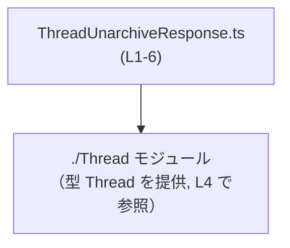
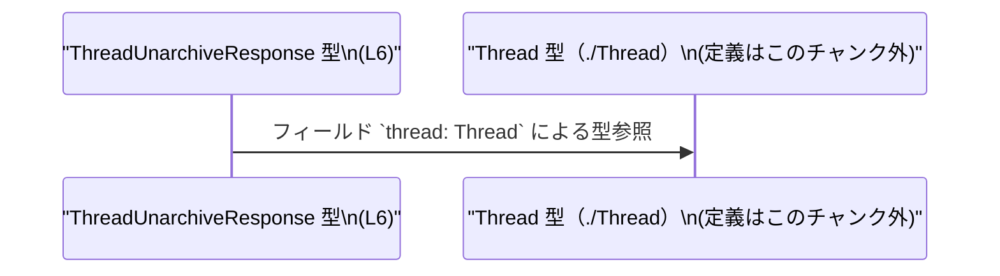

# app-server-protocol/schema/typescript/v2/ThreadUnarchiveResponse.ts コード解説

## 0. ざっくり一言

このファイルは、`Thread` 型を 1 つだけ含むオブジェクト型 `ThreadUnarchiveResponse` を定義する、ts-rs による自動生成の TypeScript 型定義ファイルです。`thread` プロパティが必須であるレスポンスオブジェクトの形を表現します。  
（根拠: 自動生成コメントと型定義の存在 `ThreadUnarchiveResponse.ts:L1-3, L6`）

---

## 1. このモジュールの役割

### 1.1 概要

- このモジュールは、`Thread` 型をフィールドとして含むレスポンスオブジェクト `ThreadUnarchiveResponse` の型を提供します。  
  （根拠: `export type ThreadUnarchiveResponse = { thread: Thread, };` `ThreadUnarchiveResponse.ts:L6`）
- 型は ts-rs によって生成されており、手動で編集しないことが明示されています。  
  （根拠: `// GENERATED CODE! DO NOT MODIFY BY HAND!` などのコメント `ThreadUnarchiveResponse.ts:L1-3`）
- `import type` を使っているため、このモジュールは `Thread` に対して**型レベルの依存のみ**を持ち、JavaScript 出力には影響しません。  
  （根拠: `import type { Thread } from "./Thread";` `ThreadUnarchiveResponse.ts:L4`）

> 型名からは「スレッドのアンアーカイブ操作のレスポンス」を表す用途が想定されますが、実際の API 名や利用箇所はこのチャンクには現れません。

### 1.2 アーキテクチャ内での位置づけ

このモジュールの依存関係は、同じディレクトリ階層にある `./Thread` モジュールに対する型依存のみです。  
（根拠: `import type { Thread } from "./Thread";` `ThreadUnarchiveResponse.ts:L4`）



- `ThreadUnarchiveResponse.ts` は `Thread` 型を利用してレスポンスオブジェクトの構造を定義します。  
- `./Thread` 側の実際の定義内容や依存関係は、このチャンクには現れません（不明）。

### 1.3 設計上のポイント

- **自動生成コード**  
  - ts-rs により生成されており、手動編集を禁止するコメントがファイル先頭に含まれています。  
    （根拠: `// GENERATED CODE! DO NOT MODIFY BY HAND!` `ThreadUnarchiveResponse.ts:L1`）
- **型レベルのみのモジュール**  
  - `import type` と `export type` のみで構成され、関数やクラス、実行時ロジックは含まれていません。  
    （根拠: ファイル内に型定義以外の構文が存在しない `ThreadUnarchiveResponse.ts:L4-6`）
- **単純なオブジェクト型としてのレスポンス表現**  
  - `ThreadUnarchiveResponse` は `thread` プロパティ 1 つだけを持つオブジェクト型です。  
    （根拠: `export type ThreadUnarchiveResponse = { thread: Thread, };` `ThreadUnarchiveResponse.ts:L6`）
- **必須プロパティ**  
  - `thread` には `?` や `| undefined` が付いておらず、TypeScript 上は必須プロパティです。  
    （根拠: `thread: Thread` の記述 `ThreadUnarchiveResponse.ts:L6`）

---

## 2. 主要な機能一覧

このファイルはロジックを持たず、型定義のみを提供します。機能は次の 2 点に集約されます。

- `Thread` 型の型インポート: `./Thread` モジュールから `Thread` 型を型専用として参照する。  
  （根拠: `import type { Thread } from "./Thread";` `ThreadUnarchiveResponse.ts:L4`）
- `ThreadUnarchiveResponse` 型定義: `thread: Thread` を持つレスポンスオブジェクト型をエクスポートする。  
  （根拠: `export type ThreadUnarchiveResponse = { thread: Thread, };` `ThreadUnarchiveResponse.ts:L6`）

---

## 3. 公開 API と詳細解説

### 3.1 型一覧（構造体・列挙体など）

このファイル内のコンポーネント（型）のインベントリです。

| 名前 | 種別 | 定義位置 | 役割 / 用途 |
|------|------|----------|-------------|
| `ThreadUnarchiveResponse` | 型エイリアス（オブジェクト型） | `ThreadUnarchiveResponse.ts:L6` | `thread: Thread` を 1 つだけ含むレスポンスオブジェクト型。アンアーカイブ後のスレッド情報をまとめて返す用途が想定されます（用途は名称からの推測であり、このチャンクからは断定できません）。 |
| `Thread` | 型（外部モジュール） | `ThreadUnarchiveResponse.ts:L4` でインポート | スレッドを表す型と推定されますが、実体は `./Thread` モジュール側にあり、このチャンクには現れません。`ThreadUnarchiveResponse` の `thread` プロパティの型として利用されます。 |

> 補足: このファイルは `ThreadUnarchiveResponse` 型のみをエクスポートします。`Thread` は再エクスポートされません。  
> （根拠: `export` は `ThreadUnarchiveResponse` だけに付与されている `ThreadUnarchiveResponse.ts:L6`）

### 3.2 関数詳細（最大 7 件）

このファイルには関数・メソッド・クラスコンストラクタなど、実行時に呼び出されるロジックは定義されていません。  
（根拠: ファイル内容がコメント、`import type`、`export type` のみである `ThreadUnarchiveResponse.ts:L1-6`）

したがって、このセクションで詳細解説すべき関数は存在しません。

### 3.3 その他の関数

同様に、補助的な関数やラッパー関数も存在しません。  
（根拠: 関数定義構文（`function`、`=>` を伴う変数宣言など）がファイル内に存在しない `ThreadUnarchiveResponse.ts:L1-6`）

---

## 4. データフロー

このファイルは型定義のみのため、**実行時処理のフロー**は読み取れませんが、型レベルの依存関係としての「データ構造の関係」は次のように整理できます。

- `ThreadUnarchiveResponse` 型は `thread` プロパティを通じて `Thread` 型に依存します。  
  （根拠: `export type ThreadUnarchiveResponse = { thread: Thread, };` `ThreadUnarchiveResponse.ts:L6`）
- すなわち、「レスポンスオブジェクトは常に 1 つの `Thread` データを内包する」という形が型レベルで表現されています。



- この図は、**コンパイル時の型依存関係**を表しており、実行時の関数呼び出し順序などはこのファイルからは分かりません（不明）。

---

## 5. 使い方（How to Use）

### 5.1 基本的な使用方法

`ThreadUnarchiveResponse` は、`Thread` 型を含むレスポンスオブジェクトの**形**を TypeScript 上で表現するために利用できます。

以下は、別モジュールからこの型を利用する例です。インポートパスはあくまで例であり、実際のパス構成はこのチャンクからは分かりません（仮のものです）。

```typescript
// 仮のパス例: 実際のパスはプロジェクト構成に合わせて変更する
import type { Thread } from "../schema/typescript/v2/Thread";                    // ./Thread モジュールで定義されている Thread 型をインポート
import type { ThreadUnarchiveResponse } from "../schema/typescript/v2/ThreadUnarchiveResponse"; // このファイルで定義された型エイリアスをインポート

// Thread 型の値を受け取って ThreadUnarchiveResponse を組み立てる関数の例
function buildUnarchiveResponse(thread: Thread): ThreadUnarchiveResponse {       // 引数 thread は Thread 型
    return {                                                                     // ThreadUnarchiveResponse 型のオブジェクトを返す
        thread,                                                                  // 必須プロパティ thread に Thread 型の値をそのまま設定する
    };
}

// どこか別の場所での利用例（非同期処理など）
async function handleUnarchive() {                                               // スレッドのアンアーカイブを処理する仮の関数
    const thread: Thread = await fetchThreadFromServer();                        // Thread 型の値を取得する（fetchThreadFromServer は仮の関数）
    const response: ThreadUnarchiveResponse = buildUnarchiveResponse(thread);    // 型安全にレスポンスオブジェクトを構築する
    console.log(response.thread);                                                // Thread 型として IDE で補完が効く
}
```

この例では、`ThreadUnarchiveResponse` を通じて「レスポンスとして必ず `thread` が存在する」ことがコンパイル時に保証されます。

### 5.2 よくある使用パターン

1. **API クライアント／サーバー間の契約として利用**

   - サーバー側（Rust + ts-rs）で定義したレスポンス構造を、クライアント側 TypeScript にも共有することで、型安全な通信を実現するパターンです。
   - ts-rs による自動生成で、Rust 側と TypeScript 側の型定義の齟齬を減らします。  
     （根拠: ts-rs による自動生成コメント `ThreadUnarchiveResponse.ts:L1-3`）

2. **関数の戻り値型として利用**

   ```typescript
   import type { ThreadUnarchiveResponse } from "../schema/typescript/v2/ThreadUnarchiveResponse";

   // アンアーカイブ API を叩く関数の戻り値型として利用する例
   async function unarchiveThread(id: string): Promise<ThreadUnarchiveResponse> { // 戻り値として ThreadUnarchiveResponse を明示
       const res = await fetch(`/threads/${id}/unarchive`);                      // 実際のエンドポイントは仮
       const json = await res.json();                                            // any 型相当の JSON を取得
       // 実際にはここで json の検証・変換が必要（この型定義だけでは実行時チェックは行われない）
       return json as ThreadUnarchiveResponse;                                   // 型アサーションでコンパイラに形を教える
   }
   ```

   - ここで `as ThreadUnarchiveResponse` はコンパイル時のみのチェックであり、実行時のバリデーションにはならない点に注意が必要です。

### 5.3 よくある間違い

TypeScript の型エイリアスであることに関連する典型的な誤りを挙げます。

```typescript
import type { ThreadUnarchiveResponse } from "../schema/typescript/v2/ThreadUnarchiveResponse";

// 間違い例: 必須プロパティ thread が欠けている
const badResponse: ThreadUnarchiveResponse = {
    // thread プロパティがないためコンパイルエラー
};

// 正しい例: thread プロパティを必ず含める
const goodResponse: ThreadUnarchiveResponse = {
    thread: someThread, // someThread は Thread 型
};
```

- `thread` プロパティは必須であり、省略するとコンパイルエラーになります。  
  （根拠: `thread: Thread` に `?` が付いていない `ThreadUnarchiveResponse.ts:L6`）

```typescript
// 間違い例: 実行時チェックを行っていない
async function handleUnarchive() {
    const json = await fetch("/api/unarchive").then(r => r.json());
    const resp = json as ThreadUnarchiveResponse; // ここで型アサーションのみ

    // json の構造が期待通りでなかった場合でも、実行時にはエラーにならず IDE では補完が効いてしまう
    console.log(resp.thread); // 実際には undefined や別構造である可能性もありうる
}
```

- この型定義は**実行時チェックを提供しない**ため、外部からの JSON データに対しては別途バリデーションを行う必要があります。

### 5.4 使用上の注意点（まとめ）

- このファイルは **自動生成コード** であり、手動で編集しないことがコメントで明示されています。  
  （根拠: `// GENERATED CODE! DO NOT MODIFY BY HAND!` `ThreadUnarchiveResponse.ts:L1`）
- `ThreadUnarchiveResponse` は**コンパイル時の型**に過ぎず、実行時に JSON などの構造を検証する機能は持ちません。
  - 外部入力（HTTP レスポンスなど）に対しては、別途ランタイムバリデーション（zod, io-ts 等）の利用を検討する必要があります。
- `thread` プロパティは必須であり、`Thread` 型そのものも `null` や `undefined` を許容していません（ユニオンが付いていないため）。
  - 実際に null を返す可能性がある API であれば、Rust 側の定義や ts-rs の設定を変更して再生成する必要があります（詳細は 6 章）。
- `import type` により、JavaScript 出力時には `Thread` のインポートが取り除かれます。これは**型専用依存**であることを意味します。  
  （根拠: `import type { Thread } from "./Thread";` `ThreadUnarchiveResponse.ts:L4`）

---

## 6. 変更の仕方（How to Modify）

### 6.1 新しい機能を追加する場合

このファイルは ts-rs により自動生成されており、コメントで手動編集禁止が明示されているため、**直接 TypeScript ファイルを編集するのは前提として避けるべき**です。  
（根拠: `// GENERATED CODE! DO NOT MODIFY BY HAND!` および `Do not edit this file manually.` `ThreadUnarchiveResponse.ts:L1, L3`）

`ThreadUnarchiveResponse` にフィールドを追加する等の拡張が必要な場合は、一般的には次の手順になります（Rust + ts-rs の通常の利用を前提とした一般論です）。

1. **Rust 側の型定義を変更**  
   - ts-rs では、通常 Rust の構造体や型に `#[ts(export)]` 等の属性を付与して TypeScript 型を生成します。
   - `ThreadUnarchiveResponse` に対応する Rust 側の型定義にフィールドを追加・変更します。  
     （このプロジェクト内の具体的な Rust ファイル位置は、このチャンクには現れません）

2. **コード生成を再実行**  
   - ts-rs によるコード生成コマンド（例: `cargo test` 連動や専用のビルドスクリプト）を実行し、`ThreadUnarchiveResponse.ts` を再生成します。
   - その結果、新しいフィールドが `export type ThreadUnarchiveResponse = { ... }` に反映されます。

3. **TypeScript 側の利用コードを更新**  
   - 新しいフィールドを期待する処理・UI に合わせて、`ThreadUnarchiveResponse` を利用する箇所を更新します。

### 6.2 既存の機能を変更する場合

`ThreadUnarchiveResponse` の既存フィールドを変更する（例: フィールド名変更、型の変更）場合にも、同様に TypeScript 側を直接編集するのではなく、**元となる Rust 定義と ts-rs の設定を変更**する必要があります。

変更時に注意すべき点:

- **契約の変更範囲の把握**
  - `ThreadUnarchiveResponse` を参照しているすべての TypeScript コードに影響が及びます。
  - コンパイラが、不整合（存在しないフィールド参照など）を検出してくれるため、ビルドエラーを手掛かりに影響箇所を確認できます。
- **`Thread` 型との関係**
  - `thread` フィールドの型を変更する場合、`Thread` 型またはその Rust 側の定義も合わせて確認する必要があります。
  - `Thread` 型の変更は `./Thread` モジュールにも波及するため、`ThreadUnarchiveResponse.ts` 以外の自動生成ファイルも影響を受ける可能性があります。
- **後方互換性**
  - API のクライアントが既に `ThreadUnarchiveResponse` の特定の形を前提にしている場合、フィールドの削除や型変更は後方互換性を壊す可能性があります。
  - 移行期間中は旧フィールドを残しつつ新フィールドを追加するといった設計も検討が必要です（ただし、その場合でも変更は Rust 側で行い、自動生成に任せるのが原則です）。

---

## 7. 関連ファイル

このモジュールと直接関係するファイルは、コード上から次のように読み取れます。

| パス / モジュール | 役割 / 関係 |
|------------------|------------|
| `./Thread` | `Thread` 型を提供するモジュールです。`ThreadUnarchiveResponse` の `thread` プロパティの型として利用されています。相対パス `./Thread` から、通常は同ディレクトリの `Thread.ts` などが想定されますが、具体的なファイル名や中身はこのチャンクには現れません。<br>（根拠: `import type { Thread } from "./Thread";` `ThreadUnarchiveResponse.ts:L4`） |
| （Rust 側の ts-rs 対象型定義） | `ThreadUnarchiveResponse.ts` を生成する元となる Rust の型定義が存在すると考えられますが、その場所や具体名はこのチャンクからは分かりません。自動生成コメントから ts-rs を利用していることのみが読み取れます。<br>（根拠: `This file was generated by [ts-rs]...` コメント `ThreadUnarchiveResponse.ts:L3`） |

---

以上が、このチャンク（`ThreadUnarchiveResponse.ts:L1-6`）から読み取れる `ThreadUnarchiveResponse` 型定義の構造と利用上の注意点です。
