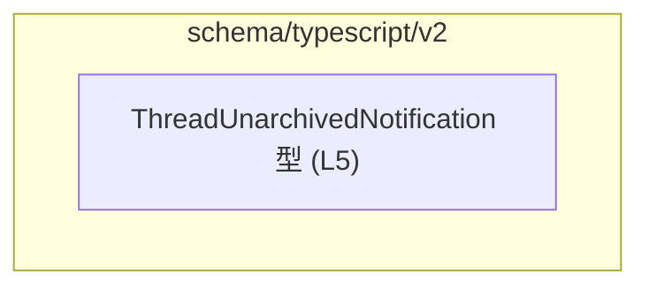
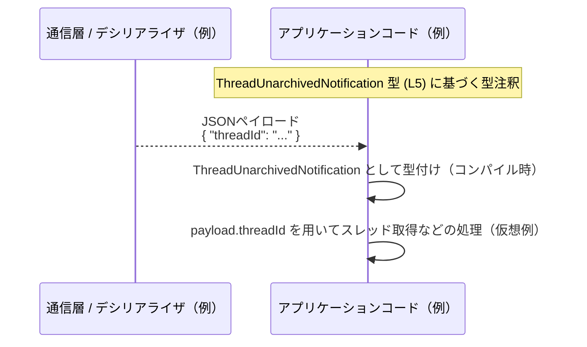

# app-server-protocol/schema/typescript/v2/ThreadUnarchivedNotification.ts

## 0. ざっくり一言

- `ThreadUnarchivedNotification` という通知ペイロード用の **TypeScript 型エイリアス**を 1 つだけ定義する、自動生成ファイルです（`ThreadUnarchivedNotification.ts:L1-5`）。

---

## 1. このモジュールの役割

### 1.1 概要

- このモジュールは、`ThreadUnarchivedNotification` という名前の **オブジェクト型**を TypeScript 上で定義します（`ThreadUnarchivedNotification.ts:L5`）。
- 型は `threadId: string` という 1 つの必須プロパティを持つオブジェクトの形を表現します（`ThreadUnarchivedNotification.ts:L5`）。
- 冒頭コメントから、このファイルは `ts-rs` というツールによって **自動生成**され、手動で編集すべきではないことが明記されています（`ThreadUnarchivedNotification.ts:L1-3`）。

### 1.2 アーキテクチャ内での位置づけ

- ファイルパス `app-server-protocol/schema/typescript/v2/` から、この型は「app-server-protocol」プロジェクトの **TypeScript 向け v2 スキーマ定義群**の一部であると読み取れます。ただし他モジュールとの具体的な依存関係は、このチャンクには現れません。
- このモジュール自身は **他の TypeScript モジュールをインポートしておらず**、依存を持たない純粋な型定義ファイルです（`ThreadUnarchivedNotification.ts:L1-5`）。

依存関係（このチャンク内で分かる範囲）を Mermaid で表すと、単一ノードのみになります。



> 実際にどのモジュールから参照されるか、どのような通知フローで使われるかは、このチャンクには現れません（不明）。

### 1.3 設計上のポイント

コードから読み取れる設計上の特徴は次のとおりです。

- **自動生成コードであることが明示**されており、手動編集禁止です（`// GENERATED CODE! DO NOT MODIFY BY HAND!` というコメント, `ThreadUnarchivedNotification.ts:L1-3`）。
- `ts-rs` による生成であることがコメントに書かれており（`ThreadUnarchivedNotification.ts:L3`）、上位のスキーマ定義からツールチェーンを通して TypeScript 型に落とし込まれていることが分かります。
- 実行時ロジックは一切なく、**型情報のみ**を提供します（`export type ...` の 1 行のみ, `ThreadUnarchivedNotification.ts:L5`）。
- オブジェクトの形は `threadId: string` という単一フィールドのみで、とても単純です（`ThreadUnarchivedNotification.ts:L5`）。

---

## 2. 主要な機能一覧

このモジュールが提供する機能は、型レベルに限られます。

- `ThreadUnarchivedNotification` 型定義: `threadId: string` を持つオブジェクト型を定義（`ThreadUnarchivedNotification.ts:L5`）
- 型安全性の付与: 通知ペイロードとして `threadId` が必須で文字列型であることをコンパイル時に保証（利用側の TypeScript 型チェックを通じて）
- 自動生成スキーマの一部としての整合性保持: 上位スキーマの変更をツールチェーン経由で TypeScript 型に反映する前提のファイル（`ThreadUnarchivedNotification.ts:L1-3`）

---

## 3. 公開 API と詳細解説

### 3.1 型一覧（構造体・列挙体など）

このチャンクに現れる公開型は 1 つだけです（`ThreadUnarchivedNotification.ts:L5`）。

| 名前                          | 種別         | 役割 / 用途                                                                 | 主なフィールド            | 定義箇所                                      |
|-------------------------------|--------------|-----------------------------------------------------------------------------|---------------------------|-----------------------------------------------|
| `ThreadUnarchivedNotification` | 型エイリアス | `threadId: string` を持つオブジェクトの形を表す通知ペイロード用の型。通知の内容や意味は名前から推測できるものの、コードからは ID が文字列であること以外は分かりません。 | `threadId: string`（必須） | `ThreadUnarchivedNotification.ts:L5` |

> 補足: フィールド `threadId` が「スレッド ID」であることは名称から推測できますが、具体的なフォーマットや意味はこのファイルからは分かりません（不明）。

#### `ThreadUnarchivedNotification` の構造

```typescript
export type ThreadUnarchivedNotification = { threadId: string, };
```

- **型の種別**: `type` による **型エイリアス**（別名）です（`ThreadUnarchivedNotification.ts:L5`）。
- **構造**: 1 つの必須プロパティ `threadId`（文字列型）を持つオブジェクトを表します（`ThreadUnarchivedNotification.ts:L5`）。
- **言語機能上の性質**:
  - TypeScript の構造的型付けに従い、`{ threadId: string }` という形状を満たす任意のオブジェクトがこの型に適合します。
  - 実行時にはこの型情報は存在せず、コンパイル時にのみ利用されます。

**契約（Contract）と前提条件（型レベル）**

- `threadId` プロパティが **存在すること**が前提です（`ThreadUnarchivedNotification.ts:L5`）。
- `threadId` の値は **文字列型**である必要があります（`ThreadUnarchivedNotification.ts:L5`）。
- 追加のプロパティ（例: `timestamp` など）が存在しても、TypeScript の構造的型システムのもとでは許容されることが多いですが、このファイルからは具体的な制約は分かりません（不明）。

**エッジケース・安全性**

- 型注釈を無視した実行（プレーン JavaScript や `any` 経由）では、`threadId` が欠けていたり `number` であっても **実行時にはエラーにならない可能性**があります。TypeScript の型チェックを有効にしておくことが前提になります。
- `string` 型なので、**空文字**や特定フォーマットに合わない文字列も静的には許容されます。形式検証や ID の存在チェックなどは、別のロジックで行う必要があります（このファイルには現れません）。

### 3.2 関数詳細（最大 7 件）

- このファイルには **関数・メソッド定義が一切存在しません**（`ThreadUnarchivedNotification.ts:L1-5`）。
- したがって、詳細に解説すべき公開関数はありません。

### 3.3 その他の関数

- 補助関数やラッパー関数も定義されていません（`ThreadUnarchivedNotification.ts:L1-5`）。
- 関数インベントリー（このチャンク内）は空です。

| 関数名 | 役割（1 行） | 定義箇所 |
|--------|--------------|----------|
| なし   | -            | -        |

---

## 4. データフロー

このモジュールには実行時の処理はなく、型のみが定義されています。そのため実際の「呼び出しフロー」はコードからは分かりませんが、**この型を利用する典型的なシナリオのイメージ**を示します。

> 注意: 以下は **一般的な利用イメージの例**であり、このリポジトリ内の実装を直接表すものではありません（このチャンクには利用コードが現れません）。

### 利用イメージ: 通知オブジェクトの受信フロー（例）

1. 通信層やデシリアライザが受け取った JSON を `ThreadUnarchivedNotification` 型として解釈する。
2. `threadId` を使ってアプリケーション側が対象スレッドを特定する。
3. UI 更新や状態管理ロジックに渡す。



---

## 5. 使い方（How to Use）

以下のコード例は、**この型をどのように利用できるかの一例**です。実際の import パスや周辺コードはプロジェクト構成によって異なります。

### 5.1 基本的な使用方法

`ThreadUnarchivedNotification` 型を使って、通知ハンドラの引数に型安全性を持たせる例です。

```typescript
// ThreadUnarchivedNotification 型をインポートする（相対パスは例）              // 型定義ファイルから型を読み込む
import type { ThreadUnarchivedNotification } from "./ThreadUnarchivedNotification"; // export type に対応する import type

// 通知を処理する関数を定義する                                                  // 受信した通知を処理する関数
function handleThreadUnarchived(                                                // 関数名は用途を表す
    notification: ThreadUnarchivedNotification                                  // 引数に型を付けることで threadId の存在と型を保証
): void {                                                                       // 戻り値は void と仮定
    // threadId プロパティに型安全にアクセスできる                               // notification.threadId は string 型として補完される
    console.log("Unarchived thread:", notification.threadId);                   // スレッド ID をログ出力する例
}
```

このように型注釈を付けることで、`notification.threadId` を書き間違えたり、`number` を渡した場合にコンパイルエラーで検出できます。

### 5.2 よくある使用パターン（例）

1. **通知メッセージの型として使用**

```typescript
// 受信メッセージを discriminated union で表す例（仮想）                        // 複数種の通知を 1 つの型にまとめる
type NotificationMessage =
    | { type: "thread_unarchived"; payload: ThreadUnarchivedNotification }      // このファイルの型を payload に使う
    | { type: "other_event"; payload: unknown };                                // 他種類の通知は別型
```

1. **イベントエミッタのペイロードとして使用**

```typescript
interface Events {                                                               // イベント名とペイロード型のマップ
    thread_unarchived: ThreadUnarchivedNotification;                            // このイベントのペイロード型に指定
}

declare function on<K extends keyof Events>(                                     // イベント登録関数の例
    eventName: K,                                                                // イベント名
    handler: (payload: Events[K]) => void                                       // イベントごとに適切な型のペイロード
): void;
```

### 5.3 よくある間違い（想定されるもの）

TypeScript 初学者が陥りやすい誤りと、正しい例を対比します。

```typescript
import type { ThreadUnarchivedNotification } from "./ThreadUnarchivedNotification";

// 間違い例: 必須プロパティ threadId を付け忘れている
const invalidPayload: ThreadUnarchivedNotification = {
    // threadId: "abc123",                                                      // コメントアウトしたため欠落
    // 他のプロパティを追加しても threadId がないのでエラー
    somethingElse: "value",                                                    // 型には存在しないプロパティ
};
// → TypeScript の型チェックでエラーになることが期待される                      // threadId の欠如、余計なプロパティの扱いは設定次第

// 正しい例: threadId を string 型で指定
const validPayload: ThreadUnarchivedNotification = {
    threadId: "abc123",                                                        // string 型で必須プロパティを指定
};
```

### 5.4 使用上の注意点（まとめ）

- **手動で編集しない**  
  - ファイル先頭に「GENERATED CODE! DO NOT MODIFY BY HAND!」と明記されているため（`ThreadUnarchivedNotification.ts:L1-3`）、このファイルを直接編集すると、次の自動生成時に上書きされる可能性があります。
  - 定義を変えたい場合は、**生成元のスキーマ定義（ts-rs の入力となる側）を変更する必要があります**。生成元がどのファイルか、このチャンクには現れません（不明）。

- **型レベルと実行時のギャップ**  
  - この型はコンパイル時にのみ存在し、実行時には消えます（`ThreadUnarchivedNotification.ts:L5`）。  
    したがって、実行時にペイロード内容をバリデーションするには、別途ランタイムのチェックロジックが必要です。
  - 型を `any` に崩して扱うと、`threadId` が欠けていてもコンパイルが通るなど、型安全性が失われます。

- **エラー / セキュリティ観点**  
  - 型定義自体にはバグは含まれていませんが、`string` としか制約していないため、「存在しない ID」「空文字」「フォーマット不正な ID」なども静的には許容されます。これらの扱いはビジネスロジック側で適切に検証する必要があります（このファイルにはロジックがありません）。
  - セキュリティ上、`threadId` に機微情報（例えば生のデータベースキーや内部構造が推察できる情報）を入れるかどうかは別途設計判断が必要ですが、このファイルからは判断できません（不明）。

- **並行性 / パフォーマンス**  
  - 実行コードがなく、型のみの定義なので、このファイル自体は **並行性やパフォーマンスに直接の影響を持ちません**。

---

## 6. 変更の仕方（How to Modify）

### 6.1 新しい機能を追加する場合

このファイルは `ts-rs` による自動生成であり、冒頭で「Do not edit this file manually」と警告されています（`ThreadUnarchivedNotification.ts:L1-3`）。そのため、**直接このファイルを編集するのは前提として想定されていません**。

新しいフィールドや通知種別を追加したい場合の一般的な手順（推奨アプローチ）は次のとおりです。

1. **生成元のスキーマ定義を特定する**  
   - `ts-rs` が入力としている定義（おそらく別言語側の型定義）を探します。  
   - このチャンクにはその場所は現れないため、プロジェクト全体の構成や `ts-rs` の設定を確認する必要があります（不明）。

2. **生成元にフィールドを追加・変更する**  
   - 例: 「通知に `unarchivedByUserId: string` を追加したい」といった場合、生成元の型にプロパティを追加します。
   - その際、後方互換性（既存クライアントがフィールドを期待していない場合）などの契約に注意する必要がありますが、契約内容はこのファイルからは読み取れません。

3. **コード生成を再実行する**  
   - `ts-rs` を用いたビルドステップを再実行して TypeScript 側の型を再生成します。
   - このファイルもそのプロセスで更新されます。

4. **利用側の TypeScript コードを更新・確認する**  
   - 新しいフィールドが追加されたことで、利用側コードにコンパイルエラーが出ていないか確認します。
   - エラーが出れば、それが契約変更の影響箇所です。

### 6.2 既存の機能を変更する場合

`threadId` の型や存在を変えるなど、既存フィールドに影響する変更を行う場合は、以下の点に注意する必要があります。

- **影響範囲の確認**  
  - `ThreadUnarchivedNotification` を使用しているすべての TypeScript コードが影響を受けます。  
  - ただし、このチャンクからはどこで使われているかが分からないため、IDE の参照検索などで確認する必要があります（不明）。

- **契約（Contract）の変更**  
  - `threadId` をオプションにする、型を `number` に変えるなどは、クライアント側の期待するペイロード契約を壊す可能性があります。
  - 型変更はコンパイルエラーとして検出されますが、削除やオプション化は検出され方が変わるため、テストや仕様確認が重要です。

- **テスト**  
  - このチャンクにはテストコードが含まれていません（`ThreadUnarchivedNotification.ts:L1-5`）。  
  - 変更に伴うテストは、別ファイルや上位層の E2E テストで行われると考えられますが、実在するかどうかは不明です。

---

## 7. 関連ファイル

このチャンクには他ファイルへの import や参照が一切ないため、**直接の関連ファイルはコードからは特定できません**（不明）。

現時点でこのファイルから分かる範囲でまとめると次のようになります。

| パス / ヒント                            | 役割 / 関係                                                                                       |
|------------------------------------------|---------------------------------------------------------------------------------------------------|
| `app-server-protocol/schema/typescript/v2/ThreadUnarchivedNotification.ts` | 本ファイル。`ThreadUnarchivedNotification` 型の定義（`ThreadUnarchivedNotification.ts:L5`）。   |
| （不明: ts-rs の入力定義ファイル）       | コメントにより ts-rs による自動生成であることが分かるが（`ThreadUnarchivedNotification.ts:L1-3`）、入力となるスキーマ定義ファイルの場所や言語はこのチャンクには現れません。 |
| （不明: この型を利用するクライアントコード） | 通知を受け取るアプリケーションコードがこの型を利用していると推測されますが、具体的なファイルはこのチャンクには現れません。 |

---

### コンポーネントインベントリー（まとめ）

最後に、このチャンクに現れるコンポーネント（型・関数）のインベントリーを整理しておきます。

| 名前                          | 種別         | 説明                                                   | 定義箇所                                      |
|-------------------------------|--------------|--------------------------------------------------------|-----------------------------------------------|
| `ThreadUnarchivedNotification` | 型エイリアス | `threadId: string` を持つ通知ペイロード用オブジェクト型 | `ThreadUnarchivedNotification.ts:L5`          |
| （関数なし）                  | 関数         | このチャンクには関数定義は現れません                  | `ThreadUnarchivedNotification.ts:L1-5`        |

このファイルは非常にシンプルで、**型エイリアス 1 つだけ**を提供するモジュールであることが、コードから客観的に確認できます。
