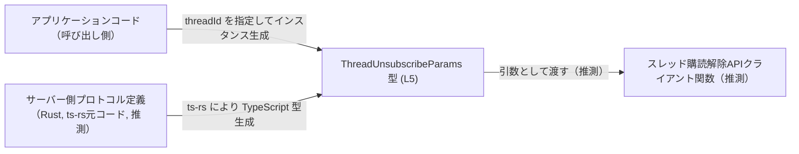
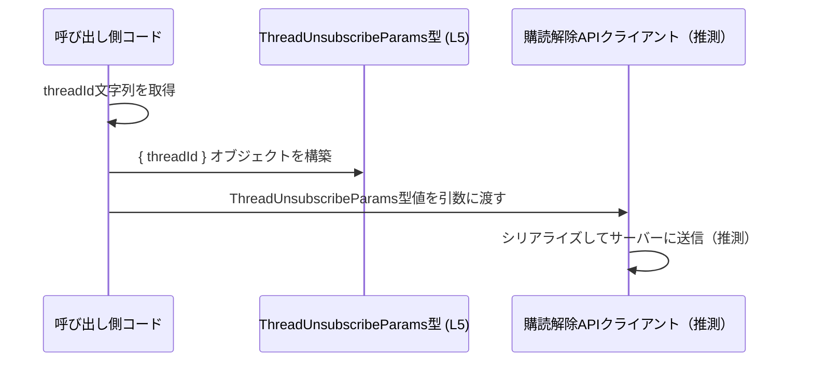

# app-server-protocol/schema/typescript/v2/ThreadUnsubscribeParams.ts コード解説

## 0. ざっくり一言

`ThreadUnsubscribeParams` は、スレッド購読解除（unsubscribe）操作に使用されると推測される、`threadId` だけを持つリクエストパラメータ用の TypeScript 型エイリアスです（`export type` 定義のみが存在します `ThreadUnsubscribeParams.ts:L5-5`）。

---

## 1. このモジュールの役割

### 1.1 概要

- このモジュールは、`ThreadUnsubscribeParams` という 1 つの型エイリアスをエクスポートします `ThreadUnsubscribeParams.ts:L5-5`。
- 型は `threadId: string` という 1 つのプロパティを持つオブジェクト型であり、特定の「スレッド」を識別する ID を表す文字列を保持します。
- ファイル先頭のコメントから、この型は Rust 側の定義から `ts-rs` により自動生成されたコードであり、手動編集は想定されていません `ThreadUnsubscribeParams.ts:L1-3`。

### 1.2 アーキテクチャ内での位置づけ

このファイル単体には import/export の依存関係はなく、他モジュールからの利用はコード上は現れていません。  
ただし、パス構成 `app-server-protocol/schema/typescript/v2` と型名から、**アプリケーションサーバーとの通信プロトコルの「スレッド購読解除」エンドポイント用リクエストパラメータ型**として利用される可能性が高いと考えられますが、このチャンクだけからは断定できません。

Mermaid による概念的な位置づけを示します（灰色ノードは「このチャンクには現れないが、名前から推測される存在」です）:



※ `C`, `D` はこのファイルには登場せず、命名とディレクトリ構成からの推測です。

### 1.3 設計上のポイント

- **自動生成コード**  
  - ファイル先頭で「GENERATED CODE」「Do not edit this file manually」と明示されています `ThreadUnsubscribeParams.ts:L1-3`。
  - 型定義を変更したい場合は、`ts-rs` の元になっている Rust コード側の定義を変更する設計になっています。
- **単純なデータコンテナ**  
  - フィールドは `threadId: string` のみで、振る舞い（メソッドや関数）は一切含みません `ThreadUnsubscribeParams.ts:L5-5`。
- **型安全性の範囲**  
  - TypeScript 上では「string であること」だけが保証されており、`threadId` の形式（UUID かどうか等）までは表現していません。
  - 実際の検証やバリデーションは、利用側コードまたはサーバー側で行う前提の設計と解釈できます（このファイルにはバリデーションロジックは存在しません）。

---

## 2. 主要な機能一覧

このファイルは関数やクラスを持たず、**1 つの型エイリアスの定義とエクスポート**のみを行います。

- `ThreadUnsubscribeParams`: スレッド購読解除リクエストのパラメータ用オブジェクト型（`threadId: string` 1 フィールド）を定義・公開する。

---

## 3. 公開 API と詳細解説

### 3.1 型一覧（構造体・列挙体など）

このチャンクに現れる型コンポーネントのインベントリーです。

| 名前                      | 種別            | 役割 / 用途                                                                                 | 根拠 |
|---------------------------|-----------------|----------------------------------------------------------------------------------------------|------|
| `ThreadUnsubscribeParams` | 型エイリアス（オブジェクト型） | `threadId: string` を持つオブジェクト型。スレッド購読解除処理のパラメータとして使われると推測される。 | `ThreadUnsubscribeParams.ts:L5-5` |

**型の定義**

```typescript
export type ThreadUnsubscribeParams = { threadId: string, };
```

- `export type ...` であるため、モジュール外からインポートして利用できます `ThreadUnsubscribeParams.ts:L5-5`。
- オブジェクトリテラル型 `{ threadId: string, }` で、必須プロパティ `threadId` のみを持ちます。

#### フィールド一覧

| フィールド名 | 型      | 必須/任意 | 説明                            | 根拠 |
|--------------|---------|-----------|---------------------------------|------|
| `threadId`   | `string` | 必須      | 対象スレッドを識別する ID 文字列 | `ThreadUnsubscribeParams.ts:L5-5` |

※ `threadId` の意味や形式（例: UUID, 数値文字列など）は、このチャンクには記述がないため不明です。

### 3.2 関数詳細（最大 7 件）

このファイルには関数・メソッドは定義されていません。

- 関数定義（`function` / `=>` を含むもの）は存在しません（確認できるのはコメントと `export type ...` のみです `ThreadUnsubscribeParams.ts:L1-5`）。
- したがって、本セクションで解説すべき関数はありません。

### 3.3 その他の関数

- 補助関数・ユーティリティ関数を含め、関数は一切定義されていません。

| 関数名 | 役割（1 行） |
|--------|--------------|
| なし   | なし         |

---

## 4. データフロー

このファイル自体にはロジックや呼び出しは含まれないため、**型レベルのデータの流れ**のみを概念的に説明します。

### 4.1 代表的なシナリオ（推定に基づくデータフロー）

命名とディレクトリ構成から、次のような利用が想定されます（API 呼び出し部分はこのチャンクには現れません）。

1. アプリケーションコードで、購読解除したいスレッドの ID（文字列）を取得する。
2. その ID を使って `ThreadUnsubscribeParams` 型のオブジェクトを生成する。
3. 生成したオブジェクトを、どこかの「スレッド購読解除 API クライアント関数」に渡す。
4. クライアント関数がそのオブジェクトをシリアライズしてサーバーに送信する。

これを sequence diagram で表します（API クライアントはこのファイルには存在しないため、あくまで推測です）。



---

## 5. 使い方（How to Use）

### 5.1 基本的な使用方法

`ThreadUnsubscribeParams` は、他のモジュールからインポートして「型」として利用します。  
以下は典型的な利用例です（API 関数 `unsubscribeFromThread` はダミーであり、このチャンクには存在しないことに注意してください）。

```typescript
// ThreadUnsubscribeParams 型をインポートする例
import type { ThreadUnsubscribeParams } from "./ThreadUnsubscribeParams"; // 相対パスは実際の配置に合わせて調整

// 購読解除用の API 関数（このファイルには定義されていない仮想の関数）
async function unsubscribeFromThread(params: ThreadUnsubscribeParams): Promise<void> {
    // ここで params.threadId を使って API リクエストを送るなどの処理を行う想定
    // 実装内容はこのチャンクには存在しません
}

// 呼び出し側のコード例
const params: ThreadUnsubscribeParams = {
    threadId: "thread-1234", // string であればコンパイル時に認められる
};

await unsubscribeFromThread(params);
```

- `params.threadId` が `string` 以外であれば、TypeScript のコンパイル時にエラーとなります。
- `ThreadUnsubscribeParams` 自体はメソッドを持たない単なるデータコンテナです。

### 5.2 よくある使用パターン

1. **関数の引数として利用する**

   ```typescript
   import type { ThreadUnsubscribeParams } from "./ThreadUnsubscribeParams";

   function buildUnsubscribeRequest(params: ThreadUnsubscribeParams) {
       return {
           // 仮想の HTTP リクエストボディ
           body: JSON.stringify({ threadId: params.threadId }),
       };
   }
   ```

2. **API クライアントのパラメータ型として利用する**

   ```typescript
   import type { ThreadUnsubscribeParams } from "./ThreadUnsubscribeParams";

   interface ThreadApiClient {
       // 購読解除メソッドの引数型として利用（このインターフェースは仮想）
       unsubscribe(params: ThreadUnsubscribeParams): Promise<void>;
   }
   ```

### 5.3 よくある間違い

この型に関して起こり得る誤用例と正しい例を示します。

```typescript
import type { ThreadUnsubscribeParams } from "./ThreadUnsubscribeParams";

// 間違い例: threadId が string ではない
const badParams: ThreadUnsubscribeParams = {
    // threadId: 1234, // number を指定するとコンパイルエラーになる
    threadId: "1234",   // ✅ string にする必要がある
};

// 間違い例: threadId を指定しない
const incompleteParams /*: ThreadUnsubscribeParams*/ = {
    // threadId: "thread-1", // 必須プロパティなので省略すると型エラー
};
// const willError: ThreadUnsubscribeParams = incompleteParams; // コンパイルエラー
```

### 5.4 使用上の注意点（まとめ）

- **自動生成ファイルのため手動編集しない**  
  - 冒頭コメントに「GENERATED CODE」「Do not edit this file manually」と明記されています `ThreadUnsubscribeParams.ts:L1-3`。
  - 振る舞いやフィールドを変更したい場合は、`ts-rs` の元になっている Rust 側の定義を変更する必要があります。
- **`threadId` の形式はこの型では保証されない**  
  - TypeScript 型としては単に `string` であり、空文字や不正な形式も許容されます。
  - 実際のビジネスロジック上の検証（空チェック、形式チェック）は利用側コードまたはサーバー側で行う必要があります。
- **ランタイムバリデーションは存在しない**  
  - このファイルは型定義のみで、実行時のチェックは一切含まないため、外部入力を直接この型にマッピングする場合は別途バリデーションが必要です。

---

## 6. 変更の仕方（How to Modify）

### 6.1 新しい機能を追加する場合

このファイルは自動生成であり、直接の変更は推奨されていません `ThreadUnsubscribeParams.ts:L1-3`。  
型に新たなプロパティを追加したい場合の一般的な流れは次のようになります（ts-rs を前提とした抽象的な説明です）。

1. **Rust 側の定義を変更する（推測）**
   - `ThreadUnsubscribeParams` に対応する Rust の構造体（例: `struct ThreadUnsubscribeParams { thread_id: String, }` など）が存在すると想定されますが、このチャンクには現れません。
   - そちらに新フィールドを追加し、適切に `ts-rs` 用の属性が付与されていることを確認します。
2. **コード生成を再実行する**
   - `ts-rs` を利用したビルドまたはコマンドによって TypeScript 側の型を再生成します。
3. **利用箇所の型エラーを解消する**
   - 新しいフィールドが追加されたことで、`ThreadUnsubscribeParams` を利用している TypeScript コードがコンパイルエラーになる場合があるため、順次修正します。

### 6.2 既存の機能を変更する場合

- **影響範囲の確認方法**
  - TypeScript 側では、「`ThreadUnsubscribeParams` をインポートしている全てのファイル」が影響範囲になります。
  - IDE の「参照の検索」や `grep` で `ThreadUnsubscribeParams` を検索し、使用箇所を洗い出します。
- **注意すべき契約**
  - `threadId` は必須プロパティである契約になっています。これをオプショナルにする／型を変える場合、呼び出し側の前提が崩れるため、利用コードすべての見直しが必要になります。
- **テストや使用箇所の確認**
  - このファイルにはテストコードは含まれていません。
  - 型変更後には、`ThreadUnsubscribeParams` を利用する機能のテスト（ユニットテストや統合テスト）が通ることを確認する必要があります。

---

## 7. 関連ファイル

このチャンクには import 文や他ファイルへの直接の参照が存在しないため、厳密な関連ファイルは特定できません。名前やコメントから推測される関連は以下のとおりです。

| パス / コンポーネント（推測を含む）                        | 役割 / 関係                                                                                      | 根拠 |
|-----------------------------------------------------------|-------------------------------------------------------------------------------------------------|------|
| Rust 側の `ThreadUnsubscribeParams` 相当の構造体（推測）   | `ts-rs` による TypeScript 型生成の元になる定義。フィールド追加・変更はここで行う必要がある。      | `ThreadUnsubscribeParams.ts:L2-3` （ts-rs による生成コメント） |
| `app-server-protocol/schema/typescript/v2/` 配下の他ファイル（推測） | 他のエンドポイント用のパラメータ・レスポンス型など、同じプロトコルバージョン v2 の型群と推測される。 | ディレクトリ名からの推測（このチャンクには実際の参照はない） |

---

### Bugs / Security / Contracts / Edge Cases / Performance について

- **Bugs**  
  - このファイルは単一の型定義のみであり、実行時ロジックが存在しないため、コード上のバグは特定できません。
- **Security**  
  - 型自体はセキュリティ機能を持ちません。`threadId` に機微情報を入れる設計の場合は、利用側でログ出力などに注意する必要がありますが、本チャンクからは判断できません。
- **Contracts（契約）**  
  - `threadId` は必須の `string` である、という静的な契約のみが存在します `ThreadUnsubscribeParams.ts:L5-5`。
- **Edge Cases（エッジケース）**  
  - 空文字、非常に長い文字列、不正フォーマットなどは、型レベルではすべて許容されます。扱いは利用側実装次第であり、このチャンクには記述がありません。
- **Performance / Scalability**  
  - 単なる型定義であり、パフォーマンスやスケーラビリティへの直接の影響はありません。

以上が、このファイルに基づいて客観的に説明できる範囲の内容です。
