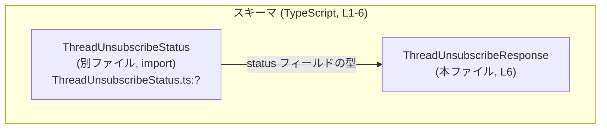
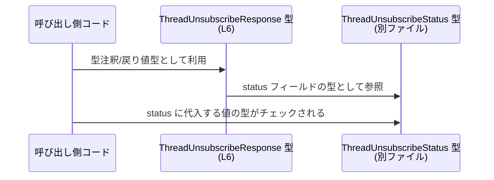

# app-server-protocol/schema/typescript/v2/ThreadUnsubscribeResponse.ts コード解説

## 0. ざっくり一言

`ThreadUnsubscribeResponse` は、「スレッド購読解除レスポンス」を表す TypeScript のオブジェクト型で、`status` という 1 つのフィールドのみを持つシンプルなスキーマ定義です（根拠: `ThreadUnsubscribeResponse.ts:L4-6`）。  

---

## 1. このモジュールの役割

### 1.1 概要

- このモジュールは、`ThreadUnsubscribeResponse` という TypeScript の型エイリアスを定義します（根拠: `ThreadUnsubscribeResponse.ts:L6`）。
- 応答オブジェクトが必ず `status` フィールドを持ち、その型が `ThreadUnsubscribeStatus` であることをコンパイル時に保証する役割を持ちます（根拠: `ThreadUnsubscribeResponse.ts:L4-6`）。
- ファイル全体は `ts-rs` により自動生成されることが明記されており、手動編集しない前提のスキーマ定義です（根拠: `ThreadUnsubscribeResponse.ts:L1-3`）。

### 1.2 アーキテクチャ内での位置づけ

このファイルは TypeScript 側の「プロトコルスキーマ」の一部として、`ThreadUnsubscribeStatus` 型に依存しつつ `ThreadUnsubscribeResponse` 型を公開しています。

- 依存関係:
  - `ThreadUnsubscribeResponse` → `ThreadUnsubscribeStatus`（インポートしてフィールド型として利用）（根拠: `ThreadUnsubscribeResponse.ts:L4, L6`）



このチャンクから分かるのは、`ThreadUnsubscribeResponse` が別ファイルの `ThreadUnsubscribeStatus` に依存している点のみです。`ThreadUnsubscribeStatus` 自体の中身は、このチャンクには現れません。

### 1.3 設計上のポイント

- **自動生成コード**  
  - ファイル先頭コメントにより、`ts-rs` による自動生成であることが明記されています（根拠: `ThreadUnsubscribeResponse.ts:L1-3`）。
  - 設計上、「Rust 側の定義が単一のソース」であり、TypeScript は生成物という構成になっていると解釈できます（自動生成であることはコメントからの事実、Rust がソースである点は ts-rs の一般的仕様に基づく補足情報）。

- **状態のみを表現するシンプルな型**  
  - レスポンスオブジェクトは `status` フィールドだけを持つ構造です（根拠: `ThreadUnsubscribeResponse.ts:L6`）。
  - 状態の種類や意味づけはすべて `ThreadUnsubscribeStatus` 側に委ねられています（根拠: `ThreadUnsubscribeResponse.ts:L4, L6`）。

- **状態型の明示による型安全性**  
  - `status` の型を `ThreadUnsubscribeStatus` に固定することで、コンパイル時に誤った文字列や数値を代入することを防ぐ設計になっています（根拠: `ThreadUnsubscribeResponse.ts:L4, L6`）。

- **実行時ロジック・並行性は持たない**  
  - 関数やクラスは一切定義されておらず、純粋な型宣言のみです（根拠: `ThreadUnsubscribeResponse.ts:L1-6`）。
  - そのため、このモジュール自体には実行時エラーや並行性（スレッド安全性など）に関するロジックは存在しません。

---

## 2. 主要な機能一覧

このファイルが提供する機能は、型定義 1 つに集約されています。

- `ThreadUnsubscribeResponse` 型定義:  
  スレッド購読解除レスポンスを表すオブジェクト型。必須フィールド `status` を持ち、その型は `ThreadUnsubscribeStatus` に制約されます（根拠: `ThreadUnsubscribeResponse.ts:L4, L6`）。

---

## 3. 公開 API と詳細解説

### 3.1 型一覧（構造体・列挙体など）

このチャンクに現れる型・シンボルのインベントリです。

| 名前                        | 種別        | 定義/参照箇所                         | 役割 / 用途 |
|-----------------------------|-------------|----------------------------------------|-------------|
| `ThreadUnsubscribeResponse` | 型エイリアス | `ThreadUnsubscribeResponse.ts:L6`      | スレッド購読解除レスポンスを表すオブジェクト型。`status` フィールドを必須とし、その型を `ThreadUnsubscribeStatus` に固定する。 |
| `ThreadUnsubscribeStatus`   | 型（import）| `ThreadUnsubscribeResponse.ts:L4`      | `status` フィールド用に別ファイルからインポートされる状態型。具体的な中身・バリアントはこのチャンクには現れません。 |

#### `ThreadUnsubscribeResponse` の構造

```ts
export type ThreadUnsubscribeResponse = { 
    status: ThreadUnsubscribeStatus, 
};
```

- フィールド一覧（根拠: `ThreadUnsubscribeResponse.ts:L6`）

| フィールド名 | 型                      | 必須/任意 | 説明 |
|--------------|-------------------------|-----------|------|
| `status`     | `ThreadUnsubscribeStatus` | 必須      | 購読解除処理の結果ステータスを表すと考えられるフィールド。名前からの推測であり、具体的な値の種類はこのチャンクには現れません。 |

**契約/コンストラクト（型レベルの契約）**

- `ThreadUnsubscribeResponse` として扱うオブジェクトは、少なくとも `status` プロパティを持たなければなりません。
- `status` の型は `ThreadUnsubscribeStatus` によって定義される値（列挙またはユニオン型など）に制限されます。
- これらはすべてコンパイル時（型チェック時）の制約であり、実行時に自動で検証されるわけではありません（TypeScript の一般的性質）。

### 3.2 関数詳細（最大 7 件）

このファイルには関数・メソッドは定義されていません（根拠: `ThreadUnsubscribeResponse.ts:L1-6`）。  
そのため、「関数詳細テンプレート」を適用すべき公開関数はありません。

### 3.3 その他の関数

- 補助関数・ラッパー関数も存在しません（根拠: `ThreadUnsubscribeResponse.ts:L1-6`）。

---

## 4. データフロー

### 4.1 型レベルでのデータの流れ

このモジュールは型のみを提供するため、実行時のデータフローではなく、「型がどのように参照されるか」という観点でのフローを示します。

- 呼び出し側コードは `ThreadUnsubscribeResponse` 型を import して、関数の戻り値や変数の型として利用します。
- `ThreadUnsubscribeResponse` の `status` フィールドは、別ファイルで定義された `ThreadUnsubscribeStatus` 型により制約されます。
- コンパイラは、`status` に異なる型の値が代入されないようにチェックします。



この図は、「コンパイル時にどのように型が連携しているか」を表し、実行時のネットワーク送受信や JSON シリアライズの詳細は、このチャンクからは分かりません。

---

## 5. 使い方（How to Use）

### 5.1 基本的な使用方法

ここでは、`ThreadUnsubscribeResponse` 型を利用する典型的な例として、「購読解除 API のレスポンスを扱う」コードの形を示します。  
具体的なステータス値は `ThreadUnsubscribeStatus` の定義を見ないと分からないため、この例では抽象的な扱いにとどめます。

```typescript
// ThreadUnsubscribeResponse 型をインポートする                        // 型定義を読み込む
import type { ThreadUnsubscribeResponse } from "./ThreadUnsubscribeResponse"; // 本ファイルの型

// 例: API から購読解除レスポンスを受け取って処理する関数             // API レスポンスを扱うイメージ
function handleThreadUnsubscribeResponse(                                // レスポンスを処理する関数
    response: ThreadUnsubscribeResponse                                  // 型注釈により status が必須であることが保証される
): void {
    // status フィールドに安全にアクセスできる                         // status が存在し、ThreadUnsubscribeStatus 型であることが前提
    switch (response.status) {                                           // ステータスに応じた分岐
        // 具体的なケースは ThreadUnsubscribeStatus の定義に依存する    // ここではケース名を仮定しない
        default:
            console.log("unsubscribe status:", response.status);         // デバッグ出力など
    }
}

// 例: サーバー側でレスポンスオブジェクトを組み立てる                 // レスポンス生成のイメージ
declare const status: import("./ThreadUnsubscribeStatus").ThreadUnsubscribeStatus; // 実際のステータス値

const response: ThreadUnsubscribeResponse = {                            // 必ず status フィールドを指定する必要がある
    status,                                                              // 型により status の型がチェックされる
};
```

この例により、`ThreadUnsubscribeResponse` が

- **クライアント側**: 受け取るレスポンスの型注釈
- **サーバー側**: 返却するレスポンスの組み立て時の型チェック

に使えることが分かります（あくまで一般的な利用例であり、実際の API 形態はこのチャンクからは分かりません）。

### 5.2 よくある使用パターン

1. **関数の戻り値型として使用**

```typescript
import type { ThreadUnsubscribeResponse } from "./ThreadUnsubscribeResponse";

// 購読解除を実行し、その結果を返す関数の戻り値として利用           // 戻り値が必ず status を含むことを表現
function unsubscribeFromThread(threadId: string): ThreadUnsubscribeResponse {
    // 実際の処理内容はここでは不明                                 // ビジネスロジックは別途
    const status = getUnsubscribeStatus(threadId);                       // ThreadUnsubscribeStatus 型の値を返すと想定
    return { status };                                                   // 型により status プロパティの存在が保証される
}

declare function getUnsubscribeStatus(
  threadId: string
): import("./ThreadUnsubscribeStatus").ThreadUnsubscribeStatus;
```

1. **API クライアント/サーバ間の共有型として使用**

- Rust 側の構造体（ts-rs 対象）とこの TypeScript 型が対応しているケースでは、サーバとフロントエンド間で同じスキーマを共有できます。
- これにより、「プロトコルが変わったのに片側の型が更新されていない」といった型不整合をコンパイル時に検出しやすくなります。

### 5.3 よくある間違い

**間違い例: `status` フィールドを省略してオブジェクトを作る**

```typescript
import type { ThreadUnsubscribeResponse } from "./ThreadUnsubscribeResponse";

// 間違い例: status がないためコンパイルエラーになる                 // 型定義と合わない
const badResponse: ThreadUnsubscribeResponse = {
    // status: ... がない                                             // 必須プロパティが不足
};
```

**正しい例**

```typescript
import type { ThreadUnsubscribeResponse } from "./ThreadUnsubscribeResponse";
import type { ThreadUnsubscribeStatus } from "./ThreadUnsubscribeStatus";

const status: ThreadUnsubscribeStatus = /* 実際の値 */ null as any;     // 例示のため any を使用（実際は適切な値を使用）

const goodResponse: ThreadUnsubscribeResponse = {                        // 必須フィールドをすべて指定
    status,                                                              // ThreadUnsubscribeStatus 型
};
```

**間違い例: 値インポートと混同する**

```typescript
// 間違い例: 将来 `verbatimModuleSyntax` などの設定によっては問題になる可能性がある
import { ThreadUnsubscribeResponse } from "./ThreadUnsubscribeResponse"; // 実体の値を import したように見える書き方
```

**より安全な例**

```typescript
// 本ファイルでも使われている形: import type                           // 値を実際には生成しない型専用 import
import type { ThreadUnsubscribeResponse } from "./ThreadUnsubscribeResponse";
```

### 5.4 使用上の注意点（まとめ）

- **直接編集しない**  
  - ファイル先頭に「GENERATED CODE! DO NOT MODIFY BY HAND!」と明記されており（根拠: `ThreadUnsubscribeResponse.ts:L1-3`）、この TypeScript ファイル自体を直接編集すると、再生成時に上書きされます。

- **型レベルの安全性のみ**  
  - TypeScript の型はコンパイル時チェック専用であり、実行時には存在しません。
  - 外部から受け取った JSON を `ThreadUnsubscribeResponse` とみなす際は、別途実行時バリデーションを行わない限り、完全な安全性は保証されません。

- **`ThreadUnsubscribeStatus` の全ケースを処理する**  
  - `switch(response.status)` のような処理を行う場合、`ThreadUnsubscribeStatus` の全バリアントを網羅する必要があります。
  - この型の中身はこのチャンクには現れないため、別ファイルの定義を確認する必要があります。

- **並行性/スレッド安全性について**  
  - このモジュールは型定義のみであり、実行時の状態やミューテーションを持たないため、並行性に関する特別な注意点はありません。
  - ただし、レスポンスオブジェクト自体をどのような環境で共有するか（ブラウザ、Node.js など）は別途考慮が必要です。

---

## 6. 変更の仕方（How to Modify）

### 6.1 新しい機能を追加する場合

このファイルは `ts-rs` によって自動生成されているため（根拠: `ThreadUnsubscribeResponse.ts:L1-3`）、通常は **直接変更しません**。

新しいフィールドや機能を追加したい場合の一般的な流れは次のようになります（ts-rs の標準的な運用に基づく説明です）。

1. **Rust 側の元定義を変更する**  
   - ts-rs が対象とする Rust 構造体（例: `struct ThreadUnsubscribeResponse { ... }`）にフィールドを追加・変更する。
   - Rust コードの位置はこのチャンクからは分かりませんが、`ts-rs` のアノテーションが付いた構造体を探す必要があります。

2. **ts-rs による再生成を実行する**  
   - プロジェクトのビルドプロセスまたは専用コマンドで TypeScript スキーマを再生成する。
   - これにより、本ファイルの `ThreadUnsubscribeResponse` 型に変更が反映されます。

3. **TypeScript 側利用箇所の修正**  
   - 新しいフィールドや変更された型に合わせて、呼び出し側コード（フロントエンドなど）を更新する。

### 6.2 既存の機能を変更する場合

`ThreadUnsubscribeResponse` 型の形を変えたい場合も、基本的には 6.1 と同様に **ts-rs の入力（Rust 側）を変更** します。

変更時の注意点:

- **互換性への配慮**  
  - フィールド削除・型変更などは、既存の TypeScript コードにコンパイルエラーを発生させる可能性があります。
  - 影響範囲を確認するには、`ThreadUnsubscribeResponse` を import しているファイルを検索し、すべての使用箇所をビルドまたは IDE で確認する必要があります。

- **プロトコル契約の維持**  
  - この型はサーバとクライアントの通信契約（プロトコル）の一部になっていると考えられます。
  - 実際の通信フォーマット（JSON など）との整合性を保つように設計を行う必要がありますが、その具体的内容はこのチャンクには現れません。

---

## 7. 関連ファイル

このモジュールと直接的に関係するファイルは、import から 1 つだけ確認できます。

| パス                                | 役割 / 関係 |
|-------------------------------------|-------------|
| `./ThreadUnsubscribeStatus`         | `status` フィールドの型としてインポートされている状態型の定義ファイル（根拠: `ThreadUnsubscribeResponse.ts:L4`）。具体的な列挙値や構造は、このチャンクには現れません。 |

テストコードやその他のサポートユーティリティとの関係は、このチャンクには現れないため不明です。
