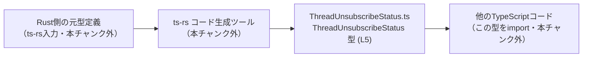
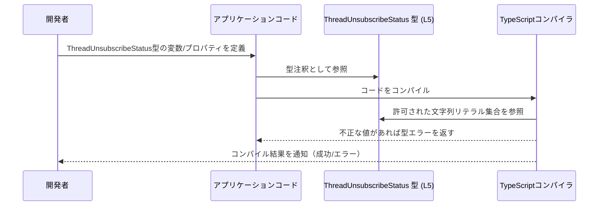

# app-server-protocol\schema\typescript\v2\ThreadUnsubscribeStatus.ts

---

## 0. ざっくり一言

このファイルは、`ThreadUnsubscribeStatus` という **3 つの文字列リテラルのどれか**を取る TypeScript の型エイリアスを 1 つだけ定義した、ts-rs による自動生成ファイルです (ThreadUnsubscribeStatus.ts:L1-5)。

---

## 1. このモジュールの役割

### 1.1 概要

- このモジュールは、`ThreadUnsubscribeStatus` という名前の型を公開し、値が `"notLoaded" | "notSubscribed" | "unsubscribed"` のいずれかに限定されることを **コンパイル時に保証**する役割を持ちます (ThreadUnsubscribeStatus.ts:L5-5)。
- ファイル先頭のコメントから、Rust 側の型定義から ts-rs によって生成されたファイルであり、手動編集が想定されていないことが分かります (ThreadUnsubscribeStatus.ts:L1-3)。

### 1.2 アーキテクチャ内での位置づけ

- このファイル自身は **外部モジュールを import していません** (ThreadUnsubscribeStatus.ts:L1-5)。
- 逆に、このファイルで定義された `ThreadUnsubscribeStatus` 型は、他の TypeScript ファイルから import され、型注釈として利用されることが想定されます（利用側は本チャンクには現れません）。
- コメントから、この型は ts-rs を通じて Rust の型と対応付けられていることが分かります (ThreadUnsubscribeStatus.ts:L3-3)。

想定される位置づけを、生成フローを含めて図示します。Rust 側や利用側コードは概念的なものであり、本チャンクには含まれていません。



### 1.3 設計上のポイント

- **自動生成コードであることが明記**されており、手で変更すべきではないとされています (ThreadUnsubscribeStatus.ts:L1-3)。
- **公開 API は 1 つの型エイリアスのみ**で、関数やクラスなどの実行時ロジックは存在しません (ThreadUnsubscribeStatus.ts:L5-5)。
- 型は **文字列リテラル・ユニオン型**であり、`"notLoaded" | "notSubscribed" | "unsubscribed"` の 3 値に厳密に制限されます (ThreadUnsubscribeStatus.ts:L5-5)。
- 実行時コードや非同期処理・共有状態を扱うコードは存在しないため、**ランタイムのエラーや並行性の問題は直接は発生しません** (ThreadUnunsubscribeStatus.ts:L1-5)。

---

## 2. 主要な機能一覧（コンポーネントインベントリー）

このチャンクに現れるコンポーネント（型・エクスポート）は 1 つです。

| 名前                     | 種別                        | 概要                                             | 定義位置                        |
|--------------------------|-----------------------------|--------------------------------------------------|---------------------------------|
| `ThreadUnsubscribeStatus` | 型エイリアス（ユニオン型） | `"notLoaded"`, `"notSubscribed"`, `"unsubscribed"` のいずれかを取る文字列リテラル型 | ThreadUnsubscribeStatus.ts:L5-5 |

主要機能の一覧を文章で整理すると次の 1 点になります。

- `ThreadUnsubscribeStatus` 型の提供: スレッドに関連する何らかの「unsubscribe 状態」を表現するために、使用可能な文字列値を 3 種類に限定する型情報を提供します (ThreadUnsubscribeStatus.ts:L5-5)。  
  ※ 名前から「スレッドの購読解除状態」を表すと推測されますが、具体的な業務仕様は本チャンクからは分かりません。

---

## 3. 公開 API と詳細解説

### 3.1 型一覧（構造体・列挙体など）

公開されている型は次の 1 つです。

| 名前                     | 種別                                   | 役割 / 用途（事実ベース）                                                                 | 値のバリエーション                                           | 定義位置                        |
|--------------------------|----------------------------------------|--------------------------------------------------------------------------------------------|----------------------------------------------------------------|---------------------------------|
| `ThreadUnsubscribeStatus` | 型エイリアス（string リテラル・ユニオン） | 3 種類の特定の文字列値だけを許可するための型。プロパティや変数の型注釈に利用されることが想定されます。 | `"notLoaded"` / `"notSubscribed"` / `"unsubscribed"` (すべて string) | ThreadUnsubscribeStatus.ts:L5-5 |

#### 型安全性・エラー・並行性の観点

- **型安全性**  
  - `ThreadUnsubscribeStatus` 型の変数に、上記 3 つ以外の文字列を代入すると **TypeScript コンパイル時にエラー** になります。  
    これは TypeScript の「文字列リテラル・ユニオン型」の標準的な挙動です。
  - `null` や `undefined` もこの型には含まれていないため、代入するとコンパイルエラーになります（`ThreadUnsubscribeStatus | null` のようなユニオンにしない限り）。
- **実行時エラー**  
  - このファイルには実行時コードがなく、型定義のみなので、このファイル単体では実行時エラーは発生しません (ThreadUnsubscribeStatus.ts:L1-5)。
- **並行性・スレッドセーフティ**  
  - 実行時状態や非同期処理を扱わない純粋な型定義であるため、並行性に関する問題も直接は発生しません (ThreadUnsubscribeStatus.ts:L1-5)。
- **注意点（入力バリデーション）**  
  - 外部入力（API からの JSON など）が `any` や `unknown` として入ってきた場合、その値を `ThreadUnsubscribeStatus` として扱う前に **実行時のチェック** を行わないと、型アサーションで誤った値を通してしまう可能性があります。  
    これは TypeScript 全般の注意点であり、本ファイルに特有のロジックはありません。

### 3.2 関数詳細（最大 7 件）

このファイルには **関数・メソッドの定義は一切存在しません** (ThreadUnsubscribeStatus.ts:L1-5)。  
そのため、関数詳細テンプレートに基づいて解説すべき対象はありません。

### 3.3 その他の関数

- 補助的・内部的な関数も含め、**一切定義されていません** (ThreadUnsubscribeStatus.ts:L1-5)。

---

## 4. データフロー

このモジュール自身は型定義のみを提供し、データ変換や副作用を伴う処理を持ちません (ThreadUnsubscribeStatus.ts:L5-5)。  
したがって、ここでは **想定される利用シナリオ** に基づいて、型がどのようにデータフローに関与するかを示します。

### 想定シナリオの概要

1. 開発者が、スレッドに関する状態を管理するコードで `ThreadUnsubscribeStatus` 型を import します。
2. 変数やオブジェクトのプロパティに `ThreadUnsubscribeStatus` を型注釈として付与します。
3. TypeScript コンパイラは、代入された文字列が `"notLoaded"`, `"notSubscribed"`, `"unsubscribed"` のいずれかかどうかをコンパイル時に検査します (ThreadUnsubscribeStatus.ts:L5-5)。
4. 不正な値があればコンパイルエラーとなり、本番実行前にバグを検出できます。

### データフロー（型チェック観点のシーケンス図）



- 上記は TypeScript の一般的な動作を示したものであり、具体的なアプリケーションコードは本チャンクには含まれていません。

---

## 5. 使い方（How to Use）

### 5.1 基本的な使用方法

`ThreadUnsubscribeStatus` 型を import して、変数やプロパティの型として利用する基本例です。

```typescript
// ThreadUnsubscribeStatus.ts から型をインポートする例
// 実際の相対パスはプロジェクト構成に依存する（ここでは例示）
import type { ThreadUnsubscribeStatus } from "./ThreadUnsubscribeStatus";

// ステータスを表す変数に型を付ける
let status: ThreadUnsubscribeStatus = "notLoaded";  // OK: 許可された値

// 別の許可された値への更新
status = "notSubscribed";  // OK

status = "unsubscribed";   // OK

// 許可されていない値を代入するとコンパイルエラーになる
// status = "unknown";     // エラー: Type '"unknown"' is not assignable to type 'ThreadUnsubscribeStatus'.
```

このように型注釈を付けることで、**許可された 3 つ以外の文字列を代入できない**ことがコンパイル時に保証されます (ThreadUnsubscribeStatus.ts:L5-5)。

### 5.2 よくある使用パターン

#### パターン 1: 状態を持つオブジェクトのプロパティとして使う

```typescript
import type { ThreadUnsubscribeStatus } from "./ThreadUnsubscribeStatus";

// スレッド情報を表す型の一部として利用する例
interface ThreadInfo {
    id: string;                        // スレッドID
    title: string;                     // タイトル
    unsubscribeStatus: ThreadUnsubscribeStatus;  // 購読解除状態
}

// 利用例
const thread: ThreadInfo = {
    id: "123",
    title: "サンプルスレッド",
    unsubscribeStatus: "unsubscribed"  // OK
};
```

#### パターン 2: 状態に応じた分岐処理

```typescript
import type { ThreadUnsubscribeStatus } from "./ThreadUnsubscribeStatus";

// 状態に応じて処理を切り替える例
function handleStatus(status: ThreadUnsubscribeStatus) {
    switch (status) {
        case "notLoaded":
            // まだ情報を読み込んでいない場合の処理
            break;
        case "notSubscribed":
            // 未購読の場合の処理
            break;
        case "unsubscribed":
            // 購読解除済みの場合の処理
            break;
        // ここに default を書かないことで、
        // 将来値が追加されたときにコンパイラが網羅性エラーを検出しやすくなる
    }
}
```

### 5.3 よくある間違い

```typescript
import type { ThreadUnsubscribeStatus } from "./ThreadUnsubscribeStatus";

// 間違い例 1: string 型で受けてしまう
function badHandler(status: string) {
    // 'notLoaded' 以外の値も受け取れてしまい、型安全性が失われる
}

// 正しい例: ThreadUnsubscribeStatus 型で受ける
function goodHandler(status: ThreadUnsubscribeStatus) {
    // 許可された 3 つの状態だけを受け取れる
}

// 間違い例 2: 外部入力を検証せずに型アサーションする
declare const external: any;
// const s = external as ThreadUnsubscribeStatus;  // 外部入力が何であっても通ってしまう（危険）

// 正しい例: 実行時にチェックする
function isThreadUnsubscribeStatus(value: unknown): value is ThreadUnsubscribeStatus {
    return value === "notLoaded" || value === "notSubscribed" || value === "unsubscribed";
}

if (isThreadUnsubscribeStatus(external)) {
    const safe: ThreadUnsubscribeStatus = external;  // OK: 実行時チェック済み
}
```

### 5.4 使用上の注意点（まとめ）

- **前提条件**
  - `ThreadUnsubscribeStatus` 型の変数・プロパティには、`"notLoaded"`, `"notSubscribed"`, `"unsubscribed"` のいずれかしか代入できません (ThreadUnsubscribeStatus.ts:L5-5)。
  - `null` / `undefined` / その他の文字列を扱いたい場合は、別途ユニオン型で拡張する必要があります（例: `ThreadUnsubscribeStatus | null`）。
- **禁止事項 / 注意事項**
  - ファイル先頭で「GENERATED CODE! DO NOT MODIFY BY HAND!」と明示されているため、**このファイルを直接編集しない**ことが前提です (ThreadUnsubscribeStatus.ts:L1-3)。
  - 外部入力に対しては、**型アサーション (`as`) で安易に `ThreadUnsubscribeStatus` を付けない**ようにし、実行時チェックを行うことが望ましいです。
- **エラーとセキュリティ**
  - この型定義はコンパイル時の型チェックを強化するものですが、**実行時の入力値検証やセキュリティ検査を代替するものではありません**。
- **パフォーマンス / 並行性**
  - 型定義のみであり、実行時の処理や並行実行に関するコストはありません (ThreadUnsubscribeStatus.ts:L1-5)。

---

## 6. 変更の仕方（How to Modify）

### 6.1 新しい機能を追加する場合

このファイルは ts-rs による自動生成であり、コメントにも **「手で変更するな」** と明記されています (ThreadUnsubscribeStatus.ts:L1-3)。  
そのため、通常は以下の方針になります。

1. **Rust 側の元型定義を変更する**  
   - ts-rs は Rust の型定義（`enum` や `struct` など）から TypeScript 型を生成するツールです。  
   - 新しい状態を追加したい場合は、Rust 側の定義に新しいバリアントを追加するのが一般的です（元ファイルのパスや定義は本チャンクには現れません）。
2. **ts-rs によるコード生成を再実行する**  
   - 生成プロセスを走らせることで、この `ThreadUnsubscribeStatus.ts` が更新されます。
3. **影響範囲の確認**
   - TypeScript 側で `ThreadUnsubscribeStatus` を利用しているコードに対して、コンパイルを実行すると、新しい状態を扱っていない分岐などがあれば型エラーとして検出できる可能性があります（`switch` 文で default を設けないパターンなど）。

**注意**: 直接このファイルの `"notLoaded" | "notSubscribed" | "unsubscribed"` に文字列を追加しても、次回のコード生成で上書きされる可能性があります (ThreadUnsubscribeStatus.ts:L1-3)。

### 6.2 既存の機能を変更する場合

既存の 3 値のいずれかを変更・削除したい場合も、同様に **Rust 側の定義を変更 → ts-rs で再生成** が基本方針になります。

変更時の注意点:

- **契約（Contract）の変更**
  - この型は TypeScript 側と Rust 側（および API プロトコル）との間で共有される「契約」を表していることが多く、文字列値を変更すると、既存クライアント・サーバの双方に影響します。
- **影響範囲の確認方法**
  - TypeScript 側では、`ThreadUnsubscribeStatus` を import しているすべての箇所を検索し、比較や分岐でハードコードしている文字列がないか確認する必要があります。
- **テスト**
  - このファイル自体にはテストは含まれていませんが (ThreadUnsubscribeStatus.ts:L1-5)、利用側のテスト（ユニットテスト・統合テスト）で新しい状態や変更後の状態が期待どおりに扱われるかを確認する必要があります。

---

## 7. 関連ファイル

このチャンクには他ファイルのパスや import 文が現れないため、厳密な関連ファイルの特定はできません (ThreadUnsubscribeStatus.ts:L1-5)。  
コメントから推測される概念上の関連を、推測であることを明示したうえでまとめます。

| パス / 種別                     | 役割 / 関係 |
|--------------------------------|-------------|
| （不明）Rust 側の元型定義ファイル | コメントにより、この TypeScript 型が ts-rs によって生成されていることが分かるため、対応する Rust の型定義ファイルが存在すると考えられますが、具体的なパスや内容は本チャンクには現れません (ThreadUnsubscribeStatus.ts:L3-3)。 |
| （不明）`ThreadUnsubscribeStatus` を import する TypeScript ファイル群 | この型を利用してプロパティや引数を型付けしていると想定されますが、具体的なファイル名や場所は本チャンクには現れません (ThreadUnsubscribeStatus.ts:L1-5)。 |

---

### まとめ

- このファイルは **1 つの文字列リテラル・ユニオン型 `ThreadUnsubscribeStatus` を公開するだけの自動生成ファイル** であり、実行時ロジックや関数は含みません (ThreadUnsubscribeStatus.ts:L1-5)。
- TypeScript の型システムを利用して、「許可された 3 つの状態のみを扱う」ことをコンパイル時に保証するのが主な役割です (ThreadUnsubscribeStatus.ts:L5-5)。
- 変更や拡張は **Rust 側の定義と ts-rs の生成プロセス** を通じて行うことが前提とされており、このファイルを直接編集することは推奨されていません (ThreadUnsubscribeStatus.ts:L1-3)。
