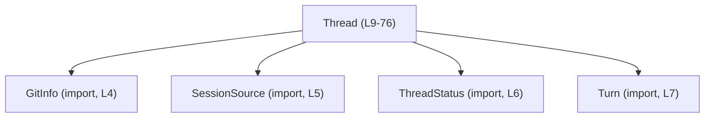
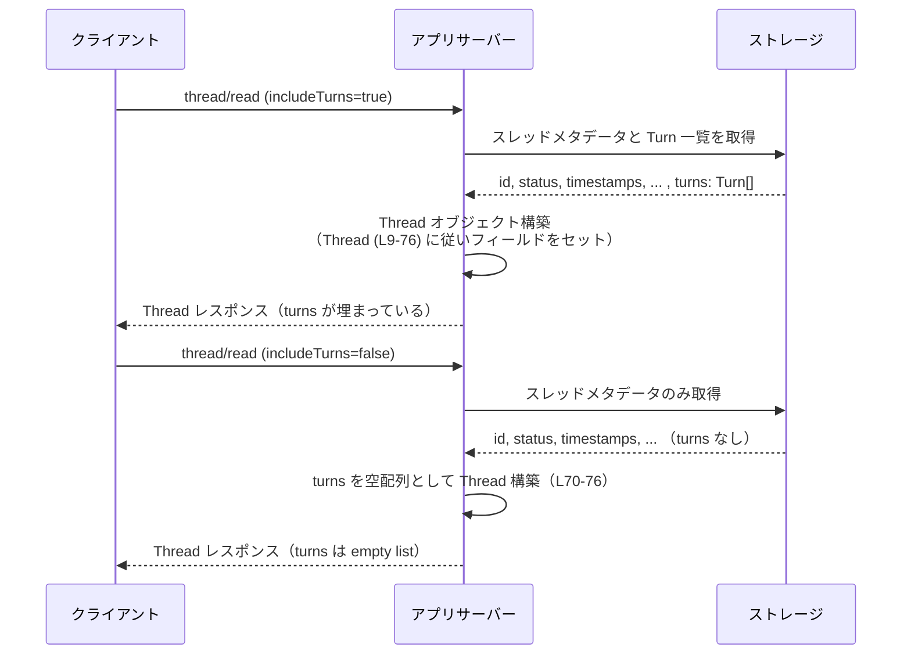

# app-server-protocol/schema/typescript/v2/Thread.ts

## 0. ざっくり一言

`Thread` は、アプリケーション内の「スレッド（対話セッション）」に関するメタデータと関連情報（ステータス・パス・Git 情報・ターン一覧など）をまとめて表現する TypeScript の型定義です（`Thread.ts:L9-76`）。

---

## 1. このモジュールの役割

### 1.1 概要

- このモジュールは、**対話スレッドの状態と属性を一つのオブジェクトとして表現する**ために存在します。
- スレッド ID、親スレッド ID（フォーク元）、プレビュー文字列、永続化フラグ、モデル提供元、作成/更新時刻、実行ステータス、パスや作業ディレクトリ、生成元（CLI 等）、Git 情報、表示名、およびターン一覧を保持します（`Thread.ts:L9-76`）。
- ファイル先頭に **自動生成コードであること** が明示されており、手動で編集しない前提のスキーマ定義になっています（`Thread.ts:L1-3`）。

### 1.2 アーキテクチャ内での位置づけ

`Thread` はスキーマ v2 の一部として、他の型に依存する「中心的なデータモデル」です。



- `Thread` 自体はこのファイルで定義されています（`Thread.ts:L9-76`）。
- `GitInfo`, `SessionSource`, `ThreadStatus`, `Turn` は `import type` されるだけで、このチャンク内には定義がありません（`Thread.ts:L4-7`）。
- コメントから、`Thread` は `thread/resume`, `thread/rollback`, `thread/fork`, `thread/read` といった API 応答のペイロードとして利用されることが分かります（`Thread.ts:L71-74`）。

### 1.3 設計上のポイント

- **自動生成コード**  
  冒頭コメントにより、このファイルは [ts-rs](https://github.com/Aleph-Alpha/ts-rs) による自動生成であり、手で編集しない前提であることが明示されています（`Thread.ts:L1-3`）。
- **構造的型 (`type` エイリアス)**  
  `export type Thread = { ... }` として、クラスではなくプレーンなオブジェクト形の型エイリアスで定義されています（`Thread.ts:L9`）。これはシリアライズ／デシリアライズやスキーマ定義と相性の良い形です。
- **`null` による任意属性の表現**  
  `forkedFromId`, `path`, `agentNickname`, `agentRole`, `gitInfo`, `name` などは `T | null` として「値がない状態」を表現しています（`Thread.ts:L13,L41,L57,L61,L65,L69`）。TypeScript の `strictNullChecks` 下では、これにより `null` チェックを強制できます。
- **必須配列フィールド `turns`**  
  `turns` は `Array<Turn>` として必須ですが、コメントで「多くの応答では空配列になる」ことが明記されており、**存在するが中身が空**という設計になっています（`Thread.ts:L70-76`）。
- **時刻は Unix 秒**  
  `createdAt`, `updatedAt` はどちらも Unix 秒単位の数値であることがコメントで定義されています（`Thread.ts:L27-33`）。
- **永続化と実行環境の情報を併せ持つ**  
  `ephemeral`, `path`, `cwd`, `cliVersion`, `source`, `gitInfo` など、スレッドのライフサイクル管理やデバッグに関係しそうな情報をひとまとめに持つ構造になっています（`Thread.ts:L19-21,L39-45,L47-53,L63-65`）。

---

## 2. 主要な機能一覧

このファイルには関数はありませんが、`Thread` 型が提供する「情報のまとまり」を機能として整理します。

- スレッド識別: `id`, `forkedFromId` によるスレッド ID とフォーク元 ID の保持（`Thread.ts:L9-13`）
- スレッド概要表示: `preview`, `name` によるユーザー向けの概要・タイトル保持（`Thread.ts:L15-17,L67-69`）
- 永続化ポリシー: `ephemeral`, `path` による永続化有無とディスク上パスの管理（`Thread.ts:L19-21,L39-41`）
- 実行環境情報: `modelProvider`, `cliVersion`, `cwd`, `source` による実行環境・生成元情報の保持（`Thread.ts:L23-25,L43-49,L51-53`）
- ライフサイクル状態: `createdAt`, `updatedAt`, `status` による作成時刻・更新時刻・実行ステータスの保持（`Thread.ts:L27-33,L35-37`）
- サブエージェント情報: `agentNickname`, `agentRole` による AgentControl 派生サブエージェント情報（`Thread.ts:L55-61`）
- バージョン管理情報: `gitInfo` による Git メタデータ保持（`Thread.ts:L63-65`）
- コンテンツ本体: `turns: Array<Turn>` によるターン（発話・操作）の配列保持（`Thread.ts:L70-76`）

---

## 3. 公開 API と詳細解説

### 3.1 型一覧（構造体・列挙体など）

#### 型インベントリ

| 名前 | 種別 | 役割 / 用途 | 定義状況 | 根拠 |
|------|------|-------------|----------|------|
| `Thread` | 型エイリアス（オブジェクト形） | 1つのスレッドの全メタデータとターン一覧を表す | 本ファイルで `export type` される公開型 | `Thread.ts:L9-76` |
| `GitInfo` | 型（詳細不明） | スレッド作成時に取得された Git メタデータを表す型 | `import type` のみ。このチャンクには定義なし | `Thread.ts:L4, L63-65` |
| `SessionSource` | 型（詳細不明） | スレッドの生成元（CLI / VSCode など）を表す型 | `import type` のみ。このチャンクには定義なし | `Thread.ts:L5, L51-53` |
| `ThreadStatus` | 型（おそらく列挙体かユニオン型） | スレッドの実行ステータスを表す型 | `import type` のみ。このチャンクには定義なし | `Thread.ts:L6, L35-37` |
| `Turn` | 型（詳細不明） | スレッド内の各ターン（発話やステップ）を表す型と推測されるが、定義は不明 | `import type` のみ。このチャンクには定義なし | `Thread.ts:L7, L70-76` |

> `GitInfo`, `SessionSource`, `ThreadStatus`, `Turn` の具体的なフィールド構成は、このチャンクには現れません。

#### `Thread` フィールドインベントリ

| フィールド名 | 型 | 説明（コメントの要約） | 必須/任意 | 根拠 |
|-------------|----|------------------------|-----------|------|
| `id` | `string` | スレッドの一意な識別子 | 必須 | `Thread.ts:L9` |
| `forkedFromId` | `string \| null` | 他スレッドからフォークされた場合の元スレッド ID | 任意（`null` 許容） | `Thread.ts:L11-13` |
| `preview` | `string` | 通常はスレッド内の最初のユーザーメッセージ（利用可能なら） | 必須 | `Thread.ts:L15-17` |
| `ephemeral` | `boolean` | スレッドがエフェメラル（ディスクに永続化しない）かどうか | 必須 | `Thread.ts:L19-21` |
| `modelProvider` | `string` | 使用したモデルプロバイダ（例: `"openai"`） | 必須 | `Thread.ts:L23-25` |
| `createdAt` | `number` | スレッド作成時の Unix タイムスタンプ（秒） | 必須 | `Thread.ts:L27-29` |
| `updatedAt` | `number` | スレッド最終更新時の Unix タイムスタンプ（秒） | 必須 | `Thread.ts:L31-33` |
| `status` | `ThreadStatus` | スレッドの現在の実行ステータス | 必須 | `Thread.ts:L35-37` |
| `path` | `string \| null` | スレッドのディスク上パス（[UNSTABLE]） | 任意（`null` 許容） | `Thread.ts:L39-41` |
| `cwd` | `string` | スレッド用にキャプチャされた作業ディレクトリ | 必須 | `Thread.ts:L43-45` |
| `cliVersion` | `string` | スレッドを作成した CLI のバージョン | 必須 | `Thread.ts:L47-49` |
| `source` | `SessionSource` | スレッドの起源（CLI, VSCode, codex exec など） | 必須 | `Thread.ts:L51-53` |
| `agentNickname` | `string \| null` | AgentControl によって生成されたサブエージェントに割り当てられた任意のニックネーム | 任意（`null` 許容） | `Thread.ts:L55-57` |
| `agentRole` | `string \| null` | AgentControl サブエージェントの任意のロール（agent_role） | 任意（`null` 許容） | `Thread.ts:L59-61` |
| `gitInfo` | `GitInfo \| null` | スレッド作成時にキャプチャされた任意の Git メタデータ | 任意（`null` 許容） | `Thread.ts:L63-65` |
| `name` | `string \| null` | 任意のユーザー向けスレッドタイトル | 任意（`null` 許容） | `Thread.ts:L67-69` |
| `turns` | `Array<Turn>` | 特定の API 応答でのみ埋められるターン一覧。他の応答では空配列 | 必須（ただし中身は空のことが多い） | `Thread.ts:L70-76` |

### 3.2 関数詳細（最大 7 件）

このファイルには関数・メソッドの定義が存在しません。  
そのため、このセクションで詳細解説する対象となる関数はありません（`Thread.ts:L1-76` の全体を確認しても `function` やメソッド定義がないことから判断できます）。

### 3.3 その他の関数

- このファイルには、補助的な関数やラッパー関数も含めて、一切の関数定義が存在しません（`Thread.ts:L1-76`）。

---

## 4. データフロー

### 4.1 代表的なシナリオの概要

コメントから、`Thread` が特に以下の API 応答で使われることが読み取れます（`Thread.ts:L71-74`）。

- `thread/resume`
- `thread/rollback`
- `thread/fork`
- `thread/read` （ただし `includeTurns` が `true` の場合）
- それ以外の応答・通知では、`Thread` は返されるものの `turns` は空配列

この情報から、「スレッド情報の読み出し時に、必要に応じて `turns` を含めて `Thread` が構築される」典型的なフローを図示できます。

### 4.2 シーケンス図（Thread の構築と応答）



> 実際のストレージ実装や API ハンドラのコードはこのチャンクには現れませんが、`turns` コメントの説明（`Thread.ts:L71-74`）から、このようなデータフローが想定されていることが分かります。

---

## 5. 使い方（How to Use）

### 5.1 基本的な使用方法

`Thread` はプレーンなオブジェクト形の型エイリアスなので、他のモジュールから `import type` し、スレッド情報を表すオブジェクトの型として利用します。

```typescript
// app-server-protocol/schema/typescript/v2/SomeUsage.ts

import type { Thread } from "./Thread";        // Thread 型を型としてインポートする（L9）

// ここでは、別の場所で定義されている値を使う想定です。
// 具体的な内容はこのチャンクには現れません。
declare const status: ThreadStatus;            // スレッドのステータス
declare const source: SessionSource;           // セッションの起源
declare const gitInfo: GitInfo | null;        // Git メタデータ
declare const turns: Turn[];                   // ターン一覧

const nowSec = Math.floor(Date.now() / 1000); // Unix 秒に変換

const thread: Thread = {
    id: "thread-123",                          // スレッド ID（L9）
    forkedFromId: null,                        // フォーク元がない場合は null（L11-13）
    preview: "First user message",             // プレビュー文字列（L15-17）
    ephemeral: false,                          // 永続化するスレッドの例（L19-21）
    modelProvider: "openai",                   // モデルプロバイダ名の一例（L23-25）
    createdAt: nowSec,                         // 作成時刻（Unix 秒）（L27-29）
    updatedAt: nowSec,                         // 更新時刻（L31-33）
    status,                                    // ThreadStatus 型の値（L35-37）
    path: "/var/data/threads/thread-123",      // ディスク上のパスの一例（L39-41）
    cwd: "/workspace/project",                 // 作業ディレクトリ（L43-45）
    cliVersion: "1.2.3",                       // CLI バージョンの一例（L47-49）
    source,                                    // SessionSource 型の値（L51-53）
    agentNickname: null,                       // サブエージェントでない場合は null（L55-57）
    agentRole: null,                           // 同上（L59-61）
    gitInfo,                                   // Git 情報（なければ null）（L63-65）
    name: "My Thread",                         // ユーザー向けタイトル（L67-69）
    turns,                                     // Turn 配列。多くのケースでは空配列（L70-76）
};
```

この例では、`Thread` 型により以下のような型安全性が得られます。

- 必須フィールド（`id`, `preview`, `ephemeral` など）を省略するとコンパイルエラーになります。
- `forkedFromId` のような `string | null` フィールドに `undefined` を入れるとエラーになります（`strictNullChecks` 有効時）。
- `turns` に `null` を入れることは許されず、常に配列でなければなりません（`Thread.ts:L70-76`）。

### 5.2 よくある使用パターン

#### 5.2.1 エフェメラルスレッドの表現

コメントから、`ephemeral` が `true` の場合は「ディスクにマテリアライズすべきでない」スレッドを表現すると読めます（`Thread.ts:L19-21`）。

```typescript
const ephemeralThread: Thread = {
    // ...（他の必須フィールドを省略せずに設定する）
    id: "tmp-456",
    forkedFromId: null,
    preview: "Temporary conversation",
    ephemeral: true,          // エフェメラルなスレッド（L19-21）
    modelProvider: "openai",
    createdAt: nowSec,
    updatedAt: nowSec,
    status,
    path: null,               // 例としてパスを null にしておく（L39-41）
    cwd: "/workspace/tmp",
    cliVersion: "1.2.3",
    source,
    agentNickname: null,
    agentRole: null,
    gitInfo: null,
    name: null,
    turns: [],                // 通常は空配列（L70-76）
};
```

> `path` を `null` にすべきかどうかはこのチャンクからは強制されていませんが、コメントの意味からそのような値の組み合わせが自然な一例として示しています。

#### 5.2.2 スレッドフォーク時のメタデータ

`forkedFromId` コメントより、「別スレッドをフォークして作られたスレッド」ではフォーク元 ID を記録することが意図されています（`Thread.ts:L11-13`）。

```typescript
function forkThread(original: Thread, newId: string): Thread {
    const nowSec = Math.floor(Date.now() / 1000);

    return {
        ...original,
        id: newId,                         // 新しいスレッド ID
        forkedFromId: original.id,         // フォーク元 ID を記録（L11-13）
        createdAt: nowSec,                 // 新しい作成時刻（L27-29）
        updatedAt: nowSec,                 // 新しい更新時刻（L31-33）
        turns: [],                         // フォーク直後はターンを空にする一例（L70-76）
    };
}
```

> 実際のフォーク処理（どのフィールドを引き継ぐか）はドメイン設計次第ですが、このチャンクからは明確なルールは読み取れません。上記は型的に妥当な一つの例です。

### 5.3 よくある間違い

この型定義から想定される典型的な誤用例と、その是正方法を示します。

```typescript
// 間違い例: turns を undefined にしてしまう
const badThread1: Thread = {
    // ...他の必須フィールド
    // TypeScript 的にはコンパイルエラーになる
    // turns: undefined,
};

// 正しい例: 少なくとも空配列を入れる（L70-76）
const goodThread1: Thread = {
    // ...他の必須フィールド
    turns: [],
};
```

```typescript
// 間違い例: null 許容フィールドに undefined を入れる
const badThread2: Thread = {
    // ...他の必須フィールド
    forkedFromId: undefined,  // 型は string | null なので不一致（L11-13）
    // ...
    turns: [],
};

// 正しい例: 値がない場合は null を使う
const goodThread2: Thread = {
    // ...他の必須フィールド
    forkedFromId: null,       // コメントの意図にも沿う（L11-13）
    turns: [],
};
```

```typescript
// 間違い例: createdAt / updatedAt にミリ秒を入れてしまう
const badThread3: Thread = {
    // ...
    createdAt: Date.now(),                 // ミリ秒。コメント上の仕様と不一致（L27-29）
    updatedAt: Date.now(),                 // 同上（L31-33）
    // ...
    turns: [],
};

// 正しい例: Unix 秒に変換して入れる
const goodThread3: Thread = {
    // ...
    createdAt: Math.floor(Date.now() / 1000),  // コメント仕様通り Unix 秒（L27-29）
    updatedAt: Math.floor(Date.now() / 1000),  // （L31-33）
    // ...
    turns: [],
};
```

### 5.4 使用上の注意点（まとめ）

- **自動生成ファイルを直接編集しない**  
  冒頭コメントで、手動編集が禁止されていることが明示されています（`Thread.ts:L1-3`）。スキーマ変更は、元となる ts-rs/Rust 側の型定義を変更し、再生成する必要があります。
- **`null` と `undefined` の区別**  
  任意フィールドは `T | null` で表現されており、`undefined` ではありません（`Thread.ts:L13,L41,L57,L61,L65,L69`）。TypeScript の型安全性を活かすため、呼び出し側も `null` を使う必要があります。
- **`turns` は常に配列**  
  コメントにある通り、多くの API 応答では `turns` が空配列になりますが、フィールド自体が省略されたり `null` になったりすることは型としては許容されていません（`Thread.ts:L70-76`）。
- **時刻単位の契約**  
  `createdAt`, `updatedAt` は「Unix timestamp (in seconds)」と明記されているため、ミリ秒単位の値を入れると仕様と不整合になります（`Thread.ts:L27-33`）。
- **ステータスとタイムスタンプの一貫性**  
  `status` と `updatedAt` は意味的に関連が強いフィールドですが、型レベルでの整合性チェックはありません（`Thread.ts:L31-33,L35-37`）。利用側で更新時に両方を正しく更新する必要があります。

---

## 6. 変更の仕方（How to Modify）

### 6.1 新しい機能を追加する場合

このファイルは ts-rs による自動生成物であり、「手動で変更しないでください」と明記されています（`Thread.ts:L1-3`）。  
したがって、新しいフィールドや機能を追加する場合は次の方針になります。

1. **元となる Rust 側の型定義を探す**  
   - `ts-rs` は通常、Rust の構造体や列挙体に `#[derive(TS)]` などを付けて TypeScript 型を生成します。  
   - その元となる Rust ファイルの位置はこのチャンクには現れないため、「不明」です。
2. **Rust 側でフィールドを追加・変更する**  
   - 例: Rust の `struct Thread` に新しいフィールドを追加する、といった変更を行う（この名称は仮定であり、このチャンクからは確認できません）。
3. **コード生成を再実行する**  
   - プロジェクトで定義されたビルド／生成スクリプトを実行し、`Thread.ts` を再生成します。
4. **TypeScript 側の利用コードを更新する**  
   - 新しく追加されたフィールドを必要に応じて設定／利用するように更新します。

### 6.2 既存の機能を変更する場合

- **フィールド名の変更・削除**
  - 通信プロトコルの互換性に影響する可能性が高いため、Rust 側の元定義を含めて影響範囲を慎重に確認する必要があります。
  - `Thread` を返すすべての API（例: `thread/resume`, `thread/rollback`, `thread/fork`, `thread/read`）の実装とクライアント側利用箇所を確認する必要があります（`Thread.ts:L71-74`）。
- **フィールド型の変更**
  - 例えば `string` から `string | null` への変更などは、TypeScript 側でコンパイルエラーとして現れるため、利用箇所を一括で洗い出せます。
  - 逆に `string | null` から `string` にするなどの変更は、`null` を想定していたコードを壊すため注意が必要です。
- **意味論（コメント）の変更**
  - コメントには API の契約（例: `turns` が特定の API でのみ埋められること）が含まれているため（`Thread.ts:L71-74`）、意味論を変更する際はドキュメント・クライアント実装・テストの同期更新が必要です。

---

## 7. 関連ファイル

このチャンクの `import type` から、`Thread` と密接に関係するファイルを整理します。

| パス | 役割 / 関係 | 根拠 |
|------|------------|------|
| `./GitInfo` | `GitInfo` 型を定義していると考えられるモジュール。`Thread.gitInfo` フィールドに利用され、スレッド作成時の Git メタデータを表します。実際のフィールド構成はこのチャンクには現れません。 | `Thread.ts:L4,L63-65` |
| `./SessionSource` | `SessionSource` 型を定義していると考えられるモジュール。`Thread.source` によりスレッドの生成元（CLI, VSCode, codex exec, codex app-server など）を表します。 | `Thread.ts:L5,L51-53` |
| `./ThreadStatus` | `ThreadStatus` 型を定義していると考えられるモジュール。`Thread.status` によりスレッドの現在のランタイムステータスを表します。列挙体か文字列ユニオンである可能性がありますが、このチャンクからは断定できません。 | `Thread.ts:L6,L35-37` |
| `./Turn` | `Turn` 型を定義していると考えられるモジュール。`Thread.turns` によりスレッド内の各ターンを表します。ターンの具体的な構造（メッセージ本文やロールなど）はこのチャンクには現れません。 | `Thread.ts:L7,L70-76` |

---

## Bugs / Security / Contracts / Edge Cases / Tests / Performance などの観点

最後に、ユーザー指定の観点に沿って、このファイルから読み取れる範囲で整理します。

### Bugs / Security

- このファイル自体にはロジックがなく、型定義のみのため、直接的なバグやセキュリティホールは含まれていません（`Thread.ts:L1-76`）。
- セキュリティ上重要なのは、この型にマッピングされる **外部入力（API リクエスト／レスポンスの JSON）** が適切にバリデートされているかどうかですが、その処理はこのチャンクには現れません。

### Contracts / Edge Cases

- `turns` フィールドに関する契約:
  - 特定の API 応答（`thread/resume`, `thread/rollback`, `thread/fork`, `thread/read` with `includeTurns=true`）でのみ埋められる（`Thread.ts:L71-72`）。
  - それ以外では空配列である（`Thread.ts:L73-74`）。
- その他のエッジケース例:
  - `forkedFromId`, `path`, `agentNickname`, `agentRole`, `gitInfo`, `name` は `null` であることがあり、その場合の扱いは利用側のロジックに委ねられます（`Thread.ts:L13,L41,L57,L61,L65,L69`）。
  - `createdAt` > `updatedAt` のような不整合は型では防げません。利用側で考慮が必要です（`Thread.ts:L27-33`）。

### Tests

- このファイルにはテストコードは含まれておらず、どのようなテストが存在するかは「不明」です（`Thread.ts:L1-76`）。
- 型レベルの契約（必須フィールド・`null` 許容など）は TypeScript コンパイラが担保しますが、実ランタイムで JSON がこの型に適合しているかどうかをチェックする仕組み（ランタイムバリデーション）があるかどうかは、このチャンクからは分かりません。

### Performance / Scalability

- `Thread` 自体は単なるデータ構造であり、アルゴリズム的な計算コストはありません。
- パフォーマンス上重要なのは `turns: Array<Turn>` のサイズです（`Thread.ts:L70-76`）。
  - コメントで `turns` を多くの応答で空にしている旨が述べられており、これは「スレッド全体のターンを常に送らず、必要なときだけ送ることでペイロードを抑える」設計と解釈できます（`Thread.ts:L71-74`）。
- 多数の `Thread` を一度に扱う場合、`turns` を含めるかどうかがスケーラビリティに影響するため、API 設計時に `includeTurns` のようなフラグを利用するのが前提になっています（コメントより）。

### Tradeoffs

- `T | null` を多用している点:
  - メリット: JSON との整合性が取りやすく、`null` を明示することで契約をはっきりさせられます。
  - デメリット: 利用側で `null` チェックが必須になり、コード量が増える可能性があります。
- `Thread` をクラスではなくプレーンなオブジェクト型にしている点:
  - メリット: シリアライズしやすく、言語間で共有しやすいスキーマになります。
  - デメリット: メソッドを持てないため、ビジネスロジックは別の層に分離する必要があります。

### Refactoring

- 自動生成ファイルであるため、リファクタリングは基本的に **元の Rust 型定義** およびコード生成ロジック側で行う必要があります（`Thread.ts:L1-3`）。
- TypeScript 側でのフィールド名変更などの手動変更は、再生成時に上書きされるため推奨されません。

### Observability

- `createdAt`, `updatedAt`, `status`, `modelProvider`, `source`, `gitInfo` など、監視・ログ・トレースに有用な情報が多く含まれています（`Thread.ts:L23-37,L47-53,L63-65`）。
- これらが実際にどのようにログ出力やメトリクス計測に使われているかは、このチャンクには現れませんが、フィールド名とコメントから観測性向上のための情報が意識的に含まれていると読み取れます。
