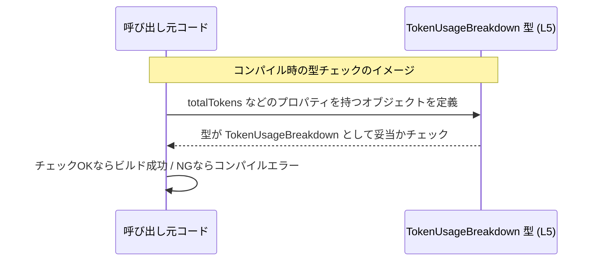

# app-server-protocol/schema/typescript/v2/TokenUsageBreakdown.ts コード解説

## 0. ざっくり一言

- トークン使用量の内訳を表す **TypeScript のオブジェクト型エイリアス** `TokenUsageBreakdown` を定義するファイルです（`TokenUsageBreakdown.ts:L5-5`）。
- `ts-rs` によって自動生成されるファイルであり、コメントに明記されているとおり **手動での編集は禁止**されています（`TokenUsageBreakdown.ts:L1-3`）。

---

## 1. このモジュールの役割

### 1.1 概要

- このモジュールは、トータルのトークン数と、その入力・キャッシュ済み入力・出力・推論用出力への内訳を表現するための **型定義** を提供します（`TokenUsageBreakdown.ts:L5-5`）。
- 実行時ロジックや関数は含まれず、**静的型付けによる安全性**と IDE 補完などの支援を与えることが主な役割です。

### 1.2 アーキテクチャ内での位置づけ

- ファイルパスから、この型が `app-server-protocol` の **TypeScript スキーマ（v2）** の一部であることが分かります（`TokenUsageBreakdown.ts` パス情報）。
- `export type` として公開されているため、他の TypeScript モジュールからインポートして使用されることが想定されます（`TokenUsageBreakdown.ts:L5-5`）。
- このチャンクには、どのモジュールがこの型を実際にインポートしているかは記載されていません。

依存関係のイメージ（インポート／エクスポートの関係）を Mermaid 図で示します。

```mermaid
graph TD
    subgraph "schema/typescript/v2"
        T["TokenUsageBreakdown 型 (L5)"]
    end

    OM["他の TypeScript コード\n（呼び出し側モジュール）"]
    OM -->|import { TokenUsageBreakdown }| T
```

### 1.3 設計上のポイント

- **自動生成コード**  
  - 冒頭コメントに「GENERATED CODE! DO NOT MODIFY BY HAND!」とあり、`ts-rs` による自動生成ファイルであることが明示されています（`TokenUsageBreakdown.ts:L1-3`）。
- **データのみ・ロジックなし**  
  - 関数やクラスは一切なく、オブジェクト型エイリアスのみを定義する **データ専用モジュール** です（`TokenUsageBreakdown.ts:L5-5`）。
- **全フィールド必須・number 型**  
  - 各プロパティは `number` 型で、オプショナル（`?`）指定が無いため **すべて必須プロパティ**となっています（`TokenUsageBreakdown.ts:L5-5`）。
- **エラーハンドリングや並行性の考慮は不要**  
  - 実行時処理を持たないため、エラーハンドリング・スレッドセーフティ・非同期処理といった観点はこのファイル単体では発生しません。

---

## 2. 主要な機能一覧

- トークン使用量内訳型の提供:  
  `TokenUsageBreakdown` 型で、合計トークン数と各種カテゴリ別トークン数を保持するオブジェクト構造を定義します（`TokenUsageBreakdown.ts:L5-5`）。

---

## 3. 公開 API と詳細解説

### 3.1 型一覧（構造体・列挙体など）

このファイルに定義されている公開型は 1 つです。

| 名前 | 種別 | 役割 / 用途 | 定義位置 |
|------|------|-------------|----------|
| `TokenUsageBreakdown` | 型エイリアス（オブジェクト型） | トークン使用量の合計と、入力・キャッシュ済み入力・出力・推論出力の各カテゴリごとのトークン数を保持するための型 | `TokenUsageBreakdown.ts:L5-5` |

`TokenUsageBreakdown` のプロパティ一覧（すべて `number` 型、必須）:

| プロパティ名 | 型 | 説明（用途） | 根拠 |
|--------------|----|--------------|------|
| `totalTokens` | `number` | 全トークン数を表す数値（トータルの使用量） | `TokenUsageBreakdown.ts:L5-5` |
| `inputTokens` | `number` | 入力として消費されたトークン数 | `TokenUsageBreakdown.ts:L5-5` |
| `cachedInputTokens` | `number` | キャッシュされた入力として扱われたトークン数 | `TokenUsageBreakdown.ts:L5-5` |
| `outputTokens` | `number` | 出力として生成されたトークン数 | `TokenUsageBreakdown.ts:L5-5` |
| `reasoningOutputTokens` | `number` | 推論（reasoning）用途の出力トークン数 | `TokenUsageBreakdown.ts:L5-5` |

> 補足: 名前から用途を説明していますが、「合計値と内訳の間に数値的制約（例: `totalTokens` が他の合計と等しい）」といった関係は型定義には現れていません。このチャンクからは **数値の整合性チェックは行われていない** ことだけが分かります。

### 3.2 関数詳細（最大 7 件）

- このファイルには **関数・メソッドは定義されていません**（`TokenUsageBreakdown.ts:L1-5`）。
- そのため、本セクションで詳細解説すべき関数はありません。

### 3.3 その他の関数

- 補助関数やラッパー関数も存在しません。

| 関数名 | 役割（1 行） |
|--------|--------------|
| なし | このファイルには関数定義がありません |

---

## 4. データフロー

このファイルは型のみを提供しますが、「型がどのように値の流れを制約するか」という観点で代表的なフローを概念的に整理します。

1. 呼び出し側コードが、API 応答や内部計測の結果として **トークン使用量の各数値を計算**します。
2. それらの数値をまとめて `TokenUsageBreakdown` 型として **オブジェクトを構築**します。
3. 型注釈／型推論により、**必要なプロパティが全て存在し `number` 型であることがコンパイル時にチェック**されます。
4. そのオブジェクトが、他モジュールへ渡されたり、シリアライズされて外部とやり取りされることが想定されます（実際の送受信処理はこのチャンクには現れません）。

Sequence diagram（利用イメージ。`TokenUsageBreakdown` 自体は型のみであり、実行時ロジックはありません）:



---

## 5. 使い方（How to Use）

### 5.1 基本的な使用方法

`TokenUsageBreakdown` 型をインポートして、トークン使用量の内訳オブジェクトを扱う基本的な例です。  
（インポートパスはプロジェクトの構成に依存するため、ここでは例として `./TokenUsageBreakdown` を用います。）

```typescript
// TokenUsageBreakdown 型をインポートする                      // 型のみインポートするため `import type` を使用
import type { TokenUsageBreakdown } from "./TokenUsageBreakdown"; 

// トークン使用量の内訳を表すオブジェクトを作成する           // TokenUsageBreakdown 型として注釈
const usage: TokenUsageBreakdown = {                              
    totalTokens: 1200,               // 合計トークン数
    inputTokens: 800,                // 入力トークン数
    cachedInputTokens: 100,          // キャッシュ済み入力トークン数
    outputTokens: 300,               // 出力トークン数
    reasoningOutputTokens: 0,        // 推論用出力トークン数
};

// usage をログに出力する                                      // 型チェック済みのオブジェクトとして安全に扱える
console.log("Token usage:", usage);
```

この例では:

- `TokenUsageBreakdown` により、全てのプロパティが `number` で存在することがコンパイル時に保証されます。
- キー名の打ち間違い（例: `totalToken`）や値の型ミス（例: `"100"`）はコンパイルエラーになります。

### 5.2 よくある使用パターン

#### パターン 1: ログ・モニタリング用の関数に渡す

`TokenUsageBreakdown` を受け取ってログを出す関数の例です。

```typescript
import type { TokenUsageBreakdown } from "./TokenUsageBreakdown";

// トークン使用量をログ出力する関数                            // 引数に TokenUsageBreakdown を要求
function logTokenUsage(usage: TokenUsageBreakdown): void {         
    // プロパティはすべて number 型として扱える               // 存在チェック不要（型が保証）
    console.log(
        `total=${usage.totalTokens}, ` +
        `input=${usage.inputTokens}, ` +
        `cached=${usage.cachedInputTokens}, ` +
        `output=${usage.outputTokens}, ` +
        `reasoning=${usage.reasoningOutputTokens}`,
    );
}
```

- 呼び出し側は必ず全プロパティを渡す必要があり、**不完全なデータ構造の渡し忘れを防止**できます。

#### パターン 2: 複数の使用量を集約する

複数の `TokenUsageBreakdown` を集約して合計値を求める例です。

```typescript
import type { TokenUsageBreakdown } from "./TokenUsageBreakdown";

// 複数の TokenUsageBreakdown を合計する                     // 配列の要素型としても利用可能
function sumTokenUsage(usages: TokenUsageBreakdown[]): TokenUsageBreakdown {
    return usages.reduce<TokenUsageBreakdown>(
        (acc, u) => ({
            totalTokens: acc.totalTokens + u.totalTokens,
            inputTokens: acc.inputTokens + u.inputTokens,
            cachedInputTokens: acc.cachedInputTokens + u.cachedInputTokens,
            outputTokens: acc.outputTokens + u.outputTokens,
            reasoningOutputTokens: acc.reasoningOutputTokens + u.reasoningOutputTokens,
        }),
        {
            totalTokens: 0,
            inputTokens: 0,
            cachedInputTokens: 0,
            outputTokens: 0,
            reasoningOutputTokens: 0,
        },
    );
}
```

- すべてのフィールドが number であるため、**数値演算での利用が自然**です。
- 型システムがプロパティの存在と型を保証するため、`acc.totalTokens ?? 0` のような存在チェックは不要です。

### 5.3 よくある間違い

#### 間違い例 1: プロパティの不足

```typescript
import type { TokenUsageBreakdown } from "./TokenUsageBreakdown";

// 間違い例: 必須プロパティを省略している
const badUsage: TokenUsageBreakdown = {
    totalTokens: 100,
    inputTokens: 80,
    // cachedInputTokens がない → コンパイルエラー
    outputTokens: 20,
    reasoningOutputTokens: 0,
};
```

- **問題点**: `cachedInputTokens` が定義されていないため、コンパイルエラーになります。
- **理由**: `TokenUsageBreakdown` のプロパティはすべて必須であり、オプション（`?`）指定はありません（`TokenUsageBreakdown.ts:L5-5`）。

#### 間違い例 2: 型の不一致

```typescript
import type { TokenUsageBreakdown } from "./TokenUsageBreakdown";

// 間違い例: number の代わりに string を渡している
const badUsage2: TokenUsageBreakdown = {
    totalTokens: 100,
    inputTokens: 80,
    cachedInputTokens: 10,
    outputTokens: 10,
    reasoningOutputTokens: "0", // ← string なのでコンパイルエラー
};
```

- **問題点**: `"0"` は `string` であり、`number` に代入できないためコンパイルエラー。
- **対処**: `0` のように `number` として記述するか、必要なら `Number(value)` 等で変換する必要があります。

### 5.4 使用上の注意点（まとめ）

- **全フィールド必須**  
  - すべてのプロパティが必須です。部分的なオブジェクトを扱いたい場合は、呼び出し側で `Partial<TokenUsageBreakdown>` など別の型を定義する必要があります。
- **number 型だが値域は型で表現されていない**  
  - トークン数は慣習的に非負整数であると考えられますが（名前からの推測）、型としては一般の `number` であり、負値や小数も表現できてしまいます。値域制約が必要な場合は、アプリケーション側で検証を行う必要があります。
- **ランタイム安全性**  
  - TypeScript の型はコンパイル時にのみ有効です。実行時にはプレーンな JavaScript オブジェクトになるため、外部入力を直接信頼する場合には手動のバリデーションが必要です。
- **並行性・エラー処理**  
  - この型自体は状態やロジックを持たないため、スレッドセーフティや例外処理などの問題は、この型の「利用側のコード」で発生します。このファイル単体ではそうした懸念はありません。

---

## 6. 変更の仕方（How to Modify）

このファイルは `ts-rs` による自動生成ファイルであり、コメントに **「DO NOT MODIFY BY HAND」** と明記されています（`TokenUsageBreakdown.ts:L1-3`）。  
したがって、このファイルを直接編集するのではなく、**元となる定義（通常は Rust 側の型定義）を変更してから再生成する**ことが前提になります。

### 6.1 新しい機能を追加する場合

ここでいう「新しい機能」は、たとえばトークン使用量に関する新しい項目を追加するなど、`TokenUsageBreakdown` の構造を拡張するケースを指します。

1. **元定義の特定**  
   - コメントから、この TypeScript 型は `ts-rs` によって生成されていることが分かります（`TokenUsageBreakdown.ts:L1-3`）。
   - 通常、`ts-rs` は Rust の構造体や型定義から TypeScript 型を生成するため、Rust 側に対応する型が存在すると考えられますが、このチャンクにはそのファイル名は現れません。

2. **元の型にフィールドを追加**  
   - Rust 側の対応する構造体等に、新しいフィールド（例: `billingTokens` など）を追加します。  
   - これは推測される一般的な手順であり、元定義の場所や名前はこのチャンクからは特定できません。

3. **ts-rs による再生成**  
   - `ts-rs` を再実行し、TypeScript 側のスキーマを再生成します。  
   - その結果として、本ファイルの `TokenUsageBreakdown` 型にも新しいプロパティが追加されます。

4. **利用側コードの修正**  
   - 新しいフィールドが必須かオプションかに応じて、既存の呼び出し側コードを更新する必要があります。

### 6.2 既存の機能を変更する場合

既存フィールド名の変更、型の変更、削除などを行う場合の観点です。

- **影響範囲の確認**  
  - `TokenUsageBreakdown` を利用している TypeScript コードは、このチャンクには現れません。そのため、IDE の参照検索などを使って、どこでこの型が使われているかを確認する必要があります。
- **互換性への注意**  
  - フィールドの削除・型変更は既存コードを壊す可能性があります。  
  - 特に API 契約（サーバーとクライアント間の JSON スキーマなど）を変更する場合は、双方の実装とドキュメントの更新が必要です。
- **自動生成ファイルの直接編集は不可**  
  - コメントにある通り、直接編集すると再生成時に上書きされ、変更が失われます（`TokenUsageBreakdown.ts:L1-3`）。  
  - 変更は必ず元定義側（Rust 等）で行う必要があります。

---

## 7. 関連ファイル

このチャンクに現れている情報からは、具体的な他ファイル名やパスは特定できません。  
ただし、推測される範囲での関係性を整理します（推測であることを明示します）。

- **同一ディレクトリ内の他スキーマファイル**（推測）  
  - `schema/typescript/v2` 配下には、他のスキーマ型定義ファイルが存在し、`TokenUsageBreakdown` と共に API のリクエスト／レスポンス型を構成している可能性があります。  
  - 具体的なファイル名は、このチャンクには現れません。

- **元となる ts-rs 対応ファイル**（推測）  
  - コメントにある `ts-rs` から、Rust 側に対応する型定義（構造体や型エイリアス）が存在すると考えられますが、そのパスや名称はこのチャンクからは分かりません。

このため、「密接に関係するファイル」の厳密な一覧表は、このチャンク単独からは作成できません。必要に応じて、リポジトリ全体の構成や `ts-rs` の設定ファイルを別途確認する必要があります。

---

### 付記: Bugs / Security / Edge Cases / Tests / Performance について

- **Bugs（バグの可能性）**  
  - このファイルは型定義のみであり、実行ロジックがないため、計算ミスのようなバグは含まれません。  
  - ただし、`totalTokens` と他プロパティの整合性が型レベルで担保されていない点は、アプリケーション側でのバグの温床になりうるため、必要なら別途チェックが必要です。

- **Security（セキュリティ）**  
  - 扱うのは数値のみであり、シリアライズ／デシリアライズなどもこのファイル内には存在しないため、このモジュール単体から直接的なセキュリティリスクは読み取れません。

- **Contracts / Edge Cases（契約とエッジケース）**  
  - 契約: 「全プロパティが `number` で存在するオブジェクト」であること。  
  - エッジケース: `NaN` / `Infinity` / `-Infinity` といった特殊な `number` 値や、実行時にプロパティが不足したオブジェクトが渡されるケースなどは、TypeScript の型だけでは防げないため、利用側のバリデーションに依存します。

- **Tests（テスト）**  
  - このファイル内にテストコードは存在しません。  
  - 型整合性のテストは一般にコンパイラによって担保されるため、別途ランタイムバリデーションのテストが必要かどうかは利用側の設計次第です。

- **Performance / Scalability（性能・スケーラビリティ）**  
  - 単なる型定義であり、実行時コストは一切発生しません。性能・スケーラビリティへの影響はありません。
