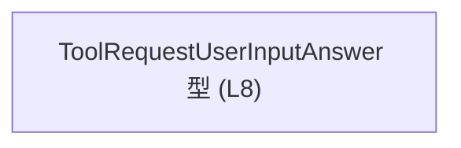
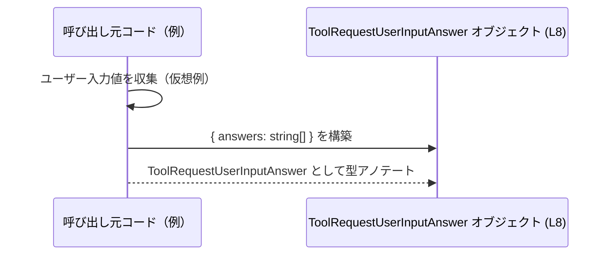

# app-server-protocol/schema/typescript/v2/ToolRequestUserInputAnswer.ts

## 0. ざっくり一言

`request_user_input` 質問に対するユーザーの回答を、文字列配列として保持するための TypeScript 型エイリアスを定義しているファイルです（ToolRequestUserInputAnswer.ts:L5-8）。

---

## 1. このモジュールの役割

### 1.1 概要

- このモジュールは、**ユーザー入力型の質問への回答内容を表現するデータ構造**を TypeScript で提供します。
- 自動生成された型であり、`ToolRequestUserInputAnswer` 型を通じて、ユーザーの回答（複数行・複数項目を想定しうる文字列の配列）を表現します（ToolRequestUserInputAnswer.ts:L5-8）。
- ファイル先頭コメントにより、この型定義は [`ts-rs`](https://github.com/Aleph-Alpha/ts-rs) による生成物であり、手動で編集すべきではないことが示されています（ToolRequestUserInputAnswer.ts:L1-3）。

### 1.2 アーキテクチャ内での位置づけ

このチャンクに現れる要素は、以下の 1 つだけです。

- `ToolRequestUserInputAnswer` 型エイリアス（エクスポートされる公開型）: ToolRequestUserInputAnswer.ts:L8-8

依存関係について、このファイル内には `import` 文などは存在せず、他モジュールへの直接依存は確認できません（ToolRequestUserInputAnswer.ts:L1-8）。

以下の Mermaid 図は、本チャンクに現れるコンポーネントのみを示した **コードベースに対する事実ベースの依存関係図**です。



- 外部から `ToolRequestUserInputAnswer` を import して利用するコードは、このチャンクには現れないため不明です。

### 1.3 設計上のポイント

コードから読み取れる設計上の特徴は次のとおりです。

- **自動生成コードであることが明示**  
  - 「GENERATED CODE」「Do not edit manually」と明記され、開発者が直接編集しない前提になっています（ToolRequestUserInputAnswer.ts:L1-3）。
- **シンプルなレコード型のみを定義**  
  - `export type ToolRequestUserInputAnswer = { answers: Array<string>, };` という 1 つのレコード型だけをエクスポートします（ToolRequestUserInputAnswer.ts:L8-8）。
- **状態やロジックを持たない**  
  - 関数・クラス・メソッドは存在せず、**純粋な型情報**だけを提供します（ToolRequestUserInputAnswer.ts:L1-8）。
- **複数回答に対応できる形**  
  - `answers` は `Array<string>` であり、複数の文字列回答を保持できる設計です（ToolRequestUserInputAnswer.ts:L8-8）。
- **エラーハンドリング・並行性は型レベルでは未定義**  
  - 実行時のバリデーションやエラー処理、並行性制御に関するロジックは一切含まれておらず、利用側のコードに委ねられています。

---

## 2. 主要な機能一覧

このファイルは「機能」というより「データ構造」を 1 つだけ提供します。

- `ToolRequestUserInputAnswer`:  
  `request_user_input` 質問に対するユーザーの回答を、`answers: Array<string>` プロパティとして保持する型（ToolRequestUserInputAnswer.ts:L5-8）。

### 2.1 コンポーネントインベントリー（本チャンク）

このチャンクに出現する型・関数・その他の公開要素の一覧です。

| 名前                          | 種別         | 内容 / 役割                                                                                     | 根拠 |
|-----------------------------|------------|-----------------------------------------------------------------------------------------------|------|
| `ToolRequestUserInputAnswer` | 型エイリアス | オブジェクト型 `{ answers: Array<string> }` を表すエイリアス。ユーザー回答文字列の配列を保持するためのコンテナ。 | ToolRequestUserInputAnswer.ts:L5-8 |

- このファイルには関数・クラス・列挙体・定数など、他のコンポーネントは存在しません（ToolRequestUserInputAnswer.ts:L1-8）。

---

## 3. 公開 API と詳細解説

### 3.1 型一覧（構造体・列挙体など）

| 名前                          | 種別         | フィールド              | 役割 / 用途                                                                 | 根拠 |
|-----------------------------|------------|-----------------------|---------------------------------------------------------------------------|------|
| `ToolRequestUserInputAnswer` | 型エイリアス | `answers: Array<string>` | ユーザーが `request_user_input` 質問に対して入力した回答文字列の配列を保持するためのオブジェクト型。 | ToolRequestUserInputAnswer.ts:L5-8 |

#### `ToolRequestUserInputAnswer` の構造

```typescript
export type ToolRequestUserInputAnswer = {
    answers: Array<string>, // ユーザー回答を表す文字列の配列
};
```

- `answers`  
  - 型: `Array<string>`（`string[]` と同等）  
  - 意味: ユーザーが入力した回答行・回答要素を表す文字列のリスト（ToolRequestUserInputAnswer.ts:L5-8）。
- コメント  
  - 「Captures a user's answer to a request_user_input question.」とあり、`request_user_input` タイプの質問に対する回答を格納する用途であることが明示されています（ToolRequestUserInputAnswer.ts:L5-7）。

#### 型安全性

- TypeScript コンパイラは `answers` に対して **文字列以外の値が代入された場合にエラー**を出します。
- `answers` プロパティ自体は **必須プロパティ**であり、`ToolRequestUserInputAnswer` 型として定義する場合、`answers` を省略すると型エラーとなります（ToolRequestUserInputAnswer.ts:L8-8）。
- 実行時のチェックはこのファイルには含まれず、**コンパイル時の型チェックのみ**が提供されます。

### 3.2 関数詳細（最大 7 件）

このファイルには関数が定義されていないため、詳説すべき関数は存在しません（ToolRequestUserInputAnswer.ts:L1-8）。

### 3.3 その他の関数

- なし（このチャンクには関数定義が現れません）。

---

## 4. データフロー

このファイル自体は型定義のみであり、実際の処理ロジックや I/O は含まれていません（ToolRequestUserInputAnswer.ts:L1-8）。  
ここでは、**この型を利用する仮想的な処理シナリオ**を示し、`ToolRequestUserInputAnswer` オブジェクトの内部データフローをイメージしやすくします。

> 注意: 以下のシーケンス図は「この型がどのように使われうるか」の例であり、**実際のコードベースに存在する処理フローであるとは限りません**。具体的な呼び出し元や API 名はこのチャンクには現れません。



この仮想シナリオにおける要点:

- 呼び出し元コードはユーザーからの入力文字列を配列として集約します（例: テキストボックスの複数行入力）。
- その配列を `answers` プロパティにセットしたオブジェクトを作成し、それを `ToolRequestUserInputAnswer` 型として扱います（ToolRequestUserInputAnswer.ts:L8-8）。
- その後の送信先（サーバー・別コンポーネントなど）やシリアライズ方式は、このチャンクには現れないため不明です。

---

## 5. 使い方（How to Use）

### 5.1 基本的な使用方法

`ToolRequestUserInputAnswer` を型として利用し、ユーザー回答オブジェクトを構築する基本的な例です。

```typescript
// ToolRequestUserInputAnswer 型を利用する（import パスはプロジェクト構成に依存）
// import type { ToolRequestUserInputAnswer } from "./ToolRequestUserInputAnswer";

type ToolRequestUserInputAnswer = {           // ここでは説明用に同じ型を再定義
    answers: Array<string>;                  // ユーザーの回答文字列の配列
};

// ユーザーが単一行の回答を入力したケース
const singleLineAnswer: ToolRequestUserInputAnswer = {
    answers: ["はい"],                        // 配列の中身は string 型のみ許可される
};

// 複数行・複数回答をまとめて保持するケース
const multiLineAnswer: ToolRequestUserInputAnswer = {
    answers: [
        "いいえ",
        "その理由は〜〜〜です。",              // 複数の文字列を順番つきで保持可能
    ],
};

// その後、このオブジェクトをプロトコル用の送信関数などに渡す想定（このチャンクには未定義）
```

- `answers` に渡す値は **必ず配列**であり、単一の文字列をそのまま入れるとコンパイルエラーになります。
- TypeScript の型チェックにより、`answers` に `number` や `boolean` を含めるコードはコンパイル時に検出されます。

### 5.2 よくある使用パターン

1. **単一回答を配列化して送る**

```typescript
function buildAnswerFromSingleInput(input: string): ToolRequestUserInputAnswer {
    return {
        answers: [input],                     // 単一の入力も配列にラップして格納
    };
}
```

1. **複数のフィールドをまとめて 1 つの回答として扱う**

```typescript
function buildAnswerFromForm(
    title: string,
    description: string,
): ToolRequestUserInputAnswer {
    return {
        answers: [title, description],        // 複数フィールドを順序付きで格納
    };
}
```

### 5.3 よくある間違い

```typescript
// 誤り例: answers に string を直接入れている
const wrong1: ToolRequestUserInputAnswer = {
    // 型エラー: Type 'string' is not assignable to type 'string[]'
    // answers: "はい",
    answers: ["はい"],                         // 正しくは配列にする
};

// 誤り例: answers を省略している
// const wrong2: ToolRequestUserInputAnswer = {}; // 型エラー: プロパティ 'answers' が必須

// 正しい例: 必須プロパティ answers を指定し、配列として渡す
const correct: ToolRequestUserInputAnswer = {
    answers: [],                              // 空回答として扱う場合も、空配列にする
};
```

### 5.4 使用上の注意点（まとめ）

- **必須プロパティ**  
  - `answers` は必須であり、省略するとコンパイルエラーになります（ToolRequestUserInputAnswer.ts:L8-8）。
- **型の一貫性**  
  - `answers` 内の要素はすべて `string` 型でなければなりません。型の不一致はコンパイル時に検出されます。
- **空配列の扱い**  
  - 型定義上、空配列は許可されています。空配列を「未回答」とみなすかどうかは、呼び出し側ロジックに依存し、このファイルからは読み取れません。
- **実行時エラーや並行性の扱い**  
  - この型定義は実行時ロジックを含まないため、実行時のエラー処理・並行処理（例: 同時に複数回答を送る）の扱いは利用側に委ねられます。
- **セキュリティ**  
  - ユーザー入力をそのまま文字列として保持するため、実際の利用時には **XSS 対策やログのマスキング**などは別途実装する必要がありますが、その実装はこのチャンクには現れません。

---

## 6. 変更の仕方（How to Modify）

### 6.1 新しい機能を追加する場合

このファイルは `ts-rs` により自動生成されており、「Do not edit manually」と明記されています（ToolRequestUserInputAnswer.ts:L1-3）。  
そのため、**直接このファイルを編集することは推奨されません**。

一般的な ts-rs の利用形態から考えられること（外部知識）:

- 通常は、Rust 側の構造体・型定義を変更し、ts-rs に再度コード生成させることで TypeScript 側の型を更新します。
- しかし、このリポジトリ内でその元になっている Rust 側の定義がどこにあるかは、このチャンクからは分かりません。

このため、このチャンクに基づいて確実に言えることは次のとおりです。

- `ToolRequestUserInputAnswer` にフィールドを増やしたり、型を変えたりする必要がある場合でも、**このファイルを直接編集すると再生成時に上書きされる可能性が高い**（ToolRequestUserInputAnswer.ts:L1-3）。
- 変更を行う際は、「このファイルの生成元（ts-rs の入力元）」を特定し、そちらに変更を加える必要がありますが、その位置はこのチャンクからは不明です。

### 6.2 既存の機能を変更する場合

`ToolRequestUserInputAnswer` は非常に単純な型ですが、変更時に注意すべき点を整理します。

- **影響範囲の確認**  
  - `ToolRequestUserInputAnswer` を import している箇所はこのチャンクには現れないため、実際のプロジェクト内で検索して確認する必要があります（このチャンクでは不明）。
- **契約（前提条件）の保持**  
  - コメントから読み取れる契約: 「`request_user_input` 質問に対するユーザーの回答を表す」という意味（ToolRequestUserInputAnswer.ts:L5-7）。
  - この意味を変えてしまうようなフィールド名・型の変更は、プロトコル仕様そのものの変更になりうる点に注意が必要です。
- **エッジケース**  
  - `answers` が空配列の場合や、非常に長い配列の場合にどう扱うかは利用側に依存します。型レベルでは拒否できないため、利用側でのバリデーションが重要です。
- **テスト・検証**  
  - このファイル単体にはテストは含まれません。プロトコル・シリアライズ／デシリアライズのテスト側で、`answers` フィールドの存在や型を確認するテストを持つことが望ましいですが、このチャンクにはその情報は現れません。

---

## 7. 関連ファイル

このチャンクでは、`ToolRequestUserInputAnswer.ts` 以外のファイル内容は提供されていないため、具体的にどのファイルと関連しているかは分かりません。

| パス | 役割 / 関係 |
|------|------------|
| 不明 | このチャンクには他ファイルの情報が現れないため、関連ファイルは特定できません。 |

ディレクトリ名 `app-server-protocol/schema/typescript/v2` から、このファイルが「アプリケーションサーバーのプロトコル v2 の TypeScript スキーマ群」の一部であることは推測されますが、同ディレクトリ内の他ファイルの名前・内容・依存関係は、このチャンクからは読み取れません。
