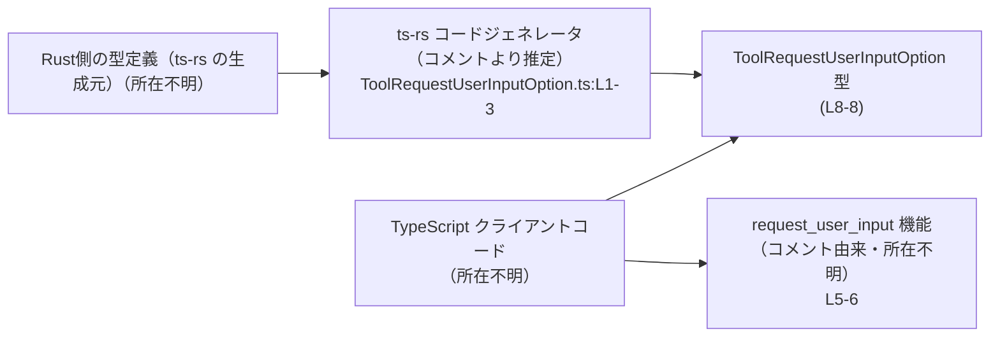
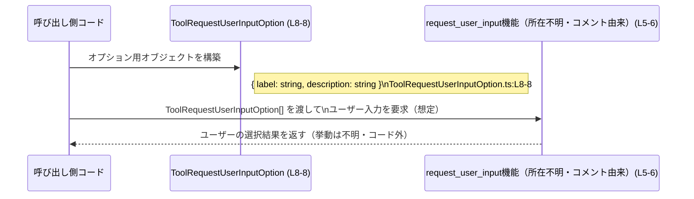

# app-server-protocol/schema/typescript/v2/ToolRequestUserInputOption.ts コード解説

## 0. ざっくり一言

`ToolRequestUserInputOption` は、`request_user_input` で利用される「単一の選択肢」を表す TypeScript の型エイリアスです（ToolRequestUserInputOption.ts:L5-8）。  
`label` と `description` という 2 つの必須文字列プロパティのみを持つ、ts-rs による自動生成コードです（ToolRequestUserInputOption.ts:L1-3, L8-8）。

---

## 1. このモジュールの役割

### 1.1 概要

- このファイルは、`request_user_input` 機能で使われる **一つの選択肢オブジェクトの構造** を TypeScript 型として定義します（ToolRequestUserInputOption.ts:L5-8）。
- Rust 側の定義から ts-rs によって自動生成されるため、**アプリケーションサーバのプロトコルスキーマを TypeScript で表現する一部**と考えられます（ToolRequestUserInputOption.ts:L1-3）。
- 実行時のロジックや関数は含まれず、**コンパイル時の型安全性を提供するためだけのモジュール**です（ToolRequestUserInputOption.ts:L1-8）。

### 1.2 アーキテクチャ内での位置づけ

- パス `schema/typescript/v2` から、このファイルは **「v2」バージョンの TypeScript 向けプロトコルスキーマ群**の一部であると読み取れます（ToolRequestUserInputOption.ts:L1-8）。
- コメントにあるとおり、Rust 側の型定義を ts-rs で変換した結果として、この TypeScript 型が生成されています（ToolRequestUserInputOption.ts:L1-3）。
- この型は、アプリケーション側（UI やクライアントコード）が `request_user_input` に渡すオプション配列などで利用されることが想定されます（ToolRequestUserInputOption.ts:L5-6）。

アーキテクチャ関係を概念図として表すと、次のようになります（Rust 側や `request_user_input` 自体の定義はこのチャンクには現れないため、所在は不明です）。



### 1.3 設計上のポイント

- **自動生成コード**  
  - ファイル先頭で「GENERATED CODE! DO NOT MODIFY BY HAND!」と明示されており（ToolRequestUserInputOption.ts:L1-1）、さらに ts-rs による自動生成であること、手動編集禁止であることが記載されています（ToolRequestUserInputOption.ts:L3-3）。
  - 変更は **このファイルではなく生成元（Rust 側の型）** で行う前提です。

- **実験的（EXPERIMENTAL）な API**  
  - JSDoc コメントに "EXPERIMENTAL" とあり、この型がまだ安定していない API の一部であることが示唆されています（ToolRequestUserInputOption.ts:L5-6）。
  - 将来の破壊的変更の可能性が他の型より高いと考えられます。

- **シンプルな構造・状態なし**  
  - 実体は `{ label: string, description: string }` だけを持つオブジェクト型で、内部状態やメソッドはありません（ToolRequestUserInputOption.ts:L8-8）。
  - エラー処理や並行処理のロジックは存在せず、**型レベルの契約のみ**を提供します。

- **TypeScript の型安全性**  
  - `label` と `description` が `string` 型で必須プロパティとして定義されており（ToolRequestUserInputOption.ts:L8-8）、これにより:
    - これらを省略したオブジェクトの代入はコンパイル時エラーになります（TypeScript の構造的型チェックによる安全性）。
    - 実行時には型情報は消えるため、**ランタイムでの検証は別途行う必要がある**というのが TypeScript 固有の注意点です。

### 1.4 コンポーネントインベントリー（概要）

このチャンクに現れる「コンポーネント」（型・エイリアス）の一覧です。

| 名前                         | 種別                         | エクスポート | 行範囲                                | 役割 / 用途 |
|------------------------------|------------------------------|-------------|----------------------------------------|-------------|
| `ToolRequestUserInputOption` | オブジェクト型の型エイリアス | `export`    | ToolRequestUserInputOption.ts:L8-8     | `request_user_input` で使用される 1 つの選択肢を表現する。`label` と `description` の 2 つの必須文字列プロパティを持つ。 |

---

## 2. 主要な機能一覧

このファイルは関数を持たず、1 つの型エイリアスだけを提供します。  
ここでは「機能」を「提供されるデータ構造」として整理します。

- `ToolRequestUserInputOption` 型:  
  - `request_user_input` のための **単一の選択肢オブジェクト**を表す（ToolRequestUserInputOption.ts:L5-6）。
  - プロパティ:
    - `label: string` – 選択肢の表示ラベル（ToolRequestUserInputOption.ts:L8-8）。
    - `description: string` – 選択肢の説明文（ToolRequestUserInputOption.ts:L8-8）。

---

## 3. 公開 API と詳細解説

### 3.1 型一覧（構造体・列挙体など）

#### 型エイリアス `ToolRequestUserInputOption`

| 項目         | 内容 |
|--------------|------|
| 名前         | `ToolRequestUserInputOption` |
| 種別         | オブジェクト型の型エイリアス |
| エクスポート | あり（`export type`）（ToolRequestUserInputOption.ts:L8-8） |
| 行範囲       | ToolRequestUserInputOption.ts:L8-8 |
| 役割         | `request_user_input` における 1 つの選択肢の形を定義する（ToolRequestUserInputOption.ts:L5-6）。 |

**プロパティ一覧**

| プロパティ名   | 型      | 必須 / 任意 | 説明 | 行範囲 |
|----------------|---------|------------|------|--------|
| `label`        | `string` | 必須       | UI 等で表示する選択肢のラベル。 | ToolRequestUserInputOption.ts:L8-8 |
| `description`  | `string` | 必須       | 選択肢の内容や効果を説明するテキスト。 | ToolRequestUserInputOption.ts:L8-8 |

TypeScript の観点では、この型エイリアスは「構造的な契約」を表します。  
オブジェクトが `ToolRequestUserInputOption` とみなされるには、少なくとも `label` と `description` の 2 つの `string` プロパティを持っている必要があります。

- **型安全性**  
  - これらのプロパティを持たないオブジェクトを代入しようとするとコンパイルエラーになります。
  - 逆に、追加のプロパティが存在していても、代入コンテキストによっては許容されることがあります（TypeScript の構造的型システムによる）。

- **エラー / 並行性**  
  - この型自体には実行時エラーや並行性制御は含まれません。  
    すべて **コンパイル時の型チェックのみ** による安全性です（ToolRequestUserInputOption.ts:L8-8）。

### 3.2 関数詳細（最大 7 件）

このファイルには **関数・メソッドは一切定義されていません**（ToolRequestUserInputOption.ts:L1-8）。  
したがって、関数詳細テンプレートを適用できる対象はありません。

### 3.3 その他の関数

- 該当なし（関数定義自体が存在しません）（ToolRequestUserInputOption.ts:L1-8）。

---

## 4. データフロー

このファイルは型定義のみですが、JSDoc コメントから **`request_user_input` に渡すオプションの形**を定めていることが分かります（ToolRequestUserInputOption.ts:L5-6）。  
この型が関与する典型的な処理フローは、概念的には次のようになります。

1. 呼び出し側コードが `ToolRequestUserInputOption` 型のオブジェクトを構築する（ToolRequestUserInputOption.ts:L8-8）。
2. それらを `ToolRequestUserInputOption[]` のような配列にまとめる。
3. その配列を `request_user_input` 機能に渡し、ユーザーに選択させる。  
   （`request_user_input` 自体の定義や戻り値は、このチャンクには現れないため不明です。）

> 注: `request_user_input` の存在はコメントにのみ記載されており（ToolRequestUserInputOption.ts:L5-6）、実際の関数・メソッドとしてどこに定義されているかは、このチャンクだけでは分かりません。

### シーケンス図（概念図）



この図のうち、**実際にこのファイルに存在するのは `ToolRequestUserInputOption` 型のみ**です。  
`request_user_input` の実装・戻り値や、結果の扱いなどは **このチャンクには現れません**。

---

## 5. 使い方（How to Use）

### 5.1 基本的な使用方法

`ToolRequestUserInputOption` を利用する典型例として、複数の選択肢を配列にまとめて `request_user_input` に渡すコードを想定した TypeScript の利用例です。  
`requestUserInput` 関数は仮の名前であり、このチャンクには定義されていません。

```ts
// 型エイリアスのインポート（実際の相対パスはプロジェクト構成によります）
import type { ToolRequestUserInputOption } from "./ToolRequestUserInputOption"; // 型のみをインポート

// ToolRequestUserInputOption 型の配列を定義する
const options: ToolRequestUserInputOption[] = [
  {
    label: "Approve",                              // ユーザーに表示するラベル
    description: "Allow the tool to continue",     // ラベルの説明
  },
  {
    label: "Deny",
    description: "Stop the tool from executing",
  },
];

// 仮想的な requestUserInput 呼び出し例（この関数はこのチャンクには存在しません）
// await requestUserInput({ options });
```

この例から分かる TypeScript 固有の安全性:

- `label` または `description` を省略すると、`ToolRequestUserInputOption` に代入する時点でコンパイルエラーになります（ToolRequestUserInputOption.ts:L8-8）。
- 型は `string` で固定されているため、`number` などを代入するとコンパイルエラーになります。

一方で、ランタイムでは型情報が消えるため、外部からの JSON をパースして `any` 経由で流してしまうと、実行時に構造がずれてもコンパイラでは検知できません。  
必要に応じて、ランタイムでのバリデーション（zod など）を別途行う必要があります。

### 5.2 よくある使用パターン

1. **固定候補の列挙**

   選択肢が固定であれば、定数として定義して流用できます。

   ```ts
   import type { ToolRequestUserInputOption } from "./ToolRequestUserInputOption";

   // 再利用可能な選択肢定義
   const YES_NO_OPTIONS: ToolRequestUserInputOption[] = [
     { label: "Yes", description: "Proceed with the operation" },
     { label: "No", description: "Cancel and go back" },
   ];

   // どこかの処理で利用
   // await requestUserInput({ options: YES_NO_OPTIONS });
   ```

2. **動的生成**

   設定やサーバレスポンスから選択肢を生成する場合も、型を付けておくことで IDE 補完や型チェックの恩恵を受けられます。

   ```ts
   import type { ToolRequestUserInputOption } from "./ToolRequestUserInputOption";

   function toOption(label: string, description: string): ToolRequestUserInputOption {
     // 引数に型注釈があるため、呼び出し側で誤った型を渡すとコンパイルエラーになる
     return { label, description };
   }
   ```

### 5.3 よくある間違い

1. **プロパティの付け忘れ**

   ```ts
   const badOption: ToolRequestUserInputOption = {
     label: "Approve",
     // description を書き忘れている → コンパイルエラー
   };
   ```

   - `description` は必須プロパティなので、TypeScript コンパイラがエラーを報告します（ToolRequestUserInputOption.ts:L8-8）。

2. **手動でファイルを編集する**

   ```ts
   // GENERATED CODE! DO NOT MODIFY BY HAND!
   ```

   - このコメントが示すように（ToolRequestUserInputOption.ts:L1-1）、手動編集は想定されていません。
   - このファイルを直接書き換えると、ts-rs の再生成で上書きされるか、Rust 側との不整合を生む可能性があります（ToolRequestUserInputOption.ts:L1-3）。

3. **任意の文字列をそのまま HTML に埋め込む**

   - 型としては `string` であれば何でも許容されるため（ToolRequestUserInputOption.ts:L8-8）、ユーザー入力をそのまま `label` や `description` に格納し、エスケープせずに HTML に挿入すると XSS のリスクがあります。
   - セキュリティ上の観点から、**表示時にエスケープ処理やサニタイズ**を行う必要があります。この型だけではそれを強制できません。

### 5.4 使用上の注意点（まとめ）

- **自動生成ファイルであるため編集禁止**  
  - 変更は Rust 側の生成元に対して行い、ts-rs で再生成する必要があります（ToolRequestUserInputOption.ts:L1-3）。

- **コンパイル時のみの保証**  
  - TypeScript の型はランタイムには存在しないため、外部からのデータに対しては別途バリデーションが必要です（ToolRequestUserInputOption.ts:L8-8）。

- **文字列内容の安全性は保証されない**  
  - `string` 型である以上、XSS などの対策は利用側で行う必要があります（ToolRequestUserInputOption.ts:L8-8）。

- **並行性・パフォーマンスへの影響はほぼない**  
  - 型定義のみであり、実行時の処理や計算を持たないため、性能や並行性に直接の影響はありません（ToolRequestUserInputOption.ts:L1-8）。

---

## 6. 変更の仕方（How to Modify）

### 6.1 新しい機能を追加する場合

このファイルは ts-rs による自動生成であり、冒頭で「Do not modify by hand」と明示されています（ToolRequestUserInputOption.ts:L1-3）。  
したがって、ここに新しいフィールドや機能を追加したい場合は、次の手順になります。

1. **Rust 側の対応する型定義を修正する**  
   - ts-rs は Rust の構造体や列挙体などから TypeScript を生成します。  
   - 追加したいプロパティ（例: `id: String` など）を Rust 側定義に追加します。  
   - Rust 側の型定義の所在は、このチャンクには現れません。

2. **ts-rs を実行して TypeScript を再生成する**  
   - ビルドプロセスやスクリプトを通じて ts-rs を再実行し、新しい型定義が出力されるようにします（ToolRequestUserInputOption.ts:L1-3 のコメントより推定）。

3. **TypeScript 側の利用コードを更新する**  
   - 新しいプロパティの追加に伴い、`ToolRequestUserInputOption` を生成・利用するコードを更新します。

### 6.2 既存の機能を変更する場合

例えば `label` の意味を変えたり、`description` を任意にしたい場合も、同様に **生成元の Rust 型** を変更する必要があります。

変更時の注意点:

- **影響範囲の確認**
  - `ToolRequestUserInputOption` をインポートしているすべての TypeScript ファイルを検索し、利用箇所を確認する必要があります。
  - フィールド名の変更や削除は、多くのコンパイルエラーとして現れるため、それを手がかりに影響箇所を洗い出せます。

- **契約（コントラクト）の変化**
  - この型は、アプリケーションサーバプロトコルの一部であると考えられるため（パスとコメントからの推測）、変更はクライアント側・サーバ側双方の合意された仕様変更になります。
  - 特に `"EXPERIMENTAL"` とあることから（ToolRequestUserInputOption.ts:L5-6）、今後仕様が変わる可能性はありますが、現時点での詳細な運用ルールはこのチャンクからは分かりません。

- **テスト**
  - このファイルにはテストコードは含まれていません（ToolRequestUserInputOption.ts:L1-8）。  
    変更後は、`request_user_input` 全体の統合テストなどで正しく動作するか確認する必要があります。

---

## 7. 関連ファイル

このチャンクには他ファイルへの直接の参照はありませんが、コメントやパスから推測できる範囲で関連するコンポーネントを整理します。

| パス / コンポーネント | 種別 | 役割 / 関係 |
|------------------------|------|------------|
| Rust 側の対応する型定義（所在不明） | Rust 構造体または列挙体（推定） | ts-rs がこの TypeScript 型を生成する元になっていると考えられます（ToolRequestUserInputOption.ts:L1-3）。具体的なファイルパスや型名はこのチャンクには現れません。 |
| ts-rs 設定・ビルドスクリプト（所在不明） | ビルド設定 | `ToolRequestUserInputOption.ts` を生成するための ts-rs 実行設定。どのコマンドやビルドステップで生成されるかは、このチャンクからは不明です（ToolRequestUserInputOption.ts:L1-3）。 |
| `request_user_input` 機能の実装（所在不明） | 関数 / メソッド等（推定） | JSDoc コメントが示す、この型の利用先です（ToolRequestUserInputOption.ts:L5-6）。どのファイルにどのような形で定義されているかは、このチャンクには現れません。 |

---

### まとめ

- このファイルは **自動生成された TypeScript 型定義**であり、`request_user_input` 機能で利用される単一の選択肢を表現します（ToolRequestUserInputOption.ts:L1-3, L5-8）。
- 実行時のロジックは持たず、**コンパイル時の型安全性**と他言語（Rust）とのスキーマ整合性を保つための役割を果たしています。
- 変更は必ず生成元（Rust 側）で行い、ts-rs による再生成を行う必要があります（ToolRequestUserInputOption.ts:L1-3）。
