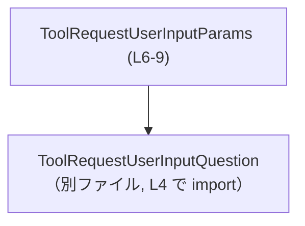
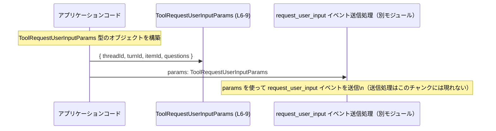

# app-server-protocol\schema\typescript\v2\ToolRequestUserInputParams.ts コード解説

## 0. ざっくり一言

`ToolRequestUserInputParams` は、`request_user_input` というイベントに添付されるパラメータの構造を TypeScript の型として表現した、**自動生成されたスキーマ定義ファイル**です（ToolRequestUserInputParams.ts:L1-3, L6-7）。

---

## 1. このモジュールの役割

### 1.1 概要

- このモジュールは、`request_user_input` イベントに紐づくパラメータを型安全に扱うための **TypeScript 型エイリアス**を提供します（L6-7, L9）。
- すべてのフィールドは必須で、文字列 ID と質問リストから構成されます（L9）。

### 1.2 アーキテクチャ内での位置づけ

- このファイルは `ts-rs` により生成されており、Rust 側の定義を TypeScript 型に同期させる役割を持ちます（L3）。
- `ToolRequestUserInputParams` は、同一ディレクトリの `ToolRequestUserInputQuestion` 型に依存しています（L4, L9）。
- 実際のイベント送信処理やクライアント実装は、このチャンクには含まれていません（L1-9 には型定義とコメントのみ）。

依存関係を簡略化して表すと次のようになります。



- 図のとおり、`ToolRequestUserInputParams` が質問要素を表す `ToolRequestUserInputQuestion` を利用する一方向依存になっています。

### 1.3 設計上のポイント

- **自動生成コード**  
  - 冒頭コメントに「GENERATED CODE」「ts-rs により生成」と明記されており、手動編集しない前提のファイルです（L1, L3）。
- **純粋な型定義のみ**  
  - 関数やクラスは存在せず、`export type` によるオブジェクト型エイリアスのみが公開 API です（L9）。
- **必須フィールドのみ**  
  - オプショナル (`?`) プロパティは存在せず、4 つすべてのフィールドが必須です（L9）。
- **型安全性の確保**  
  - 各 ID は `string` 型、`questions` は `ToolRequestUserInputQuestion` 型の配列として定義されており、不正な型の代入はコンパイル時に検出されます（L4, L9）。
- **エラー・並行性**  
  - このファイルには実行時の処理や非同期処理は含まれないため、エラー処理や並行性に関するロジックは一切持ちません。安全性はあくまで「型チェック」によるものです（L1-9）。

---

## 2. 主要な機能一覧

このファイルは 1 つの型エイリアスのみを提供します。

- `ToolRequestUserInputParams`: `request_user_input` イベントに添付されるパラメータ（スレッド ID・ターン ID・アイテム ID・質問リスト）の構造を表す型（L6-7, L9）。

---

## 3. 公開 API と詳細解説

### 3.1 型一覧（構造体・列挙体など）

| 名前                           | 種別                       | 役割 / 用途                                                                 | 定義 / 使用箇所                           |
|--------------------------------|----------------------------|------------------------------------------------------------------------------|-------------------------------------------|
| `ToolRequestUserInputParams`   | 型エイリアス（オブジェクト型） | `request_user_input` イベントのパラメータペイロードの構造を表現する         | 定義: ToolRequestUserInputParams.ts:L6-9 |
| `ToolRequestUserInputQuestion` | 外部型（import のみ）      | `questions` 配列の要素の型。個々のユーザー質問を表すと推測されるが、詳細はこのチャンクには現れない | import: ToolRequestUserInputParams.ts:L4 |

※ `ToolRequestUserInputQuestion` の具体的なフィールド構造はこのチャンクには含まれておらず、不明です（L4）。

### 3.2 主要な公開データ構造の詳細（`ToolRequestUserInputParams`）

このファイルには関数が存在しないため、もっとも重要な公開 API である `ToolRequestUserInputParams` 型について、関数テンプレートに準じた形式で詳細を記述します。

#### `ToolRequestUserInputParams`

**概要**

- `request_user_input` イベントとともに送信されるパラメータの型です（JSDoc コメントより, L6-7）。
- スレッド・ターン・アイテムの識別子と、ユーザーに提示する質問の配列をまとめて表現します（L9）。

**フィールド**

| フィールド名  | 型                                        | 説明 |
|---------------|-------------------------------------------|------|
| `threadId`    | `string`                                  | 対象となるスレッド（会話など）を識別する ID。形式や値の制約はこのファイルからは分かりません（L9）。 |
| `turnId`      | `string`                                  | スレッド内の特定のターン（発話・ステップなど）を識別する ID（L9）。 |
| `itemId`      | `string`                                  | ターン内の特定アイテムを識別する ID。具体的に何を指すかはこのチャンクには現れません（L9）。 |
| `questions`   | `Array<ToolRequestUserInputQuestion>`     | ユーザーに対して提示する質問のリスト。各要素は `ToolRequestUserInputQuestion` 型です（L4, L9）。 |

**型としての役割**

- この型は「**契約（コントラクト）**」として、  
  「`request_user_input` イベントに付随するパラメータは、上記 4 フィールドを必ず含み、指定の型でなければならない」  
  という前提をコンパイル時に保証します（L6-7, L9）。

**Examples（使用例）**

`ToolRequestUserInputParams` 型の値を生成して、他の API に渡す基本的な例です。ここで使う `ToolRequestUserInputQuestion` の詳細はこのチャンクには現れないため、プレースホルダー的に扱っています。

```typescript
// 型定義の import（ファイルパスはこのファイルからの相対パスを利用, L4, L9）
import type { ToolRequestUserInputParams } from "./ToolRequestUserInputParams";          // request_user_input のパラメータ型
import type { ToolRequestUserInputQuestion } from "./ToolRequestUserInputQuestion";     // 質問 1 件を表す型（詳細は別ファイル）

// 質問の配列を用意する（ここでは内容は仮のもの）
const questions: ToolRequestUserInputQuestion[] = [
    /* ToolRequestUserInputQuestion 型の値をここに並べる */
];

// 型注釈により 4 つのフィールドがすべて必須であることが保証される（L9）
const params: ToolRequestUserInputParams = {
    threadId: "thread-123",   // スレッド ID（string）
    turnId: "turn-001",       // ターン ID（string）
    itemId: "item-abc",       // アイテム ID（string）
    questions,                // 質問の配列（ToolRequestUserInputQuestion[]）
};

// ここで params を request_user_input イベント送信の API に渡す想定
// 実際の送信処理はこのチャンクには現れないため、具体的な関数名などは不明です。
```

**Errors / Panics（エラー挙動）**

- この型自体は純粋な型エイリアスであり、実行時にエラーや例外を発生させることはありません（L9）。
- 代わりに、以下のようなケースでは **コンパイル時** に TypeScript の型エラーで検出されます。

  - 必須フィールド（`threadId`, `turnId`, `itemId`, `questions`）のいずれかを欠いている場合（L9）。
  - `questions` に `ToolRequestUserInputQuestion` ではない型の配列（例: `string[]`）を代入した場合（L4, L9）。
  - ID フィールドに `number` など `string` 以外の型を渡した場合（L9）。

実行時のバリデーション（例えば空文字禁止や ID 形式チェックなど）は、この型からは読み取れず、別の処理で行われる可能性があります。

**Edge cases（エッジケース）**

この型が許容する値の範囲という観点でのエッジケースをまとめます。**挙動はあくまで「型が許容するかどうか」であり、ビジネスロジック上の妥当性は別問題です。**

- `threadId`, `turnId`, `itemId` が空文字 `""` の場合  
  - 型としては単なる `string` のため、空文字でもコンパイルエラーにはなりません（L9）。
  - 空文字が許容されるかどうかは、このファイルからは分かりません。
- `questions` が空配列 `[]` の場合  
  - `Array<ToolRequestUserInputQuestion>` としては問題なく型が一致するため、コンパイルエラーにはなりません（L9）。
  - 質問が 1 件以上必要かどうかは、このチャンクには現れません。
- `questions` に `null` や `undefined` を入れようとした場合  
  - `Array<ToolRequestUserInputQuestion>` なので、`null` や `undefined` は要素として許容されません（`ToolRequestUserInputQuestion` がそう定義されていると仮定するなら）。  
    ただし、実際の `ToolRequestUserInputQuestion` の定義はこのチャンクには現れず、厳密な可否は不明です（L4）。
- 追加プロパティ  
  - TypeScript では「余剰プロパティチェック」が働く文脈では、`ToolRequestUserInputParams` に定義されていないフィールドを持つリテラルオブジェクトを直接代入するとエラーになりえます。  
  - この挙動は TypeScript の仕様によるもので、このファイルに特有の記述はありません。

**使用上の注意点**

- **自動生成ファイルを直接編集しないこと**  
  - コメントに「DO NOT MODIFY BY HAND!」と明記されています（L1, L3）。  
    変更は ts-rs が参照する元定義（Rust 側など）で行う必要があります。
- **ID の形式や意味はこの型では保証されない**  
  - `threadId`, `turnId`, `itemId` は単なる `string` 型であり、UUID や数値文字列などの形式は一切制約されていません（L9）。
- **`questions` の中身の妥当性は別途検証が必要**  
  - 配列の長さや内容の整合性（必須項目が埋まっているか等）は `ToolRequestUserInputQuestion` 側と、その利用コードで確認する必要があります。このファイルだけでは不明です（L4, L9）。
- **安全性・セキュリティ**  
  - この型はユーザー入力を要求するための質問をまとめる役割を持つと解釈できますが（L6-7）、入力値のサニタイズや検証はここには含まれていません。  
  - 実際の入力値の扱いに関するセキュリティは、別のレイヤー（フォーム処理やサーバー側バリデーションなど）で考慮される必要があります。

### 3.3 その他の関数

- このファイルには関数定義が存在しません（L1-9）。

---

## 4. データフロー

このファイルには実行時処理はありませんが、コメントから分かる範囲で `ToolRequestUserInputParams` 型が関与する典型的なデータフローを概念的に示します。

- JSDoc コメントより、この型の値は `request_user_input` イベントと共に「送信されるパラメータ」であることが分かります（L6-7）。
- したがって、一般的な流れは「アプリケーション側で `ToolRequestUserInputParams` 型の値を構築し、それをイベント送信処理に渡す」と整理できます。  
  実際の送信 API や戻り値の仕様はこのチャンクには現れません。



- 図中の `Sender`（送信処理）や実際の戻り値は、このチャンクには記述がないため、あくまで概念的な存在として描いています。

---

## 5. 使い方（How to Use）

### 5.1 基本的な使用方法

`ToolRequestUserInputParams` 型を利用してパラメータオブジェクトを作成する基本的なコードの流れです。

```typescript
// 型定義の import（L4, L9）
import type { ToolRequestUserInputParams } from "./ToolRequestUserInputParams";          // このファイルで定義された型
import type { ToolRequestUserInputQuestion } from "./ToolRequestUserInputQuestion";     // 質問 1 件の型（別ファイル）

// 質問の配列を組み立てる（ここでは質問内容の詳細は省略）
const questions: ToolRequestUserInputQuestion[] = [
    // ... ToolRequestUserInputQuestion 型の値を生成 ...
];

// ToolRequestUserInputParams 型の値を作成する（L9）
const params: ToolRequestUserInputParams = {
    threadId: "thread-123",   // 必須 string
    turnId: "turn-001",       // 必須 string
    itemId: "item-abc",       // 必須 string
    questions,                // 必須の質問配列
};

// 仮の送信関数（この名前や存在はこのチャンクには現れません。例示のみ）
async function sendRequestUserInput(params: ToolRequestUserInputParams): Promise<void> {
    // 実際にはここで HTTP リクエストや WebSocket 送信などを行うはずですが、
    // その具体的な実装はこのファイルからは分かりません。
}

// 送信処理を呼び出す想定
sendRequestUserInput(params);
```

- TypeScript の型チェックにより、`params` のフィールド不足や不正な型はコンパイル時に検出されます。

### 5.2 よくある使用パターン

1. **質問配列を動的に組み立てる**

```typescript
import type { ToolRequestUserInputParams } from "./ToolRequestUserInputParams";
import type { ToolRequestUserInputQuestion } from "./ToolRequestUserInputQuestion";

// 何らかのロジックで質問を動的に生成する（詳細はこのチャンクには現れない）
function buildQuestions(): ToolRequestUserInputQuestion[] {
    return [
        /* ... */
    ];
}

const params: ToolRequestUserInputParams = {
    threadId: "thread-123",
    turnId: "turn-002",
    itemId: "item-xyz",
    questions: buildQuestions(),   // 関数の戻り値も ToolRequestUserInputQuestion[] であれば型が一致する
};
```

1. **部分的な構築を避ける（型安全性の確保）**

```typescript
// NG 例: 一時的に any を使うと型安全性が失われる
const tmp: any = {};
tmp.threadId = "thread-123";
tmp.turnId = "turn-003";
// tmp.itemId を入れ忘れてもコンパイル時には検出されない
tmp.questions = [];

// OK 例: 直接 ToolRequestUserInputParams 型として構築する
const safeParams: ToolRequestUserInputParams = {
    threadId: "thread-123",
    turnId: "turn-003",
    itemId: "item-999",   // ここで必須なので、入れ忘れるとコンパイルエラー
    questions: [],
};
```

### 5.3 よくある間違い

**1. 必須フィールドの入れ忘れ**

```typescript
// 間違い例: itemId を書き忘れている
const badParams: ToolRequestUserInputParams = {
    threadId: "thread-123",
    turnId: "turn-001",
    // itemId: "item-abc",   // ← ない
    questions: [],             // 型は合っている
};
// ↑ TypeScript のコンパイル時に「itemId プロパティがない」というエラーになる（L9）。
```

**2. `questions` の型を間違える**

```typescript
// 間違い例: string[] を渡している
const badParams2: ToolRequestUserInputParams = {
    threadId: "thread-123",
    turnId: "turn-001",
    itemId: "item-abc",
    questions: ["Q1", "Q2"],   // ← string[] は Array<ToolRequestUserInputQuestion> と互換でない
};
// ↑ 「string は ToolRequestUserInputQuestion に割り当てられない」といった型エラーになる（L4, L9）。
```

**3. 自動生成ファイルを直接編集する**

```typescript
// 間違い例: ToolRequestUserInputParams.ts に itemId2 などのフィールドを手動で追加する
// → 次回 ts-rs による生成で上書きされ、変更が失われる（L1, L3）。
// 正しい対応: ts-rs の元となる定義側（Rust 等）を修正する。
```

### 5.4 使用上の注意点（まとめ）

- このファイルは ts-rs により自動生成されており、**手動編集しないこと**が前提です（L1, L3）。
- 4 つのフィールドはすべて必須で、型は `string` と `Array<ToolRequestUserInputQuestion>` のみです（L9）。  
  フィールド不足や誤った型はコンパイルエラーで検出されます。
- ID の形式や意味、`questions` の配列長などのビジネスルールは、この型からは読み取れません。  
  それらは別の層（バリデーションロジックやサーバー側実装）で保証する必要があります。
- 並行性・パフォーマンスに関する問題は、このファイル単体には存在せず、実行時の送信処理やサーバーとのやりとりに依存します（このチャンクには現れません）。

---

## 6. 変更の仕方（How to Modify）

### 6.1 新しい機能を追加する場合

このファイルは自動生成コードのため、**直接この TypeScript ファイルに変更を加えるべきではありません**（L1, L3）。

新しいフィールドや機能を追加したい場合の一般的な手順は次のとおりです（ts-rs 使用コメントに基づく推測を含みます）。

1. **ts-rs の元定義を確認する**
   - コメントによると、このファイルは ts-rs によって生成されています（L3）。
   - 通常は Rust 側の構造体や型定義に `#[derive(TS)]` などが付いており、その定義がこの TypeScript 型の元になっています。
   - 具体的な Rust ファイルの場所はこのチャンクには現れません。

2. **元定義にフィールドを追加・変更する**
   - 例: Rust 構造体に `newField: String` を追加する、など。

3. **ts-rs のコード生成を再実行する**
   - コマンドやビルド手順はプロジェクト固有であり、このチャンクには記述がありません。
   - 再生成により `ToolRequestUserInputParams.ts` が更新されます。

4. **TypeScript 側の利用コードを修正する**
   - 新しいフィールドが必須になった場合、`ToolRequestUserInputParams` を使っているすべての箇所で、コンパイルエラーを参考に対応する必要があります。

### 6.2 既存の機能を変更する場合

既存フィールドの型変更や削除も同様に、「元定義 → 再生成 → 利用箇所修正」という流れになります。

注意点:

- **互換性の破壊**  
  - 例えば `threadId` の型を `string` から別の型に変えた場合、既存の TypeScript コードはコンパイルエラーとなります（L9）。  
  - サーバー側との通信フォーマットも変わるため、サーバー実装と同時に変更する必要があります。
- **テストの確認**  
  - このチャンクにはテストコードは現れませんが、プロジェクト側に存在するテスト（もしあれば）を実行して、変更の影響を確認することが推奨されます。
- **自動生成の上書き**  
  - TypeScript ファイルを直接編集しても、次回の ts-rs 実行で上書きされるため永続化されません（L1, L3）。

---

## 7. 関連ファイル

このモジュールと密接に関係するファイルは、import から次のように読み取れます。

| パス                                   | 役割 / 関係 |
|----------------------------------------|------------|
| `./ToolRequestUserInputQuestion`       | `questions` 配列の要素型として使用される型定義ファイル。拡張子（`.ts` / `.d.ts` 等）はこのチャンクからは不明です（L4）。 |
| （Rust 側の ts-rs 元定義ファイル）     | コメントから存在が推測されますが、具体的なパスや名前はこのチャンクには現れません（L3）。 |

- テストコードやこの型を実際に使用するアプリケーションコードは、このチャンクには現れません。利用箇所を追うには、プロジェクト全体の参照検索などが必要になります。
