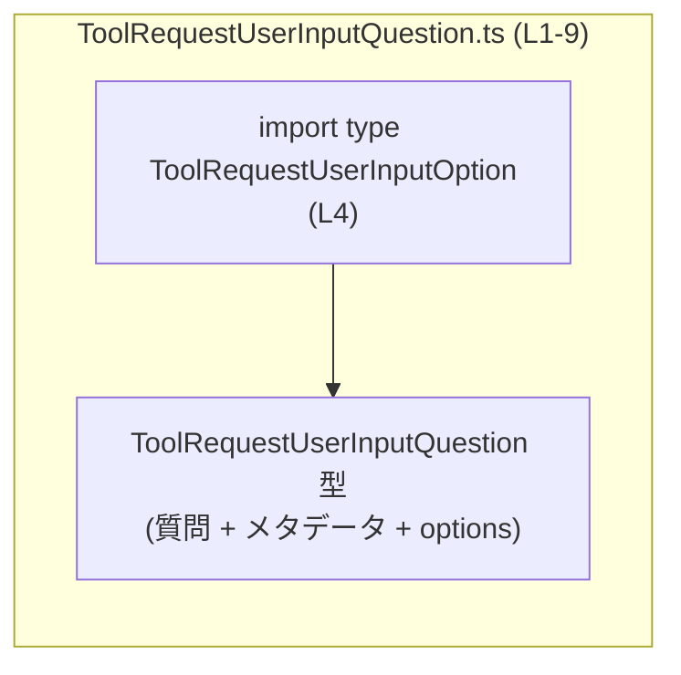
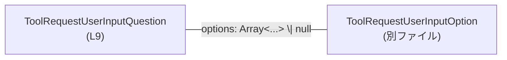

# app-server-protocol/schema/typescript/v2/ToolRequestUserInputQuestion.ts

## 0. ざっくり一言

`ToolRequestUserInputQuestion` は、ひとつの「request_user_input 質問」と、その質問に対応する選択肢を表す **データ構造（型定義）** です（`ToolRequestUserInputQuestion.ts:L6-9`）。

---

## 1. このモジュールの役割

### 1.1 概要

- このファイルは `ts-rs` によって自動生成された TypeScript の型定義ファイルです（`ToolRequestUserInputQuestion.ts:L1-3`）。
- `ToolRequestUserInputQuestion` という型エイリアスを定義し、ひとつの質問と、その質問に紐づくオプション一覧を表現します（`ToolRequestUserInputQuestion.ts:L6-9`）。
- ランタイムのロジック（関数やクラスの実装）は含まれず、**スキーマ（データ形状）のみ** を定義しています。

### 1.2 アーキテクチャ内での位置づけ

- このモジュールは、`ToolRequestUserInputQuestion` 型を外部に提供する **スキーマ定義モジュール** です。
- 質問の各選択肢は `ToolRequestUserInputOption` 型として別ファイルに定義されており、本ファイルから型インポートされています（`ToolRequestUserInputQuestion.ts:L4`）。
- 依存関係としては、「このモジュール → ToolRequestUserInputOption 定義ファイル」の一方向です。



### 1.3 設計上のポイント

- **自動生成コード**  
  - 冒頭コメントに「GENERATED CODE! DO NOT MODIFY BY HAND!」と明示されており（`ToolRequestUserInputQuestion.ts:L1-3`）、手動編集を前提としていません。
- **不変のデータ構造定義のみ**  
  - `export type` による型エイリアス定義だけで、クラス・関数・状態は持っていません（`ToolRequestUserInputQuestion.ts:L9`）。
- **必須フィールドと null 許容の混在**  
  - `id`, `header`, `question`, `isOther`, `isSecret` はすべて必須プロパティ（`?` が付かない）です。
  - `options` は `Array<ToolRequestUserInputOption> | null` と定義されており、**配列か null** のどちらかであることが型として表現されています（`ToolRequestUserInputQuestion.ts:L9`）。
- **実験的（EXPERIMENTAL）であることの明示**  
  - JSDoc コメントに `EXPERIMENTAL` と記載されており（`ToolRequestUserInputQuestion.ts:L6-8`）、仕様変更の可能性があることが示唆されています（これはコメントの文字列としての事実です）。

---

## 2. 主要なコンポーネント一覧（インベントリー）

このチャンクに現れる型・外部依存の一覧です。

### 2.1 型・エイリアス

| 名前 | 種別 | 定義位置 | 役割 / 用途 |
|------|------|----------|-------------|
| `ToolRequestUserInputQuestion` | 型エイリアス（オブジェクト型） | `ToolRequestUserInputQuestion.ts:L9` | 1 つの「request_user_input 質問」と、そのメタ情報・オプション一覧を表現するデータ構造 |

### 2.2 外部型依存

| 名前 | 種別 | 定義位置（本ファイル側） | 説明 |
|------|------|--------------------------|------|
| `ToolRequestUserInputOption` | 型（詳細は別ファイル） | `ToolRequestUserInputQuestion.ts:L4` | `options` 配列の要素型として利用される質問オプションの型 |

> `ToolRequestUserInputOption` の具体的な中身は、このチャンクには現れません。

---

## 3. 公開 API と詳細解説

このファイルには関数・メソッドは存在せず、**型定義のみ** が公開 API となっています。

### 3.1 型一覧（構造体・列挙体など）

#### `ToolRequestUserInputQuestion`

```ts
export type ToolRequestUserInputQuestion = {
    id: string,
    header: string,
    question: string,
    isOther: boolean,
    isSecret: boolean,
    options: Array<ToolRequestUserInputOption> | null,
};
```

（`ToolRequestUserInputQuestion.ts:L9`）

| フィールド名 | 型 | 必須/任意 | 説明（コードから読み取れる範囲） |
|-------------|----|-----------|----------------------------------|
| `id` | `string` | 必須 | 質問を一意に識別する ID と考えられる文字列。具体的なフォーマットはコードからは不明です。 |
| `header` | `string` | 必須 | 質問のヘッダー、あるいはタイトル的な文言を格納する文字列と解釈できますが、詳細はコメントにはありません。 |
| `question` | `string` | 必須 | 実際の質問文を表す文字列と推測されますが、コード上での制約はありません。 |
| `isOther` | `boolean` | 必須 | 命名からは「その他」選択肢を持つかどうかなどのフラグと推測できますが、用途はコード単体からは断定できません。 |
| `isSecret` | `boolean` | 必須 | 命名からは秘密情報かどうかなどのフラグと推測されますが、意味・扱いはこのファイルからは分かりません。 |
| `options` | `Array<ToolRequestUserInputOption> \| null` | 必須（ただし値としては配列か null） | 質問に紐づく選択肢一覧。配列として与えられるか、存在しない場合は `null` になる設計です。空配列かどうかの制約はコードにはありません。 |

> 「Represents one request_user_input question and its required options.」という JSDoc コメント（`ToolRequestUserInputQuestion.ts:L6-8`）から、この型が **ひとつの質問と、その必須オプション群** を表現する意図が読み取れます。

### 3.2 関数詳細

このファイルには関数・メソッドが定義されていません（`ToolRequestUserInputQuestion.ts:L1-9` には `function` / `=>` などの関数定義が登場しません）。

そのため、関数用テンプレートに基づく詳細解説は対象がありません。

### 3.3 その他の関数

- 該当なし（このファイルには関数・メソッド・クラスは存在しません）。

---

## 4. データフロー

### 4.1 型間のデータ構造関係

`ToolRequestUserInputQuestion` と `ToolRequestUserInputOption` の静的な関係を図示します。



- `ToolRequestUserInputQuestion` は、`options` プロパティを通じて 0 個以上の `ToolRequestUserInputOption` を参照します。
- TypeScript の型としては「配列」か「null」のいずれかであり、この違いを呼び出し側が明示的に扱う必要があります。

### 4.2 想定される利用シーケンス（概念図）

※ここからは、この型定義から想像できる一般的な利用イメージであり、**実際の呼び出し元コードはこのファイルには含まれていません**。

```mermaid
sequenceDiagram
    participant Caller as 呼び出し側コード
    participant Q as ToolRequestUserInputQuestion オブジェクト
    participant Opt as ToolRequestUserInputOption[]

    Note over Q: 定義: ToolRequestUserInputQuestion (L9)

    Caller->>Caller: id, header, question 文字列を決定
    Caller->>Opt: ToolRequestUserInputOption を必要な数だけ生成
    Caller->>Q: { id, header, question, isOther, isSecret, options } を構築
    Q-->>Caller: 型安全な質問オブジェクトとして利用
```

---

## 5. 使い方（How to Use）

### 5.1 基本的な使用方法

`ToolRequestUserInputQuestion` 型の値を作成し、型安全に扱う基本例です。

```ts
// 型のインポート（パスはこのファイルの位置からの相対パス）
import type { ToolRequestUserInputQuestion } from "./ToolRequestUserInputQuestion"; // このファイル自身
import type { ToolRequestUserInputOption } from "./ToolRequestUserInputOption";     // L4 でインポートしている型

// 質問オプションを定義する（実際のフィールドは ToolRequestUserInputOption 側の定義に依存）
const options: ToolRequestUserInputOption[] = [
    /* ... ToolRequestUserInputOption 型の値 ... */
];

// ToolRequestUserInputQuestion 型の値を構築する
const question: ToolRequestUserInputQuestion = {
    id: "q1",                // 質問 ID（任意の string）
    header: "基本情報",      // ヘッダー的な文言（用途は設計次第）
    question: "あなたの職業は？", // 質問文
    isOther: true,           // 「その他」を許可するかどうか等に使われると推測されるフラグ
    isSecret: false,         // 秘密情報かどうか等に使われると推測されるフラグ
    options,                 // ToolRequestUserInputOption[] または null
};

// 利用側では、TypeScript の補完と型チェックが効く
console.log(question.question); // 質問文を参照
```

ポイント:

- すべてのフィールドが必須なので、オブジェクトリテラルを構築する際に抜け漏れがあるとコンパイルエラーになります（TypeScript の型安全性）。
- `options` の型が `Array<ToolRequestUserInputOption> | null` のため、後述のように null チェックが必要です。

### 5.2 `options` の null を扱うパターン

`options` は null 許容なので、利用前に型チェックを行う必要があります。

```ts
function printQuestion(q: ToolRequestUserInputQuestion) {
    console.log(q.header);   // header は string 型なのでそのまま利用可能
    console.log(q.question); // question も string 型

    if (q.options === null) {
        // オプションが存在しないケースの処理
        console.log("この質問には選択肢はありません。");
    } else if (q.options.length === 0) {
        // 配列だが空のケース（型としては許可される。空配列かどうかは設計次第）
        console.log("選択肢は定義されていますが、現在は空です。");
    } else {
        // ToolRequestUserInputOption[] として扱える
        for (const opt of q.options) {
            // opt の構造は ToolRequestUserInputOption の定義による
            console.log(opt);
        }
    }
}
```

### 5.3 よくある間違い

#### 1) `options` を null チェックせずに配列扱いしてしまう

```ts
// 間違い例（コンパイルエラーになる）:
function wrong(q: ToolRequestUserInputQuestion) {
    // q.options は Array<ToolRequestUserInputOption> | null なので、
    // そのまま length にアクセスするとエラー
    // console.log(q.options.length); // エラー: Object is possibly 'null'.
}
```

```ts
// 正しい例:
function correct(q: ToolRequestUserInputQuestion) {
    if (q.options && q.options.length > 0) {
        console.log(`選択肢の数: ${q.options.length}`);
    } else {
        console.log("選択肢はありません。");
    }
}
```

#### 2) フィールドの欠落

```ts
// 間違い例: isSecret を指定し忘れている
const invalidQuestion: ToolRequestUserInputQuestion = {
    id: "q2",
    header: "秘密情報",
    question: "あなたのパスワードは？",
    isOther: false,
    // isSecret: true, // 必須フィールドを忘れるとコンパイルエラー
    options: null,
};
```

---

### 5.4 使用上の注意点（まとめ）

- **自動生成コードの直接編集禁止**  
  - 冒頭コメントに「Do not edit this file manually.」とあるため（`ToolRequestUserInputQuestion.ts:L1-3`）、型構造を変更したい場合は、生成元（おそらく Rust 側の ts-rs 対象構造体）を変更し、再生成する必要があります。
- **`options` の null チェック必須**  
  - 型が `Array<...> | null` であるため、利用側は毎回 null かどうかを意識する必要があります。
- **実行時エラーではなくコンパイル時エラー**  
  - フィールド欠落や型不一致は TypeScript のコンパイル時に検出され、ランタイムエラーになる前に防止できます。
- **並行性・スレッド安全性**  
  - このファイルは純粋な型定義のみを含み、実行時の共有状態・ミューテーションを持たないため、TypeScript レベルで特別な並行性の懸念はありません。

---

## 6. 変更の仕方（How to Modify）

### 6.1 新しい機能を追加する場合（新フィールドの追加など）

このファイルは自動生成されているため（`ToolRequestUserInputQuestion.ts:L1-3`）、直接編集は想定されていません。

一般的な手順のイメージ（コードから推測できる範囲で）:

1. **生成元の定義を変更**  
   - ts-rs の生成元（通常は Rust の構造体）に、新しいフィールドや属性を追加する必要があります。  
   - 生成元の具体的なパスや名前は、このチャンクには現れません。
2. **ts-rs を再実行して TypeScript コードを再生成**  
   - 生成ツールを再実行し、本ファイルを上書き生成します。
3. **TypeScript 側での利用箇所を更新**  
   - 新しいフィールドが必須になった場合、`ToolRequestUserInputQuestion` を構築している既存コードはコンパイルエラーとなるため、それを手がかりに利用箇所を更新できます。

### 6.2 既存の機能を変更する場合

- **フィールドの型変更や削除** は、呼び出し側コードに大きく影響します。
  - 例: `options` を `Array<ToolRequestUserInputOption>` のみにすると、null チェックを前提に書かれていたコードが不要になり、逆に null を代入していた箇所がコンパイルエラーになります。
- 変更時の注意点:
  - 生成元の定義変更 → 再生成 → TypeScript 側のコンパイルを通す、という流れで影響範囲を確認できます。
  - `id` など識別子の意味や制約が変更される場合は、ドキュメントやコメント（JSDoc）も合わせて更新すると、型の意図が伝わりやすくなります。

---

## 7. 関連ファイル

このチャンクから参照できる関連ファイルは次のとおりです。

| パス | 役割 / 関係 |
|------|------------|
| `./ToolRequestUserInputOption` | `ToolRequestUserInputQuestion` の `options` 配列要素として利用される型を定義するモジュール（`ToolRequestUserInputQuestion.ts:L4`）。具体的な内容はこのチャンクには現れません。 |

---

## Bugs / Security / Contracts / Edge Cases / Tests / Performance などの補足

### Bugs / Security

- このファイルは型定義のみであり、実行ロジックや外部との入出力を含まないため、**セキュリティ脆弱性やバグと呼べる挙動** は、このチャンク単体からは読み取れません。
- ただし、仕様として `options` に `null` を許容しているため、「null を考慮し忘れた呼び出し側コード」が実行時エラーを引き起こす可能性はあります。これは型システム的にはコンパイル時に警告される想定です。

### Contracts / Edge Cases

- **契約（コントラクト）として読み取れる点**
  - `id`, `header`, `question`, `isOther`, `isSecret` は必ず存在する（未定義にはならない）ことが前提です（`ToolRequestUserInputQuestion.ts:L9`）。
  - `options` は必ず存在するが、値としては「配列」か「null」のいずれかとなることが契約になっています。
- **エッジケース**
  - `options === null`: オプションそのものが存在しない状況。
  - `options` は配列だが `length === 0`: オプションが 1 件も定義されていない状況（型上は許容されます）。
  - フィールドの値自体（空文字の `id` など）に対する制約は、このファイルからは読み取れません。

### Tests

- このチャンクにはテストコードや型テストは含まれていません。
- 型が自動生成であることから、テストは主に生成元（Rust 側）や生成プロセスで行う設計と推測されますが、具体的なテスト戦略はコードからは分かりません。

### Performance / Scalability / Observability

- 型定義のみであり、ランタイムのパフォーマンスやスケーラビリティ、ログ出力などの観点は、このファイルからは直接関係しません。
- 実際の性能や観測性は、この型をどのように利用するアプリケーションコード側に依存します。
