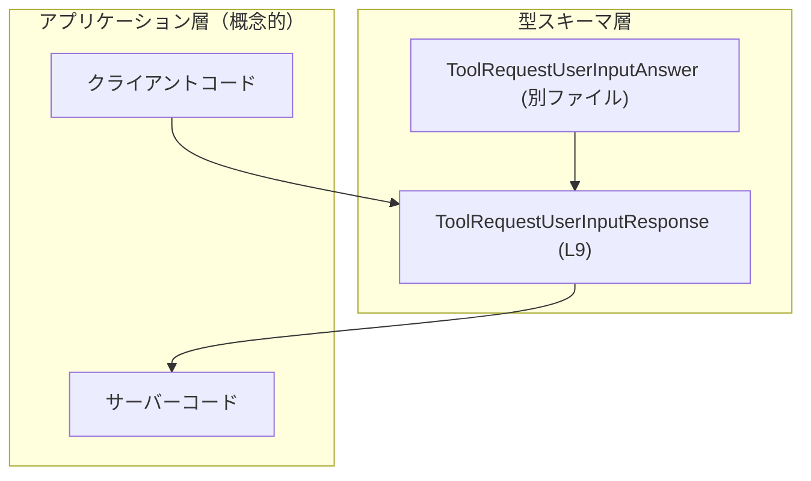
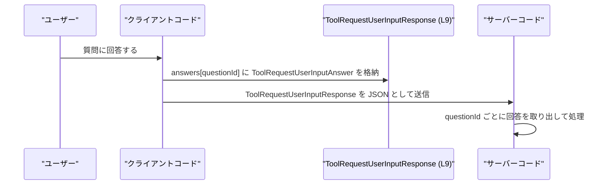

# app-server-protocol/schema/typescript/v2/ToolRequestUserInputResponse.ts コード解説

## 0. ざっくり一言

`ToolRequestUserInputResponse` は、**質問ID（文字列）からユーザーの回答を引くためのレスポンス用マップ**を表す TypeScript の型エイリアスです。Rust 側の型から `ts-rs` によって自動生成されています (ToolRequestUserInputResponse.ts:L1-3, L9)。

---

## 1. このモジュールの役割

### 1.1 概要

- このモジュールは、**ツール実行時にユーザーへ投げた質問に対する回答群**を表現するための型を提供します。
- 型 `ToolRequestUserInputResponse` は、`answers` プロパティの下に、**質問ID → 回答 (`ToolRequestUserInputAnswer`)** というマップ構造を持ちます (ToolRequestUserInputResponse.ts:L9)。
- ファイルは `ts-rs` により生成されており、手動での編集は想定されていません (ToolRequestUserInputResponse.ts:L1-3)。

### 1.2 アーキテクチャ内での位置づけ

このファイル自身は型定義のみを行い、ロジックは持ちません。依存関係は次のようになっています。

- 依存する型:
  - `ToolRequestUserInputAnswer`（同ディレクトリの別ファイルから型としてインポート）(ToolRequestUserInputResponse.ts:L4)
- 利用される側（このチャンクからは存在が**推測される**概念であり、コードには現れません）:
  - クライアントやサーバーのアプリケーションコードが、この型に沿ったオブジェクトを生成・受信して処理する。

この関係を簡易的に図示すると次のようになります。



- 上記のうち、**実際にこのチャンクで定義されているのは `ToolRequestUserInputResponse` とその `answers` プロパティ、および `ToolRequestUserInputAnswer` への依存**だけです (ToolRequestUserInputResponse.ts:L4, L9)。
- `クライアントコード` や `サーバーコード` は、この型を利用するであろう概念的なコンポーネントであり、このチャンクには現れません。

### 1.3 設計上のポイント

コードから読み取れる設計上の特徴は次の通りです。

- **自動生成ファイル**  
  - 先頭コメントに「GENERATED CODE」「Do not edit this file manually」と明記されています (ToolRequestUserInputResponse.ts:L1-3)。  
  - スキーマ変更は生成元（Rust 側など）で行う前提です。
- **型エイリアスによるスキーマ表現**  
  - `export type ToolRequestUserInputResponse = { ... }` という形でオブジェクト構造を表しています (ToolRequestUserInputResponse.ts:L9)。
- **マップ型（文字列キー → 回答）の採用**  
  - `answers: { [key in string]?: ToolRequestUserInputAnswer }` により、任意の文字列キーに対して `ToolRequestUserInputAnswer` を保持できる構造になっています (ToolRequestUserInputResponse.ts:L9)。
  - `?` が付いているため、**各キーの値はオプショナル**（`undefined` あるいは存在しない）です。
- **純粋な型情報のみ**  
  - `import type` を用いており (ToolRequestUserInputResponse.ts:L4)、このファイルは実行時に存在する JavaScript コードを生成しません。  
  - ロジック・エラーハンドリング・並行処理などは一切含まれていません。

---

## 2. 主要な機能一覧

このモジュールは関数を持たず、**型定義**のみを提供します。そのため、「機能」は型が表現するデータ構造の意味として整理します。

- `ToolRequestUserInputResponse`:  
  ユーザー入力の回答レスポンスを表す型。`answers` プロパティに、質問ID（文字列）をキーとし、`ToolRequestUserInputAnswer` を値とするマップを保持します (ToolRequestUserInputResponse.ts:L9)。

---

## 3. 公開 API と詳細解説

### 3.1 型一覧（構造体・列挙体など）

| 名前                             | 種別          | 役割 / 用途                                                                                 | 定義箇所                                       |
|----------------------------------|---------------|----------------------------------------------------------------------------------------------|------------------------------------------------|
| `ToolRequestUserInputResponse`   | 型エイリアス  | ユーザー入力に対する回答レスポンス全体を表す。`answers` に質問ID→回答のマップを持つ。      | `export type ...` (ToolRequestUserInputResponse.ts:L9) |
| `answers`                        | オブジェクト型のプロパティ | キーを質問ID（`string`）、値を `ToolRequestUserInputAnswer` とするマップ。各値はオプショナル。 | `answers: { [key in string]?: ToolRequestUserInputAnswer }` (ToolRequestUserInputResponse.ts:L9) |
| `ToolRequestUserInputAnswer`     | 型（別ファイル） | 個々の質問への回答内容を表す型。詳細はこのチャンクには現れません。                          | `import type { ... } from "./ToolRequestUserInputAnswer";` (ToolRequestUserInputResponse.ts:L4) |

### 3.2 関数詳細（最大 7 件）

このファイルには**関数・メソッドは定義されていません**。  
したがって、詳細な関数解説の対象はありません。

### 3.3 その他の関数

このファイルには補助関数・ラッパー関数も存在しません。

---

## 4. データフロー

このモジュール自体は型だけを提供しますが、典型的な利用シナリオとしては次のようなデータフローが想定されます（アプリケーション側のコードはこのチャンクには存在せず、あくまで一般的な利用イメージです）。

1. アプリケーションが複数の質問（ID付き）をユーザーに提示する。
2. ユーザーが質問ごとに回答する。
3. クライアントコードが `answers` プロパティを持つオブジェクトを構築する。  
   - キー: 質問ID（文字列）  
   - 値: 各質問に対する `ToolRequestUserInputAnswer` 型の値
4. そのオブジェクトを `ToolRequestUserInputResponse` 型としてサーバーへ送信する。

これをシーケンス図で表現します。



- `ToolRequestUserInputResponse` の具体的な構造は **answers プロパティのマップだけ**であり、このシーケンス図における役割は「回答マップを保持するコンテナ」です (ToolRequestUserInputResponse.ts:L9)。

---

## 5. 使い方（How to Use）

### 5.1 基本的な使用方法

ここでは、`ToolRequestUserInputResponse` 型に沿ったオブジェクトを組み立てる基本例を示します。  
`ToolRequestUserInputAnswer` の中身はこのファイルからは分からないため、型としてのみ扱います。

```typescript
// 型インポートのみを行う（実行時の JS には出力されない）                 // ToolRequestUserInputResponse.ts と同様に type import を使う
import type {
    ToolRequestUserInputResponse,                                      // このファイルで定義されたレスポンス型
} from "./ToolRequestUserInputResponse";                               // 相対パスは利用側のプロジェクト構成に依存する

import type {
    ToolRequestUserInputAnswer,                                        // 個々の質問への回答を表す型
} from "./ToolRequestUserInputAnswer";                                 // 詳細定義は別ファイルに存在する

// ある質問に対する回答オブジェクトを用意する（詳細構造は別ファイル依存）   // ここでは型にキャストするだけで中身は省略する
const answer1: ToolRequestUserInputAnswer = {} as ToolRequestUserInputAnswer;
const answer2: ToolRequestUserInputAnswer = {} as ToolRequestUserInputAnswer;

// ToolRequestUserInputResponse 型に従ったレスポンスオブジェクトを作る       // top-level に answers プロパティを必ず持たせる
const response: ToolRequestUserInputResponse = {
    answers: {                                                         // answers プロパティは必須 (ToolRequestUserInputResponse.ts:L9)
        "question-id-1": answer1,                                      // キーは string 型; 値は ToolRequestUserInputAnswer
        "question-id-2": answer2,                                      // 質問ごとに別のキーを割り当てる
        // "question-id-3" は未回答のため省略することもできる            // ? により各キーの値はオプショナル (L9)
    },
};

// 例えば JSON として送信する（ここでは型レベルの例に留める）              // 実際の送信ロジックはこのファイルには存在しない
const payload = JSON.stringify(response);                               // TypeScript の型はコンパイル後の JS には残らない
```

- 型により、`answers` プロパティの存在や値の型（`ToolRequestUserInputAnswer`）がコンパイル時にチェックされます (ToolRequestUserInputResponse.ts:L9)。

### 5.2 よくある使用パターン

#### パターン1: 質問リストからマップを組み立てる

質問の配列を元に、回答をマップに変換して `ToolRequestUserInputResponse` を組み立てる例です。

```typescript
import type {
    ToolRequestUserInputResponse,
} from "./ToolRequestUserInputResponse";
import type {
    ToolRequestUserInputAnswer,
} from "./ToolRequestUserInputAnswer";

// 質問IDと回答を持つ仮の構造体                                          // 実務では別の型が使われる可能性もある
interface QuestionAndAnswer {
    id: string;                                                          // 質問ID
    answer: ToolRequestUserInputAnswer;                                  // 回答
}

// 質問＋回答の配列からレスポンスを生成する                               // TypeScript の型推論を活用する
function buildResponse(items: QuestionAndAnswer[]): ToolRequestUserInputResponse {
    const answers: ToolRequestUserInputResponse["answers"] = {};         // answers プロパティと同じ型を利用 (L9)

    for (const item of items) {                                          // 各質問に対して
        answers[item.id] = item.answer;                                  // キー: id, 値: answer を設定する
    }

    return { answers };                                                  // ToolRequestUserInputResponse 型と整合する
}
```

- `ToolRequestUserInputResponse["answers"]` のように、**インデックスアクセス型**を使ってプロパティの型を再利用することで、スキーマ変更時にも型定義の一貫性を保ちやすくなります (ToolRequestUserInputResponse.ts:L9)。

### 5.3 よくある間違い

この型に基づいてコードを書く際に起こりやすい誤りと、その修正例を示します。

```typescript
import type { ToolRequestUserInputResponse } from "./ToolRequestUserInputResponse";

// 間違い例: answers プロパティを配列にしてしまう                          // 型定義ではオブジェクト（マップ）である必要がある (L9)
const wrongResponse1: ToolRequestUserInputResponse = {
    // @ts-expect-error: answers は { [key: string]: ToolRequestUserInputAnswer | undefined } 型である必要がある
    answers: [],                                                         // × 配列は許可されない
};

// 間違い例: top-level の answers を付け忘れる
// @ts-expect-error: ToolRequestUserInputResponse には answers プロパティが必須
const wrongResponse2: ToolRequestUserInputResponse = {
    // answers がないためコンパイルエラーとなる
};

// 正しい例: answers をオブジェクトとして定義する
const correctResponse: ToolRequestUserInputResponse = {
    answers: {},                                                         // 空オブジェクトも許可される (L9)
};
```

### 5.4 使用上の注意点（まとめ）

- **`answers` プロパティは必須**  
  - `ToolRequestUserInputResponse` 型では、`answers` プロパティ自体は必須です (ToolRequestUserInputResponse.ts:L9)。
- **各キーの値はオプショナル**  
  - `answers` の中の各プロパティには `?` が付いており、値が存在しない（キーが無い／`undefined`）ケースを想定した扱いが必要です (ToolRequestUserInputResponse.ts:L9)。
- **キーはすべて文字列**  
  - マップのキーは `string` であり、数値キーを使う場合も内部的には文字列化されるという TypeScript/JavaScript の性質を前提とした設計になっています (ToolRequestUserInputResponse.ts:L9)。
- **ランタイム検証は別途必要**  
  - このファイルは型情報のみを提供し、実行時のバリデーションやエラーハンドリングは一切行いません。入力検証・必須回答チェックなどはアプリケーション側のロジックで行う必要があります。

---

## 6. 変更の仕方（How to Modify）

### 6.1 新しい機能を追加する場合

このファイルは `ts-rs` により生成されており、「手動で編集しない」旨が明記されています (ToolRequestUserInputResponse.ts:L1-3)。  
そのため、通常の意味でこのファイルを直接変更することは推奨されません。

新しいフィールドや機能を追加したい場合の一般的な手順は次のようになります（生成元の存在を前提とした一般論です。実際の生成元ファイルの場所や言語はこのチャンクには現れません）。

1. **生成元の Rust（など）側の型定義を変更する**  
   - 例: `ToolRequestUserInputResponse` に相当する構造体に新しいフィールドを追加する。
2. **`ts-rs` などのツールを再実行し、TypeScript コードを再生成する**  
   - これにより、本ファイルの内容が自動的に更新されます。
3. **TypeScript 側の利用コードを更新する**  
   - 新しいフィールドを使うようにアプリケーションコードを調整する。

### 6.2 既存の機能を変更する場合

既存フィールドの型や意味を変更したい場合も、直接編集ではなく生成元を変更する前提になります。

- **影響範囲の確認**  
  - `ToolRequestUserInputResponse` 型を参照している箇所（`import type { ToolRequestUserInputResponse }` を行っているファイル）を検索し、影響範囲を把握する必要があります。
- **契約の維持**  
  - `answers` が必須であるという契約を変更する場合（例: オプショナルにする）は、クライアント／サーバー双方の実装に影響する可能性があります。
- **テストの更新**  
  - 型に紐づくテスト（存在する場合）は、新しいスキーマに合わせて更新する必要があります。このチャンクにはテストコードは含まれていません。

---

## 7. 関連ファイル

このモジュールと直接的に関係するのは、次のファイルです。

| パス                                       | 役割 / 関係                                                                                   |
|--------------------------------------------|----------------------------------------------------------------------------------------------|
| `schema/typescript/v2/ToolRequestUserInputAnswer.ts` | `ToolRequestUserInputAnswer` 型を定義していると考えられるファイル。`import type` で参照される (ToolRequestUserInputResponse.ts:L4)。 |

- 上記のうち、`ToolRequestUserInputAnswer` の具体的な中身はこのチャンクには現れないため、詳細な役割やフィールド構造は**不明**です。
- Rust 側などの生成元ファイル（構造体定義など）はこのチャンクには現れませんが、`ts-rs` のコメントから存在が示唆されています (ToolRequestUserInputResponse.ts:L1-3)。
