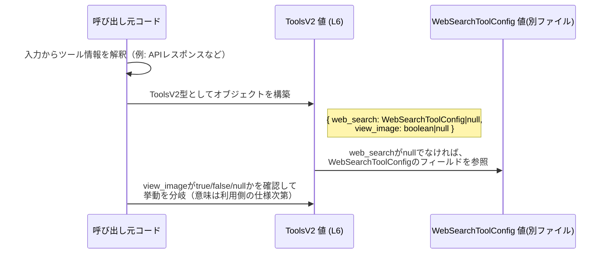

# app-server-protocol/schema/typescript/v2/ToolsV2.ts

---

## 0. ざっくり一言

`ToolsV2` は、`web_search` と `view_image` という 2 種類のツールに関する情報を 1 つのオブジェクトで表現するための **TypeScript 型エイリアス**です（型定義のみで、実行時のロジックは持ちません）。このファイルは Rust 側の定義から `ts-rs` によって自動生成されています（`ToolsV2.ts:L1-3`）。

---

## 1. このモジュールの役割

### 1.1 概要

- このモジュールは、**「アプリケーションサーバープロトコル v2 におけるツール関連情報」** を TypeScript で表現するために存在し、`ToolsV2` 型を提供します（`ToolsV2.ts:L6-6`）。
- TypeScript コードからは、`web_search` および `view_image` に関する設定または状態を、静的型付けのもとで扱えるようにする役割を持ちます。

### 1.2 アーキテクチャ内での位置づけ

- パス `schema/typescript/v2` から、このファイルは **app-server-protocol の TypeScript スキーマ v2** に属する一部と解釈できます。
- `ToolsV2` は `WebSearchToolConfig` 型に依存しています（`import type { WebSearchToolConfig } from "../WebSearchToolConfig";` `ToolsV2.ts:L4-4`）。

依存関係を簡略化して図示すると、次のようになります。

```mermaid
graph TD
    subgraph "schema/typescript/v2 (ToolsV2.ts L1-6)"
        T[ToolsV2 型 (L6)]
    end

    subgraph "schema/typescript (別ファイル)"
        W[WebSearchToolConfig 型]
    end

    T -- web_searchフィールドの型 --> W
```

> 図はコンパイル時の型依存関係を示しています。`ToolsV2` 自体には実行時ロジックは存在しません。

### 1.3 設計上のポイント

- **自動生成コード**  
  - ファイル先頭コメントから、`ts-rs` によって生成されていることが明示されています（`ToolsV2.ts:L1-3`）。
  - そのため、このファイル自体を手動で変更しない前提の設計になっています。
- **型エイリアスのみのモジュール**  
  - 公開されているのは `ToolsV2` という 1 つの型エイリアスのみで、関数やクラスは定義されていません（`ToolsV2.ts:L6-6`）。
- **null 許容フィールド**  
  - `web_search` は `WebSearchToolConfig | null`、`view_image` は `boolean | null` として定義されており、どちらも `null` を許容します（`ToolsV2.ts:L6-6`）。
  - プロパティ自体は省略不可（`?` が付いていない）な一方で、値として「ない／未設定」を `null` で表す設計になっています。
- **type-only import の利用**  
  - `import type` によって `WebSearchToolConfig` を読み込んでいるため、出力される JavaScript からはこの import は削除され、実行時依存関係になりません（`ToolsV2.ts:L4-4`）。

---

## 2. 主要な機能一覧

このファイルが提供する機能は 1 つだけです。

- `ToolsV2` 型: `web_search` および `view_image` に関する情報をまとめて表現するオブジェクト型。

（ここでいう「機能」は、実行時の関数ではなく**静的な型定義**です）

---

## 3. 公開 API と詳細解説

### 3.1 型一覧（構造体・列挙体など）

#### 型インベントリー

| 名前      | 種別        | 役割 / 用途                                                                                          | 定義位置                       | 根拠                                   |
|-----------|-------------|-------------------------------------------------------------------------------------------------------|--------------------------------|----------------------------------------|
| `ToolsV2` | 型エイリアス | `web_search` と `view_image` の 2 つのプロパティを持つオブジェクト型。ツール関連情報をまとめて表現する。 | `ToolsV2.ts:L6-6`             | `export type ToolsV2 = { ... };` |

補足として、外部依存の型は次の通りです。

| 名前                 | 種別        | 役割 / 用途                                                                 | 定義位置                        | 根拠                                        |
|----------------------|-------------|------------------------------------------------------------------------------|---------------------------------|---------------------------------------------|
| `WebSearchToolConfig` | 型（別ファイル） | `ToolsV2.web_search` フィールドの型。web_search に関する構造を表す型。詳細は別ファイル側で定義。 | `ToolsV2.ts:L4-4`（import のみ） | `import type { WebSearchToolConfig } ...` |

> `WebSearchToolConfig` の中身や正確な用途は、このチャンクには現れないため不明です。名前と利用箇所から「web_search に関する設定を表す型」と解釈できますが、詳細は当該ファイルを参照する必要があります。

#### `ToolsV2` のフィールド構造

`ToolsV2` は次のように定義されています（`ToolsV2.ts:L6-6`）。

```ts
export type ToolsV2 = { 
    web_search: WebSearchToolConfig | null, 
    view_image: boolean | null, 
};
```

これをフィールドごとに整理すると次の通りです。

| フィールド名  | 型                             | 必須/任意 | 説明                                                                                                 | 根拠             |
|---------------|--------------------------------|-----------|------------------------------------------------------------------------------------------------------|------------------|
| `web_search`  | `WebSearchToolConfig \| null` | 必須      | `WebSearchToolConfig` 型の値、または `null`。命名から web 検索ツールに関する情報と推測できるが詳細は不明。 | `ToolsV2.ts:L6`  |
| `view_image`  | `boolean \| null`            | 必須      | 真偽値または `null`。命名から画像閲覧機能に関する情報と推測できるが、`true/false/null` の意味は不明。      | `ToolsV2.ts:L6`  |

- **事実として言えること**
  - 両プロパティとも **省略不可（必須プロパティ）** だが、値として `null` を許容します。
  - `view_image` は `boolean | null` なので、`true`/`false`/`null` のいずれかを取ります。
- **推測でしかないこと**
  - `true` が「有効」、`false` が「無効」、`null` が「未設定」などの意味を持つ可能性がありますが、コードからは断定できません。

### 3.2 関数詳細（最大 7 件）

このファイルには **関数・メソッドは一切定義されていません**（`ToolsV2.ts:L1-6` 全体を確認）。  
そのため、このセクションで詳細解説すべき公開関数は存在しません。

### 3.3 その他の関数

- 該当なし（ヘルパー関数やラッパー関数も存在しません）。

---

## 4. データフロー

`ToolsV2` は型定義のみであり、自身は処理フローを持ちません。  
ここでは、「ToolsV2 型がどのように利用されうるか」の典型例を**概念図**として示します（実際の利用コードは本チャンクには現れないため、一例にすぎません）。



要点:

- `ToolsV2` は **データの形を制約する型** として機能し、実際の処理や条件分岐は呼び出し元コード側で実装されます。
- `null` を許容しているため、利用側では **必ず null チェックが必要** になります。

---

## 5. 使い方（How to Use）

### 5.1 基本的な使用方法

#### 例1: `ToolsV2` 型の値を生成して保持する

```ts
// app-server-protocol/schema/typescript/v2/ToolsV2.ts から ToolsV2 をインポートする
import type { ToolsV2 } from "./schema/typescript/v2/ToolsV2";

// ToolsV2 型の値を作成する例
const tools: ToolsV2 = {
    web_search: null,  // WebSearchToolConfig | null なので null も許容される
    view_image: true,  // boolean | null なので true も許容される
};

// 型に基づいて値を利用する例
function handleToolsConfig(config: ToolsV2) {
    // web_search は WebSearchToolConfig | null なので null チェックが必要
    if (config.web_search !== null) {
        // ここでは WebSearchToolConfig にアクセスできる
        // 実際のフィールドは WebSearchToolConfig の定義を参照する必要がある
    }

    // view_image は boolean | null
    if (config.view_image === true) {
        // view_image が true のケース
    } else if (config.view_image === false) {
        // view_image が false のケース
    } else {
        // config.view_image === null のケース（意味は仕様次第）
    }
}
```

ポイント:

- `ToolsV2` は **型エイリアス** なので、コンパイル後の JavaScript には登場しません。  
  その役割は「構造と型のチェック」のみです。
- `web_search` / `view_image` は **プロパティ自体は必須**ですが、値として `null` を取る点に注意が必要です。

### 5.2 よくある使用パターン

`null` をどのように扱うかがポイントになる型です。ここでは、想定される使い方のパターンを 2 つ示します（意味づけは利用側仕様に依存し、このチャンクからは断定できません）。

#### パターン1: すべてのツール情報が「未設定」のケース

```ts
const toolsUnset: ToolsV2 = {
    web_search: null,
    view_image: null,
};
```

- 「まだサーバーからツール情報が届いていない」「ツール機能が未設定」といった状態を表現する用途が考えられますが、正確な意味はプロトコル仕様側で決まります。

#### パターン2: 一部のツールのみ情報があるケース

```ts
const toolsPartial: ToolsV2 = {
    web_search: null,  // web_search に関連する情報はまだ無い
    view_image: false, // 画像閲覧機能に関する情報あり（false の意味は仕様次第）
};
```

- 片方のフィールドだけが `null` / 非 `null` となるケースに対応した作りになっています。

### 5.3 よくある間違い

#### 間違い例1: `null` の代わりに `undefined` を使う

```ts
import type { ToolsV2 } from "./schema/typescript/v2/ToolsV2";

const wrong: ToolsV2 = {
    web_search: null,
    // ❌ 型定義は boolean | null なので、undefined は代入できない
    // @ts-expect-error
    view_image: undefined,
};
```

#### 正しい例

```ts
const correct: ToolsV2 = {
    web_search: null,
    view_image: null,  // ✔ boolean | null の一つなので OK
};
```

- `ToolsV2` では **`null` が使われており、`undefined` は許容されていない** ことに注意が必要です（`ToolsV2.ts:L6`）。

#### 間違い例2: 生成コードを直接編集する

```ts
// ❌ ToolsV2.ts 内の定義を手動で変更する
// 例: フィールド名を変更したり、新しいプロパティを直接追加する
```

- ファイル先頭に「GENERATED CODE! DO NOT MODIFY BY HAND!」と明示されており（`ToolsV2.ts:L1-3`）、手動編集は再生成で上書きされるリスクがあります。
- 変更が必要な場合は、**ts-rs の元になっている Rust 側の型定義を修正する必要**があります（元ファイルの場所はこのチャンクからは不明です）。

### 5.4 使用上の注意点（まとめ）

- **null チェックの徹底**  
  - 両プロパティとも `null` を許容するため、利用時には `null` チェックを怠ると実行時エラー（プロパティアクセス時の `TypeError`）につながる可能性があります。
- **`undefined` ではなく `null` を使う**  
  - 型定義は `X | null` であり `X | null | undefined` ではありません。`strictNullChecks` を有効にしている場合、`undefined` を代入するとコンパイルエラーになります。
- **生成ファイルを直接変更しない**  
  - コメントにある通り自動生成ファイルであり、手動編集すると再生成時に失われます。また、Rust 側との整合性も崩れます。
- **セキュリティ・並行性について**  
  - このファイルは型定義のみで、I/O やスレッド・プロセス管理を行うコードは含みません。そのため、このファイル単体ではセキュリティ上の挙動や並行性の問題は発生しません。
- **テストコード**  
  - このチャンクにはテストコードは含まれていません（`ToolsV2.ts:L1-6`）。`ToolsV2` の正しい利用は、利用側モジュールのテストで検証する必要があります。

---

## 6. 変更の仕方（How to Modify）

### 6.1 新しい機能を追加する場合

ここでいう「機能の追加」とは、新しいツール用フィールドを `ToolsV2` に追加するような変更を指します。

1. **Rust 側の ts-rs 対象型を探す**
   - `ts-rs` で生成されていることはコメントから分かりますが（`ToolsV2.ts:L1-3`）、具体的な Rust ファイル名はこのチャンクには現れません。
   - リポジトリ全体から `ToolsV2` や `WebSearchToolConfig` をキーワードに Rust ファイルを検索する必要があります。

2. **Rust 側の型定義にフィールドを追加**
   - 例としては `struct ToolsV2 { ... }` のような構造体にフィールドを追加し、`#[derive(TS)]` などの ts-rs 用属性が付いていることが多いですが、これは一般的な ts-rs の使い方であり、このチャンクからは実際の定義場所・形は分かりません。
   - TypeScript 側を直接編集するのではなく、**Rust 側を単一のソースオブトゥルースとして変更**します。

3. **ts-rs によるコード再生成を実行**
   - プロジェクトのビルドや専用スクリプトにより TypeScript スキーマを再生成します。
   - これにより `ToolsV2.ts` が最新の構造に更新されます。

4. **TypeScript 利用側コードの追随**
   - 新フィールドに依存する利用コードを追加／更新します。
   - 既存コードがコンパイルエラーになることもあるため、エラーを足掛かりに修正箇所を洗い出します。

### 6.2 既存の機能を変更する場合

`web_search` や `view_image` の意味や型を変更する場合は、次の点に注意が必要です。

- **影響範囲の確認**
  - `ToolsV2` を使用している TypeScript コード全体を検索し、どのようにフィールドが使われているかを確認します。
  - 特に `null` ハンドリングや `true/false` の意味に依存したロジックがあれば、仕様変更に合わせて更新する必要があります。

- **契約（前提条件・返り値の意味）の維持**
  - `view_image: boolean | null` を別の型に変えるなどの変更は、プロトコルの契約そのものを変えることになります。
  - プロトコルクライアント／サーバー両方への影響を考慮し、互換性が保てるかどうかを検討する必要があります（このファイル単体からは、どちらがクライアント側・サーバー側かは不明です）。

- **テストと検証**
  - このファイルにはテストはありませんが、`ToolsV2` を使う上位レイヤーのテストを更新し、新しい仕様での挙動を確認する必要があります。

- **リファクタリング上の注意**
  - フィールド名の変更・削除は破壊的変更になりがちなので、可能であれば次のような段階的移行が考えられます（一般的なパターンであり、このプロジェクトに適用されるかどうかは別途検討が必要です）:
    - 新フィールドを追加し、旧フィールドを deprecate としてしばらく残す。
    - 利用側を順次新フィールドに移行した後、旧フィールドを削除する。

---

## 7. 関連ファイル

このモジュールと直接関係するファイルは次の通りです。

| パス                                             | 役割 / 関係                                                                                         |
|--------------------------------------------------|------------------------------------------------------------------------------------------------------|
| `app-server-protocol/schema/typescript/WebSearchToolConfig.ts` | `ToolsV2.web_search` フィールドの型 `WebSearchToolConfig` を定義していると思われる TypeScript ファイル。`ToolsV2.ts` から `../WebSearchToolConfig` として型インポートされている（`ToolsV2.ts:L4-4`）。中身の詳細はこのチャンクからは不明。 |
| （Rust 側の ts-rs 元定義ファイル/モジュール）     | `ToolsV2.ts` を自動生成するための Rust の型定義。ファイル名やパスはこのチャンクには現れませんが、変更時にはここを編集する必要があります。 |

> `WebSearchToolConfig` や Rust 側の元定義に関する詳細は、このチャンク外の情報になるため、ここでは「存在と依存関係」以上のことは記述できません。

---

### Bugs / Security / Performance / Observability についての補足

- **Bugs**  
  - このファイルは型定義のみであり、ロジックは含みません。型自体によるバグはありませんが、`null` を見落とした利用コード側でのバグは起こりえます。
- **Security**  
  - データのバリデーションや I/O は行っておらず、このファイル単体でセキュリティ上の脆弱性を生むことはありません。
- **Performance / Scalability**  
  - 型レベルの情報のみで、実行時コストはありません（コンパイル後に消えるため）。
- **Observability**  
  - ログ出力やメトリクス収集などの機能は一切持たず、観測性は利用側コードに委ねられます。
