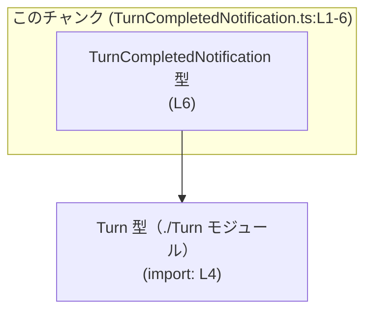
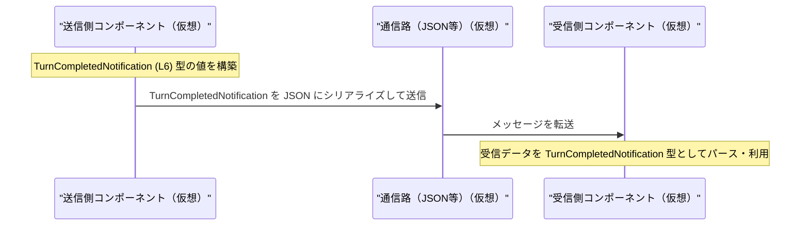

# app-server-protocol/schema/typescript/v2/TurnCompletedNotification.ts

## 0. ざっくり一言

`TurnCompletedNotification` という TypeScript の型エイリアスを定義し、`threadId` と `turn` をまとめた通知オブジェクトの形を表すファイルです（`TurnCompletedNotification.ts:L4-4, L6-6`）。

---

## 1. このモジュールの役割

### 1.1 概要

- このモジュールは、`TurnCompletedNotification` という **通知メッセージの型** を定義・公開します（`TurnCompletedNotification.ts:L6-6`）。
- 型は `threadId: string` と `turn: Turn` という 2 つのプロパティを持つオブジェクトとして定義されています（`TurnCompletedNotification.ts:L6-6`）。
- ファイル先頭のコメントから、このコードは Rust 側の型から `ts-rs` により自動生成されたものであり、手動編集を想定していないことが分かります（`TurnCompletedNotification.ts:L1-3`）。

### 1.2 アーキテクチャ内での位置づけ

- 依存関係:
  - このファイルは `Turn` 型を `./Turn` から import しています（`TurnCompletedNotification.ts:L4-4`）。
  - `TurnCompletedNotification` 型は、他のモジュールから import されて通知メッセージを表現するために使われると考えられますが、その使用箇所はこのチャンクには現れません。

主要な依存関係を簡略化した図です。



- 矢印は「`TurnCompletedNotification` が `Turn` 型に依存している」ことを表します。

### 1.3 設計上のポイント

- **自動生成コード**  
  - 冒頭コメントにより、`ts-rs` によって自動生成されており、手動編集しない前提であることが明記されています（`TurnCompletedNotification.ts:L1-3`）。
- **型のみのモジュール**  
  - 実行時ロジックや関数は一切含まれず、純粋に型定義のみを提供します（`TurnCompletedNotification.ts:L1-6`）。
- **構造的型付け**  
  - TypeScript のオブジェクト型として `threadId` と `turn` を必須プロパティとして定義しており、コンパイル時に型安全性を確保します（`TurnCompletedNotification.ts:L6-6`）。
- **外部依存のカプセル化**  
  - `turn` プロパティの具体的な構造は `Turn` 型に委ねられており、このファイルでは抽象化されています（`TurnCompletedNotification.ts:L4-4, L6-6`）。

---

## 2. 主要な機能一覧

このファイルは関数を持たず、型定義のみ提供します。

- `TurnCompletedNotification` 型:  
  `threadId: string` と `turn: Turn` を持つ通知オブジェクトの形を表現する TypeScript 型エイリアスです（`TurnCompletedNotification.ts:L6-6`）。

---

## 3. 公開 API と詳細解説

### 3.1 型一覧（構造体・列挙体など）

| 名前                       | 種別                                | 役割 / 用途                                                                 | 根拠 |
|----------------------------|-------------------------------------|-----------------------------------------------------------------------------|------|
| `TurnCompletedNotification` | 型エイリアス（オブジェクト型）      | `threadId` と `turn` を持つ通知メッセージの構造を表現する                 | `TurnCompletedNotification.ts:L6-6` |
| `Turn`                     | 型（詳細不明、外部モジュール依存） | 通知内の `turn` フィールドの型。実際の構造は `./Turn` モジュール側にある | `TurnCompletedNotification.ts:L4-4` |

> `Turn` 型の具体的な定義内容は、このチャンクには現れません。

---

### 3.2 型詳細: `TurnCompletedNotification`

#### `TurnCompletedNotification` 型

**概要**

- `TurnCompletedNotification` は、**1 つのスレッド内で発生した 1 つの「ターン」情報**をまとめて表すオブジェクト型です（命名からの解釈、構造自体は行から確実に読み取れます）。
- 2 つの必須プロパティを持ちます（`TurnCompletedNotification.ts:L6-6`）:
  - `threadId: string`
  - `turn: Turn`

**フィールド**

| フィールド名 | 型      | 説明                                                                 | 根拠 |
|-------------|---------|----------------------------------------------------------------------|------|
| `threadId`  | `string`| スレッドを識別する文字列。空でないことなどの制約は型レベルでは課されていません。 | `TurnCompletedNotification.ts:L6-6` |
| `turn`      | `Turn`  | `Turn` 型で表される 1 つのターン情報。構造は `Turn` 型に委ねられます。 | `TurnCompletedNotification.ts:L6-6` |

**内部処理の流れ（アルゴリズム）**

- この型は **データ構造のみ** であり、関数や内部処理ロジックは存在しません（`TurnCompletedNotification.ts:L1-6`）。  
  したがって、アルゴリズムレベルの処理フローはありません。

**Examples（使用例）**

> `Turn` 型の構造がこのチャンクからは分からないため、`Turn` の具体的な初期化はコメントで表現します。

```typescript
// TurnCompletedNotification 型と Turn 型をインポートする
import type { TurnCompletedNotification } from "./TurnCompletedNotification"; // このファイル自身を利用
import type { Turn } from "./Turn";                                         // L4: Turn 型の定義元

// 何らかの方法で Turn 型の値を用意する（詳細は Turn 型の定義側次第）
const turn: Turn = /* Turn 型のインスタンスを取得または生成する */ {} as Turn;

// TurnCompletedNotification 型の値を作成する
const notification: TurnCompletedNotification = {           // L6: 型構造に従ってオブジェクトを作成
    threadId: "thread-1234",                                // スレッド識別子（任意の string）
    turn,                                                   // 上で用意した Turn 型の値
};
```

- このコードはコンパイル時に `threadId` が `string`、`turn` が `Turn` であることをチェックします。
- 実行時には TypeScript の型情報は消えるため、JSON などから復元する場合は別途バリデーションが必要です。

**Errors / Panics**

- この型自体は **実行時の処理を持たないため、直接エラーや例外を発生させることはありません。**
- 関連する型安全性・エラー要因は次のようになります:
  - **コンパイル時エラー**:
    - `threadId` に `number` を入れるなど、型に合わない代入を行うと TypeScript コンパイラがエラーにします。
    - `turn` プロパティを省略してオブジェクトを作成しようとするとエラーになります（`TurnCompletedNotification.ts:L6-6` のプロパティが必須のため）。
  - **実行時エラーの可能性**:
    - JSON からデコードした任意のオブジェクトをそのまま `TurnCompletedNotification` とみなす（型アサーションする）と、実際には `threadId` や `turn` が欠けているケースでも型チェックをすり抜ける可能性があります。これは TypeScript 全般の注意点です。

**Edge cases（エッジケース）**

- `threadId` が空文字列 `""` である:
  - 型上は許可されます（`string` 型であればよいので、追加の制約はありません）。
  - 意味的に許されるかどうかはアプリケーション側のルール次第であり、このチャンクからは分かりません。
- `threadId` に `null` や `undefined` を入れたい場合:
  - 現在の型定義では `string` のみ許可されているため、`null` や `undefined` はコンパイルエラーになります（`TurnCompletedNotification.ts:L6-6`）。
- `turn` が `null` / `undefined`:
  - 同様に許可されておらず、`Turn | null` のような Union 型にはなっていません（`TurnCompletedNotification.ts:L6-6`）。
- `turn` 内部のエッジケース（空配列・境界値など）:
  - `Turn` 型の定義がこのチャンクには無いため、不明です。

**使用上の注意点**

- **ランタイム検証の必要性**  
  - TypeScript の型はコンパイル時のみ存在するため、外部から受け取った JSON などを `TurnCompletedNotification` として扱う場合は、**別途ランタイムで構造チェックを行う必要**があります。
- **自動生成ファイルであること**  
  - 冒頭コメントにある通り、このファイルは `ts-rs` による自動生成であり、手作業での修正は再生成時に上書きされる可能性があります（`TurnCompletedNotification.ts:L1-3`）。
  - 型構造を変更したい場合は、元になっている Rust 側の型定義を変更して再生成する必要があります（元ファイルの場所はこのチャンクには現れません）。
- **並行性について**  
  - この型は純粋なデータ構造であり、スレッドセーフティやロックといった並行性の概念は直接関係しません。
  - ただし、マルチスレッド環境で共有されるオブジェクトを可変に扱う場合は、どのレイヤーで同期を取るかはアプリケーション設計側の責任です。

---

### 3.3 その他の関数

- このファイルには関数・メソッド・クラスなどは定義されておらず、**補助的な関数も存在しません**（`TurnCompletedNotification.ts:L1-6`）。

---

## 4. データフロー

このファイルには実際の呼び出しコードが含まれていないため、「どこから呼ばれているか」は分かりませんが、`TurnCompletedNotification` 型（L6）を用いた **一般的なデータの流れのイメージ** を示します。  
※以下はプロトコルスキーマ型の典型的な使われ方の例であり、本リポジトリ内の実装箇所を特定するものではありません。



この想定フローの要点:

- 送信側で `TurnCompletedNotification` 型のオブジェクトを生成する。
- 通信層で JSON などにシリアライズされ、外部へ送られる。
- 受信側では JSON をパースし、その構造が `TurnCompletedNotification` 型に一致している前提で扱う。  
  実際には構造チェックを行うか、信頼できる送信元からのみ受け取る必要があります。

---

## 5. 使い方（How to Use）

### 5.1 基本的な使用方法

このモジュールを利用して、通知オブジェクトを作成する基本的なパターンです。

```typescript
// 型をインポートする
import type { TurnCompletedNotification } from "./TurnCompletedNotification"; // L6: このファイルの export
import type { Turn } from "./Turn";                                         // L4: Turn 型

// どこかで Turn 型の値を取得する（詳細は Turn 型定義側）
const currentTurn: Turn = /* ... */ {} as Turn;

// TurnCompletedNotification 型の変数を作成する
const notification: TurnCompletedNotification = {
    threadId: "conversation-001",  // スレッドを識別する ID
    turn: currentTurn,             // 現在の Turn 情報
};

// 例えば、通知送信関数に渡す
// sendNotification(notification);
```

- TypeScript の静的型チェックにより、`threadId` や `turn` の指定漏れや型ミスを防げます。

### 5.2 よくある使用パターン

1. **関数引数として渡す**

```typescript
import type { TurnCompletedNotification } from "./TurnCompletedNotification";

function handleTurnCompleted(
    notification: TurnCompletedNotification,  // 型で引数の構造を明示
): void {
    // notification.threadId や notification.turn に安全にアクセスできる
    console.log("thread:", notification.threadId);
    // console.log("turn:", notification.turn);
}
```

1. **複数種の通知メッセージの Union の一部として使う**

```typescript
import type { TurnCompletedNotification } from "./TurnCompletedNotification";
// 他の通知型もあると仮定
// import type { TurnStartedNotification } from "./TurnStartedNotification";

type Notification =
    | TurnCompletedNotification
    // | TurnStartedNotification
    ;

function processNotification(notification: Notification) {
    // 型ガードや判別用プロパティがあれば、それに応じて処理を分岐させる
}
```

> 他の通知型の存在はこのチャンクには現れませんが、Union 型の一部として使うのは TypeScript でよくあるパターンです。

### 5.3 よくある間違い

**例 1: プロパティ名のスペルミス**

```typescript
import type { TurnCompletedNotification } from "./TurnCompletedNotification";

const bad: TurnCompletedNotification = {
    threadID: "thread-1", // 誤り: threadId ではなく threadID と書いている
    // turn プロパティが欠けている
};
```

- `threadID` は定義されていないプロパティ名のため、`TurnCompletedNotification` 型としては認められずコンパイルエラーになります。
- `turn` プロパティが必須なのに欠けている点もコンパイルエラー要因です（`TurnCompletedNotification.ts:L6-6`）。

**正しい例**

```typescript
import type { TurnCompletedNotification } from "./TurnCompletedNotification";
import type { Turn } from "./Turn";

const turn: Turn = {} as Turn;

const good: TurnCompletedNotification = {
    threadId: "thread-1",  // 正しいプロパティ名
    turn,                  // 必須プロパティをすべて指定
};
```

### 5.4 使用上の注意点（まとめ）

- **型情報は実行時には存在しない**  
  - TypeScript の型はコンパイル時のみ有効であり、実行時には消えます。
  - 信頼できない入力（外部からの JSON 等）を `TurnCompletedNotification` として扱う場合、**ランタイムバリデーション**（`zod` などのスキーマバリデーションライブラリ利用など）が必要です。
- **自動生成ファイルの変更は避ける**  
  - コメントに「Do not edit this file manually」と明記されており（`TurnCompletedNotification.ts:L1-3`）、手動でプロパティを足す・削ると、再生成時に失われるだけでなく、Rust 側との不整合を生む可能性があります。
- **セキュリティ面**  
  - この型自体には危険な処理はありませんが、通知データをログに出力する際などには、`threadId` や `turn` 内の情報が個人情報や機密情報を含む可能性に注意が必要です（これは型定義だけからは分かりませんが、一般的な注意点です）。
- **パフォーマンス / スケーラビリティ**  
  - 単なる型定義なので、パフォーマンスへの直接の影響はほぼありません。
  - ただし、大量の通知をやり取りする場合は、`turn` 型のサイズやシリアライズコストがボトルネックになりうるため、その点は `Turn` 型の設計側の問題になります（このチャンクからは詳細不明）。

---

## 6. 変更の仕方（How to Modify）

### 6.1 新しい機能を追加する場合

- 冒頭コメントから、このファイルは `ts-rs` により自動生成されているため（`TurnCompletedNotification.ts:L1-3`）、**直接この TypeScript ファイルにフィールドを追加するのは推奨されません**。
- 代わりに行うべきこと:
  1. 元になっている Rust の型（おそらく `TurnCompletedNotification` 相当の構造体）にフィールドを追加する。
  2. Rust プロジェクト側で `ts-rs` によるコード生成を再実行する。
  3. 生成されたこのファイルを再取得する。
- 元の Rust 型のファイルパスや構造は、このチャンクには現れないため不明です。

### 6.2 既存の機能を変更する場合

- `threadId` の型を `string` 以外に変えたい、`turn` をオプショナルにしたい等の変更も、同様に **Rust 側の元定義を変更して再生成**する必要があります。
- 変更時の注意点:
  - `threadId` や `turn` を使用している呼び出し側のコードが多数存在する可能性があるため、変更後は TypeScript コンパイラのエラーを頼りに影響範囲を確認する必要があります。
  - 通信プロトコルの一部であれば、クライアント・サーバの両側で対応が必要です（どちら側がこの型を使っているかは、このチャンクからは分かりません）。
- テストについて:
  - このファイル自身にはテストコードは含まれていません。
  - 型変更後は、関連するユニットテストや統合テスト（Rust 側・TypeScript 側双方）が成功するかを確認する必要がありますが、どのテストが存在するかはこのチャンクには現れません。

---

## 7. 関連ファイル

このモジュールと直接関係が確認できるファイル・モジュールは次の通りです。

| パス / モジュール     | 役割 / 関係 |
|----------------------|-------------|
| `./Turn` モジュール  | `TurnCompletedNotification` の `turn` フィールドで使用される `Turn` 型を提供します（`TurnCompletedNotification.ts:L4-4`）。具体的なファイル名（`Turn.ts` など）や型の中身は、このチャンクには現れません。 |

> テストコードやその他のユーティリティとの関係は、このチャンクからは読み取れません。
