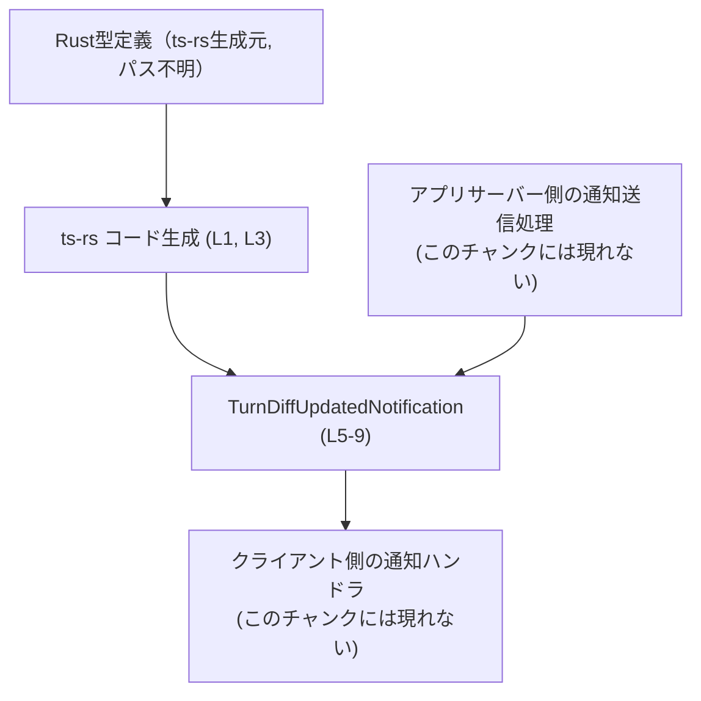
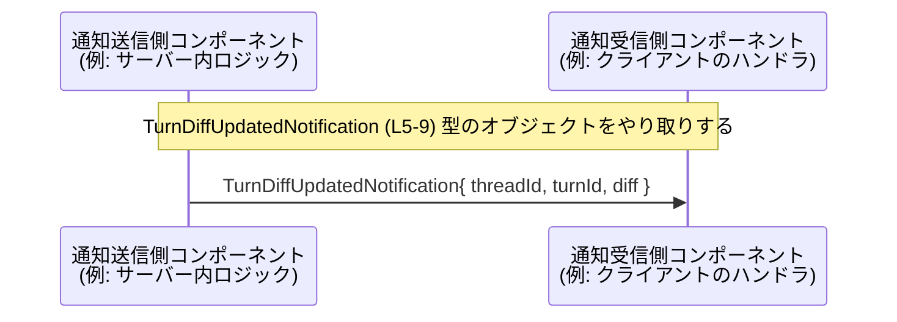

# app-server-protocol/schema/typescript/v2/TurnDiffUpdatedNotification.ts

## 0. ざっくり一言

ターン単位の「統合差分（unified diff）」更新通知のペイロードを表す **TypeScript の型定義**です。  
スレッド ID・ターン ID・そのターンでの最新の統合 diff 文字列をまとめて扱うための構造になっています。

> 行番号は次のように対応付けて説明します。  
> L1: `// GENERATED CODE! DO NOT MODIFY BY HAND!`  
> L3: `// This file was generated by [ts-rs]...`  
> L5–8: JSDoc コメント  
> L9: `export type TurnDiffUpdatedNotification = { ... };`

---

## 1. このモジュールの役割

### 1.1 概要

- このモジュールは、「ターンレベルの統合 diff が更新された」という通知の **データ形式**を定義します（L5–7, L9）。
- 通知には以下 3 つの文字列フィールドが含まれます（L9）。
  - `threadId`: スレッド（会話やセッション）を識別する ID
  - `turnId`: スレッド内のターン（発言やステップ）を識別する ID
  - `diff`: ターン内で行われたすべてのファイル変更を統合した diff（差分）文字列

コメントから、この型は「最新の統合 diff」を一度に渡すためのコンテナとして設計されていることが分かります（L6–7）。

### 1.2 アーキテクチャ内での位置づけ

このファイルは `app-server-protocol/schema/typescript/v2` 以下にあり、**アプリケーションサーバーとクライアント間でやり取りするプロトコルスキーマ**の一部であると解釈できます（パス名より）。  
コメントから、Rust 側の型定義から `ts-rs` によって自動生成された TypeScript 型であることが分かります（L1, L3）。



- A〜E のうち、**コードとしてこのチャンクに存在するのは C のみ**です。
- D/E はコメントとファイルパスから推測される「役割」であり、実際のコンポーネント名や実装はこのチャンクには現れていません。

### 1.3 設計上のポイント

コードから読み取れる設計上の特徴は次の通りです。

- **自動生成コード**  
  - `// GENERATED CODE! DO NOT MODIFY BY HAND!` と `ts-rs` による生成である旨が明記されています（L1, L3）。  
  - 手書き変更は前提としておらず、元の Rust 型定義を変更 → 再生成する運用が想定されます。
- **純粋なデータ型**  
  - 関数やメソッドは一切定義されておらず、`export type ... = { ... }` だけの構造です（L9）。
  - 副作用・状態・エラー処理はこのファイルには存在しません。
- **シンプルな文字列スキーマ**  
  - 3 フィールドすべてが `string` であり、ID や diff の形式・構造には型レベルの制約を設けていません（L9）。
  - 検証・パースなどは、利用側のコードで行う前提と考えられます（検証ロジックはこのチャンクには現れません）。

---

## 2. 主要な機能一覧（コンポーネントインベントリー）

このファイルは「機能（関数）」ではなく、「データ構造（型）」を 1 つだけ公開します。

- `TurnDiffUpdatedNotification`: ターンレベルの統合 diff 更新通知のペイロード型（L5–9）

### 型コンポーネント一覧

| 名前 | 種別 | 役割 / 用途 | 行番号（根拠） |
|------|------|-------------|----------------|
| `TurnDiffUpdatedNotification` | 型エイリアス（オブジェクト型） | ターンレベルの統合 diff 更新通知のデータを表現する。`threadId`, `turnId`, `diff` の 3 つの文字列プロパティを持つ。 | `TurnDiffUpdatedNotification.ts:L5-9` |

フィールドの詳細（L9）:

| フィールド名 | 型 | 説明 | 行番号（根拠） |
|-------------|----|------|----------------|
| `threadId` | `string` | 通知対象のスレッドを識別する ID。具体的なフォーマットはこのファイルからは分かりません。 | `TurnDiffUpdatedNotification.ts:L9` |
| `turnId` | `string` | スレッド内のターンを識別する ID。 | `TurnDiffUpdatedNotification.ts:L9` |
| `diff` | `string` | ターン内の全ファイル変更を統合した unified diff 文字列。コメントから「最新の aggregated diff」であると分かります。 | `TurnDiffUpdatedNotification.ts:L6-7, L9` |

---

## 3. 公開 API と詳細解説

### 3.1 型一覧（構造体・列挙体など）

| 名前 | 種別 | 役割 / 用途 | 行番号（根拠） |
|------|------|-------------|----------------|
| `TurnDiffUpdatedNotification` | 型エイリアス | ターンレベルの unified diff 更新通知のペイロード。サーバーとクライアント間のメッセージの型付けに用いることが想定されます。 | `TurnDiffUpdatedNotification.ts:L5-9` |

#### `TurnDiffUpdatedNotification`

**概要**

- ターンレベルの unified diff が変更された際の通知内容をまとめたオブジェクト型です（L6–7, L9）。
- TypeScript の型エイリアスとして定義されており、構造は `{ threadId: string, turnId: string, diff: string }` です（L9）。

**構造**

```typescript
export type TurnDiffUpdatedNotification = {              // 統合 diff 更新通知のペイロード型 (L9)
    threadId: string,                                    // スレッド ID (L9)
    turnId: string,                                      // ターン ID (L9)
    diff: string,                                        // 統合 diff 文字列 (L9)
};
```

**役割**

- 型システム上の役割は、「この 3 つの文字列を必ず含むオブジェクトである」ことをコンパイル時に保証する点です。
- コメントにより、「latest aggregated diff across all file changes in the turn」であることが明示されており（L6–7）、`diff` が単一ファイルの差分ではないことが分かります。

**Errors / Panics（型レベルの観点）**

- TypeScript は静的型付け言語です。この型を利用することで、コンパイル時に以下のようなエラー検出が行われます。
  - フィールド不足: `threadId`/`turnId`/`diff` のいずれかを指定しないとコンパイルエラーになります。
  - 型不一致: `number` や `null` など、`string` ではない値を割り当てるとコンパイルエラーになります。
- 実行時の例外やエラー処理ロジックはこのファイルには含まれていません。

**Edge cases（エッジケース）**

この型自体は単純であり、型レベルでは次のような点が「表現されていない」ことに注意が必要です。

- 空文字列: `threadId`, `turnId`, `diff` が空文字列 `""` であってもコンパイル上は有効です（値の妥当性チェックは利用側の責任）。
- フォーマット: `diff` の文字列が unified diff 形式でない場合も型チェックでは検出されません。
- サイズ: 非常に長い diff（大型文字列）についても、サイズ制限は型としては表現されていません。

**使用上の注意点**

- この型は **コンパイル時の型安全性** を提供するだけで、**実行時のバリデーション** は行いません。
  - ネットワーク越しに受信した JSON をこの型にキャストする場合、実行時に形が異なっていても TypeScript の型だけでは防げません（後述の使用例で説明します）。
- 生成コードであるため、**手動でフィールドを追加・削除・名称変更すると、次回の自動生成で上書きされる**可能性があります（L1, L3）。

### 3.2 関数詳細（最大 7 件）

このファイルには **関数・メソッドは 1 つも定義されていません**（L1–9 全体を確認）。  
したがって、関数詳細テンプレートに沿って説明すべき対象はありません。

### 3.3 その他の関数

- 該当なし（このチャンクには関数定義が存在しません）。

---

## 4. データフロー

このファイル自体にはロジックや呼び出しは含まれていませんが、コメントから「通知ペイロード型」としての利用が読み取れます（L5–7）。  
以下は、この型を介してデータが流れる一般的なパターンを抽象的に示したものです。



- ここでの `P` / `C` は、このチャンクには現れない抽象的な役割です。
- 実際のクラス名・関数名・イベント名などは **このファイルからは分かりません**。
- わかることは、「`threadId`・`turnId`・`diff` の 3 つを含むオブジェクトが通知の単位になっている」という点のみです（L9）。

---

## 5. 使い方（How to Use）

### 5.1 基本的な使用方法

この型を使って通知ペイロードを構築し、別コンポーネントに渡す基本例です。

```typescript
// 型をインポートする（実際のパスはプロジェクト構成に依存）
import type { TurnDiffUpdatedNotification } from "./schema/typescript/v2/TurnDiffUpdatedNotification";

// 統合 diff 更新通知オブジェクトを作る
const notification: TurnDiffUpdatedNotification = {      // 型エイリアスによる型付け
    threadId: "thread-123",                              // スレッド ID
    turnId: "turn-5",                                    // ターン ID
    diff: "@@ -1,3 +1,3 @@\n-foo\n+bar\n",              // unified diff 文字列（例）
};

// 通知を送信する（sendNotification の実装はこのチャンクには現れません）
sendNotification("turn_diff_updated", notification);
```

- `notification` のオブジェクトリテラルに `diff` を入れ忘れるとコンパイルエラーになります。
- `threadId` に `123`（ number 型）を入れると、`string` との不一致としてコンパイルエラーになります。

### 5.2 よくある使用パターン

#### (1) 受信した JSON をこの型として扱う

ネットワークから受信した JSON を `TurnDiffUpdatedNotification` として扱う場合の典型的なパターンです。

```typescript
import type { TurnDiffUpdatedNotification } from "./schema/typescript/v2/TurnDiffUpdatedNotification";

function handleIncomingMessage(raw: string) {                        // 生の JSON 文字列を受け取る
    const data: unknown = JSON.parse(raw);                           // 実行時には unknown として扱うのが安全

    // 簡略のため型アサーションを使った例（実運用ではバリデーション推奨）
    const notification = data as TurnDiffUpdatedNotification;        // コンパイル時には TurnDiffUpdatedNotification として扱う

    console.log(
        `Thread ${notification.threadId} / Turn ${notification.turnId} updated diff:`,
    );
    console.log(notification.diff);
}
```

- この例では `as TurnDiffUpdatedNotification` によってコンパイル時の利便性を得ていますが、実行時には `data` の構造が違っていてもエラーなく通ってしまいます。
- 実運用では `typeof notification.threadId === "string"` のようなチェックを入れるか、ランタイムバリデーションライブラリ（zod など）と組み合わせることが多いです（このファイルにはそのようなコードはありません）。

#### (2) 部分的な更新と組み合わせる

実際には「ターン diff の一部更新」を別の型で表し、最終的な統合 diff をこの型で送る、といった設計になる可能性がありますが、その詳細はこのチャンクには現れません。  
ここでは、「この型は常に**完全な最新 diff**を送るためのコンテナである」という点のみがコメントから分かります（L6–7）。

### 5.3 よくある間違い

```typescript
import type { TurnDiffUpdatedNotification } from "./schema/typescript/v2/TurnDiffUpdatedNotification";

// ❌ 間違い例: フィールド名のタイプミス
const notification1: TurnDiffUpdatedNotification = {
    threadID: "thread-123",           // threadId ではなく threadID と書いてしまっている
    turnId: "turn-5",
    diff: "diff text",
    // -> プロパティ 'threadId' が不足しているためコンパイルエラー
};

// ✅ 正しい例: 型定義通りのフィールド名を使用
const notification2: TurnDiffUpdatedNotification = {
    threadId: "thread-123",
    turnId: "turn-5",
    diff: "diff text",
};
```

```typescript
// ❌ 間違い例: 実行時に構造が保証されていない値に対して直接アクセス
function unsafeHandle(data: any) {
    // any 型だと TypeScript の型安全性が失われる
    console.log(data.threadId.toUpperCase()); // 実行時に undefined だと例外
}

// ✅ 推奨例: unknown からチェックまたはスキーマバリデーションを行う
function safeHandle(data: unknown) {
    if (
        typeof data === "object" &&
        data !== null &&
        "threadId" in data &&
        typeof (data as any).threadId === "string"
    ) {
        const notification = data as TurnDiffUpdatedNotification;
        console.log(notification.threadId.toUpperCase());
    } else {
        console.warn("Invalid TurnDiffUpdatedNotification payload", data);
    }
}
```

### 5.4 使用上の注意点（まとめ）

- **生成コードを直接変更しない**  
  - L1, L3 で「手で編集しない」ことが明示されています。型を変えたい場合は元の Rust 定義を変更し、`ts-rs` で再生成する必要があります。
- **実行時バリデーションは別途必要**  
  - TypeScript の型はコンパイル時のみ有効です。外部から受信した JSON を扱う場合は、構造が正しいかどうかを実行時に検証する必要があります。
- **文字列フォーマット・長さなどは型では表現されていない**  
  - `diff` の内容が unified diff であること、`threadId`・`turnId` の形式が妥当であることは、この型では保証されません。利用側での契約・検証が重要です。
- **並行性・スレッド安全性**  
  - TypeScript（およびブラウザ環境の JavaScript）は単一スレッドが基本であり、この型はイミュータブルなオブジェクトリテラルとして扱う前提なので、並行性に関する特別な注意点はありません。

---

## 6. 変更の仕方（How to Modify）

### 6.1 新しい機能を追加する場合

ここでの「新しい機能」とは、主に **フィールドや型構造の変更**を指します。

1. **このファイルを直接編集しない**  
   - L1, L3 より、このファイルは `ts-rs` による自動生成コードです。
2. **元の Rust 型定義を変更する**  
   - 生成元となる Rust 側の構造体または型（例: `struct TurnDiffUpdatedNotification { ... }`）にフィールドを追加するなどの変更を行います（実際のファイルパスや定義名はこのチャンクには現れません）。
3. **ts-rs による再生成を行う**  
   - プロジェクトのビルド・スクリプトに従って `ts-rs` を再実行し、TypeScript スキーマを再生成します。
4. **利用箇所を更新する**  
   - 新しいフィールドを読み書きするよう、TypeScript 側のコードを更新します。

### 6.2 既存の機能を変更する場合

- **フィールド名を変えたい場合**
  - Rust 側でフィールド名を変更し、ts-rs で再生成します。
  - TypeScript 側で `TurnDiffUpdatedNotification` を利用しているすべての箇所でフィールド名を更新する必要があります。
- **フィールドの型を変えたい場合**
  - 例: `diff` を文字列から構造化されたオブジェクト型にする、など。
  - Rust 定義の型を変更し、再生成します。
  - TypeScript で `diff` を `string` として扱っている箇所はコンパイルエラーになるため、それらを順に修正することができます（型変更の影響範囲を洗い出しやすい点がメリットです）。
- **後方互換性への配慮**
  - 通信プロトコルの一部であるため、既存クライアント／サーバーとの互換性に注意が必要です。
  - ただし、互換性戦略（バージョニング・移行期間など）はこのファイルからは分かりません。

---

## 7. 関連ファイル

このチャンクから直接参照できるのは、以下の情報のみです。

| パス / 種別 | 役割 / 関係 |
|-------------|------------|
| `app-server-protocol/schema/typescript/v2/TurnDiffUpdatedNotification.ts` | 本ドキュメントの対象ファイル。`TurnDiffUpdatedNotification` 型を定義する TypeScript スキーマ。 |
| （生成元の Rust 型定義ファイル・モジュール） | コメントにある `ts-rs`（L3）から推測される生成元。具体的なパスやモジュール名はこのチャンクには現れません。 |
| 同ディレクトリ内の他の TypeScript スキーマ | `schema/typescript/v2` 以下に類似の通知やコマンドの型定義が存在すると考えられますが、このチャンクには現れません。 |

---

## Bugs / Security / 契約・エッジケースの補足

このファイルのコード範囲に基づいて、追加で注意すべきポイントをまとめます。

- **潜在的なバグ要因**
  - このファイル自体にはロジックがないため、バグはほぼ「不整合なスキーマ」の形で現れます（例: Rust と TS でフィールド名が一致していない等）。  
    ただし、そのような不整合が実際に存在するかどうかは、このチャンクだけからは判断できません。
- **セキュリティ上の注意**
  - `diff` は任意の文字列を保持できるため、ユーザー入力やファイル内容がそのまま入ることが多いと考えられます（L6–7, L9）。
  - diff を HTML としてレンダリングする場合、XSS 対策（エスケープ）が必要になる可能性がありますが、その処理はこのファイルには含まれていません。
- **契約（Contract）**
  - 「`diff` はターン内の全ファイル変更を統合した最新 diff である」という意味論的な契約がコメントで示されています（L6–7）。
  - この契約が守られているかどうかは、通知を生成するロジック側の実装に依存し、このチャンクでは確認できません。
- **テスト**
  - テストコードはこのファイルには含まれていません。
  - 型定義のテストは通常、E2E・統合テストや型レベルテスト（コンパイルが通ることの確認）として別ファイルで行われます。

このファイルは極めて小さく、**「TurnDiffUpdatedNotification という 3 フィールドの文字列型が存在する」**という事実を正確に把握することが主なポイントになります。利用側のコードでは、この契約に従った diff の生成・検証・表示を適切に行う必要があります。
