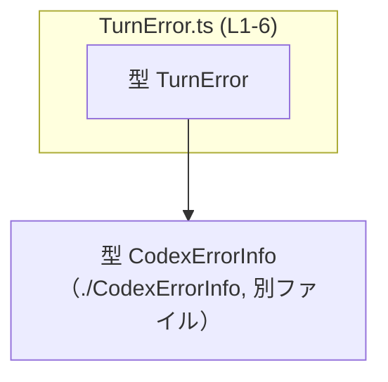
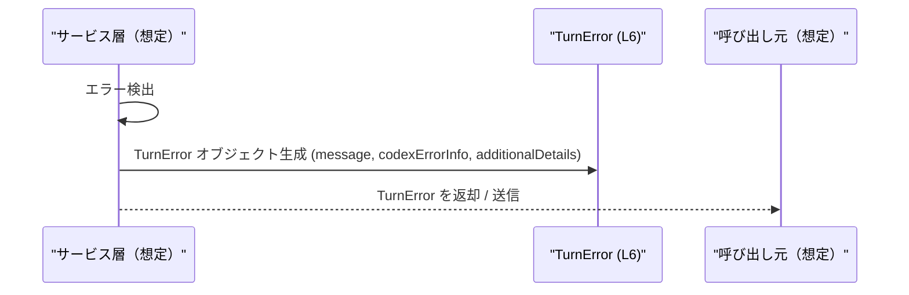

# app-server-protocol/schema/typescript/v2/TurnError.ts コード解説

## 0. ざっくり一言

- `TurnError` は、ある「ターン」（処理単位）で発生したエラー情報を表現する **単純なオブジェクト型エイリアス** です（`TurnError.ts:L6`）。
- メッセージ文字列と、詳細なエラー情報（`CodexErrorInfo`）および追加情報（`additionalDetails`）をまとめて扱えるようにしています（`TurnError.ts:L4,L6`）。

---

## 1. このモジュールの役割

### 1.1 概要

- このモジュールは、エラー情報をクライアントや他モジュールとやり取りするための **型定義** を提供します（`TurnError.ts:L4-6`）。
- コード先頭のコメントから、このファイルは `ts-rs` によって **自動生成された TypeScript 型定義** であり、手動編集を想定していないことが分かります（`TurnError.ts:L1,L3`）。

> ※「TurnError」という名前から、「アプリケーション内のあるターン（会話ターンや処理サイクルなど）で発生したエラー」を表す用途が想定されますが、具体的な文脈はこのチャンクからは分かりません。

### 1.2 アーキテクチャ内での位置づけ

- このファイル自身は **1つの型エイリアス `TurnError` を定義** しており（`TurnError.ts:L6`）、外部からインポートされて利用されることが想定されます。
- `CodexErrorInfo` 型に依存しており、詳細なエラー情報は `CodexErrorInfo` 側で表現されます（`TurnError.ts:L4,L6`）。
- `TurnError` がどのモジュールから利用されているかは、このチャンクには現れません（利用側コードは不明）。



この図は、`TurnError.ts` が `CodexErrorInfo` に型レベルで依存していることを示しています。

### 1.3 設計上のポイント

- **自動生成コード**  
  - `// GENERATED CODE! DO NOT MODIFY BY HAND!`（`TurnError.ts:L1`）  
  - `ts-rs` による自動生成である旨のコメント（`TurnError.ts:L3`）  
  → 変更は元の定義（通常は Rust 側）で行う前提の設計です。このファイルを直接編集すると再生成時に上書きされます。
- **純粋なデータコンテナ**  
  - 関数やクラスは一切なく、`export type TurnError = { ... }` だけを提供します（`TurnError.ts:L6`）。  
  → 振る舞いは持たず、エラー情報を運ぶための **データ構造のみ** を定義しています。
- **null を用いた任意フィールド**  
  - `codexErrorInfo: CodexErrorInfo | null`（`TurnError.ts:L6`）  
  - `additionalDetails: string | null`（`TurnError.ts:L6`）  
  → これらのフィールドは **値が存在しない場合に `null` を取る** 契約になっています。`undefined` は型には含まれていません。
- **TypeScript の型安全性**  
  - `message` は必須の `string` として定義されており（`TurnError.ts:L6`）、エラーには必ずメッセージがある前提です（値の内容までは型では制約されません）。

---

## 2. 主要な機能一覧

このファイルは「機能」というより **型定義** だけを持ちますが、役割ベースで整理すると次のようになります。

- `TurnError`: エラーのメッセージ、詳細情報、追加情報を 1 つのオブジェクトとして表現する。

### 2.1 コンポーネントインベントリー（本チャンク分）

| 種別 | 名前 | 役割 / 用途 | 根拠 |
|------|------|------------|------|
| 型エイリアス | `TurnError` | メッセージ・詳細エラー情報・追加情報をまとめたエラー情報オブジェクトを表現する | `TurnError.ts:L6` |
| インポート | `CodexErrorInfo` | `TurnError.codexErrorInfo` フィールドで利用される詳細エラー情報の型 | `TurnError.ts:L4,L6` |

- このファイルには **関数定義は存在しません**（`TurnError.ts:L1-6` 全体を見ても `function` / `=>` による関数宣言はありません）。

---

## 3. 公開 API と詳細解説

### 3.1 型一覧（構造体・列挙体など）

| 名前 | 種別 | 役割 / 用途 | フィールド概要 | 定義箇所 |
|------|------|------------|----------------|----------|
| `TurnError` | 型エイリアス（オブジェクト型） | 1回の処理ターンで発生したエラー情報を表現するためのデータ構造 | `message: string` / `codexErrorInfo: CodexErrorInfo \| null` / `additionalDetails: string \| null` | `TurnError.ts:L6` |

#### `TurnError` のフィールド詳細

- `message: string`（`TurnError.ts:L6`）  
  - エラーの説明メッセージです。必須の文字列で、`null` や `undefined` は許容されません。
- `codexErrorInfo: CodexErrorInfo | null`（`TurnError.ts:L6`）  
  - より詳細なエラー情報を保持するためのフィールドです。  
  - `CodexErrorInfo` 型の値、もしくは `null` を取ります。  
  - `CodexErrorInfo` の中身は別ファイルに定義されており、このチャンクには現れません。
- `additionalDetails: string | null`（`TurnError.ts:L6`）  
  - 任意の追加情報を文字列で保持するためのフィールドです。  
  - 詳細が不要な場合は `null` になります。

> `null` を使っている点が重要で、`undefined` は型に含まれていないため、利用側では `null` チェックを行う必要があります。

### 3.2 関数詳細（最大 7 件）

- このファイルには **関数・メソッド定義は存在しません**（`TurnError.ts:L1-6`）。  
  → 関数詳細テンプレートを適用できる対象はありません。

### 3.3 その他の関数

- 補助的な関数やラッパー関数も、このチャンクには一切現れません（`TurnError.ts:L1-6`）。

---

## 4. データフロー

このファイル自身には処理ロジックがないため、ここでは **型 `TurnError` がどのように流れると想定されるか** の典型的なパターンを説明します。

> 重要: 以下は、一般的なエラー型の使われ方からの例示であり、**実際の呼び出し元やフローはこのチャンクには現れません**。

- あるサービスやハンドラがエラーを検出する。
- エラー内容と必要なら `CodexErrorInfo`、`additionalDetails` を使って `TurnError` オブジェクトを構築する。
- 呼び出し元やクライアントに `TurnError` を返却・送信する。



- `TE` のラベルに `(L6)` と付けることで、`TurnError` の定義が `TurnError.ts` の 6 行目にあることを示しています。

---

## 5. 使い方（How to Use）

### 5.1 基本的な使用方法

`TurnError` を返す関数の例を示します。実際のコードベースでの使い方はこのチャンクからは分かりませんが、型定義に沿った典型例です。

```typescript
// 型定義のインポート例
import type { TurnError } from "./TurnError";                    // TurnError.ts から型をインポートする（相対パスはプロジェクト構成に依存）

// 何らかの処理結果として TurnError を返す関数の例
function doSomething(): TurnError {
    // ここでは CodexErrorInfo を持たない単純なエラーを作成している
    const error: TurnError = {
        message: "予期しないエラーが発生しました",                // 必須フィールド: string
        codexErrorInfo: null,                                    // 詳細情報がないので null
        additionalDetails: "処理ID: 12345",                      // 追加情報を付与（不要なら null）
    };

    return error;                                               // TurnError 型として返却
}
```

このコードは、`TurnError` の各フィールドに適切な型の値を与えてインスタンスを構築している例です。

### 5.2 よくある使用パターン

1. **詳細情報がない単純なエラー**

```typescript
const simpleError: TurnError = {
    message: "入力が不正です",                                   // エラーメッセージ
    codexErrorInfo: null,                                       // 詳細エラー情報はなし
    additionalDetails: null,                                    // 追加情報もなし
};
```

1. **`CodexErrorInfo` を利用した詳細エラー**

```typescript
import type { TurnError } from "./TurnError";
import type { CodexErrorInfo } from "./CodexErrorInfo";

// CodexErrorInfo を使って詳細情報を付与する例
const detail: CodexErrorInfo = {
    // CodexErrorInfo の実際のフィールド構成はこのチャンクには現れないため不明
};

const detailedError: TurnError = {
    message: "外部サービス呼び出しに失敗しました",
    codexErrorInfo: detail,                                     // null ではなく CodexErrorInfo を格納
    additionalDetails: "リトライ回数: 3",                        // 任意の追加情報
};
```

> `CodexErrorInfo` の具体的なフィールドはこのファイルでは分からないため、上の例では中身を省略しています。

1. **利用時の null チェック**

```typescript
function logTurnError(err: TurnError) {
    console.error("[TurnError]", err.message);                  // message は常に string

    if (err.codexErrorInfo !== null) {                          // null チェック
        console.error("詳細情報:", err.codexErrorInfo);          // CodexErrorInfo が利用可能
    }

    if (err.additionalDetails !== null) {                       // こちらも null チェック
        console.error("追加情報:", err.additionalDetails);
    }
}
```

### 5.3 よくある間違い

```typescript
import type { TurnError } from "./TurnError";

// 間違い例: null ではなく undefined を使っている
const wrongError: TurnError = {
    message: "エラー",
    // codexErrorInfo: undefined,                               // 型が CodexErrorInfo | null なのでコンパイルエラー
    codexErrorInfo: null,
    additionalDetails: null,
};

// 正しい例: null を明示的に使う
const correctError: TurnError = {
    message: "エラー",
    codexErrorInfo: null,
    additionalDetails: null,
};
```

- `codexErrorInfo` と `additionalDetails` は **`null` を取りうる型** であり、`undefined` は許容されません（`TurnError.ts:L6`）。  
  → strictNullChecks が有効なプロジェクトでは、`undefined` を代入しようとするとコンパイルエラーになります。

### 5.4 使用上の注意点（まとめ）

- **前提条件**
  - `message` は空文字列も型的には許容されますが、意味のあるメッセージを入れるかどうかはアプリケーション側のルール次第です。このチャンクには制約は現れません。
- **null ハンドリング**
  - `codexErrorInfo` / `additionalDetails` は `null` を取りうるため、利用時には **必ず null チェック** を行う必要があります。
- **情報漏えいの注意**
  - `message` や `additionalDetails` に機密情報（トークン、パスワード、内部スタックトレースなど）を含めると、クライアント側に露出する可能性があります。ログ出力・レスポンス設計時のポリシーに従う必要があります（セキュリティ観点）。
- **並行性**
  - この型は単なるデータ構造であり、ミュータブルな状態や共有リソースを持たないため、**並行処理に固有の問題はありません**。ただし、オブジェクトをミュータブルに扱うかどうかは利用側の設計によります（このチャンクからは不明）。

---

## 6. 変更の仕方（How to Modify）

### 6.1 新しい機能を追加する場合

- このファイルは **自動生成** と明記されているため（`TurnError.ts:L1,L3`）、**直接編集すべきではありません**。
- 新しいフィールドを追加したい場合の一般的な手順は次のようになります（ただし、具体的な元コードはこのチャンクには現れません）:
  1. 生成元（通常は Rust の型定義 + `ts-rs` の属性）を変更する。  
     - 例: Rust 側の構造体にフィールドを追加する、といった操作が想定されますが、実際の定義位置は不明です。
  2. コード生成プロセスを再実行し、`TurnError.ts` を再生成する。
  3. 生成された `TurnError` 型に基づき、TypeScript 側の利用コードを更新する。

> このチャンクには生成元のコードが現れないため、実際にどのファイルを編集するかはプロジェクト全体の構成を確認する必要があります。

### 6.2 既存の機能を変更する場合

- **影響範囲の確認**
  - `TurnError` 型を利用している箇所（型注釈、関数の戻り値、API スキーマなど）に変更が波及します。
  - 特に `message` が必須からオプションになる、フィールド名が変わる、型が変わるといった変更はコンパイルエラーを多数発生させる可能性があります。
- **契約（前提条件・返り値の意味）**
  - 現状の契約は:
    - `message` は `string`（必須）。
    - `codexErrorInfo` は `CodexErrorInfo` か `null`。
    - `additionalDetails` は `string` か `null`。  
  - これらを変更すると、利用側の **null チェックやシリアライゼーション処理** に影響します。
- **テスト**
  - このチャンクにはテストコードは現れません。型変更を行った場合は、これを利用する箇所の単体テスト・統合テストが通るかを確認する必要があります。

---

## 7. 関連ファイル

このファイルから直接分かる関連ファイルは次の通りです。

| パス | 役割 / 関係 | 根拠 |
|------|-------------|------|
| `./CodexErrorInfo` | `CodexErrorInfo` 型をエクスポートしているファイル。`TurnError.codexErrorInfo` の型として利用される。中身はこのチャンクには現れない。 | `TurnError.ts:L4,L6` |

- その他、`TurnError` を実際に利用しているモジュール（API レイヤ、サービス層、フロントエンドなど）は、このチャンクには現れません。「どこから呼ばれているか」を調べるには、プロジェクト全体で `TurnError` を参照している箇所を検索する必要があります。

---

### 付記: Bugs / Security / Edge Cases / Performance などの観点

- **Bugs**
  - このファイルは型定義のみであり、実行ロジックがないため、直接的なバグ（計算ミス・条件分岐の不備など）は存在しません。
- **Security**
  - `message` / `additionalDetails` にどのような情報を入れるかは利用側次第です。  
    → 外部に返す際は、機密情報や内部実装の詳細（スタックトレースなど）を含めるかどうかを運用ポリシーで管理する必要があります。
- **Contracts / Edge Cases**
  - `codexErrorInfo` と `additionalDetails` が `null` であるケースは **正常な入力** であり、利用側ではそれを前提として実装する必要があります。
  - `message` が空文字列であっても型的には許容されますが、有用なエラーメッセージにならない可能性があります。この制約は型ではなくビジネスロジック側で定義されます（このチャンクには現れません）。
- **Performance / Scalability**
  - `TurnError` は小さなオブジェクト型であり、計算処理を持たないため、単体でパフォーマンス問題を引き起こす可能性は低いと考えられます。
- **Observability**
  - ログ・メトリクス・トレースに `TurnError` の内容を出力する場合、`CodexErrorInfo` の構造と量に応じてログサイズが増加する可能性があります。  
  - どのようにロギングしているかはこのチャンクには現れませんが、運用上はログの粒度と情報量のバランスを検討する必要があります。
