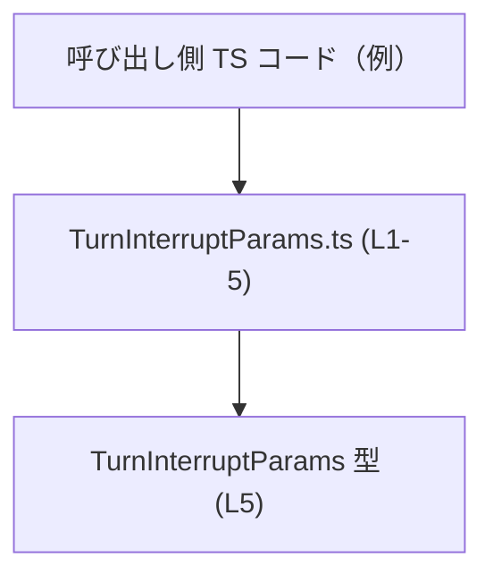
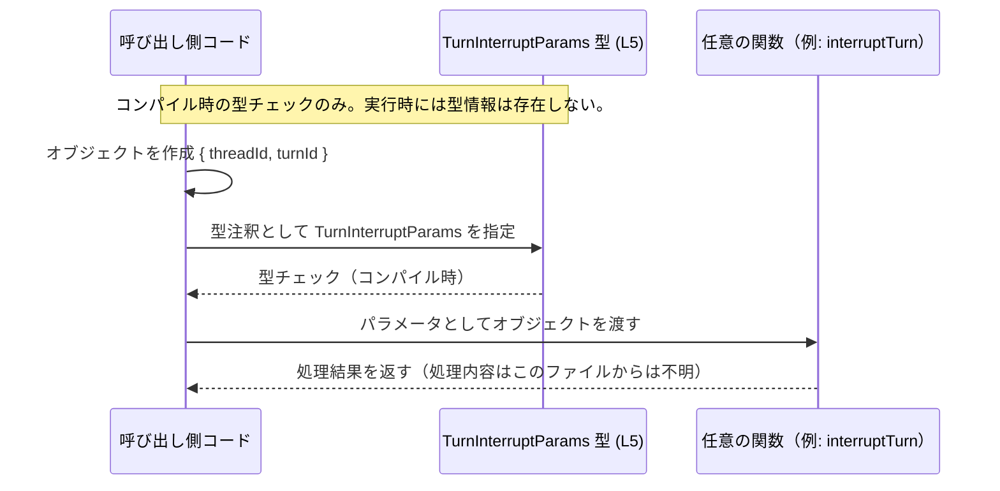

# app-server-protocol/schema/typescript/v2/TurnInterruptParams.ts コード解説

## 0. ざっくり一言

`TurnInterruptParams` という **2 つの文字列 ID（threadId / turnId）からなるパラメータ型**を定義し、外部に公開している TypeScript のスキーマ定義ファイルです（L5）。

---

## 1. このモジュールの役割

### 1.1 概要

- このモジュールは、`TurnInterruptParams` 型を 1 つだけエクスポートしています（L5）。
- 型は `{ threadId: string, turnId: string }` という形のオブジェクトを表し、名前からは「あるスレッド内の特定のターンを識別するためのパラメータ」と解釈できますが、用途の詳細はこのファイルからは分かりません。
- ファイル先頭のコメントから、この型定義は `ts-rs` によって自動生成されていることが分かります（L1–3）。

### 1.2 アーキテクチャ内での位置づけ

- 生成コードであり（L1–3）、アプリケーション本体ではなく **プロトコル／スキーマ層** に属する型定義ファイルと位置づけられます（パス `schema/typescript/v2` からも推測されますが、他ファイル構成はこのチャンクには現れません）。
- このモジュール自身は他のモジュールを import しておらず、**型を定義して外部に提供するだけ**です（L5）。

概念的な依存関係を Mermaid 図で表すと次のようになります（実際にどのモジュールが import しているかはこのチャンクからは分かりません）。



### 1.3 設計上のポイント

- **自動生成コード**  
  - `// GENERATED CODE! DO NOT MODIFY BY HAND!` というコメントにより、手動編集禁止であることが明示されています（L1）。
- **宣言専用モジュール**  
  - 実行時コード（関数・クラスなど）は一切なく、型エイリアスの宣言のみです（L5）。
- **単純な構造のパラメータ型**  
  - 2 つの必須プロパティ `threadId: string` と `turnId: string` を持つオブジェクト型です（L5）。
- **エラーハンドリング・並行性の関与なし**  
  - このファイルにはロジックが存在しないため、エラーハンドリングや並行処理に直接関与する部分はありません。

---

## 2. 主要な機能一覧（コンポーネントインベントリー）

このファイルに登場するコンポーネントを一覧にします。

| 名前 | 種別 | 定義位置 | 役割 / 説明 |
|------|------|----------|-------------|
| `TurnInterruptParams` | 型エイリアス (`export type`) | `TurnInterruptParams.ts:L5-5` | `threadId` と `turnId` という 2 つの文字列プロパティを持つパラメータオブジェクト型 |

**補足**

- このファイルには **関数・クラス・列挙体** は一切定義されていません（L1–5）。
- 先頭 2 行のコメントは、生成コードであることと生成元ツール（`ts-rs`）を示すメタ情報です（L1–3）。

---

## 3. 公開 API と詳細解説

### 3.1 型一覧（構造体・列挙体など）

| 名前 | 種別 | フィールド | 役割 / 用途 | 根拠 |
|------|------|-----------|-------------|------|
| `TurnInterruptParams` | 型エイリアス | `threadId: string`, `turnId: string` | 2 つの ID を持つパラメータオブジェクトを表現する型です。どの API で使われるかはこのファイルからは分かりません。 | `TurnInterruptParams.ts:L5-5` |

#### `TurnInterruptParams` の詳細

```typescript
export type TurnInterruptParams = { threadId: string, turnId: string, };
```

- **型の意味**  
  - `TurnInterruptParams` は、**必須プロパティ** `threadId` と `turnId` の 2 つを持つオブジェクト型です（L5）。
  - 両方のプロパティが `string` 型として定義されています（L5）。
- **型安全性（TypeScript 特有の観点）**  
  - TypeScript コンパイル時に、`threadId` / `turnId` が存在しない、もしくは `string` 以外の型が渡された場合に型エラーとして検出されます。
  - ただし、実行時にはこの型情報は存在せず、**実行時のバリデーションは行われません**（TypeScript の一般的な性質）。

**契約（Contract）**

- オブジェクトは **必ず** 次の 2 プロパティを持つことが期待されます（L5）。
  - `threadId`: スレッドを識別する ID（用途は名称からの推測であり、コードからは意味は確定しません）
  - `turnId`: ターンを識別する ID（同上）
- 両方とも `string` 型であり、`undefined` / `null` / 数値などは許容されません（型システム上）。

**Edge cases（エッジケース）**

型として許可されるが、意味的には注意が必要そうな値について述べます（あくまで TypeScript の型の観点であり、業務仕様は不明です）。

- 空文字列 `""`  
  - 型としては有効です（`string` の一種）。しかし ID として妥当かどうかはこのファイルからは分かりません。
- ホワイトスペースのみの文字列 `"   "`  
  - これも `string` であるため型チェックには通ります。
- 極端に長い文字列  
  - 型は `string` なので許容されます。長さ制約やフォーマットチェックはこの型定義では行われません。

**使用上の注意点**

- TypeScript の型は **コンパイル時のみ有効**です。実行時に外部入力をそのまま `TurnInterruptParams` とみなす場合は、別途ランタイム検証が必要です。
- `threadId` / `turnId` の正確なフォーマットや制約（UUID なのか、数値文字列なのか等）はこのファイルからは分からないため、利用側で仕様を確認する必要があります。

### 3.2 関数詳細（最大 7 件）

- このファイルには **関数・メソッドは一切定義されていません**（L1–5）。
- よって、詳細テンプレートを適用すべき対象関数はありません。

### 3.3 その他の関数

- なし（関数定義が存在しません）。

---

## 4. データフロー

このファイルには関数呼び出しやロジックが存在しないため、「データがどのように処理されるか」という具体的なフローはコードからは分かりません。

ここでは、**TypeScript の型エイリアスとして利用されるときの一般的なデータフローのイメージ**を示します。  
※以下に登場する関数名やモジュールはあくまで例であり、このリポジトリに実在するかどうかは、このチャンクからは分かりません。



要点:

- `TurnInterruptParams` 型は **コンパイル時にのみ参照されるメタ情報**です。
- 実際にやり取りされるデータは、単なる JavaScript オブジェクト `{ threadId: string, turnId: string }` です。
- 並行性やエラー処理は、この型ではなく、それを利用する関数側の責務になります（このファイルからはその実装は分かりません）。

---

## 5. 使い方（How to Use）

### 5.1 基本的な使用方法

以下は、`TurnInterruptParams` を関数の引数型として利用する典型的な例です。  
※ import パスはこのリポジトリの実際の構成がこのチャンクからは分からないため、相対パスは擬似的なものです。

```typescript
// TurnInterruptParams 型をインポートする
import type { TurnInterruptParams } from "./TurnInterruptParams"; // パスは例

// ターンを中断する（という想定の）関数の型定義例
function interruptTurn(params: TurnInterruptParams): void {
    // params.threadId および params.turnId は string 型として扱える
    console.log(`Interrupting turn ${params.turnId} in thread ${params.threadId}`);
}

// 呼び出し側コード例
const params: TurnInterruptParams = {
    threadId: "thread-123", // string なので OK
    turnId: "turn-456",     // string なので OK
};

interruptTurn(params); // 型チェックを通過する
```

- `TurnInterruptParams` を使うことで、`threadId` / `turnId` の両方が揃っていることをコンパイル時に保証できます。

### 5.2 よくある使用パターン

1. **関数引数の型として利用**

```typescript
import type { TurnInterruptParams } from "./TurnInterruptParams";

function logTurnInterrupt(params: TurnInterruptParams): void {
    // ここでは params.threadId, params.turnId に自由にアクセスできる
    console.log(params);
}
```

1. **変数の型注釈として利用**

```typescript
import type { TurnInterruptParams } from "./TurnInterruptParams";

const pendingInterrupt: TurnInterruptParams = {
    threadId: "t-1",
    turnId: "u-99",
};
```

1. **配列・コレクションで利用**

```typescript
import type { TurnInterruptParams } from "./TurnInterruptParams";

const queue: TurnInterruptParams[] = []; // 中断要求のキュー（という想定）

queue.push({ threadId: "t-1", turnId: "u-1" });
queue.push({ threadId: "t-2", turnId: "u-2" });
```

### 5.3 よくある間違い（想定しうる誤用例）

TypeScript でこの型を使う際に起こりやすい間違いの例を示します。

```typescript
import type { TurnInterruptParams } from "./TurnInterruptParams";

// 間違い例: プロパティ名のタイプミス
const badParams1: TurnInterruptParams = {
    threadID: "t-1",  // エラー: 'threadId' ではなく 'threadID' になっている
    turnId: "u-1",
};

// 間違い例: 型の不一致
const badParams2: TurnInterruptParams = {
    threadId: 123,    // エラー: number は string に代入できない
    turnId: "u-1",
};

// 正しい例
const goodParams: TurnInterruptParams = {
    threadId: "t-1",
    turnId: "u-1",
};
```

### 5.4 使用上の注意点（まとめ）

- **実行時検証は別途必要**  
  - TypeScript の型はコンパイル時のみ有効であり、外部から受け取ったデータをそのまま `TurnInterruptParams` として扱う場合、ランタイムでのスキーマ検証（例: `zod`, `io-ts` など）を別途行う必要があります。
- **空文字列なども許容される**  
  - 型定義上は `string` であれば何でも通るため、意味上のバリデーション（ID が妥当かなど）は利用側の責務になります。
- **並行性**  
  - この型はイミュータブルなデータ構造の宣言に過ぎないため、並行処理上の問題（データ競合など）は通常発生しません。並行性の問題は、実際にこの型を共有・更新するロジック側で考える必要があります。

---

## 6. 変更の仕方（How to Modify）

### 6.1 新しい機能を追加する場合

このファイル先頭コメントにある通り、**手で編集すべきではない生成コード**です。

```typescript
// GENERATED CODE! DO NOT MODIFY BY HAND!        // L1
// This file was generated by [ts-rs](...).      // L3
```

そのため、`TurnInterruptParams` に新しいフィールドを追加したいなどの要望がある場合は、次の方針になります。

- 直接このファイルを編集しない（L1–3）。
- 生成元の定義（おそらく Rust 側の型定義や ts-rs の設定）がどこにあるかをプロジェクト全体から探す必要がありますが、このチャンクにはそれは現れていません。
- 生成元の型定義を変更した上で、`ts-rs` を再実行してこのファイルを再生成する、という運用になると考えられます（ただし具体的な手順はこのチャンクからは不明です）。

### 6.2 既存の機能を変更する場合

`TurnInterruptParams` の構造変更（プロパティ名の変更・削除など）を行うと、依存しているコードがすべて影響を受けます。影響範囲そのものはこのチャンクからは特定できませんが、一般的な注意点として:

- **プロパティ名の変更**  
  - `threadId` → `threadID` のような変更を行うと、すべての利用箇所の修正が必要になります。
- **プロパティ削除**  
  - どちらか一方を削除した場合、そのプロパティに依存しているロジックはコンパイルエラーになります。
- **型の変更（string → number など）**  
  - データフォーマットの仕様変更にあたるため、API のクライアント・サーバ両方を含む広範な修正が必要になる可能性があります。

ただし、いずれの場合も **このファイルを直接編集するのではなく、生成元で変更する必要がある** 点が重要です（L1–3）。

---

## 7. 関連ファイル

このチャンクには import 文や他ファイルへの参照が一切含まれていないため、**直接の関連ファイルを特定することはできません**。

| パス | 役割 / 関係 |
|------|------------|
| 不明 | このファイルから他ファイルへの参照が存在しないため、関連ファイルはこのチャンクからは特定できません。 |

---

## Bugs / Security / Tests / Performance などの観点（まとめ）

このファイル固有の観点を簡潔にまとめます。

- **Bugs（バグの可能性）**  
  - 宣言のみのファイルであり、通常のロジックバグは存在しません。  
  - ただし、生成元との不整合（生成元の型と実際のプロトコル仕様のずれ）は、このチャンクからは検出できません。

- **Security（セキュリティ）**  
  - この型自体はセキュリティ機能を提供しません。  
  - 実行時に外部入力を `TurnInterruptParams` として扱う場合、入力検証・認可チェックなどは別途実装する必要があります。

- **Contracts / Edge Cases**  
  - 契約: `threadId` と `turnId` の 2 つの `string` プロパティを必須とする（L5）。  
  - エッジケース: 空文字列やフォーマット不正でも型としては許容されるため、意味的な検証は利用側に委ねられています。

- **Tests（テスト）**  
  - このファイルにはテストコードは含まれていません（L1–5）。  
  - 通常、この種の生成された型定義は、単体テストよりも「生成元の仕様・テスト」によって保証されることが多いですが、このリポジトリ全体にどのようなテストが存在するかは、このチャンクからは分かりません。

- **Performance / Scalability**  
  - 型エイリアスはコンパイル時のみの概念であり、実行時のパフォーマンスへの直接の影響はありません。  
  - 大量の `TurnInterruptParams` オブジェクトを扱う場合でも、性能は主にオブジェクトの生成・保持・通信量に依存し、この型定義自体はボトルネックになりません。

- **Tradeoffs / Refactoring / Observability**  
  - `string` ベースの ID による単純な構造であり、型としては扱いやすい一方、フォーマットや意味づけは型では表現されていません。  
  - リファクタリングする際は、このファイルではなく生成元を修正する必要があります（L1–3）。  
  - この型自体はログ出力やトレーシングといった観測性の仕組みを含まず、あくまでデータ構造の宣言にとどまります。
