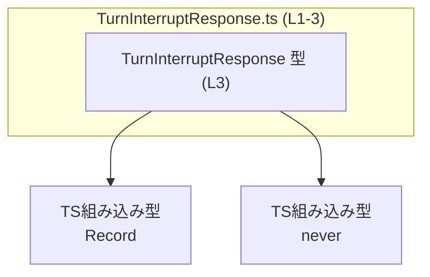
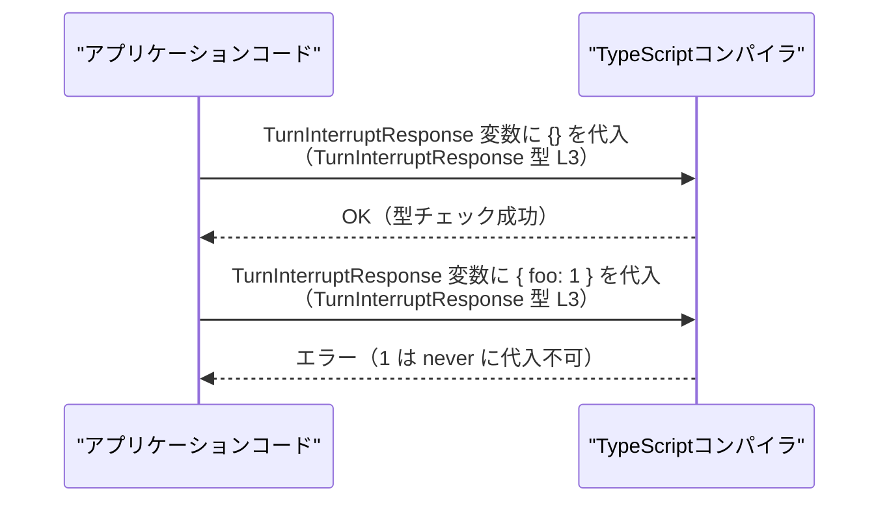

# app-server-protocol/schema/typescript/v2/TurnInterruptResponse.ts

## 0. ざっくり一言

`TurnInterruptResponse` という名前の **空のレスポンス型** を 1 つだけ公開する、TypeScript の自動生成ファイルです（`TurnInterruptResponse.ts:L1-3`）。

---

## 1. このモジュールの役割

### 1.1 概要

- このモジュールは、`TurnInterruptResponse` という型エイリアスを定義・公開しています（`TurnInterruptResponse.ts:L3-3`）。
- `TurnInterruptResponse` は `Record<string, never>` として定義されており、**プロパティを一切持たないオブジェクト**を表す型になっています。
- ファイル先頭のコメントから、この型は Rust から `ts-rs` により **自動生成**されていることが分かります（`TurnInterruptResponse.ts:L1-2`）。

### 1.2 アーキテクチャ内での位置づけ

このチャンクから分かる依存関係は、**型レベル**のものだけです。

- `TurnInterruptResponse` は TypeScript 組み込みユーティリティ型 `Record<K, V>` と `never` 型に依存します（`TurnInterruptResponse.ts:L3-3`）。
- プロジェクト内のどのモジュールからこの型が使われているかは、このファイル単体からは分かりません（不明）。



### 1.3 設計上のポイント

- **自動生成ファイル**  
  - 冒頭コメントに「GENERATED CODE」「Do not edit this file manually」とあり、`ts-rs` による自動生成であることが明示されています（`TurnInterruptResponse.ts:L1-2`）。
- **型のみ定義（実行時コードなし）**  
  - `export type ...` のみで、関数・クラス・値の定義はありません（`TurnInterruptResponse.ts:L3-3`）。
  - コンパイル後の JavaScript にはこの型は出力されず、**実行時コストや副作用はありません**。
- **空オブジェクトを表す契約**  
  - `Record<string, never>` により、どのキーに対しても値の型が `never` となるため、実質的に「プロパティを持たないオブジェクト」を表現します。
- **エラーハンドリング・並行性**  
  - 実行時処理がないため、エラー処理・非同期処理・並行性に関する挙動はこのファイルには存在しません。

---

## 2. 主要な機能一覧

このファイルが提供する機能は 1 つだけです。

- `TurnInterruptResponse` 型: `Record<string, never>` として定義された、プロパティを持たないレスポンスオブジェクト用の型（`TurnInterruptResponse.ts:L3-3`）。

---

## 3. 公開 API と詳細解説

### 3.1 型一覧（構造体・列挙体など）

このチャンクに現れる「コンポーネント（型）」のインベントリーです。

| 名前 | 種別 | エクスポート | 定義位置 | 役割 / 用途 |
|------|------|-------------|----------|-------------|
| `TurnInterruptResponse` | 型エイリアス (`type`) | `export` | `TurnInterruptResponse.ts:L3-3` | `Record<string, never>` で表現された、プロパティを持たないレスポンスオブジェクトの型 |

#### `TurnInterruptResponse` の型定義の意味

```ts
export type TurnInterruptResponse = Record<string, never>;
```

- `Record<K, V>` は「キーが `K` 型、値が `V` 型のオブジェクト」を表す TypeScript の組み込みユーティリティ型です。
- `Record<string, never>` は、「任意の文字列キーに対して値の型が `never`」というオブジェクト型になります。
- `never` は「**到達不可能な値**」を表す型であり、通常の値は `never` 型には代入できません。

そのため、型チェックの観点では、

- `const x: TurnInterruptResponse = {};` は OK
- `const x: TurnInterruptResponse = { foo: 1 };` は  
  `1` を `never` に代入できないため **コンパイルエラー** になります

という挙動になります。

> バグ・セキュリティ観点（型レベル）  
>
> - 「このレスポンスにフィールドが存在する」と誤ってコードを書くと、コンパイル時にエラーとなり、**仕様にないフィールドの利用を防ぎます**。  
> - ただし、`as any` や型アサーションでこの型を偽装することは TypeScript 全般で可能であり、この型定義単体で実行時の入力検証やセキュリティ保証を行うものではありません。

### 3.2 関数詳細（最大 7 件）

- **このファイルには関数・メソッドは定義されていません。**  
  したがって、「関数詳細」テンプレートを適用できる対象はありません（関数インベントリーは空です）。

### 3.3 その他の関数

- 該当なし（このチャンク内に関数定義は存在しません）。

---

## 4. データフロー

このファイルには実行時の処理は存在しないため、**型チェック時のデータフロー（どう型が使われるか）**を図示します。  
ここでのフローは、TypeScript 一般の挙動の説明であり、プロジェクト固有の呼び出し関係はこのチャンクからは分かりません（不明）。



要点:

- `TurnInterruptResponse` はコンパイル時のみ存在し、**実行時データ構造の形**（オブジェクトが空であること）を静的に制約します。
- このファイル単体からは、「どの関数がこの型を返す/受け取るか」といった実際のデータフローは分かりません。

---

## 5. 使い方（How to Use）

### 5.1 基本的な使用方法

`TurnInterruptResponse` を使って、「プロパティを持たないレスポンス」を表す変数を定義する例です。

```typescript
// TurnInterruptResponse 型をインポートする
import type { TurnInterruptResponse } from "./TurnInterruptResponse";  // パスは例。実際の相対パスはプロジェクト構成次第（このチャンクからは不明）

// 空オブジェクトをレスポンスとして扱う
const res: TurnInterruptResponse = {};  // OK: プロパティがないので Record<string, never> を満たす

// 何かしらの処理が終わったことだけを伝える用途などで使用できる
function handleTurnInterrupt(): TurnInterruptResponse {
    // 特に返すべきデータが無いことを型レベルで表現している
    return {};
}
```

- 返り値・引数の型として `TurnInterruptResponse` を使うことで、「**この操作には付随データがない**」という契約を表現できます。
- どの関数が実際にこの型を返しているかは、このファイルからは分かりません（不明）。

### 5.2 よくある使用パターン

1. **関数の返り値として「成功したが追加情報なし」を表現**

```typescript
function interruptTurn(): TurnInterruptResponse {
    // 内部で何らかの処理をしても、呼び出し側にはデータを返さない契約
    return {};
}
```

1. **API クライアントで「ボディが空のレスポンス」を型付け**

```typescript
async function callInterruptApi(): Promise<TurnInterruptResponse> {
    const response = await fetch("/api/turn/interrupt", { method: "POST" });

    // レスポンスボディをパースしても空オブジェクトとして扱う
    // 実際の fetch の戻り値処理は実装次第だが、型としては {} に制約される
    return {};
}
```

> ※ 上記の関数名や API パスは説明用の例であり、このリポジトリに存在するかどうかは、このチャンクからは分かりません。

### 5.3 よくある間違い

`TurnInterruptResponse` にプロパティがある前提でコードを書くと、型エラーになります。

```typescript
import type { TurnInterruptResponse } from "./TurnInterruptResponse";

// 間違い例: プロパティを持つオブジェクトを代入しようとしている
const invalidRes: TurnInterruptResponse = {
    // エラー: 型 'number' を型 'never' に割り当てることはできません
    count: 1,
};

// 間違い例: プロパティが存在するとみなしてアクセスしようとしている
function useResponse(res: TurnInterruptResponse) {
    // エラー: プロパティ 'count' は型 'TurnInterruptResponse' に存在しません
    console.log(res.count);
}

// 正しい例: プロパティがない前提で扱う
function useResponseCorrect(res: TurnInterruptResponse) {
    // 何も参照しない、あるいは「成功した」ことだけをトリガーに処理する
    console.log("turn interrupt handled");
}
```

### 5.4 使用上の注意点（まとめ）

- **前提条件**
  - `TurnInterruptResponse` は「**プロパティを持たないオブジェクト**」という契約を表します。
  - プロパティを追加したい場合は、この型を変更するのではなく、別の型を定義するか、生成元（Rust 側）で型を変更する必要があります（コメントより自動生成と分かるため、直接編集は非推奨：`TurnInterruptResponse.ts:L1-2`）。
- **禁止事項**
  - このファイルを手動で編集すること（コメントにより禁止されています: `TurnInterruptResponse.ts:L1-2`）。
  - `as any` などで型チェックを無効化してプロパティを持つオブジェクトを無理に押し込むこと。TypeScript の安全性が損なわれます。
- **エラー・パニック条件**
  - 実行時例外は発生しませんが、プロパティを持つ値を `TurnInterruptResponse` に代入しようとすると **コンパイルエラー** となります。
- **並行性**
  - 実行時のコードが存在しないため、この型そのものにはスレッド安全性・非同期処理・ロックなどに関する要素はありません。

---

## 6. 変更の仕方（How to Modify）

### 6.1 新しい機能を追加する場合

- このファイルは `ts-rs` による **自動生成**であり、`TurnInterruptResponse.ts:L1-2` で「手で編集しないこと」が明示されています。
- 新しいフィールドを追加したい、あるいは別のレスポンス型にしたい場合:
  1. **生成元の Rust の型定義**（`ts-rs` 属性が付与されている構造体や型）を変更する必要があります。  
     - その Rust ファイルの場所や名前は、このチャンクには現れません（不明）。
  2. Rust 側を変更したうえで、`ts-rs` によるコード生成を再実行します。
  3. 生成された TypeScript 側の `TurnInterruptResponse` の定義が更新されます。

### 6.2 既存の機能を変更する場合

`TurnInterruptResponse` の契約（「プロパティを持たない」）を変更する場合の注意点:

- **影響範囲**
  - `TurnInterruptResponse` を引数・戻り値・フィールドとして使用しているすべての箇所に影響します。
  - 具体的な使用箇所は、このチャンクだけでは分かりません。IDE の「型の参照元検索」などで確認する必要があります。
- **契約の保持**
  - これまで「追加情報はない」前提で実装されていたコードが、「フィールドがあるかもしれない」前提に変わると API 契約が変化します。
  - 後方互換性が必要な場合は、新しい型名を定義する方が安全です。
- **テストの確認**
  - このファイルにはテストコードは含まれていませんが、プロジェクト全体としては、この型に依存しているテストが存在する可能性があります（不明）。
  - 契約変更後は、そのようなテストが失敗しないか確認する必要があります。

---

## 7. 関連ファイル

このチャンクから分かる関連要素は限定的です。

| パス / 名称 | 役割 / 関係 |
|------------|------------|
| Rust 側の ts-rs 対応型（パス不明） | `TurnInterruptResponse.ts` が自動生成される元となる Rust の型。コメントにより存在が示唆されていますが、具体的なファイルパスや型名はこのチャンクには現れません。 |
| TypeScript 組み込み定義 (`lib.es5.d.ts` など) | `Record<string, never>` や `never` 型の定義を提供する、TypeScript 標準ライブラリの型定義ファイル群。 |

- プロジェクト内で `TurnInterruptResponse` がどこからインポート・利用されているかは、このファイル単体からは分かりません（不明）ので、全体構造を把握する際には IDE 等を用いて参照関係を確認する必要があります。
