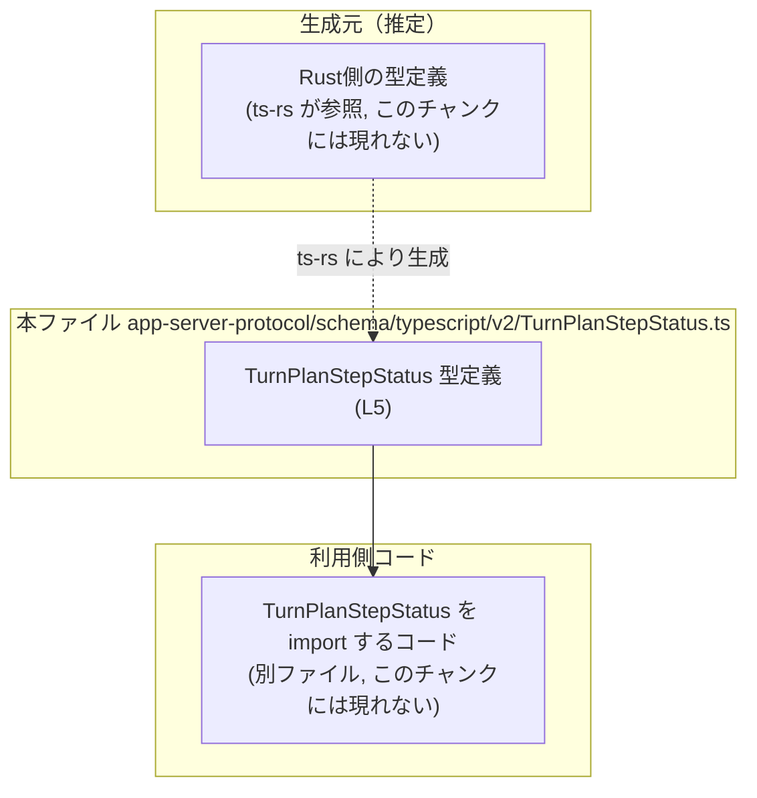
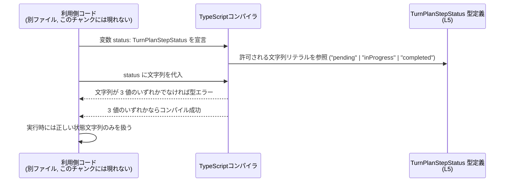

# app-server-protocol/schema/typescript/v2/TurnPlanStepStatus.ts

## 0. ざっくり一言

- ターン（Turn）内の「プランのステップ」がどの状態にあるかを表すための、3 値の文字列ユニオン型 `TurnPlanStepStatus` を定義する自動生成 TypeScript ファイルです（TurnPlanStepStatus.ts:L1-5）。
- 実行時の処理は含まれず、コンパイル時の型安全性を高めるためのスキーマ定義です（TurnPlanStepStatus.ts:L5-5）。

---

## 1. このモジュールの役割

### 1.1 概要

- このモジュールは **ターンプランの各ステップの状態を型として表現する** ために存在し、TypeScript 側で `TurnPlanStepStatus` 型を提供します（TurnPlanStepStatus.ts:L5-5）。
- 状態は `"pending"` / `"inProgress"` / `"completed"` の 3 種類に限定され、その他の文字列を誤って使うことをコンパイル時に防ぎます（TurnPlanStepStatus.ts:L5-5）。
- ファイルは `ts-rs` によって自動生成されており、手動編集しない前提になっています（TurnPlanStepStatus.ts:L1-3）。

### 1.2 アーキテクチャ内での位置づけ

- ディレクトリパス `app-server-protocol/schema/typescript/v2` から、このファイルはアプリケーションサーバのプロトコル用スキーマ定義群の一部と解釈できますが、他ファイルとの具体的な依存関係はこのチャンクには現れません（TurnPlanStepStatus.ts:L1-5）。
- このファイル自身は他のモジュールを `import` しておらず、`TurnPlanStepStatus` 型のみを `export` するシンプルな型定義モジュールです（TurnPlanStepStatus.ts:L5-5）。

この関係を、判明している範囲だけで図示します。



※ Rust 側の型定義や利用側コードの具体的な名前・構造は、このチャンクには現れません。

### 1.3 設計上のポイント

- **自動生成コード**  
  - ファイル先頭に「GENERATED CODE」「Do not edit this file manually」と明記されています（TurnPlanStepStatus.ts:L1-3）。  
  - 設計上、手動変更ではなく生成元（おそらく Rust 側）を更新して再生成する運用が前提と解釈できます。
- **シンプルな文字列リテラルユニオン**  
  - `TurnPlanStepStatus` は 3 つの文字列リテラル `"pending" | "inProgress" | "completed"` のユニオンとして定義されています（TurnPlanStepStatus.ts:L5-5）。
  - 列挙的な状態を、TypeScript 標準の `enum` ではなく文字列リテラルユニオンで表現する構造になっています。
- **ステートレス**  
  - クラスや関数、実行時の状態を持つオブジェクトはなく、型定義のみです（TurnPlanStepStatus.ts:L1-5）。
- **エラーハンドリング・並行性**  
  - 実行時コードが存在しないため、このファイル単体ではランタイムエラー処理や並行性（並列実行やスレッド安全性）に関する挙動は発生しません（TurnPlanStepStatus.ts:L5-5）。

---

## 2. 主要な機能一覧

- `TurnPlanStepStatus` 型定義: ターン内のプランステップの状態を `"pending" | "inProgress" | "completed"` のいずれかに限定する型エイリアスを提供します（TurnPlanStepStatus.ts:L5-5）。

---

## 3. 公開 API と詳細解説

### 3.1 型一覧（構造体・列挙体など）

このファイルで公開されている主要な型は 1 つです。

| 名前 | 種別 | 値のバリエーション | 役割 / 用途 |
|------|------|--------------------|-------------|
| `TurnPlanStepStatus` | 型エイリアス（文字列リテラルユニオン） | `"pending" \| "inProgress" \| "completed"` | ターン内の「プランステップ」の状態を 3 種類に限定して表現するための型です（TurnPlanStepStatus.ts:L5-5）。 |

#### `TurnPlanStepStatus` 型の意味

- `"pending"`: ステップが未開始で、実行待ちである状態を表す文字列リテラルと解釈できますが、厳密な意味付けはこのチャンクには現れません（TurnPlanStepStatus.ts:L5-5）。
- `"inProgress"`: ステップが進行中である状態を表す文字列リテラルと解釈できます（TurnPlanStepStatus.ts:L5-5）。
- `"completed"`: ステップの処理が完了した状態を表す文字列リテラルと解釈できます（TurnPlanStepStatus.ts:L5-5）。

※ 上記の日本語の意味づけは文字列からの素直な解釈であり、厳密な仕様はこのファイル単体からは断定できません。

### 3.2 関数詳細（最大 7 件）

- このファイルには関数・メソッドは一切定義されていません（TurnPlanStepStatus.ts:L1-5）。
- したがって、詳細テンプレートを適用すべき公開関数はありません。

### 3.3 その他の関数

- 補助関数やラッパー関数も存在しません（TurnPlanStepStatus.ts:L1-5）。

---

## 4. データフロー

このファイルには実行時処理がありませんが、`TurnPlanStepStatus` 型が **コンパイル時にどのように利用されるか** の代表的なシナリオを、例示的に示します。

### 4.1 代表的な利用シナリオ（型チェックの流れ）

1. 別ファイルで `TurnPlanStepStatus` を import し、変数や関数のパラメータに型として付与する（別ファイル、ここには現れません）。
2. 開発者が `"pending"` などの文字列を代入する。
3. TypeScript コンパイラが `TurnPlanStepStatus` の定義（3 つの文字列リテラル）を参照し、代入された文字列がいずれかに一致するかをチェックする（TurnPlanStepStatus.ts:L5-5）。
4. 一致しない文字列を代入した場合はコンパイルエラーとなり、実行前に誤りを検出できる。
5. 一致する文字列のみが実行時に到達するため、状態に関するロジックを組み立てやすくなります。

これを sequence diagram で表現すると次のようになります。



---

## 5. 使い方（How to Use）

以下のコード例は、**このファイル外での典型的な利用方法を示すサンプル** です。実際のプロジェクト構成や import パスはこのチャンクには現れないため、例はあくまで参考です。

### 5.1 基本的な使用方法

#### 変数の型として使う

```typescript
// TurnPlanStepStatus 型を import する例（実際のパスはプロジェクト依存）           // 型定義を利用するために import する
import type { TurnPlanStepStatus } from "./TurnPlanStepStatus";                 // 本ファイルの export を型として読み込む想定

// ステータスを表す変数に型を付ける                                               // ステップの状態を表す変数
let status: TurnPlanStepStatus = "pending";                                     // 許可された値なのでコンパイル成功

// 別の許可された値へ更新                                                         // 進行中の状態に更新
status = "inProgress";                                                          // これもコンパイル成功

// 不正な値の代入例（コメントを外すとコンパイルエラーになる）                    // 許可されていない値
// status = "unknown";                                                           // エラー: Type '"unknown"' is not assignable to type 'TurnPlanStepStatus'.
```

この例では、`TurnPlanStepStatus` によって **状態文字列を 3 値に限定** できることが分かります（TurnPlanStepStatus.ts:L5-5）。

### 5.2 よくある使用パターン

#### 1) 関数の引数・戻り値として使う

```typescript
import type { TurnPlanStepStatus } from "./TurnPlanStepStatus";   // 状態を関数インターフェースに組み込む

// ステップ状態を更新する関数                                                     // 呼び出し側は 3 値のいずれかを渡す必要がある
function updateStepStatus(status: TurnPlanStepStatus): void {      // status パラメータが TurnPlanStepStatus 型
    // ここで status に応じた処理を書く                                     // "pending" / "inProgress" / "completed" のみが来る前提で書ける
}
```

#### 2) オブジェクトのプロパティとして使う

```typescript
import type { TurnPlanStepStatus } from "./TurnPlanStepStatus";  // 型定義を利用

// プランステップを表すオブジェクトの例                                            // 状態プロパティに TurnPlanStepStatus を使用
interface TurnPlanStep {
    id: string;                                                   // ステップの識別子
    status: TurnPlanStepStatus;                                   // ステップの状態
}

const step: TurnPlanStep = {                                      // TurnPlanStep 型の値を作成
    id: "step-1",
    status: "completed",                                          // 許可された値なので OK
};
```

### 5.3 よくある間違い

#### 間違い 1: 型を付けずに単なる `string` として扱う

```typescript
// 間違い例: 型を string にしてしまう                                           // どんな文字列でも代入できてしまう
let statusBad: string = "pending";
statusBad = "unknwon"; // タイポしてもコンパイルが通る                          // 実行時まで誤りに気づけない
```

```typescript
// 正しい例: TurnPlanStepStatus を使う                                          // 許可された 3 値以外は弾かれる
import type { TurnPlanStepStatus } from "./TurnPlanStepStatus";

let statusGood: TurnPlanStepStatus = "pending";                    // OK
// statusGood = "unknwon";                                         // コンパイルエラー（タイポを検出）
```

#### 間違い 2: 外部入力をそのまま `TurnPlanStepStatus` とみなす

TypeScript の型は **コンパイル時のチェックのみ** であり、ランタイムで自動検証は行いません。たとえば外部 API やユーザー入力から文字列を受け取る場合、次のような誤用が起きえます。

```typescript
import type { TurnPlanStepStatus } from "./TurnPlanStepStatus";

// 間違い例: any から直接代入する                                                 // 実行時に不正な文字列が入り得る
declare const rawStatus: any;                                      // 何が入っているか分からない
const status: TurnPlanStepStatus = rawStatus;                      // コンパイル上は as any によってチェックを回避できてしまう
```

このようなケースでは、**実行時に値を検証するコード** が別途必要です（検証処理はこのファイルには含まれません）。

### 5.4 使用上の注意点（まとめ）

- **コンパイル時のみの保証**  
  - `TurnPlanStepStatus` は TypeScript の型であり、実行時に自動で値の検証は行いません。  
  - 外部から受け取る入力には、別途ランタイムチェックやパース処理が必要になります（これらはこのファイルには定義されていません）。
- **自動生成ファイルのため手動編集しない**  
  - ファイル先頭に「GENERATED CODE! DO NOT MODIFY BY HAND!」と明示されています（TurnPlanStepStatus.ts:L1-3）。  
  - 値のバリエーションを増減したい場合は、生成元（ts-rs が参照する Rust 側定義など）を更新し、再生成するのが前提と考えられますが、その詳細はこのチャンクには現れません。
- **並行性・パフォーマンス**  
  - 実行時ロジックがないため、この型定義自体が並行性やパフォーマンスに影響を与えることはありません（TurnPlanStepStatus.ts:L5-5）。

---

## 6. 変更の仕方（How to Modify）

### 6.1 新しい機能を追加する場合

「新しい状態値を追加する」ことが、最も想定しやすい変更パターンです。

- 例: `"failed"` や `"skipped"` といった新しい状態を追加したい場合
  - **直接このファイルを編集するべきではない** ことがコメントで示されています（TurnPlanStepStatus.ts:L1-3）。
  - 一般に、`ts-rs` を利用するプロジェクトでは、**Rust 側の型定義** に新しいバリアントを追加し、`ts-rs` によって TypeScript を再生成します。  
    - ただし、このリポジトリ内のどこにその Rust 定義があるかは、このチャンクには現れません。
- 直接編集した場合の注意
  - 一時的に `export type TurnPlanStepStatus = "pending" | "inProgress" | "completed" | "failed";` のように修正することは技術的には可能ですが（TurnPlanStepStatus.ts:L5-5 を変更）、**次回の自動生成で上書きされる危険** があり、運用上の一貫性が失われます。

まとめると、「新しい状態を追加する」ためには **生成元の定義を変更して再生成する** のが前提ですが、その具体的な手順やファイルはこのチャンクからは分かりません。

### 6.2 既存の機能を変更する場合

既存の 3 つの状態を変更・削除する場合の影響について整理します。

- **状態文字列のリネーム**
  - 例: `"inProgress"` を `"running"` に変更したい場合  
    - `TurnPlanStepStatus` を利用しているすべての TypeScript コードで該当文字列を更新する必要があります（利用箇所はこのチャンクには現れません）。
- **状態の削除**
  - 例: `"pending"` を廃止する場合  
    - `"pending"` を前提にした分岐処理や UI 表示などが破綻する可能性があります。  
    - 型エラーとして検出される部分もありますが、文字列を直接書いていないロジック（例えばマッピングテーブルなど）では見落としが起き得ます。
- **契約（前提条件）の変更**
  - `TurnPlanStepStatus` を引数や戻り値に採用している関数群は、「常に 3 値のいずれかが来る／返る」という前提で実装されていると考えられます。  
    - 状態集合を変更する場合、その前提が崩れるため、利用側コードの見直しが必要になります。

いずれの場合も、このファイルを直接変更するのではなく、**生成元の定義と利用箇所の両方** を確認した上で変更することが重要です。

---

## 7. 関連ファイル

このチャンクから分かる範囲での関連を整理します。

| パス | 役割 / 関係 |
|------|------------|
| （不明）生成元ファイル（Rust 側など） | コメントに「This file was generated by ts-rs」とあるため、何らかの生成元（おそらく Rust の型定義）が存在しますが、その場所や名前はこのチャンクには現れません（TurnPlanStepStatus.ts:L1-3）。 |
| （不明）利用側 TypeScript ファイル群 | `TurnPlanStepStatus` を `import` して実際に利用するコードが存在すると考えられますが、具体的なファイルやモジュールはこのチャンクには現れません（TurnPlanStepStatus.ts:L5-5）。 |

---

### コンポーネントインベントリー（まとめ）

最後に、このファイル内のコンポーネントを簡潔に一覧します。

| 種別 | 名前 | 定義行 | 概要 |
|------|------|--------|------|
| 型エイリアス | `TurnPlanStepStatus` | TurnPlanStepStatus.ts:L5-5 | `"pending" \| "inProgress" \| "completed"` の 3 値のみを許容する、プランステップ状態用の文字列リテラルユニオン型。 |

- 関数・クラス・インターフェースなど、他のコンポーネントは定義されていません（TurnPlanStepStatus.ts:L1-5）。
