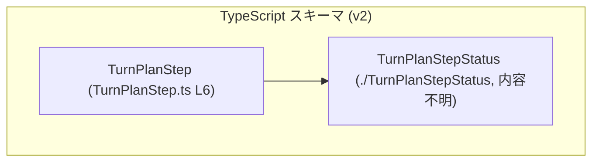
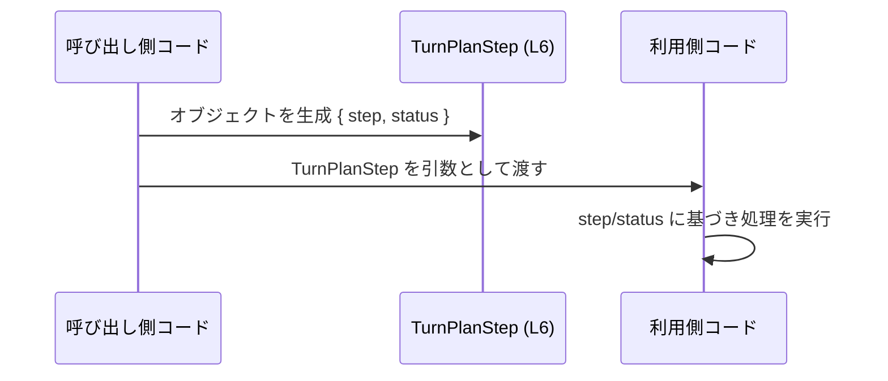

# app-server-protocol/schema/typescript/v2/TurnPlanStep.ts

## 0. ざっくり一言

`TurnPlanStep` という 1 ステップ分の情報（ステップ名とその状態）を表す TypeScript の型エイリアスを定義した、自動生成ファイルです（TurnPlanStep.ts:L1-6）。

---

## 1. このモジュールの役割

### 1.1 概要

- このモジュールは、ある「ターン計画（Turn Plan）」の中の 1 ステップを表現するためのデータ型 `TurnPlanStep` を提供します（TurnPlanStep.ts:L6-6）。
- ステップを識別する文字列 `step` と、その状態を表す `status: TurnPlanStepStatus` から構成されるシンプルな構造になっています（TurnPlanStep.ts:L4-6）。
- ファイルは Rust から `ts-rs` によって自動生成されており、手動での編集は前提にしていません（TurnPlanStep.ts:L1-3）。

### 1.2 アーキテクチャ内での位置づけ

- このファイル自体はスキーマ定義層（TypeScript 側の型定義）に属すると解釈できます（ファイルパス `app-server-protocol/schema/typescript/v2/` と自動生成コメントを根拠、TurnPlanStep.ts:L1-3）。  
  これは **推測を含む解釈** であり、コードだけからは厳密なレイヤ構造までは断定できません。
- `TurnPlanStepStatus` 型に依存しており、`status` フィールドとして利用しています（TurnPlanStep.ts:L4-6）。

依存関係の概略を Mermaid 図で表すと次のようになります。



この図は、「TurnPlanStep が TurnPlanStepStatus に依存している」という関係のみを示しています。

### 1.3 設計上のポイント

- **自動生成コード**  
  - 冒頭コメントで `ts-rs` による自動生成であることと、「手動で編集しない」方針が明示されています（TurnPlanStep.ts:L1-3）。
- **状態の型安全な表現**  
  - `status` は `string` ではなく `TurnPlanStepStatus` 型で表現されており、状態値を安全に制約する設計になっています（TurnPlanStep.ts:L4-6）。  
    `TurnPlanStepStatus` の中身はこのチャンクには現れません。
- **状態を持たない純粋なデータ型**  
  - 関数やクラスはなく、単なるデータ型（構造的な型エイリアス）のみが定義されています（TurnPlanStep.ts:L6-6）。
- **エラーハンドリングや並行性の責務は無し**  
  - このファイルにはロジックがないため、エラーハンドリングや並行処理に関する責務は持っていません。

---

## 2. 主要な機能一覧

このファイルは関数を提供せず、主に「データ型の定義」のみを行います。

- `TurnPlanStep` 型定義:  
  - 1 つのステップを `step`（文字列）と `status`（`TurnPlanStepStatus`）で表現するための構造的型エイリアス（TurnPlanStep.ts:L4-6）。

---

## 3. 公開 API と詳細解説

### 3.1 型一覧（構造体・列挙体など）

#### 型定義・依存コンポーネント一覧

| 名前 | 種別 | 役割 / 用途 | 定義 / 利用位置 |
|------|------|-------------|-----------------|
| `TurnPlanStep` | 型エイリアス（オブジェクト型） | 1 つのターン計画ステップを表現する。`step` と `status` をフィールドとして持つ。 | 定義: `TurnPlanStep.ts:L6-6` |
| `TurnPlanStepStatus` | 型（詳細不明） | ステップの状態を表す型。`TurnPlanStep` の `status` フィールドとして利用される。 | import: `TurnPlanStep.ts:L4-4` |

`TurnPlanStep` の構造は次のとおりです（TurnPlanStep.ts:L6-6）。

```typescript
export type TurnPlanStep = {
    step: string;                 // ステップを識別する文字列
    status: TurnPlanStepStatus;   // ステップの状態（詳細は別ファイル）
};
```

> 備考: ここでは読みやすさのために改行・コメントを追加していますが、元コードは 1 行で定義されています（TurnPlanStep.ts:L6-6）。

### 3.2 関数詳細（最大 7 件）

このファイルには関数定義（通常の関数、メソッド、アロー関数など）は一切存在しません（TurnPlanStep.ts:L1-6 に関数構文がないことを確認）。  
そのため、「関数詳細」セクションに説明すべき公開 API はありません。

### 3.3 その他の関数

同様に、補助的な関数やラッパー関数も存在しません（TurnPlanStep.ts:L1-6）。

---

## 4. データフロー

### 4.1 代表的な処理シナリオ（想定）

このファイルには利用コードが含まれていないため、**実際の呼び出し元は不明** です（TurnPlanStep.ts:L1-6）。  
以下は、「`TurnPlanStep` 型がどのように流通しうるか」の典型的なイメージを、抽象的に示したものです。

- 呼び出し側コードが `TurnPlanStep` オブジェクトを生成する。
- それを他のサービスやプロトコル処理コードに渡す（配列やメッセージの一部としてなど）。
- 受け取った側では `step` と `status` を参照して処理を分岐する。

この一般的な流れを sequence diagram で表すと次のようになります。



- この図はあくまで **構造的な役割** を示すものであり、具体的なメソッド名やプロトコル名は、このチャンクからは分かりません。

---

## 5. 使い方（How to Use）

### 5.1 基本的な使用方法

`TurnPlanStep` は単なる型エイリアスなので、普通のオブジェクトリテラルとして値を作成し、型注釈に使います。

```typescript
import type { TurnPlanStep } from "./TurnPlanStep";              // TurnPlanStep 型をインポートする
import type { TurnPlanStepStatus } from "./TurnPlanStepStatus";  // 状態型もインポートする

// どこかで TurnPlanStepStatus 型の値を用意する（内容はこのファイルからは不明）
declare function getInitialStatus(): TurnPlanStepStatus;         // 実装は別の場所にあると想定

// 1 つのステップを作成する
const step: TurnPlanStep = {                                     // 変数 step に TurnPlanStep 型を付ける
    step: "prepare-data",                                        // ステップ識別子（string）
    status: getInitialStatus(),                                  // 状態（TurnPlanStepStatus 型）
};

// 配列として複数ステップを管理する例
const plan: TurnPlanStep[] = [step];                             // TurnPlanStep の配列
```

- `TurnPlanStep` 型を付けることで、`step` や `status` のフィールド名・型を IDE やコンパイラがチェックできるようになります。

### 5.2 よくある使用パターン

1. **配列でターン計画全体を表現する**

```typescript
const steps: TurnPlanStep[] = [
    { step: "step-1", status: getInitialStatus() },
    { step: "step-2", status: getInitialStatus() },
];

// 例: 現在のステップだけをフィルタする
const activeSteps = steps.filter(s => {
    // s は TurnPlanStep 型として扱われる
    return shouldProcess(s.status);     // status に基づいて処理を決定（shouldProcess は別途定義）
});
```

1. **関数の引数・戻り値として使う**

```typescript
function nextStep(current: TurnPlanStep): TurnPlanStep {   // 引数・戻り値とも TurnPlanStep 型
    // 内部で step/status を参照し、次のステップを決める処理を想定（実装は任意）
    // このファイルにはロジックは無いが、型として安全に扱える
    return current;                                        // 例としてそのまま返す
}
```

### 5.3 よくある間違い（想定）

コードから直接は誤用例は分かりませんが、TypeScript の型の使い方として起こりやすい例を挙げます。

```typescript
// 間違い例: status を string として扱ってしまう
const badStep: TurnPlanStep = {
    step: "step-1",
    // @ts-expect-error: status は TurnPlanStepStatus 型であるべき
    status: "pending",            // 文字列リテラルを直接代入すると、TurnPlanStepStatus の定義と一致しない可能性がある
};

// 正しい例: TurnPlanStepStatus 型から値を取得して代入する
const goodStatus: TurnPlanStepStatus = getInitialStatus();
const goodStep: TurnPlanStep = {
    step: "step-1",
    status: goodStatus,
};
```

### 5.4 使用上の注意点（まとめ）

- **自動生成ファイルのため直接編集しない**  
  - コメントに「DO NOT MODIFY BY HAND!」「Do not edit this file manually.」と明示されており（TurnPlanStep.ts:L1-3）、直接編集すると生成元との不整合が生じる可能性があります。
- **ランタイムでの型保証はない**  
  - TypeScript の型はコンパイル時のみのチェックです。外部から受け取った JSON 等を `TurnPlanStep` として扱う場合は、ランタイムのバリデーションが別途必要です（このファイルにはその処理は存在しません）。
- **TurnPlanStepStatus の内容はこのチャンクには現れない**  
  - 有効な状態値の種類や意味は、`./TurnPlanStepStatus` 側を確認する必要があります（TurnPlanStep.ts:L4-4）。

---

## 6. 変更の仕方（How to Modify）

### 6.1 新しい機能を追加する場合

このファイルは自動生成されているため、**直接ここに新しいフィールドや型を追加するべきではありません**（TurnPlanStep.ts:L1-3）。

一般的には次のような手順になります（推奨フローの例であり、具体的な生成設定はこのチャンクには現れません）。

1. **生成元（Rust 側）の定義を変更する**  
   - コメントによれば `ts-rs` が生成元であるため（TurnPlanStep.ts:L3-3）、Rust コード上の対応する型（構造体など）を変更することが想定されます。
2. **`ts-rs` による再生成を行う**  
   - ビルドスクリプトや専用コマンド経由で TypeScript スキーマを再生成する。
3. **生成結果の `TurnPlanStep.ts` をコミット**  
   - 自動生成により `TurnPlanStep` の定義が更新される。

> どの Rust ファイルが生成元か、どのコマンドで生成しているかは、このチャンクには現れないため不明です。

### 6.2 既存の機能を変更する場合

- **フィールド名や型を変えたい場合**
  - 直接 `step` や `status` の型・名前を編集すると、自動生成プロセスの次回実行時に上書きされる可能性が高いです（TurnPlanStep.ts:L1-3）。
  - 変更したい場合は 6.1 と同じく、生成元（Rust 側）で定義を変更し、再生成する必要があります。
- **影響範囲の確認**
  - `TurnPlanStep` を引数・戻り値として使っている TypeScript コード全体に影響します。  
    具体的な使用箇所はこのチャンクには現れないため、プロジェクト全体検索などで確認する必要があります。

---

## 7. 関連ファイル

このチャンクから確実に分かる、密接に関連するファイル・ツールは次のとおりです。

| パス / ツール | 役割 / 関係 | 根拠 |
|---------------|------------|------|
| `./TurnPlanStepStatus` | `status` フィールドの型定義を提供するファイル。`TurnPlanStep` が import している。中身はこのチャンクには現れない。 | `import type { TurnPlanStepStatus } from "./TurnPlanStepStatus";`（TurnPlanStep.ts:L4-4） |
| `ts-rs` | Rust から TypeScript の型定義を生成するためのツール / クレート。このファイルの生成元としてコメントに記載されている。 | `This file was generated by [ts-rs](https://github.com/Aleph-Alpha/ts-rs).`（TurnPlanStep.ts:L3-3） |

この他にどのモジュールが `TurnPlanStep` を利用しているかは、このチャンクには現れないため不明です。
