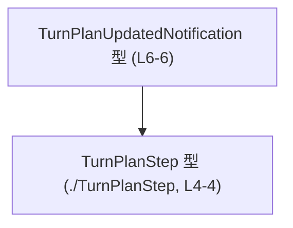
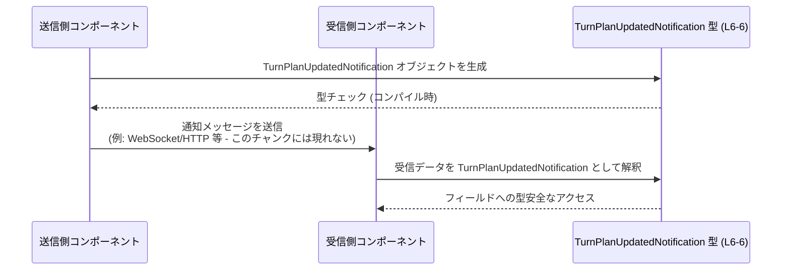

# app-server-protocol\schema\typescript\v2\TurnPlanUpdatedNotification.ts

## 0. ざっくり一言

`TurnPlanUpdatedNotification` という通知メッセージの **型定義だけ** を提供する、生成済みの TypeScript ファイルです。  
通知ペイロードのフィールド構造と型を静的に保証するためのものです（根拠: コメントとエクスポート定義 `TurnPlanUpdatedNotification.ts:L1-3, L6-6`）。

---

## 1. このモジュールの役割

### 1.1 概要

- このモジュールは、`TurnPlanUpdatedNotification` という名前の **オブジェクト型のエイリアス** を公開します（根拠: `export type ...` `TurnPlanUpdatedNotification.ts:L6-6`）。
- フィールドは `threadId`, `turnId`, `explanation`, `plan` の 4 つで、それぞれの型が明示されています（根拠: `TurnPlanUpdatedNotification.ts:L6-6`）。
- コードは `ts-rs` によって自動生成されており、「手で変更しない」ことが明示されています（根拠: コメント `TurnPlanUpdatedNotification.ts:L1-3`）。

### 1.2 アーキテクチャ内での位置づけ

このファイル内では、以下の依存関係だけが確認できます。

- 依存元: `TurnPlanUpdatedNotification` 型
- 依存先: `TurnPlanStep` 型（別ファイル `./TurnPlanStep` からの型インポート）



- `TurnPlanStep` の中身（フィールド構造など）は、このチャンクには現れません（根拠: インポートのみ `TurnPlanUpdatedNotification.ts:L4-4`）。

### 1.3 設計上のポイント

コードから読み取れる設計上の特徴は次のとおりです。

- **生成コード**  
  - 冒頭コメントで、`ts-rs` により生成されたファイルであり、手動編集禁止とされています（根拠: `TurnPlanUpdatedNotification.ts:L1-3`）。
- **純粋な型定義のみ**  
  - 関数・クラス・値の定義はなく、型エイリアス 1 つだけです（根拠: ファイル全体 `TurnPlanUpdatedNotification.ts:L1-6`）。
- **状態やロジックを持たない**  
  - 実行時の状態・振る舞いを持たない「データの形」を表現するだけのモジュールです。
- **ヌル許容な説明フィールド**  
  - `explanation` が `string | null` となっており、「説明がない」状態を区別できるようになっています（根拠: `TurnPlanUpdatedNotification.ts:L6-6`）。
- **ステップ配列としての `plan`**  
  - `plan` が `Array<TurnPlanStep>` となっており、複数のステップからなる計画を表すことが分かります（根拠: `TurnPlanUpdatedNotification.ts:L4-6`）。

---

## 2. 主要な機能一覧

このファイルが提供する「機能」は型定義 1 つに集約されています。

- `TurnPlanUpdatedNotification` 型: 「ターン計画の更新通知」のペイロード構造を表すオブジェクト型です（根拠: `TurnPlanUpdatedNotification.ts:L6-6`）。

---

## 3. 公開 API と詳細解説

### 3.1 型一覧（構造体・列挙体など）

#### 型インベントリ

| 名前                          | 種別       | 役割 / 用途                                                                 | フィールド概要                                                                                                                                          | 根拠 |
|-------------------------------|------------|------------------------------------------------------------------------------|--------------------------------------------------------------------------------------------------------------------------------------------------------|------|
| `TurnPlanUpdatedNotification` | 型エイリアス | 通知ペイロードのオブジェクト構造を規定する公開型                            | `threadId: string`, `turnId: string`, `explanation: string \| null`, `plan: Array<TurnPlanStep>`                                                       | `app-server-protocol\schema\typescript\v2\TurnPlanUpdatedNotification.ts:L6-6` |
| `TurnPlanStep`                | 型インポート | `plan` 配列の各要素の型。計画の 1 ステップを表すと推測されるが詳細は不明     | このチャンクには定義が現れず、`import type { TurnPlanStep } from "./TurnPlanStep";` として参照のみされています                                      | `app-server-protocol\schema\typescript\v2\TurnPlanUpdatedNotification.ts:L4-4` |

> `TurnPlanStep` の具体的な構造や役割は、このファイルには定義されていないため「不明」とします。

##### `TurnPlanUpdatedNotification` のフィールド詳細

`TurnPlanUpdatedNotification` は次のようなオブジェクト型です（根拠: `TurnPlanUpdatedNotification.ts:L6-6`）。

| フィールド名   | 型                         | 説明                                                        | 根拠 |
|----------------|----------------------------|-------------------------------------------------------------|------|
| `threadId`     | `string`                  | 対象スレッドを識別する ID 文字列                           | `app-server-protocol\schema\typescript\v2\TurnPlanUpdatedNotification.ts:L6-6` |
| `turnId`       | `string`                  | 対象ターンを識別する ID 文字列                             | 同上 |
| `explanation`  | `string \| null`          | 更新の説明テキスト。説明がない場合は `null` を許容         | 同上 |
| `plan`         | `Array<TurnPlanStep>`     | `TurnPlanStep` 要素の配列。更新後の計画の全ステップを保持  | 同上 |

説明文（「スレッド」「ターン」など）は名前からの解釈であり、コード上で明示されているのはあくまで **型とプロパティ名** だけです。

### 3.2 関数詳細（最大 7 件）

このファイルには関数・メソッドは定義されていません（根拠: 全行確認 `TurnPlanUpdatedNotification.ts:L1-6`）。  
したがって、関数詳細セクションに挙げる対象はありません。

### 3.3 その他の関数

同様に、補助関数やラッパー関数も存在しません。

| 関数名 | 役割（1 行） |
|--------|--------------|
| なし   | このファイルには関数が定義されていません |

---

## 4. データフロー

このファイル自体には処理ロジックがないため、**概念的な利用シナリオ** として、`TurnPlanUpdatedNotification` 型の値がどのように流れるかを示します。  
以下はあくまで「型の典型的な使われ方」のイメージであり、このチャンクに同名のコンポーネント実装は現れません。



要点:

- **コンパイル時の型チェック**  
  - TypeScript により、`threadId`, `turnId`, `explanation`, `plan` の各フィールドの型が保証されます。
- **ランタイムのバリデーションは別途必要**  
  - このファイルにはランタイム検証ロジックは存在しません。実際に外部から JSON を受け取る場合などは、別レイヤーでの検証が必要です（このチャンクにはそのコードは現れません）。

---

## 5. 使い方（How to Use）

### 5.1 基本的な使用方法

この型を利用して、通知オブジェクトを作成し、関数間で受け渡しする例です。

```typescript
// TurnPlanUpdatedNotification 型をインポートする
import type { TurnPlanUpdatedNotification } from "./TurnPlanUpdatedNotification";  // 同ディレクトリ想定

// TurnPlanStep 型も別ファイルからインポートする（定義はこのチャンクには現れない）
import type { TurnPlanStep } from "./TurnPlanStep";

// 例: TurnPlanUpdatedNotification 型の値を生成する
const step1: TurnPlanStep = {
    // TurnPlanStep の具体的なフィールドは不明なため、ここでは省略します
    // 例: id, description などがあるかもしれませんが、このチャンクからは分かりません
} as TurnPlanStep;  // 実際には as キャストではなく正しい構造を指定する必要があります

const notification: TurnPlanUpdatedNotification = {
    threadId: "thread-123",         // string 型
    turnId: "turn-5",               // string 型
    explanation: "Replanned steps", // string または null
    plan: [step1],                  // TurnPlanStep の配列
};

// 受け取る側の関数の例
function handleTurnPlanUpdated(
    payload: TurnPlanUpdatedNotification,
): void {
    // 型安全にフィールドへアクセスできる
    console.log(payload.threadId);
    console.log(payload.turnId);
    console.log(payload.explanation);  // string | null と推論される
    console.log(payload.plan.length);  // plan は TurnPlanStep[] として扱える
}
```

ここで示した `TurnPlanStep` の中身は、このチャンクでは定義されていないため、実際には別ファイルの定義に従う必要があります。

### 5.2 よくある使用パターン

1. **ハンドラー関数の引数として利用**

```typescript
import type { TurnPlanUpdatedNotification } from "./TurnPlanUpdatedNotification";

type TurnPlanUpdatedHandler = (
    notification: TurnPlanUpdatedNotification,
) => void;

const onTurnPlanUpdated: TurnPlanUpdatedHandler = (notification) => {
    // notification.plan をループして UI を更新するなど
    for (const step of notification.plan) {
        // step: TurnPlanStep 型
        // 具体的なプロパティアクセスは TurnPlanStep の定義に依存します
    }
};
```

1. **受信データのパース後にキャストして扱う**

> 注意: 以下のような `as` キャストは、ランタイム検証なしでは安全ではありません。実運用ではスキーマバリデーションなどと併用する必要があります。

```typescript
import type { TurnPlanUpdatedNotification } from "./TurnPlanUpdatedNotification";

function parseNotification(raw: unknown): TurnPlanUpdatedNotification {
    // 実際にはここで型ガードやスキーマバリデーションを行うべきです
    // このチャンクにはそのロジックは現れません
    return raw as TurnPlanUpdatedNotification;
}
```

### 5.3 よくある間違い

#### 1. `explanation` を `undefined` にしてしまう

```typescript
import type { TurnPlanUpdatedNotification } from "./TurnPlanUpdatedNotification";

const wrong: TurnPlanUpdatedNotification = {
    threadId: "thread-123",
    turnId: "turn-5",
    explanation: undefined,  // ❌ コンパイルエラー: string | null に undefined は含まれない
    plan: [],
};
```

正しくは `null` を使う必要があります。

```typescript
const correct: TurnPlanUpdatedNotification = {
    threadId: "thread-123",
    turnId: "turn-5",
    explanation: null,  // ✅ 明示的に「説明なし」を表現
    plan: [],
};
```

#### 2. `plan` に誤った型の要素を入れる

```typescript
const wrongPlan: TurnPlanUpdatedNotification = {
    threadId: "thread-123",
    turnId: "turn-5",
    explanation: "ok",
    plan: [
        { foo: "bar" },  // ❌ TurnPlanStep 型と一致しない構造ならコンパイルエラー
    ],
};
```

`plan` の要素は必ず `TurnPlanStep` 型でなければなりません（根拠: `Array<TurnPlanStep>` `TurnPlanUpdatedNotification.ts:L6-6`）。

### 5.4 使用上の注意点（まとめ）

- **手動編集禁止**  
  - 冒頭コメントにある通り、このファイルは生成コードであり、手で編集しない前提です（根拠: `TurnPlanUpdatedNotification.ts:L1-3`）。
- **ランタイムのデータ検証は別途必要**  
  - この型はコンパイル時の型チェックのみを提供し、外部からの入力が実際にこの構造に合っているかどうかの検証は行いません。
- **`explanation` の null 取り扱い**  
  - `undefined` ではなく `null` を用いて「説明なし」を表現する設計になっています。
- **並行性・スレッド安全性**  
  - 型定義のみであり、内部状態を持たないため、並行性やスレッド安全性に関する問題は、このファイル単体には存在しません。

---

## 6. 変更の仕方（How to Modify）

### 6.1 新しい機能を追加する場合

このファイルは次のコメントにある通り、手動編集は意図されていません（根拠: `TurnPlanUpdatedNotification.ts:L1-3`）。

```typescript
// GENERATED CODE! DO NOT MODIFY BY HAND!

// This file was generated by [ts-rs](https://github.com/Aleph-Alpha/ts-rs). Do not edit this file manually.
```

- 新しいフィールドの追加や型の変更が必要な場合は、
  - **元となるスキーマ（おそらく ts-rs が参照する定義）を変更し、再生成する** ことが前提になります。
- このチャンクには元スキーマの場所や形式に関する情報は現れませんので、
  - 実際にどこを変更すべきかは、リポジトリ全体の構成や ts-rs の設定ファイルを確認する必要があります（このチャンクでは不明）。

### 6.2 既存の機能を変更する場合

`TurnPlanUpdatedNotification` の仕様を変える際の注意点:

- **影響範囲の確認**
  - この型をインポートしている TypeScript ファイル全てに影響します。
  - 具体的な使用箇所はこのチャンクには現れないため、エディタの「型参照検索」などで確認する必要があります。
- **契約（前提条件）の維持**
  - `plan` が常に「更新後の完全な計画」を表すのか、「差分のみ」を表すのか等の仕様は、このファイルからは読み取れません。
  - 名前や他ドキュメントに基づく仕様があるはずなので、それを壊さないようにする必要があります（このチャンクでは仕様詳細は不明）。
- **再生成が前提**
  - 直接この .ts ファイルを変更すると、次回 ts-rs 生成時に上書きされる可能性が高いため、変更は元スキーマ側で行う必要があります。

---

## 7. 関連ファイル

このモジュールと密接に関係するファイルは、コードから次の 1 つが確認できます。

| パス                                                           | 役割 / 関係                                                                 |
|----------------------------------------------------------------|------------------------------------------------------------------------------|
| `app-server-protocol\schema\typescript\v2\TurnPlanStep.ts` (推定) | `import type { TurnPlanStep } from "./TurnPlanStep";` の参照先。`plan` 配列要素の型定義を提供するファイルと考えられます（実体はこのチャンクには現れません） |

> 上記パスは、このファイルのパスと `./TurnPlanStep` という相対インポートから機械的に導けるものであり、`TurnPlanStep` の中身や他の関連ファイル（テストコードなど）は、このチャンクには現れないため不明です。

---

### 付記: 安全性 / エラー / 並行性の観点

- **型安全性**  
  - TypeScript の静的型システムにより、`TurnPlanUpdatedNotification` の構造がコンパイル時にチェックされます。
  - `explanation` が `string | null`、`plan` が `TurnPlanStep[]` であることが保証されます（根拠: `TurnPlanUpdatedNotification.ts:L6-6`）。
- **エラー処理**  
  - このファイルには実行時エラー処理ロジックは含まれません。
  - 実際のエラー（不正な JSON など）は、別の層でハンドリングする必要があります。
- **並行性**  
  - 型定義のみで副作用が無いため、このファイル自体が並行実行によって問題を引き起こすことはありません。

このファイルを理解するうえでは、「**純粋な型定義であり、実行時の振る舞いは他モジュールに委ねられている**」という点が重要になります。
