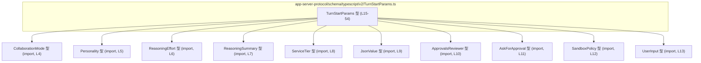
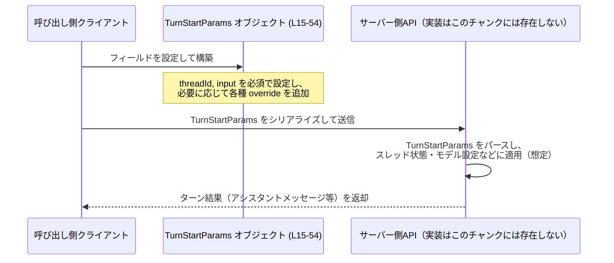

# app-server-protocol/schema/typescript/v2/TurnStartParams.ts

## 0. ざっくり一言

会話や処理の「ターン」を開始する際のパラメータを表す TypeScript の型エイリアス `TurnStartParams` を定義するファイルです（型名とコメントからの解釈を含みます、app-server-protocol/schema/typescript/v2/TurnStartParams.ts:L15-54）。

---

## 1. このモジュールの役割

### 1.1 概要

- このモジュールは、**あるスレッドにおける 1 回のターン開始時に渡されるパラメータ集合**を表現するための型 `TurnStartParams` を提供します（L15-54）。
- 必須情報（`threadId`, `input`）に加え、「このターンおよび以降のターン」に適用される各種オーバーライド設定（モデル、サンドボックスポリシー、パーソナリティ、JSON Schema ベースの出力制約など）をオプションフィールドとして持ちます（コメント L16-52）。

### 1.2 アーキテクチャ内での位置づけ

このファイル自体は型定義のみを含み、ロジックやネットワーク処理は含みません（L1-3, L15-54）。  
型依存関係は以下の通りです。



この図は、「`TurnStartParams` がどの外部型に依存しているか」を示しています。  
`TurnStartParams` を利用する上位モジュールや API エンドポイントについては、このチャンクには現れません（不明）。

### 1.3 設計上のポイント

コードとコメントから読み取れる設計上の特徴は次の通りです。

- **生成コードであること**  
  - 冒頭コメントにより、このファイルが `ts-rs` によって自動生成されていることが明示されています（L1-3）。
  - そのため、直接編集せず、生成元（Rust 側の構造体など）を変更する前提になっています。
- **純粋なデータ定義のみ**  
  - 関数・クラス・メソッドは存在せず、1 つの型エイリアス `TurnStartParams` のみをエクスポートしています（L15）。
- **オプションかつ `null` を許容するオーバーライド設定**  
  - 多くの設定フィールドが `?: ... | null` という形で「プロパティ自体が存在しない」「存在するが `null`」「有効な値が設定される」の 3 状態を取り得る設計になっています（例: `cwd`, L18）。
- **コメントによる意味付け**  
  - 各フィールドの上や横に、「このターンおよび以降のターンの設定を上書きする」といった説明コメントが付いており、用途が明示されています（L16-52）。
- **TypeScript の型安全性を利用**  
  - `UserInput[]`, `JsonValue`, `ServiceTier` 等の型を通じて、パラメータの構造がコンパイル時にチェックされるようになっています（L4-13, L15-54）。

---

## 2. 主要な機能一覧

このファイルは関数を持たず、1 つのデータ型に機能が集約されています。その型が提供する主な役割は次の通りです（すべて `TurnStartParams` 内のフィールドとして実現、L15-54）。

- スレッド識別: `threadId` によるスレッド ID の指定。
- ユーザー入力の提供: `input: Array<UserInput>` による、このターンで処理すべき入力列の指定。
- 作業ディレクトリ上書き: `cwd` による作業ディレクトリのオーバーライド（コメント L16-18）。
- 承認ポリシー上書き: `approvalPolicy`, `approvalsReviewer` による承認フロー設定のオーバーライド（コメント L19-25）。
- サンドボックス設定上書き: `sandboxPolicy` によるサンドボックスポリシーのオーバーライド（コメント L26-28）。
- モデル・サービスティア設定上書き: `model`, `serviceTier` によるモデルとサービスレベルのオーバーライド（コメント L29-34）。
- 推論設定上書き: `effort`, `summary` による推論の「労力」や要約に関する設定のオーバーライド（コメント L35-40）。
- パーソナリティ設定上書き: `personality` によるアシスタントのパーソナリティ設定のオーバーライド（コメント L41-43）。
- 出力の JSON Schema 制約: `outputSchema` によるアシスタント最終メッセージの構造制約（コメント L44-47）。
- コラボレーションモード設定: `collaborationMode` による事前定義されたコラボレーションモードの設定（コメント L48-53）。

---

## 3. 公開 API と詳細解説

### 3.1 コンポーネントインベントリー（型一覧）

このチャンクに現れる型コンポーネントの一覧です。

| 名前 | 種別 | 役割 / 用途 | 定義/使用位置 |
|------|------|-------------|----------------|
| `TurnStartParams` | 型エイリアス（オブジェクト型） | ターン開始時に渡す全パラメータのコンテナ | 定義: TurnStartParams.ts:L15-54 |
| `CollaborationMode` | 外部型（import） | コラボレーションモード設定の型 | import: L4, 使用: L54 |
| `Personality` | 外部型（import） | アシスタントのパーソナリティ表現の型 | import: L5, 使用: L43 |
| `ReasoningEffort` | 外部型（import） | 推論の「労力」指標の型 | import: L6, 使用: L37 |
| `ReasoningSummary` | 外部型（import） | 推論結果の要約表現の型 | import: L7, 使用: L40 |
| `ServiceTier` | 外部型（import） | サービスティア（利用レベル）を表す型 | import: L8, 使用: L34 |
| `JsonValue` | 外部型（import） | 任意の JSON 値を表す型 | import: L9, 使用: L47 |
| `ApprovalsReviewer` | 外部型（import） | 承認レビューの送り先を表す型 | import: L10, 使用: L25 |
| `AskForApproval` | 外部型（import） | 承認ポリシー設定の型 | import: L11, 使用: L21 |
| `SandboxPolicy` | 外部型（import） | サンドボックスの挙動を制御するポリシーの型 | import: L12, 使用: L28 |
| `UserInput` | 外部型（import） | ユーザーからの入力を表す型 | import: L13, 使用: L15 |

> 補足: これらの import 元ファイルの中身はこのチャンクには含まれないため、その詳細な構造や意味は不明です。

### 3.2 型詳細: `TurnStartParams`

#### 概要

`TurnStartParams` は、1 回のターン開始に必要な情報をまとめたオブジェクト型です（L15-54）。  
必須フィールドと多数のオプション設定フィールドで構成されます。

```typescript
// 定義（抜粋）
export type TurnStartParams = {
  threadId: string,                  // 必須
  input: Array<UserInput>,           // 必須
  cwd?: string | null,               // 任意 + null 許容
  approvalPolicy?: AskForApproval | null,
  approvalsReviewer?: ApprovalsReviewer | null,
  sandboxPolicy?: SandboxPolicy | null,
  model?: string | null,
  serviceTier?: ServiceTier | null | null,
  effort?: ReasoningEffort | null,
  summary?: ReasoningSummary | null,
  personality?: Personality | null,
  outputSchema?: JsonValue | null,
  collaborationMode?: CollaborationMode | null
};
```

（型本体は 1 行で書かれ、コメントが間に挟まる形式ですが、意味を分かりやすくするために整形しています。元定義は L15-54。）

#### フィールド一覧

| フィールド名 | 型 | 必須/任意 | 説明（コメント由来、または名前からの解釈） | 根拠 |
|--------------|----|----------|--------------------------------------------|------|
| `threadId` | `string` | 必須 | ターンが属するスレッドの ID を表す文字列と解釈できます | 定義: L15 |
| `input` | `Array<UserInput>` | 必須 | このターンで処理するユーザー入力の配列 | 定義: L15 |
| `cwd` | `string \| null` (プロパティ自体は任意) | 任意 | 「このターンおよび後続ターンの作業ディレクトリを上書きする」とコメントされています | コメント: L16-18 |
| `approvalPolicy` | `AskForApproval \| null` (任意) | 任意 | 「このターンおよび後続ターンの承認ポリシーを上書きする」 | コメント: L19-21 |
| `approvalsReviewer` | `ApprovalsReviewer \| null` (任意) | 任意 | 「このターンおよび後続ターンで承認リクエストが送られるレビュアーを上書きする」 | コメント: L22-25 |
| `sandboxPolicy` | `SandboxPolicy \| null` (任意) | 任意 | 「このターンおよび後続ターンのサンドボックスポリシーを上書きする」 | コメント: L26-28 |
| `model` | `string \| null` (任意) | 任意 | 「このターンおよび後続ターンのモデルを上書きする」 | コメント: L29-31 |
| `serviceTier` | `ServiceTier \| null \| null` (任意) | 任意 | 「このターンおよび後続ターンのサービスティアを上書きする」。`\| null \| null` は型的には `ServiceTier \| null` と等価です | コメント: L32-34, 型: L34 |
| `effort` | `ReasoningEffort \| null` (任意) | 任意 | 「このターンおよび後続ターンの推論努力（reasoning effort）を上書きする」 | コメント: L35-37 |
| `summary` | `ReasoningSummary \| null` (任意) | 任意 | 「このターンおよび後続ターンの推論サマリを上書きする」 | コメント: L38-40 |
| `personality` | `Personality \| null` (任意) | 任意 | 「このターンおよび後続ターンのパーソナリティを上書きする」 | コメント: L41-43 |
| `outputSchema` | `JsonValue \| null` (任意) | 任意 | 「このターンの最終アシスタントメッセージを制約するための任意の JSON Schema」 | コメント: L44-47 |
| `collaborationMode` | `CollaborationMode \| null` (任意) | 任意 | 「実験的: 事前定義されたコラボレーションモードを設定する。設定した場合、model, reasoning_effort, developer instructions より優先される」とコメントされています | コメント: L48-53, 型: L54 |

#### 内部処理の流れ（アルゴリズム）

- この型は純粋なデータ構造であり、関数やメソッドを持ちません（L15-54）。
- そのため「内部処理」やアルゴリズムは存在せず、**コンパイル時の型検査にのみ関与**します。
- 実際の処理（これをシリアライズして送信する、バリデーションする、設定として適用する等）は、別のモジュールに実装されているはずですが、このチャンクには現れません。

#### Examples（使用例）

この型を使ってパラメータオブジェクトを組み立てる例です。

```typescript
import type { TurnStartParams } from "./schema/typescript/v2/TurnStartParams";  // 定義の import

// 最小限の必須フィールドだけを設定した例
const minimalParams: TurnStartParams = {
  threadId: "thread-123",                  // スレッドを識別する ID
  input: [                                 // UserInput 型の配列
    {
      // 実際の構造は UserInput の定義に依存（このチャンクでは不明）
      kind: "text",
      text: "こんにちは"
    } as any                               // 型不明なため例では any キャスト
  ]
};

// いくつかの設定を上書きした例
const customizedParams: TurnStartParams = {
  threadId: "thread-123",
  input: [/* ...UserInput... */],
  cwd: "/workspace/project",               // 作業ディレクトリを指定
  model: "gpt-4.1",                        // モデル指定
  serviceTier: null,                       // 明示的に「ティア未指定」を表現（意味はサーバー側の実装次第）
  effort: { level: "high" } as any,        // ReasoningEffort 型（詳細不明のため any）
  outputSchema: {                          // JSON Schema で出力フォーマットを制約
    type: "object",
    properties: {
      answer: { type: "string" }
    },
    required: ["answer"]
  },
  collaborationMode: null                  // コラボレーションモードを明示的に無効化（意味は実装次第）
};
```

> `UserInput` や `ReasoningEffort` などの具体的な形は、このチャンクに定義が無いため `as any` を使用した例になっています。

#### Errors / Panics

- TypeScript の型エイリアスであり、**実行時のエラー処理や panic 相当の挙動は持ちません**。
- 型安全性に関するポイント:
  - コンパイル時には、必須フィールド（`threadId`, `input`）を省略すると型エラーになります（L15）。
  - フィールドに異なる型（例: `threadId` に number）を割り当てた場合もコンパイルエラーになります。
- 実行時には型情報は消えるため、この型だけでは JSON などの実行時バリデーションは行われません。

#### Edge cases（エッジケース）

型レベルで想定されるエッジケースは次のとおりです。

- **オプション + `null` の組み合わせ**  
  各オーバーライドフィールドは、少なくとも次の 3 状態を取り得ます（例: `cwd`、L18）。
  - プロパティが存在しない（`"cwd" in obj === false`）
  - プロパティが存在し `null` が入っている
  - プロパティが存在し、有効な値型（`string` 等）が入っている  
  この 3 状態の意味づけ（「未指定」と「明示的に無効化」の違いなど）は、このファイルからは分かりません。
- **`serviceTier?: ServiceTier \| null \| null`**（L34）  
  - 型的には `ServiceTier \| null` と同じですが、`null` が二重に書かれています。
  - 動作上の違いはありませんが、生成元のロジック上の重複があることを示唆しています（機能上の問題は生じません）。
- **`outputSchema` に非常に大きな JSON を渡すケース**  
  - 型としては制約がなく任意の JSON 構造を許容します（L44-47）。
  - 実行時にこの JSON Schema を処理する実装によっては、性能やメモリ消費に影響し得ますが、このファイルからは具体的な挙動は分かりません。

#### 使用上の注意点

- **生成コードであるため、直接編集しない**  
  - コメントに `GENERATED CODE! DO NOT MODIFY BY HAND!` とある通り（L1-3）、変更は生成元（Rust 側の構造体等）で行う必要があります。
- **`undefined` と `null` の違い**  
  - TypeScript 上では `cwd?: string | null` という表現は「プロパティが存在しない（`undefined`）」「存在するが `null`」「文字列」の 3 パターンを許容します（L18）。
  - API サーバー側が `undefined` と `null` を区別するかどうかはこのファイルからは分からないため、仕様に応じた値を選択する必要があります。
- **安全性 / セキュリティ**  
  - この型自体にロジックはなく、直接的なセキュリティリスクはありません。
  - 一般論として、`outputSchema` のように任意の JSON Schema を渡せる設計では、そのスキーマを評価する側で DoS などを避けるための入力制限・バリデーションが必要になりますが、その実装はこのチャンクには現れません。
- **並行性**  
  - 単なるデータオブジェクトであり、内部にミュータブルな状態やリソースハンドルを持ちません。
  - TypeScript / JavaScript における非同期処理やマルチスレッドワーカーとの共有は、保持する値（特に `JsonValue` 内部）のシリアライズ可能性に依存しますが、基本的にはコピー/シリアライズを前提とした安全な利用ができます。

### 3.3 その他の関数

- このファイルには関数・メソッド・クラス定義は存在しません（L1-54）。

---

## 4. データフロー

### 4.1 型レベルでのデータフロー

このファイルには処理ロジックは含まれないため、**あくまで想定される利用シナリオ**として、`TurnStartParams` がどのように使われるかを示します（この部分には推測が含まれます）。



この図は、`TurnStartParams` が「クライアント → サーバー」の間の**メッセージペイロード**として利用される可能性が高いことを、型名とコメントから示したものです（ただし、実際の送受信コードはこのチャンクにはありません）。

---

## 5. 使い方（How to Use）

### 5.1 基本的な使用方法

最小限の必須フィールドだけを使って `TurnStartParams` を構築する例です。

```typescript
import type { TurnStartParams } from "./schema/typescript/v2/TurnStartParams";  // L15 で export

// スレッド ID とユーザー入力だけを指定した基本例
const params: TurnStartParams = {
  threadId: "thread-001",          // スレッド ID（必須）
  input: [                         // UserInput 配列（必須）
    {
      // UserInput の実際の構造は import 先の定義に依存
      kind: "text",
      text: "こんにちは"
    } as any
  ]
};

// 例えば、この params を HTTP リクエストのボディとして送信するなどの用途が考えられます
```

### 5.2 よくある使用パターン

1. **ターンごとに一部設定だけを上書きする**

```typescript
// 前のターンから継続するスレッドで、モデルと作業ディレクトリだけ上書きする例
const turnParams: TurnStartParams = {
  threadId: "thread-001",
  input: [/* ...UserInput... */],
  model: "gpt-4.1-mini",
  cwd: "/tmp/session-001"
};
```

1. **JSON Schema で出力形式を固定する**

```typescript
// 最終メッセージを「answer: string, citations: string[]」形式にしたい場合の例
const schemaConstrainedParams: TurnStartParams = {
  threadId: "thread-002",
  input: [/* ...UserInput... */],
  outputSchema: {
    type: "object",
    properties: {
      answer: { type: "string" },
      citations: {
        type: "array",
        items: { type: "string" }
      }
    },
    required: ["answer"]
  }
};
```

1. **コラボレーションモードを利用する**

```typescript
// コラボレーションモードを指定する例（実際のモード値は CollaborationMode の定義次第）
const collabParams: TurnStartParams = {
  threadId: "thread-003",
  input: [/* ...UserInput... */],
  collaborationMode: {
    // CollaborationMode の構造はこのチャンクにはないため any
  } as any
};
```

### 5.3 よくある間違い

この型構造から想定される誤用と、その修正例です。

```typescript
import type { TurnStartParams } from "./schema/typescript/v2/TurnStartParams";

// 誤り例: 必須フィールドを省略している
const badParams1: TurnStartParams = {
  // threadId が無い → コンパイルエラー
  // input も無い → コンパイルエラー
};

// 正しい例: 必須フィールドを必ず指定する
const goodParams1: TurnStartParams = {
  threadId: "thread-001",
  input: []
};

// 誤り例: 型に合わない値を入れている
const badParams2: TurnStartParams = {
  threadId: 123,        // number なのでコンパイルエラー（L15）
  input: "hello" as any // 本来は Array<UserInput>
};

// 正しい例: 型に合う値を設定する
const goodParams2: TurnStartParams = {
  threadId: "123",
  input: []
};
```

### 5.4 使用上の注意点（まとめ）

- **必須フィールドを忘れないこと**  
  - `threadId` と `input` は必須であり、省略するとコンパイルエラーになります（L15）。
- **オプションフィールドと `null` の意味を区別すること**  
  - `cwd?: string | null` のように、プロパティの「省略」と「`null` の明示」は区別されます（L18）。
  - バックエンドがどちらをどう解釈するかは仕様次第であり、このファイルからは分かりません。
- **型定義は実行時バリデーションではないこと**  
  - TypeScript の型はコンパイル時のみ有効であり、JSON などの外部入力を受け取る処理では追加のバリデーションが必要です。
- **並行処理との関係**  
  - この型は純粋データで、副作用やリソースハンドルを含まないため、非同期関数や Web Worker 間などで安全にコピー／シリアライズして扱えます。

---

## 6. 変更の仕方（How to Modify）

### 6.1 新しい機能を追加する場合

- 冒頭コメントにある通り、このファイルは `ts-rs` による生成物であり、**直接編集しない前提**です（L1-3）。
- 新しいフィールドや機能を追加する場合は、次の手順になることが推測されます。
  1. 生成元となる Rust 側の構造体または型定義にフィールドを追加する（生成元の場所はこのチャンクには記載がなく不明です）。
  2. `ts-rs` のコード生成プロセスを再実行し、この TypeScript ファイルを再生成する。
- このファイルのみを手で変更すると、生成元との不整合が発生する可能性があります。

### 6.2 既存の機能を変更する場合

- **影響範囲の確認**  
  - `TurnStartParams` 型を使用しているすべての呼び出し元（API クライアント、フロントエンド等）に影響します。  
    具体的な使用箇所はこのチャンクには現れません。
- **契約（前提条件・返り値の意味など）**  
  - 必須フィールドの削除や型変更（例: `threadId: string` → `number`）は、呼び出し側とサーバー側の両方で契約変更となります。
  - オプションフィールドの `null` 許容性を変えると、`null` を送っていたコードがコンパイルエラーになる可能性があります。
- **テスト**  
  - このチャンクにはテストコードは含まれていません。
  - 実際には、`TurnStartParams` の構造に依存する API テストやシリアライズ/デシリアライズのテストが存在することが一般的ですが、具体的な場所や内容は不明です。

---

## 7. 関連ファイル

このモジュールと密接に関係する（import されている）ファイル一覧です。いずれもこのチャンクには中身が含まれていません。

| パス | 役割 / 関係 | 根拠 |
|------|------------|------|
| `../CollaborationMode` | `CollaborationMode` 型を提供し、`collaborationMode` フィールドの型として利用されます | import: L4, 使用: L54 |
| `../Personality` | `Personality` 型を提供し、`personality` フィールドの型として利用されます | import: L5, 使用: L43 |
| `../ReasoningEffort` | `ReasoningEffort` 型を提供し、`effort` フィールドの型として利用されます | import: L6, 使用: L37 |
| `../ReasoningSummary` | `ReasoningSummary` 型を提供し、`summary` フィールドの型として利用されます | import: L7, 使用: L40 |
| `../ServiceTier` | `ServiceTier` 型を提供し、`serviceTier` フィールドの型として利用されます | import: L8, 使用: L34 |
| `../serde_json/JsonValue` | 任意の JSON 値を表す `JsonValue` 型を提供し、`outputSchema` の型として利用されます | import: L9, 使用: L47 |
| `./ApprovalsReviewer` | `ApprovalsReviewer` 型を提供し、`approvalsReviewer` の型として利用されます | import: L10, 使用: L25 |
| `./AskForApproval` | `AskForApproval` 型を提供し、`approvalPolicy` の型として利用されます | import: L11, 使用: L21 |
| `./SandboxPolicy` | `SandboxPolicy` 型を提供し、`sandboxPolicy` の型として利用されます | import: L12, 使用: L28 |
| `./UserInput` | `UserInput` 型を提供し、`input: Array<UserInput>` の要素型として利用されます | import: L13, 使用: L15 |

これらの型の具体的な定義や挙動はこのチャンクには無いため、詳細はそれぞれのファイルを参照する必要があります。
