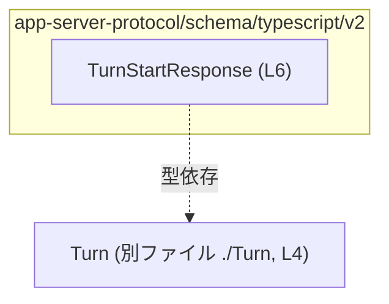
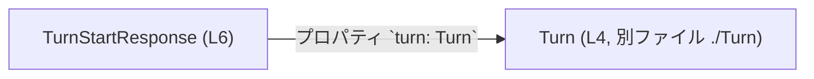

# app-server-protocol/schema/typescript/v2/TurnStartResponse.ts コード解説

## 0. ざっくり一言

`TurnStartResponse` という **1つの型エイリアス**を定義し、`Turn` 型をフィールドとして含むレスポンス形状（構造）を表現する TypeScript のスキーマファイルです（`TurnStartResponse.ts:L4-6`）。

---

## 1. このモジュールの役割

### 1.1 概要

- このモジュールは、`Turn` 型を含むオブジェクト型 `TurnStartResponse` を定義します（`TurnStartResponse.ts:L4-6`）。
- ファイル先頭のコメントとパスから、**ts-rs により自動生成された「アプリケーションサーバープロトコル用 TypeScript スキーマ」**の一部であることが分かります（`TurnStartResponse.ts:L1-3`）。
- 実行時ロジックや関数は一切含まず、**型情報のみ**を提供します。

> 用途について：  
> ファイルパスと型名から、「ターン開始時のレスポンス」を表すプロトコルメッセージであると解釈できますが、このファイル単体からは用途や通信相手は断定できません。

### 1.2 アーキテクチャ内での位置づけ

このファイルから読み取れる依存関係は次のとおりです。

- 本モジュール
  - `Turn` 型に依存（型としてのみ import）（`TurnStartResponse.ts:L4`）
- 外部からは
  - 本モジュールが `TurnStartResponse` 型を公開している（`TurnStartResponse.ts:L6`）

これを簡単な依存関係図として表します。



- 図は、「`TurnStartResponse` が `Turn` 型に依存している」という **型レベルの関係のみ** を表しています。
- `Turn` がどのようなフィールドを持つかは、このチャンクには現れません。

### 1.3 設計上のポイント

コードから読み取れる設計上の特徴は次のとおりです。

- **自動生成コード**であることを明示  
  - ファイル先頭コメントで「GENERATED CODE! DO NOT MODIFY BY HAND!」「ts-rs による生成」と明言されています（`TurnStartResponse.ts:L1-3`）。
  - 人手による直接編集は想定されていません。
- **型専用の import** を使用  
  - `import type { Turn } from "./Turn";` により、`Turn` はコンパイル時だけ参照され、生成される JavaScript には出力されません（`TurnStartResponse.ts:L4`）。
- **状態・ロジックを持たない**  
  - 関数やクラス、変数定義はなく、純粋に型エイリアスのみを提供します（`TurnStartResponse.ts:L6`）。
- **エラーハンドリングや並行性制御は一切ない**  
  - 実行時コードが存在しないため、ランタイムのエラー/並行性はこのファイルの責務外です。

---

## 2. 主要な機能一覧（コンポーネントインベントリー）

このチャンクに現れるコンポーネント（型・import）の一覧です。

| 名前                | 種別        | 公開/非公開 | 定義行 | 役割 / 説明 | 根拠 |
|---------------------|-------------|------------|--------|-------------|------|
| `TurnStartResponse` | 型エイリアス（オブジェクト型） | 公開 (`export`) | L6 | `turn: Turn` という 1フィールドのみを持つレスポンス形状を表現する型 | `TurnStartResponse.ts:L6` |
| `Turn`              | 型（外部定義） | 他ファイルから import | L4 | `TurnStartResponse` 内の `turn` プロパティの型。詳細はこのチャンクには現れない | `TurnStartResponse.ts:L4` |

> 関数・クラス・列挙体などは、このチャンクには定義されていません。

---

## 3. 公開 API と詳細解説

### 3.1 型一覧（構造体・列挙体など）

#### `TurnStartResponse`

| 項目         | 内容 |
|--------------|------|
| 種別         | TypeScript 型エイリアス（オブジェクト型） |
| 定義         | `export type TurnStartResponse = { turn: Turn, };` |
| フィールド   | `turn: Turn` |
| 公開範囲     | モジュール外に公開（`export`） |
| 根拠         | `TurnStartResponse.ts:L6` |

**役割 / 用途（コードから読み取れる範囲）**

- `Turn` 型を `turn` プロパティとして一つ持つ **オブジェクトの構造** を表します（`TurnStartResponse.ts:L6`）。
- 型名やファイルパスから、アプリケーションサーバープロトコルにおける「ターン開始時のレスポンス」の型と解釈できますが、このファイル単体からでは用途は断定できません。

**TypeScript 言語的な説明**

- `type` による **型エイリアス** です。`TurnStartResponse` という名前で `{ turn: Turn }` というオブジェクト型を再利用しやすくしています（`TurnStartResponse.ts:L6`）。
- フィールド `turn` の型 `Turn` は `import type` によって別モジュールから参照されています（`TurnStartResponse.ts:L4`）。

### 3.2 関数詳細（最大 7 件）

- このファイルには **関数定義が存在しません**（`TurnStartResponse.ts:L1-6` には `function`/`=>` による関数定義がないため）。
- したがって、詳細テンプレートを適用すべき対象関数もありません。

### 3.3 その他の関数

- 補助関数やラッパー関数も、このチャンクには現れません。

---

## 4. データフロー

このファイルには実行時処理や関数呼び出しはありませんが、**型間のデータ構造レベルの関係**は把握できます。

### 4.1 型レベルのデータフロー

`TurnStartResponse` のデータ構造は「`TurnStartResponse` オブジェクトが `turn` プロパティを介して `Turn` データを含む」という形になります（`TurnStartResponse.ts:L4-6`）。



- この図は、「`TurnStartResponse` 型の値が内部に `Turn` 型の値を 1つ保持している」という **静的な型構造** を表します。
- `Turn` の中身（フィールド構成や意味）はこのチャンクには定義されていません。

### 4.2 実行時フローについて

- 関数やメソッドが存在しないため、「どのコンポーネントがいつ `TurnStartResponse` を生成・利用するか」といった **実行時のシーケンス図**は、このチャンクからは作成できません。
- そのため、ここではあくまで「型がどうネストしているか」というレベルの説明に留めています。

---

## 5. 使い方（How to Use）

### 5.1 基本的な使用方法

`TurnStartResponse` は、TypeScript コード中でオブジェクトの型注釈として利用されることが想定されます（型エイリアスであることからの一般的な使い方であり、このファイル単体から用途は断定できません）。

```typescript
// Turn 型を同じディレクトリから import する（このファイルと同様の構成）
import type { Turn } from "./Turn";                           // TurnStartResponse.ts:L4 と同じ import パターン

// TurnStartResponse 型をこのモジュールから import する例
import type { TurnStartResponse } from "./TurnStartResponse"; // 本ファイルの公開型 (L6) を利用

// TurnStartResponse 型の値を扱う関数の例
function handleTurnStart(response: TurnStartResponse) {       // 引数に型注釈として使用
    // response.turn は Turn 型として扱える
    const turn: Turn = response.turn;                         // Turn 型への代入（型安全）
    // ここで turn を使った処理を行う（詳細は Turn 型の定義に依存）
}
```

- この例では、`TurnStartResponse` を受け取る関数を定義し、その中で `response.turn` を `Turn` として扱っています。
- 実際の処理内容は `Turn` 型の定義に依存するため、このチャンクからは詳細を述べられません。

### 5.2 よくある使用パターン

1. **API レスポンスの型注釈としての利用（一般的なパターン、用途は推測）**

   ```typescript
   import type { TurnStartResponse } from "./TurnStartResponse";

   async function fetchTurnStart(): Promise<TurnStartResponse> {
       const res = await fetch("/api/turn/start");
       const json = await res.json();

       // ここでは json が TurnStartResponse の形であることを前提として扱う
       const data = json as TurnStartResponse; // ランタイム検証は別途必要
       return data;
   }
   ```

   - これは **一般的な TypeScript + HTTP API** の利用パターンの例です。
   - 実際に `/api/turn/start` のようなエンドポイントが存在するか、このファイルからは分かりません。このコード断片は、型の典型的な使い方のイメージ例です。

2. **関数の戻り値として利用**

   ```typescript
   import type { TurnStartResponse } from "./TurnStartResponse";

   function createTurnStartResponse(turn: Turn): TurnStartResponse {
       return { turn }; // フィールド名と変数名が同一のため省略記法で代入
   }
   ```

   - `Turn` 型の値から `TurnStartResponse` を組み立てる基本的な例です。
   - `TurnStartResponse` の構造が `{ turn: Turn }` だけであるため、生成ロジックは単純です（`TurnStartResponse.ts:L6`）。

### 5.3 よくある間違い（起こりうる誤用の例）

このファイル自体にロジックはありませんが、型の使い方として起こりそうな誤用例と正しい例を示します。

```typescript
import type { TurnStartResponse } from "./TurnStartResponse";

// 誤り例: 必須プロパティ `turn` が欠けている
const badResponse: TurnStartResponse = {
    // turn がないためコンパイルエラーになる
    // Property 'turn' is missing in type '{}' ...
};

// 正しい例: 必須プロパティ `turn` を含める
declare const someTurn: Turn; // どこかで定義・取得した Turn 型の値

const goodResponse: TurnStartResponse = {
    turn: someTurn, // 必須プロパティを提供しているので OK
};
```

- `TurnStartResponse` は `turn` プロパティを必須とするため、これを欠くオブジェクトを代入するとコンパイルエラーになります（`TurnStartResponse.ts:L6` に必須フィールドとして記述されていることが根拠）。
- `Turn` 自体の内容や生成方法は、このチャンクには現れません。

### 5.4 使用上の注意点（まとめ）

- **自動生成ファイルであること**
  - ファイル先頭に「GENERATED CODE」「Do not edit manually」と明示されているため（`TurnStartResponse.ts:L1-3`）、このファイルを直接変更するのではなく、元となる Rust 側の定義や ts-rs 設定を変更する必要があります。
- **ランタイム検証は別途必要**
  - TypeScript の型はコンパイル時のみ有効であり、実行時に実際のオブジェクトが `TurnStartResponse` の形かどうかは自動では検証されません。
  - 外部からの JSON を `TurnStartResponse` として扱う場合は、ランタイムのバリデーションを別途用意する必要があります。
- **セキュリティ / バグ観点**
  - この型だけでは直接的なバグやセキュリティホールは発生しませんが、「信頼できない入力を型注釈だけで安全とみなす」ことは危険です。
  - 型と実データの乖離は、認証・権限チェックの漏れなどにつながる可能性があるため、**型 ≠ 検証**という前提を意識することが重要です。
- **並行性**
  - 型定義のみであり、スレッド安全性や非同期処理に関する要素はこのファイルの責務外です。

---

## 6. 変更の仕方（How to Modify）

### 6.1 新しい機能を追加する場合

このファイルは ts-rs による **自動生成コード** であるため（`TurnStartResponse.ts:L1-3`）、直接編集は推奨されません。

新しいフィールドや型を追加したい場合の一般的な流れ（コードから読み取れる範囲と ts-rs の一般的運用に基づく説明）:

1. **Rust 側の対応する構造体・型定義を変更する**  
   - ts-rs は Rust の型定義から TypeScript の型を生成するツールである旨がコメントに記載されています（`TurnStartResponse.ts:L3`）。
   - 新しいフィールドを追加したい場合は、Rust 側の `TurnStartResponse` 相当の構造体（実際の名前はこのチャンクには現れません）にフィールドを追加します。
2. **ts-rs のコード生成を再実行する**  
   - これにより、`TurnStartResponse.ts` が再生成され、新しいフィールドを含む型エイリアスになります。
3. **TypeScript 側の利用コードを更新する**  
   - 追加されたフィールドをコンパイル時に利用できるようになります。

> このファイル単体からは、どの Rust ファイルが元になっているかは分かりません。

### 6.2 既存の機能を変更する場合

`TurnStartResponse` の構造を変更したい（例: フィールド名を変える、フィールドを追加/削除する）場合の注意点:

- **影響範囲**
  - `TurnStartResponse` を型注釈として利用している全ての TypeScript コードに影響します。
  - 例えば `response.turn` にアクセスしているコードは、フィールド名を変えるとコンパイルエラーになります。
- **契約（前提条件）**
  - 現状の契約は「`TurnStartResponse` 型の値は `turn: Turn` を必ず持つ」というものです（`TurnStartResponse.ts:L6`）。
  - この契約を変更すると、クライアント/サーバ間プロトコルの整合性にも影響する可能性があります（用途は推測レベルですが、ファイルパスからそのように解釈できます）。
- **テストと利用箇所の確認**
  - このチャンクにはテストコードは含まれていません（`TurnStartResponse.ts:L1-6` にテストらしき記述はなし）。
  - 変更後は、型を利用しているすべてのコンパイルエラーを解消するとともに、プロトコルのエンドツーエンドテストなどがあれば更新する必要があります。

---

## 7. 関連ファイル

このチャンクから明確に読み取れる関連ファイルは次のとおりです。

| パス（相対） | 役割 / 関係 | 根拠 |
|-------------|------------|------|
| `./Turn`    | `Turn` 型の定義を提供するモジュール。`TurnStartResponse` の `turn` プロパティの型として参照されている | `TurnStartResponse.ts:L4` |

> `./Turn` がどのような構造・責務を持つかは、このチャンクには現れません。  
> また、`TurnStartResponse` を import して利用しているファイルはこのチャンクには現れないため不明です。

---

### まとめ

- このファイルは **ts-rs によって自動生成された、型専用の TypeScript モジュール**であり、`TurnStartResponse` という 1つの公開型エイリアスを提供します（`TurnStartResponse.ts:L1-6`）。
- 実行時ロジックやエラーハンドリング・並行性は含まれず、**静的な型安全性**を高めるためのスキーマ定義に特化しています。
- 変更や拡張は、直接編集ではなく、元となる Rust 定義と ts-rs の生成プロセス側で行う必要があります。
