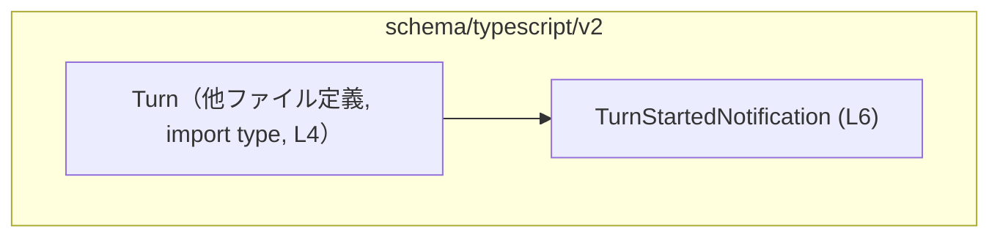
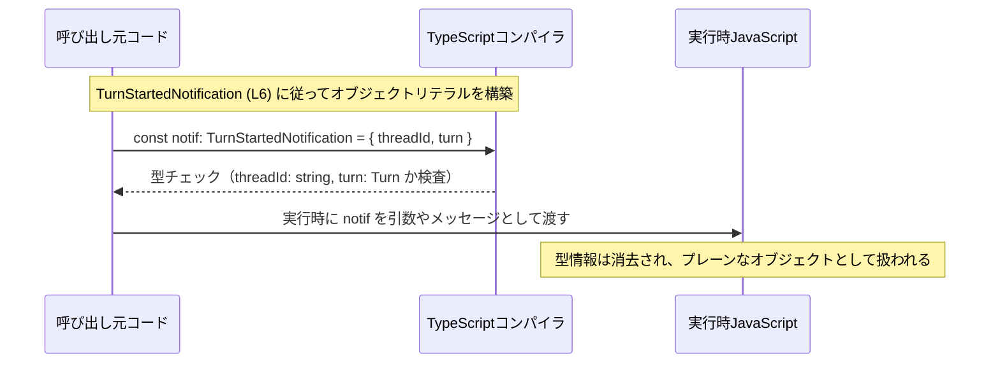

# app-server-protocol/schema/typescript/v2/TurnStartedNotification.ts

## 0. ざっくり一言

- 「ターン開始通知」を表現する TypeScript の型 `TurnStartedNotification` を定義する、自動生成ファイルです (app-server-protocol/schema/typescript/v2/TurnStartedNotification.ts:L1-3, L6-6)。

---

## 1. このモジュールの役割

### 1.1 概要

- このモジュールは、`TurnStartedNotification` という通知メッセージの型を TypeScript 上で表現するために存在します (L6-6)。
- 通知はスレッドを識別する `threadId: string` と、ターン内容を表す `turn: Turn` から構成されます (L6-6)。
- ファイルは `ts-rs` によって自動生成されており、Rust 側の型定義と TypeScript 側の型定義を同期させる目的があると読み取れます (L1-3)。

### 1.2 アーキテクチャ内での位置づけ

- このモジュールは `./Turn` から `Turn` 型を型としてのみインポートし (L4-4)、それを利用して `TurnStartedNotification` を定義しています (L6-6)。
- 実行時コードは含まず、ビルド時の型チェック専用のモジュールです（`import type` により、インポートはコンパイル後に消去されます (L4-4)）。



- 上図は、このチャンク内で確認できる依存関係のみを示しています。`Turn` の中身や、この型を利用する上位モジュールは、このチャンクには現れません。

### 1.3 設計上のポイント

- **自動生成コード**  
  - ファイル先頭コメントにより、`ts-rs` による自動生成であり手動編集禁止であることが明示されています (L1-3)。
- **型専用インポート**  
  - `import type { Turn } from "./Turn";` により、`Turn` は型としてのみ利用され、バンドルされた JavaScript には含まれません (L4-4)。
- **純粋な型定義のみ**  
  - 関数・クラス・実行時処理は一切定義されておらず、`export type` による型エイリアスだけが公開 API です (L6-6)。
- **構造的型（オブジェクトリテラル型）**  
  - `TurnStartedNotification` は `threadId` と `turn` を持つオブジェクト型として定義されており、インターフェースではなく type エイリアスを用いています (L6-6)。

---

## 2. 主要な機能一覧

このファイルが提供する機能は、型レベルに限定されます。

- `TurnStartedNotification` 型定義: 「ターン開始通知」のデータ構造を TypeScript 上で表現する。
- `Turn` 型への依存の明示: 通知に含まれるターン内容が `Turn` 型であることを保証する（型レベル）。

---

## 3. 公開 API と詳細解説

### 3.1 型一覧（構造体・列挙体など）

| 名前 | 種別 | 役割 / 用途 | 定義位置 | 主なフィールド |
|------|------|-------------|-----------|----------------|
| `TurnStartedNotification` | 型エイリアス（オブジェクト型） | 「ターン開始通知」メッセージを表す型。`threadId` と `turn` を必須プロパティとして要求する。 | app-server-protocol/schema/typescript/v2/TurnStartedNotification.ts:L6-6 | `threadId: string`, `turn: Turn` |
| `Turn` | 型（外部定義） | ターン内容を表現する型。通知の `turn` プロパティに利用される。定義は別ファイル `./Turn` に存在する。 | インポートのみ: app-server-protocol/schema/typescript/v2/TurnStartedNotification.ts:L4-4 | フィールド構成はこのチャンクには現れない |

#### `TurnStartedNotification` のフィールド詳細（型契約）

- `threadId: string`  
  - 通知対象のスレッドを識別する文字列 ID です (L6-6)。  
  - この型定義からは、空文字列や特定フォーマットの可否などの制約は読み取れません。
- `turn: Turn`  
  - 一つのターン（会話の１単位など）を表す `Turn` 型です (L6-6)。  
  - `Turn` の具体的な構造は `./Turn` 側の定義に依存し、このチャンクには現れません。

### 3.2 関数詳細

- このファイルには関数・メソッド・クラスコンストラクタなどの実行時ロジックは定義されていません (L1-6)。

### 3.3 その他の関数

- 該当なし（ヘルパー関数やラッパー関数を含め、関数定義は存在しません (L1-6)）。

---

## 4. データフロー

このファイルには実行時コードはありませんが、`TurnStartedNotification` 型がどのように利用されるかを、TypeScript の一般的な挙動に基づき、抽象的なデータフローとして示します。

### 4.1 型レベルのデータフロー（シーケンス）



- `TurnStartedNotification` 型はコンパイル時にのみ存在し、実行時 JavaScript には登場しません（型は消去されるため）。
- そのため、**型安全性はコンパイル時のみ保証され、外部入力（例: ネットワーク経由の JSON）に対しては別途ランタイムバリデーションが必要**になります。このファイル自体はそのバリデーションを提供しません (L1-6)。

---

## 5. 使い方（How to Use）

### 5.1 基本的な使用方法

`TurnStartedNotification` 型を用いて通知オブジェクトを作り、関数の引数として利用する簡単な例です。`Turn` の中身はこのチャンクからは不明なため、抽象的なプレースホルダで表します。

```typescript
// Turn 型と TurnStartedNotification 型を型としてインポートする          // 実行時には消える type インポート
import type { Turn } from "./Turn";                                          // Turn は別ファイルで定義されている (L4)
import type { TurnStartedNotification } from "./TurnStartedNotification";    // このファイルで定義された型 (L6)

// どこかで構築された Turn 値があると仮定する                             // Turn の具体的構造はこのチャンクには現れない
const turn: Turn = /* Turn を構築する処理 */ null as unknown as Turn;

// TurnStartedNotification オブジェクトを構築する                          // 両フィールドが必須
const notif: TurnStartedNotification = {
    threadId: "thread-123",                                                  // string 型として扱われる
    turn,                                                                    // Turn 型として扱われる
};

// 例: 通知を処理する関数の引数として利用する                               // 利用側は TurnStartedNotification 型を前提に処理できる
function handleTurnStarted(notification: TurnStartedNotification) {          // notification.turn などに型補完が効く
    console.log(notification.threadId);                                      // string メソッドが安全に利用可能
    // console.log(notification.turn...);                                    // Turn のフィールドに IDE 補完でアクセス可能
}

handleTurnStarted(notif);                                                    // 型が合致するためコンパイル時に安全
```

この例では、型アノテーションにより次の点が保証されます。

- `notif` には `threadId` と `turn` の両方が必須であること。
- `threadId` は文字列、`turn` は `Turn` 型であること。

### 5.2 よくある使用パターン

1. **通知オブジェクトの受け渡し用 DTO として利用**

```typescript
// DTO（Data Transfer Object）として関数間のデータ受け渡しに使用する
function sendNotificationToClient(notification: TurnStartedNotification) {   // DTO として利用
    // 実際の送信処理（WebSocket／HTTP 等）はこのチャンクには現れない
    const payload = JSON.stringify(notification);                            // シリアライズ時、型は関与せずプレーンなオブジェクトとして扱われる
    // transport.send(payload);
}
```

1. **外部入力のパース後に型アサーション／バリデーションと組み合わせて利用**

```typescript
// 受信した JSON を TurnStartedNotification 相当として扱う場合の例
function parseNotification(json: string): unknown {
    return JSON.parse(json);                                                 // 戻り値型は unknown として扱うのが安全
}

// ランタイムバリデーション（擬似コード）
function isTurnStartedNotification(value: unknown): value is TurnStartedNotification {
    // ここで threadId が string, turn が適切な Turn かを検査する必要がある
    // このファイルにはその実装は含まれない
    return true as boolean;
}
```

※ バリデーションロジックはこのチャンクには含まれないため、上記は概念的な例です。

### 5.3 よくある間違い

```typescript
import type { TurnStartedNotification } from "./TurnStartedNotification";

// 間違い例: 必須フィールド turn を渡していない
const notifBad1: TurnStartedNotification = {
    threadId: "thread-123",         // OK
    // turn: ...                     // 必須だが抜けているためコンパイルエラー
};

// 間違い例: threadId を number として扱おうとしている
const notifBad2: TurnStartedNotification = {
    threadId: 123,                  // エラー: number を string に代入できない
    turn: null as any,              // ここも Turn 型でない場合はエラーになる
};
```

- TypeScript の型システムにより、これらの誤用はコンパイル時に検出されます。
- ただし、外部からの JSON を直接 `as TurnStartedNotification` として型アサーションしてしまうと、ランタイム不整合を見逃す可能性があるため注意が必要です（このファイルは実行時の検査を提供しません）。

### 5.4 使用上の注意点（まとめ）

- **自動生成ファイルであること**  
  - 先頭コメントの通り、手動での編集は想定されていません (L1-3)。仕様変更は生成元（Rust 側など）で行う必要があります。
- **型安全性の範囲**  
  - `TurnStartedNotification` はコンパイル時の型安全性を提供しますが、実行時には型が存在しません。外部入力に対しては必ずランタイムバリデーションを組み合わせる必要があります。
- **エラー条件**  
  - このファイル自体はエラーや例外を発生させるコードを含みません (L1-6)。誤った利用は TypeScript のコンパイルエラーとして現れます。
- **並行性**  
  - この型は状態や副作用を持たない単純なオブジェクト構造であり、並行性固有の仕組みは含みません。複数の非同期処理から同じオブジェクトを共有する場合の安全性は、利用側のコード設計に依存します。
- **セキュリティ**  
  - ネットワークから受信したデータをこの型として扱う場合、信頼できない入力に対する検証・サニタイズは別途実装する必要があります。このファイルはその機能を提供しません。

---

## 6. 変更の仕方（How to Modify）

### 6.1 新しい機能（フィールド）を追加する場合

- ファイル先頭コメントから、このファイルを直接編集するのではなく、**生成元** を変更すべきであることが分かります (L1-3)。
- 一般的な `ts-rs` の利用形態では、Rust 側の構造体や型定義にフィールドを追加し、コード生成を再実行することで TypeScript 側の型が更新されます。
- このチャンクには生成元の情報やスクリプトは含まれていないため、
  - 元定義（Rust 側など）
  - コード生成コマンド
  は不明であり、リポジトリ全体の構成を別途確認する必要があります。

### 6.2 既存の機能（フィールド）を変更する場合

- `threadId` の型を変更したい、`turn` をオプショナルにしたい、などの変更も、生成元の型定義を変更し、再生成するのが前提です (L1-3, L6-6)。
- 変更時の注意点（契約・互換性）:
  - `threadId` や `turn` の存在・型に依存する既存コードがある可能性が高いため、変更は破壊的変更となる場合があります。
  - 変更後は、`TurnStartedNotification` を参照する全ての呼び出し元（関数引数、変数定義など）でコンパイルエラーがないか確認する必要があります。
- テスト:
  - このチャンクにはテストコードは現れません (L1-6)。変更後の動作保証には、別途用意されているテスト（もしあれば）や、新たなテストケースの追加が必要になりますが、その位置はこのチャンクからは分かりません。

---

## 7. 関連ファイル

このモジュールと直接関係するファイルは、インポートおよび自動生成コメントから次のように推定できます。

| パス | 役割 / 関係 |
|------|------------|
| `app-server-protocol/schema/typescript/v2/Turn.ts` | `import type { Turn } from "./Turn";` でインポートされる `Turn` 型の定義ファイルと推定されます (L4-4)。ターン内容の構造を提供し、`TurnStartedNotification.turn` プロパティの型として利用されます。 |
| Rust 側の元定義ファイル（パス不明） | コメントにある `ts-rs` により本ファイルが生成されているため、Rust 側に対応する型定義（おそらく構造体や列挙体）が存在すると考えられますが、具体的なパスや名称はこのチャンクには現れません (L1-3)。 |

---

### まとめ（コンポーネントインベントリーと安全性の観点）

- **コンポーネントインベントリー**
  - 公開型: `TurnStartedNotification`（オブジェクト型, L6-6）
  - 依存型: `Turn`（別ファイル定義, L4-4）
  - 実行時コンポーネント: なし（型定義のみ, L1-6）
- **言語固有の安全性**
  - TypeScript の静的型チェックにより、`threadId` と `turn` の存在と型がコンパイル時に検査されます。
- **エラー / セキュリティ / 並行性**
  - このファイル自体はエラーや例外を発生させず、セキュリティ検証や並行性制御も行いません。
  - 外部データを扱う際は、別途ランタイムバリデーションおよびエラーハンドリングを実装する必要があります。
