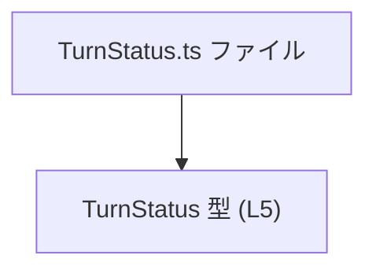
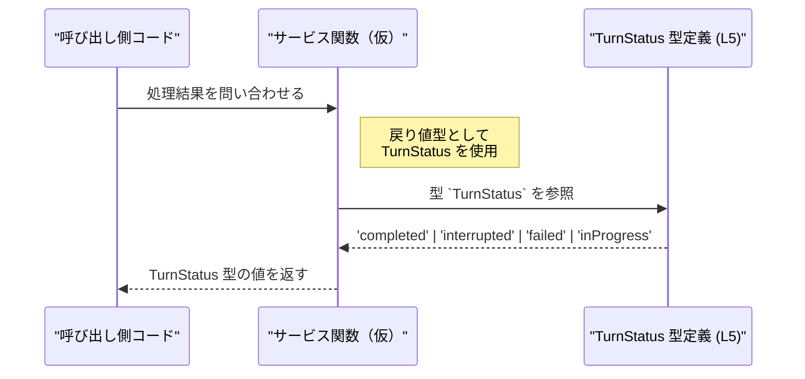

# app-server-protocol/schema/typescript/v2/TurnStatus.ts

## 0. ざっくり一言

- `TurnStatus` は、`"completed" | "interrupted" | "failed" | "inProgress"` の 4 種類だけを許可する、処理状態を表す文字列リテラルのユニオン型を公開するファイルです（TurnStatus.ts:L5）。

---

## 1. このモジュールの役割

### 1.1 概要

- このモジュールは、「ターン（処理単位）の状態」を 4 つの文字列で表現するための型エイリアス `TurnStatus` を提供します（TurnStatus.ts:L5）。
- これにより、アプリケーションの他の部分で、状態を表す文字列がこの 4 種類に限定され、TypeScript の型チェックにより誤った文字列の使用を防止できます。

### 1.2 アーキテクチャ内での位置づけ

- ファイル先頭のコメントから、このファイルは `ts-rs` によって自動生成されており（TurnStatus.ts:L1-3）、他の言語（おそらく Rust）の型定義を TypeScript 側に反映したスキーマの一部であると解釈できますが、元の定義の詳細はこのチャンクには現れません。
- このファイル自体は他モジュールをインポートしておらず、純粋に `TurnStatus` 型をエクスポートするだけの「下位依存のない型定義モジュール」です（TurnStatus.ts:L5）。

依存関係（このファイル内で分かる範囲）を簡略図で示します。



- 上記の通り、このチャンク内には他モジュールとの依存関係は現れません。

### 1.3 設計上のポイント

- 自動生成コード  
  - 冒頭コメントに「GENERATED CODE」「Do not edit this file manually」とあり（TurnStatus.ts:L1-3）、手動編集せず生成元で変更する設計になっています。
- 文字列リテラルのユニオン型
  - `TurnStatus` は 4 つの特定文字列のみを許容するユニオン型として定義されています（TurnStatus.ts:L5）。
- 型レベルの安全性・エラー
  - TypeScript の静的型チェックにより、`TurnStatus` に対して誤った文字列（例: `"complete"` や `"COMPLETED"`）を代入した場合はコンパイルエラーになります。
  - 実行時のバリデーションはこのファイルには含まれないため、外部入力に対しては別途チェックが必要です（このチャンクには実装は現れません）。
- 状態・並行性
  - このモジュールは型定義のみであり、状態や並行処理は持っていません。そのため、スレッドセーフティやロックなどの懸念はこのファイル単体では発生しません。

---

## 2. 主要な機能一覧

- `TurnStatus` 型の定義とエクスポート: 4 種類の状態文字列 `"completed" | "interrupted" | "failed" | "inProgress"` だけを許可する型エイリアス（TurnStatus.ts:L5）。

---

## 3. 公開 API と詳細解説

### 3.1 型一覧（構造体・列挙体など）

このチャンクに現れる公開型のインベントリーです。

| 名前         | 種別                                   | 役割 / 用途                                                                 | ソース位置                |
|--------------|----------------------------------------|------------------------------------------------------------------------------|---------------------------|
| `TurnStatus` | 型エイリアス（文字列リテラルのユニオン） | ターンや処理の状態を 4 種類の文字列に限定して表現するための型               | TurnStatus.ts:L5-5        |

#### `TurnStatus`

**概要**

- `TurnStatus` は次のいずれかの文字列だけを許可します（TurnStatus.ts:L5）。

  - `"completed"`
  - `"interrupted"`
  - `"failed"`
  - `"inProgress"`

- これにより、状態名を自由な `string` ではなく、限定された値のみに強制できます。

**言語固有の安全性**

- **型安全性**:  
  - 代入・引数・戻り値などで `TurnStatus` を使うと、上記 4 つ以外の文字列を使用した場合 TypeScript のコンパイル時にエラーになります。
- **型推論**:
  - `const status: TurnStatus = "completed";` のように代入した場合、`status` は `TurnStatus` 型として振る舞い、`switch` 文などで各分岐が網羅チェックの対象になります。
- **ランタイム挙動**:
  - このファイルは型定義のみであり、JavaScript にコンパイルしたときに追加のランタイムコードは生成されません。したがって、パフォーマンスへの影響はありません。

**エッジケース / 契約（Contract）**

- 大文字・小文字の違い:
  - `"Completed"` や `"COMPLETED"` は `TurnStatus` としては不正です。厳密に `"completed"` と一致する必要があります。
- 値の追加・削除:
  - 生成元の定義に新しい状態を追加すると、この型にも新しい文字列が追加される可能性がありますが、その変更はこのチャンクには現れていません。
- 文字列以外:
  - 数値や `null`, `undefined` は `TurnStatus` としては不正です。コンパイル時に検出されます。

**セキュリティ・バグの観点**

- このファイル単体では、実行時の処理や I/O を一切行わないため、直接的なセキュリティ脆弱性やバグの原因にはなりにくいです。
- ただし、外部から受け取った任意の文字列を `as TurnStatus` などで型アサーションしてしまうと、実際には許可されていない文字列を「型的には正しい」と見なしてしまう可能性があります。これは TypeScript 一般の問題であり、このファイルは実行時検証を提供しません。

### 3.2 関数詳細（最大 7 件）

- 本ファイルには関数・メソッドは定義されていません（TurnStatus.ts:L1-5）。
- したがって、このセクションで詳細解説すべき関数はありません。

### 3.3 その他の関数

- 補助関数やラッパー関数も、このチャンクには一切現れません。

| 関数名 | 役割（1 行） |
|--------|--------------|
| （なし） | このファイルには関数は定義されていません |

---

## 4. データフロー

このファイル自体は型定義のみであり、具体的な処理フローや呼び出し関係は定義されていません（TurnStatus.ts:L5）。  
以下は、「`TurnStatus` を返すサービス関数が存在すると仮定した場合」の典型的なデータフロー例です。あくまで利用イメージであり、このリポジトリ内にそのような関数が存在するかどうかは、このチャンクからは分かりません。



このように、`TurnStatus` は「関数やオブジェクトの戻り値やプロパティ型として使用される」ことが想定され、その値の取りうる範囲を型レベルで制限する役割を果たします。

---

## 5. 使い方（How to Use）

### 5.1 基本的な使用方法

`TurnStatus` をインポートして、状態を表す変数や関数の戻り値に利用する基本例です。インポートパスは実際のプロジェクト構成に合わせて調整する必要があります（このチャンクにはインポート例は現れません）。

```typescript
// TurnStatus 型をインポートする（パスは一例です）
import type { TurnStatus } from "./TurnStatus";

// TurnStatus を返す関数の例
function getTurnStatus(): TurnStatus {               // 戻り値の型を TurnStatus に限定
    return "completed";                              // 4 つのうちの 1 つを返す
}

// 変数に代入して使う例
const status: TurnStatus = getTurnStatus();          // status は TurnStatus 型

// 状態に応じて分岐する例
switch (status) {
    case "completed":
        console.log("処理が完了しました");
        break;
    case "interrupted":
        console.log("処理が中断されました");
        break;
    case "failed":
        console.log("処理が失敗しました");
        break;
    case "inProgress":
        console.log("処理中です");
        break;
    // ここに default を書かない場合、将来 TurnStatus が増えたときに
    // TypeScript が網羅性チェックで警告してくれます
}
```

- このように `switch` 文と組み合わせることで、将来 `TurnStatus` に状態が追加された場合のコンパイル時検出にも役立ちます。

### 5.2 よくある使用パターン

1. **プロパティの型として使う**

```typescript
import type { TurnStatus } from "./TurnStatus";

interface Turn {                                     // 1 つのターンを表すインターフェースの例
    id: string;                                     // ID
    status: TurnStatus;                             // 状態: 4 種類に限定
}

const turn: Turn = {
    id: "turn-001",
    status: "inProgress",                           // OK: TurnStatus に含まれる値
};
```

1. **非同期処理の結果として使う**

```typescript
import type { TurnStatus } from "./TurnStatus";

// 非同期に状態を取得する関数例
async function fetchTurnStatus(id: string): Promise<TurnStatus> {
    // 実際には HTTP リクエストなどを行う想定の例
    // このチャンクには実装は現れません
    return "failed";                                // 4 種類のうち 1 つを返す
}
```

### 5.3 よくある間違い

`TurnStatus` の文字列は厳密一致であり、大文字・小文字やスペルの揺れは許容されません。

```typescript
import type { TurnStatus } from "./TurnStatus";

// ❌ 間違い例: 綴りが異なる
const badStatus1: TurnStatus = "complete";          // コンパイルエラー

// ❌ 間違い例: 大文字・小文字が異なる
const badStatus2: TurnStatus = "Completed";         // コンパイルエラー

// ✅ 正しい例
const goodStatus: TurnStatus = "completed";         // OK
```

また、外部入力をそのまま `TurnStatus` として扱うのも危険です。

```typescript
declare const rawStatusFromServer: string;

// ❌ よくない例: 型アサーションで無理やり TurnStatus にする
const unsafeStatus = rawStatusFromServer as TurnStatus; // 実行時には不正な文字列の可能性がある

// ✅ 望ましい例: 値をチェックしてから TurnStatus として扱う
function toTurnStatus(value: string): TurnStatus | null {
    if (value === "completed" ||
        value === "interrupted" ||
        value === "failed" ||
        value === "inProgress") {
        return value;                               // ここでは value は TurnStatus として扱える
    }
    return null;                                    // 不正な値は弾く
}
```

### 5.4 使用上の注意点（まとめ）

- **前提条件**
  - `TurnStatus` に代入する文字列は、`"completed" | "interrupted" | "failed" | "inProgress"` のいずれかである必要があります（TurnStatus.ts:L5）。
- **禁止事項**
  - ファイル先頭コメントにある通り、`TurnStatus.ts` を直接編集することは想定されていません（TurnStatus.ts:L1-3）。生成元を変更して再生成する必要があります。
  - 外部入力を検証せずに `as TurnStatus` などで型アサーションすることは避けたほうが安全です。
- **エラー・パニック条件**
  - 型定義のみのため、ランタイムエラーや例外はこのファイル自体からは発生しません。
  - 誤った文字列を代入するとコンパイルエラーになります（TypeScript の型チェック）。
- **パフォーマンス上の注意**
  - 文字列リテラルのユニオン型はコンパイル時に利用されるだけで、ランタイムオーバーヘッドはありません。

---

## 6. 変更の仕方（How to Modify）

### 6.1 新しい機能を追加する場合

- コメントに「GENERATED CODE」「ts-rs によって生成」とあるため（TurnStatus.ts:L1-3）、新しい状態を追加したい場合は、このファイルを直接編集するのではなく、**生成元の定義**（おそらく Rust 側の型）を変更してから、`ts-rs` による再生成を行う必要があります。
- このチャンクには生成手順やコマンドは現れないため、具体的な再生成方法はリポジトリのビルド手順や `ts-rs` のドキュメントを参照する必要があります（不明）。

変更のステップ例（高レベルな流れのみ）:

1. `TurnStatus` に対応する元の型定義（Rust など）を特定する（このチャンクには場所は現れません）。
2. そこに新しい状態値（例: `"pending"` など）を追加する。
3. プロジェクトのビルドまたはスキーマ生成プロセスを実行し、`TurnStatus.ts` を再生成する。
4. 生成された `TurnStatus` に新しい文字列が含まれていることを確認する（TurnStatus.ts:L5 が変化しているはずです）。

### 6.2 既存の機能を変更する場合

- **既存状態の名称変更**:
  - 例えば `"inProgress"` を `"running"` に変えたい場合も、同様に生成元を変更し、再生成する必要があります。
  - 名称を変更すると、その状態を使用している TypeScript コードすべてがコンパイルエラーになるため、影響範囲は IDE の参照検索などで確認する必要があります。
- **状態の削除**
  - `"failed"` を削除すると、それを前提にしたエラーハンドリングコードが壊れます。削除前に利用箇所を洗い出すことが重要です。
- **契約の確認**
  - `TurnStatus` を公開 API の一部として利用している場合、状態の追加・削除・名称変更はその API の契約変更に該当します。外部クライアントへの影響があるかどうかを確認する必要があります。
- このファイルにはテストや使用箇所へのリンクは現れないため、影響範囲の特定はプロジェクト全体を検索して行う必要があります（このチャンクからは不明）。

---

## 7. 関連ファイル

このチャンクには、直接のインポートやコメントによる他ファイルへの参照は存在しません（TurnStatus.ts:L1-5）。  
したがって、確実に関連していると断定できるファイルは、このファイル単体からは特定できません。

| パス | 役割 / 関係 |
|------|------------|
| （不明） | このチャンクには関連ファイルに関する情報は現れません |

一般的には、同じディレクトリ `schema/typescript/v2/` に他のスキーマ定義ファイルが存在することが多い構成ですが、それが実際にどうなっているかは、このチャンクからは判断できません。
