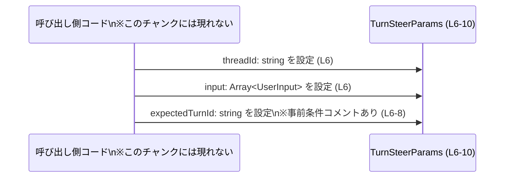

# app-server-protocol/schema/typescript/v2/TurnSteerParams.ts コード解説

## 0. ざっくり一言

`TurnSteerParams` は、スレッド ID・ユーザー入力の配列・期待されるターン ID を 1 つのオブジェクトとしてまとめる TypeScript の型エイリアスです（`TurnSteerParams.ts:L6-10`）。コメントから、この型はある種の「リクエスト」のパラメータを表すために使われることが分かります（`TurnSteerParams.ts:L6-8`）。

---

## 1. このモジュールの役割

### 1.1 概要

- このモジュールは、アプリケーションサーバープロトコルの TypeScript 用スキーマ（`app-server-protocol/schema/typescript/v2`）の一部として、自動生成されたパラメータ型 `TurnSteerParams` を定義します（`TurnSteerParams.ts:L1-3, L6-10`）。
- `TurnSteerParams` は以下 3 つのプロパティを持つオブジェクト型です（`TurnSteerParams.ts:L6-10`）。
  - `threadId: string`
  - `input: Array<UserInput>`
  - `expectedTurnId: string`（コメント付きのフィールド）
- コメントによると、`expectedTurnId` は「現在アクティブなターン ID と一致していること」が事前条件であり、一致しない場合にはリクエストが失敗する、という仕様が示されています（`TurnSteerParams.ts:L6-8`）。

### 1.2 アーキテクチャ内での位置づけ

依存関係レベルで見ると、このファイルは次のような位置づけになっています。

```mermaid
graph LR
    TsRs["ts-rs コードジェネレータ\n(コメント: TurnSteerParams.ts L3)"]
    Source["元スキーマ（Rust 等、詳細不明）\n※このチャンクには現れない"]
    UserInputMod["\"./UserInput\" モジュール\n(UserInput 型, TurnSteerParams.ts L4)"]
    TurnSteerParamsMod["TurnSteerParams.ts\n(TurnSteerParams 型, L6-10)"]

    Source --> TsRs
    TsRs --> TurnSteerParamsMod
    UserInputMod --> TurnSteerParamsMod
```

- ファイル先頭のコメントから、このファイルは [`ts-rs`](https://github.com/Aleph-Alpha/ts-rs) によって自動生成されていることが分かります（`TurnSteerParams.ts:L1-3`）。
- `TurnSteerParams.ts` は型定義のみを持ち、`./UserInput` から `UserInput` 型を **型専用 import** として依存しています（`TurnSteerParams.ts:L4`）。
- `TurnSteerParams` 型を実際にどのモジュールが利用しているかは、このチャンクには現れません。

### 1.3 設計上のポイント

- **自動生成コード**  
  - `// GENERATED CODE! DO NOT MODIFY BY HAND!` というコメントにより、このファイルを手作業で編集しない前提であることが明示されています（`TurnSteerParams.ts:L1-3`）。
- **純粋なデータ型定義**  
  - 関数やクラスは一切定義されておらず、`export type` によるオブジェクト型エイリアスのみが存在します（`TurnSteerParams.ts:L6-10`）。
- **型専用 import**  
  - `import type { UserInput } from "./UserInput";` として `type` 修飾子付きの import を使用しており、`UserInput` はコンパイル時の型チェック専用であることを示しています（`TurnSteerParams.ts:L4`）。
- **事前条件のコメントによる定義**  
  - `expectedTurnId` に対して「アクティブなターン ID であること」という事前条件と、「一致しないとリクエストが失敗する」という挙動がコメントで説明されていますが（`TurnSteerParams.ts:L6-8`）、このファイル内では **実行時チェックは実装されていません**。
- **状態・並行性**  
  - このモジュールは不変のデータ型定義のみを扱い、状態管理や非同期処理・並行処理に関するロジックは含まれません。

---

## 2. 主要な機能一覧

このファイルは型定義のみを提供し、「機能」はデータ構造レベルでの役割になります。

- `TurnSteerParams` 型:  
  スレッド ID (`threadId`)、ユーザー入力配列 (`input: Array<UserInput>`)、期待されるターン ID (`expectedTurnId`) をまとめたパラメータオブジェクトの構造を定義します（`TurnSteerParams.ts:L6-10`）。
- `UserInput` 型への依存:  
  `input` プロパティの要素型として `UserInput` 型を利用します（`TurnSteerParams.ts:L4, L6`）。`UserInput` の中身はこのチャンクには現れません。

---

## 3. 公開 API と詳細解説

### 3.1 型一覧（構造体・列挙体など）

**コンポーネントインベントリー**

| 名前 | 種別 | 役割 / 用途 | 定義 / 参照箇所 |
|------|------|-------------|-----------------|
| `TurnSteerParams` | オブジェクト型エイリアス (`type`) | 1 つの操作（リクエスト）に必要な、`threadId`, `input`, `expectedTurnId` をまとめて表すパラメータ型。`expectedTurnId` には「アクティブなターン ID であること」という事前条件がコメントで付与されている。 | `TurnSteerParams.ts:L6-10` |
| `UserInput` | 型（外部モジュールからの import） | `TurnSteerParams.input` の配列要素型として利用される。具体的な構造や制約は `./UserInput` 側に定義されており、このチャンクには現れない。 | `TurnSteerParams.ts:L4, L6` |

#### `TurnSteerParams` のフィールド構造

- `threadId: string`（`TurnSteerParams.ts:L6`）
  - 文字列として表現されるスレッド ID。
  - フォーマットや制約（UUID かどうか等）は、このファイルからは分かりません。
- `input: Array<UserInput>`（`TurnSteerParams.ts:L6`）
  - `UserInput` 型の配列。ユーザーからの入力（対話、コマンド等）を表している可能性がありますが、`UserInput` の定義がこのチャンクには現れないため、詳細は不明です。
- `expectedTurnId: string`（`TurnSteerParams.ts:L6-10`）
  - コメント付きの文字列フィールド。
  - コメントより、
    - 「アクティブなターン ID の事前条件」（Required active turn id precondition）
    - 「現在アクティブなターンと一致しない場合、リクエストは失敗する」
    という仕様が読み取れます（`TurnSteerParams.ts:L7-8`）。
  - ただし、この条件を実際に検証するコードはこのファイルには存在しません。

**Contracts（契約）とエッジケース（型レベル）**

- 契約（コメントから読み取れるもの）
  - `expectedTurnId` は「現在アクティブなターン ID」でなければならない（`TurnSteerParams.ts:L7-8`）。
  - そうでない場合、リクエストが「失敗する（fails）」と記載されていますが、失敗の具体的な形（HTTP ステータス、エラーコードなど）はこのチャンクには現れません。
- 型レベルでの保証
  - 3 つのフィールドはいずれも **必須** であり、`TurnSteerParams` 型としてオブジェクトを扱う場合は、TypeScript の型チェックにより「フィールドの欠落」や「型の不一致」はコンパイル時に検出されます。
  - 文字列の中身や `UserInput` 配列の内容については、型だけでは検証されません。

### 3.2 関数詳細

このファイルには関数・メソッド・クラスなどの振る舞いを持つ定義は含まれていません。  
そのため、詳細テンプレートで解説すべき公開関数は **存在しません**。

### 3.3 その他の関数

- 該当なし（このファイルは型定義のみを含みます）。

---

## 4. データフロー

このファイルには実行時ロジックが存在しないため、「データがどのように処理されるか」というフローは分かりません。  
ここでは、`TurnSteerParams` オブジェクトがどのようなデータを束ねるかという **構造上のデータフロー** を示します。

```mermaid
flowchart LR
    threadId["threadId: string\n(TurnSteerParams.ts L6)"]
    input["input: Array<UserInput>\n(TurnSteerParams.ts L6)"]
    expectedTurnId["expectedTurnId: string\n(TurnSteerParams.ts L6-10, コメントL7-8)"]

    subgraph P["TurnSteerParams (L6-10)"]
        threadId --> P
        input --> P
        expectedTurnId --> P
    end
```

- 3 つのフィールド（`threadId`, `input`, `expectedTurnId`）が 1 つのオブジェクト型 `TurnSteerParams` としてまとめられる、という関係のみがこのファイルから読み取れます。
- `TurnSteerParams` を受け取る関数や API エンドポイントは、このチャンクには現れません。

加えて、「オブジェクト生成」という観点のシーケンス図を示します（呼び出し側コードはこのチャンクには現れません）。



- この図は、「呼び出し側コードが `TurnSteerParams` 型のオブジェクトを構築する」という一般的な利用イメージを表しますが、実際の呼び出し元やメソッド名などはこのチャンクには現れません。

---

## 5. 使い方（How to Use）

### 5.1 基本的な使用方法

この型は TypeScript のコンパイル時型として利用されます。  
以下は、`TurnSteerParams` 型の値を生成する最小限の例です。

```typescript
// TurnSteerParams 型および UserInput 型をインポートする
import type { TurnSteerParams } from "./TurnSteerParams";    // このファイル自身
import type { UserInput } from "./UserInput";                // TurnSteerParams.ts L4

// UserInput 型の値の例
const userInputs: Array<UserInput> = [
    // 実際のフィールド構造は ./UserInput 側に定義されており、このチャンクには現れません
];

// TurnSteerParams 型のオブジェクトを構築する
const params: TurnSteerParams = {
    threadId: "thread-123",       // string 型 (L6)
    input: userInputs,            // Array<UserInput> 型 (L6)
    expectedTurnId: "turn-001",   // string 型、事前条件コメントあり (L6-8)
};

// params をどの関数や API に渡すかは、このチャンクには現れません。
```

**型安全性のポイント**

- フィールド名の typo や、フィールドの欠落があるとコンパイルエラーになります。
- `input` に `UserInput` 以外の型の要素を含めると、コンパイル時に検出されます。
- `expectedTurnId` の中身が正しいかどうか（アクティブなターン ID と一致しているか）は、**この型だけでは保証されず、実行時ロジック側の責務**になります。

### 5.2 よくある使用パターン（一般的な例）

このファイル単独から実際の使用箇所は分かりませんが、同種のパラメータ型は一般に次のように使われます（あくまで一般論です）。

1. **関数の引数型として使う**

```typescript
// これは一般的な利用イメージの例であり、実際に存在する関数名かどうかはこのチャンクには現れません。
function handleTurn(params: TurnSteerParams) {
    // params.threadId, params.input, params.expectedTurnId を利用する処理
}
```

1. **API クライアントのリクエスト body 型として使う**

```typescript
// fetch や他の HTTP クライアントに渡すリクエストボディの型として利用する一般的なイメージの例
async function sendTurn(params: TurnSteerParams) {
    await fetch("/turn", {
        method: "POST",
        headers: { "Content-Type": "application/json" },
        body: JSON.stringify(params),
    });
}
```

> 上記コードは「TypeScript 型としてどのように利用しうるか」の例であり、  
> 実際にこのプロジェクトに `/turn` エンドポイントがあるか等は、このチャンクには現れません。

### 5.3 よくある間違い（起こりうる誤用例）

型レベルとコメントから推測される、起こりやすい誤用例とその回避方法を挙げます。

```typescript
import type { TurnSteerParams } from "./TurnSteerParams";

// 誤り例: 必須フィールド expectedTurnId を指定しない
const badParams1: TurnSteerParams = {
    threadId: "thread-123",
    input: [],              // expectedTurnId がないためコンパイルエラー
    // Error: Property 'expectedTurnId' is missing ...
};

// 正しい例: 3 つの必須フィールドをすべて指定する
const okParams: TurnSteerParams = {
    threadId: "thread-123",
    input: [],
    expectedTurnId: "turn-001",
};

// 誤り例: expectedTurnId に「現在アクティブでないターン ID」を渡す
const badParams2: TurnSteerParams = {
    threadId: "thread-123",
    input: [],
    expectedTurnId: "old-turn-id",   // 型的には OK だが、コメント上の事前条件に違反する可能性
};
```

- `badParams1` のような「フィールドの欠落」は TypeScript コンパイラが検出します。
- `badParams2` のような「文字列内容が事前条件に反している」ケースは、この型だけでは検出できず、実行時の検証ロジックに依存します（コメント: `TurnSteerParams.ts:L7-8`）。

### 5.4 使用上の注意点（まとめ）

- **自動生成コードの変更禁止**
  - コメントに従い、このファイルを直接編集することは想定されていません（`TurnSteerParams.ts:L1-3`）。
- **expectedTurnId の事前条件**
  - コメント上、`expectedTurnId` は「現在アクティブなターン ID」と一致している必要があります（`TurnSteerParams.ts:L7-8`）。
  - これは型では表現されておらず、呼び出し側で正しい値を設定し、サーバー側（等）で検証する必要があります。
- **UserInput の内容**
  - `input` 配列の要素 `UserInput` の構造や制約は `./UserInput` に依存しており、このファイルからは分かりません（`TurnSteerParams.ts:L4`）。
  - `UserInput` の仕様を確認せずに値を構築すると、実行時にバリデーションエラーなどが発生する可能性があります。
- **セキュリティ面（一般論）**
  - `TurnSteerParams` の各フィールド値は、外部からの入力（ユーザー入力、ネットワーク経由など）になることが多いため、サーバー側で内容の妥当性チェックを行う必要があります。
  - このファイルでは入力値のサニタイズや検証は行われません。

---

## 6. 変更の仕方（How to Modify）

### 6.1 新しい機能を追加する場合（フィールド追加など）

このファイルは ts-rs によって生成されるため、**直接編集すると再生成時に上書きされる**可能性があります（`TurnSteerParams.ts:L1-3`）。

一般的な手順（このプロジェクト固有の詳細はこのチャンクには現れません）:

1. **生成元スキーマを変更する**
   - ts-rs の入力となる Rust 側の型定義（または他のスキーマ定義）に新しいフィールドや変更を加えます。
   - この生成元ファイルのパスや構造は、このチャンクには現れません。
2. **コード生成を再実行する**
   - プロジェクトで定義されているビルド／コード生成コマンド（例: `cargo` + ts-rs のビルドスクリプトなど）を実行して TypeScript スキーマを再生成します。
3. **型変更の影響範囲を確認する**
   - `TurnSteerParams` を利用している TypeScript コード全体でコンパイルエラーが出ないか確認します。

### 6.2 既存の機能を変更する場合（フィールド名変更・削除など）

- **影響範囲**
  - フィールド名の変更や削除は、`TurnSteerParams` を使用しているすべての箇所に影響します。
  - 実際の使用箇所はこのチャンクには現れませんが、プロジェクト全体で `TurnSteerParams` や各フィールド名を検索して影響範囲を把握する必要があります。
- **契約（expectedTurnId の仕様）の変更**
  - コメントに書かれた事前条件を変更する場合は、サーバー側等の検証ロジックも合わせて変更する必要があります（検証ロジックはこのチャンクには現れません）。
- **変更手順の基本**
  - 直接この TypeScript ファイルを編集せず、生成元スキーマを変更 → ts-rs で再生成、という流れを守ることが推奨されます（コメント `TurnSteerParams.ts:L1-3` より）。

---

## 7. 関連ファイル

このモジュールと密接に関係するものとして、次が挙げられます。

| パス / モジュール指定 | 役割 / 関係 |
|-----------------------|------------|
| `"./UserInput"` | `UserInput` 型を提供するモジュールです。`TurnSteerParams.input` の要素型として利用されています（`TurnSteerParams.ts:L4, L6`）。実際のファイルパス（例: `UserInput.ts` など）とその中身は、このチャンクには現れません。 |
| ts-rs の生成元スキーマ | コメントから、ts-rs がこのファイルを生成していることが分かります（`TurnSteerParams.ts:L3`）。対応する Rust 側の型定義（またはスキーマ）は存在すると考えられますが、その場所や詳細はこのチャンクには現れません。 |

---

### 付記：Bugs / Security / Tests / Performance 観点（このファイルから分かる範囲）

- **潜在的なバグ源**
  - `expectedTurnId` の事前条件（アクティブなターン ID であること）が型で表現されていないため、誤った ID を渡してもコンパイルは通り、実行時のリクエスト失敗につながる可能性があります（`TurnSteerParams.ts:L7-8`）。
- **セキュリティ**
  - 型定義のみであり、セキュリティチェック（認可・入力サニタイズなど）は行いません。値の検証は呼び出し側・受け側ロジックの責務です。
- **テスト**
  - このチャンクにはテストコードは現れず、`TurnSteerParams` に対するテストがどこにあるかは不明です。
- **パフォーマンス / スケーラビリティ**
  - この型自体は小さなデータコンテナであり、通常はパフォーマンス上のボトルネックにはなりません。
  - ただし `input: Array<UserInput>` が非常に大きくなる場合、シリアライズ／デシリアライズやネットワーク転送コストが増大する点は一般論として考慮が必要です（このファイルにはその対策ロジックは存在しません）。
