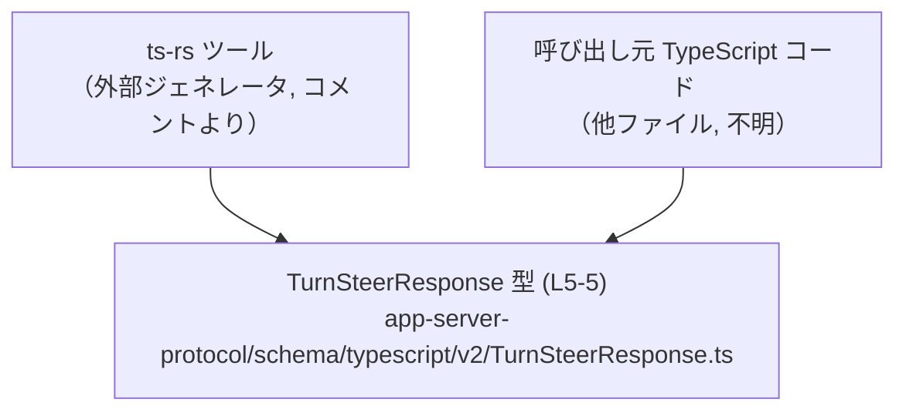
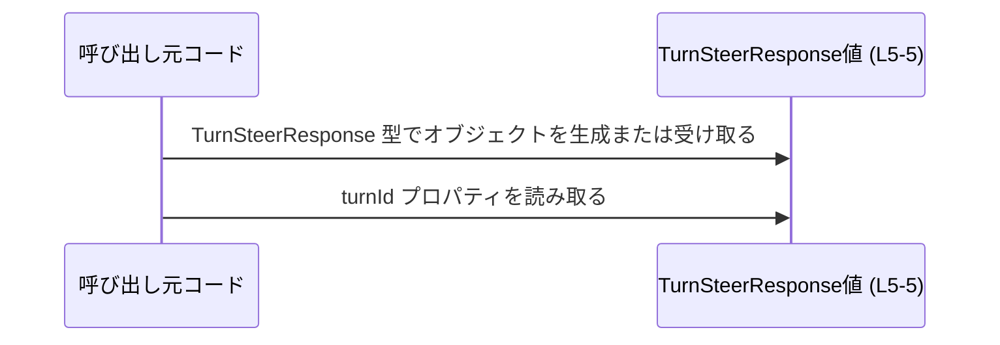

# app-server-protocol/schema/typescript/v2/TurnSteerResponse.ts コード解説

## 0. ざっくり一言

- `TurnSteerResponse` という名前の **TypeScript 型エイリアス**（オブジェクトの形を表す型）を 1 つだけ定義した、自動生成ファイルです（`app-server-protocol/schema/typescript/v2/TurnSteerResponse.ts:L1-5`）。
- この型は `turnId: string` という 1 個の必須プロパティを持つレスポンスオブジェクトの構造を表します（`L5-5`）。

---

## 1. このモジュールの役割

### 1.1 概要

- このモジュールは、`TurnSteerResponse` というレスポンスオブジェクトの **スキーマ（構造定義）** を TypeScript の型として提供します（`L5-5`）。
- ファイル先頭のコメントから、この型定義は **ts-rs ツールによって生成されたコードであり、手動編集が禁止されている** ことが分かります（`L1-3`）。

> 「このモジュールは、`TurnSteerResponse` という名前のレスポンスオブジェクトの構造を TypeScript で型定義し、他のコードから安全に利用できるようにするために存在しています。」

### 1.2 アーキテクチャ内での位置づけ

- ディレクトリパス `app-server-protocol/schema/typescript/v2` から、この型が「アプリケーションサーバのプロトコル定義（v2）」の一部として配置されていることが分かります（パス名からの事実）。
- コメントにより、このファイル自体は **ts-rs により生成される成果物** であり、アプリケーション側の TypeScript コードから **インポートされて利用される側** に位置づけられます（`L1-3`）。
- 実際にどのファイルがこの型を利用しているか、どの API に対応しているかは、このチャンクからは分かりません。

概念的な依存関係を示す図（この図は一般的な利用イメージであり、具体的な呼び出し関係はこのチャンクからは特定できません）:



### 1.3 設計上のポイント

コードとコメントから読み取れる設計上の特徴は次のとおりです。

- **自動生成コードであることの明示**  
  - `// GENERATED CODE! DO NOT MODIFY BY HAND!`（`L1-1`）  
  - 「Do not edit this file manually.」という注意書き（`L3-3`）  
  → このファイルはあくまで生成物であり、仕様変更は元定義（おそらく Rust 側）で行う前提です。
- **単一責務の型定義**  
  - 公開されているのは `TurnSteerResponse` 型エイリアスのみで、他の型や関数はありません（`L5-5`）。
- **状態やロジックを持たない**  
  - 値の構造だけを表す型であり、メソッドや処理ロジック・エラーハンドリング・並行処理などは一切含まれていません（全コードからの事実）。
- **TypeScript の型安全性に依存**  
  - `turnId` が `string` 型で必須プロパティとして定義されているため、TypeScript コンパイラが **「文字列以外」または「プロパティ欠如」** をコンパイル時に検出できます（`L5-5`）。

---

## 2. 主要な機能一覧

このファイルが提供する「機能」は、1 つの型定義だけです。

- `TurnSteerResponse` 型: `turnId: string` という 1 つのプロパティを持つレスポンスオブジェクトの構造を表す型エイリアス（`L5-5`）。

---

## 3. 公開 API と詳細解説

### 3.1 型一覧（構造体・列挙体など）

このファイルに定義されている公開型の一覧です。

| 名前                 | 種別        | 役割 / 用途                                                                                         | 定義位置                                                         |
|----------------------|-------------|------------------------------------------------------------------------------------------------------|------------------------------------------------------------------|
| `TurnSteerResponse`  | 型エイリアス | `turnId: string` を持つオブジェクトの構造を表す。レスポンスとして返却されるデータの型付けに利用される想定。 | `app-server-protocol/schema/typescript/v2/TurnSteerResponse.ts:L5-5` |

#### `TurnSteerResponse` のフィールド

- `turnId: string`（`L5-5`）  
  - 必須プロパティです。  
  - 文字列型として宣言されているため、コンパイル時には `number` や `null` などを代入すると型エラーになります（TypeScript の一般的な挙動）。  
  - プロパティの意味（何の ID か）は、このファイルからは分かりません。

##### 型の契約（Contract）

この型の契約は、次のように整理できます。

- **構造契約**
  - オブジェクトは少なくとも `turnId` プロパティを持つ必要があります（`L5-5`）。
  - `turnId` の値は `string` 型でなければなりません（`L5-5`）。
- **null / undefined に関する契約**
  - 定義上 `turnId` は `string` であり、`string | null` や `string | undefined` ではありません。  
    → `strictNullChecks` 有効な環境では `null` / `undefined` を代入するとコンパイルエラーになります（TypeScript の一般仕様）。
- **ランタイムに関する注意**
  - この型はあくまでコンパイル時の静的チェック用であり、JSON などの動的データに対して **自動でバリデーションが行われるわけではありません**。  
    → 実行時には `turnId` が `undefined` や非文字列である可能性があり、その場合はランタイムエラーや期待しない動作につながります。

##### 安全性・エラー・並行性の観点

- **型安全性**  
  - `TurnSteerResponse` として宣言された変数や関数の引数には、`turnId` が必須であることをコンパイラが保証します。
- **エラー**  
  - このファイル自体にロジックはないため、実行時エラーを直接発生させるコードはありません。  
  - 一方で、誤った型アサーション（例: `someValue as TurnSteerResponse`）を多用すると、コンパイル時の型安全性が損なわれ、実行時に `resp.turnId` が `undefined` になるなどの不具合が起こり得ます。
- **並行性**  
  - 型定義のみで状態や非同期処理は持たないため、並行性／スレッドセーフティの問題はこのファイルには存在しません。

### 3.2 関数詳細（最大 7 件）

- このファイルには関数・メソッドは **一切定義されていません**（`L1-5` 全体を見ても `function` / `=>` を持つロジックは存在しません）。
- そのため、「関数詳細テンプレート」を適用できる対象はありません。

### 3.3 その他の関数

- 補助関数やラッパー関数も定義されていません（`L1-5`）。

---

## 4. データフロー

このファイルには処理ロジックはありませんが、`TurnSteerResponse` 型が **どのようにデータフローに登場し得るか** を、一般的な利用イメージとして示します。

ここでは「何らかの関数が `TurnSteerResponse` 型の値を受け取り、その `turnId` を利用する」という最小限のケースを示します。



- この図は、`TurnSteerResponse` 型（`L5-5`）がどのように「生成→利用」されるかの **典型的かつ抽象的な流れ** を表します。
- 実際にどのモジュール間でやり取りされるか、ネットワーク経由かローカルかなどの詳細は、このファイルには現れていません。

---

## 5. 使い方（How to Use）

### 5.1 基本的な使用方法

`TurnSteerResponse` 型をインポートし、関数の引数として利用する基本パターンです。

```typescript
// TurnSteerResponse 型をこのファイルからインポートする例
import type { TurnSteerResponse } from "./TurnSteerResponse";   // 同一ディレクトリを仮定（実際のパスは利用側次第）

// TurnSteerResponse を受け取って利用する関数の例
function handleTurnSteerResponse(resp: TurnSteerResponse) {     // resp は必ず turnId: string を持つと型が保証する
    console.log(resp.turnId);                                   // turnId に安全にアクセスできる（コンパイル時に存在が保証される）
}
```

この例でのポイント:

- `TurnSteerResponse` は **構造型** なので、`{ turnId: "abc" }` のようなオブジェクトであれば直接代入できます。
- TypeScript コンパイラは `resp.turnId` の存在と型を静的にチェックします。

同じ型を自分で生成して使う例:

```typescript
import type { TurnSteerResponse } from "./TurnSteerResponse";   // 型定義をインポート

// TurnSteerResponse 型の値を自前で組み立てる例
const response: TurnSteerResponse = {                           // response は TurnSteerResponse 型
    turnId: "turn-12345",                                       // 必須プロパティ turnId を string で設定
};

console.log(response.turnId);                                   // "turn-12345" が出力される
```

### 5.2 よくある使用パターン

#### パターン 1: 関数の戻り値として使う

```typescript
import type { TurnSteerResponse } from "./TurnSteerResponse";   // 型をインポート

// TurnSteerResponse 型の値を返す関数
function createTurnSteerResponse(id: string): TurnSteerResponse {  // id はレスポンスの ID として使う
    return { turnId: id };                                        // 戻り値オブジェクトは turnId のみを持つ
}
```

- 呼び出し側は `TurnSteerResponse` 型として結果を扱えるため、`turnId` の存在が保証されます。

#### パターン 2: 外部入力に対して型ガードを使う

JSON など外部から来た値に対しては、ランタイムで検証を行うと安全です。

```typescript
import type { TurnSteerResponse } from "./TurnSteerResponse";       // 型をインポート

// unknown な値が TurnSteerResponse かどうかを判定する型ガード
function isTurnSteerResponse(value: unknown): value is TurnSteerResponse {
    return (
        typeof value === "object" && value !== null &&              // オブジェクトであること
        "turnId" in value &&                                        // turnId プロパティを持つこと
        typeof (value as any).turnId === "string"                   // かつ turnId が文字列であること
    );
}
```

- このような型ガードを使うと、`unknown` や `any` から安全に `TurnSteerResponse` に絞り込むことができます。
- ファイル自体にはこの関数は含まれていませんが、`TurnSteerResponse` 型を安全に利用する代表的なパターンです。

### 5.3 よくある間違い

#### 間違い例 1: 必須プロパティ `turnId` を省略する

```typescript
import type { TurnSteerResponse } from "./TurnSteerResponse";

// 間違い例: turnId を持たないオブジェクトを代入している
const bad: TurnSteerResponse = {};          // コンパイル時エラー: Property 'turnId' is missing ...
```

- `TurnSteerResponse` は `turnId` が必須なので、空オブジェクトは代入できません。

#### 間違い例 2: 型アサーションで安全性を失う

```typescript
import type { TurnSteerResponse } from "./TurnSteerResponse";

const raw: any = {};                        // 何が入っているか分からない any
const forced = raw as TurnSteerResponse;    // コンパイラのチェックを無視して TurnSteerResponse と見なす

console.log(forced.turnId.toUpperCase());   // 実行時に forced.turnId が undefined なら例外が発生
```

- このような **安易な型アサーション** は、`TurnSteerResponse` が本来提供する型安全性を失わせます。
- 代わりに 5.2 のような型ガードを使う方が安全です。

### 5.4 使用上の注意点（まとめ）

- このファイルは **自動生成コード** であり、コメントにあるとおり手動での編集は避ける必要があります（`L1-3`）。
- `TurnSteerResponse` はコンパイル時の型安全性を提供しますが、実行時のバリデーションは行いません。  
  → 外部からのデータ（JSON 等）には型ガードやバリデーションを併用することが推奨されます。
- `turnId` は必須の `string` であり、`null` や `undefined` は意図された値ではありません。  
  → これらを許容したい場合は、元定義側で型を変更する必要があります（このファイルではなく、生成元の定義）。
- 並行性やパフォーマンスに関する考慮は不要ですが、過剰な型アサーションはバグやセキュリティ上の問題（想定外のオブジェクト構造を見逃すなど）につながる可能性があります。

---

## 6. 変更の仕方（How to Modify）

### 6.1 新しい機能を追加する場合

- ファイル先頭コメントに `GENERATED CODE! DO NOT MODIFY BY HAND!` と明記されているため（`L1-1`）、**この TypeScript ファイルを直接編集する設計にはなっていません**。
- 新しいプロパティや機能（例: `status` フィールド）を追加したい場合の一般的な流れは次のとおりです。
  1. **生成元の定義を変更する**  
     - コメントから、このファイルは ts-rs によって生成されたことが分かるため（`L3-3`）、通常は **Rust 側などの元の型定義** を変更します。  
     - 元の定義ファイルの場所や型名は、このチャンクからは分かりません。
  2. **ts-rs による再生成を実行する**  
     - ビルドスクリプトやコマンド経由で ts-rs を再実行し、`TurnSteerResponse.ts` を再生成します。
  3. **利用側コードを更新する**  
     - 追加したプロパティを利用するコードを TypeScript 側に実装します。

> このファイルを直接編集しても、次回の自動生成で上書きされる可能性が高い点に注意が必要です。

### 6.2 既存の機能を変更する場合

`turnId` の型や存在性を変更したいケースを考えます。

- **型を変更する（例: `number` にする）場合**
  - 生成元の型定義で `turnId` の型を変更し、ts-rs で再生成します。
  - `TurnSteerResponse` を利用している全ての TypeScript コードで、`turnId` の利用箇所を `string` から `number` に対応させる必要があります。
- **プロパティ名を変更する場合**
  - 同様に元定義を変更し再生成します。
  - 旧名でアクセスしている箇所はコンパイルエラーになるため、それを手がかりに修正箇所を特定できます。
- **契約変更時の注意点**
  - `TurnSteerResponse` は他モジュールからも利用される **公開 API** と考えられるため（ファイル名・ディレクトリからの一般的な推測）、変更は広範な影響を持つ可能性があります。
  - 変更前後の型契約（`turnId` が必須か、型は何か）を明確にし、利用側すべてを確認することが重要です。

---

## 7. 関連ファイル

このチャンクには、他ファイルへの import / export や具体的な参照は一切登場しません。そのため、**直接の関連ファイルを特定することはできません**。

| パス | 役割 / 関係 |
|------|------------|
| （不明） | このファイルからは、元となる Rust 定義ファイルや、`TurnSteerResponse` を利用する TypeScript ファイルを特定できません。 |

補足:

- コメントにより ts-rs による自動生成であることは分かりますが（`L3-3`）、元の Rust 型の名前・場所はこのコードからは読み取れません。
- 同一ディレクトリ `app-server-protocol/schema/typescript/v2` 内に類似の型ファイルが存在する可能性はありますが、このチャンクには現れないため、ここでは「不明」としています。

---

### まとめ（バグ・セキュリティ・テスト・パフォーマンスの観点）

- **バグの可能性**  
  - このファイル自体にロジックはないので、直接のバグはありません。  
  - ただし、型アサーションの乱用や生成元定義との不整合があると、`turnId` が存在しない / 型が異なるといった実行時バグにつながる可能性があります。
- **セキュリティ**  
  - 型だけでは外部入力の検証は行われません。信頼できない入力に対しては、別途ランタイムバリデーションが必要です。
- **テスト**  
  - このファイルの正しさは、主に「生成元定義」と「ts-rs の生成ロジック」に依存します。  
  - 型の整合性を確認するには、`TurnSteerResponse` を前提とした統合テストや型レベルテスト（型チェックが通るかどうか）などが有効です。
- **パフォーマンス/スケーラビリティ**  
  - 型定義のみであり、実行時コストはありません。大量のデータや高頻度の処理に対しても、このファイルがボトルネックになることはありません。

このように、`TurnSteerResponse` は非常に小さいファイルですが、プロトコルの一部として **「型契約」を明示する重要な役割** を持っていると解釈できます（ただし具体的なプロトコル内容は、このチャンクからは分かりません）。
