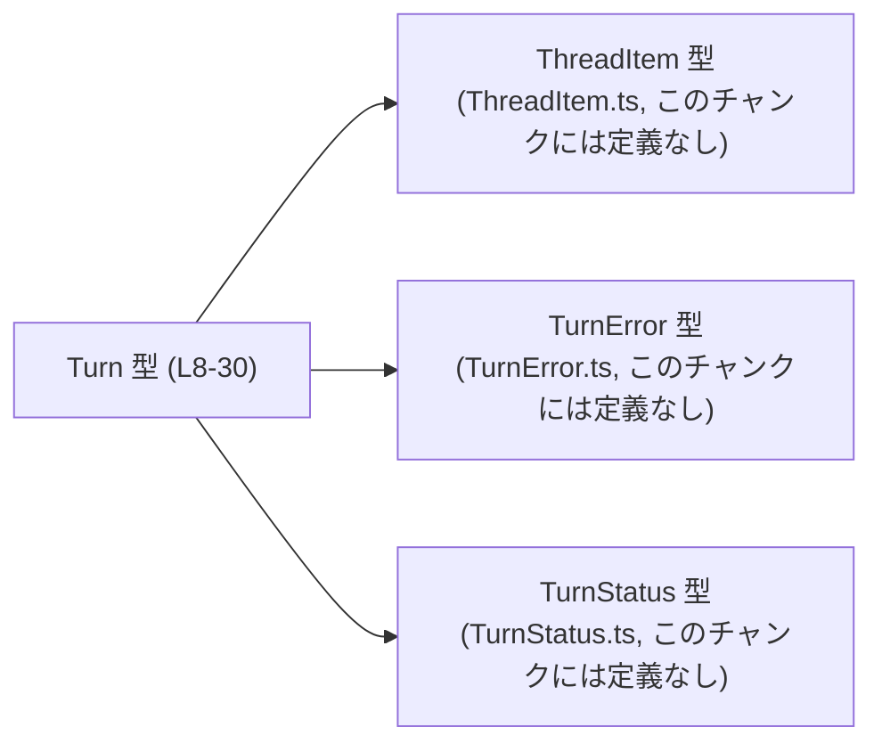
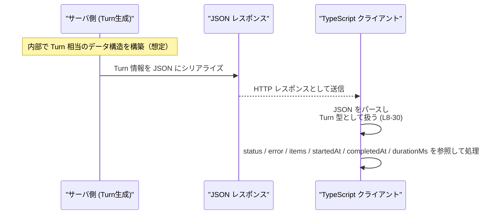

# app-server-protocol/schema/typescript/v2/Turn.ts

## 0. ざっくり一言

`Turn` という 1 つの型エイリアスを定義し、スレッドにおける「1 回のターン」の状態（ID・アイテム一覧・ステータス・エラー・開始／終了時刻・所要時間）を表現する TypeScript スキーマです。  
Rust 側から `ts-rs` で自動生成されたコードであり、手動編集しないことが前提になっています。[Turn.ts:L1-3]

---

## 1. このモジュールの役割

### 1.1 概要

- このモジュールは、アプリケーションサーバープロトコルの TypeScript スキーマにおける **「Turn」オブジェクトの形を定義する** ために存在しています。[Turn.ts:L8-30]
- `Turn` は、スレッド関連のレスポンス（特に `thread/resume` や `thread/fork`）で返される 1 回分の処理単位を表現し、関連するアイテムやエラー情報、タイミング情報を保持します。[Turn.ts:L9-12][Turn.ts:L16-22][Turn.ts:L24-30]

### 1.2 アーキテクチャ内での位置づけ

`Turn` 型は他の 3 つの型に依存しています。

- `ThreadItem`（スレッド内の個々の要素を表す型）を配列として保持します。[Turn.ts:L4][Turn.ts:L14]
- `TurnError`（ターン失敗時のエラー情報）を `error` フィールドとして保持します。[Turn.ts:L5][Turn.ts:L18]
- `TurnStatus`（ターンの状態）を `status` フィールドとして保持します。[Turn.ts:L6][Turn.ts:L14]



このチャンクには `Turn` を利用する側のコードは含まれていないため、どのモジュールから参照されているかは不明です（API クライアントや UI 層から利用されると推測されますが、コードからは断定できません）。

### 1.3 設計上のポイント

- **自動生成コード**  
  冒頭コメントに `GENERATED CODE! DO NOT MODIFY BY HAND!` とあり、`ts-rs` によって生成されたことが明記されています。[Turn.ts:L1-3]  
  → 手動での編集は想定されていません。

- **純粋なデータ構造のみ**  
  関数やメソッドは存在せず、1 つのオブジェクト型エイリアス `Turn` だけを定義しています。[Turn.ts:L8-30]

- **明示的な null 許容**  
  `error`, `startedAt`, `completedAt`, `durationMs` は `T | null` という **ユニオン型**で表現され、存在しない場合を `null` で表現します。[Turn.ts:L18][Turn.ts:L22][Turn.ts:L26][Turn.ts:L30]

- **コメントによる契約の明示**  
  各フィールドのコメントで、「どの状況で値が設定されるか／空か」が記述されており、API の使用上の契約が示されています。[Turn.ts:L9-12][Turn.ts:L16-17][Turn.ts:L20-21][Turn.ts:L24-25][Turn.ts:L28-29]

---

## 2. 主要な機能一覧

このファイルは関数を持たず、「Turn」というデータ型を通じて以下の機能を提供します。

- **ターン識別**: `id` によりターンを一意に識別する。[Turn.ts:L8]
- **アイテム一覧の保持**: 特定のレスポンスで `items: ThreadItem[]` を保持し、それ以外では空配列とする。[Turn.ts:L9-14]
- **ターン状態の表現**: `status: TurnStatus` によって成功／失敗などの状態を表現する。[Turn.ts:L14]
- **エラー情報の付随**: 失敗時のみ `error: TurnError | null` にエラーを格納する。[Turn.ts:L16-18]
- **タイミング情報の保持**: `startedAt`, `completedAt`, `durationMs` で開始時刻・終了時刻・所要時間を表現する。[Turn.ts:L20-22][Turn.ts:L24-26][Turn.ts:L28-30]

### 2.1 コンポーネント一覧（インベントリー）

| 名前        | 種別              | 説明                                                                 | 定義箇所                          |
|-------------|-------------------|----------------------------------------------------------------------|-----------------------------------|
| `Turn`      | 型エイリアス（オブジェクト） | 1 回のターンの全体状態（ID・アイテム・ステータス・エラー・タイミング）を表現する | `Turn.ts:L8-30`                  |
| `ThreadItem`| import された型   | `items` 配列の要素型。内容はこのチャンクには現れません              | 宣言: `Turn.ts:L4`、定義は別ファイル |
| `TurnError` | import された型   | `error` フィールドに格納されるエラー情報型。内容はこのチャンクには現れません | 宣言: `Turn.ts:L5`、定義は別ファイル |
| `TurnStatus`| import された型   | ターンの状態を表現する型。列挙か文字列ユニオンかは不明             | 宣言: `Turn.ts:L6`、定義は別ファイル |

---

## 3. 公開 API と詳細解説

### 3.1 型一覧（構造体・列挙体など）

#### `Turn` 型

```ts
export type Turn = { 
  id: string,
  /**
   * Only populated on a `thread/resume` or `thread/fork` response.
   * For all other responses and notifications returning a Turn,
   * the items field will be an empty list.
   */
  items: Array<ThreadItem>, 
  status: TurnStatus,
  /**
   * Only populated when the Turn's status is failed.
   */
  error: TurnError | null,
  /**
   * Unix timestamp (in seconds) when the turn started.
   */
  startedAt: number | null,
  /**
   * Unix timestamp (in seconds) when the turn completed.
   */
  completedAt: number | null,
  /**
   * Duration between turn start and completion in milliseconds, if known.
   */
  durationMs: number | null, 
};
```

[Turn.ts:L8-30]

フィールドごとの概要は次の通りです。

| フィールド名   | 型                     | null | 説明                                                                                               | 根拠 |
|----------------|------------------------|------|----------------------------------------------------------------------------------------------------|------|
| `id`           | `string`               | ×    | ターンの識別子。形式や一意性の保証についてはこのチャンクからは不明です。                          | [Turn.ts:L8] |
| `items`        | `Array<ThreadItem>`    | ×    | `thread/resume` または `thread/fork` レスポンスでのみ中身があり、それ以外は空配列とされる配列。  | [Turn.ts:L9-12][Turn.ts:L14] |
| `status`       | `TurnStatus`           | ×    | ターンの状態を表す値。具体的なバリアント（例: success/failed）は `TurnStatus` 定義側に依存します。| [Turn.ts:L14] |
| `error`        | `TurnError \| null`    | ○    | ターンが失敗状態のときのみ設定されるエラー情報。それ以外は `null`。                               | [Turn.ts:L16-18] |
| `startedAt`    | `number \| null`       | ○    | ターン開始時刻を秒単位 Unix 時刻で表現。存在しない／不明な場合は `null`。                         | [Turn.ts:L20-22] |
| `completedAt`  | `number \| null`       | ○    | ターン終了時刻を秒単位 Unix 時刻で表現。存在しない／不明な場合は `null`。                         | [Turn.ts:L24-26] |
| `durationMs`   | `number \| null`       | ○    | ターンの開始から終了までの所要時間（ミリ秒）。計測できない場合は `null`。                          | [Turn.ts:L28-30] |

> TypeScript の観点では、`null` を含むフィールドは **コンパイル時に必ず null チェックが必要になる** ため、誤用をある程度防げますが、実行時の保証は API 実装側に依存します。

### 3.2 関数詳細（最大 7 件）

このファイルには関数・メソッド定義は存在しません。[Turn.ts:L1-30]  
従って、このセクションで詳細解説すべき関数はありません。

### 3.3 その他の関数

同上の理由で、補助関数やラッパー関数も定義されていません。[Turn.ts:L1-30]

---

## 4. データフロー

このファイル自体には処理ロジックはありませんが、コメントから想定される代表的なデータフローは次のようになります。

1. サーバ側で「ターン」の情報が生成される（Rust などで定義された `Turn` 構造体から）。  
   ※ Rust 側の定義はこのチャンクには含まれていませんが、`ts-rs` の存在からそう推測されます。[Turn.ts:L1-3]
2. サーバはその情報を JSON にシリアライズしてクライアントに返します。
3. TypeScript クライアントは JSON をパースし、`Turn` 型として扱います。[Turn.ts:L8-30]
4. クライアントは `status` や `error`, `items`, 各種タイミング情報に基づいて処理を分岐します。



> 上記のうち、実際にこのチャンクで定義されているのは **Turn 型の形だけ** であり、通信処理や JSON パース処理は他のモジュールに依存します。

---

## 5. 使い方（How to Use）

### 5.1 基本的な使用方法

`Turn` は純粋な型定義なので、典型的には API レスポンスの型注釈として利用します。

```ts
// Turn 型をインポートする
import type { Turn } from "./Turn";                     // Turn.ts:L8

// 例: API クライアントが Turn を返す関数
async function fetchTurn(id: string): Promise<Turn> {    // 戻り値に Turn 型を指定
  const res = await fetch(`/api/turns/${id}`);           // 実際のエンドポイントはこのチャンクからは不明
  const json = await res.json();                        // JSON を取得
  return json as Turn;                                  // ランタイムでは型情報がないためアサーションで扱う
}

// 取得した Turn を扱う例
async function handleTurn(id: string) {
  const turn = await fetchTurn(id);                     // Turn 型として扱える

  // ID は必ず string
  console.log("Turn ID:", turn.id);                     // Turn.ts:L8

  // items は常に配列（thread/resume, thread/fork 以外では空配列と契約）[Turn.ts:L9-14]
  if (turn.items.length === 0) {
    console.log("このターンには items がありません");
  } else {
    for (const item of turn.items) {
      // ThreadItem の中身はこのチャンクからは不明
      console.log("ThreadItem:", item);
    }
  }

  // エラー情報（status が失敗のときのみ設定されるとコメントで定義）[Turn.ts:L16-18]
  if (turn.error !== null) {
    console.error("Turn failed with error:", turn.error);
  }

  // タイミング情報は null かもしれないので必ずチェックする [Turn.ts:L20-22][Turn.ts:L24-26][Turn.ts:L28-30]
  if (turn.startedAt !== null && turn.completedAt !== null) {
    const startMs = turn.startedAt * 1000;
    const endMs = turn.completedAt * 1000;
    const durationMs =
      turn.durationMs ?? (endMs - startMs);            // durationMs が null の場合は手計算する一例
    console.log(`Turn duration: ${durationMs} ms`);
  }
}
```

### 5.2 よくある使用パターン

1. **ステータスとエラーで処理を分ける**

   `TurnStatus` の具体的な形はこのチャンクにはありませんが、少なくとも **「エラーがあれば失敗とみなす」** という扱いは可能です。

   ```ts
   import type { Turn } from "./Turn";

   function isFailedTurn(turn: Turn): boolean {
     // コメント上は「status が failed のときのみ error が populated」となっている [Turn.ts:L16-18]
     // 型の詳細が不明なため、ここでは error の有無で簡易判定する
     return turn.error !== null;
   }
   ```

2. **`items` を前提にした処理**

   コメントより、`thread/resume` / `thread/fork` 以外では `items` は空配列になる契約です。[Turn.ts:L9-12]  
   したがって、「items が空でない」ときだけ処理するパターンが自然です。

   ```ts
   function processItems(turn: Turn) {
     if (turn.items.length === 0) {                   // Turn.ts:L14
       return;                                        // 他のレスポンスタイプの場合など
     }
     for (const item of turn.items) {
       // ThreadItem の詳細は別ファイル参照
       console.log("Processing ThreadItem:", item);
     }
   }
   ```

### 5.3 よくある間違い

```ts
import type { Turn } from "./Turn";

// ❌ 間違い例: null チェックをせずに timestamp を使う
function printDurationWrong(turn: Turn) {
  // startedAt / completedAt / durationMs は null になり得る [Turn.ts:L20-22][Turn.ts:L24-26][Turn.ts:L28-30]
  const durationMs = turn.durationMs;                 // ここでは null の可能性が残る
  console.log(durationMs.toFixed(2));                 // 実行時に TypeError になる可能性
}

// ✅ 正しい例: null チェックを行う
function printDurationSafe(turn: Turn) {
  if (turn.durationMs === null) {                     // null の可能性を明示的に排除
    console.log("Duration unknown");
    return;
  }
  console.log(turn.durationMs.toFixed(2));            // ここでは number として安全に扱える
}
```

```ts
// ❌ 間違い例: items が undefined と仮定している
function wrongItemsCheck(turn: Turn) {
  if (!turn.items) {                                  // items は常に配列で null/undefined ではない [Turn.ts:L14]
    // ここには到達しない前提のコードだが、思惑と型定義がズレている
  }
}

// ✅ 正しい例: 空配列前提で length をチェック
function correctItemsCheck(turn: Turn) {
  if (turn.items.length === 0) {
    console.log("items は空です");
  }
}
```

### 5.4 使用上の注意点（まとめ）

- **このファイルを直接編集しない**  
  自動生成コードのため、手で編集すると次回生成時に上書きされます。[Turn.ts:L1-3]

- **`null` 許容フィールドのチェックを必ず行う**  
  `error`, `startedAt`, `completedAt`, `durationMs` は `null` になり得るため、直接プロパティやメソッドにアクセスすると実行時エラーの原因になります。[Turn.ts:L18][Turn.ts:L22][Turn.ts:L26][Turn.ts:L30]

- **`items` は「存在しない」ではなく「空配列」**  
  `items` は常に `Array<ThreadItem>` であり、レスポンス種別によって空配列になるだけです。[Turn.ts:L9-14]  
  `undefined` や `null` を想定したコードを書くと型定義と矛盾します。

- **`TurnStatus` の具体的な値はこのチャンクからは分からない**  
  文字列か enum か、どのようなバリアントがあるかは別ファイルを確認する必要があります。[Turn.ts:L6]  
  ステータス値に対する分岐ロジックを書く際には、`TurnStatus` 定義側のドキュメントを参照する必要があります。

- **並行性（Concurrency）について**  
  `Turn` はただのデータオブジェクトであり、内部にミューテーションのロジックはありません。[Turn.ts:L8-30]  
  JavaScript/TypeScript の通常のオブジェクトと同様に、複数の非同期処理から同じインスタンスを共有する場合は、呼び出し側で状態の競合を避ける設計が必要です（このファイル自身は何も保証しません）。

---

## 6. 変更の仕方（How to Modify）

### 6.1 新しい機能を追加する場合

このファイルは `ts-rs` によって自動生成されており、冒頭に「手で変更しないように」と明示されています。[Turn.ts:L1-3]  
そのため、**直接このファイルを編集して新しいフィールドを追加することは推奨されません**。

一般的な変更手順（推測を含むため、実際にはプロジェクトの生成スクリプトを確認する必要があります）:

1. **Rust 側の `Turn` 構造体定義を変更する**  
   - ここには現れないためパスは不明ですが、`ts-rs` が参照する Rust 側の定義にフィールドを追加・変更する形になると考えられます。
2. **`ts-rs` のコード生成を再実行する**  
   - ビルドスクリプトや専用の CLI を通じて TypeScript スキーマを再生成します。
3. **生成された TypeScript を確認する**  
   - 本ファイル（Turn.ts）の `Turn` 型に、望んだ変更が反映されているか確認します。[Turn.ts:L8-30]

> このチャンクには Rust 側やビルドスクリプトの情報がないため、実際のコマンドやファイルパスは不明です。

### 6.2 既存の機能を変更する場合

`Turn` 型のフィールドを変更する場合の注意点:

- **影響範囲の確認**  
  - `Turn` を参照している全ての TypeScript コード（API クライアント、UI、ビジネスロジックなど）を検索し、型変更によってビルドが壊れないか確認する必要があります。
  - 検索は `Turn` 型名と各フィールド名（`id`, `items`, `status`, `error`, `startedAt`, `completedAt`, `durationMs`）ごとに行うと網羅的です。[Turn.ts:L8-30]

- **契約（Contracts）の維持**  
  - コメントで明示されている契約（例: `items` は特定レスポンス以外では空配列、`error` は失敗時のみ populated）はクライアントコードが前提としている可能性があります。[Turn.ts:L9-12][Turn.ts:L16-18]  
  - これらの契約を変えると、既存のクライアント側ロジックが誤動作する可能性があります。

- **テストの更新**  
  - このチャンクにはテストコードは含まれていませんが、プロジェクト全体では API レスポンスの形を前提にしたテストが存在することが多いため、それらの更新が必要になります（テストの位置はこのチャンクからは不明です）。

---

## 7. 関連ファイル

このファイルと密接に関係するのは、import されている 3 つの型定義ファイルです。

| パス（推定）                                             | 役割 / 関係                                                                                     |
|----------------------------------------------------------|--------------------------------------------------------------------------------------------------|
| `app-server-protocol/schema/typescript/v2/ThreadItem.ts` | `ThreadItem` 型を定義するファイル。`Turn.items: ThreadItem[]` の要素型として利用されます。[Turn.ts:L4][Turn.ts:L14] |
| `app-server-protocol/schema/typescript/v2/TurnError.ts`  | `TurnError` 型を定義するファイル。`Turn.error: TurnError \| null` に格納されるエラー情報です。[Turn.ts:L5][Turn.ts:L18] |
| `app-server-protocol/schema/typescript/v2/TurnStatus.ts` | `TurnStatus` 型を定義するファイル。`Turn.status` によってターンの状態を表現します。[Turn.ts:L6][Turn.ts:L14] |

その他、`ts-rs` が参照している Rust 側の `Turn` 型定義やビルドスクリプトが存在すると考えられますが、このチャンクには現れないため、具体的なパスや名称は不明です。

---

### Bugs / Security / Edge Cases まとめ（本ファイルに関するもの）

- **型と実際のデータの不整合リスク**  
  - TypeScript の型はコンパイル時のみ有効であり、実行時に受信する JSON がこの型と一致する保証はありません。`as Turn` アサーション使用時は特に注意が必要です。
- **エッジケース**  
  - `items` が非常に大きな配列となるケースでは、メモリ・描画コストが増大します（本ファイルはこれを制御しません）。
  - `durationMs` やタイムスタンプが極端に大きい値の場合でも、型的には受け付けますが、意味解釈は呼び出し側に委ねられます。
- **並行性**  
  - 本ファイルには同期／非同期処理やロック機構は存在せず、単なるデータ型であるため、スレッドセーフ性は言語レベルの通常のオブジェクトと同程度です。複数の非同期処理から同じ `Turn` インスタンスをミューテートする場合は、呼び出し側で制御する必要があります。

以上が、`Turn.ts` に関する構造と利用上のポイントです。
