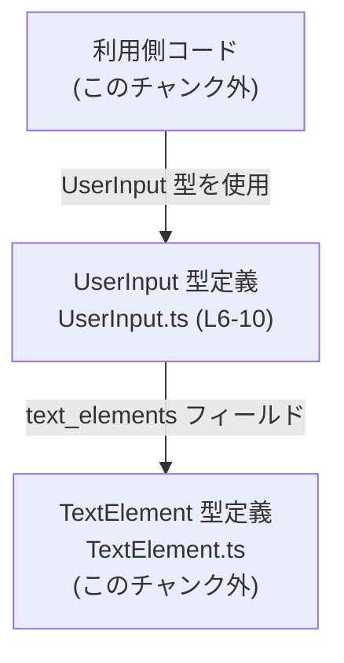
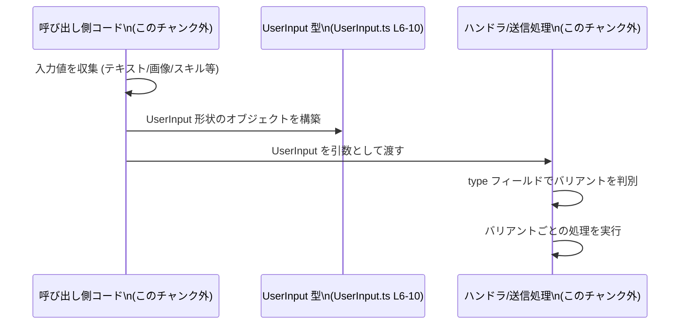

# app-server-protocol/schema/typescript/v2/UserInput.ts

## 0. ざっくり一言

`UserInput` は、テキスト・画像・ローカル画像・スキル呼び出し・メンションなど、複数種類のユーザー入力を 1 つの「判別可能なユニオン型」として表現するための TypeScript 型定義です（`UserInput.ts:L6-10`）。

---

## 1. このモジュールの役割

### 1.1 概要

- このモジュールは、アプリケーションとサーバー間のプロトコル（`app-server-protocol` ディレクトリ名から推測）における **ユーザー入力の型定義** を提供します（ファイルパスより。利用箇所はこのチャンクには現れません）。
- 5 種類の入力（テキスト、リモート画像、ローカル画像、スキル、メンション）を、`type` フィールドをタグとする **判別ユニオン（discriminated union）** として表現しています（`UserInput.ts:L6-10`）。
- テキスト入力の場合にだけ、`TextElement` 型の配列からなる `text_elements` を持ち、テキスト中の特別な要素（スパン）を表現します（`UserInput.ts:L6-10`）。

### 1.2 アーキテクチャ内での位置づけ

このファイルは、TypeScript 側のスキーマ（型）層に位置し、実行ロジックは含んでいません（`UserInput.ts:L1-4, L6`）。  
概念的な依存関係は次のようになります。



- `Caller` は、実際に `UserInput` を生成・消費する他モジュールであり、このチャンクには登場しません。
- `UserInput` は `TextElement` に依存します（`import type { TextElement } from "./TextElement";` `UserInput.ts:L4`）。
- `TextElement` の中身はこのチャンクには現れないため不明です。

### 1.3 設計上のポイント

コードから読み取れる設計上の特徴は次のとおりです。

- **生成コード**  
  - ファイル先頭コメントから、この型は Rust 側から `ts-rs` によって自動生成されていることが分かります（`UserInput.ts:L1-3`）。  
    手動編集しない前提の「スキーマ同期用ファイル」です。
- **判別可能ユニオン**  
  - すべてのバリアントが `"type"` フィールドを持ち、その値が `"text" | "image" | "localImage" | "skill" | "mention"` のいずれかである判別ユニオンになっています（`UserInput.ts:L6-10`）。
  - これにより、TypeScript の制御フロー解析により `switch` / `if` での型絞り込みが可能です。
- **型レベルでの必須・任意**  
  - 各バリアントのプロパティは `?` が付いていないため、型レベルではすべて必須です（`UserInput.ts:L6-10`）。
  - 特に、`"text"` バリアントの `text_elements: Array<TextElement>` は必須プロパティです（`UserInput.ts:L6-10`）。
- **実行時ロジック・エラー処理・並行性**  
  - このファイルは型定義のみであり、実行時コード・エラー処理・非同期/並行処理は含まれていません（`UserInput.ts:L4, L6-10`）。

---

## 2. 主要な機能一覧

このファイルは関数を提供せず、1 つの公開型 `UserInput` を提供します（`UserInput.ts:L6`）。

- `UserInput` 型: ユーザー入力を 5 種類のバリアントからなる判別ユニオンとして表現する。

---

## 3. 公開 API と詳細解説

### 3.1 型一覧（構造体・列挙体など）

このチャンクに現れる主な型・シンボルと、その定義/利用位置です。

| 名前         | 種別           | 役割 / 用途                                                     | 定義/利用位置                 |
|--------------|----------------|------------------------------------------------------------------|------------------------------|
| `UserInput`  | 型エイリアス   | ユーザー入力の 5 種類のバリアントを表現する判別ユニオン型     | `UserInput.ts:L6-10`        |
| `TextElement`| 型（import のみ）| テキスト入力中の特別な要素を表す型。詳細はこのチャンク外。     | `UserInput.ts:L4, L6-10`    |

`TextElement` の具体的な構造・役割は `./TextElement` に定義されており、このチャンクには現れないため不明です（`UserInput.ts:L4`）。

#### `UserInput` のバリアント構造

`UserInput` は次の 5 バリアントからなるユニオンです（`UserInput.ts:L6-10`）。

1. **テキスト入力**

   ```ts
   { 
     "type": "text",
     text: string,
     /**
      * UI-defined spans within `text` used to render or persist special elements.
      */
     text_elements: Array<TextElement>,
   }
   ```

   - `type`: `"text"` 固定の文字列リテラル。
   - `text`: ユーザーが入力したテキスト。空文字列も型上は許容されます。
   - `text_elements`: `TextElement` の配列。コメントから、UI が定義するスパン情報（特別な要素）を表すと読めます（`UserInput.ts:L7-9`）。

2. **リモート画像入力**

   ```ts
   { "type": "image", url: string }
   ```

   - `type`: `"image"` 固定。
   - `url`: 画像リソースへの URL。型上は任意の文字列であり、バリデーションは別途必要です。

3. **ローカル画像入力**

   ```ts
   { "type": "localImage", path: string }
   ```

   - `type`: `"localImage"` 固定。
   - `path`: ローカルファイルのパス表現。型上は任意の文字列です。

4. **スキル入力**

   ```ts
   { "type": "skill", name: string, path: string }
   ```

   - `type`: `"skill"` 固定。
   - `name`: スキル名を表す文字列。
   - `path`: スキル識別に用いられるパス。詳細な意味はこのチャンクからは分かりません。

5. **メンション入力**

   ```ts
   { "type": "mention", name: string, path: string }
   ```

   - `type`: `"mention"` 固定。
   - `name`: メンション対象の名前。
   - `path`: メンション対象を一意に識別するパス。意味はこのチャンクからは分かりません。

これらが `|` で結合されて 1 つのユニオン型 `UserInput` になっています（`UserInput.ts:L6-10`）。

### 3.2 関数詳細（最大 7 件）

このファイルには関数定義が存在しません（`UserInput.ts:L1-10`）。  
したがって、詳細に解説すべき公開関数はありません。

### 3.3 その他の関数

関数は定義されていません（`UserInput.ts:L1-10`）。

---

## 4. データフロー

このファイル自体は型定義のみですが、`UserInput` 型がどのようにデータフローに関わるかの典型例を、概念的な図で示します。  
図はあくまで「この型を使う一般的なパターン」の例であり、具体的な処理コードはこのチャンクには存在しません。



- `C`（呼び出し側コード）はフォームや UI などから値を集め、`UserInput` 型に沿ったオブジェクトを構築します。
- `H`（ハンドラ）は `type` を見て分岐し、例えば `"text"` なら `text` と `text_elements` を解釈し、`"image"` なら `url` を利用する、というような処理を行うことが想定されます（この処理はこのチャンクには現れません）。

---

## 5. 使い方（How to Use）

### 5.1 基本的な使用方法

`UserInput` 型は判別ユニオンなので、`type` フィールドで分岐することで、TypeScript の型安全なナローイングが利用できます。  
以下は典型的な処理例です（利用コードはこのチャンク外の例示）。

```typescript
import type { UserInput } from "./UserInput";        // UserInput 型をインポートする
import type { TextElement } from "./TextElement";    // TextElement 型も必要ならインポートする

// UserInput を受け取って処理する関数の例
function handleUserInput(input: UserInput) {         // input の型は UserInput
    switch (input.type) {                            // 判別フィールド type で分岐
        case "text": {
            // input はここでは { type: "text"; text: string; text_elements: TextElement[] } と推論される
            console.log("text:", input.text);        // text プロパティに安全にアクセスできる
            for (const span of input.text_elements) { // text_elements は TextElement[] として扱える
                // span の構造は TextElement.ts 側の定義に従う
            }
            break;
        }
        case "image": {
            // input は { type: "image"; url: string }
            console.log("image url:", input.url);
            break;
        }
        case "localImage": {
            // input は { type: "localImage"; path: string }
            console.log("local image path:", input.path);
            break;
        }
        case "skill": {
            // input は { type: "skill"; name: string; path: string }
            console.log("skill:", input.name, input.path);
            break;
        }
        case "mention": {
            // input は { type: "mention"; name: string; path: string }
            console.log("mention:", input.name, input.path);
            break;
        }
        default: {
            // ts-rs 生成コードが前提なら、ここには来ない想定だが、
            // 将来バリアント追加を考えるなら網羅性チェックを有効にしておくと安全
            const _exhaustive: never = input;
            return _exhaustive;
        }
    }
}
```

このように、`type` で分岐することで、各バリアントのフィールドへ型安全にアクセスできます。  
実行時のチェックは行われないため、入力が外部から来る場合には別途バリデーションが必要になります。

### 5.2 よくある使用パターン

1. **UI からの入力のラップ**

   ```typescript
   const textInput: UserInput = {
       type: "text",                                 // "text" バリアントを選択
       text: "Hello, world!",                        // ユーザーの入力したテキスト
       text_elements: [],                            // TextElement[]: 空配列も許容される
   };

   const imageInput: UserInput = {
       type: "image",                                // "image" バリアント
       url: "https://example.com/image.png",         // 画像 URL
   };
   ```

2. **サーバーや別コンポーネントへの送信前の型付け**

   外部から受け取った JSON をアプリ内部で `UserInput` として扱う場合、  
   パース後のオブジェクトに対してランタイムバリデーションを行い、その結果を `UserInput` 型だと宣言する、というパターンが考えられます（具体的なバリデーションコードはこのチャンクには現れません）。

### 5.3 よくある間違い

型定義に照らした誤用例と、正しい例を示します。

```typescript
// 誤りの例: "text" バリアントなのに text_elements を省略している
const badTextInput: UserInput = {
    // @ts-expect-error: text_elements が不足しているためコンパイルエラーになるはず
    type: "text",
    text: "hello",
    // text_elements がない
};

// 正しい例: text_elements を必ず指定する
const goodTextInput: UserInput = {
    type: "text",
    text: "hello",
    text_elements: [],                                 // 空配列でもよい
};

// 誤りの例: type 値とフィールドの組み合わせが矛盾
const badImageInput: UserInput = {
    // @ts-expect-error: "image" バリアントに text フィールドは存在しない
    type: "image",
    text: "this is not allowed",
    url: "https://example.com/image.png",
};

// 正しい例: "image" バリアントには url のみ
const goodImageInput: UserInput = {
    type: "image",
    url: "https://example.com/image.png",
};
```

### 5.4 使用上の注意点（まとめ）

- **型はコンパイル時のみ**  
  - TypeScript の型は実行時には存在しないため、外部入力の JSON 等に対しては、型で保証されている前提（`type` とフィールドの対応）が守られているかを実行時に検証する必要があります。
- **`type` とフィールドの整合性**  
  - 各バリアントごとに必要なフィールドが異なるため、`type` に応じたフィールドの有無を正しくセットする必要があります（`UserInput.ts:L6-10`）。
- **`TextElement` の解釈**  
  - `text_elements` の意味や構造は `TextElement` 側の定義に依存します（`UserInput.ts:L4, L7-9`）。  
    その仕様に合わせて UI や処理を実装する必要があります。
- **URL/パスのバリデーション**  
  - `url` や `path` は単なる `string` であり、形式や安全性は型では保証されません（`UserInput.ts:L6-10`）。  
    実際の利用時には、URL 形式チェックやパス検証を行うことが推奨されます。

---

## 6. 変更の仕方（How to Modify）

このファイルは自動生成ファイルであり、「手動で編集しない」ことが前提になっています（`UserInput.ts:L1-3`）。  
実際の変更は Rust 側の定義や `ts-rs` の設定に対して行い、そこから再生成する形になると考えられます。

### 6.1 新しい機能を追加する場合

**新しい種類の UserInput バリアントを追加する例（概念的手順）**

1. **Rust 側の型にバリアントを追加する**  
   - `ts-rs` が生成元とする Rust の enum/struct に、新しいバリアントを追加する必要があります。  
     （Rust 側のコードはこのチャンクには現れないため詳細は不明です）。
2. **`ts-rs` による再生成**  
   - Rust 側から `ts-rs` を実行して TypeScript コードを再生成します。  
     その結果、この `UserInput.ts` に新しいユニオンバリアントが追加されるはずです（`UserInput.ts:L1-3` より生成物であることが分かる）。
3. **利用側コードの対応**  
   - `switch (input.type)` などで `UserInput` を扱っている箇所に、新バリアントの処理を追加します。  
   - `default` / 網羅性チェックがある場合は、コンパイルエラーを手掛かりに漏れを埋めていきます。

### 6.2 既存の機能を変更する場合

既存バリアントのフィールド構造を変える場合も、基本的には生成元で行います。

- **影響範囲の確認**  
  - `UserInput` を利用している箇所で、該当バリアントのフィールドにアクセスしているコードを検索します（例: `.text_elements`, `.url`, `.path` など）。
- **契約の意識**  
  - 例えば `"text"` バリアントから `text_elements` を削除する／オプションにするなどの変更は、  
    それを前提に処理している UI やサーバー側のコードの動作に直接影響します。
- **テストと型チェック**  
  - 生成後、TypeScript の型チェックエラーとテスト結果を確認し、ユニオンの全バリアントを網羅的に扱えているかを確認します。

---

## 7. 関連ファイル

このチャンクから関連が明確に分かるファイルは次のとおりです。

| パス                                   | 役割 / 関係                                                                 |
|----------------------------------------|-----------------------------------------------------------------------------|
| `app-server-protocol/schema/typescript/v2/UserInput.ts` | 本レポート対象。`UserInput` 判別ユニオン型の定義（`UserInput.ts:L6-10`）。 |
| `app-server-protocol/schema/typescript/v2/TextElement.ts` | `TextElement` 型の定義ファイルと推測される。`UserInput` から import されている（`UserInput.ts:L4`）。中身はこのチャンクには現れないため不明。 |

この他に、`ts-rs` の生成元となる Rust 側の型定義ファイルが存在するはずですが、その場所や内容はこのチャンクには現れません（`UserInput.ts:L1-3` より「ts-rs による生成物」であることのみが分かります）。
