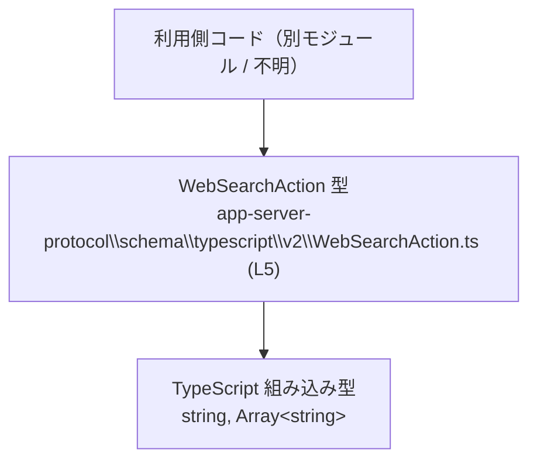
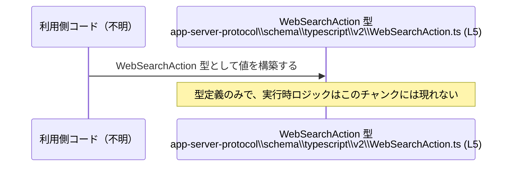

# app-server-protocol\schema\typescript\v2\WebSearchAction.ts コード解説

## 0. ざっくり一言

`WebSearchAction` という **Web関連のアクションを表す判別共用体（discriminated union）型** を定義する、自動生成された TypeScript スキーマファイルです。（根拠: app-server-protocol\schema\typescript\v2\WebSearchAction.ts:L1-5）

---

## 1. このモジュールの役割

### 1.1 概要

- このモジュールは、`WebSearchAction` 型を 1 つだけ公開しています。（根拠: L5-5）
- `WebSearchAction` は `"type"` プロパティを判別キーとし、4 種類のオブジェクト形状をとる判別共用体です。（根拠: L5-5）
- コメントから、このファイルは `ts-rs` によって自動生成され、手動での編集は禁止されています。（根拠: L1-3）

### 1.2 アーキテクチャ内での位置づけ

- ファイルパスから、この型は「app-server-protocol」の TypeScript スキーマ (`schema/typescript/v2`) の一部であることが分かりますが、他の型や利用箇所はこのチャンクには現れません。（根拠: ファイルパス）
- 依存しているのは TypeScript のビルトイン型 `string` と `Array<string>` のみです。（根拠: L5-5）

概念的な依存関係を示す図は次のとおりです。



> 利用側コードやプロトコルの全体像は、このチャンクには現れないため「不明」としています。

### 1.3 設計上のポイント

- **自動生成コード**  
  - 冒頭コメントに「GENERATED CODE」「Do not edit this file manually」とあり、自動生成であることと手動編集禁止が明示されています。（根拠: L1-3）
- **判別共用体（discriminated union）**  
  - `"type"` プロパティがリテラル型 `"search" | "openPage" | "findInPage" | "other"` を取り、その値に応じて他のプロパティの構造が変わります。（根拠: L5-5）
- **null を用いたオプション性の表現**  
  - `string | null` や `Array<string> | null` により、「プロパティ自体は常に存在するが、値がない場合は null」という表現になっています。（根拠: L5-5）
- **状態のみを表す型**  
  - 関数やメソッドは定義されておらず、純粋にデータ構造だけを表現しています。（根拠: L1-5）

---

## 2. 主要な機能一覧

このファイルが提供する主な機能は 1 つです。

- `WebSearchAction` 型: `"type"` プロパティで 4 種類の Web 関連アクション（search / openPage / findInPage / other）を区別する判別共用体型。（根拠: L5-5）

---

## 3. 公開 API と詳細解説

### 3.1 型一覧（構造体・列挙体など）

このファイルに現れる「コンポーネント」のインベントリです。

| 名前 | 種別 | 役割 / 用途 | 定義位置 |
|------|------|-------------|----------|
| `WebSearchAction` | 型エイリアス（判別共用体） | Web 関連のアクションを 4 種類のバリアントで表す公開スキーマ型 | `WebSearchAction.ts:L5-5` |

> 上記以外に、名前付きの型・関数・クラスなどは定義されていません。（根拠: L1-5）

### 3.2 型 `WebSearchAction` の詳細

#### 概要

- `export type WebSearchAction = ...` という形式でエクスポートされる型エイリアスです。（根拠: L5-5）
- `"type"` プロパティの値により、次の 4 つのバリアントがあります。（根拠: L5-5）
  - `"search"`
  - `"openPage"`
  - `"findInPage"`
  - `"other"`

TypeScript では、こうした `"type"` のようなリテラルプロパティで区別する共用体を **判別共用体 (discriminated union)** と呼びます。`switch (action.type)` などで分岐すると、コンパイラが各バリアントに応じてプロパティ型を自動で絞り込みます。

#### バリアントとプロパティ一覧

`WebSearchAction` の 4 バリアントを表形式でまとめます。（いずれも根拠: L5-5）

| バリアント (`type`) | プロパティ名 | 型 | null 許可 | 説明（用途は名前からの推測 / 厳密仕様は不明） |
|---------------------|--------------|----|-----------|----------------------------------------------|
| `"search"`          | `type`       | `"search"` | 不可 | バリアント識別用のリテラル値 |
|                     | `query`      | `string \| null` | 可 | 主たる検索クエリ文字列と推測されるが、仕様はこのチャンクからは不明 |
|                     | `queries`    | `Array<string> \| null` | 可 | 補助的な複数クエリの一覧と推測されるが、仕様は不明 |
| `"openPage"`        | `type`       | `"openPage"` | 不可 | バリアント識別用 |
|                     | `url`        | `string \| null` | 可 | 開くページの URL と推測されるが、仕様は不明 |
| `"findInPage"`      | `type`       | `"findInPage"` | 不可 | バリアント識別用 |
|                     | `url`        | `string \| null` | 可 | 検索対象ページの URL と推測されるが、仕様は不明 |
|                     | `pattern`    | `string \| null` | 可 | ページ内検索パターンと推測されるが、仕様は不明 |
| `"other"`           | `type`       | `"other"` | 不可 | その他のアクションを表す識別子。追加情報は無し |

> 各プロパティの「意味」は、プロパティ名からの推測を含みます。公式な仕様や値の制約は、この TypeScript 型だけからは断定できません。

#### TypeScript 型システム上の性質

- **型安全な分岐**  
  `type` による判別共用体のため、`switch (action.type)` などで分岐すると、各分岐内で利用可能なプロパティが型安全に絞り込まれます。（根拠: L5-5）
- **null の扱い**  
  `string | null` や `Array<string> | null` になっているため、コード側では常に「`null` かもしれない」前提で Null チェックを行う必要があります。（根拠: L5-5）
- **構文上の制約**  
  判別キー `"type"` の値は 4 つに固定されているため、別の文字列を指定すると TypeScript のコンパイルエラーになります。

#### Examples（使用例）

以下では、`WebSearchAction` の基本的な使い方と、判別共用体としての型絞り込みを示します。

##### 例1: 値を構築して利用する

```typescript
// 同じディレクトリにあると仮定した場合のインポート例（実際のパスはプロジェクト設定に依存する）
import type { WebSearchAction } from "./WebSearchAction"; // WebSearchAction 型をインポートする

// "search" バリアントの値を作る例
const searchAction: WebSearchAction = {                   // WebSearchAction 型の変数を宣言
    type: "search",                                       // 判別キー。文字列リテラル "search" を指定
    query: "rust typescript",                             // 単一の検索クエリ文字列（null も許可されている点に注意）
    queries: null,                                        // 複数クエリは今回は使わないので null
};

// "openPage" バリアントの値を作る例
const openPageAction: WebSearchAction = {                 // 別のバリアントの値
    type: "openPage",                                     // 判別キー "openPage"
    url: "https://example.com",                           // 開く URL（null も許可）
};
```

> インポートパス `"./WebSearchAction"` は一例であり、実際のパスはビルド設定によって変わる可能性があります。この点はこのチャンクからは分かりません。

##### 例2: 判別共用体として安全に処理する

```typescript
import type { WebSearchAction } from "./WebSearchAction"; // 型をインポート

// WebSearchAction を受け取り、type によって分岐する関数
function handleAction(action: WebSearchAction): void {    // 判別共用体を引数に取る
    switch (action.type) {                                // 判別キーで分岐
        case "search":                                    // "search" バリアント
            // action.query は string | null 型
            if (action.query !== null) {                  // null チェックを行う
                console.log("検索クエリ:", action.query); // query を安全に利用
            }
            break;

        case "openPage":                                  // "openPage" バリアント
            if (action.url) {                             // null でなく空文字でもない場合だけ
                console.log("ページを開く:", action.url); // URL を利用
            }
            break;

        case "findInPage":                                // "findInPage" バリアント
            if (action.url && action.pattern) {           // 両方 null でないかを確認
                console.log(`ページ内検索: ${action.url} で "${action.pattern}" を探す`);
            }
            break;

        case "other":                                     // "other" バリアント
            console.log("その他のアクション");             // 追加情報は無いのでメッセージのみ
            break;
    }
}
```

ここでのポイント:

- `switch (action.type)` によって、各 case 内で `action` の型が対応するバリアントに絞り込まれます（TypeScript の判別共用体の機能）。
- 各プロパティは `null` を許容するため、利用前に必ず `null` チェックが必要です。

#### Errors / Panics / 並行性

- このファイルは **型定義のみ** であり、実行時コードは含まれていません。（根拠: L1-5）
  - そのため、この型自体が直接エラーや例外を投げることはありません。
  - エラーハンドリングは、`WebSearchAction` を利用する側のロジックに委ねられます。
- 並行性（スレッド・非同期処理）に関する要素も、このファイルには存在しません。

#### Edge cases（エッジケース）

型から読み取れる代表的なエッジケースは次のとおりです。（根拠: L5-5）

- **`query`, `queries`, `url`, `pattern` が `null` の場合**
  - 値は存在しますが、内容は「不在」を意味します。
  - 利用側は常に `null` を考慮したコードを書く必要があります。
- **`queries` が空配列 `[]` の場合**
  - 型上は許可されており、「クエリはあるが、0 件」という意味になります。
  - 「まったく指定なし」と区別したい場合は、`null` と `[]` の両方を扱い分ける必要があります。
- **`type` が 4 つ以外の文字列**
  - 型に反するため、TypeScript コンパイル時にエラーになります（ランタイムチェックはこの型だけでは行われません）。

#### 使用上の注意点

- **null チェックの義務**
  - すべての文字列プロパティが `string | null` であるため、未チェックのまま `action.query.toUpperCase()` のように呼び出すとランタイムエラーの危険があります。
- **`type` を列挙的に扱う**
  - `"search" | "openPage" | "findInPage" | "other"` の 4 通り以外は存在しない前提で処理を書くことができますが、新しいバリアントが将来追加されると、`switch` 文が網羅的でなくなる可能性があります（ただし、追加の有無はこのチャンクからは不明です）。
- **自動生成コードの直接編集禁止**
  - コメントに明示されているとおり、このファイルを直接編集するのは避ける必要があります。（根拠: L1-3）

### 3.3 その他の関数

- このファイルには関数・メソッド・クラスなどは定義されていません。型定義のみです。（根拠: L1-5）

---

## 4. データフロー

このファイルに実行時処理はありませんが、「利用側コードが `WebSearchAction` 型を使う」という観点で、典型的なデータの流れを概念的に示します。



説明:

- 利用側コード（別モジュール・具体名はこのチャンクには現れない）が、このファイルで定義された `WebSearchAction` 型に従って値を構築します。
- 構築された値は、その後どこかの API 呼び出しやプロトコル送信に利用されると推測されますが、その具体的な流れはこのチャンクには現れません。

---

## 5. 使い方（How to Use）

### 5.1 基本的な使用方法

`WebSearchAction` を使って「検索」アクションを構築し、ハンドラ関数に渡す典型的なフローです。

```typescript
// 例として同じディレクトリからの相対インポートを用いる（実際のモジュールパスは不明）
import type { WebSearchAction } from "./WebSearchAction";     // WebSearchAction 型をインポート

// アクションを処理する単純な関数
function logAction(action: WebSearchAction): void {           // WebSearchAction を引数に取る
    console.log("受信したアクション type:", action.type);    // 判別キーをログ出力
}

// main 相当の処理
function main() {                                             // エントリポイントの例
    const action: WebSearchAction = {                         // "search" バリアントの値を作成
        type: "search",                                       // バリアント指定
        query: "example query",                               // 検索クエリ（null も可）
        queries: null,                                        // 使用しないので null
    };

    logAction(action);                                        // ハンドラに渡して処理させる
}

main();                                                       // 関数を実行
```

### 5.2 よくある使用パターン

#### パターン1: `switch` によるバリアントごとの処理

```typescript
import type { WebSearchAction } from "./WebSearchAction";     // 型をインポート

function process(action: WebSearchAction): void {             // 判別共用体を引数に
    switch (action.type) {                                    // type で分岐
        case "search":
            if (action.query !== null) {
                // search バリアント専用処理
                console.log("検索:", action.query);           // query を利用
            }
            break;

        case "openPage":
            if (action.url !== null) {
                console.log("ページを開く:", action.url);     // URL を利用
            }
            break;

        case "findInPage":
            if (action.url && action.pattern) {
                console.log(`ページ内検索: ${action.url} / ${action.pattern}`);
            }
            break;

        case "other":
            console.log("その他のアクション");                 // 情報がないのでメッセージのみ
            break;
    }
}
```

#### パターン2: 配列で複数アクションを扱う

```typescript
import type { WebSearchAction } from "./WebSearchAction";     // 型をインポート

const actions: WebSearchAction[] = [                          // WebSearchAction の配列
    { type: "search", query: "rust", queries: null },         // 1 件目
    { type: "openPage", url: "https://example.com" },         // 2 件目
    { type: "other" },                                        // 3 件目
];

for (const action of actions) {                               // 配列をループ
    console.log("アクション:", action.type);                  // type をログ
}
```

### 5.3 よくある間違い

#### 1. 必須プロパティの欠落

```typescript
import type { WebSearchAction } from "./WebSearchAction";

// 間違い例: "search" バリアントで query/queries を定義しない
const badAction: WebSearchAction = {
    // @ts-expect-error: プロパティ不足によるコンパイルエラーになる
    type: "search",                                           // query, queries が存在しない
};

// 正しい例: 使わない場合でも null を明示する
const goodAction: WebSearchAction = {
    type: "search",                                           // バリアント指定
    query: null,                                              // 未使用なら null
    queries: null,                                            // 未使用なら null
};
```

#### 2. null を考慮しないプロパティアクセス

```typescript
import type { WebSearchAction } from "./WebSearchAction";

function wrong(action: WebSearchAction) {
    if (action.type === "search") {
        // 間違い例: query が null かもしれないのに直接メソッドを呼ぶ
        // @ts-expect-error: strictNullChecks 有効時は型エラー
        console.log(action.query.toUpperCase());
    }
}

function correct(action: WebSearchAction) {
    if (action.type === "search" && action.query !== null) {
        // 正しい例: null チェックを行ってから利用する
        console.log(action.query.toUpperCase());
    }
}
```

### 5.4 使用上の注意点（まとめ）

- **手動編集禁止**: コメントにあるとおり、このファイルは `ts-rs` により生成されるため、直接編集すると生成元との不整合が生じる可能性があります。（根拠: L1-3）
- **判別キーの厳密さ**: `type` の値は 4 種類に固定されているため、別の文字列を指定するとコンパイルエラーになります。（根拠: L5-5）
- **null の取り扱い**: 文字列と配列プロパティはすべて `null` を許容するため、利用前には必ず null チェックを行う必要があります。（根拠: L5-5）
- **ランタイムバリデーションの有無**: この型はコンパイル時の型チェックにのみ関与し、実行時に値を検証するコードは含まれていません。ランタイムに到着したデータがこの型に適合していることは、別途保証する必要があります。

---

## 6. 変更の仕方（How to Modify）

### 6.1 新しい機能を追加する場合

- 冒頭コメントから、このファイルは `ts-rs` による自動生成であり、「手で編集しないこと」が前提です。（根拠: L1-3）
- したがって、**新しいバリアントやプロパティを追加したい場合は**:
  - 生成元（Rust 側の型定義や `ts-rs` の設定）を変更し、
  - コード生成プロセスを再実行してこのファイルを上書きする、
  という手順になると考えられます（生成元の詳細はこのチャンクには現れません）。

### 6.2 既存の機能を変更する場合

- 既存バリアントのプロパティ型や `type` の文字列値を変更することは、利用側コードに対する破壊的変更になる可能性があります。
- このファイルを直接編集するのではなく、生成元を変更する必要があります。（根拠: L1-3）
- 変更時に注意すべき点（概念的な契約）:
  - `type` のリテラル値集合が変わると、利用側の `switch (action.type)` などに未対応の case が発生する可能性がある。
  - `string | null` を `string` に変更するなど、null 許容性を変えると、既存コードの null チェックロジックに影響する。

---

## 7. 関連ファイル

このチャンクに現れる情報から分かる関連は限定的です。

| パス | 役割 / 関係 | 根拠 |
|------|------------|------|
| `app-server-protocol\schema\typescript\v2\WebSearchAction.ts` | 本レポートの対象ファイル。`WebSearchAction` 型の定義を 1 つだけ含む。 | ファイル内容（L1-5） |
| `app-server-protocol\schema\typescript\v2` | TypeScript スキーマ v2 が配置されるディレクトリと考えられるが、他の具体的なファイル名や内容はこのチャンクには現れない。 | ファイルパスからの推測（内容は不明） |

> テストコードや、この型を利用する具体的なモジュール（例: リクエストハンドラ、シリアライザなど）は、このチャンクには現れません。そのため、実際の利用形態やプロトコル全体の仕様は、別ファイルを参照しないと分かりません。
