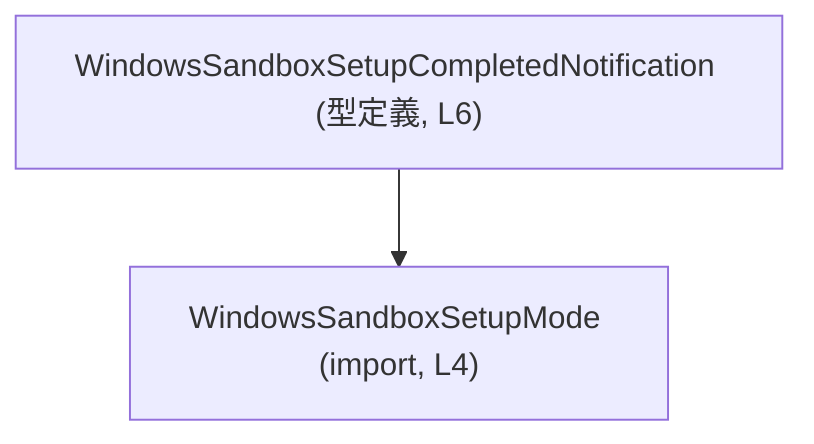
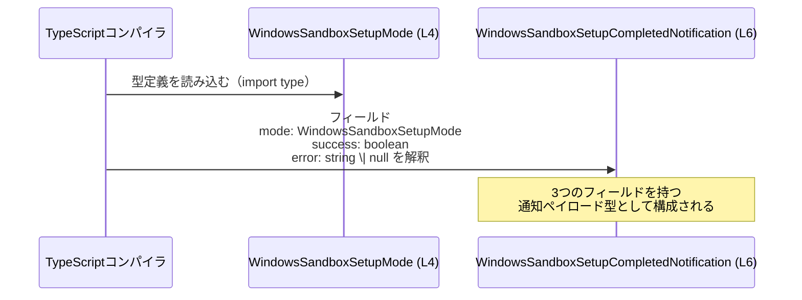

# app-server-protocol/schema/typescript/v2/WindowsSandboxSetupCompletedNotification.ts 解説

## 0. ざっくり一言

Windows サンドボックスのセットアップ完了を表す通知メッセージの **型定義**（TypeScript の型エイリアス）です。  
モード種別・成功可否・エラーメッセージをひとまとめにしたデータ構造を提供します。

---

## 1. このモジュールの役割

### 1.1 概要

- このモジュールは、Windows サンドボックスのセットアップ完了時にやり取りされる通知オブジェクトの **構造（スキーマ）** を定義します。
- 通知は以下の 3 要素から構成されます。
  - セットアップモード（`WindowsSandboxSetupMode` 型）
  - 成功したかどうか（`boolean`）
  - エラーメッセージ（`string | null`）

> これらのフィールドの具体的な意味や値の制約は、このファイル単体からは読み取れません。

### 1.2 アーキテクチャ内での位置づけ

このファイルは、TypeScript 用のプロトコルスキーマの 1 つであり、別ファイル `WindowsSandboxSetupMode` 型に依存しています。



- `WindowsSandboxSetupCompletedNotification` は `WindowsSandboxSetupMode` をフィールド型として参照する **単方向依存** になっています。
- このチャンクには、実際に通知を送受信するコードは含まれていないため、どのレイヤー（サーバー／クライアントなど）で使われるかは不明です。

### 1.3 設計上のポイント

- **コード生成物**  
  - 冒頭コメントにより、`ts-rs` によって Rust 側から生成されたコードであり、手動編集禁止であることが明示されています（L1–L3）。
- **型専用インポート**  
  - `import type` を使うことで、コンパイル後の JavaScript には依存が埋め込まれない型専用の依存関係になっています（L4）。
- **シンプルなデータキャリア**  
  - オブジェクトリテラル型による **純粋なデータ構造** であり、メソッドやロジックは持ちません（L6）。
- **エラー情報の表現**  
  - エラーは `string | null` で表現され、文字列と「エラーなし」を区別していますが、`success` との整合性ルールは型では表現されていません（L6）。

---

## 2. 主要な機能一覧

このモジュールが提供する主な機能（= 型）は 1 つです。

- `WindowsSandboxSetupCompletedNotification`: Windows サンドボックスセットアップ完了通知のデータ構造を定義する

---

## 3. 公開 API と詳細解説

このファイルには **関数は存在せず**、公開 API は型エイリアス 1 つのみです。

### 3.1 型一覧（構造体・列挙体など）

| 名前 | 種別 | 役割 / 用途 | 定義位置 |
|------|------|-------------|----------|
| `WindowsSandboxSetupCompletedNotification` | 型エイリアス（オブジェクト型） | Windows サンドボックスのセットアップ完了通知のペイロードを表現する | `WindowsSandboxSetupCompletedNotification.ts:L6-6` |

#### `WindowsSandboxSetupCompletedNotification`

```ts
// GENERATED CODE! DO NOT MODIFY BY HAND!

// This file was generated by [ts-rs](https://github.com/Aleph-Alpha/ts-rs). Do not edit this file manually.
import type { WindowsSandboxSetupMode } from "./WindowsSandboxSetupMode";

export type WindowsSandboxSetupCompletedNotification = {
  mode: WindowsSandboxSetupMode,
  success: boolean,
  error: string | null,
};
```

**フィールド構造**

| フィールド名 | 型 | 説明（コードから分かる範囲） | 根拠 |
|--------------|----|------------------------------|------|
| `mode` | `WindowsSandboxSetupMode` | セットアップのモードを表す列挙またはユニオン型と推測されますが、実体は別ファイルにあるため詳細不明です。 | L4, L6 |
| `success` | `boolean` | セットアップが成功したかどうかの真偽値です。 | L6 |
| `error` | `string \| null` | エラー発生時のメッセージ（文字列）。エラーがない場合は `null` として扱う想定です。 | L6 |

> `WindowsSandboxSetupMode` の実際の定義は、このチャンクには含まれていません。

### 3.2 関数詳細（最大 7 件）

このファイルには関数・メソッド定義がありません。  
そのため、このセクションに詳細解説すべき関数は存在しません。

- 関数数: 0 件（確認対象コード: L1–L6）

### 3.3 その他の関数

- 該当なし（補助関数・ラッパー関数も存在しません）。

---

## 4. データフロー

このファイル内では、実際の処理フローは定義されていませんが、**型レベルの依存関係** をシーケンス図風に表現します。



- この図は **コンパイル時** に `WindowsSandboxSetupCompletedNotification` がどのように `WindowsSandboxSetupMode` に依存しているかを示しています。
- 実行時のオブジェクト生成・送受信などの処理フローは、このチャンクには現れていないため不明です。

---

## 5. 使い方（How to Use）

### 5.1 基本的な使用方法

`WindowsSandboxSetupCompletedNotification` 型の値を生成し、アプリケーション内で利用する基本例です。

```ts
// 型定義をインポートする                    // 生成された型定義ファイルからインポート
import type {
  WindowsSandboxSetupCompletedNotification,
} from "./WindowsSandboxSetupCompletedNotification";
import type {
  WindowsSandboxSetupMode,
} from "./WindowsSandboxSetupMode";

// 通知オブジェクトを組み立てる              // セットアップ完了通知を作成する例
function makeSuccessNotification(
  mode: WindowsSandboxSetupMode,          // 呼び出し側で決めたモード
): WindowsSandboxSetupCompletedNotification {
  return {
    mode,                                 // どのモードでセットアップしたか
    success: true,                        // 成功したことを表す
    error: null,                          // 成功時なのでエラーは null
  };
}

// 利用例（例えば送信キューに積むなど）
// 具体的な送信処理はこのチャンクからは分からないため、ここでは省略しています。
```

このコードは、TypeScript の型チェックによって、`mode`・`success`・`error` が正しい型であることを保証します。

### 5.2 よくある使用パターン

1. **成功・失敗でフィールド値を切り替える**

```ts
function makeCompletedNotification(
  mode: WindowsSandboxSetupMode,
  result: { ok: boolean; message?: string },
): WindowsSandboxSetupCompletedNotification {
  return {
    mode,
    success: result.ok,
    error: result.ok ? null : (result.message ?? "Unknown error"),
  };
}
```

- 成功 (`result.ok === true`) の場合は `error` を `null` にする。
- 失敗の場合は `error` に何らかのメッセージを入れる。
- 型としてはどの組み合わせも許容されるため、こうしたルールはアプリケーション側で徹底する必要があります。

1. **受信側でエラー有無によって分岐する**

```ts
function handleNotification(
  notif: WindowsSandboxSetupCompletedNotification,
): void {
  if (notif.success) {                           // 成功時
    console.log("Sandbox setup completed:", notif.mode);
  } else {
    // error が null の可能性があるため、null チェックが必要
    console.error(
      "Sandbox setup failed:",
      notif.mode,
      notif.error ?? "(no error message)",
    );
  }
}
```

- `error` は `string | null` なので、使用前に `null` チェックを行う必要があります。

### 5.3 よくある間違い

```ts
// 間違い例: success と error の整合性が取れていない
const notifBad: WindowsSandboxSetupCompletedNotification = {
  mode,
  success: true,                         // 成功としながら…
  error: "something went wrong",         // エラー文字列が入っている
};

// 正しい例の一つ: 成功時は error を null にする
const notifOk: WindowsSandboxSetupCompletedNotification = {
  mode,
  success: true,
  error: null,
};
```

- 型システム上はどちらもコンパイルが通るため、**`success` と `error` の関係は開発者側の契約として運用する必要** があります。

### 5.4 使用上の注意点（まとめ）

- このファイルは生成コードであり、**直接編集すると再生成時に上書きされる** ことが明示されています（L1–L3）。
- `success` と `error` の論理的な整合性は型には埋め込まれておらず、**アプリケーション側のルール** として運用する必要があります。
- `error` は `string | null` であり、`undefined` ではないため、呼び出し側・受信側では `null` を前提とした分岐を行う必要があります。
- `import type` により、この型をインポートしても **実行時依存は発生しません**。ツリーシェイキングやバンドルサイズに影響しにくい設計です。
- 並行性やスレッド安全性に関する懸念は、このファイルにはありません（あくまで型定義のみのため）。

---

## 6. 変更の仕方（How to Modify）

### 6.1 新しい機能を追加する場合

このファイルは `ts-rs` により生成されるため、**直接変更すべきではありません**（L1–L3）。

- 新しいフィールドやモードを追加したい場合の一般的な手順は以下の通りです。
  1. Rust 側の元定義（おそらく `WindowsSandboxSetupCompletedNotification` に対応する構造体）を変更する。  
     ※ このチャンクには Rust 側ソースは含まれないため、具体的なパスは不明です。
  2. `ts-rs` によるコード生成プロセスを実行し、TypeScript スキーマを再生成する。
  3. 生成された TypeScript コード（このファイル）に新しいフィールドが反映される。

- 直接このファイルに手を入れた場合、次回のコード生成で変更が失われる可能性があります。

### 6.2 既存の機能を変更する場合

- 既存フィールドの名前変更・型変更・削除も、同様に **元となる Rust 側定義を変更して再生成** する必要があります。
- 影響範囲としては以下が考えられます。
  - `WindowsSandboxSetupCompletedNotification` を参照する全ての TypeScript コード
  - 通信プロトコル（サーバー・クライアント双方）の実装
- 契約上の注意:
  - `success` の意味（「セットアップ処理全体の成功か、一部ステップの成功か」など）は、このファイルからは分からないため、その意味を変える変更は他コンポーネントの前提を壊す可能性があります。
  - `error` の `null`／`string` の使い分けルールを変える場合は、受信側の分岐ロジックの見直しが必要になります。

---

## 7. 関連ファイル

| パス | 役割 / 関係 |
|------|------------|
| `app-server-protocol/schema/typescript/v2/WindowsSandboxSetupMode.ts` | `WindowsSandboxSetupCompletedNotification` の `mode` フィールドの型定義を提供する（L4 の `import type` の参照先）。 |
| （不明: Rust 側の元定義） | コメントから、この TypeScript ファイルは `ts-rs` により Rust から生成されることだけが分かりますが、具体的な Rust ファイルパスはこのチャンクからは分かりません。 |

---

## 付録: 安全性・エッジケース・テスト・性能に関する補足

### 言語固有の安全性 / エラー / 並行性

- **型安全性**  
  - TypeScript の静的型チェックにより、`mode` / `success` / `error` の型違反はコンパイル時に検出されます。
- **ヌル安全性**  
  - `error: string | null` によって、「エラーがない状態」が明示的に区別されており、`strictNullChecks` 有効時でも適切に扱えます。
- **並行性**  
  - このファイルは純粋な型定義のみであり、非同期処理や並行実行に関わるロジックは存在しません。

### Contracts / Edge Cases

コードから導ける契約とエッジケースは次の通りです。

- 契約（この型の自然な前提と考えられること）
  - `success === true` の場合、`error` は論理的には `null` であることが期待されます（ただし型では強制されません）。
  - `success === false` の場合、`error` に何らかの説明が入っていることが期待されます。
- エッジケース
  - `success === true && error !== null`  
    - 型上は許容されますが、意味的には不自然な状態です。
  - `success === false && error === null`  
    - 失敗しているがエラーメッセージが無い状態であり、ログやユーザー通知に支障が出る可能性があります。
  - `error === ""`（空文字）  
    - 型上は有効ですが、`null` との役割分担をどうするかはアプリケーションの設計次第です。

### Bugs / Security

- このファイル単体にはロジックがなく、バグやセキュリティホールにつながる処理は存在しません。
- セキュリティ上のポイントは、**誤った `success` / `error` の組み合わせ** により監視やログが誤解を招く可能性がある程度です（例: 本当は失敗しているのに `success: true` が送られるなど）。  
  これはこの型よりも、値を生成する側のロジックの問題です。

### Tests

- このチャンクにはテストコードは含まれていません。
- 型定義に対するテストは通常、**この型を使う上位ロジックのテスト** として書かれることが多く、ここからは具体的なテスト戦略は分かりません。

### Performance / Scalability

- このファイルはコンパイル時の型レベル情報のみであり、実行時のパフォーマンスやスケーラビリティに直接の影響はありません。
- 実行時に生成されるオブジェクトも、3 フィールドのみの小さな構造なので、一般的な利用においてコストは軽微です。

### Tradeoffs / Refactoring / Observability（簡潔に）

- **Tradeoffs**  
  - `success` と `error` を完全に独立したフィールドとして持つ設計はシンプルな一方、両者の整合性が型で表現されないというトレードオフがあります。
- **Refactoring の方向性（もし変更するなら）**  
  - 例えば `success` が `false` のときのみ `error` を許可するような **判別共用体（discriminated union）** で表現することもできますが、このファイルは生成物のため、そのような変更は Rust 側定義で行う必要があります。
- **Observability**  
  - ログやモニタリングでこの型をシリアライズして扱う場合、`success` と `error` の関係性を使ってアラート条件を定義することが考えられますが、具体的な利用方法はこのチャンクからは分かりません。
