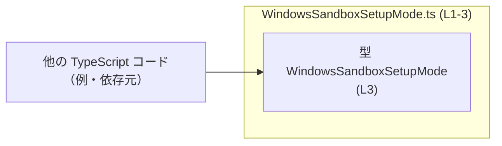
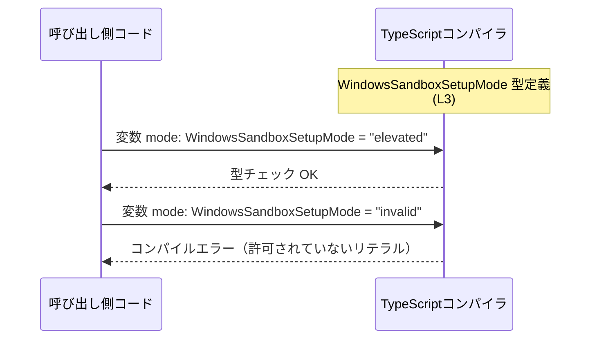

# app-server-protocol/schema/typescript/v2/WindowsSandboxSetupMode.ts コード解説

## 0. ざっくり一言

このファイルは、Windows サンドボックスのセットアップモードを表す TypeScript の文字列リテラル型 `WindowsSandboxSetupMode` を自動生成コードとして 1 つだけ公開するモジュールです（WindowsSandboxSetupMode.ts:L1-3）。

---

## 1. このモジュールの役割

### 1.1 概要

- 自動生成された TypeScript コードとして、`WindowsSandboxSetupMode` 型を定義しています（WindowsSandboxSetupMode.ts:L1-3）。
- `WindowsSandboxSetupMode` は `"elevated"` または `"unelevated"` の 2 つの文字列だけを許可するユニオン型（列挙的な文字列型）です（WindowsSandboxSetupMode.ts:L3-3）。

### 1.2 アーキテクチャ内での位置づけ

- このモジュールは、型エイリアスを `export` するだけの純粋な型定義モジュールです。  
  他のモジュールへの `import` や実行時ロジックは存在しません（WindowsSandboxSetupMode.ts:L3-3）。
- コメントから、このファイルは `ts-rs` によって生成されており、手動編集しない前提の「スキーマ定義の一部」として利用される位置づけであることが分かります（WindowsSandboxSetupMode.ts:L1-2）。

> このチャンクには、この型がどのモジュールから import されているかは現れていません。

概念的な依存関係イメージ（実際の依存元ファイルはこのチャンクからは不明です）:



※ この図は、`WindowsSandboxSetupMode` 型が他モジュールから参照される典型的な構図のイメージであり、実際の依存関係はこのチャンクからは特定できません。

### 1.3 設計上のポイント

- **自動生成コード**  
  - `// GENERATED CODE! DO NOT MODIFY BY HAND!` というコメントから、手作業での変更は禁止されている設計です（WindowsSandboxSetupMode.ts:L1-2）。
- **責務の単一性**  
  - 1 つの型 `WindowsSandboxSetupMode` のみを公開し、それ以外のロジックや状態、関数は定義していません（WindowsSandboxSetupMode.ts:L3-3）。
- **型安全性重視の設計**  
  - 汎用 `string` ではなく `"elevated" | "unelevated"` のようにリテラルユニオン型を用いることで、コンパイル時に値の取りうる範囲を制約しています（WindowsSandboxSetupMode.ts:L3-3）。
- **エラー・並行性**  
  - 実行時コード（関数・クラス）が存在しないため、このファイル単体では実行時エラー処理や並行性（スレッド・非同期）に関する考慮点はありません（WindowsSandboxSetupMode.ts:L3-3）。

---

## 2. 主要な機能一覧

このモジュールが提供する「機能」は 1 つの型定義に集約されています。

- `WindowsSandboxSetupMode` 型: `"elevated"` または `"unelevated"` の 2 値に絞られた文字列リテラルユニオン型（WindowsSandboxSetupMode.ts:L3-3）

---

## 3. 公開 API と詳細解説

### 3.1 型一覧（構造体・列挙体など）

| 名前                      | 種別                           | 役割 / 用途                                                                 | 定義箇所                           |
|---------------------------|--------------------------------|------------------------------------------------------------------------------|------------------------------------|
| `WindowsSandboxSetupMode` | 型エイリアス（string リテラルユニオン） | Windows サンドボックスのセットアップモードを `"elevated"` / `"unelevated"` の 2 通りに制約するための型 | WindowsSandboxSetupMode.ts:L3-3 |

#### `WindowsSandboxSetupMode` の意味

- 実体は次の型エイリアスです（WindowsSandboxSetupMode.ts:L3-3）。

```typescript
export type WindowsSandboxSetupMode = "elevated" | "unelevated"; // (L3)
```

- `WindowsSandboxSetupMode` を型として用いることで、変数・関数引数・オブジェクトプロパティなどに、2 つの文字列リテラル以外を代入するとコンパイルエラーになります。

### 3.2 関数詳細（最大 7 件）

- このファイルには関数・メソッド・クラスは定義されていません（WindowsSandboxSetupMode.ts:L1-3）。
- したがって、「関数詳細」の対象となる公開 API はありません。

### 3.3 その他の関数

- 補助関数やラッパー関数も定義されていません（WindowsSandboxSetupMode.ts:L1-3）。

---

## 4. データフロー

このファイル自体には実行時処理はありませんが、`WindowsSandboxSetupMode` 型の値がどのように扱われるかの典型的な「型レベルの流れ」の例を示します。

### 4.1 型チェックにおけるデータの流れ（例）

- `WindowsSandboxSetupMode` 型定義を TypeScript コンパイラが読み込みます（WindowsSandboxSetupMode.ts:L3-3）。
- 開発者が変数や引数にこの型を付けると、コンパイル時に代入される文字列が `"elevated"` または `"unelevated"` かどうかをチェックします。



- 上記は TypeScript の一般的な型チェックの流れを示す例であり、実際の呼び出し元コードの構造はこのチャンクからは分かりません。

---

## 5. 使い方（How to Use）

### 5.1 基本的な使用方法

`WindowsSandboxSetupMode` を変数や関数の引数・戻り値の型として利用することで、許可されるモード名を 2 通りに制限できます（WindowsSandboxSetupMode.ts:L3-3）。

```typescript
// インポートパスはプロジェクト構成によって異なります。
// 以下はあくまで一例であり、このファイルから正確なパスは確定できません。
import type { WindowsSandboxSetupMode } from "./WindowsSandboxSetupMode"; // 例

// Windows サンドボックスのセットアップモードを表す変数
let mode: WindowsSandboxSetupMode = "elevated";  // OK

// コンパイルエラーの例（コメントアウトを外すとエラー）
// mode = "admin";  // エラー: Type '"admin"' is not assignable to type 'WindowsSandboxSetupMode'.
```

このようにすることで、誤ったモード名をコード上で入力したときに、コンパイル時に検出できます。

### 5.2 よくある使用パターン

#### 1) 設定オブジェクトのプロパティとして利用

```typescript
import type { WindowsSandboxSetupMode } from "./WindowsSandboxSetupMode"; // 例

interface SandboxConfig {
    setupMode: WindowsSandboxSetupMode; // "elevated" または "unelevated" のみ許可
}

const config: SandboxConfig = {
    setupMode: "unelevated",           // OK
    // setupMode: "default",           // コンパイルエラーの例
};
```

#### 2) 関数の引数・戻り値として利用

```typescript
import type { WindowsSandboxSetupMode } from "./WindowsSandboxSetupMode"; // 例

// セットアップモードを受け取る関数
function setupSandbox(mode: WindowsSandboxSetupMode) {
    // mode は "elevated" | "unelevated" のいずれか
}

// 呼び出し側
setupSandbox("elevated");   // OK
// setupSandbox("admin");   // コンパイルエラー
```

### 5.3 よくある間違い（想定）

この型に関する誤用のパターンの例です（TypeScript の一般的な誤り方）。

```typescript
import type { WindowsSandboxSetupMode } from "./WindowsSandboxSetupMode"; // 例

// 誤り例 1: 汎用 string をそのまま代入しようとする
function fromUserInput(input: string): WindowsSandboxSetupMode {
    // return input;                         // エラー: 'string' は 'WindowsSandboxSetupMode' に代入できない
    return input as WindowsSandboxSetupMode;  // 型アサーションで無理に通すと、型安全性が失われる
}

// 正しい例: ランタイムチェックを挟む
function safeFromUserInput(input: string): WindowsSandboxSetupMode | null {
    if (input === "elevated" || input === "unelevated") {
        return input;    // この時点で 'input' はリテラル型に絞られる
    }
    return null;         // 想定外の値は null などで扱う
}
```

### 5.4 使用上の注意点（まとめ）

- **ランタイム値の検証が必要**  
  外部入力（ユーザー入力やネットワークからの値など）をこの型に割り当てる場合、TypeScript の型チェックだけでは不十分で、実行時にも `"elevated"` / `"unelevated"` であることを確認する必要があります。  
  型アサーション（`as WindowsSandboxSetupMode`）で無理に通すと、実行時に想定外の文字列が紛れ込み得ます。
- **自動生成コードを直接編集しない**  
  ファイル先頭のコメントに「手で編集しないこと」が明示されています（WindowsSandboxSetupMode.ts:L1-2）。  
  仕様変更（モードの追加・名称変更など）は、このファイルではなく生成元（ts-rs 側の設定や元の定義）で行うのが前提です。
- **並行性の問題は存在しない**  
  型定義のみであり、状態や実行時処理を持たないため、このファイルに起因する並行性の問題はありません（WindowsSandboxSetupMode.ts:L3-3）。

---

## 6. 変更の仕方（How to Modify）

### 6.1 新しいモードを追加したい場合

- コメントにより、このファイルは `ts-rs` による自動生成であり、手作業での編集が禁止されていることが分かります（WindowsSandboxSetupMode.ts:L1-2）。
- したがって、`"elevated"` / `"unelevated"` 以外のモードを追加したい場合は、**このファイルではなく生成元の定義** を変更して再生成する必要があります。
  - 生成元（通常は Rust 側の型定義など）は、このチャンクには現れていないため、正確な場所は不明です。

### 6.2 既存の機能を変更する場合の注意

- 型の意味・許可される値を変えることは、プロジェクト全体で `WindowsSandboxSetupMode` を利用している箇所に影響を与える可能性があります。
- 具体的な影響箇所（どこで import されているか）は、このチャンクからは分かりませんが、一般的には以下を確認する必要があります。
  - `WindowsSandboxSetupMode` を import している全てのファイル
  - その型を引数や戻り値として利用している関数・クラス
- このファイルにはテストコードは含まれておらず（WindowsSandboxSetupMode.ts:L1-3）、関連するテストの有無や場所は不明です。変更後は、関連テスト（存在する場合）を再実行する必要があります。

---

## 7. 関連ファイル

このチャンクから直接確認できる関連ファイルはありませんが、コメントから推測できる範囲で整理します。

| パス | 役割 / 関係 |
|------|------------|
| （不明） | コメントより、このファイルは `ts-rs` によって生成されていることが分かりますが、生成元（Rust 側など）のファイルパスはこのチャンクには現れていません（WindowsSandboxSetupMode.ts:L1-2）。 |
| （不明） | `WindowsSandboxSetupMode` 型を import して利用している TypeScript ファイルは、このチャンクには現れていません（WindowsSandboxSetupMode.ts:L3-3）。 |

---

## コンポーネントインベントリー（まとめ）

このファイル内のコンポーネントを一覧で整理します。

| 種別       | 名前                      | 説明                                                                                   | 定義箇所                           |
|------------|---------------------------|----------------------------------------------------------------------------------------|------------------------------------|
| モジュール | `WindowsSandboxSetupMode.ts` | 自動生成された TypeScript モジュール。型 `WindowsSandboxSetupMode` を 1 つ export する。 | WindowsSandboxSetupMode.ts:L1-3   |
| 型エイリアス | `WindowsSandboxSetupMode`   | `"elevated"` または `"unelevated"` の 2 つの文字列だけを許可するユニオン型。           | WindowsSandboxSetupMode.ts:L3-3   |

---

## 契約・エッジケース・安全性に関する要点

- **契約（Contract）**
  - `WindowsSandboxSetupMode` 型の値は `"elevated"` または `"unelevated"` のいずれかである、というコンパイル時の契約を表します（WindowsSandboxSetupMode.ts:L3-3）。
- **エッジケース**
  - 外部から任意の `string` が入力される場合、そのまま `WindowsSandboxSetupMode` に代入することはできません。  
    ランタイムチェックを行わずに `as WindowsSandboxSetupMode` でキャストすると、契約が破られ、実行時に想定外の値が紛れ込む可能性があります。
- **バグ・セキュリティ**
  - 型レベルでは安全ですが、**ランタイム検証を省略した型アサーションの濫用** はバグやセキュリティ上の問題（不正なモードでの処理実行など）につながり得ます。
- **並行性**
  - 実行時の処理や共有状態を持たないため、この型定義単体が原因となるスレッド安全性の問題はありません。

以上が、本チャンクに含まれる情報に基づく `WindowsSandboxSetupMode.ts` の解説です。
