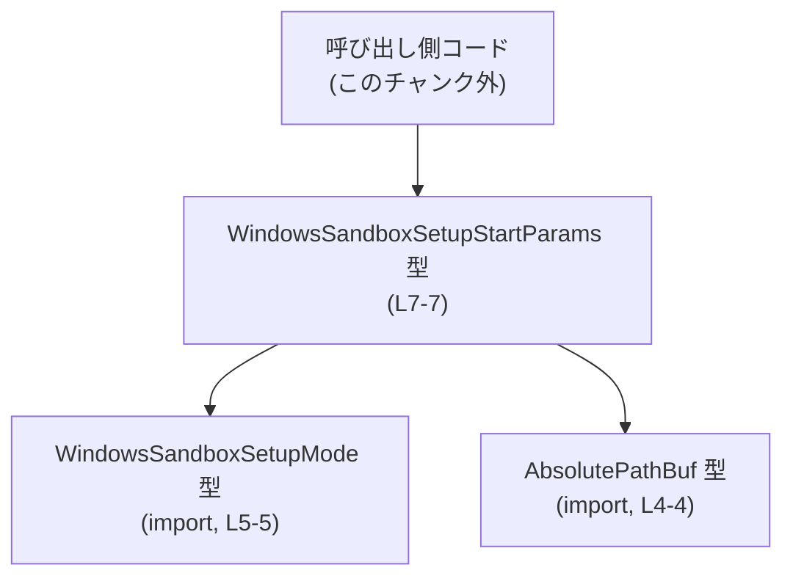
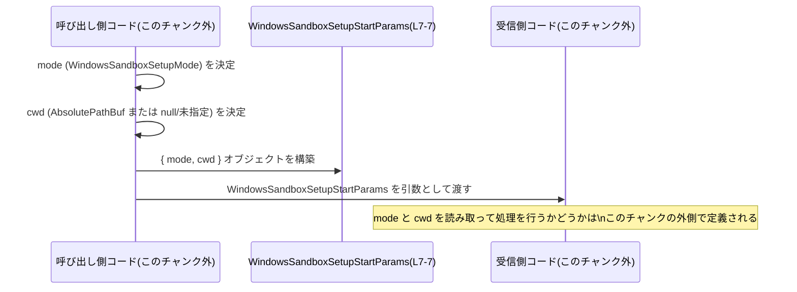

# app-server-protocol/schema/typescript/v2/WindowsSandboxSetupStartParams.ts コード解説

## 0. ざっくり一言

- `WindowsSandboxSetupStartParams.ts` は、`WindowsSandboxSetupStartParams` という **パラメータオブジェクト用の TypeScript 型エイリアス**を 1 つだけ定義する、自動生成ファイルです（WindowsSandboxSetupStartParams.ts:L1-3, L7-7）。
- この型は、`mode`（`WindowsSandboxSetupMode` 型）と、オプションの `cwd`（`AbsolutePathBuf | null` 型）という 2 つのフィールドを持つオブジェクトの形を表現します（WindowsSandboxSetupStartParams.ts:L4-5, L7-7）。

---

## 1. このモジュールの役割

### 1.1 概要

- ファイル先頭のコメントから、このファイルは Rust の `ts-rs` ツールによって自動生成された TypeScript 型定義であることが分かります（WindowsSandboxSetupStartParams.ts:L1-3）。
- `WindowsSandboxSetupStartParams` 型は、`mode` と `cwd` という 2 つのフィールドからなるオブジェクトの構造を定義し、**ある種の「Windows サンドボックスセットアップ開始」に関するパラメータ**を表していると考えられますが、用途の詳細はこのチャンクからは断定できません（WindowsSandboxSetupStartParams.ts:L7-7）。
- ここには **ランタイムロジックや関数は一切なく、純粋に型情報のみ**が定義されています（WindowsSandboxSetupStartParams.ts 全体）。

### 1.2 アーキテクチャ内での位置づけ

- ディレクトリパス `schema/typescript/v2` から、この型が **アプリケーションサーバープロトコルの TypeScript スキーマ（第 2 世代など）の一部**であることが示唆されますが、他ファイルがないため、具体的なプロトコルや API 名はこのチャンクからは分かりません。
- 型は 2 つの外部型 `AbsolutePathBuf` と `WindowsSandboxSetupMode` に依存しており、`import type` により **コンパイル時の型情報だけを参照する**構造になっています（WindowsSandboxSetupStartParams.ts:L4-5）。

依存関係を簡易的なグラフで表すと、次のようになります。



この図は、「呼び出し側コード」が `WindowsSandboxSetupStartParams` 型を利用し、その内部で `WindowsSandboxSetupMode` と `AbsolutePathBuf` 型が使われている、という依存方向を示しています。

### 1.3 設計上のポイント

- **自動生成ファイル**  
  - 冒頭コメントで「GENERATED CODE」「Do not edit this file manually」と明示されています（WindowsSandboxSetupStartParams.ts:L1-3）。
  - 型の追加・変更は通常、生成元（Rust 側の型）で行われ、このファイルは再生成される設計と考えられます。
- **データ専用の型定義**  
  - `export type ... = { ... }` のみが定義されており、関数やクラスは存在しません（WindowsSandboxSetupStartParams.ts:L7-7）。
  - ランタイムの副作用や状態管理、エラー処理、並行性制御には関与しません。
- **型専用のインポート**  
  - `import type` 構文を用いており、依存する 2 つの型はコンパイル時にのみ参照され、JavaScript には出力されません（WindowsSandboxSetupStartParams.ts:L4-5）。
- **オプショナル + null の 3 状態表現**  
  - `cwd?: AbsolutePathBuf | null` により、「プロパティがない（`undefined` 相当）」「`null`」「実際のパス値」の 3 状態を区別できる形になっています（WindowsSandboxSetupStartParams.ts:L7-7）。
- **並行性・エラー安全性**  
  - 型定義のみのため、スレッドセーフティや実行時エラー挙動は一切規定しません。これらは型を利用するコード側の実装に依存します。

---

## 2. 主要な機能一覧（コンポーネントインベントリー）

このファイルに含まれる「機能」は、すべて型定義レベルのものです。

- WindowsSandboxSetupStartParams 型の定義  
  - `mode` と `cwd` から構成されるパラメータオブジェクトの構造を表す（WindowsSandboxSetupStartParams.ts:L7-7）。
- 依存型の参照  
  - `AbsolutePathBuf` 型と `WindowsSandboxSetupMode` 型をインポートし、`WindowsSandboxSetupStartParams` のフィールド型として利用する（WindowsSandboxSetupStartParams.ts:L4-5）。

---

## 3. 公開 API と詳細解説

### 3.1 型一覧（構造体・列挙体など）

このファイルで直接または間接的に関係する主な型の一覧です。

| 名前                        | 種別                          | 役割 / 用途                                                                                                                | 定義/参照箇所                               |
|---------------------------|-----------------------------|---------------------------------------------------------------------------------------------------------------------------|--------------------------------------------|
| `WindowsSandboxSetupStartParams` | 型エイリアス（オブジェクト型） | `mode` とオプションの `cwd` を持つパラメータオブジェクトの構造を表現する。用途は型名から Windows サンドボックスセットアップ開始関連と推測されるが、コードだけでは断定できない | 定義: WindowsSandboxSetupStartParams.ts:L7-7 |
| `AbsolutePathBuf`         | 型（インポートのみ）          | `cwd` フィールドの型として参照される。名前から絶対パスを表す型と推測されるが、このチャンクには実体が現れない                                                  | 参照: WindowsSandboxSetupStartParams.ts:L4-4 |
| `WindowsSandboxSetupMode` | 型（インポートのみ）          | `mode` フィールドの型として参照される。サンドボックスセットアップモードを表す列挙型またはユニオン型と推測されるが、実体はこのチャンクには現れない                | 参照: WindowsSandboxSetupStartParams.ts:L5-5 |

#### WindowsSandboxSetupStartParams

**概要**

- `WindowsSandboxSetupStartParams` は、`mode` と `cwd` という 2 つのフィールドを持つオブジェクト型の TypeScript 型エイリアスです（WindowsSandboxSetupStartParams.ts:L7-7）。
- 型名から、Windows サンドボックスのセットアップを開始する際のパラメータを表していると推測されますが、具体的な API や処理内容はこのチャンクからは分かりません。

**フィールド**

| フィールド名 | 型                             | 必須か                  | 説明 |
|-------------|---------------------------------|-------------------------|------|
| `mode`      | `WindowsSandboxSetupMode`       | 必須                    | セットアップモードを表す値。`?` が付いていないため必須フィールドであり、指定しないと TypeScript の型チェックでエラーになります（WindowsSandboxSetupStartParams.ts:L7-7）。 |
| `cwd`       | `AbsolutePathBuf \| null`       | オプション（`cwd?`）    | `cwd` プロパティ自体がオプションであり、かつ値として `null` も許容されます（WindowsSandboxSetupStartParams.ts:L7-7）。命名からは「カレントワーキングディレクトリ」を表す可能性が高いですが、実際の意味はこのチャンクでは不明です。 |

**内部処理の流れ（アルゴリズム）**

- この型は **純粋な型定義**であり、アルゴリズムや実行時処理は存在しません（WindowsSandboxSetupStartParams.ts:L7-7）。
- したがって、エラーハンドリング、条件分岐、ループなどは一切含まれません。

**Errors / Panics（型レベル）**

実行時エラーやパニックはありませんが、TypeScript の型チェック時に以下のようなエラーが発生しうる構造です。

- `mode` を指定しない場合  
  - `mode` は必須フィールドのため、オブジェクトリテラルから省略すると型エラーになります（WindowsSandboxSetupStartParams.ts:L7-7）。
- `mode` に別の型を割り当てた場合  
  - 例えば `string` や `number` を代入すると、`WindowsSandboxSetupMode` との不一致でコンパイルエラーになります（WindowsSandboxSetupStartParams.ts:L7-7）。
- `cwd` に `AbsolutePathBuf` でも `null` でもない値を渡した場合  
  - 例えば `cwd: 123` のような値は `AbsolutePathBuf | null` と互換性がないため、型エラーになります（WindowsSandboxSetupStartParams.ts:L7-7）。

**Edge cases（エッジケース）**

`cwd` は「オプショナル + null」を取るため、少なくとも以下の 3 状態が区別可能です（WindowsSandboxSetupStartParams.ts:L7-7）。

- `cwd` プロパティ自体が存在しない（省略されている）  
  - 例: `{ mode }` のように `cwd` を指定しないケース。
- `cwd` が `null` に明示的に設定されている  
  - 例: `{ mode, cwd: null }`。
- `cwd` が `AbsolutePathBuf` 型の値で設定されている  
  - 例: `{ mode, cwd: somePathBuf }`（`somePathBuf` の実体はこのチャンクには現れません）。

これら 3 状態が **受信側でどう解釈されるか**（例: `undefined` と `null` を区別するかどうか）は、このファイルからは分かりません。  

また、`mode` については、許容される値のバリエーション（列挙値やユニオンの構成）は `WindowsSandboxSetupMode` の定義がこのチャンクにないため不明です（WindowsSandboxSetupStartParams.ts:L5-5）。

**使用上の注意点（型レベル・安全性）**

- `mode` は必須であるため、常に `WindowsSandboxSetupMode` 型の値を用意してからオブジェクトを構築する必要があります（WindowsSandboxSetupStartParams.ts:L7-7）。
- `cwd` はプロパティの有無と、`null` と、有効な `AbsolutePathBuf` の 3 パターンがありうるため、**利用側はこれらの違いを意識する必要があります**（WindowsSandboxSetupStartParams.ts:L7-7）。  
  - 例: 「`cwd` が未指定ならデフォルトディレクトリを使う」「`null` なら明示的にディレクトリなし扱いにする」などのポリシーは、このファイルでは規定されていません。
- `import type` によって依存型はランタイムに現れないため、**実行時にはこの型による検査は一切行われません**（WindowsSandboxSetupStartParams.ts:L4-5）。  
  - 外部から JSON などで渡されるデータをこの型として扱う場合、実行時バリデーションは別途必要になります。

### 3.2 関数詳細（最大 7 件）

- このファイルには関数定義が存在せず、公開 API は `WindowsSandboxSetupStartParams` 型のみです（WindowsSandboxSetupStartParams.ts 全体）。
- したがって、関数詳細テンプレートに従った説明対象の関数はありません。

### 3.3 その他の関数

- 補助関数やラッパー関数も定義されていません（WindowsSandboxSetupStartParams.ts 全体）。

---

## 4. データフロー

この型がどのように利用されるかについて、**一般的な利用イメージ**に基づきデータフローを図示します。  
実際の呼び出し元・呼び出し先の署名や関数名はこのチャンクには現れないため、以下はあくまで典型的な使用像の説明です。



要点:

- **呼び出し側コード**が `mode` と `cwd` を準備し、`WindowsSandboxSetupStartParams` 型のオブジェクトを構築する（WindowsSandboxSetupStartParams.ts:L7-7）。
- そのオブジェクトが、何らかの関数・メソッド・RPC 呼び出し等の「受信側コード」に引き渡されると考えられますが、具体的な API はこのチャンクには現れません。
- ランタイムの並行性（例えば非同期処理やスレッド間通信）は、この型自体には埋め込まれておらず、利用側の設計に依存します。

---

## 5. 使い方（How to Use）

### 5.1 基本的な使用方法

このセクションでは、**別ファイルからこの型を利用してパラメータオブジェクトを構築する**典型的な例を示します。  
インポートパスは、このファイルと同じディレクトリからの相対パスを想定した一例です。

```typescript
// WindowsSandboxSetupStartParams 型をインポートする                           // 同一ディレクトリからの相対パスの例
import type { WindowsSandboxSetupStartParams } from "./WindowsSandboxSetupStartParams";

// 依存する型もインポートする                                                  // 実際のプロジェクトでも同様に import type が使われることが多い
import type { WindowsSandboxSetupMode } from "./WindowsSandboxSetupMode";
import type { AbsolutePathBuf } from "../AbsolutePathBuf";

// どこか別の処理で決定されたセットアップモード                             // 実際の値はこのチャンクには定義されていない
declare const mode: WindowsSandboxSetupMode;

// どこか別の処理で取得した絶対パス                                           // AbsolutePathBuf の具体的な中身はこのチャンクからは不明
declare const projectDir: AbsolutePathBuf;

// WindowsSandboxSetupStartParams 型の値を構築する                             // mode は必須、cwd はオプション
const params: WindowsSandboxSetupStartParams = {
    mode,                                                                     // 必須フィールド
    cwd: projectDir,                                                          // オプションフィールドだがここでは指定
};

// 必要に応じて、別の関数や RPC 呼び出しに params を渡して利用する           // 呼び出し先のシグネチャはこのチャンクには現れない
```

`cwd` を省略したり、`null` を明示的に指定することもできます。

```typescript
declare const mode: WindowsSandboxSetupMode;

// cwd を省略した例                                                            // cwd はオプションなので省略しても型エラーにならない
const paramsWithoutCwd: WindowsSandboxSetupStartParams = {
    mode,
};

// cwd を null にする例                                                        // 「明示的にディレクトリなし」といった意味で使われる可能性がある
const paramsWithNullCwd: WindowsSandboxSetupStartParams = {
    mode,
    cwd: null,
};
```

### 5.2 よくある使用パターン

この型の構造から、想定される代表的な使用パターンは次のようになります。

1. **`cwd` を指定するパターン**（作業ディレクトリを明示的に設定する場合と推測）

   ```typescript
   declare const mode: WindowsSandboxSetupMode;
   declare const workDir: AbsolutePathBuf;

   const params: WindowsSandboxSetupStartParams = {
       mode,             // 必須フィールド
       cwd: workDir,     // 何らかの絶対パスを指定
   };
   ```

2. **`cwd` を省略するパターン**

   ```typescript
   declare const mode: WindowsSandboxSetupMode;

   const params: WindowsSandboxSetupStartParams = {
       mode,             // cwd を省略
   };
   ```

3. **`cwd` を `null` として渡すパターン**

   ```typescript
   declare const mode: WindowsSandboxSetupMode;

   const params: WindowsSandboxSetupStartParams = {
       mode,
       cwd: null,        // 意味は利用側の実装に依存
   };
   ```

これら 3 パターンの挙動（特に省略と `null` の違い）がどのように扱われるかは、受信側のロジック次第であり、このチャンクには現れません。

### 5.3 よくある間違い

TypeScript の型チェックという観点で、起こりやすいミスの例を挙げます。

```typescript
import type { WindowsSandboxSetupStartParams } from "./WindowsSandboxSetupStartParams";

// 間違い例: 必須フィールド mode を省略している
const badParams1: WindowsSandboxSetupStartParams = {
    // mode: ... がないためコンパイルエラーになる                            // mode は必須（WindowsSandboxSetupStartParams.ts:L7-7）
    // cwd: ... だけでは不十分
    // cwd: somePath,
};

// 間違い例: cwd に許容されない型を渡している
const badParams2: WindowsSandboxSetupStartParams = {
    mode: {} as any,                                                           // mode も本来は WindowsSandboxSetupMode 型である必要がある
    cwd: 123 as any,                                                           // number は AbsolutePathBuf | null と互換性がない
};
```

- `mode` を省略すると、TypeScript の型チェックで構造の不整合が検出されます（WindowsSandboxSetupStartParams.ts:L7-7）。
- `cwd` に `AbsolutePathBuf` でも `null` でもない値を渡すと、同様に型エラーとなります（WindowsSandboxSetupStartParams.ts:L7-7）。

### 5.4 使用上の注意点（まとめ）

- **必須フィールド `mode`**  
  - `mode` は必須フィールドであり、常に `WindowsSandboxSetupMode` 型の値を設定する前提になっています（WindowsSandboxSetupStartParams.ts:L7-7）。
- **`cwd` の 3 状態（未指定 / `null` / 値あり）**  
  - `cwd?: AbsolutePathBuf | null` という定義により、プロパティの有無と `null` を区別できます（WindowsSandboxSetupStartParams.ts:L7-7）。  
  - 利用側のコードでは、これらの状態を区別して扱うかどうかを明確に決める必要があります。
- **実行時バリデーションは別途必要**  
  - この型はコンパイル時のチェックのみを提供し、実行時に JSON 等から渡されたデータを自動検証する仕組みはありません（WindowsSandboxSetupStartParams.ts:L4-5, L7-7）。  
  - セキュリティ（パストラバーサル対策など）や入力妥当性検証は、この型を利用するコードで行う必要があります。
- **並行性**  
  - 型定義のみのため、スレッドセーフティや非同期処理に関する制約や保証はここにはありません。並行環境での利用可否は、この型を保持・操作するコンポーネントの実装に依存します。

---

## 6. 変更の仕方（How to Modify）

### 6.1 新しい機能を追加する場合

- ファイルの冒頭に「GENERATED CODE」「Do not edit this file manually」と書かれていることから（WindowsSandboxSetupStartParams.ts:L1-3）、**このファイル自体を直接編集することは想定されていない**ことが分かります。
- 通常、このような `ts-rs` 生成ファイルに新しいフィールドや機能を追加する場合は、次のようなフローになると考えられます（ただし、生成元コードはこのチャンクには現れません）。
  1. Rust 側の元定義（構造体や型）に、新しいフィールド（例: `extra_options` のようなフィールド）を追加する。  
  2. `ts-rs` のコード生成プロセスを実行し、この TypeScript ファイルを再生成する。  
  3. 再生成された `WindowsSandboxSetupStartParams` に、新しいフィールドが反映される。
- 具体的な Rust 側の型名やファイルパス、生成コマンドは、このチャンクからは分かりません。

### 6.2 既存の機能を変更する場合

- `WindowsSandboxSetupStartParams` の構造（`mode` の型変更や `cwd` の必須化など）を変更する場合も、同様に **生成元の Rust 型を変更し、再生成する**必要があります（WindowsSandboxSetupStartParams.ts:L1-3）。
- 変更時に注意すべき点:

  - **契約の変更**  
    - `cwd` を必須に変更する、`null` を許容しないようにする等は、クライアントコードとの契約変更になります。`WindowsSandboxSetupStartParams` に依存するすべての呼び出し箇所を確認する必要があります（呼び出しコードはこのチャンクには現れません）。
  - **依存型の変更**  
    - `WindowsSandboxSetupMode` や `AbsolutePathBuf` の定義を変更した場合も、この型の意味や許容される値が変わるため、影響範囲の調査が必要です（WindowsSandboxSetupStartParams.ts:L4-5）。
  - **テスト**  
    - このチャンクにはテストコードが含まれていないため、どのようなテストが存在するかは不明です。変更後は、関連する単体テストや統合テストを確認・更新する必要があります。

---

## 7. 関連ファイル

このモジュールと直接関係しているファイルは、インポートされている 2 つの型定義ファイルです。

| パス                                | 役割 / 関係 |
|------------------------------------|-------------|
| `app-server-protocol/schema/typescript/v2/AbsolutePathBuf.ts`（と推測されるパス） | `AbsolutePathBuf` 型を定義しているファイルと考えられますが、このチャンクには内容が現れません。`cwd` フィールドの型として参照されています（WindowsSandboxSetupStartParams.ts:L4-4）。 |
| `app-server-protocol/schema/typescript/v2/WindowsSandboxSetupMode.ts` | `WindowsSandboxSetupMode` 型を定義しているファイルと考えられますが、このチャンクには内容が現れません。`mode` フィールドの型として参照されています（WindowsSandboxSetupStartParams.ts:L5-5）。 |

※ 上記パスは、インポート文の相対パスから **推測される** ものであり、実際のファイル構成はプロジェクト全体を確認しないと断定できません。  
このチャンクには、テストコードやこの型を利用する呼び出し側のコードは現れないため、それらのファイルとの関係は不明です。
