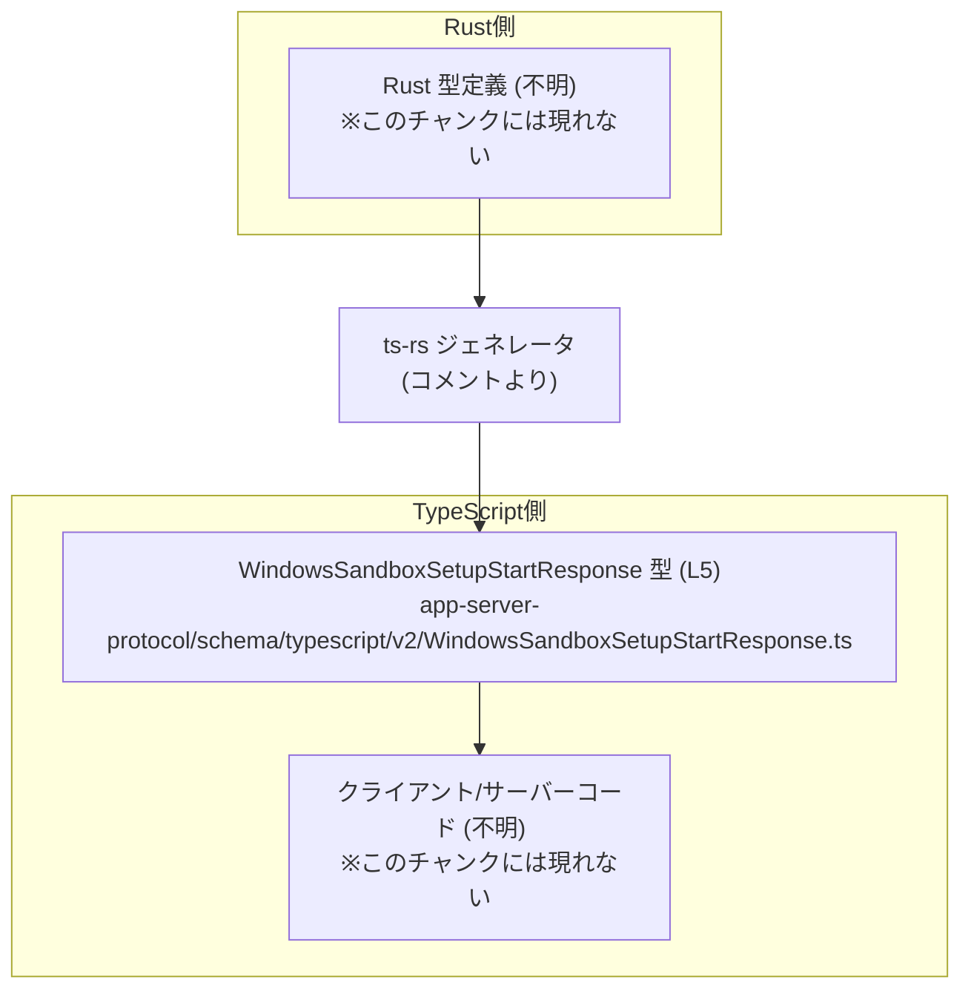
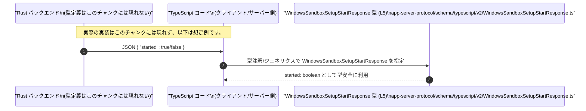

# app-server-protocol/schema/typescript/v2/WindowsSandboxSetupStartResponse.ts コード解説

## 0. ざっくり一言

- Windows サンドボックスのセットアップ開始処理に対するレスポンスを表現する、TypeScript の型エイリアス（オブジェクト型）を 1 つ定義しているファイルです（`WindowsSandboxSetupStartResponse` 型、`started: boolean` プロパティ）（`WindowsSandboxSetupStartResponse.ts:L5-5`）。
- Rust 側の型から ts-rs により自動生成されるファイルであり、手動編集しないことが明記されています（`WindowsSandboxSetupStartResponse.ts:L1-3`）。

---

## 1. このモジュールの役割

### 1.1 概要

- このモジュールは、`WindowsSandboxSetupStartResponse` という **レスポンス用の型定義** を提供します（`WindowsSandboxSetupStartResponse.ts:L5-5`）。
- 型の構造は `started: boolean` の 1 プロパティのみで、処理ロジックや関数は含まれていません（`WindowsSandboxSetupStartResponse.ts:L1-5` に `function` や `=>` による関数定義が存在しないことから確認できます）。
- コメントから、この型定義は Rust コードから ts-rs により自動生成されることが分かります（`WindowsSandboxSetupStartResponse.ts:L1-3`）。

> 型名からは「Windows サンドボックスのセットアップ開始処理に対するレスポンス」を表すと推測できますが、用途はこのチャンクには現れないため、確定的な用途は不明です。

### 1.2 アーキテクチャ内での位置づけ

コメントから、Rust 側の定義を元に ts-rs が TypeScript 型を生成していることだけが分かります（`WindowsSandboxSetupStartResponse.ts:L1-3`）。  
本チャンクには、この型をどのモジュールが利用するか、どの API エンドポイントに対応するかといった情報は現れません。

想定しうる位置づけ（あくまで構造上の関係図・用途は不明）を示すと次のようになります。



- 実際にどのクライアント／サーバーコードがこの型を import して使用するかは、このチャンクには現れないため不明です。

### 1.3 設計上のポイント

コードから読み取れる特徴は次のとおりです。

- **自動生成コード**  
  - `// GENERATED CODE! DO NOT MODIFY BY HAND!` というコメントから、手動編集しない前提のファイルです（`WindowsSandboxSetupStartResponse.ts:L1-1`）。
  - ts-rs によって Rust 型から生成されていることがコメントに明記されています（`WindowsSandboxSetupStartResponse.ts:L3-3`）。
- **責務の限定**  
  - 1 つの型エイリアス定義のみを含み、ロジックや状態は持ちません（`WindowsSandboxSetupStartResponse.ts:L5-5`）。
- **エラーハンドリング／並行性**  
  - 関数や実行時処理がなく、データ構造のみのため、エラーハンドリングや並行性に関するコードは存在しません（`WindowsSandboxSetupStartResponse.ts:L1-5`）。
- **型安全性（TypeScript 特有）**  
  - `started` プロパティを `boolean` として静的に型付けすることで、コンパイル時に `true/false` 以外の値を代入する誤りを防ぎます（`WindowsSandboxSetupStartResponse.ts:L5-5`）。
  - ただし、TypeScript の型は実行時には存在しないため、受信したデータの runtime バリデーションは別途必要になります（このファイル内には存在しません）。

---

## 2. 主要な機能一覧

このファイルに含まれる「機能」は、1 つの型定義のみです。

- `WindowsSandboxSetupStartResponse` 型: `started: boolean` プロパティを持つレスポンスオブジェクトの構造を表す型エイリアス（`WindowsSandboxSetupStartResponse.ts:L5-5`）

---

## 3. 公開 API と詳細解説

### 3.1 型一覧（構造体・列挙体など）

このチャンクで定義されている型は 1 つです。

| 名前 | 種別 | フィールド | 役割 / 用途 | 定義位置（根拠） |
|------|------|-----------|-------------|------------------|
| `WindowsSandboxSetupStartResponse` | 型エイリアス（オブジェクト型） | `started: boolean` | `started` プロパティを持つレスポンスの構造を表現します。用途の詳細はこのチャンクには現れませんが、名前からは Windows サンドボックスのセットアップ開始結果を示すレスポンスと推測されます。 | `app-server-protocol/schema/typescript/v2/WindowsSandboxSetupStartResponse.ts:L5-5` |

- この型は `export type ...` でエクスポートされているため、外部モジュールから利用可能な公開 API です（`WindowsSandboxSetupStartResponse.ts:L5-5`）。

#### フィールド詳細

`WindowsSandboxSetupStartResponse` のフィールドを詳しく見ると次のとおりです。

| フィールド名 | 型 | 必須/任意 | 説明 | 根拠 |
|--------------|----|-----------|------|------|
| `started` | `boolean` | 必須 | 真偽値。`true`/`false` のいずれかを持つ必要があります。意味の詳細はこのチャンクには現れません。 | `app-server-protocol/schema/typescript/v2/WindowsSandboxSetupStartResponse.ts:L5-5` |

- オプショナルマーク（`?`）が付いていないため、`started` は必須プロパティです（`WindowsSandboxSetupStartResponse.ts:L5-5`）。

### 3.2 関数詳細（最大 7 件）

このファイルには関数・メソッドが定義されていません。

- `function` キーワードや `=>` による関数式が存在しないため（`WindowsSandboxSetupStartResponse.ts:L1-5`）、詳細解説対象の関数は **なし** です。

### 3.3 その他の関数

| 関数名 | 役割（1 行） | 備考 |
|--------|--------------|------|
| なし | このチャンクには関数定義が現れません。 | - |

---

## 4. データフロー

このファイル単体には、関数呼び出しや実際のデータフローは現れません。  
ただし、型定義がどのようにデータフローの中で使われるかという **典型的な利用イメージ** を示すことで、役割を理解しやすくできます。

> 注意: 以下の図と説明は、この型名と構造から考えられる一般的な利用例であり、実際のシステム構成はこのチャンクには現れません。

### 想定されるデータフロー例

- Rust バックエンドが Windows サンドボックスのセットアップ開始処理を行い、その結果を JSON で返す。
- TypeScript 側のクライアントやサーバーコードが、その JSON を `WindowsSandboxSetupStartResponse` 型として扱う。



---

## 5. 使い方（How to Use）

このセクションでは、`WindowsSandboxSetupStartResponse` 型の典型的な利用方法を TypeScript コード例で示します。  
（実際の API パスや取得方法はこのチャンクには現れないため、例は汎用的なものです。）

### 5.1 基本的な使用方法

`fetch` などで取得したレスポンスを `WindowsSandboxSetupStartResponse` として扱う想定の例です。

```typescript
// WindowsSandboxSetupStartResponse 型をインポートする
// 実際のパスはプロジェクト構成によります。このチャンクからは不明です。
import type { WindowsSandboxSetupStartResponse } from "./WindowsSandboxSetupStartResponse";

// WindowsSandboxSetupStartResponse 型の値を返す非同期関数の例
async function getSandboxSetupStatus(): Promise<WindowsSandboxSetupStartResponse> {
    // API 呼び出しの例。URL やメソッドはこのチャンクには現れないため、ダミーです。
    const response = await fetch("/api/windows-sandbox/setup/start"); // サーバーにリクエストを送る
    const json = await response.json();                               // JSON をパースする

    // TypeScript 上では json を WindowsSandboxSetupStartResponse として扱う
    // 型アサーションを用いる例（実行時バリデーションは別途必要）
    return json as WindowsSandboxSetupStartResponse;                  // started: boolean を持つ型とみなす
}

// 呼び出し側の例
async function main() {
    const result = await getSandboxSetupStatus();        // result: WindowsSandboxSetupStartResponse 型
    if (result.started) {                                // started プロパティは boolean として補完される
        console.log("サンドボックスのセットアップが開始されました");
    } else {
        console.log("サンドボックスのセットアップ開始に失敗しました");
    }
}
```

- この例では、`result.started` が `boolean` として扱われるため、`toUpperCase` などの文字列メソッドを誤って呼び出すことはコンパイル時に防がれます。
- ただし、`json as WindowsSandboxSetupStartResponse` は **型アサーション** であり、実行時の型チェックは行っていません。実際には受信データの検証が必要です。

### 5.2 よくある使用パターン

1. **API クライアントの戻り値型として使う**

```typescript
import type { WindowsSandboxSetupStartResponse } from "./WindowsSandboxSetupStartResponse";

// Windows サンドボックスのセットアップ開始 API をラップするクライアント関数の例
async function startWindowsSandbox(): Promise<WindowsSandboxSetupStartResponse> {
    // ここで HTTP リクエストを送信する（詳細はこのチャンクには現れない）
    const res = await fetch("/api/windows-sandbox/setup/start", { method: "POST" });

    // 受け取った JSON を型注釈付きで変数に代入する
    const data: WindowsSandboxSetupStartResponse = await res.json();

    // data.started は boolean として扱える
    return data;
}
```

1. **関数の引数として結果オブジェクトを受け取る**

```typescript
import type { WindowsSandboxSetupStartResponse } from "./WindowsSandboxSetupStartResponse";

// レスポンスに応じてログを出力する関数の例
function logSandboxStartResult(result: WindowsSandboxSetupStartResponse): void {
    // result.started が true のときの処理
    if (result.started) {
        console.log("サンドボックスのセットアップ開始に成功しました");
    } else {
        console.log("サンドボックスのセットアップ開始に失敗した可能性があります");
    }
}
```

### 5.3 よくある間違い

この型を使う際に起こりうる誤用例と、その修正例です。

```typescript
import type { WindowsSandboxSetupStartResponse } from "./WindowsSandboxSetupStartResponse";

// 間違い例: started に文字列を代入している
const wrongResponse: WindowsSandboxSetupStartResponse = {
    // TypeScript の型チェックによりエラー:
    // Type 'string' is not assignable to type 'boolean'.
    // started: "true",
    started: "true" as any, // any を介すとコンパイルは通るが、型安全性が失われる
};

// 正しい例: started に boolean を代入する
const correctResponse: WindowsSandboxSetupStartResponse = {
    started: true, // boolean 型なので OK
};
```

- `any` を介して `started` に任意の値を入れると、コンパイルは通ってしまいますが、実行時に想定外の値が入りうるため危険です。
- 可能な限り `any` や無制限な型アサーション (`as any`, `as unknown as T` など) は避けることが推奨されます。

### 5.4 使用上の注意点（まとめ）

- **自動生成コードであること**  
  - コメントに「GENERATED CODE」「Do not edit manually」とあるため（`WindowsSandboxSetupStartResponse.ts:L1-3`）、このファイルを直接編集して型を変更しないことが前提です。
  - 仕様変更が必要な場合は、元の Rust 型定義や ts-rs の設定を変更して再生成する必要があります（元定義の場所はこのチャンクには現れません）。
- **静的型と実行時のギャップ**  
  - `WindowsSandboxSetupStartResponse` は TypeScript の静的型であり、JavaScript 実行時には存在しません。そのため、サーバーから受信したデータが実際に `started: boolean` の形を満たしているかは別途検証する必要があります。
- **並行性（Concurrency）**  
  - このファイルには状態を持つオブジェクトや関数がなく、並行アクセスに関する懸念点は特にありません。
- **拡張時の互換性**  
  - フィールドを追加・変更する場合、生成元の Rust 型と、この TypeScript 型を利用しているすべての呼び出し側コードに影響が及ぶことが想定されます。変更の際は利用箇所の再ビルド・再チェックが必要です（利用箇所はこのチャンクには現れません）。

---

## 6. 変更の仕方（How to Modify）

### 6.1 新しい機能を追加する場合

このファイルは自動生成されるため、ここに直接コードを追加することは推奨されません（`WindowsSandboxSetupStartResponse.ts:L1-3`）。

一般的な手順（コードから推測できる範囲）は次のとおりです。

1. **生成元の Rust 型を変更または追加する**  
   - ts-rs で TypeScript 型を出力している Rust 側の構造体／型定義を修正し、新しいフィールドや型を追加します。  
   - Rust ファイルの位置や構造は、このチャンクには現れないため不明です。
2. **ts-rs によるコード生成を再実行する**  
   - ビルドスクリプトや専用コマンドで ts-rs による生成を再実行し、新しい TypeScript 型定義を生成します。
3. **生成された TypeScript 型を利用する**  
   - 新しく生成された型やフィールドを、クライアントコードで import して利用します。

このファイル内での直接編集は、次回の自動生成時に上書きされる可能性が高く、変更が失われる危険があります。

### 6.2 既存の機能を変更する場合

既存の `WindowsSandboxSetupStartResponse` の構造を変更したい場合も、同様に **元の Rust 型を変更** し、ts-rs による再生成を行うのが前提となります。

変更時の注意点:

- **影響範囲**  
  - `WindowsSandboxSetupStartResponse` を利用しているすべての TypeScript コードが影響を受けます。  
  - 例えば `started` の型や名前を変えると、該当箇所でコンパイルエラーが発生します。これは型システムによる安全な検出です。
- **契約（Contract）の維持**  
  - API レスポンスの契約（どのフィールドが必須か、型は何か）を変更することになるため、クライアント・サーバー間の合意が必要です。  
  - `started` をオプショナルにする等の変更は、旧クライアントとの互換性に影響します。
- **テストの更新**  
  - 実際のテストコードの位置はこのチャンクには現れませんが、型変更に伴い、関連するテストケースも更新する必要があります。

---

## 7. 関連ファイル

このチャンクから直接確認できる関連情報は限られていますが、コメントとファイルパスから推測できる範囲を整理します。

| パス / 要素 | 役割 / 関係 | 根拠 |
|------------|------------|------|
| Rust 側の型定義ファイル（パス不明） | ts-rs によってこの TypeScript 型が生成される元の型定義。`WindowsSandboxSetupStartResponse` に対応する構造体や型が存在すると考えられますが、具体的なファイル名・パスはこのチャンクには現れません。 | `WindowsSandboxSetupStartResponse.ts:L3-3` の「generated by ts-rs」というコメント |
| ts-rs 設定／ビルドスクリプト（パス不明） | Rust から TypeScript への型生成を制御する設定やビルドスクリプト。`WindowsSandboxSetupStartResponse` の出力先として `schema/typescript/v2` ディレクトリが指定されていると考えられますが、詳細はこのチャンクには現れません。 | ファイルパス `schema/typescript/v2/...` と生成コードコメント（`WindowsSandboxSetupStartResponse.ts:L1-3`） |
| この型を利用する TypeScript コード（パス不明） | `WindowsSandboxSetupStartResponse` を import し、API レスポンスなどを型安全に扱うコード。実際の利用箇所はこのチャンクには現れません。 | `export type WindowsSandboxSetupStartResponse ...` という公開定義（`WindowsSandboxSetupStartResponse.ts:L5-5`） |

---

### まとめ

- `app-server-protocol/schema/typescript/v2/WindowsSandboxSetupStartResponse.ts` は、**自動生成された 1 つの型エイリアス** `WindowsSandboxSetupStartResponse` を提供するファイルです（`WindowsSandboxSetupStartResponse.ts:L1-5`）。
- この型は `started: boolean` という必須プロパティのみを持ち、関数やロジック、エラーハンドリング、並行性に関するコードは含まれていません。
- 変更や拡張は、このファイルを直接編集するのではなく、生成元である Rust 型と ts-rs の生成プロセスを通じて行う必要があります。
