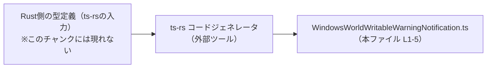
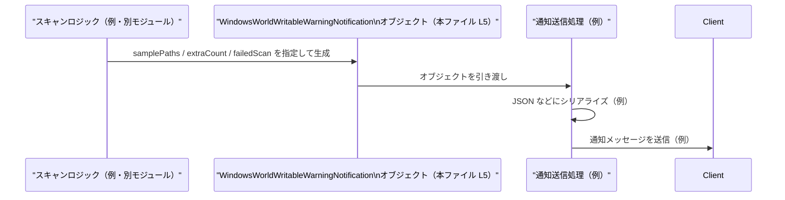

# app-server-protocol\schema\typescript\v2\WindowsWorldWritableWarningNotification.ts コード解説

## 0. ざっくり一言

- `WindowsWorldWritableWarningNotification` という **通知用のデータ構造** を TypeScript の型として定義している、自動生成ファイルです（`WindowsWorldWritableWarningNotification.ts:L1-3, L5-5`）。

---

## 1. このモジュールの役割

### 1.1 概要

- このモジュールは、`WindowsWorldWritableWarningNotification` という型エイリアス（TypeScript の型の別名）を 1 つ公開しています（`WindowsWorldWritableWarningNotification.ts:L5-5`）。
- ファイル先頭コメントから、この型定義は Rust 用ライブラリ `ts-rs` によって **自動生成**されており、手動で編集しないことが明示されています（`WindowsWorldWritableWarningNotification.ts:L1-3`）。
- 型名からは「Windows の world-writable（誰でも書き込み可能）なパスに関する警告通知」を表すペイロードであることが想定されますが、**実際の意味や利用箇所は、このチャンクのコードだけからは断定できません**。

### 1.2 アーキテクチャ内での位置づけ

- このファイル自体は、**他のモジュールを一切 import していません**。定義しているのは 1 つの `export type` のみです（`WindowsWorldWritableWarningNotification.ts:L5-5`）。
- コメントから、この型は Rust 側の型定義を `ts-rs` が変換して生成したものであることが分かります（`WindowsWorldWritableWarningNotification.ts:L1-3`）。
- 実際にどの TypeScript ファイルから import されているか、どのような通信経路で使われるかは、このチャンクには現れていません（不明）。

自動生成まわりの関係のみを図示すると、次のようになります。



### 1.3 設計上のポイント

- **自動生成ファイル**  
  - 行頭コメントで「GENERATED CODE」「Do not edit manually」と明記されています（`WindowsWorldWritableWarningNotification.ts:L1-3`）。
  - 変更は元の Rust 側定義で行う前提の構成です。
- **データのみを表現する型**  
  - 関数・メソッド・クラスは定義されておらず、1 つのオブジェクト形状を表す型エイリアスのみです（`WindowsWorldWritableWarningNotification.ts:L5-5`）。
  - すべてのフィールドが必須であり、オプショナル（`?`）なプロパティはありません。
- **公開 API**  
  - `export type` で定義されているため、この型自体がこのモジュールの唯一の公開 API です（`WindowsWorldWritableWarningNotification.ts:L5-5`）。
- **エラーハンドリング・並行性**  
  - 型定義のみであり、エラーハンドリングや並行処理に関するロジックは一切含まれていません。

---

## 2. 主要な機能一覧

このファイルが提供する機能は 1 つです。

- `WindowsWorldWritableWarningNotification` 型: Windows の world-writable パスに関する警告通知を表す **オブジェクト形状** を定義する（用途の詳細は型名とフィールド名からの推測であり、このチャンクからは断定できません）。

---

## 3. 公開 API と詳細解説

### 3.1 型一覧（構造体・列挙体など）

| 名前 | 種別 | 役割 / 用途 | 定義箇所 |
|------|------|------------|----------|
| `WindowsWorldWritableWarningNotification` | 型エイリアス（オブジェクト型） | 通知データの構造を表す。`samplePaths`, `extraCount`, `failedScan` の 3 つの必須プロパティを持つ。 | `WindowsWorldWritableWarningNotification.ts:L5-5` |

`WindowsWorldWritableWarningNotification` のフィールド構造（`WindowsWorldWritableWarningNotification.ts:L5-5`）:

- `samplePaths: Array<string>`  
  - 文字列の配列です。
  - 「サンプルとなるパスの一覧」を表していると考えられますが、何件まで・どのような形式の文字列かは、このチャンクからは分かりません。
- `extraCount: number`  
  - 数値です。
  - `samplePaths` に含まれていない追加件数などを表している可能性がありますが、意味はコードからは不明です。
- `failedScan: boolean`  
  - 真偽値です。
  - スキャン処理が失敗したかどうかを表すフラグのように見えますが、詳細な条件（どのような失敗を指すか等）は不明です。

### 3.2 関数詳細（最大 7 件）

- このファイルには **関数・メソッドが 1 つも定義されていません**。  
  - ファイル全体を見ても、`function` 宣言や `=>` を伴う関数式・アロー関数が存在しないためです（`WindowsWorldWritableWarningNotification.ts:L1-5`）。

したがって、関数の詳細テンプレートは対象がありません。

### 3.3 その他の関数

- 補助関数やラッパー関数も存在しません（`WindowsWorldWritableWarningNotification.ts:L1-5`）。

---

## 4. データフロー

このチャンクからは、この型が実際にどのようなモジュール間で受け渡されているかは分かりません（import/export の利用箇所が現れていないため、不明です）。

ここでは、**この型を用いた典型的な利用シナリオの一例**（あくまで仮想的な例）として、アプリケーション内で通知オブジェクトを生成して送信する流れを示します。

### 仮想シナリオ: スキャン結果から通知オブジェクトを生成して送信する



- 上記は **このファイルに実際に書かれているコードではなく**、`WindowsWorldWritableWarningNotification` 型がどのように扱われうるかをイメージするための例です。
- 実際のデータフローは、この型を import している別ファイルの実装に依存し、このチャンクには現れていません。

---

## 5. 使い方（How to Use）

### 5.1 基本的な使用方法

この型を利用する一般的な流れの一例です。  
インポートパスはプロジェクト内での実際の配置に合わせて調整する必要があります。

```typescript
// 型エイリアスをインポートする（相対パスはプロジェクト構成に依存する）
import type { WindowsWorldWritableWarningNotification } from "./WindowsWorldWritableWarningNotification";

// スキャン結果などから通知オブジェクトを組み立てる例
const notification: WindowsWorldWritableWarningNotification = {   // 型注釈により3フィールドの存在と型がチェックされる
    samplePaths: [                                                // samplePaths: 文字列配列
        "C:\\Temp\\public.txt",                                   // 例: world-writable と判定されたパス
        "C:\\Logs\\shared.log",
    ],
    extraCount: 5,                                                // 例: 上記以外に同様のパスが5件あることを表す
    failedScan: false,                                            // 例: スキャンは成功している
};

// 例: ログに出力する・API 経由で送信する等
console.log("Windows world-writable warning:", notification);
```

このコードでは、TypeScript の型チェックにより以下が保証されます。

- `samplePaths` は `string[]` でなければならない（数値などを入れるとコンパイルエラー）。
- `extraCount` は `number`、`failedScan` は `boolean` である必要がある。
- 3 つのフィールドはすべて必須で、どれかを省略するとコンパイルエラーになります。

### 5.2 よくある使用パターン

1. **スキャンが成功した場合の通知**

```typescript
const successNotification: WindowsWorldWritableWarningNotification = {
    samplePaths: ["C:\\Temp\\test.txt"],  // サンプルとして1件だけ含める
    extraCount: 0,                        // 追加件数なし
    failedScan: false,                    // スキャン成功
};
```

1. **スキャンが失敗した場合の通知**

```typescript
const failedNotification: WindowsWorldWritableWarningNotification = {
    samplePaths: [],                      // 失敗したので具体的なパスは空
    extraCount: 0,                        // 件数情報もなし
    failedScan: true,                     // スキャン失敗フラグ
};
```

- これらはあくまで **例** であり、実際のビジネスルール（`failedScan` が true のときに `samplePaths` をどう扱うか等）は、このチャンクからは分かりません。

### 5.3 よくある間違い

#### 1. 必須フィールドの欠落

```typescript
// 間違い例: extraCount を指定していない
// const notification: WindowsWorldWritableWarningNotification = {
//     samplePaths: ["C:\\Temp\\test.txt"],
//     failedScan: false,
// };
// → TypeScript のコンパイルエラー（extraCount が存在しないため）
```

```typescript
// 正しい例: 3 フィールドすべてを指定する
const notification: WindowsWorldWritableWarningNotification = {
    samplePaths: ["C:\\Temp\\test.txt"],
    extraCount: 1,
    failedScan: false,
};
```

#### 2. 型の不一致

```typescript
// 間違い例: extraCount に文字列を入れている
// const notification: WindowsWorldWritableWarningNotification = {
//     samplePaths: ["C:\\Temp\\test.txt"],
//     extraCount: "1",       // ← string は許可されない
//     failedScan: false,
// };
// → コンパイルエラー
```

```typescript
// 正しい例: extraCount に number を指定
const notification: WindowsWorldWritableWarningNotification = {
    samplePaths: ["C:\\Temp\\test.txt"],
    extraCount: 1,            // number 型
    failedScan: false,
};
```

### 5.4 使用上の注意点（まとめ）

- **前提条件**
  - 3 つのプロパティはすべて必須です（`WindowsWorldWritableWarningNotification.ts:L5-5`）。
  - 配列や数値の範囲、文字列の形式については型レベルでは制約されていません。追加のバリデーションは利用側で行う必要があります。
- **ランタイム検証**
  - これは TypeScript の型定義であり、JavaScript 実行時に自動で検証されるわけではありません。JSON からデシリアライズしたオブジェクトなどには、別途ランタイムチェックを行う必要があります。
- **並行性**
  - この型は純粋なデータ構造であり、スレッドや Web Worker などの並行処理に関する状態を持ちません。並行性の問題は、利用側のコードに依存します。

---

## 6. 変更の仕方（How to Modify）

### 6.1 新しい機能を追加する場合

- ファイル先頭に「GENERATED CODE」「Do not modify by hand」とあり、このファイルは **手動で編集しない** 前提です（`WindowsWorldWritableWarningNotification.ts:L1-3`）。
- `ts-rs` による自動生成であるため、以下のような手順になることが一般的です（概念的な説明であり、このリポジトリ固有の構成はこのチャンクからは不明です）。
  1. Rust 側の元の型定義（`ts-rs` の derive 対象）にフィールドを追加・変更する。
  2. `ts-rs` を用いたコード生成コマンドを実行し、TypeScript 側の定義を再生成する。
  3. 生成された TypeScript ファイルを利用側コードが正しく参照するか確認する。

### 6.2 既存の機能を変更する場合

- **フィールド名や型を変えたい場合**も、直接この TypeScript ファイルを編集するのではなく、元の Rust 定義を変更して再生成する必要があります（`WindowsWorldWritableWarningNotification.ts:L1-3`）。
- 変更時に確認すべき点:
  - この型を import している TypeScript コードが、変更後のフィールド名・型に対応しているか（このチャンクには利用箇所が現れないため、実際の影響範囲は不明です）。
  - API のバージョニング（`schema/typescript/v2` というパスから、バージョンディレクトリを用いていることが推測されますが、詳細なポリシーはコードからは分かりません）。

---

## 7. 関連ファイル

このチャンクから直接参照できる関連は限定的ですが、構造とコメントから次のようなファイル群との関係が想定されます。

| パス | 役割 / 関係 |
|------|------------|
| `app-server-protocol\schema\typescript\v2\WindowsWorldWritableWarningNotification.ts` | 本ファイル。`WindowsWorldWritableWarningNotification` 型を定義する自動生成 TypeScript ファイル（`WindowsWorldWritableWarningNotification.ts:L1-5`）。 |
| 対応する Rust 側の型定義ファイル（パス不明） | `ts-rs` が参照する元の型定義。コメントから存在が推測されますが、このチャンクには現れません（`WindowsWorldWritableWarningNotification.ts:L1-3`）。 |
| 同ディレクトリ内の他の TypeScript スキーマファイル（具体的なファイル名はこのチャンクには現れない） | おそらく同じプロトコルバージョン `v2` に属する他のメッセージ型を定義している可能性がありますが、詳細は不明です。 |

---

## Bugs / Security / Contracts / Edge Cases（簡単な整理）

- **Bugs（バグ）**
  - このファイルは単なる型定義であり、実行ロジックを含まないため、「ロジック上のバグ」はここには存在しません。
- **Security（セキュリティ）**
  - `samplePaths` に OS パスが入る想定である点から、ログ出力や UI 表示時には情報漏えいに注意する必要がありますが、これは利用側の責務であり、この型自体の問題ではありません。
- **Contracts（契約）**
  - 3 つのフィールドはすべて必須で、指定された型を満たす必要がある、というのがこの型の「契約」です（`WindowsWorldWritableWarningNotification.ts:L5-5`）。
- **Edge Cases（エッジケース）**
  - `samplePaths` が空配列 `[]` の場合
  - `extraCount` が 0 や非常に大きな値の場合
  - `failedScan` が `true` の場合に他のフィールドをどう扱うか  
  これらの具体的な扱いは、この型を利用するコードに依存しており、このチャンクからは分かりません。

---

## Tests / Performance / Observability（このファイルに関する補足）

- **Tests**
  - このファイル内にテストコードは存在しません（`WindowsWorldWritableWarningNotification.ts:L1-5`）。
  - 自動生成コードであるため、通常はジェネレータ（`ts-rs`）および元の Rust 型に対してテストを書く構成が多いと考えられます（一般論）。
- **Performance / Scalability**
  - 型定義のみであり、ランタイム性能に直接の影響はありません。
- **Observability**
  - ログ出力やメトリクス収集のコードは含まれていません。この型を利用する側で必要に応じて実装することになります。
