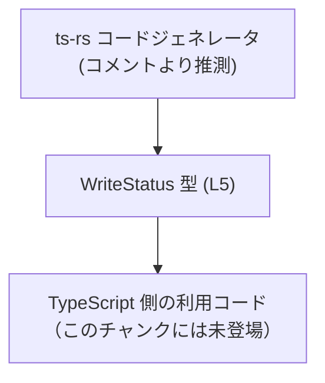
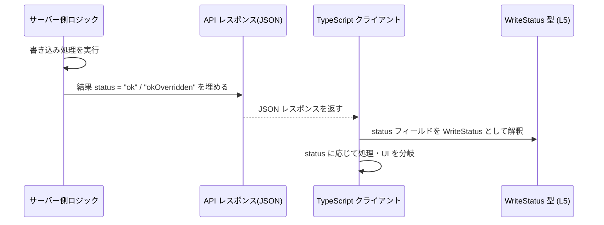

# app-server-protocol/schema/typescript/v2/WriteStatus.ts

## 0. ざっくり一言

`WriteStatus` という **書き込み結果の状態** を表す TypeScript の文字列リテラル・ユニオン型（string literal union type）を定義する、自動生成ファイルです（`"ok"` または `"okOverridden"` のいずれかのみを表現）  
根拠: `WriteStatus.ts:L1-5`

---

## 1. このモジュールの役割

### 1.1 概要

- このモジュールは、アプリケーションサーバーのプロトコル（v2）で使用される **「書き込み処理のステータス」** を型として表現します。  
- TypeScript 側で `WriteStatus` 型を使うことで、書き込み結果として `"ok"` または `"okOverridden"` 以外の文字列を静的に防ぎます。  
根拠: `WriteStatus.ts:L5`

### 1.2 アーキテクチャ内での位置づけ

- コメントから、このファイルは Rust から TypeScript を生成するツール **ts-rs** によって生成されたことが分かります。  
  根拠: `WriteStatus.ts:L1-3`
- ファイルパス（`schema/typescript/v2`）から、この型は **プロトコルスキーマ v2 の一部** として、サーバー・クライアント間の通信や API レスポンスなどで共有されるステータス表現に用いられると考えられますが、どこで利用されているかはこのチャンクには現れません。

この関係を、わかる範囲で簡略化して図示します。



※ `TSClient` がどの具体的ファイルかは、このチャンクからは分かりません。

### 1.3 設計上のポイント

- **自動生成ファイルであることが明示** されています。手動で編集しない前提です。  
  根拠: `WriteStatus.ts:L1-3`
- 実装は **型定義のみ** で、関数やクラスなどのロジックを持ちません。  
  根拠: `WriteStatus.ts:L5`
- `WriteStatus` は **文字列リテラル・ユニオン型** として定義されており、型レベルで取りうる値を `"ok"` / `"okOverridden"` に厳密に制限します。  
  根拠: `WriteStatus.ts:L5`
- 実行時の状態や副作用を持たないため、エラーハンドリングや並行性（スレッドセーフティ）に関する懸念は **TypeScript のコンパイル時型チェックにほぼ限定** されます。

---

## 2. 主要な機能一覧

このファイルが提供する主要な要素は 1 つのみです。

- `WriteStatus` 型: 書き込み処理の結果ステータスを `"ok"` または `"okOverridden"` のいずれかに制限する文字列リテラル・ユニオン型  

---

## 3. 公開 API と詳細解説

### 3.1 型一覧（構造体・列挙体など）

このチャンクに定義されている型コンポーネントのインベントリーです。

| 名前         | 種別        | 役割 / 用途                                                                 | 定義位置 |
|--------------|-------------|------------------------------------------------------------------------------|----------|
| `WriteStatus` | 型エイリアス（string リテラルユニオン） | 書き込み処理の結果ステータス。`"ok"` または `"okOverridden"` のみを表現 | `app-server-protocol/schema/typescript/v2/WriteStatus.ts:L5-5` |

#### `type WriteStatus = "ok" \| "okOverridden"` の詳細

**概要**

- 書き込み処理の結果を、「通常の成功」と「何らかの上書きが発生した成功」の 2 パターンに分けて表現する型です。  
- 値は **文字列** ですが、TypeScript の型システムによって `"ok"` か `"okOverridden"` のどちらかに限定されます。  
  根拠: `WriteStatus.ts:L5`

**取りうる値**

- `"ok"`  
  - 書き込みが成功し、特別な上書きなどが発生していない状態を表すと推測されます（名称からの推測であり、このチャンクからの確証はありません）。
- `"okOverridden"`  
  - 書き込みは成功したものの、既存の値を上書きした、あるいは他の要因で結果が「上書きされた」ことを表すと推測されます（同上）。

※ いずれも、**名称からの意味推測** であり、正確な仕様はこのファイルからは分かりません。

**使用例（基本）**

`WriteStatus` をフィールドに持つレスポンス型を定義し、それに基づいて分岐する典型的なコード例です。

```typescript
// WriteStatus 型をインポートする例                           // このファイルから WriteStatus を型としてインポートする
import type { WriteStatus } from "./WriteStatus";              // 相対パスは実際の配置に応じて変更

// 書き込み処理のレスポンス型を定義する                        // status フィールドに書き込み結果のステータスを持たせる
interface WriteResponse {
    status: WriteStatus;                                       // "ok" または "okOverridden" のいずれか
}

// レスポンスを処理する関数の例                                // WriteStatus に応じて処理を分ける
function handleWriteResponse(res: WriteResponse): void {
    if (res.status === "ok") {                                 // status が "ok" の場合
        console.log("書き込みは正常に完了しました。");
    } else if (res.status === "okOverridden") {                // status が "okOverridden" の場合
        console.log("書き込みは完了しましたが、何かが上書きされました。");
    } else {
        // この分岐は TypeScript 的には到達不能（型が保証）       // WriteStatus に第三の値は存在しないため
        // ただし、実行時には外部入力によって不正値が来る可能性はある
        console.warn("未知のステータス:", res.status);
    }
}
```

**エラー・安全性・並行性**

- この型定義自体が **エラーを発生させたり例外を投げたりすることはありません**。  
  （実体はコンパイル時情報であり、生成される JavaScript には残りません）
- TypeScript のコンパイル時に、例えば次のようなコードは型エラーになります。

  ```typescript
  const s: WriteStatus = "failed";  // 型エラー: "failed" は WriteStatus に含まれない
  ```

- 実行時（JavaScript）には型情報が存在しないため、外部入力（JSON など）から文字列を受け取る場合は **ランタイム側でのバリデーション** が別途必要です（このファイルには定義されていません）。
- 並行性（複数スレッド・複数タスクからの同時アクセス）については、`WriteStatus` が **ただの文字列型** であるため、特別な懸念はありません。

**エッジケース**

- TypeScript コード内で `WriteStatus` 型として宣言された変数には、`"ok"` と `"okOverridden"` 以外を代入できません。  
  → コンパイル時に検出されます。
- しかし、外部から取り込んだ文字列（JSON パース結果など）に対して **型アサーション** を行うと、コンパイラのチェックをすり抜ける可能性があります。

  ```typescript
  const raw = JSON.parse(input).status as WriteStatus; // この時点では実行時の値は未検証
  ```

  この場合、`raw` は型上 `WriteStatus` ですが、実際には `"ok"` でも `"okOverridden"` でもない値が入っている可能性があります。

**使用上の注意点**

- コメントに「手動で編集しない」とあるため、`WriteStatus` に値を追加・変更したい場合は **生成元（Rust 側の定義や ts-rs 設定）を変更する必要** があります。  
  根拠: `WriteStatus.ts:L1-3`
- 値の追加（例: `"failed"` など）を行った場合、`WriteStatus` を使っている **すべての `switch` 文 / `if` 分岐** が更新対象になります。
- 型レベルでの保証は **コンパイルされた JavaScript には存在しない** ため、外部入力を `WriteStatus` として扱うときはランタイムチェック（ガード関数など）を別途設けることが望ましいです。

### 3.2 関数詳細（最大 7 件）

- このファイルには **関数は定義されていません**。  
  根拠: `WriteStatus.ts:L1-5`

### 3.3 その他の関数

- 補助関数やラッパー関数も、このチャンクには一切登場しません。  
  根拠: `WriteStatus.ts:L1-5`

---

## 4. データフロー

このファイル自体には処理フローはありませんが、`WriteStatus` 型が **典型的にどのようなデータフローに登場しうるか** を、想定されるシナリオとして説明します。  
実際の呼び出し元・呼び出し先はこのチャンクには現れないため、あくまで「使用イメージ」です。

1. サーバー側で書き込み処理が実行され、結果として `"ok"` または `"okOverridden"` の文字列が生成される。
2. その値が API レスポンス（JSON など）の `status` フィールドとしてクライアントに送信される。
3. TypeScript クライアント側では、その `status` を `WriteStatus` として扱い、UI 表示や後続ロジックを分岐する。

これをシーケンス図で表すと、次のようになります。



※ `Server` / `API` / `Client` はこのファイルには登場しません。`Type` ノードのみが、このチャンクで定義されているコンポーネントです。  

---

## 5. 使い方（How to Use）

### 5.1 基本的な使用方法

`WriteStatus` を利用する典型的なコードフローの例です。

```typescript
// 1. 型をインポートする                                      // このファイルが同一ディレクトリにある前提
import type { WriteStatus } from "./WriteStatus";

// 2. API レスポンス型を定義する                             // status に書き込み結果を表す型を付ける
interface WriteResponse {
    status: WriteStatus;                                      // "ok" または "okOverridden"
    // 他のフィールド (id や message など) は必要に応じて追加
}

// 3. メイン処理からレスポンスを受け取り、WriteStatus を使う  // 非同期処理を想定した例
async function main() {
    const response: WriteResponse = await fetchWrite();       // fetchWrite はどこか別で定義されていると仮定

    // 4. status に応じて結果を扱う                            // WriteStatus によって条件を限定
    switch (response.status) {
        case "ok":
            console.log("書き込み成功");
            break;
        case "okOverridden":
            console.log("書き込み成功（既存値を上書き）");
            break;
        // default は通常不要（WriteStatus は 2 値のみ）       // ただし将来 variant 追加時に検出しやすい
        default:
            // 将来新しいステータスが追加された場合ここに来る可能性
            console.warn("未知のステータス:", response.status);
    }
}
```

### 5.2 よくある使用パターン

1. **単純な if 分岐**

   ```typescript
   import type { WriteStatus } from "./WriteStatus";

   function isOverridden(status: WriteStatus): boolean {
       return status === "okOverridden";                      // true なら上書きあり、といった判定に利用できる
   }
   ```

2. **メッセージへのマッピング**

   ```typescript
   import type { WriteStatus } from "./WriteStatus";

   function getStatusMessage(status: WriteStatus): string {
       const messages: Record<WriteStatus, string> = {        // キーにも WriteStatus を使う
           "ok": "書き込みが正常に完了しました。",
           "okOverridden": "書き込みは完了しました（既存の値を上書きしました）。",
       };
       return messages[status];                               // ここで status が "failed" などになることは型上ありえない
   }
   ```

### 5.3 よくある間違い

```typescript
// 誤り例 1: string 型で受けてしまう
function handle(status: string) {                             // 型が広すぎる
    if (status === "ok") {
        // ...
    }
    // "okOverridden" を書き忘れてもコンパイルエラーにならない
}

// 正しい例: WriteStatus を使う
import type { WriteStatus } from "./WriteStatus";

function handleCorrect(status: WriteStatus) {                 // 取りうる値を限定
    if (status === "ok") {
        // ...
    } else if (status === "okOverridden") {
        // ...
    }
    // ここで他の分岐を追加しようとすると、型的には存在しない値になる
}
```

```typescript
// 誤り例 2: 外部入力を直接 WriteStatus として扱う (型アサーション乱用)
const rawStatus = (JSON.parse(input) as any).status as WriteStatus;  // 実行時には不正な値でも通ってしまう

// より安全な例: ランタイムチェックを行う
function parseWriteStatus(value: unknown): WriteStatus | null {
    if (value === "ok" || value === "okOverridden") {         // 実行時に文字列をチェック
        return value;
    }
    return null;                                              // 不正値の場合は null やエラーを返す
}
```

### 5.4 使用上の注意点（まとめ）

- このファイルは **自動生成コード** であり、直接編集しない前提です。値を追加・変更したい場合は ts-rs の生成元（Rust 側の定義）を変更する必要があります。  
  根拠: `WriteStatus.ts:L1-3`
- `WriteStatus` は TypeScript の **型レベルでのみ** 有効であり、JavaScript 実行時には存在しません。外部入力を扱う場合は別途ランタイムチェックが必要です。
- `WriteStatus` に依存するコード（`switch` 文など）は、この型に新しいバリアントが追加された際にコンパイルエラーや警告によって変更漏れを発見しやすくなります。
- 特殊なロックやスレッド安全性の考慮は不要ですが、並行処理環境（Promise の並列実行など）では、どの処理がどの `WriteStatus` に対応するかをロジック側で整理する必要があります（この型自体は値を区別するラベルのみを提供します）。

---

## 6. 変更の仕方（How to Modify）

### 6.1 新しい機能を追加する場合（例: 新しいステータス値を追加）

1. コメントから、このファイルは ts-rs による自動生成であることが分かるため、**直接この TypeScript ファイルを編集することは推奨されません**。  
   根拠: `WriteStatus.ts:L1-3`
2. 代わりに、ts-rs の入力となる **Rust 側の型定義**（enum や struct 等）に新しいステータス値を追加し、ts-rs による再生成を行う必要があります。
3. 再生成によって `WriteStatus` に新しい文字列リテラルが追加された場合:
   - `WriteStatus` を使うすべての `switch` / `if` 分岐の網羅性を確認することが重要です。
   - `Record<WriteStatus, T>` などを用いている箇所では、新しいキーの追加を忘れない必要があります。

### 6.2 既存の機能を変更する場合（例: 値の名称変更）

- `"ok"` → `"success"` のように **文字列そのものを変更** したい場合も、同様に Rust 側の定義を変更して ts-rs で再生成する必要があります。
- 文字列の変更により、既存の TypeScript コードの比較条件（`status === "ok"` など）がすべて影響を受けるため、次の点に注意します。
  - IDE のリネーム機能だけでは、文字列リテラル比較は安全に変更されない場合があります。
  - `WriteStatus` を使うすべてのファイルを検索し、手動での確認が必要になる可能性があります。
- 仕様変更によって `"okOverridden"` の意味が変わる場合、型名（`WriteStatus`）自体やコメントを変更する必要があるかどうかも検討する必要がありますが、このファイル内にはコメントはありません。  
  → 仕様の説明は別のドキュメントにあると考えられますが、このチャンクからは確認できません。

---

## 7. 関連ファイル

このチャンクから直接参照されているファイルはありませんが、コメントやパス構造から推測できる関連要素を整理します。

| パス / コンポーネント | 役割 / 関係 |
|-----------------------|------------|
| （不明: ts-rs の入力となる Rust 型定義） | コメントより、この TypeScript ファイルは ts-rs によって生成されているため、元となる Rust の enum や struct が存在します。具体的なパスや型名はこのチャンクには現れません。根拠: `WriteStatus.ts:L1-3` |
| `schema/typescript/v2` ディレクトリ内の他ファイル | 同じプロトコルスキーマ v2 に属する TypeScript 型定義群と推測されますが、どのファイルが `WriteStatus` を利用しているか、このチャンクからは分かりません。 |
| TypeScript クライアント / サーバー実装 | `WriteStatus` をフィールドとして持つリクエスト・レスポンス型、あるいはそれを判定に使うビジネスロジックが存在すると考えられますが、本チャンクには登場しません。 |

---

### まとめ（安全性・バグ・テスト・パフォーマンスの観点）

- **安全性 / セキュリティ**  
  - 型レベルでは `"ok"` / `"okOverridden"` 以外を排除でき、コーディング時の誤字・漏れを防ぎやすくなっています。  
  - 外部入力を扱う場合はランタイムバリデーションが別途必要です（このファイルでは提供されていません）。
- **バグになりやすい点**  
  - 値の追加・変更時に、利用側の分岐処理を見落とすと、ロジックが意図通りに動かない可能性があります。
- **テスト**  
  - このファイル内にはテストコードはありませんが、利用側の単体テストでは `WriteStatus` の全バリアント `"ok"` / `"okOverridden"` を入力としてカバーすることが重要です。
- **パフォーマンス**  
  - `WriteStatus` はコンパイル時にのみ存在する単なる型エイリアスであり、実行時のオーバーヘッドは発生しません。スケーラビリティへの影響もほぼありません。
