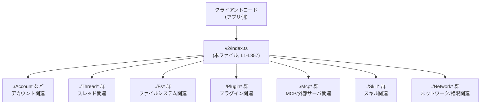
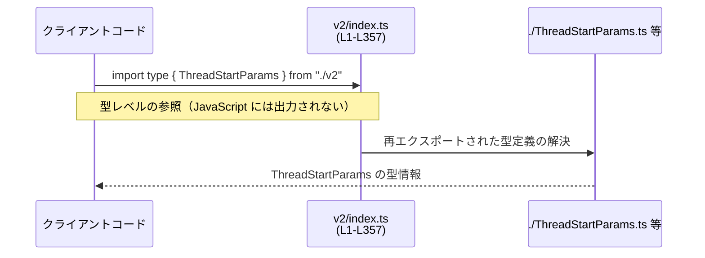

# app-server-protocol/schema/typescript/v2/index.ts コード解説

## 0. ざっくり一言

- v2 プロトコルで使う **すべての TypeScript 型定義を一括で再エクスポートする「バレル（集約）モジュール」** です。  
  `export type { X } from "./X";` が大量に並ぶだけで、ロジックや関数は一切ありません  
  （`app-server-protocol/schema/typescript/v2/index.ts:L1-L357`）。

---

## 1. このモジュールの役割

### 1.1 概要

- このモジュールは、v2 スキーマに含まれる多数の型（`Account`, `Thread`, `Config`, `Fs*`, `Plugin*` など）を、**単一の import 入口から利用できるようにするため**に存在します。  
- 各型の本体はそれぞれ `./Account.ts`, `./Thread.ts` などの別ファイルに定義されており、本ファイルはそれらを `export type { ... } from "./..."` で再公開しています  
  （`index.ts:L1-L357`）。  
- 生成コードであり、先頭コメントに「DO NOT MODIFY BY HAND!」とある通り、**手動での編集は前提にしていません**  
  （`index.ts:L1-L1`）。

### 1.2 アーキテクチャ内での位置づけ

このファイルは「クライアントコード」と「個別の型定義ファイル群」の間にある薄いファサードとして機能します。



- クライアントコードはふつう `import type { ThreadStartParams, ThreadStartResponse } from "./v2";` のように、**この index を 1 箇所インポートするだけで多数の型にアクセス**できます。  
- 実際の型定義やビジネスロジックはすべて各 `./*.ts` ファイル側にあり、本ファイルは純粋にコンパイル時の型情報のルーティングのみを行います  
  （`index.ts:L2-L357`）。

### 1.3 設計上のポイント

コードから読み取れる特徴は次のとおりです（`index.ts:L1-L357` に基づきます）。

- **生成コードであること**  
  - `// GENERATED CODE! DO NOT MODIFY BY HAND!` というコメントが先頭にあり、ツールによる自動生成であるとわかります（`index.ts:L1-L1`）。
- **型専用の再エクスポート (`export type`) のみ**  
  - すべての行が `export type { ... } from "./...";` 形式であり、値のエクスポートや関数定義はありません（`index.ts:L2-L357`）。
  - `export type` は TypeScript の構文で、**型情報のみをエクスポートし、JavaScript 出力には現れない**ため、ランタイムへの影響がありません。
- **ステートレス・ノンロジック**  
  - 状態や計算ロジック、エラーハンドリング、非同期処理などは一切なく、**純粋な宣言モジュール**です。
- **v2 スキーマの公開 API 集約点**  
  - `Account`, `Config`, `Thread`, `Turn`, `Fs*`, `Mcp*`, `Plugin*`, `Skill*`, `Network*`, `Sandbox*` など、多くのドメインの型がこのファイルを通じて公開されています（`index.ts:L2-L357`）。

---

## 2. 主要な機能一覧

このモジュールが提供する「機能」はすべて **型の再エクスポート**です。代表的なグループを挙げると次のようになります（すべて `index.ts:L2-L357` に記載）。

- アカウント管理関連
  - `Account`, `GetAccountParams`, `GetAccountResponse`, `GetAccountRateLimitsResponse`
  - ログイン関連: `LoginAccountParams`, `LoginAccountResponse`, `CancelLoginAccountParams`, `CancelLoginAccountResponse`, `LogoutAccountResponse`
  - 通知: `AccountLoginCompletedNotification`, `AccountRateLimitsUpdatedNotification`, `AccountUpdatedNotification`
- 設定／コンフィグ関連
  - `Config`, `ConfigReadParams`, `ConfigReadResponse`, `ConfigBatchWriteParams`, `ConfigWriteResponse`, `ConfigWarningNotification`, `ConfigRequirements`, `ConfigRequirementsReadResponse`, `ConfigValueWriteParams`, `ConfigLayer`, `ConfigLayerMetadata`, `ConfigLayerSource`, `ConfigEdit`
- ファイルシステム（Fs）関連
  - `FsReadFileParams`, `FsReadFileResponse`, `FsWriteFileParams`, `FsWriteFileResponse`, `FsReadDirectoryParams`, `FsReadDirectoryResponse`, `FsCreateDirectoryParams`, `FsCreateDirectoryResponse`, `FsRemoveParams`, `FsRemoveResponse`, `FsWatchParams`, `FsWatchResponse`, `FsUnwatchParams`, `FsUnwatchResponse`, `FsGetMetadataParams`, `FsGetMetadataResponse`, `FsChangedNotification`, `FsCopyParams`, `FsCopyResponse`
- コマンド実行／ターミナル関連
  - `CommandExecParams`, `CommandExecResponse`, `CommandExecOutputStream`, `CommandExecOutputDeltaNotification`, `CommandExecWriteParams`, `CommandExecWriteResponse`, `CommandExecResizeParams`, `CommandExecResizeResponse`, `CommandExecTerminateParams`, `CommandExecTerminateResponse`, `CommandExecTerminalSize`, `CommandAction`, `TerminalInteractionNotification`
- ネットワーク／権限関連
  - `NetworkAccess`, `NetworkRequirements`, `NetworkApprovalContext`, `NetworkApprovalProtocol`, `NetworkDomainPermission`, `NetworkUnixSocketPermission`, `NetworkPolicyAmendment`, `NetworkPolicyRuleAction`, `AdditionalFileSystemPermissions`, `AdditionalNetworkPermissions`, `AdditionalPermissionProfile`, `PermissionGrantScope`, `RequestPermissionProfile`, `GrantedPermissionProfile`, `ReadOnlyAccess`
- プラグイン／マーケットプレイス関連
  - `PluginInterface`, `PluginDetail`, `PluginSummary`, `PluginMarketplaceEntry`, `PluginListParams`, `PluginListResponse`, `PluginReadParams`, `PluginReadResponse`, `PluginInstallParams`, `PluginInstallResponse`, `PluginUninstallParams`, `PluginUninstallResponse`, `PluginSource`, `PluginAuthPolicy`, `PluginInstallPolicy`, `MarketplaceInterface`, `MarketplaceLoadErrorInfo`
- MCP／外部サーバ連携関連
  - `McpServerStatus`, `McpServerStatusDetail`, `McpServerStatusUpdatedNotification`, `McpServerStartupState`, `ListMcpServerStatusParams`, `ListMcpServerStatusResponse`
  - MCP ツール呼び出し関連: `McpServerToolCallParams`, `McpServerToolCallResponse`, `McpToolCallResult`, `McpToolCallStatus`, `McpToolCallError`, `McpToolCallProgressNotification`
  - MCP 資源／入力のエリシテーション（入力要求）関連: `McpElicitation*` 系の多数の型, `McpResourceReadParams`, `McpResourceReadResponse`, `McpServerElicitationAction`, `McpServerElicitationRequestParams`, `McpServerElicitationRequestResponse`
  - OAuth ログイン／トークン関連: `McpServerOauthLoginParams`, `McpServerOauthLoginResponse`, `McpServerOauthLoginCompletedNotification`, `McpAuthStatus`, `ChatgptAuthTokensRefreshParams`, `ChatgptAuthTokensRefreshResponse`, `ChatgptAuthTokensRefreshReason`
- スキル／ツール／計画関連
  - `SkillInterface`, `SkillMetadata`, `SkillScope`, `SkillSummary`, `SkillDependencies`, `SkillToolDependency`, `SkillsConfigWriteParams`, `SkillsConfigWriteResponse`, `SkillsListParams`, `SkillsListResponse`, `SkillsListEntry`, `SkillsListExtraRootsForCwd`, `SkillsChangedNotification`
  - ツール／動的ツール関連: `ToolsV2`, `DynamicToolSpec`, `DynamicToolCallParams`, `DynamicToolCallResponse`, `DynamicToolCallStatus`, `DynamicToolCallOutputContentItem`
- スレッド／ターン／会話関連
  - スレッド: `Thread`, `ThreadItem`, `ThreadStatus`, `ThreadStartParams`, `ThreadStartResponse`, `ThreadResumeParams`, `ThreadResumeResponse`, `ThreadRollbackParams`, `ThreadRollbackResponse`, `ThreadArchiveParams`, `ThreadArchiveResponse`, `ThreadUnarchiveParams`, `ThreadUnarchiveResponse`, `ThreadForkParams`, `ThreadForkResponse`, `ThreadListParams`, `ThreadListResponse`, `ThreadLoadedListParams`, `ThreadLoadedListResponse`, `ThreadReadParams`, `ThreadReadResponse`, 各種 `Thread*Notification` 系
  - ターン: `Turn`, `TurnStartParams`, `TurnStartResponse`, `TurnStatus`, `TurnPlanStep`, `TurnPlanStepStatus`, `TurnPlanUpdatedNotification`, `TurnError`, `TurnInterruptParams`, `TurnInterruptResponse`, `TurnSteerParams`, `TurnSteerResponse`, `TurnStartedNotification`, `TurnCompletedNotification`, `TurnDiffUpdatedNotification`
- サンドボックス／Windows サンドボックス関連
  - `SandboxMode`, `SandboxPolicy`, `SandboxWorkspaceWrite`
  - Windows: `WindowsSandboxSetupMode`, `WindowsSandboxSetupStartParams`, `WindowsSandboxSetupStartResponse`, `WindowsSandboxSetupCompletedNotification`, `WindowsWorldWritableWarningNotification`
- その他メタ情報・トラッキング
  - `Model`, `ModelListParams`, `ModelListResponse`, `ModelAvailabilityNux`, `ModelUpgradeInfo`, `ModelRerouteReason`, `ModelReroutedNotification`
  - `ProfileV2`, `AppInfo`, `AppMetadata`, `AppSummary`, `AppReview`, `AppScreenshot`, `AppBranding`, `AppListUpdatedNotification`, `AppsConfig`, `AppsDefaultConfig`
  - トークン使用量: `TokenUsageBreakdown`, `ThreadTokenUsage`, `ThreadTokenUsageUpdatedNotification`, `RateLimitSnapshot`, `RateLimitWindow`, `CreditsSnapshot`
  - 各種エラー・通知: `ErrorNotification`, `SkillErrorInfo`, `CodexErrorInfo`, `DeprecationNoticeNotification`, `ConfigWarningNotification`, `RawResponseItemCompletedNotification`, `ServerRequestResolvedNotification`, `ReasoningTextDeltaNotification`, `ReasoningSummaryTextDeltaNotification`, `ReasoningSummaryPartAddedNotification`

※ 上記はグループ化した概要であり、すべての名前の一覧は 3.1 の表を参照してください。

---

## 3. 公開 API と詳細解説

### 3.1 型一覧（構造体・列挙体など）

本ファイル自身は **新しい型を定義していません** が、公開 API として「再エクスポートされる型名」が重要です。  
以下の表は、**このモジュールから公開されるすべての型名**と、その元モジュールをまとめたものです。

> すべての行について「`export type { Name } from "./Name";` が記載されている」ことは  
> `app-server-protocol/schema/typescript/v2/index.ts:L2-L357` から確認できます。  
> 行番号の列は、この事実が同一ファイル・同一行範囲に存在することを示します。

| 名前 | 種別 | 元モジュール（相対パス） | 根拠（行範囲） |
|------|------|-------------------------|----------------|
| Account | 型（再エクスポート） | `./Account` | `index.ts:L2-L357` |
| AccountLoginCompletedNotification | 型（再エクスポート） | `./AccountLoginCompletedNotification` | `index.ts:L2-L357` |
| AccountRateLimitsUpdatedNotification | 型 | `./AccountRateLimitsUpdatedNotification` | `index.ts:L2-L357` |
| AccountUpdatedNotification | 型 | `./AccountUpdatedNotification` | `index.ts:L2-L357` |
| AdditionalFileSystemPermissions | 型 | `./AdditionalFileSystemPermissions` | `index.ts:L2-L357` |
| AdditionalNetworkPermissions | 型 | `./AdditionalNetworkPermissions` | `index.ts:L2-L357` |
| AdditionalPermissionProfile | 型 | `./AdditionalPermissionProfile` | `index.ts:L2-L357` |
| AgentMessageDeltaNotification | 型 | `./AgentMessageDeltaNotification` | `index.ts:L2-L357` |
| AnalyticsConfig | 型 | `./AnalyticsConfig` | `index.ts:L2-L357` |
| AppBranding | 型 | `./AppBranding` | `index.ts:L2-L357` |
| AppInfo | 型 | `./AppInfo` | `index.ts:L2-L357` |
| AppListUpdatedNotification | 型 | `./AppListUpdatedNotification` | `index.ts:L2-L357` |
| AppMetadata | 型 | `./AppMetadata` | `index.ts:L2-L357` |
| AppReview | 型 | `./AppReview` | `index.ts:L2-L357` |
| AppScreenshot | 型 | `./AppScreenshot` | `index.ts:L2-L357` |
| AppSummary | 型 | `./AppSummary` | `index.ts:L2-L357` |
| AppToolApproval | 型 | `./AppToolApproval` | `index.ts:L2-L357` |
| AppToolsConfig | 型 | `./AppToolsConfig` | `index.ts:L2-L357` |
| ApprovalsReviewer | 型 | `./ApprovalsReviewer` | `index.ts:L2-L357` |
| AppsConfig | 型 | `./AppsConfig` | `index.ts:L2-L357` |
| AppsDefaultConfig | 型 | `./AppsDefaultConfig` | `index.ts:L2-L357` |
| AppsListParams | 型 | `./AppsListParams` | `index.ts:L2-L357` |
| AppsListResponse | 型 | `./AppsListResponse` | `index.ts:L2-L357` |
| AskForApproval | 型 | `./AskForApproval` | `index.ts:L2-L357` |
| AutoReviewDecisionSource | 型 | `./AutoReviewDecisionSource` | `index.ts:L2-L357` |
| ByteRange | 型 | `./ByteRange` | `index.ts:L2-L357` |
| CancelLoginAccountParams | 型 | `./CancelLoginAccountParams` | `index.ts:L2-L357` |
| CancelLoginAccountResponse | 型 | `./CancelLoginAccountResponse` | `index.ts:L2-L357` |
| CancelLoginAccountStatus | 型 | `./CancelLoginAccountStatus` | `index.ts:L2-L357` |
| ChatgptAuthTokensRefreshParams | 型 | `./ChatgptAuthTokensRefreshParams` | `index.ts:L2-L357` |
| ChatgptAuthTokensRefreshReason | 型 | `./ChatgptAuthTokensRefreshReason` | `index.ts:L2-L357` |
| ChatgptAuthTokensRefreshResponse | 型 | `./ChatgptAuthTokensRefreshResponse` | `index.ts:L2-L357` |
| CodexErrorInfo | 型 | `./CodexErrorInfo` | `index.ts:L2-L357` |
| CollabAgentState | 型 | `./CollabAgentState` | `index.ts:L2-L357` |
| CollabAgentStatus | 型 | `./CollabAgentStatus` | `index.ts:L2-L357` |
| CollabAgentTool | 型 | `./CollabAgentTool` | `index.ts:L2-L357` |
| CollabAgentToolCallStatus | 型 | `./CollabAgentToolCallStatus` | `index.ts:L2-L357` |
| CollaborationModeMask | 型 | `./CollaborationModeMask` | `index.ts:L2-L357` |
| CommandAction | 型 | `./CommandAction` | `index.ts:L2-L357` |
| CommandExecOutputDeltaNotification | 型 | `./CommandExecOutputDeltaNotification` | `index.ts:L2-L357` |
| CommandExecOutputStream | 型 | `./CommandExecOutputStream` | `index.ts:L2-L357` |
| CommandExecParams | 型 | `./CommandExecParams` | `index.ts:L2-L357` |
| CommandExecResizeParams | 型 | `./CommandExecResizeParams` | `index.ts:L2-L357` |
| CommandExecResizeResponse | 型 | `./CommandExecResizeResponse` | `index.ts:L2-L357` |
| CommandExecResponse | 型 | `./CommandExecResponse` | `index.ts:L2-L357` |
| CommandExecTerminalSize | 型 | `./CommandExecTerminalSize` | `index.ts:L2-L357` |
| CommandExecTerminateParams | 型 | `./CommandExecTerminateParams` | `index.ts:L2-L357` |
| CommandExecTerminateResponse | 型 | `./CommandExecTerminateResponse` | `index.ts:L2-L357` |
| CommandExecWriteParams | 型 | `./CommandExecWriteParams` | `index.ts:L2-L357` |
| CommandExecWriteResponse | 型 | `./CommandExecWriteResponse` | `index.ts:L2-L357` |
| CommandExecutionApprovalDecision | 型 | `./CommandExecutionApprovalDecision` | `index.ts:L2-L357` |
| CommandExecutionOutputDeltaNotification | 型 | `./CommandExecutionOutputDeltaNotification` | `index.ts:L2-L357` |
| CommandExecutionRequestApprovalParams | 型 | `./CommandExecutionRequestApprovalParams` | `index.ts:L2-L357` |
| CommandExecutionRequestApprovalResponse | 型 | `./CommandExecutionRequestApprovalResponse` | `index.ts:L2-L357` |
| CommandExecutionSource | 型 | `./CommandExecutionSource` | `index.ts:L2-L357` |
| CommandExecutionStatus | 型 | `./CommandExecutionStatus` | `index.ts:L2-L357` |
| Config | 型 | `./Config` | `index.ts:L2-L357` |
| ConfigBatchWriteParams | 型 | `./ConfigBatchWriteParams` | `index.ts:L2-L357` |
| ConfigEdit | 型 | `./ConfigEdit` | `index.ts:L2-L357` |
| ConfigLayer | 型 | `./ConfigLayer` | `index.ts:L2-L357` |
| ConfigLayerMetadata | 型 | `./ConfigLayerMetadata` | `index.ts:L2-L357` |
| ConfigLayerSource | 型 | `./ConfigLayerSource` | `index.ts:L2-L357` |
| ConfigReadParams | 型 | `./ConfigReadParams` | `index.ts:L2-L357` |
| ConfigReadResponse | 型 | `./ConfigReadResponse` | `index.ts:L2-L357` |
| ConfigRequirements | 型 | `./ConfigRequirements` | `index.ts:L2-L357` |
| ConfigRequirementsReadResponse | 型 | `./ConfigRequirementsReadResponse` | `index.ts:L2-L357` |
| ConfigValueWriteParams | 型 | `./ConfigValueWriteParams` | `index.ts:L2-L357` |
| ConfigWarningNotification | 型 | `./ConfigWarningNotification` | `index.ts:L2-L357` |
| ConfigWriteResponse | 型 | `./ConfigWriteResponse` | `index.ts:L2-L357` |
| ContextCompactedNotification | 型 | `./ContextCompactedNotification` | `index.ts:L2-L357` |
| CreditsSnapshot | 型 | `./CreditsSnapshot` | `index.ts:L2-L357` |
| DeprecationNoticeNotification | 型 | `./DeprecationNoticeNotification` | `index.ts:L2-L357` |
| DynamicToolCallOutputContentItem | 型 | `./DynamicToolCallOutputContentItem` | `index.ts:L2-L357` |
| DynamicToolCallParams | 型 | `./DynamicToolCallParams` | `index.ts:L2-L357` |
| DynamicToolCallResponse | 型 | `./DynamicToolCallResponse` | `index.ts:L2-L357` |
| DynamicToolCallStatus | 型 | `./DynamicToolCallStatus` | `index.ts:L2-L357` |
| DynamicToolSpec | 型 | `./DynamicToolSpec` | `index.ts:L2-L357` |
| ErrorNotification | 型 | `./ErrorNotification` | `index.ts:L2-L357` |
| ExecPolicyAmendment | 型 | `./ExecPolicyAmendment` | `index.ts:L2-L357` |
| ExperimentalFeature | 型 | `./ExperimentalFeature` | `index.ts:L2-L357` |
| ExperimentalFeatureEnablementSetParams | 型 | `./ExperimentalFeatureEnablementSetParams` | `index.ts:L2-L357` |
| ExperimentalFeatureEnablementSetResponse | 型 | `./ExperimentalFeatureEnablementSetResponse` | `index.ts:L2-L357` |
| ExperimentalFeatureListParams | 型 | `./ExperimentalFeatureListParams` | `index.ts:L2-L357` |
| ExperimentalFeatureListResponse | 型 | `./ExperimentalFeatureListResponse` | `index.ts:L2-L357` |
| ExperimentalFeatureStage | 型 | `./ExperimentalFeatureStage` | `index.ts:L2-L357` |
| ExternalAgentConfigDetectParams | 型 | `./ExternalAgentConfigDetectParams` | `index.ts:L2-L357` |
| ExternalAgentConfigDetectResponse | 型 | `./ExternalAgentConfigDetectResponse` | `index.ts:L2-L357` |
| ExternalAgentConfigImportParams | 型 | `./ExternalAgentConfigImportParams` | `index.ts:L2-L357` |
| ExternalAgentConfigImportResponse | 型 | `./ExternalAgentConfigImportResponse` | `index.ts:L2-L357` |
| ExternalAgentConfigMigrationItem | 型 | `./ExternalAgentConfigMigrationItem` | `index.ts:L2-L357` |
| ExternalAgentConfigMigrationItemType | 型 | `./ExternalAgentConfigMigrationItemType` | `index.ts:L2-L357` |
| FeedbackUploadParams | 型 | `./FeedbackUploadParams` | `index.ts:L2-L357` |
| FeedbackUploadResponse | 型 | `./FeedbackUploadResponse` | `index.ts:L2-L357` |
| FileChangeApprovalDecision | 型 | `./FileChangeApprovalDecision` | `index.ts:L2-L357` |
| FileChangeOutputDeltaNotification | 型 | `./FileChangeOutputDeltaNotification` | `index.ts:L2-L357` |
| FileChangeRequestApprovalParams | 型 | `./FileChangeRequestApprovalParams` | `index.ts:L2-L357` |
| FileChangeRequestApprovalResponse | 型 | `./FileChangeRequestApprovalResponse` | `index.ts:L2-L357` |
| FileUpdateChange | 型 | `./FileUpdateChange` | `index.ts:L2-L357` |
| FsChangedNotification | 型 | `./FsChangedNotification` | `index.ts:L2-L357` |
| FsCopyParams | 型 | `./FsCopyParams` | `index.ts:L2-L357` |
| FsCopyResponse | 型 | `./FsCopyResponse` | `index.ts:L2-L357` |
| FsCreateDirectoryParams | 型 | `./FsCreateDirectoryParams` | `index.ts:L2-L357` |
| FsCreateDirectoryResponse | 型 | `./FsCreateDirectoryResponse` | `index.ts:L2-L357` |
| FsGetMetadataParams | 型 | `./FsGetMetadataParams` | `index.ts:L2-L357` |
| FsGetMetadataResponse | 型 | `./FsGetMetadataResponse` | `index.ts:L2-L357` |
| FsReadDirectoryEntry | 型 | `./FsReadDirectoryEntry` | `index.ts:L2-L357` |
| FsReadDirectoryParams | 型 | `./FsReadDirectoryParams` | `index.ts:L2-L357` |
| FsReadDirectoryResponse | 型 | `./FsReadDirectoryResponse` | `index.ts:L2-L357` |
| FsReadFileParams | 型 | `./FsReadFileParams` | `index.ts:L2-L357` |
| FsReadFileResponse | 型 | `./FsReadFileResponse` | `index.ts:L2-L357` |
| FsRemoveParams | 型 | `./FsRemoveParams` | `index.ts:L2-L357` |
| FsRemoveResponse | 型 | `./FsRemoveResponse` | `index.ts:L2-L357` |
| FsUnwatchParams | 型 | `./FsUnwatchParams` | `index.ts:L2-L357` |
| FsUnwatchResponse | 型 | `./FsUnwatchResponse` | `index.ts:L2-L357` |
| FsWatchParams | 型 | `./FsWatchParams` | `index.ts:L2-L357` |
| FsWatchResponse | 型 | `./FsWatchResponse` | `index.ts:L2-L357` |
| FsWriteFileParams | 型 | `./FsWriteFileParams` | `index.ts:L2-L357` |
| FsWriteFileResponse | 型 | `./FsWriteFileResponse` | `index.ts:L2-L357` |
| GetAccountParams | 型 | `./GetAccountParams` | `index.ts:L2-L357` |
| GetAccountRateLimitsResponse | 型 | `./GetAccountRateLimitsResponse` | `index.ts:L2-L357` |
| GetAccountResponse | 型 | `./GetAccountResponse` | `index.ts:L2-L357` |
| GitInfo | 型 | `./GitInfo` | `index.ts:L2-L357` |
| GrantedPermissionProfile | 型 | `./GrantedPermissionProfile` | `index.ts:L2-L357` |
| GuardianApprovalReview | 型 | `./GuardianApprovalReview` | `index.ts:L2-L357` |
| GuardianApprovalReviewAction | 型 | `./GuardianApprovalReviewAction` | `index.ts:L2-L357` |
| GuardianApprovalReviewStatus | 型 | `./GuardianApprovalReviewStatus` | `index.ts:L2-L357` |
| GuardianCommandSource | 型 | `./GuardianCommandSource` | `index.ts:L2-L357` |
| GuardianRiskLevel | 型 | `./GuardianRiskLevel` | `index.ts:L2-L357` |
| GuardianUserAuthorization | 型 | `./GuardianUserAuthorization` | `index.ts:L2-L357` |
| HookCompletedNotification | 型 | `./HookCompletedNotification` | `index.ts:L2-L357` |
| HookEventName | 型 | `./HookEventName` | `index.ts:L2-L357` |
| HookExecutionMode | 型 | `./HookExecutionMode` | `index.ts:L2-L357` |
| HookHandlerType | 型 | `./HookHandlerType` | `index.ts:L2-L357` |
| HookOutputEntry | 型 | `./HookOutputEntry` | `index.ts:L2-L357` |
| HookOutputEntryKind | 型 | `./HookOutputEntryKind` | `index.ts:L2-L357` |
| HookPromptFragment | 型 | `./HookPromptFragment` | `index.ts:L2-L357` |
| HookRunStatus | 型 | `./HookRunStatus` | `index.ts:L2-L357` |
| HookRunSummary | 型 | `./HookRunSummary` | `index.ts:L2-L357` |
| HookScope | 型 | `./HookScope` | `index.ts:L2-L357` |
| HookStartedNotification | 型 | `./HookStartedNotification` | `index.ts:L2-L357` |
| ItemCompletedNotification | 型 | `./ItemCompletedNotification` | `index.ts:L2-L357` |
| ItemGuardianApprovalReviewCompletedNotification | 型 | `./ItemGuardianApprovalReviewCompletedNotification` | `index.ts:L2-L357` |
| ItemGuardianApprovalReviewStartedNotification | 型 | `./ItemGuardianApprovalReviewStartedNotification` | `index.ts:L2-L357` |
| ItemStartedNotification | 型 | `./ItemStartedNotification` | `index.ts:L2-L357` |
| ListMcpServerStatusParams | 型 | `./ListMcpServerStatusParams` | `index.ts:L2-L357` |
| ListMcpServerStatusResponse | 型 | `./ListMcpServerStatusResponse` | `index.ts:L2-L357` |
| LoginAccountParams | 型 | `./LoginAccountParams` | `index.ts:L2-L357` |
| LoginAccountResponse | 型 | `./LoginAccountResponse` | `index.ts:L2-L357` |
| LogoutAccountResponse | 型 | `./LogoutAccountResponse` | `index.ts:L2-L357` |
| MarketplaceInterface | 型 | `./MarketplaceInterface` | `index.ts:L2-L357` |
| MarketplaceLoadErrorInfo | 型 | `./MarketplaceLoadErrorInfo` | `index.ts:L2-L357` |
| McpAuthStatus | 型 | `./McpAuthStatus` | `index.ts:L2-L357` |
| McpElicitationArrayType | 型 | `./McpElicitationArrayType` | `index.ts:L2-L357` |
| McpElicitationBooleanSchema | 型 | `./McpElicitationBooleanSchema` | `index.ts:L2-L357` |
| McpElicitationBooleanType | 型 | `./McpElicitationBooleanType` | `index.ts:L2-L357` |
| McpElicitationConstOption | 型 | `./McpElicitationConstOption` | `index.ts:L2-L357` |
| McpElicitationEnumSchema | 型 | `./McpElicitationEnumSchema` | `index.ts:L2-L357` |
| McpElicitationLegacyTitledEnumSchema | 型 | `./McpElicitationLegacyTitledEnumSchema` | `index.ts:L2-L357` |
| McpElicitationMultiSelectEnumSchema | 型 | `./McpElicitationMultiSelectEnumSchema` | `index.ts:L2-L357` |
| McpElicitationNumberSchema | 型 | `./McpElicitationNumberSchema` | `index.ts:L2-L357` |
| McpElicitationNumberType | 型 | `./McpElicitationNumberType` | `index.ts:L2-L357` |
| McpElicitationObjectType | 型 | `./McpElicitationObjectType` | `index.ts:L2-L357` |
| McpElicitationPrimitiveSchema | 型 | `./McpElicitationPrimitiveSchema` | `index.ts:L2-L357` |
| McpElicitationSchema | 型 | `./McpElicitationSchema` | `index.ts:L2-L357` |
| McpElicitationSingleSelectEnumSchema | 型 | `./McpElicitationSingleSelectEnumSchema` | `index.ts:L2-L357` |
| McpElicitationStringFormat | 型 | `./McpElicitationStringFormat` | `index.ts:L2-L357` |
| McpElicitationStringSchema | 型 | `./McpElicitationStringSchema` | `index.ts:L2-L357` |
| McpElicitationStringType | 型 | `./McpElicitationStringType` | `index.ts:L2-L357` |
| McpElicitationTitledEnumItems | 型 | `./McpElicitationTitledEnumItems` | `index.ts:L2-L357` |
| McpElicitationTitledMultiSelectEnumSchema | 型 | `./McpElicitationTitledMultiSelectEnumSchema` | `index.ts:L2-L357` |
| McpElicitationTitledSingleSelectEnumSchema | 型 | `./McpElicitationTitledSingleSelectEnumSchema` | `index.ts:L2-L357` |
| McpElicitationUntitledEnumItems | 型 | `./McpElicitationUntitledEnumItems` | `index.ts:L2-L357` |
| McpElicitationUntitledMultiSelectEnumSchema | 型 | `./McpElicitationUntitledMultiSelectEnumSchema` | `index.ts:L2-L357` |
| McpElicitationUntitledSingleSelectEnumSchema | 型 | `./McpElicitationUntitledSingleSelectEnumSchema` | `index.ts:L2-L357` |
| McpResourceReadParams | 型 | `./McpResourceReadParams` | `index.ts:L2-L357` |
| McpResourceReadResponse | 型 | `./McpResourceReadResponse` | `index.ts:L2-L357` |
| McpServerElicitationAction | 型 | `./McpServerElicitationAction` | `index.ts:L2-L357` |
| McpServerElicitationRequestParams | 型 | `./McpServerElicitationRequestParams` | `index.ts:L2-L357` |
| McpServerElicitationRequestResponse | 型 | `./McpServerElicitationRequestResponse` | `index.ts:L2-L357` |
| McpServerOauthLoginCompletedNotification | 型 | `./McpServerOauthLoginCompletedNotification` | `index.ts:L2-L357` |
| McpServerOauthLoginParams | 型 | `./McpServerOauthLoginParams` | `index.ts:L2-L357` |
| McpServerOauthLoginResponse | 型 | `./McpServerOauthLoginResponse` | `index.ts:L2-L357` |
| McpServerRefreshResponse | 型 | `./McpServerRefreshResponse` | `index.ts:L2-L357` |
| McpServerStartupState | 型 | `./McpServerStartupState` | `index.ts:L2-L357` |
| McpServerStatus | 型 | `./McpServerStatus` | `index.ts:L2-L357` |
| McpServerStatusDetail | 型 | `./McpServerStatusDetail` | `index.ts:L2-L357` |
| McpServerStatusUpdatedNotification | 型 | `./McpServerStatusUpdatedNotification` | `index.ts:L2-L357` |
| McpServerToolCallParams | 型 | `./McpServerToolCallParams` | `index.ts:L2-L357` |
| McpServerToolCallResponse | 型 | `./McpServerToolCallResponse` | `index.ts:L2-L357` |
| McpToolCallError | 型 | `./McpToolCallError` | `index.ts:L2-L357` |
| McpToolCallProgressNotification | 型 | `./McpToolCallProgressNotification` | `index.ts:L2-L357` |
| McpToolCallResult | 型 | `./McpToolCallResult` | `index.ts:L2-L357` |
| McpToolCallStatus | 型 | `./McpToolCallStatus` | `index.ts:L2-L357` |
| MemoryCitation | 型 | `./MemoryCitation` | `index.ts:L2-L357` |
| MemoryCitationEntry | 型 | `./MemoryCitationEntry` | `index.ts:L2-L357` |
| MergeStrategy | 型 | `./MergeStrategy` | `index.ts:L2-L357` |
| Model | 型 | `./Model` | `index.ts:L2-L357` |
| ModelAvailabilityNux | 型 | `./ModelAvailabilityNux` | `index.ts:L2-L357` |
| ModelListParams | 型 | `./ModelListParams` | `index.ts:L2-L357` |
| ModelListResponse | 型 | `./ModelListResponse` | `index.ts:L2-L357` |
| ModelRerouteReason | 型 | `./ModelRerouteReason` | `index.ts:L2-L357` |
| ModelReroutedNotification | 型 | `./ModelReroutedNotification` | `index.ts:L2-L357` |
| ModelUpgradeInfo | 型 | `./ModelUpgradeInfo` | `index.ts:L2-L357` |
| NetworkAccess | 型 | `./NetworkAccess` | `index.ts:L2-L357` |
| NetworkApprovalContext | 型 | `./NetworkApprovalContext` | `index.ts:L2-L357` |
| NetworkApprovalProtocol | 型 | `./NetworkApprovalProtocol` | `index.ts:L2-L357` |
| NetworkDomainPermission | 型 | `./NetworkDomainPermission` | `index.ts:L2-L357` |
| NetworkPolicyAmendment | 型 | `./NetworkPolicyAmendment` | `index.ts:L2-L357` |
| NetworkPolicyRuleAction | 型 | `./NetworkPolicyRuleAction` | `index.ts:L2-L357` |
| NetworkRequirements | 型 | `./NetworkRequirements` | `index.ts:L2-L357` |
| NetworkUnixSocketPermission | 型 | `./NetworkUnixSocketPermission` | `index.ts:L2-L357` |
| NonSteerableTurnKind | 型 | `./NonSteerableTurnKind` | `index.ts:L2-L357` |
| OverriddenMetadata | 型 | `./OverriddenMetadata` | `index.ts:L2-L357` |
| PatchApplyStatus | 型 | `./PatchApplyStatus` | `index.ts:L2-L357` |
| PatchChangeKind | 型 | `./PatchChangeKind` | `index.ts:L2-L357` |
| PermissionGrantScope | 型 | `./PermissionGrantScope` | `index.ts:L2-L357` |
| PermissionsRequestApprovalParams | 型 | `./PermissionsRequestApprovalParams` | `index.ts:L2-L357` |
| PermissionsRequestApprovalResponse | 型 | `./PermissionsRequestApprovalResponse` | `index.ts:L2-L357` |
| PlanDeltaNotification | 型 | `./PlanDeltaNotification` | `index.ts:L2-L357` |
| PluginAuthPolicy | 型 | `./PluginAuthPolicy` | `index.ts:L2-L357` |
| PluginDetail | 型 | `./PluginDetail` | `index.ts:L2-L357` |
| PluginInstallParams | 型 | `./PluginInstallParams` | `index.ts:L2-L357` |
| PluginInstallPolicy | 型 | `./PluginInstallPolicy` | `index.ts:L2-L357` |
| PluginInstallResponse | 型 | `./PluginInstallResponse` | `index.ts:L2-L357` |
| PluginInterface | 型 | `./PluginInterface` | `index.ts:L2-L357` |
| PluginListParams | 型 | `./PluginListParams` | `index.ts:L2-L357` |
| PluginListResponse | 型 | `./PluginListResponse` | `index.ts:L2-L357` |
| PluginMarketplaceEntry | 型 | `./PluginMarketplaceEntry` | `index.ts:L2-L357` |
| PluginReadParams | 型 | `./PluginReadParams` | `index.ts:L2-L357` |
| PluginReadResponse | 型 | `./PluginReadResponse` | `index.ts:L2-L357` |
| PluginSource | 型 | `./PluginSource` | `index.ts:L2-L357` |
| PluginSummary | 型 | `./PluginSummary` | `index.ts:L2-L357` |
| PluginUninstallParams | 型 | `./PluginUninstallParams` | `index.ts:L2-L357` |
| PluginUninstallResponse | 型 | `./PluginUninstallResponse` | `index.ts:L2-L357` |
| ProfileV2 | 型 | `./ProfileV2` | `index.ts:L2-L357` |
| RateLimitSnapshot | 型 | `./RateLimitSnapshot` | `index.ts:L2-L357` |
| RateLimitWindow | 型 | `./RateLimitWindow` | `index.ts:L2-L357` |
| RawResponseItemCompletedNotification | 型 | `./RawResponseItemCompletedNotification` | `index.ts:L2-L357` |
| ReadOnlyAccess | 型 | `./ReadOnlyAccess` | `index.ts:L2-L357` |
| ReasoningEffortOption | 型 | `./ReasoningEffortOption` | `index.ts:L2-L357` |
| ReasoningSummaryPartAddedNotification | 型 | `./ReasoningSummaryPartAddedNotification` | `index.ts:L2-L357` |
| ReasoningSummaryTextDeltaNotification | 型 | `./ReasoningSummaryTextDeltaNotification` | `index.ts:L2-L357` |
| ReasoningTextDeltaNotification | 型 | `./ReasoningTextDeltaNotification` | `index.ts:L2-L357` |
| RequestPermissionProfile | 型 | `./RequestPermissionProfile` | `index.ts:L2-L357` |
| ResidencyRequirement | 型 | `./ResidencyRequirement` | `index.ts:L2-L357` |
| ReviewDelivery | 型 | `./ReviewDelivery` | `index.ts:L2-L357` |
| ReviewStartParams | 型 | `./ReviewStartParams` | `index.ts:L2-L357` |
| ReviewStartResponse | 型 | `./ReviewStartResponse` | `index.ts:L2-L357` |
| ReviewTarget | 型 | `./ReviewTarget` | `index.ts:L2-L357` |
| SandboxMode | 型 | `./SandboxMode` | `index.ts:L2-L357` |
| SandboxPolicy | 型 | `./SandboxPolicy` | `index.ts:L2-L357` |
| SandboxWorkspaceWrite | 型 | `./SandboxWorkspaceWrite` | `index.ts:L2-L357` |
| ServerRequestResolvedNotification | 型 | `./ServerRequestResolvedNotification` | `index.ts:L2-L357` |
| SessionSource | 型 | `./SessionSource` | `index.ts:L2-L357` |
| SkillDependencies | 型 | `./SkillDependencies` | `index.ts:L2-L357` |
| SkillErrorInfo | 型 | `./SkillErrorInfo` | `index.ts:L2-L357` |
| SkillInterface | 型 | `./SkillInterface` | `index.ts:L2-L357` |
| SkillMetadata | 型 | `./SkillMetadata` | `index.ts:L2-L357` |
| SkillScope | 型 | `./SkillScope` | `index.ts:L2-L357` |
| SkillSummary | 型 | `./SkillSummary` | `index.ts:L2-L357` |
| SkillToolDependency | 型 | `./SkillToolDependency` | `index.ts:L2-L357` |
| SkillsChangedNotification | 型 | `./SkillsChangedNotification` | `index.ts:L2-L357` |
| SkillsConfigWriteParams | 型 | `./SkillsConfigWriteParams` | `index.ts:L2-L357` |
| SkillsConfigWriteResponse | 型 | `./SkillsConfigWriteResponse` | `index.ts:L2-L357` |
| SkillsListEntry | 型 | `./SkillsListEntry` | `index.ts:L2-L357` |
| SkillsListExtraRootsForCwd | 型 | `./SkillsListExtraRootsForCwd` | `index.ts:L2-L357` |
| SkillsListParams | 型 | `./SkillsListParams` | `index.ts:L2-L357` |
| SkillsListResponse | 型 | `./SkillsListResponse` | `index.ts:L2-L357` |
| TerminalInteractionNotification | 型 | `./TerminalInteractionNotification` | `index.ts:L2-L357` |
| TextElement | 型 | `./TextElement` | `index.ts:L2-L357` |
| TextPosition | 型 | `./TextPosition` | `index.ts:L2-L357` |
| TextRange | 型 | `./TextRange` | `index.ts:L2-L357` |
| Thread | 型 | `./Thread` | `index.ts:L2-L357` |
| ThreadActiveFlag | 型 | `./ThreadActiveFlag` | `index.ts:L2-L357` |
| ThreadArchiveParams | 型 | `./ThreadArchiveParams` | `index.ts:L2-L357` |
| ThreadArchiveResponse | 型 | `./ThreadArchiveResponse` | `index.ts:L2-L357` |
| ThreadArchivedNotification | 型 | `./ThreadArchivedNotification` | `index.ts:L2-L357` |
| ThreadClosedNotification | 型 | `./ThreadClosedNotification` | `index.ts:L2-L357` |
| ThreadCompactStartParams | 型 | `./ThreadCompactStartParams` | `index.ts:L2-L357` |
| ThreadCompactStartResponse | 型 | `./ThreadCompactStartResponse` | `index.ts:L2-L357` |
| ThreadForkParams | 型 | `./ThreadForkParams` | `index.ts:L2-L357` |
| ThreadForkResponse | 型 | `./ThreadForkResponse` | `index.ts:L2-L357` |
| ThreadItem | 型 | `./ThreadItem` | `index.ts:L2-L357` |
| ThreadListParams | 型 | `./ThreadListParams` | `index.ts:L2-L357` |
| ThreadListResponse | 型 | `./ThreadListResponse` | `index.ts:L2-L357` |
| ThreadLoadedListParams | 型 | `./ThreadLoadedListParams` | `index.ts:L2-L357` |
| ThreadLoadedListResponse | 型 | `./ThreadLoadedListResponse` | `index.ts:L2-L357` |
| ThreadMetadataGitInfoUpdateParams | 型 | `./ThreadMetadataGitInfoUpdateParams` | `index.ts:L2-L357` |
| ThreadMetadataUpdateParams | 型 | `./ThreadMetadataUpdateParams` | `index.ts:L2-L357` |
| ThreadMetadataUpdateResponse | 型 | `./ThreadMetadataUpdateResponse` | `index.ts:L2-L357` |
| ThreadNameUpdatedNotification | 型 | `./ThreadNameUpdatedNotification` | `index.ts:L2-L357` |
| ThreadReadParams | 型 | `./ThreadReadParams` | `index.ts:L2-L357` |
| ThreadReadResponse | 型 | `./ThreadReadResponse` | `index.ts:L2-L357` |
| ThreadRealtimeAudioChunk | 型 | `./ThreadRealtimeAudioChunk` | `index.ts:L2-L357` |
| ThreadRealtimeClosedNotification | 型 | `./ThreadRealtimeClosedNotification` | `index.ts:L2-L357` |
| ThreadRealtimeErrorNotification | 型 | `./ThreadRealtimeErrorNotification` | `index.ts:L2-L357` |
| ThreadRealtimeItemAddedNotification | 型 | `./ThreadRealtimeItemAddedNotification` | `index.ts:L2-L357` |
| ThreadRealtimeOutputAudioDeltaNotification | 型 | `./ThreadRealtimeOutputAudioDeltaNotification` | `index.ts:L2-L357` |
| ThreadRealtimeSdpNotification | 型 | `./ThreadRealtimeSdpNotification` | `index.ts:L2-L357` |
| ThreadRealtimeStartTransport | 型 | `./ThreadRealtimeStartTransport` | `index.ts:L2-L357` |
| ThreadRealtimeStartedNotification | 型 | `./ThreadRealtimeStartedNotification` | `index.ts:L2-L357` |
| ThreadRealtimeTranscriptUpdatedNotification | 型 | `./ThreadRealtimeTranscriptUpdatedNotification` | `index.ts:L2-L357` |
| ThreadResumeParams | 型 | `./ThreadResumeParams` | `index.ts:L2-L357` |
| ThreadResumeResponse | 型 | `./ThreadResumeResponse` | `index.ts:L2-L357` |
| ThreadRollbackParams | 型 | `./ThreadRollbackParams` | `index.ts:L2-L357` |
| ThreadRollbackResponse | 型 | `./ThreadRollbackResponse` | `index.ts:L2-L357` |
| ThreadSetNameParams | 型 | `./ThreadSetNameParams` | `index.ts:L2-L357` |
| ThreadSetNameResponse | 型 | `./ThreadSetNameResponse` | `index.ts:L2-L357` |
| ThreadShellCommandParams | 型 | `./ThreadShellCommandParams` | `index.ts:L2-L357` |
| ThreadShellCommandResponse | 型 | `./ThreadShellCommandResponse` | `index.ts:L2-L357` |
| ThreadSortKey | 型 | `./ThreadSortKey` | `index.ts:L2-L357` |
| ThreadSourceKind | 型 | `./ThreadSourceKind` | `index.ts:L2-L357` |
| ThreadStartParams | 型 | `./ThreadStartParams` | `index.ts:L2-L357` |
| ThreadStartResponse | 型 | `./ThreadStartResponse` | `index.ts:L2-L357` |
| ThreadStartSource | 型 | `./ThreadStartSource` | `index.ts:L2-L357` |
| ThreadStartedNotification | 型 | `./ThreadStartedNotification` | `index.ts:L2-L357` |
| ThreadStatus | 型 | `./ThreadStatus` | `index.ts:L2-L357` |
| ThreadStatusChangedNotification | 型 | `./ThreadStatusChangedNotification` | `index.ts:L2-L357` |
| ThreadTokenUsage | 型 | `./ThreadTokenUsage` | `index.ts:L2-L357` |
| ThreadTokenUsageUpdatedNotification | 型 | `./ThreadTokenUsageUpdatedNotification` | `index.ts:L2-L357` |
| ThreadUnarchiveParams | 型 | `./ThreadUnarchiveParams` | `index.ts:L2-L357` |
| ThreadUnarchiveResponse | 型 | `./ThreadUnarchiveResponse` | `index.ts:L2-L357` |
| ThreadUnarchivedNotification | 型 | `./ThreadUnarchivedNotification` | `index.ts:L2-L357` |
| ThreadUnsubscribeParams | 型 | `./ThreadUnsubscribeParams` | `index.ts:L2-L357` |
| ThreadUnsubscribeResponse | 型 | `./ThreadUnsubscribeResponse` | `index.ts:L2-L357` |
| ThreadUnsubscribeStatus | 型 | `./ThreadUnsubscribeStatus` | `index.ts:L2-L357` |
| TokenUsageBreakdown | 型 | `./TokenUsageBreakdown` | `index.ts:L2-L357` |
| ToolRequestUserInputAnswer | 型 | `./ToolRequestUserInputAnswer` | `index.ts:L2-L357` |
| ToolRequestUserInputOption | 型 | `./ToolRequestUserInputOption` | `index.ts:L2-L357` |
| ToolRequestUserInputParams | 型 | `./ToolRequestUserInputParams` | `index.ts:L2-L357` |
| ToolRequestUserInputQuestion | 型 | `./ToolRequestUserInputQuestion` | `index.ts:L2-L357` |
| ToolRequestUserInputResponse | 型 | `./ToolRequestUserInputResponse` | `index.ts:L2-L357` |
| ToolsV2 | 型 | `./ToolsV2` | `index.ts:L2-L357` |
| Turn | 型 | `./Turn` | `index.ts:L2-L357` |
| TurnCompletedNotification | 型 | `./TurnCompletedNotification` | `index.ts:L2-L357` |
| TurnDiffUpdatedNotification | 型 | `./TurnDiffUpdatedNotification` | `index.ts:L2-L357` |
| TurnError | 型 | `./TurnError` | `index.ts:L2-L357` |
| TurnInterruptParams | 型 | `./TurnInterruptParams` | `index.ts:L2-L357` |
| TurnInterruptResponse | 型 | `./TurnInterruptResponse` | `index.ts:L2-L357` |
| TurnPlanStep | 型 | `./TurnPlanStep` | `index.ts:L2-L357` |
| TurnPlanStepStatus | 型 | `./TurnPlanStepStatus` | `index.ts:L2-L357` |
| TurnPlanUpdatedNotification | 型 | `./TurnPlanUpdatedNotification` | `index.ts:L2-L357` |
| TurnStartParams | 型 | `./TurnStartParams` | `index.ts:L2-L357` |
| TurnStartResponse | 型 | `./TurnStartResponse` | `index.ts:L2-L357` |
| TurnStartedNotification | 型 | `./TurnStartedNotification` | `index.ts:L2-L357` |
| TurnStatus | 型 | `./TurnStatus` | `index.ts:L2-L357` |
| TurnSteerParams | 型 | `./TurnSteerParams` | `index.ts:L2-L357` |
| TurnSteerResponse | 型 | `./TurnSteerResponse` | `index.ts:L2-L357` |
| UserInput | 型 | `./UserInput` | `index.ts:L2-L357` |
| WebSearchAction | 型 | `./WebSearchAction` | `index.ts:L2-L357` |
| WindowsSandboxSetupCompletedNotification | 型 | `./WindowsSandboxSetupCompletedNotification` | `index.ts:L2-L357` |
| WindowsSandboxSetupMode | 型 | `./WindowsSandboxSetupMode` | `index.ts:L2-L357` |
| WindowsSandboxSetupStartParams | 型 | `./WindowsSandboxSetupStartParams` | `index.ts:L2-L357` |
| WindowsSandboxSetupStartResponse | 型 | `./WindowsSandboxSetupStartResponse` | `index.ts:L2-L357` |
| WindowsWorldWritableWarningNotification | 型 | `./WindowsWorldWritableWarningNotification` | `index.ts:L2-L357` |
| WriteStatus | 型 | `./WriteStatus` | `index.ts:L2-L357` |

> 各型の構造（フィールドなど）の詳細は、本チャンクには現れておらず、  
> それぞれ `./Name.ts` 側のコードを参照する必要があります。

### 3.2 関数詳細（最大 7 件）

- **本ファイルには関数・メソッドが 1 つも定義されていません**（すべて `export type` のみ）  
  （`index.ts:L2-L357`）。
- したがって、関数の引数／戻り値／エラー挙動を説明するセクションは **該当なし** です。

### 3.3 その他の関数

- 補助関数やラッパー関数も存在しません（`index.ts:L2-L357`）。

---

## 4. データフロー

このモジュールは実行時ロジックを持たないため、**ランタイムのデータフローは存在しません**。  
ただし「型情報がどのように解決されるか」という観点で、コンパイル時の解決フローを示すことができます。



- `export type` はコンパイル時にのみ意味を持ち、**JavaScript の出力には現れない**ため、  
  ランタイムでの CPU/メモリ負荷や並行性問題は発生しません。
- エラーが起こるとすれば、**型参照の解決に失敗したときの TypeScript コンパイルエラー**のみです  
  （例: `./ThreadStartParams` が削除されていた場合など）。  
  これはこのファイル単体からは確認できませんが、一般的な TypeScript の挙動です。

---

## 5. 使い方（How to Use）

### 5.1 基本的な使用方法

このモジュールは「v2 プロトコル型の集約入口」として利用します。  
次は、スレッド開始 API を呼び出すクライアントコードでの利用例です。

```typescript
// v2 の型を index.ts 経由でインポートする
// 実際のパスはプロジェクト構成に依存するため、ここでは相対パスの例とします。
import type {
  ThreadStartParams,
  ThreadStartResponse,
  ThreadStatus,
} from "./schema/typescript/v2"; // ← index.ts に解決される

// プロトコルクライアントが既に存在すると仮定
async function startThread(
  client: { startThread: (params: ThreadStartParams) => Promise<ThreadStartResponse> },
  params: ThreadStartParams,
): Promise<ThreadStatus> {
  // params は ThreadStartParams 型に従っている必要がある（コンパイル時にチェックされる）
  const response = await client.startThread(params); // 戻り値は ThreadStartResponse 型と推論される
  return response.status; // ThreadStartResponse 内の status フィールド（型定義は ./ThreadStartResponse 側）
}
```

- 上記のように、**型定義を 1 箇所からまとめて import する**ことで、  
  v2 スキーマに依存するコードの import 文をシンプルに保つことができます。
- `export type` のおかげで、JavaScript 出力には余分なオブジェクトが生成されず、**ランタイムのサイズ・速度には影響しません**（`index.ts:L2-L357`）。

### 5.2 よくある使用パターン

1. **API クライアントの引数・戻り値に利用する**

```typescript
import type {
  CommandExecParams,
  CommandExecResponse,
} from "./schema/typescript/v2";

async function execCommand(
  client: { exec: (params: CommandExecParams) => Promise<CommandExecResponse> },
  params: CommandExecParams,
): Promise<CommandExecResponse> {
  return client.exec(params);
}
```

1. **イベント／通知の型として利用する**

```typescript
import type {
  ThreadStartedNotification,
  ThreadStatusChangedNotification,
} from "./schema/typescript/v2";

type ThreadEvent =
  | ThreadStartedNotification
  | ThreadStatusChangedNotification;

function handleThreadEvent(event: ThreadEvent) {
  // event の union の中身は、それぞれの型定義ファイルで決まる
}
```

1. **権限・ポリシーの型に基づく分岐**

```typescript
import type {
  NetworkRequirements,
  AdditionalFileSystemPermissions,
} from "./schema/typescript/v2";

function canAccessNetwork(reqs: NetworkRequirements): boolean {
  // NetworkRequirements 型に従って安全にフィールドへアクセスできる
  // 具体的なフィールド構造は ./NetworkRequirements.ts を参照
  return true; // 実際の判定ロジックは別途実装
}
```

### 5.3 よくある間違い

本ファイルは単に再エクスポートするだけですが、利用時の典型的な注意点としては次があります。

```typescript
// NG 例: 値として import してしまう
// これらは type-only export なので、値としては存在しない
// import { ThreadStartParams } from "./schema/typescript/v2"; // 実行時エラーの原因にはならないが警告対象

// OK 例: 型としてのみインポートする（TS 4.5+ では import type を推奨）
import type { ThreadStartParams } from "./schema/typescript/v2";
```

- `index.ts` 側が `export type` を使っているため、**値としての import は意味がありません**。  
  TypeScript では `import type` を使うか、`"importsNotUsedAsValues"` の設定に注意する必要があります（`index.ts:L2-L357`）。

### 5.4 使用上の注意点（まとめ）

- **ランタイムに存在しない**  
  - `export type` されたシンボルは、コンパイル後の JavaScript には出力されません。  
    値として参照しようとすると、ビルド設定によっては警告またはエラーになります。
- **生成ファイルである**  
  - 先頭コメントにあるように手動編集は想定されておらず、**変更する場合は元のスキーマ／コード生成設定を編集**する必要があります（`index.ts:L1-L1`）。
- **並行性・エラー処理はすべて利用側に委ねられる**  
  - 本モジュールは型定義のみを提供し、実行時のエラー処理・スレッド安全性・非同期制御は、  
    型を利用する側のコードで実装する必要があります。

---

## 6. 変更の仕方（How to Modify）

### 6.1 新しい機能を追加する場合

このファイルは生成物なので、**直接編集ではなく生成元を変更する**のが前提です（`index.ts:L1-L1`）。

一般的な手順は次のようになります（実際の生成ツールや設定はコードからは不明です）。

1. 新しい型を定義する
   - 例: `schema/typescript/v2/NewFeature.ts` に新しい TypeScript 型を追加する。
2. コード生成ツールの設定を更新する
   - index.ts に `export type { NewFeature } from "./NewFeature";` が自動で追加されるようにする。
3. 生成プロセスを実行する
   - `index.ts` が再生成され、他の型と同様に新しい型が再エクスポートされる。
4. クライアントコードで利用する
   - `import type { NewFeature } from "./schema/typescript/v2";` で利用可能になる。

> このプロセス自体はコードから直接読み取れないため、  
> 実際にはプロジェクトのビルド／生成スクリプトを確認する必要があります。

### 6.2 既存の機能を変更する場合

- **型構造を変更したい場合**
  - 対応する `./Name.ts` 側の定義を変更します（本チャンクには定義が現れません）。
  - `index.ts` は `export type { Name } from "./Name";` のままでよく、再生成時も同じ行が維持される想定です。
- **型名自体を変更したい場合**
  - 例: `ThreadStartParams` → `ThreadStartRequest` のようなリネーム。
  - 元ファイル名・型名、そしてコード生成設定を整合的に変更し、  
    index.ts にも新しい名前で再エクスポートされるようにする必要があります。
- 変更時の注意点
  - 多数のクライアントコードがこの index 経由で型を参照しているため、  
    **名前の削除・互換性のない変更は破壊的変更**になり得ます。
  - 可能であれば旧型を残しつつ新型を追加し、段階的に移行するなどの戦略が必要です。  
    ただし、その方針は本チャンクからは読み取れないため、実際のプロジェクトポリシーに依存します。

---

## 7. 関連ファイル

このモジュールと密接に関係するのは、**すべての `./*.ts` 型定義ファイル**です。  
本チャンクにはそれらの中身はないため、詳細は各ファイルを参照する必要があります。

代表的な関連ファイルを例示すると:

| パス | 役割 / 関係 |
|------|------------|
| `schema/typescript/v2/Account.ts` | `Account` 型の本体定義。`index.ts` から `export type { Account }` で再エクスポートされる。 |
| `schema/typescript/v2/ThreadStartParams.ts` | スレッド開始要求のパラメータ型。`ThreadStartParams` として再エクスポート。 |
| `schema/typescript/v2/FsReadFileParams.ts` | ファイル読み取り要求のパラメータ型。`FsReadFileParams` として再エクスポート。 |
| `schema/typescript/v2/PluginInterface.ts` | プラグインのインターフェース仕様を表す型。`PluginInterface` として再エクスポート。 |
| `schema/typescript/v2/ToolsV2.ts` | ツールセット v2 のメイン定義。`ToolsV2` として再エクスポート。 |

---

### Bugs / Security / Edge Cases / Performance について

- **Bugs**  
  - 本ファイルは単なる再エクスポート宣言であり、ロジックがないため、  
    バグが生じるとすれば「存在しないファイルを参照する」「名前のミス」などの **コンパイル時エラー** に限られます（`index.ts:L2-L357`）。
- **Security**  
  - 実行時コードを含まず、I/O や権限操作を行わないため、  
    このファイル自体が直接セキュリティリスクを生むことはありません。
- **Contracts / Edge Cases**  
  - 各型の意味やエッジケース（フィールドの null 許可など）は、  
    対応する `./*.ts` ファイルの定義が「契約」となります。  
    本チャンクからはそれらの詳細は読み取れません。
- **Performance / Scalability**  
  - すべて型専用 export なので、JavaScript の実行性能やメモリ使用量に影響はほぼありません。  
  - import 文が少なくて済む分、開発時の保守性・スケーラビリティが向上する構造になっています。
