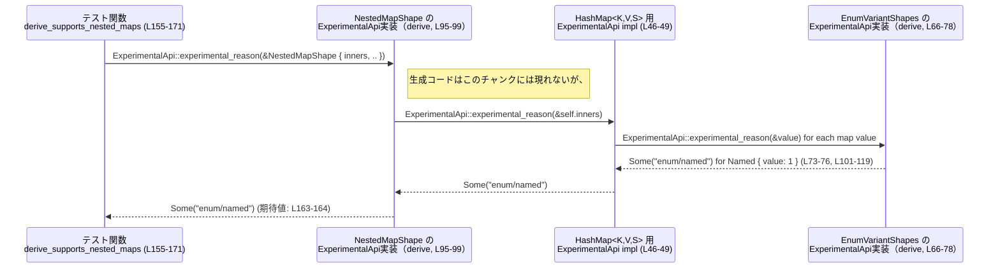

# app-server-protocol/src/experimental_api.rs コード解説

## 0. ざっくり一言

- プロトコル型が「実験的な API を使っているかどうか」を文字列識別子で報告するためのトレイト `ExperimentalApi` と、実験的フィールドのメタデータ `ExperimentalField`、およびそれらを補助する関数・コレクション向け実装を提供するモジュールです  
  （`app-server-protocol/src/experimental_api.rs:L5-22,L24-55`）。

---

## 1. このモジュールの役割

### 1.1 概要

- このモジュールは、**プロトコル定義内で実験的なメソッド・フィールドを検出し、その理由を静的な文字列で報告する** ために存在します。
- 具体的には次を提供します（`app-server-protocol/src/experimental_api.rs:L5-22,L24-32,L34-55`）。
  - 「実験的かどうか」を問い合わせるマーカー・トレイト `ExperimentalApi`
  - 実験的フィールドを表すメタデータ構造体 `ExperimentalField`
  - 登録済みの実験的フィールドを列挙する `experimental_fields`
  - 実験的機能に対するエラーメッセージを組み立てる `experimental_required_message`
  - `Option` / `Vec` / `HashMap` / `BTreeMap` に対する `ExperimentalApi` の実装

### 1.2 アーキテクチャ内での位置づけ

- 依存関係の概略は次のとおりです。

```mermaid
graph TD
    subgraph M["experimental_api モジュール (L1-55)"]
        EA["ExperimentalApi トレイト (L5-9)"]
        EF["ExperimentalField 構造体 (L11-20)"]
        EFN["experimental_fields 関数 (L24-27)"]
        ERM["experimental_required_message 関数 (L29-32)"]
    end

    StdCol["std::collections::<HashMap,BTreeMap> (L1-2)"]
    InvCrate["inventory マクロ (L22, L26)"]
    OptImpl["Option<T> impl ExperimentalApi (L34-38)"]
    VecImpl["Vec<T> impl ExperimentalApi (L40-43)"]
    HashImpl["HashMap<K,V,S> impl ExperimentalApi (L46-49)"]
    BTreeImpl["BTreeMap<K,V> impl ExperimentalApi (L52-55)"]
    Tests["tests モジュール (L58-171)"]

    EA --> OptImpl
    EA --> VecImpl
    EA --> HashImpl
    EA --> BTreeImpl

    EFN --> InvCrate
    M --> StdCol
    Tests --> EA
    Tests --> EF
    Tests --> "codex_experimental_api_macros::ExperimentalApi (L63)"
```

- 本番 API としては `ExperimentalApi` トレイトと `ExperimentalField`・二つの関数が公開されており（`pub`）、`tests` モジュールはコンパイル時にのみ有効な自己テストです（`#[cfg(test)]`、`app-server-protocol/src/experimental_api.rs:L58-59`）。

### 1.3 設計上のポイント

- **マーカー・トレイト設計**  
  `ExperimentalApi` は 1 つのメソッド `experimental_reason` だけを持つマーカー的なトレイトで、実験的利用の有無と、その識別子を返します（`app-server-protocol/src/experimental_api.rs:L5-9`）。
- **識別子は静的文字列**  
  理由は `Option<&'static str>` として返され、コンパイル時に固定された不変の文字列であることが前提になっています（`L8`）。  
  これにより、識別子が安定かつスレッド安全であることが保証されます（ランタイム生成を行わない）。
- **コレクション型へのブランケット実装**  
  `Option<T>` / `Vec<T>` / `HashMap<K,V,S>` / `BTreeMap<K,V>` について、要素型が `ExperimentalApi` を実装していれば、コレクション全体に対しても `ExperimentalApi` が自動で実装されます（`L34-55`）。
  - コレクション内の要素のうち、最初に見つかった実験的な要素の理由を返す設計になっています（`find_map` 呼び出し、`L36,L42,L48,L54`）。
- **メタデータの収集に `inventory` を利用**  
  `ExperimentalField` は `inventory::collect!` で収集対象として登録されており（`L22`）、`experimental_fields` が `inventory::iter` を通じて登録済みフィールドを列挙します（`L25-27`）。
  - `inventory` マクロの内部動作自体はこのファイルからは分かりませんが、ドキュメントコメントにより「登録された全フィールドを返す」ことが意図されていると読み取れます（`L24`）。
- **エラーメッセージの一元化**  
  実験的機能に対するエラー文言は `experimental_required_message` で一貫して生成できるようになっています（`L29-32`）。

---

## 2. 主要な機能一覧

このモジュールが提供する主要機能の一覧です。

- `ExperimentalApi` トレイト: 値が「実験的 API を利用しているかどうか」を問い合わせるためのインターフェース（`L5-9`）
- `ExperimentalField` 構造体: 特定の型上の「実験的フィールド」のメタデータ（型名・フィールド名・理由）を保持（`L11-20`）
- `experimental_fields()`: `inventory` に登録されたすべての `ExperimentalField` を列挙する（`L24-27`）
- `experimental_required_message(reason: &str)`: 実験的機能が許可されていない場合のエラーメッセージを構築する（`L29-32`）
- `ExperimentalApi` のコレクション向け実装:
  - `impl<T: ExperimentalApi> ExperimentalApi for Option<T>`（`L34-38`）
  - `impl<T: ExperimentalApi> ExperimentalApi for Vec<T>`（`L40-43`）
  - `impl<K, V: ExperimentalApi, S> ExperimentalApi for HashMap<K, V, S>`（`L46-49`）
  - `impl<K: Ord, V: ExperimentalApi> ExperimentalApi for BTreeMap<K, V>`（`L52-55`）

---

## 3. 公開 API と詳細解説

### 3.0 コンポーネントインベントリー（型・トレイト・関数一覧）

#### 型・トレイト一覧

| 名前 | 種別 | 公開範囲 | 定義位置 | 役割 / 用途 |
|------|------|----------|----------|-------------|
| `ExperimentalApi` | トレイト | `pub` | `experimental_api.rs:L5-9` | プロトコル型やそのフィールドが実験的かどうかを報告するためのインターフェース。`experimental_reason` メソッドのみを持つ。 |
| `ExperimentalField` | 構造体 | `pub` | `experimental_api.rs:L11-20` | 実験的フィールドのメタデータ（型名・フィールド名・理由識別子）を保持する。`inventory` 経由で収集される。 |
| `EnumVariantShapes` | enum | テスト内（非公開） | `experimental_api.rs:L66-78` | `#[derive(ExperimentalApi)]` を付与し、各バリアントに異なる `#[experimental]` 属性を与えて挙動をテストするための列挙型。 |
| `NestedFieldShape` | struct | テスト内（非公開） | `experimental_api.rs:L81-85` | 単一の `Option<EnumVariantShapes>` フィールドを持つテスト用型。`#[experimental(nested)]` によりネストの伝播を確認する。 |
| `NestedCollectionShape` | struct | テスト内（非公開） | `experimental_api.rs:L88-92` | `Vec<EnumVariantShapes>` フィールドを持つテスト用型。コレクションに対するネスト実装を検証する。 |
| `NestedMapShape` | struct | テスト内（非公開） | `experimental_api.rs:L95-99` | `HashMap<String, EnumVariantShapes>` フィールドを持つテスト用型。マップに対するネスト実装を検証する。 |

#### 関数・メソッド一覧

| 名前 | 種別 | シグネチャ（概要） | 公開範囲 | 定義位置 | 役割（1 行） |
|------|------|-------------------|----------|----------|--------------|
| `ExperimentalApi::experimental_reason` | トレイトメソッド | `fn experimental_reason(&self) -> Option<&'static str>` | トレイト | `experimental_api.rs:L8` | 値が実験的機能を利用している場合に、その理由識別子を返す。 |
| `experimental_fields` | 関数 | `pub fn experimental_fields() -> Vec<&'static ExperimentalField>` | `pub` | `experimental_api.rs:L24-27` | 登録済みの全 `ExperimentalField` を列挙して `Vec` に収集する。 |
| `experimental_required_message` | 関数 | `pub fn experimental_required_message(reason: &str) -> String` | `pub` | `experimental_api.rs:L29-32` | 実験的機能が要求されることを示すメッセージ文字列を構築する。 |
| `Option<T>::experimental_reason` impl | メソッド | `fn experimental_reason(&self) -> Option<&'static str>` | `impl<T: ExperimentalApi>` | `experimental_api.rs:L34-38` | `Option` が `Some` かつ中身が実験的ならその理由を返す。 |
| `Vec<T>::experimental_reason` impl | メソッド | 同上 | `impl<T: ExperimentalApi>` | `experimental_api.rs:L40-43` | ベクタ内の最初の実験的要素の理由を返す。 |
| `HashMap<K,V,S>::experimental_reason` impl | メソッド | 同上 | `impl<K, V: ExperimentalApi, S>` | `experimental_api.rs:L46-49` | マップの値のうち、最初に見つかった実験的要素の理由を返す。 |
| `BTreeMap<K,V>::experimental_reason` impl | メソッド | 同上 | `impl<K: Ord, V: ExperimentalApi>` | `experimental_api.rs:L52-55` | BTreeMap の値のうち、最初に見つかった実験的要素の理由を返す。 |
| `derive_supports_all_enum_variant_shapes` | テスト関数 | `fn derive_supports_all_enum_variant_shapes()` | `#[test]` | `experimental_api.rs:L101-119` | enum バリアントに対する `ExperimentalApi` derive の挙動を検証する。 |
| `derive_supports_nested_experimental_fields` | テスト関数 | 同上 | `#[test]` | `experimental_api.rs:L121-133` | `Option` フィールドのネスト処理を検証する。 |
| `derive_supports_nested_collections` | テスト関数 | 同上 | `#[test]` | `experimental_api.rs:L135-151` | `Vec` フィールドのネスト処理を検証する。 |
| `derive_supports_nested_maps` | テスト関数 | 同上 | `#[test]` | `experimental_api.rs:L155-171` | `HashMap` フィールドのネスト処理を検証する。 |

---

### 3.1 型一覧（構造体・列挙体など）

公開 API を中心に、主要な型を整理します。

| 名前 | 種別 | 役割 / 用途 | 主なフィールド |
|------|------|-------------|----------------|
| `ExperimentalApi` | トレイト | 「この値はどの実験的機能に依存しているか？」を問い合わせるインターフェース（`experimental_reason`）を提供します（`L5-9`）。 | なし（メソッドのみ） |
| `ExperimentalField` | 構造体 | 特定の型・フィールドが「どの実験的ゲートに属するか」を静的に記述するメタデータであり、`inventory` で収集されます（`L11-22`）。 | `type_name: &'static str`（型名）、`field_name: &'static str`（フィールド名）、`reason: &'static str`（実験的理由識別子）（`L13-19`） |

テスト専用の型（enum/struct）は 3.0 のインベントリー表を参照してください。

---

### 3.2 関数詳細（主要 7 件）

#### 1. `ExperimentalApi::experimental_reason(&self) -> Option<&'static str>`

**概要**

- このトレイトメソッドは、値が**実験的なフィールドやメソッドを利用している場合**に、その理由を表す短い識別子（`&'static str`）を返します。安定した（実験的要素を含まない）値の場合は `None` を返します（`app-server-protocol/src/experimental_api.rs:L5-9`）。

**引数**

| 引数名 | 型 | 説明 |
|--------|----|------|
| `&self` | 実装型への共有参照 | 理由を問い合わせたい値です。所有権は移動せず、読み取り専用です。 |

**戻り値**

- `Option<&'static str>`  
  - `Some(reason)`: この値が実験的機能に依存しており、その識別子が `reason` であることを示します。  
  - `None`: 実験的な要素が一切利用されていないことを示します（`L6-7`）。

**内部処理の流れ**

- このメソッド自体の本体はトレイトには定義されておらず（`L5-9`）、各実装型ごとに意味が決まります。
- 本ファイルでは、以下のようなパターンが確認できます。
  - コレクション系型では、要素を走査し、最初に見つかった `Some(reason)` を返す（`L36,L42,L48,L54`）。
  - 実際の列挙型・構造体（テスト用）は `#[derive(ExperimentalApi)]` により自動実装され、その挙動はテストから確認できます（`L66-78,L101-171`）。

**Examples（使用例）**

以下は、任意の型に対して `ExperimentalApi` を手動実装した例です（derive マクロを使わない、最小限の実装例）。

```rust
use app_server_protocol::experimental_api::ExperimentalApi; // トレイトをインポートする

// シンプルなプロトコル型を定義する                         // 実験的なフラグを持つ型
struct MyType {
    experimental: bool,                                     // 実験的機能を使っているかどうか
}

// ExperimentalApi を手動で実装する                         // 実験的かどうかを判定する実装
impl ExperimentalApi for MyType {
    fn experimental_reason(&self) -> Option<&'static str> { // トレイトの必須メソッドを実装
        if self.experimental {                              // フラグが true の場合
            Some("myType.experimental")                     // 理由識別子を返す（&'static str）
        } else {
            None                                            // 実験的でなければ None
        }
    }
}

fn check<T: ExperimentalApi>(value: &T) {                   // ジェネリックに ExperimentalApi を利用
    if let Some(reason) = ExperimentalApi::experimental_reason(value) {
        println!("実験的 API を利用: {reason}");
    }
}
```

**Errors / Panics**

- シグネチャに `Result` やエラー型は含まれておらず、メソッド自体は**エラーを返しません**（`L5-9`）。
- このファイル内の実装例（`Option` / `Vec` / `HashMap` / `BTreeMap`）は、いずれも標準ライブラリのメソッドを安全に使用しており、パニック条件は見当たりません（`L34-55`）。

**Edge cases（エッジケース）**

- 実装者側の設計に依存しますが、このファイルに現れるパターンから言えること：
  - コレクション型では、**要素が全て安定**または**コレクションが空**の場合は `None` を返します（`L36,L42,L48,L54`）。
  - 複数の実験的要素を含む場合、最初に検出した理由だけを返す実装例が多いです (`find_map` 使用)。

**使用上の注意点**

- 返ってくる文字列は `&'static str` であり、**必ず静的に決まった文字列**である必要があります。ユーザー入力など動的なデータをそのまま返さない設計が期待されます（`L8`）。
- 呼び出し側は `None` を「完全に安定な値」と解釈します。実験的要素が部分的に存在するにもかかわらず `None` を返すと、契約違反になります。

---

#### 2. `experimental_fields() -> Vec<&'static ExperimentalField>`

**概要**

- `inventory` に登録されたすべての `ExperimentalField` を列挙し、`Vec<&'static ExperimentalField>` として返す関数です（`app-server-protocol/src/experimental_api.rs:L24-27`）。

**引数**

- 引数はありません（`L25`）。

**戻り値**

- `Vec<&'static ExperimentalField>`  
  - 各要素は、登録された `ExperimentalField` への `'static` 参照です（`L25-27`）。
  - ベクタが空の場合は、登録されたフィールドがないことを意味します。

**内部処理の流れ**

1. `inventory::iter::<ExperimentalField>` を呼び出し、`ExperimentalField` 型の要素を走査するイテレータを取得する（`L25-26`）。
2. そのイテレータに対して `into_iter()` を呼び出し、通常のイテレータに変換する（`L26`）。
3. `collect()` で `Vec<&'static ExperimentalField>` に収集する（`L26`）。

`inventory` マクロの詳細な挙動はこのファイルには現れませんが、ドキュメントコメントから「プロトコル型全体で登録された実験的フィールドを集約する」意図が読み取れます（`L24`）。

**Examples（使用例）**

登録済みの実験的フィールドを列挙し、型名とフィールド名を表示する例です。

```rust
use app_server_protocol::experimental_api::{experimental_fields, ExperimentalField}; // 関数と型をインポート

fn print_all_experimental_fields() {
    let fields: Vec<&'static ExperimentalField> = experimental_fields(); // 登録済みのフィールド一覧を取得
    for field in fields {                                                // 1 件ずつ走査
        println!(
            "type = {}, field = {}, reason = {}",
            field.type_name,                                             // 型名
            field.field_name,                                            // フィールド名
            field.reason                                                 // 実験的理由識別子
        );
    }
}
```

**Errors / Panics**

- 関数シグネチャは `Result` を返さず、エラーを表現する仕組みはありません（`L24-27`）。
- 本文も `collect()` するだけで、明示的な `unwrap` や panic 呼び出しはありません（`L25-27`）。
- `inventory` クレート内部の挙動はこのチャンクには現れないため、内部でのパニックの可能性は分かりません。

**Edge cases（エッジケース）**

- 登録された `ExperimentalField` が 0 件の場合、**空の `Vec`** を返します（`collect()` の挙動から推測されます）。
- 登録の重複がある場合（同じ `type_name` / `field_name` / `reason` の組が複数回登録された場合）、それらがすべて列挙されるかどうかは `inventory` の仕様に依存し、このファイルからは分かりません。

**使用上の注意点**

- 戻り値の `Vec` は毎回新しく生成されるため、多頻度で呼び出すと GC こそ無いものの、**割り当てコストが蓄積**する可能性があります。
  - キャッシュして使い回すかどうかは、呼び出し頻度と性能要件に応じて検討する余地があります。
- `ExperimentalField` の登録自体はこのファイルには現れません（`inventory::collect!` のみ、`L22`）。どこで登録されているかは別ファイルを確認する必要があります。

---

#### 3. `experimental_required_message(reason: &str) -> String`

**概要**

- 実験的機能を利用しようとしたが、必要な capability（例: `experimentalApi`）が有効になっていないときに使うための、**統一されたエラーメッセージ**を生成します（`app-server-protocol/src/experimental_api.rs:L29-32`）。

**引数**

| 引数名 | 型 | 説明 |
|--------|----|------|
| `reason` | `&str` | 実験的機能の理由識別子。通常は `experimental_reason` が返す値（`&'static str`）が渡されることを想定しています。 |

**戻り値**

- `String`  
  - `"${reason} requires experimentalApi capability"` という形式のメッセージ文字列（`L31`）。

**内部処理の流れ**

1. フォーマット文字列 `"{reason} requires experimentalApi capability"` に対して、Rust の `format!` マクロに似た構文で `reason` を埋め込む（`L31`）。
2. 新しい `String` を生成して返す（`L31`）。

**Examples（使用例）**

`ExperimentalApi` を満たす値から理由を取り出し、この関数でエラーメッセージを作る例です。

```rust
use app_server_protocol::experimental_api::{ExperimentalApi, experimental_required_message}; // トレイトと関数

fn maybe_reject<T: ExperimentalApi>(value: &T, has_experimental: bool) -> Result<(), String> {
    if let Some(reason) = ExperimentalApi::experimental_reason(value) {   // 実験的理由を問い合わせ
        if !has_experimental {                                            // capability が無い場合
            let msg = experimental_required_message(reason);             // 統一フォーマットでメッセージ作成
            return Err(msg);                                             // エラーとして返す
        }
    }
    Ok(())                                                                // 実験的でない、または capability 有りなら成功
}
```

**Errors / Panics**

- 関数は `String` を直接返し、`Result` を使用していません（`L29-32`）。
- 本文は `format!` 構文のみであり、通常の使用ではパニック条件はありません（`L31`）。

**Edge cases（エッジケース）**

- `reason` が空文字列 `""` の場合、メッセージは `" requires experimentalApi capability"` となり、先頭に意味のない空白が入ります。
  - そのような値を渡すかどうかは呼び出し側の設計次第です。
- `reason` に改行や長い文字列を渡した場合でも特に制御されていないため、そのままメッセージに含まれます。

**使用上の注意点**

- 想定される `reason` は `ExperimentalApi::experimental_reason` が返す `&'static str` であり、**外部入力をそのまま埋め込む設計にはなっていません**。
- ログやクライアントへのエラーメッセージとしてそのまま表示されることを想定し、`reason` の命名は短く安定した識別子にしておくことが望ましいです（ドキュメントコメントより、`<method>` または `<method>.<field>` の形式が推奨されています、`L16-19`）。

---

#### 4. `impl<T: ExperimentalApi> ExperimentalApi for Option<T>`

**概要**

- `Option<T>` が `ExperimentalApi` を実装することで、**中身の値が実験的であればその理由を返し、`None` や安定値の場合は `None` を返す** 挙動を提供します（`app-server-protocol/src/experimental_api.rs:L34-38`）。

**引数**

- トレイトメソッド `experimental_reason(&self)` の引数は次と同じです。

| 引数名 | 型 | 説明 |
|--------|----|------|
| `&self` | `&Option<T>` | 実験的かどうかを確認したい `Option` 値です。 |

**戻り値**

- `Option<&'static str>`  
  - `Some(reason)`: `Some(inner)` であり、かつ `inner.experimental_reason()` が `Some(reason)` を返した場合。
  - `None`: `self` が `None`、または中身の値が安定していて `None` を返した場合（`L36`）。

**内部処理の流れ**

1. `self.as_ref()` で `Option<&T>` に変換する（`L36`）。
2. その上で `and_then(ExperimentalApi::experimental_reason)` を呼び出す（`L36`）。
   - `self` が `None` なら、そのまま `None`。
   - `self` が `Some(inner)` なら、`ExperimentalApi::experimental_reason(&inner)` を呼び出した結果を返す。

**Examples（使用例）**

```rust
use app_server_protocol::experimental_api::ExperimentalApi;             // トレイトをインポート

struct Feature;                                                         // 実験的機能を表す型

impl ExperimentalApi for Feature {                                      // Feature 自体は常に実験的とする
    fn experimental_reason(&self) -> Option<&'static str> {
        Some("feature")                                                 // 固定の理由識別子
    }
}

fn example() {
    let some_feature: Option<Feature> = Some(Feature);                  // Some ケース
    let none_feature: Option<Feature> = None;                           // None ケース

    assert_eq!(
        ExperimentalApi::experimental_reason(&some_feature),
        Some("feature")                                                 // 中身の理由がそのまま返る
    );
    assert_eq!(
        ExperimentalApi::experimental_reason(&none_feature),
        None                                                            // None は実験的とみなされない
    );
}
```

**Errors / Panics**

- `as_ref` と `and_then` の組み合わせのみであり、パニックは発生しません（`L36`）。

**Edge cases**

- `T` が `ExperimentalApi` を実装していても、その実装が常に `None` を返す場合、`Option<T>` も常に `None` を返します。
- ネストが深くても、`and_then` を経由して再帰的に判定が行われます（テスト `NestedFieldShape` のケースは、derive 実装を通じてこのパターンを確認しています、`L81-85,L121-133`）。

**使用上の注意点**

- `None` を「実験的要素が無い」とみなす設計であるため、`None` 自体を別の意味で「実験的」と扱いたい場合には、このブランケット実装は適合しません。その場合は新しい型でラップするなどの設計が必要です。

---

#### 5. `impl<T: ExperimentalApi> ExperimentalApi for Vec<T>`

**概要**

- `Vec<T>` に対する `ExperimentalApi` 実装で、**ベクタ内の最初の実験的要素の理由を返す** 挙動を提供します（`app-server-protocol/src/experimental_api.rs:L40-43`）。

**引数・戻り値**

- シグネチャは `fn experimental_reason(&self) -> Option<&'static str>` であり、引数・戻り値は `Option<T>` の場合と同様です（`L41`）。

**内部処理の流れ**

1. `self.iter()` で `&T` のイテレータを取得する（`L42`）。
2. `find_map(ExperimentalApi::experimental_reason)` を使って、各要素に対し `experimental_reason(&element)` を呼び出し、最初に `Some(reason)` を返したものをそのまま返す（`L42`）。
3. どの要素も `Some` を返さなかった場合は `None` を返す。

**Examples（使用例）**

```rust
use app_server_protocol::experimental_api::ExperimentalApi;             // トレイトをインポート

struct Stable;                                                          // 安定機能
struct Experimental;                                                    // 実験的機能

impl ExperimentalApi for Stable {
    fn experimental_reason(&self) -> Option<&'static str> { None }      // 常に安定
}

impl ExperimentalApi for Experimental {
    fn experimental_reason(&self) -> Option<&'static str> {
        Some("exp")                                                     // 実験的理由
    }
}

fn example_vec() {
    let values: Vec<Box<dyn ExperimentalApi>> = vec![];                 // この例は異なる型のため、そのままは使えない
}
```

上の例は異種型なので、そのままでは `Vec<T>` にはなりません。単一の型 `T` に対して実験的かどうか判定するのがこの実装の役割です。

シンプルな同種型の例はテスト `NestedCollectionShape` で確認できます（`L88-92,L135-151`）。

**Errors / Panics**

- `iter` と `find_map` のみを使用しており、パニックは発生しません（`L42`）。

**Edge cases**

- ベクタが空の場合：`find_map` の結果は `None` になり、実験的ではないと判断されます（`L42`）。
- 要素が複数実験的な場合：**最初に検出されたものだけ**が返されます。どの要素が最初かはベクタの順序によります。

**使用上の注意点**

- 「ベクタ内のどれか一つでも実験的ならエラーとする」といった用途に適していますが、「すべての理由を集めて報告したい」場合には、別途 `filter_map` などで全理由を集めるロジックが必要です。

---

#### 6. `impl<K, V: ExperimentalApi, S> ExperimentalApi for HashMap<K, V, S>`

**概要**

- `HashMap<K, V, S>` の値部分 `V` が `ExperimentalApi` を実装している場合、**どれか一つの値が実験的なら、その理由を返す** 実装です（`app-server-protocol/src/experimental_api.rs:L46-49`）。

**内部処理の流れ**

1. `self.values()` で値 `&V` のイテレータを取得する（`L48`）。
2. `find_map(ExperimentalApi::experimental_reason)` を呼び出し、値ごとに `experimental_reason` を問い合わせる（`L48`）。
3. 最初に `Some(reason)` を返した値があれば、それを返す。見つからなければ `None` を返す。

**Examples（使用例）**

テスト `NestedMapShape` で、`HashMap<String, EnumVariantShapes>` に対する動作が確認されています（`L95-99,L155-171`）。

```rust
use std::collections::HashMap;
use app_server_protocol::experimental_api::ExperimentalApi;

// EnumVariantShapes はテストコードでは derive(ExperimentalApi) 済み（L66-78）
// ここでは「Named バリアントが実験的」という挙動がテストされています（L101-119）。

fn example_map(map: &HashMap<String, EnumVariantShapes>) {
    let reason = ExperimentalApi::experimental_reason(map);             // マップ全体に対して問い合わせ
    // reason は、マップ内のいずれかの値が実験的なら Some("...") になる
    println!("reason = {:?}", reason);
}
```

**Errors / Panics**

- `values` と `find_map` しか使用しておらず、パニックは発生しません（`L48`）。
- 走査順の詳細は `HashMap` 実装に依存し、このファイルには現れません。

**Edge cases**

- マップが空、もしくは値がすべて安定な場合、`None` を返します。
- 複数の値が実験的な場合、どの理由が返るかは `values()` の走査順に依存します。この順序規則は、このチャンクからは分かりません。

**使用上の注意点**

- 「マップ全体として実験的かどうか」を知るには十分ですが、「どのキーが実験的か」を知るには別途ロジックが必要です（`values` にしかアクセスしていないため、キー情報は失われます、`L48`）。

---

#### 7. `impl<K: Ord, V: ExperimentalApi> ExperimentalApi for BTreeMap<K, V>`

**概要**

- `BTreeMap<K, V>` 版の `ExperimentalApi` 実装で、値 `V` のいずれかが実験的であればその理由を返します（`app-server-protocol/src/experimental_api.rs:L52-55`）。

**内部処理の流れ**

- `HashMap` の実装と同様に `self.values().find_map(ExperimentalApi::experimental_reason)` を呼んでおり（`L54`）、挙動も同じです。

**Examples（使用例）**

このファイルには `BTreeMap` を直接使うテストや例は登場しません（「このチャンクには現れない」）。挙動は `HashMap` と同様と解釈できます（走査順は `BTreeMap` の性質に依存）。

**Errors / Panics / Edge cases / 使用上の注意点**

- `HashMap` 版と同様の性質であり、違いはマップのデータ構造に依存します（`L52-55`）。

---

### 3.3 その他の関数（テスト）

テスト用関数は以下のとおりです。

| 関数名 | 役割（1 行） | 定義位置 |
|--------|--------------|----------|
| `derive_supports_all_enum_variant_shapes` | `EnumVariantShapes` の各バリアントに対する `ExperimentalApi` derive の挙動を検証する（`Unit` / `Tuple` / `Named` が `Some` を返し、`StableTuple` は `None` を返す）（`L101-119`）。 | `experimental_api.rs:L101-119` |
| `derive_supports_nested_experimental_fields` | `NestedFieldShape` 内の `Option<EnumVariantShapes>` フィールドに対するネスト処理をテストし、`Some(Named)` のときに `"enum/named"` が返ること、`None` のときに `None` になることを確認する（`L121-133`）。 | `experimental_api.rs:L121-133` |
| `derive_supports_nested_collections` | `NestedCollectionShape` 内の `Vec<EnumVariantShapes>` で、安定な要素と実験的要素が混在する場合に実験的な理由が返ること、および空ベクタで `None` になることを確認する（`L135-151`）。 | `experimental_api.rs:L135-151` |
| `derive_supports_nested_maps` | `NestedMapShape` 内の `HashMap<String, EnumVariantShapes>` に対して同様の検証を行う（`L155-171`）。 | `experimental_api.rs:L155-171` |

これらのテストから、`codex_experimental_api_macros::ExperimentalApi` derive マクロと `#[experimental(...)]` 属性が、列挙型バリアントおよび構造体フィールドに対して `ExperimentalApi` を再帰的に実装していることが分かります（`L63,L66-99,L101-171`）。

---

## 4. データフロー

### 4.1 代表的なシナリオ

このモジュールにおける代表的なデータフローとして、**ネストした構造体・マップを通じて実験的理由が伝播する** ケースを取り上げます。

テスト `derive_supports_nested_maps` では、次のような値に対して `ExperimentalApi::experimental_reason` が呼び出されています（`app-server-protocol/src/experimental_api.rs:L155-163`）。

- `NestedMapShape` 構造体（`L95-99`）
  - フィールド `inners: HashMap<String, EnumVariantShapes>`
  - `#[experimental(nested)]` 属性が付与されている（`L97-98`）。
- `EnumVariantShapes::Named { value: 1 }` は `"enum/named"` を返す実験的バリアントとしてマークされている（テストのアサーションより、`L73-76,L101-119`）。

### 4.2 シーケンス図

以下のシーケンス図は、`derive_supports_nested_maps` テストにおける `experimental_reason` 呼び出しの流れを表現したものです。



この図から分かるポイント：

- derive マクロにより、構造体の `#[experimental(nested)]` フィールドが再帰的にたどられ、その型に対する `ExperimentalApi` 実装が呼び出されます（`L81-85,L88-92,L95-99`）。
- さらに、`HashMap` の `ExperimentalApi` 実装が内部で `values().find_map(...)` を使って値を走査します（`L48`）。
- 最終的に、最も内側の `EnumVariantShapes::Named` が `"enum/named"` を返し、それが徐々に呼び出し元へ伝播します（`L73-76,L101-119,L155-164`）。

---

## 5. 使い方（How to Use）

### 5.1 基本的な使用方法

ここでは、**プロトコル型に `ExperimentalApi` を実装し、ハンドラ側で capability チェックを行う** という典型的なフローを示します。

derive マクロを使わず、手動実装で完結する例です。

```rust
// app_server_protocol::experimental_api から必要なシンボルをインポートする  // モジュールからトレイトと関数を取り込む
use app_server_protocol::experimental_api::{ExperimentalApi, experimental_required_message};

/// プロトコルのリクエスト型（例）                                   // 実際のプロトコルメッセージを簡略化した構造体
struct Request {
    use_beta_feature: bool,                                           // ベータ機能を使うかどうか
}

impl ExperimentalApi for Request {
    fn experimental_reason(&self) -> Option<&'static str> {           // ExperimentalApi の実装
        if self.use_beta_feature {                                    // ベータ機能を使う場合
            Some("request.betaFeature")                               // 実験的理由識別子を返す
        } else {
            None                                                      // 使わなければ安定
        }
    }
}

/// 実験的 capability をチェックしながらリクエストを処理する           // 実験的かどうかを判定して処理を分岐
fn handle_request(req: &Request, has_experimental_cap: bool) -> Result<(), String> {
    if let Some(reason) = ExperimentalApi::experimental_reason(req) { // 実験的理由を問い合わせ
        if !has_experimental_cap {                                    // capability が不足している場合
            let msg = experimental_required_message(reason);          // 統一エラーメッセージを生成
            return Err(msg);                                          // エラーとして返す
        }
    }

    // ここまでくれば実験的な要素は無い or 許可されている             // 正常処理
    Ok(())
}
```

この例では、言語固有のポイントとして：

- `&Request`（共有参照）を通じて所有権を移動させずに判定している点（安全性・借用の利用）。
- `ExperimentalApi::experimental_reason` は `&self` を取るだけの純粋関数であり、**内部状態の変更や I/O を行わない** ため、スレッド間で同じ値を共有してもこの関数呼び出し自体は安全であることが読み取れます（`L5-9,L34-55`）。

### 5.2 よくある使用パターン

1. **ネストした型・コレクションの利用**

   `Option` や `Vec` を使ったプロトコル型に対して、ブランケット実装がそのまま利用できます。

   ```rust
   use app_server_protocol::experimental_api::ExperimentalApi;             // トレイトをインポート

   struct Feature {
       experimental: bool,
   }

   impl ExperimentalApi for Feature {
       fn experimental_reason(&self) -> Option<&'static str> {
           if self.experimental { Some("feature") } else { None }         // 単純な判定
       }
   }

   struct Request {
       features: Vec<Feature>,                                            // 複数機能の一覧
   }

   impl ExperimentalApi for Request {
       fn experimental_reason(&self) -> Option<&'static str> {
           ExperimentalApi::experimental_reason(&self.features)           // Vec<Feature> への実装に委譲（L40-43）
       }
   }
   ```

   このように、構造体側では単にフィールドに対する `experimental_reason` を呼び出すだけで、コレクションの走査ロジックはモジュール側に委譲できます。

2. **メタデータの列挙（ドキュメント・スキーマ生成など）**

   実験的フィールドの一覧を使って、ドキュメント生成や capability 説明を行うことも考えられます。

   ```rust
   use app_server_protocol::experimental_api::experimental_fields;        // 関数をインポート

   fn print_capabilities_doc() {
       for field in experimental_fields() {                               // すべての ExperimentalField を列挙
           println!(
               "{}.{} => {}",
               field.type_name,                                           // 型名
               field.field_name,                                          // フィールド名
               field.reason                                               // 実験的理由識別子
           );
       }
   }
   ```

   ただし、実際にどのように `ExperimentalField` が登録されているかはこのチャンクには現れず、別のファイル／クレートでの `inventory` 使用箇所を確認する必要があります（`L22`）。

### 5.3 よくある間違い

このファイルから推測できる、起こりそうな誤用例とその修正版です。

```rust
use app_server_protocol::experimental_api::{ExperimentalApi, experimental_required_message};

// 間違い例: ExperimentalApi トレイトをインポートしていないため、           // トレイトがスコープに無く、メソッド呼び出しが解決できない
// value.experimental_reason() を直接呼べない可能性がある
fn wrong<T: ExperimentalApi>(value: &T) -> Result<(), String> {
    // value.experimental_reason();                                        // トレイトが in scope でなければコンパイルエラー
    Ok(())
}

// 正しい例: トレイトを use し、UFCS 形式かメソッド形式で呼び出す
fn correct<T: ExperimentalApi>(value: &T, has_cap: bool) -> Result<(), String> {
    if let Some(reason) = ExperimentalApi::experimental_reason(value) {    // トレイト名を明示した呼び出し
        if !has_cap {
            return Err(experimental_required_message(reason));             // 統一メッセージを使用
        }
    }
    Ok(())
}
```

### 5.4 使用上の注意点（まとめ）

- **契約（Contracts）**
  - `ExperimentalApi::experimental_reason` が返す `&'static str` は、**安定した識別子**として扱われます。後方互換性を意識する場合、識別子の変更は慎重に行う必要があります（`L6-8,L16-19`）。
  - `None` は「完全に安定である」という意味で使われており、「理由はあるが不明」という意味ではありません。
- **安全性（Safety）**
  - このモジュール内には `unsafe` ブロックは存在せず（`L1-55`）、メモリ安全性は Rust の通常のルールに従って自動的に保証されています。
  - 共有参照 `&self` のみを受け取り、内部状態を書き換えるメソッドはありません。
- **並行性（Concurrency）**
  - グローバルな可変状態を扱うコードはありません（`L1-55`）。
  - `experimental_fields` は `inventory` に依存しており、その内部のスレッド安全性はこのチャンクからは分かりませんが、少なくともこの関数は読み取り専用であり、呼び出し側からは純粋関数として扱えます（`L24-27`）。
- **パフォーマンス**
  - コレクション版 `experimental_reason` は `find_map` により要素を逐次走査するため、**最悪 O(n)** のコストを持ちます（`L42,L48,L54`）。
  - `experimental_fields` は毎回 `Vec` を確保して全要素を収集するため、頻繁な呼び出しには注意が必要です（`L25-27`）。
- **観測性（Observability）**
  - このモジュール自体はログ・メトリクスなどを出力しません。観測性は上位レイヤー（ハンドラ側）でエラーをログ出力するなどして確保する必要があります。

---

## 6. 変更の仕方（How to Modify）

### 6.1 新しい機能を追加する場合

1. **新しいプロトコル型を ExperimentalApi 対応させる**

   - 対象の型定義（例: `Request`, `Response`）のあるファイルで `ExperimentalApi` を実装します。
   - 単純な型であれば直接 `impl ExperimentalApi for MyType` を書きます（`L5-9`）。
   - ネストした型やコレクションを含む場合、すでに提供されている `Option` / `Vec` / `HashMap` / `BTreeMap` の実装を再利用し、フィールドに対して `ExperimentalApi::experimental_reason` を委譲すると、ロジックを簡潔に保てます（`L34-55`）。

2. **新しいコンテナ型に対応させる**

   - たとえば `SmallVec<T>` や独自の `Map` 型にも同様の挙動を持たせたい場合、このファイルに `impl ExperimentalApi for MyContainer<T>` を追加します。
   - 実装パターンは、既存のベクタやマップ向け実装（`find_map` を使う）を参考にすると安全です（`L40-43,L46-49,L52-55`）。

3. **新しい実験的フィールドメタデータを登録する**

   - `ExperimentalField` は `inventory::collect!` を使って収集対象として登録されていますが（`L22`）、具体的にどこで `ExperimentalField` インスタンスを生成しているかはこのチャンクには現れません。
   - 新しいフィールドを登録したい場合は、別ファイルで `ExperimentalField` を生成し、`inventory` の提供するマクロ（例: `inventory::submit!` など）を用いる設計が想定されますが、詳細は該当ファイル／クレートの実装を確認する必要があります。

### 6.2 既存の機能を変更する場合

- **`ExperimentalApi` トレイトの変更**

  - このトレイトのシグネチャ（特に戻り値の `Option<&'static str>`）を変えると、すべての実装に影響します（`L5-9, L34-55`）。
  - 互換性を保つためには、新しいメソッドを追加する形（例: `fn reasons(&self) -> Vec<&'static str>`）で拡張する方が安全です。

- **コレクション実装の仕様変更**

  - `Vec` や `HashMap` で「最初に検出された理由のみを返す」という仕様を変えたい場合、`find_map` の部分を変更することになります（`L42,L48,L54`）。
  - 例えば「複数の理由を結合して返す」などの仕様にしたい場合は、戻り値の型（`Option<&'static str>`）自体を変更する必要があり、API 互換性への影響が大きくなります。

- **`experimental_required_message` のフォーマット変更**

  - メッセージ形式を変えると、テストやクライアント側の期待値に影響する可能性があります（`L31`）。
  - もし既存クライアントが文字列の一部をパースしている場合、互換性破壊になりうるため注意が必要です。

- **関連するテストの確認**

  - `tests` モジュールには derive マクロとコレクション実装の挙動を検証するテストが含まれています（`L101-171`）。
  - コレクションやネストの仕様を変更した場合は、これらのテストを更新し、振る舞いが意図どおりであることを確認する必要があります。

---

## 7. 関連ファイル

このチャンクから直接参照できる関連要素は次のとおりです。

| パス / クレート | 役割 / 関係 |
|-----------------|------------|
| `app-server-protocol/src/experimental_api.rs` | 本レポートの対象ファイル。`ExperimentalApi` と `ExperimentalField`、コレクション実装、テストを含む。 |
| `codex_experimental_api_macros` クレート | テスト内で `#[derive(ExperimentalApi)]` を提供する派生マクロクレート。実際のパスや実装はこのチャンクには現れませんが、`ExperimentalApi` の自動実装に用いられています（`L63,L66-99`）。 |
| `inventory` クレート | `ExperimentalField` の収集・列挙に使用されるマクロを提供します（`inventory::collect!`, `inventory::iter`、`L22,L25-26`）。内部実装はこのファイルからは分かりません。 |
| `pretty_assertions` クレート | テスト内で `assert_eq!` を拡張するために使われています（`L64`）。 |

このファイル単体では、`ExperimentalField` の生成／登録ロジックや、実運用で `ExperimentalApi` がどの型に実装されているかは分かりません。その詳細を把握するには、同一クレート内の他のソースファイルおよび `codex_experimental_api_macros` クレートの実装を確認する必要があります。
