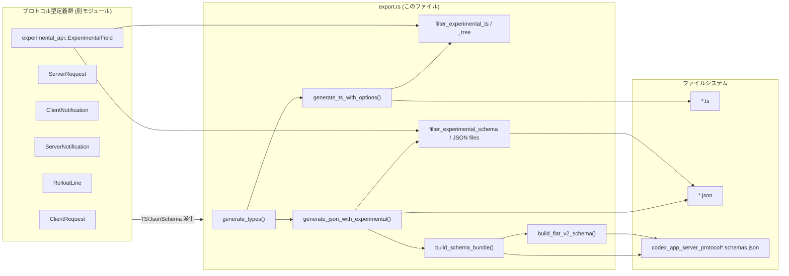
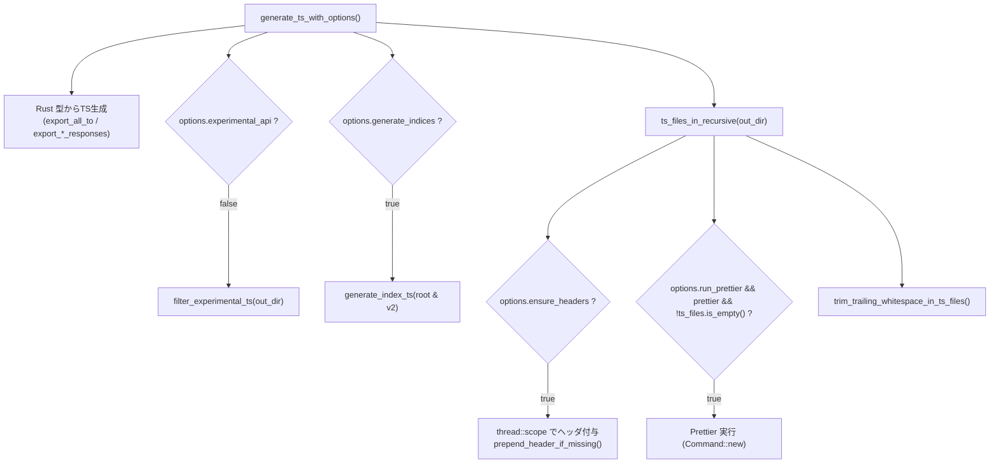
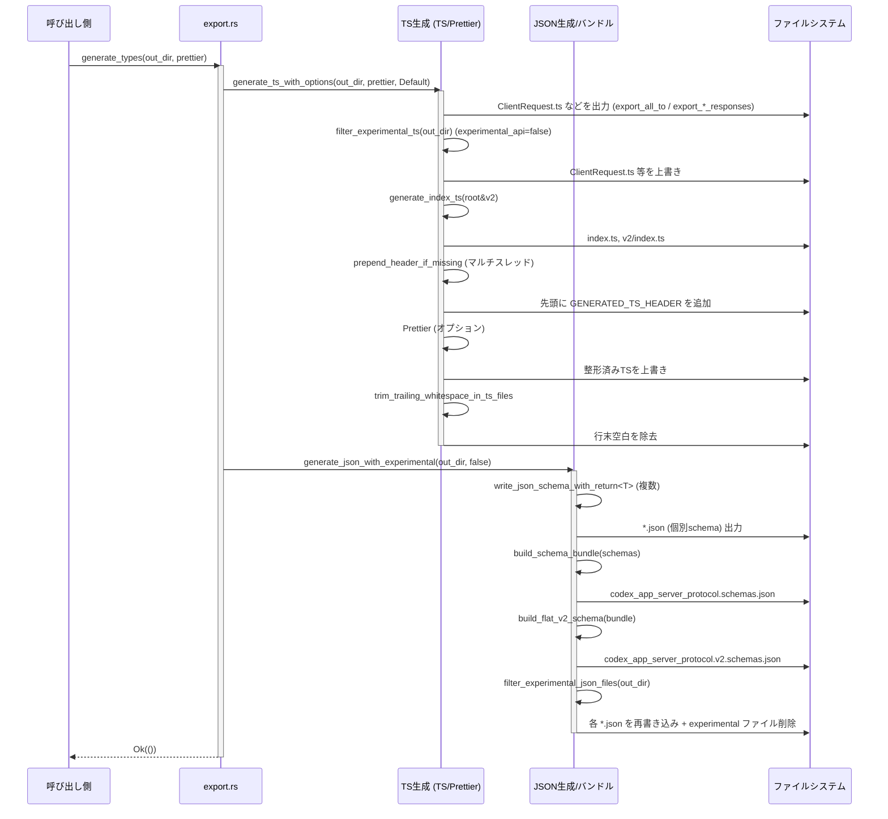

# app-server-protocol/src/export.rs コード解説

## 0. ざっくり一言

`export.rs` は、**Codex app server プロトコルの Rust 型定義から TypeScript 型と JSON Schema を生成し、安定版 API と実験的 API を切り分けるための中核モジュール**です。  
TS/JSON の個別ファイル生成、バンドル化（`schemas.json`）、v2 用のフラットスキーマ、experimental 項目のフィルタリングまでを一手に担っています。

> 行番号について  
> 提供されたコード断片には行番号が含まれていないため、本レポートではすべての根拠を  
> `export.rs:(行番号情報なし)` と表記し、関数名等で対応箇所を特定する方針とします。

---

## 1. このモジュールの役割

### 1.1 概要

このモジュールは **「Rust で定義されたプロトコル型を外部言語用の定義に変換する」** という問題を解決するために存在し、主に次の機能を提供します（`export.rs:(行番号情報なし)`）：

- Rust 型（`JsonSchema` / `TS` を実装した型）から **TypeScript 型定義ファイル（`.ts`）の生成**
- 同じく Rust 型から **JSON Schema（draft-07）ファイル（`.json`）の生成**
- 生成されたスキーマを集約した **バンドル JSON**（`codex_app_server_protocol.schemas.json` と v2 用 `...v2.schemas.json`）の構築
- `#[experimental(...)]` などでマークされた **実験的 API やフィールドの TS/JSON からの除去**
- TS ファイルの **ヘッダ付与、インデックス生成、不要空白除去、Prettier 呼び出し**

### 1.2 アーキテクチャ内での位置づけ

このモジュールは「プロトコルの型定義群」と「生成された TS/JSON ファイル」をつなぐ変換層に位置づけられます。



### 1.3 設計上のポイント

コードから読み取れる設計上の特徴は次の通りです（`export.rs:(行番号情報なし)`）：

- **責務分割**
  - 「TS 生成」「JSON 生成」「experimental フィルタリング」「スキーマバンドル構築」「TS/JSON パーサ的ユーティリティ」などに関数群が整理されている
- **状態管理**
  - 永続的なグローバル状態は持たず、必要な情報は引数・戻り値（特に `GeneratedSchema` ベクタや `serde_json::Value`）で受け渡している
- **エラーハンドリング**
  - パブリック関数は原則 `anyhow::Result<()>` / `Result<Value>` を返し、I/O エラーや外部コマンド失敗、整合性違反（足りない定義など）をエラーとして明示的に伝播
  - 一部の設計上の不整合は `panic!` で検出（番号付き定義名の衝突や variant title の衝突）
- **並行性**
  - TS ファイルのヘッダ付与のみ `thread::scope` によるマルチスレッド処理を行い、他はシングルスレッドで順次処理
- **experimental API の扱い**
  - `experimental_api::experimental_fields()` や `EXPERIMENTAL_CLIENT_METHODS` などのメタデータを用いて、TS・JSON 双方で experimental 手法を一貫して除去する

---

## 2. 主要な機能一覧（コンポーネントインベントリー）

### 2.1 主な型・構造体

| 名前 | 種別 | 公開範囲 | 役割 / 用途 | 根拠 |
|------|------|----------|-------------|------|
| `GeneratedSchema` | 構造体 | `pub`（フィールドは private） | 個々の JSON Schema と、その論理名・名前空間・v1 配下かどうかのメタ情報を保持し、バンドル構築時の基本単位になる | `export.rs:(行番号情報なし)` |
| `GenerateTsOptions` | 構造体 | `pub` | TS 生成時のオプション（index 生成、ヘッダ付与、Prettier 実行、experimental API の扱い）をまとめる | 同上 |
| `ScanState` | 構造体 | private | TypeScript 風ソース文字列を解析するときの状態（文字列リテラル中か、ネストの深さなど）を保持 | 同上 |
| `Depth` | 構造体 | private | 括弧・波括弧・角括弧・山括弧の深さを追跡し、トップレベルかどうかを判定 | 同上 |

### 2.2 主要な関数・モジュールレベル機能

（重要度の高いもの）

- 型エクスポートのエントリポイント
  - `generate_types(out_dir, prettier)`：TS と JSON の両方を生成
- TypeScript 生成
  - `generate_ts(out_dir, prettier)` / `generate_ts_with_options(out_dir, prettier, options)`：TS 生成の本体
  - `filter_experimental_ts(out_dir)` / `filter_experimental_ts_tree(tree)`：experimental なメソッド・フィールドを TS から除去
  - `generate_index_ts(out_dir)` / `generate_index_ts_tree(tree)`：`index.ts` の生成
- JSON Schema 生成
  - `generate_json(out_dir)` / `generate_json_with_experimental(out_dir, experimental_api)`：JSON Schema と bundle 生成
  - `generate_internal_json_schema(out_dir)`：内部向け `RolloutLine` スキーマ生成
  - `write_json_schema_with_return<T>` / `write_json_schema<T>`：個々の Rust 型から JSON Schema を生成し、ファイル出力＋`GeneratedSchema` を返す
- スキーマバンドル構築・変形
  - `build_schema_bundle(schemas)`：`Vec<GeneratedSchema>` から bundle JSON（`definitions` マップを持つルートオブジェクト）を構築
  - `build_flat_v2_schema(bundle)`：v2 namespace をフラット化した v2 専用 bundle を生成
  - `filter_experimental_schema(bundle)`：bundle から experimental フィールド・メソッドと関連定義を除去
- experimental タイプの管理
  - `experimental_method_types()` / `collect_experimental_type_names(...)`：experimental なメソッドに紐づく型名の集合を構築
  - `remove_generated_type_files(...)` / `remove_generated_type_entries(...)` / `remove_experimental_method_type_definitions(...)`：experimental 型用の TS/JSON ファイルや bundle 定義を削除
- TS/JSON 文字列処理ユーティリティ
  - `split_type_alias`, `type_body_brace_span`, `split_top_level*`, `extract_method_from_arm`, `parse_property_name`, `parse_string_literal` 等：TS ソース片から union arms / プロパティ名 / string literal を抜き出す
  - `annotate_schema`, `annotate_variant_list`, `set_discriminator_titles` 等：JSON Schema に title や discriminator 用タイトルを付加
- ファイル操作ユーティリティ
  - `ts_files_in[_recursive]`, `json_files_in_recursive`, `prepend_header_if_missing`, `trim_trailing_line_whitespace`, `write_pretty_json`, `ensure_dir` 等

---

## 3. 公開 API と詳細解説

### 3.1 型一覧（構造体・列挙体など）

| 名前 | 種別 | フィールド | 役割 / 用途 |
|------|------|-----------|-------------|
| `GeneratedSchema` | 構造体 (`#[derive(Clone)]`) | `namespace: Option<String>` / `logical_name: String` / `value: Value` / `in_v1_dir: bool` | 1 つの JSON Schema と、その型名・名前空間・v1 配下かどうかのメタ情報をまとめる。`build_schema_bundle` の入力単位。 |
| `GenerateTsOptions` | 構造体 (`#[derive(Clone, Copy, Debug)]`) | `generate_indices: bool` / `ensure_headers: bool` / `run_prettier: bool` / `experimental_api: bool` | TS 生成時の挙動を制御。`Default` 実装あり。 |
| `ScanState` | 構造体（private） | `depth: Depth`, `string_delim: Option<char>`, `escape: bool` | 文字列解析時に「今文字列リテラル中か／エスケープ中か／ネスト深さは？」を追跡。 |
| `Depth` | 構造体（private） | `brace: i32`, `bracket: i32`, `paren: i32`, `angle: i32` | `{}`, `[]`, `()`, `<>` の深さを保持し、トップレベルかどうか判定する (`is_top_level`)。 |

### 3.2 重要関数の詳細（テンプレート適用）

#### `generate_types(out_dir: &Path, prettier: Option<&Path>) -> Result<()>`

**概要**

- プロトコルの全 TS 型と JSON Schema を生成する **高レベルなエントリポイント**です。
- 内部で `generate_ts` と `generate_json` を順に呼び出します。

**引数**

| 引数名 | 型 | 説明 |
|--------|----|------|
| `out_dir` | `&Path` | 生成ファイルを配置するルートディレクトリ。`v2/` などのサブディレクトリもこの下に作成されます。 |
| `prettier` | `Option<&Path>` | Prettier の実行ファイルパス。`Some(path)` の場合、TS 生成後に Prettier を `--write` で実行。`None` の場合は実行しません。 |

**戻り値**

- `Result<()>`（`anyhow::Result` エイリアス）  
  - 成功時：`Ok(())`  
  - 失敗時：`Err` に I/O エラーや Prettier 実行失敗などの情報が格納されます。

**内部処理の流れ**

1. `generate_ts(out_dir, prettier)` を呼び出し、TS ファイルを生成。
2. `generate_json(out_dir)` を呼び出し、JSON Schema と bundle JSON を生成。
3. どちらかが `Err` を返した場合、そのエラーをそのまま呼び出し元に伝播。

**Examples（使用例）**

```rust
use std::path::Path;
use app_server_protocol::export::generate_types;

fn main() -> anyhow::Result<()> {
    let out_dir = Path::new("schema/typescript");            // 出力先ディレクトリ
    let prettier = Some(Path::new("/usr/local/bin/prettier")); // Prettier バイナリへのパス

    generate_types(out_dir, prettier)?;                      // TS と JSON をまとめて生成
    Ok(())
}
```

**Errors / Panics**

- `generate_ts` または `generate_json` が返す `Err` をそのまま返します。
  - 例：出力ディレクトリ作成失敗、ファイル書き込み失敗、Prettier の非 0 終了など。
- この関数自身は `panic!` を行いません。

**Edge cases（エッジケース）**

- `out_dir` が既に存在していてもそのまま利用され、内容は上書きされます。
- `prettier` が `None` の場合でも生成処理自体は行われ、整形のみスキップされます。

**使用上の注意点**

- ビルドスクリプト（`build.rs`）から呼び出す場合、**一度だけ**呼ぶ前提で設計されています。高頻度で呼ぶとファイル I/O が多くなりビルド時間が悪化します。
- `prettier` パスは信頼できるものを渡す必要があります（任意のバイナリを実行するため）。

---

#### `generate_ts_with_options(out_dir: &Path, prettier: Option<&Path>, options: GenerateTsOptions) -> Result<()>`

**概要**

- TypeScript 型定義ファイル生成の本体です。
- `ClientRequest` / `ServerRequest` / 各種レスポンス・通知型から TS を生成し、experimental の除去、`index.ts` 生成、ヘッダ付与、Prettier 実行、末尾空白削除までを行います。

**引数**

| 引数名 | 型 | 説明 |
|--------|----|------|
| `out_dir` | `&Path` | TS ファイル出力ルート。`v2/` サブディレクトリもここに作られる。 |
| `prettier` | `Option<&Path>` | Prettier バイナリへのパス。`options.run_prettier` が `true` で、かつ `Some` のときのみ実行。 |
| `options` | `GenerateTsOptions` | 生成挙動を制御するオプションセット。 |

**戻り値**

- `Result<()>`  
  I/O エラー、Prettier 実行失敗、ヘッダ付与スレッドの panic などを `Err` として返します。

**内部処理の流れ（概略）**

1. `out_dir` と `out_dir/v2` を `ensure_dir` で作成。
2. 各 Rust 型から TS を出力
   - `ClientRequest::export_all_to(out_dir)?`
   - `export_client_responses(out_dir)?`
   - `ClientNotification::export_all_to(out_dir)?`
   - `ServerRequest::export_all_to(out_dir)?`
   - `export_server_responses(out_dir)?`
   - `ServerNotification::export_all_to(out_dir)?`
3. `options.experimental_api == false` の場合、`filter_experimental_ts(out_dir)?` で experimental 要素を除去。
4. `options.generate_indices` が `true` の場合、`generate_index_ts(out_dir)?` と `generate_index_ts(&v2_out_dir)?` を呼び、`index.ts` を生成。
5. `ts_files_in_recursive(out_dir)?` で全 TS ファイルリストを取得。
6. `options.ensure_headers` が `true` の場合：
   - `available_parallelism()` からワーカースレッド数を決定。
   - `thread::scope` を使って、複数スレッドで `prepend_header_if_missing(file)` を実行。
   - いずれかのスレッドが panic した場合は `"TypeScript header worker panicked"` というエラーで返す。
7. `options.run_prettier` かつ `prettier` が `Some` かつ TS ファイル非空のとき、Prettier を `Command::new(prettier_bin)` で呼び出し、ステータスを検証。
8. `trim_trailing_whitespace_in_ts_files(&ts_files)?` で行末の空白やタブを削除。

**Mermaid（処理フロー）**



**Examples（使用例）**

```rust
use std::path::Path;
use app_server_protocol::export::{generate_ts_with_options, GenerateTsOptions};

fn main() -> anyhow::Result<()> {
    let out_dir = Path::new("schema/typescript");

    let mut options = GenerateTsOptions::default();    // generate_indices, ensure_headers, run_prettier = true
    options.experimental_api = true;                  // experimental も含めて生成したい場合

    generate_ts_with_options(out_dir, None, options)?; // Prettierは使わない例
    Ok(())
}
```

**Errors / Panics**

- `fs::create_dir_all`、`fs::write` などのファイル I/O 失敗
- Prettier 実行失敗（`status.success() == false`）時に `Err(anyhow!("Prettier failed with status {status}"))`
- ヘッダ付与スレッドの panic は `"TypeScript header worker panicked"` として `Err` になります。
- 関数内では `panic!` を使用していません（panic が起きるとすれば、内部で呼ばれるコードの panic です）。

**Edge cases（エッジケース）**

- TS ファイル数が 0 件の場合  
  - ヘッダ付与スレッドは `chunk_size` 計算により問題なく処理されます。  
  - Prettier 実行条件で `!ts_files.is_empty()` を見ているため、Prettier は呼ばれません。
- `available_parallelism()` が失敗した場合  
  - `.map_or(1, usize::from)` によりスレッド数は 1 にフォールバックします。

**使用上の注意点**

- **並行性**  
  - `thread::scope` により、クロージャ内で `&PathBuf` などへの参照を安全に利用しています。共有リソースは `ts_files` の読み取りのみで書き込みは各ファイルに対して独立です。
- **外部コマンド**  
  - Prettier は任意のパスを実行するため、信頼できるパスを指定する必要があります。
- **実験的 API フィルタ**  
  - 安定版リリース用には `experimental_api = false` を用い、experimental メソッド／フィールドを確実に除去する運用が想定されます。

---

#### `generate_json_with_experimental(out_dir: &Path, experimental_api: bool) -> Result<()>`

**概要**

- JSON Schema 個別ファイルと、2 種類の bundle JSON を生成する中核関数です。
- `experimental_api` フラグに応じて experimental なメソッド／フィールドを含めるかどうかを制御します。

**引数**

| 引数名 | 型 | 説明 |
|--------|----|------|
| `out_dir` | `&Path` | JSON Schema および bundle を出力するルートディレクトリ。 |
| `experimental_api` | `bool` | `true` の場合、experimental な API も含めたスキーマを生成し、ファイルフィルタリングもスキップします。 |

**戻り値**

- `Result<()>`  
  - I/O 失敗、bundle 構築失敗、flat v2 生成時の整合性エラーなどを `Err` で返します。

**内部処理の流れ**

1. `ensure_dir(out_dir)?` で出力ディレクトリを準備。
2. JSON-RPC の envelope 型群に対して `write_json_schema_with_return` を呼び、`Vec<GeneratedSchema>` に格納。
3. パラメータ・レスポンス・通知などのスキーマを `export_client_param_schemas` / `export_server_response_schemas` などから追加。
4. `schemas.retain(...)` により、`v1/` ディレクトリに属するスキーマのうち `JSON_V1_ALLOWLIST` に含まれないものを除去。
5. `build_schema_bundle(schemas)?` で混在バンドル（v1/v2 含む）を構築。
6. `experimental_api == false` の場合は `filter_experimental_schema(&mut bundle)?` で experimental 要素を除去。
7. `codex_app_server_protocol.schemas.json` に bundle を出力。
8. `build_flat_v2_schema(&bundle)?` で v2 専用のフラットな bundle を構築し、`codex_app_server_protocol.v2.schemas.json` に出力。
9. `experimental_api == false` の場合、`filter_experimental_json_files(out_dir)?` で各 JSON ファイルから experimental 要素を除去し、experimental 型ファイルを削除。

**Examples（使用例）**

```rust
use std::path::Path;
use app_server_protocol::export::generate_json_with_experimental;

fn main() -> anyhow::Result<()> {
    let out_dir = Path::new("schema/json");

    // 安定版スキーマのみを生成
    generate_json_with_experimental(out_dir, false)?;

    // 開発用途で experimental を含める場合
    // generate_json_with_experimental(out_dir, true)?;

    Ok(())
}
```

**Errors / Panics**

- `build_schema_bundle` や `build_flat_v2_schema` が `Err` を返すケース
  - 例：namespace 準拠しない bundle 形式、依存定義が欠落しているなど。
- `filter_experimental_schema` 内部で `panic!` が使われている箇所（番号付き定義名の衝突など）まで踏み込んだ場合は panic する可能性がありますが、本関数自体は `panic!` を呼びません。

**Edge cases（エッジケース）**

- `schemas` が空の場合でも、`build_schema_bundle` は `definitions` が空のオブジェクトを生成できます。
- `experimental_api = true` の場合：
  - `filter_experimental_schema` および `filter_experimental_json_files` は呼ばれません。
  - すべての experimental メソッド・フィールド・型が bundle および個別 JSON に残ります。

**使用上の注意点**

- **v1 ディレクトリの扱い**  
  - `JSON_V1_ALLOWLIST` に列挙されていない v1 型は bundle から除外されるため、依存関係に注意が必要です。
- **flat v2 bundle**  
  - Python の datamodel-code-generator など、単一 `definitions` マップを期待するツール向けに設計されています。v2 以外の定義も、依存関係として必要な分だけ含まれます。

---

#### `filter_experimental_ts_tree(tree: &mut BTreeMap<PathBuf, String>) -> Result<()>`

**概要**

- 生成済みの TypeScript ファイル内容（パス→内容のマップ）から、experimental なメソッドやフィールド、およびそれらに対応する型定義を除去します。
- 実ファイルではなく「インメモリのツリー」に対するバージョンで、テストや別の生成パイプラインで利用されます。

**引数**

| 引数名 | 型 | 説明 |
|--------|----|------|
| `tree` | `&mut BTreeMap<PathBuf, String>` | キーがファイルパス（`ClientRequest.ts` など）、値がファイル内容の TS ソース文字列であるマップ。 |

**戻り値**

- `Result<()>`  
  処理内で I/O は発生せず、エラーはほぼ論理的失敗時に限られます（現状コードからは `Ok(())` のみ返しているロジック）。

**内部処理の流れ**

1. `experimental_fields()` と `experimental_method_types()` から experimental フィールドおよび型名を取得。
2. `ClientRequest.ts` エントリがあれば、`filter_client_request_ts_contents` を使って experimental メソッドの union arm を削除。
3. `fields_by_type_name` マップを構築し、type 名ごとに experimental フィールド名集合を持たせる。
4. `tree` 内の各 `*.ts` エントリに対して：
   - `file_stem`（拡張子を除いたファイル名）をもとに、対象 type 名に対応する experimental フィールド名集合を取得。
   - `filter_experimental_type_fields_ts_contents` で対象フィールドを TS 定義から削除し、`tree` を更新。
5. `remove_generated_type_entries(tree, &experimental_method_types, "ts")` を呼び、experimental メソッド型に対応するエントリごと `tree` から削除。

**Examples（使用例）**

テストや自前のコード生成パイプラインから、`export_all_to` の代わりにインメモリツリーを扱う場面を想定できます。

```rust
use std::collections::BTreeMap;
use std::path::PathBuf;
use app_server_protocol::export::filter_experimental_ts_tree;

fn filter_in_memory_ts(mut tree: BTreeMap<PathBuf, String>) -> anyhow::Result<BTreeMap<PathBuf, String>> {
    filter_experimental_ts_tree(&mut tree)?;
    Ok(tree)
}
```

**Errors / Panics**

- 関数自体は `anyhow::Result<()>` を返すものの、内部でエラーを返している箇所はありません。
- 各種検査ロジック（`parse_string_literal` や `type_body_brace_span`）が期待しない形の TS 文字列に遭遇した場合も、`Option::None` でスキップする設計になっており panic しません。

**Edge cases**

- `tree` に `ClientRequest.ts` が存在しない場合：
  - 何もせず `Ok(())` を返します。
- experimental メタデータが空の場合：
  - `fields_by_type_name` が空になり、フィールド除去処理はスキップされます。

**使用上の注意点**

- `tree` のキー（パス）は、`Path::new("ClientRequest.ts")` などの **相対パス** で扱われているため、呼び出し側でのパスの付け方と一致させる必要があります。

---

#### `build_schema_bundle(schemas: Vec<GeneratedSchema>) -> Result<Value>`

**概要**

- `GeneratedSchema` の一覧から、最終的な JSON Schema バンドル（`{ "$schema": ..., "title": ..., "definitions": {...} }` 形式）を構築します。
- v2 などの名前空間を `definitions.v2.*` のような階層にまとめ、参照 (`$ref`) の書き換えや title 付与もここで実施します。

**引数**

| 引数名 | 型 | 説明 |
|--------|----|------|
| `schemas` | `Vec<GeneratedSchema>` | 個々の型に対する JSON Schema とメタ情報の一覧。`write_json_schema_with_return` などから得られる。 |

**戻り値**

- `Result<Value>`  
  成功時はルート Schema（`serde_json::Value::Object`）を返します。失敗時は定義名衝突などで `Err`。

**内部処理の流れ（簡略）**

1. `collect_namespaced_types(&schemas)` で、名前空間付き type 名→namespace（例：`ThreadId`→`"v2"`）のマップを構築。
2. 空の `definitions: Map<String, Value>` を用意。
3. 各 `GeneratedSchema` について：
   - `IGNORED_DEFINITIONS` に含まれる論理名はスキップ。
   - `namespace` があれば `rewrite_refs_to_namespace(&mut value, ns)` を適用。なければ `rewrite_refs_to_known_namespaces(&mut value, &namespaced_types)` を適用。
   - スキーマ本体から `definitions` フィールドを一時的に取り出し、それぞれの def について：
     - `IGNORED_DEFINITIONS` / `SPECIAL_DEFINITIONS` をスキップ。
     - `annotate_schema(&mut def_schema, Some(def_name))` でタイトルや discriminator タイトルを付与。
     - def 名に対して namespace を決定：  
       - 元の `GeneratedSchema` に namespace があればそれを優先。  
       - そうでなければ `namespace_for_definition(&def_name, &namespaced_types)` で推論（v1 ディレクトリは除外）。
     - namespace が決まれば `insert_into_namespace(&mut definitions, ns, def_name, def_schema)` を呼ぶ。  
       namespace が異なる場合は `forced_namespace_refs` に積んで後で `$ref` を書き換える。
     - namespace がなければ `definitions.insert(def_name, def_schema)`。
   - `forced_namespace_refs` に基づき、`rewrite_named_ref_to_namespace(&mut value, &ns, &name)` を適用。
   - 最後にスキーマ本体を `definitions` に登録：
     - `namespace` が Some の場合は `insert_into_namespace(&mut definitions, ns, logical_name, value)`。
     - None の場合は `definitions.insert(logical_name, value)`。
4. 最終的なルートオブジェクトを組み立て：
   - `$schema`: `"http://json-schema.org/draft-07/schema#"`
   - `title`: `"CodexAppServerProtocol"`
   - `type`: `"object"`
   - `definitions`: 上記で構築したマップ

**Errors / Panics**

- `insert_definition` 内で schema 定義の衝突があった場合、`Err(anyhow!(...))` を返します。
- `annotate_schema` や `annotate_variant_list` 内で variant title の衝突が検出された場合は `panic!` します（その場合この関数は戻りません）。

**Edge cases**

- 定義の namespace 推論：</br>
  `namespace_for_definition` は `ThreadId` と `ThreadId1` のような番号付き定義にも対応しており、末尾の数字を落とした名称で照合します。
- `SPECIAL_DEFINITIONS`（`ClientRequest` / `ServerRequest` 等）は特別扱いされ、namespace への自動移動対象から除外されます。

**使用上の注意点**

- 入力 `schemas` の `namespace` や `in_v1_dir` が正しく設定されていることが前提です。  
  `write_json_schema_with_return` を通さず手で構築する場合は、この点に注意が必要です。

---

#### `build_flat_v2_schema(bundle: &Value) -> Result<Value>`

**概要**

- `build_schema_bundle` が生成した「混在バンドル」（`definitions` 直下に v1/v2 両方がある形式）から、**v2 用のフラットな bundle** を構築する関数です。
- datamodel-code-generator のように、単一階層の `definitions` しか辿らないツール向けの形式を作るために利用されます。

**引数**

| 引数名 | 型 | 説明 |
|--------|----|------|
| `bundle` | `&Value` | `build_schema_bundle` が返した JSON Schema バンドル。`definitions.v2.*` などを含む。 |

**戻り値**

- `Result<Value>`  
  成功時はフラット化された v2 bundle を返します（`title` は `"CodexAppServerProtocolV2"` に書き換えられる）。

**内部処理の流れ**

1. ルートが `Object` かつ `definitions` を持っているかチェック。なければエラー。
2. `definitions["v2"]` を v2 定義マップとして取得。存在しなければエラー。
3. 新しい `flat_root` を `root.clone()` から作成。
4. `flat_definitions` を `v2_definitions.clone()` で初期化。
5. `FLAT_V2_SHARED_DEFINITIONS`（`ClientRequest`, `ServerNotification` など）に対して：
   - 対応するスキーマを `definitions` から取り出し、
   - そこから `collect_non_v2_refs` で v2 以外の `$ref` 先を収集、
   - `shared_definitions` に追加。
6. `collect_definition_dependencies(definitions, non_v2_refs)` で、非 v2 参照の依存定義を transitively 収集し、`flat_definitions` に追加。
7. `flat_definitions.extend(shared_definitions)` で共有スキーマをマージ。
8. `flat_root["title"]` を `"{title}V2"` に更新。
9. `flat_root["definitions"]` を `flat_definitions` に差し替え。
10. `rewrite_ref_prefix(&mut flat_bundle, "#/definitions/v2/", "#/definitions/")` で `$ref` を書き換え。
11. `ensure_no_ref_prefix(&flat_bundle, "#/definitions/v2/", "flat v2")?` で v2 プレフィックスが残っていないことを検証。
12. `ensure_referenced_definitions_present(&flat_bundle, "flat v2")?` で、参照されている定義がすべて存在することを検証。

**Errors / Panics**

- 入力 `bundle` が期待する形式でない場合（`definitions` がない／`definitions.v2` がないなど）、`Err(anyhow!(...))` を返します。
- `ensure_no_ref_prefix`／`ensure_referenced_definitions_present` の検証に失敗した場合も `Err` を返します。
- 関数自体は `panic!` を呼びません。

**Edge cases**

- `FLAT_V2_SHARED_DEFINITIONS` で指定した共有スキーマが存在しない場合、それらはスキップされます（`Some(shared_schema)` を `else { continue }` で処理）。
- `collect_definition_dependencies` は、非 v2 `$ref` を辿って依存関係を集めるため、依存が循環していても `seen` セットにより無限ループにはなりません。

**使用上の注意点**

- この関数は v2 以外にも、v2 から参照される root 定義も含めます。  
  「純粋に v2 のみ」ではなく「v2 と、その周辺の依存を含む」と理解する必要があります。

---

#### `filter_experimental_schema(bundle: &mut Value) -> Result<()>`

**概要**

- JSON Schema バンドルから **experimental フィールドおよび experimental メソッドとその関連型定義を削除する** 中心的な関数です。

**引数**

| 引数名 | 型 | 説明 |
|--------|----|------|
| `bundle` | `&mut Value` | `build_schema_bundle` で構築した JSON Schema バンドル。in-place で書き換えられます。 |

**戻り値**

- `Result<()>`  
  現状のコードでは基本 `Ok(())` を返し、エラーは発生していません。

**内部処理の流れ**

1. `experimental_fields()` から experimental フィールド一覧を取得。
2. `filter_experimental_fields_in_root(bundle, &registered_fields)` で、bundle の root が特定 type（`title` と `type_name` を比較）に対応する場合、そのプロパティから experimental フィールドを削除。
3. `filter_experimental_fields_in_definitions(bundle, &registered_fields)` で、`definitions` 内の各定義に対して
   - `definition_matches_type(def_name, type_name)` 判定に基づき experimental フィールドを削除。
4. `prune_experimental_methods(bundle, EXPERIMENTAL_CLIENT_METHODS)` で
   - JSON 値全体を走査し、`is_experimental_method_variant(item, experimental_methods)` が true になる variant を `Array` から除去。
5. `remove_experimental_method_type_definitions(bundle)` で
   - `experimental_method_types()` が返す type 名集合にマッチする `definitions` のエントリを削除（namespace mapも再帰的に処理）。

**Errors / Panics**

- 関数自体は `Result<()>` を返しますが、現状 `Err` を返している箇所はありません。
- 削除対象が見つからない場合も、単に何もしないだけでエラーにはなりません。

**Edge cases**

- `bundle` の JSON 形式が想定と異なる場合（`definitions` がない、`properties.method` が存在しないなど）はすべて `Option::None` によってスキップされます。
- `EXPERIMENTAL_CLIENT_METHODS` に空文字列が混じっている場合は `.filter(|method| !method.is_empty())` で除外されます。

**使用上の注意点**

- この関数は `generate_json_with_experimental(..., experimental_api = false)` の中で呼ばれる前提で設計されています。  
  手動で呼び出す場合、bundle の構造が `build_schema_bundle` によって構築されたものと同じである必要があります。

---

### 3.3 その他の関数（主なグルーピング）

すべてを列挙すると非常に多いため、役割ごとの主要な関数グループのみ示します。

| 関数名 | 役割（1 行） |
|--------|--------------|
| `generate_ts`, `generate_json`, `generate_internal_json_schema` | それぞれ TS 全体、JSON 全体、内部向け schema のエントリポイント。 |
| `filter_experimental_ts`, `filter_experimental_type_fields_ts`, `filter_experimental_fields_in_ts_file` | TS ファイルから experimental メソッド/フィールドを削除するファイルベース API。 |
| `filter_client_request_ts`, `filter_client_request_ts_contents` | `ClientRequest.ts` の union 型から experimental メソッドの arm を削除。 |
| `filter_experimental_json_files`, `remove_generated_type_files`, `remove_generated_type_entries` | JSON ファイルや schema ツリーから experimental 型のファイル／エントリを削除。 |
| `write_json_schema_with_return`, `write_json_schema` | `JsonSchema` を実装する Rust 型から JSON Schema を生成し、ファイルに書きつつ `GeneratedSchema` を返す。 |
| `collect_experimental_type_names`, `experimental_method_types` | experimental メソッドに紐づく型名集合の構築。 |
| `strip_v1_client_request_variants_from_json_schema`, `strip_v1_server_notification_variants_from_json_schema` | v1 専用とみなす JSON-RPC メソッド variant を JSON Schema から削除。 |
| `reachable_local_definitions` 系 | JSON Schema 内で到達可能なローカル定義のみを残すための参照解析。 |
| `annotate_schema`, `annotate_variant_list`, `set_discriminator_titles`, `variant_definition_name` | schema の `title` と discriminator 用タイトルを自動生成し、variant を識別しやすくする。 |
| `ts_files_in`, `ts_files_in_recursive`, `trim_trailing_whitespace_in_ts_files`, `trim_trailing_line_whitespace`, `prepend_header_if_missing` | TS ファイルの列挙、ヘッダ付与、行末空白削除などのファイル操作ユーティリティ。 |
| `generate_index_ts`, `generate_index_ts_tree`, `index_ts_entries`, `generated_index_ts_with_header` | `index.ts` の生成ロジック（ファイルベースとツリーベース）。 |

---

## 4. データフロー

ここでは、もっとも代表的なシナリオである **`generate_types` 呼び出し時のデータフロー** を説明します。

### 4.1 全体フロー（TS + JSON）



### 4.2 安全性・整合性チェックの流れ

- TS 生成系
  - `thread::scope` によるヘッダ付与で panic を捕捉し、`Result` に変換。
- JSON 生成系
  - `build_flat_v2_schema` 後に
    - `ensure_no_ref_prefix(..., "#/definitions/v2/", "flat v2")`  
      → v2 namespace を参照する `$ref` が残っていないか検証。
    - `ensure_referenced_definitions_present(flat_bundle, "flat v2")`  
      → すべての `$ref` が `definitions` マップに存在することを確認。

---

## 5. 使い方（How to Use）

### 5.1 基本的な使用方法

最も一般的な使い方は、ビルドスクリプトやツールから **TS/JSON の両方をまとめて生成**することです。

```rust
// build.rs の例
use std::path::Path;
use app_server_protocol::export::generate_types;

fn main() -> anyhow::Result<()> {
    let out_dir = Path::new("schema/typescript");      // TS/JSON を吐き出すルートディレクトリ
    let prettier = std::env::var_os("PRETTIER_BIN")    // 環境変数から Prettier のパスを取得
        .as_ref()
        .map(Path::new);

    generate_types(out_dir, prettier)?;                // TS + JSON + bundle を生成
    println!("cargo:rerun-if-changed=src/protocol");   // 必要に応じて再ビルドトリガ
    Ok(())
}
```

### 5.2 よくある使用パターン

1. **安定版 API 用スキーマだけ欲しい場合**
   - `GenerateTsOptions::default()`（`experimental_api = false`）で TS を生成
   - `generate_json_with_experimental(out_dir, false)` で JSON を生成

2. **experimental を含む TS だけ欲しい場合**

```rust
use std::path::Path;
use app_server_protocol::export::{generate_ts_with_options, GenerateTsOptions};

fn main() -> anyhow::Result<()> {
    let out_dir = Path::new("schema/experimental_ts");
    let options = GenerateTsOptions {
        generate_indices: true,
        ensure_headers: true,
        run_prettier: false,      // 整形は自前で行う
        experimental_api: true,   // experimental を含める
    };

    generate_ts_with_options(out_dir, None, options)?;
    Ok(())
}
```

1. **テストでインメモリの TS ツリーをフィルタリング**

```rust
use std::collections::BTreeMap;
use std::path::PathBuf;
use app_server_protocol::export::filter_experimental_ts_tree;

fn filter_for_snapshot(mut ts_tree: BTreeMap<PathBuf, String>) -> anyhow::Result<BTreeMap<PathBuf, String>> {
    filter_experimental_ts_tree(&mut ts_tree)?;
    Ok(ts_tree)
}
```

### 5.3 よくある間違い

```rust
// 誤り例: experimental_api=false であることを期待しているのに明示しない
use app_server_protocol::export::generate_ts_with_options;

let options = GenerateTsOptions {
    generate_indices: true,
    ensure_headers: true,
    run_prettier: true,
    experimental_api: true, // ← 間違い: stable スキーマなのに true にしてしまう
};

generate_ts_with_options(out_dir, Some(prettier), options)?;

// 正しい例: 安定版用には experimental_api=false を指定
let options = GenerateTsOptions {
    experimental_api: false,
    ..GenerateTsOptions::default()
};
generate_ts_with_options(out_dir, Some(prettier), options)?;
```

### 5.4 モジュール全体としての注意点（まとめ）

- **スレッド安全性**
  - 並行処理はヘッダ付与のみで、各スレッドは異なるファイルを処理します。共有可変状態は存在せず、Rust の所有権ルールに従って安全に実装されています。
- **I/O 負荷**
  - 多数の TS/JSON ファイルを読み書きするため、CI などで頻繁に実行すると時間がかかる可能性があります。
- **external コマンド**
  - Prettier のパスは明示的に引数で渡す必要があります。信頼できないパスを渡すと任意のバイナリが実行されるため注意が必要です。
- **experimental API の扱い**
  - 安定版へリリースするビルドでは必ず `experimental_api = false` を設定し、`generate_json_with_experimental(..., false)` を使うことが前提の設計になっています。

---

## 6. 変更の仕方（How to Modify）

### 6.1 新しい機能を追加する場合

例：新しいカテゴリのスキーマを JSON バンドルに含めたい。

1. **JSON 生成パスへ統合**
   - 新しいエクスポート関数（例：`export_foo_schemas(out_dir) -> Result<Vec<GeneratedSchema>>`）を別モジュールに実装。
   - `generate_json_with_experimental` 内の `schemas.extend(...)` の箇所に、この関数呼び出しを追加します。
2. **experimental フィルタとの連携**
   - experimental なフィールドの場合は `experimental_api::ExperimentalField` に登録し、`experimental_fields()` から参照できるようにします。
   - experimental なメソッドの場合は `EXPERIMENTAL_CLIENT_METHODS` / `_PARAM_TYPES` / `_RESPONSE_TYPES` に追加し、TS/JSON 双方のフィルタリングで認識させます。
3. **テストの追加**
   - `tests` モジュールに、追加したフィールド／メソッドが `experimental_api=false` で生成物から除外されることを確認するテストを追加します。

### 6.2 既存の機能を変更する場合

- **影響範囲の確認**
  - 関連する関数呼び出しを `rg` などで検索し、`generate_types` / `generate_ts_with_options` / `generate_json_with_experimental` からの呼び出しチェーンを確認します。
- **契約（前提条件・返り値）の維持**
  - `build_flat_v2_schema` のような関数は、`ensure_*` 系の検査を通過することが契約になっています。`$ref` の形式を変更する際は、これらの検査ロジックも合わせて更新する必要があります。
- **テスト・fixture の更新**
  - `schema_fixtures::read_schema_fixture_subtree` を利用して TS/JSON のスナップショットを検証しているテストが多数あるため、生成フォーマットに変更があれば fixture の更新が必要になります。

---

## 7. 関連ファイル

このモジュールと密接に関係する主なファイル・モジュールは次の通りです（パス名はコードから読み取れる範囲で記述しています）。

| パス / モジュール | 役割 / 関係 |
|-------------------|------------|
| `crate::ClientRequest`, `crate::ServerRequest`, `crate::ClientNotification`, `crate::ServerNotification` | Rust 側の JSON-RPC リクエスト／レスポンス／通知型。TS/JSON 生成の基盤となる型です。 |
| `crate::export_client_param_schemas` 等 | 各種クライアント／サーバパラメータ・レスポンス・通知スキーマを `GeneratedSchema` ベクタとしてエクスポートする関数群。`generate_json_with_experimental` から利用。 |
| `crate::experimental_api::{experimental_fields, ExperimentalField}` | experimental フィールドを宣言・収集するモジュール。TS/JSON での experimental フィルタリングに利用。 |
| `crate::protocol::common::{EXPERIMENTAL_CLIENT_METHODS, EXPERIMENTAL_CLIENT_METHOD_PARAM_TYPES, EXPERIMENTAL_CLIENT_METHOD_RESPONSE_TYPES}` | experimental なメソッド/そのパラメータ型/レスポンス型名を列挙した定数。TS/JSON から該当型を削除するために使われます。 |
| `codex_protocol::protocol::RolloutLine` | `generate_internal_json_schema` で単独の JSON Schema を生成する内部向け型。 |
| `crate::schema_fixtures::read_schema_fixture_subtree` | テストで使用されるフィクスチャ読み込みヘルパー。生成物が期待どおりかを比較するために利用。 |
| `crate::protocol::v2` | テスト内で `v2::ThreadStartParams` などを用いて experimental フィールドの有無を検証している v2 namespace モジュール。 |

---

## 付録: バグ・セキュリティ・エッジケース・テスト・パフォーマンスの観点

### セキュリティ・安全性の観点

- 外部入力は基本的に存在せず、**生成対象は自前の Rust 型定義**です。  
  文字列パーサ（TS/JSON 用ユーティリティ）は、期待しないフォーマットに対しては `None` でスキップする設計で、panic しないよう配慮されています。
- 外部コマンド呼び出しは Prettier のみで、`Command::new(prettier_bin)` に渡すのは呼び出し側が指定したパスと生成した TS ファイルパスです。  
  任意のバイナリ実行を避けるため、呼び出し側でパスの正当性を保証する必要があります。

### 既知の失敗モード／panic の可能性

- `detect_numbered_definition_collisions` や `annotate_variant_list` で、variant/title 名の衝突を検出した場合は `panic!` します。  
  これは「生成されるスキーマの構造が曖昧になっている」ことを検出するためのガードです。
- これら panic は主に開発時・テスト時の発見を目的としており、本番での使用ではその前に検出・修正されていることが期待されます。

### エッジケース（共通）

- **v1 関連**
  - `JSON_V1_ALLOWLIST` に載っていない v1 スキーマは bundle から除外されるため、v1 スキーマを追加する際はここに追記する必要がある場合があります。
- **TS 解析ユーティリティ**
  - `type_body_brace_span` は `export interface` または `type Alias = {...}` の 2 形態に対応しています。それ以外の構文には対応していないため、将来的に生成 TS のスタイルが変わるとフィルタロジックが効かなくなる可能性があります。

### テストのカバレッジ

テストモジュールでは、以下の観点が検証されています。

- experimental メソッド／フィールドが TS/JSON から適切に除去されるか
- `?: T | null` という「optional + nullable」な TypeScript フィールドが、許可された型（`*Params` など）にしか現れないか
- `build_schema_bundle` が root helper と v2 定義の参照を正しく書き換えるか
- `build_flat_v2_schema` が v2 用 bundle をフラット化しつつ、必要な shared 定義をすべて含むか
- experimental フィールド削除ロジックが
  - `export interface` 形式の TS にも対応しているか
  - intersection 型の suffix で使用されている import を誤って削除しないか

### パフォーマンス上の注意

- 大規模なスキーマセットの場合、`build_schema_bundle` や `build_flat_v2_schema` が多数の `$ref` を走査するため、**JSON の走査回数が増加**します。
- TS ファイルのヘッダ付与は CPU コア数に応じて並列化されますが、ファイル数が少ない場合は並列化のオーバーヘッドが支配的になる可能性があります。`available_parallelism()` から計算されるワーカー数はファイル数より多くならないように制限されています。

---

このレポートは、提供された `export.rs` のコードのみを根拠として記述しており、他ファイルの実装詳細やプロジェクト全体の設計意図については推測していません。
