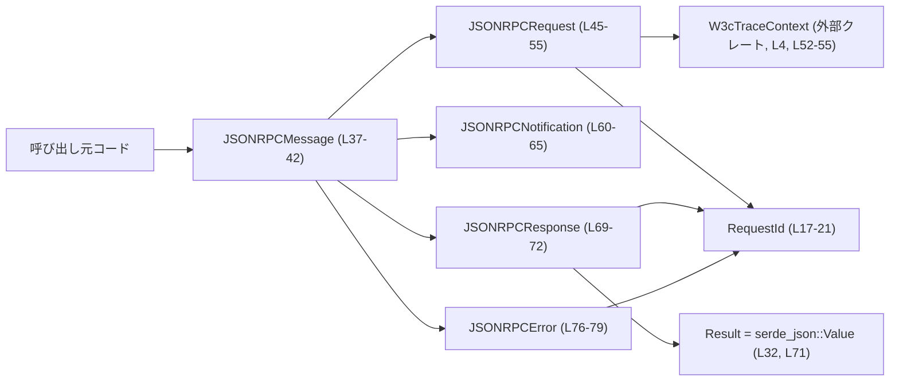
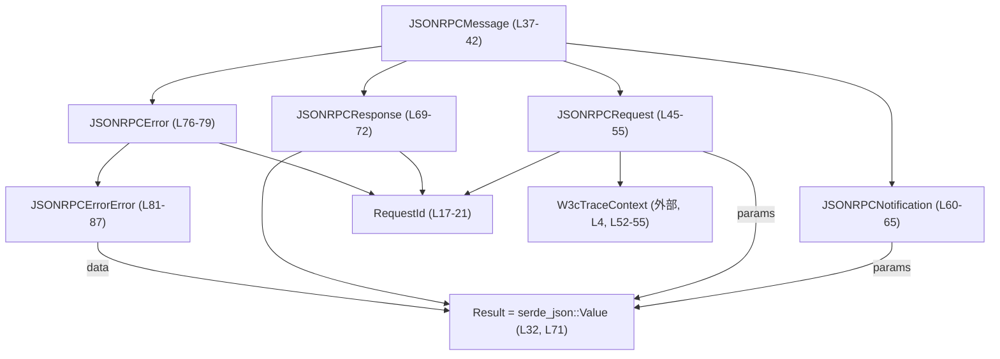
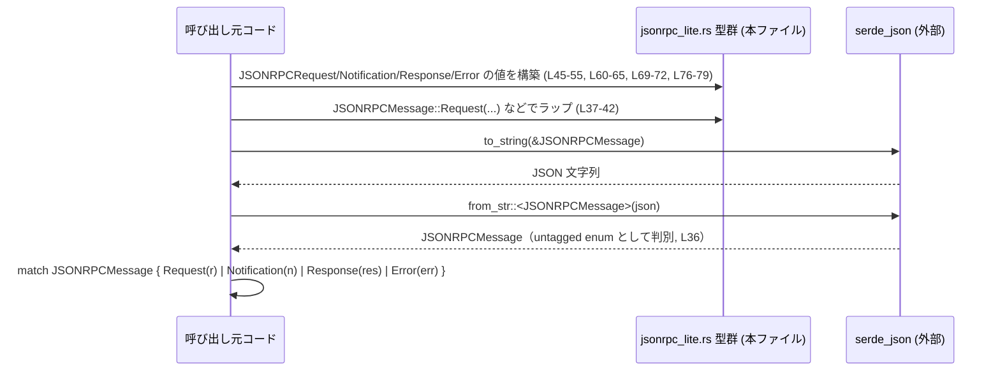

# app-server-protocol/src/jsonrpc_lite.rs

## 0. ざっくり一言

JSON-RPC 風のリクエスト／レスポンス／通知／エラーを表現するための共通データ型と、`id` 表現用の `RequestId` を定義するモジュールです（ただし `"jsonrpc": "2.0"` フィールドは扱わないことがコメントで明示されています `jsonrpc_lite.rs:L1-2`）。

---

## 1. このモジュールの役割

### 1.1 概要

- このモジュールは、JSON 上でやり取りされる RPC 風メッセージを Rust の型として表現するために存在します。
- リクエスト／通知／レスポンス／エラーを列挙型 `JSONRPCMessage` でまとめて扱えるようにし、個別の構造体で詳細を保持します `jsonrpc_lite.rs:L37-42, L45-55, L60-65, L69-72, L76-79`。
- `RequestId` により、文字列 ID と整数 ID の両方をサポートします `jsonrpc_lite.rs:L17-21`。
- ドキュメントコメントにある通り `"jsonrpc": "2.0"` フィールドは送受信しない前提で設計されています `jsonrpc_lite.rs:L1-2`。

### 1.2 アーキテクチャ内での位置づけ

- 外部依存:
  - `serde::{Serialize, Deserialize}` による JSON シリアライズ／デシリアライズ `jsonrpc_lite.rs:L6-7`。
  - `schemars::JsonSchema` による JSON Schema 自動生成 `jsonrpc_lite.rs:L5, L14, L35, L45, L59, L68, L75, L81`。
  - `ts_rs::TS` による TypeScript 型定義生成 `jsonrpc_lite.rs:L9, L14, L35, L45, L59, L68, L75, L81`。
  - `codex_protocol::protocol::W3cTraceContext` によるトレース情報の埋め込み `jsonrpc_lite.rs:L4, L52-55`。
- このモジュール自体には I/O やビジネスロジックは含まれず、「RPC メッセージの型定義」と「表示フォーマット（`Display`）」のみを提供します。

代表的な依存関係を表す図です（ノードの括弧内は定義行範囲です）。



※ 呼び出し元コードやネットワーク層など、実際にこれらの型を使うロジックはこのチャンクには現れません。

### 1.3 設計上のポイント

- **untagged enum による柔軟な JSON 表現**
  - `RequestId` と `JSONRPCMessage` は `#[serde(untagged)]` を付与し、JSON 上でタグフィールドを持たない自然なオブジェクトとして表現されます `jsonrpc_lite.rs:L16, L36`。
- **オプションフィールドとデフォルト**
  - `params`, `trace`, `data` フィールドは `Option` かつ `default`＋`skip_serializing_if` で定義されており、JSON 上では「省略可能なフィールド」として扱われます `jsonrpc_lite.rs:L49-55, L62-64, L84-86`。
- **多言語連携**
  - 全ての主要型に `JsonSchema` と `TS` を派生させ、JSON Schema や TypeScript 型への自動変換を前提とした設計になっています `jsonrpc_lite.rs:L14, L35, L45, L59, L68, L75, L81`。
- **状態を持たないデータキャリア**
  - 全てのフィールドは公開フィールドを持つ単純な構造体・列挙体であり、内部可変性やグローバル状態はありません。
- **エラーハンドリング**
  - 実際のエラー処理ロジックは別モジュール側にありますが、このモジュールは `JSONRPCError` とその中身 `JSONRPCErrorError` により、エラーを構造化して表現できるようになっています `jsonrpc_lite.rs:L76-79, L81-87`。

---

## 2. 主要な機能一覧（コンポーネントインベントリー）

このファイルで定義される主要コンポーネントと役割です。

- `JSONRPC_VERSION`: `"2.0"` という文字列定数（コメントでは `"jsonrpc"` フィールドを使わないとあるため、どこで使うかはこのチャンクからは不明）`jsonrpc_lite.rs:L11`。
- `RequestId`: 文字列／整数のどちらでも表現できるリクエスト ID 型 `jsonrpc_lite.rs:L17-21`。
- `impl fmt::Display for RequestId`: `RequestId` を人間可読な文字列にフォーマットする実装 `jsonrpc_lite.rs:L23-29`。
- `Result`（型エイリアス）: `serde_json::Value` の別名で、レスポンスの `result` 値を表すために使用 `jsonrpc_lite.rs:L32, L71`。
- `JSONRPCMessage`: Request / Notification / Response / Error を 1 つの列挙型で表すトップレベルメッセージ型 `jsonrpc_lite.rs:L37-42`。
- `JSONRPCRequest`: 応答を期待するリクエスト `jsonrpc_lite.rs:L45-55`。
- `JSONRPCNotification`: 応答を期待しない通知 `jsonrpc_lite.rs:L60-65`。
- `JSONRPCResponse`: 成功レスポンス `jsonrpc_lite.rs:L69-72`。
- `JSONRPCError`: エラーレスポンス `jsonrpc_lite.rs:L76-79`。
- `JSONRPCErrorError`: エラーコード・メッセージ・任意データを保持する構造体 `jsonrpc_lite.rs:L81-87`。

---

## 3. 公開 API と詳細解説

### 3.1 型一覧（構造体・列挙体など）

| 名前                | 種別        | 役割 / 用途                                                                                      | 定義位置                      |
|---------------------|-------------|--------------------------------------------------------------------------------------------------|-------------------------------|
| `JSONRPC_VERSION`   | 定数        | JSON-RPC バージョン文字列 `"2.0"` を保持（このファイル内では未使用）                            | `jsonrpc_lite.rs:L11`         |
| `RequestId`         | 列挙体      | リクエスト ID を文字列または整数として表現。JSON では untagged enum としてシリアライズ         | `jsonrpc_lite.rs:L17-21`      |
| `Result`            | 型エイリアス| `serde_json::Value` の別名。`JSONRPCResponse.result` フィールドの型                             | `jsonrpc_lite.rs:L32, L71`    |
| `JSONRPCMessage`    | 列挙体      | Request / Notification / Response / Error のいずれかを保持するトップレベルメッセージ           | `jsonrpc_lite.rs:L37-42`      |
| `JSONRPCRequest`    | 構造体      | 応答を期待する RPC リクエスト。`id`, `method`, 任意の `params`, 任意の `trace` を保持          | `jsonrpc_lite.rs:L45-55`      |
| `JSONRPCNotification` | 構造体    | 応答を期待しない通知。`method` と任意の `params` のみを保持                                     | `jsonrpc_lite.rs:L60-65`      |
| `JSONRPCResponse`   | 構造体      | 成功レスポンス。`id` と任意 JSON 値の `result` を保持                                           | `jsonrpc_lite.rs:L69-72`      |
| `JSONRPCError`      | 構造体      | エラーレスポンス。`id` と `error` オブジェクトを保持                                            | `jsonrpc_lite.rs:L76-79`      |
| `JSONRPCErrorError` | 構造体      | エラー詳細。数値コード、オプション `data`、メッセージ文字列を保持                               | `jsonrpc_lite.rs:L81-87`      |

### 3.2 関数詳細

このファイルで定義されている明示的な関数は、`RequestId` に対する `fmt::Display` 実装のみです。

#### `impl fmt::Display for RequestId { fn fmt(&self, f: &mut fmt::Formatter<'_>) -> fmt::Result }`

**定義位置**

- `jsonrpc_lite.rs:L23-29`

**概要**

- `RequestId` を `Display` トレイトに従って文字列へフォーマットします。
- 文字列 ID の場合はそのまま、整数 ID の場合は 10 進数文字列として出力します `jsonrpc_lite.rs:L25-27`。

**引数**

| 引数名 | 型                      | 説明                                  |
|--------|-------------------------|---------------------------------------|
| `&self`| `&RequestId`            | 表示対象の `RequestId`                |
| `f`    | `&mut fmt::Formatter<'_>` | 出力先フォーマッタ（`println!` 等から提供） |

**戻り値**

- `fmt::Result`（`Result<(), fmt::Error>` の型エイリアス）:
  - 書き込み成功時は `Ok(())`。
  - 書き込み失敗時（例えば出力先がエラーを返した場合）は `Err(fmt::Error)`。

**内部処理の流れ**

1. `match self` で列挙体のバリアントを判別します `jsonrpc_lite.rs:L25`。
2. `RequestId::String(value)` の場合:
   - `f.write_str(value)` により、内部の文字列をそのまま書き込みます `jsonrpc_lite.rs:L26`。
3. `RequestId::Integer(value)` の場合:
   - `write!(f, "{value}")` マクロで整数値を 10 進表現に変換し、書き込みます `jsonrpc_lite.rs:L27`。
4. いずれの分岐も `fmt::Result` を返し、そのまま呼び出し元に伝播されます。

**Examples（使用例）**

`RequestId` を文字列／整数として使い分け、`println!` で表示する例です。

```rust
use app_server_protocol::jsonrpc_lite::RequestId; // 実際のパスはクレート構成に依存（このチャンクには現れません）

fn main() {
    let id_str = RequestId::String("req-123".to_string()); // 文字列 ID
    let id_int = RequestId::Integer(42);                   // 整数 ID

    // Display により文字列として出力される
    println!("string id = {}", id_str); // => "string id = req-123"
    println!("int id    = {}", id_int); // => "int id    = 42"
}
```

**Errors / Panics**

- `fmt::Display` 実装内部で明示的に `panic!` を呼んでいないため、通常はパニックしません。
- `fmt::Result` が `Err(fmt::Error)` になる可能性はありますが、これはフォーマッタ `f` への書き込みが失敗した場合（たとえば、書き込み先がエラーを返したとき）に限られます。  
  エラーの扱い自体は `println!` や呼び出し側のフォーマッタ実装に委ねられています。

**Edge cases（エッジケース）**

- **非常に大きい整数**:
  - `i64` の範囲内であれば、そのまま 10 進表現で出力されます。  
    `i64` に収まらない JSON 数値を `RequestId::Integer` にデシリアライズしようとした場合の挙動は、`serde` 側の処理に依存し、このファイルからは詳細不明です。
- **空文字列や特殊文字を含む文字列 ID**:
  - `RequestId::String` は中身の文字列をそのまま書き出すため、空文字列でも、そのままの内容が出力されます。
  - 非 ASCII 文字や制御文字も変換なしで出力されるため、ログやコンソール上での表示には注意が必要な場合があります。

**使用上の注意点**

- `Display` 実装は単純なフォーマットのみを行い、ID の妥当性チェック（空文字列禁止など）は行いません。
- ログなどに出力する際、ID に機密情報が含まれる設計にしている場合は、その点に注意が必要です（このファイルでは ID の意味づけや生成方法は定義されていません）。

### 3.3 その他の関数

このファイルには、上記 `fmt` 関数以外のメソッド・関数定義は存在しません（`serde` や `derive` で自動生成されるコードは除く）。

---

## 4. データフロー

このモジュールは型のみを定義しており、実行時処理は他モジュールで行われます。そのため、ここでは「型間のデータの流れ」に限定して整理します。

### 4.1 型間の関係



- 上図のように、`JSONRPCMessage` は 4 種類のメッセージ構造体のラッパーとして機能します `jsonrpc_lite.rs:L37-42`。
- `RequestId` は `Request`／`Response`／`Error` で共有される ID 型です `jsonrpc_lite.rs:L47, L70, L78`。
- 各種 `params` や `result`、`error.data` はすべて任意の JSON 値 (`serde_json::Value`) として表現されます `jsonrpc_lite.rs:L32, L51, L64, L71, L86`。

### 4.2 想定される利用シナリオ（型レベル）

このファイルにはネットワーク処理などは含まれませんが、型の構成から、次のような型レベルの流れが想定されます（処理の具体的な実装はこのチャンクには現れません）。



※ ここで示したシーケンスは型の構成から読み取れる「典型的な使い方」の一例であり、実際の呼び出し元コードはこのチャンクには存在しません。

---

## 5. 使い方（How to Use）

### 5.1 基本的な使用方法

`JSONRPCRequest` を作成して `JSONRPCMessage` に包み、JSON にシリアライズする基本例です。

```rust
use serde_json::json;
use serde_json;
use app_server_protocol::jsonrpc_lite::{
    RequestId, JSONRPCRequest, JSONRPCMessage, JSONRPCResponse, JSONRPCError,
    JSONRPCErrorError, Result,
}; // 実際のパスはクレート構成に依存（このチャンクには現れません）

fn main() -> Result<(), Box<dyn std::error::Error>> {
    // リクエストを構築する (L45-55)
    let req = JSONRPCRequest {
        id: RequestId::Integer(1),                 // 数値 ID (L17-21, L47)
        method: "say_hello".to_string(),           // メソッド名
        params: Some(json!({ "name": "Alice" })),  // 任意の JSON パラメータ (L49-51)
        trace: None,                               // トレース情報 (W3cTraceContext) は省略 (L52-55)
    };

    // トップレベルメッセージとしてラップ (L37-42)
    let msg = JSONRPCMessage::Request(req);

    // 送信用に JSON 文字列へシリアライズ
    let outbound = serde_json::to_string(&msg)?;
    println!("sending: {}", outbound);

    // --- ここからは受信側の例 ---

    // 受信した JSON 文字列からメッセージを復元
    let inbound: JSONRPCMessage = serde_json::from_str(&outbound)?;

    // パターンマッチで分岐
    match inbound {
        JSONRPCMessage::Request(r) => {
            println!("got request: method = {}, id = {}", r.method, r.id);
            // ここで処理し、レスポンスを構築するなど（このチャンクには処理ロジックはありません）
        }
        JSONRPCMessage::Notification(n) => {
            println!("got notification: method = {}", n.method);
        }
        JSONRPCMessage::Response(res) => {
            println!("got response with id = {}, result = {}", res.id, res.result);
        }
        JSONRPCMessage::Error(err) => {
            println!(
                "got error for id = {}: code = {}, message = {}",
                err.id, err.error.code, err.error.message
            );
        }
    }

    Ok(())
}
```

### 5.2 よくある使用パターン

#### パターン 1: 通知メッセージの作成

応答を期待しない「通知」は `id` を持たず、`JSONRPCNotification` を使います `jsonrpc_lite.rs:L60-65`。

```rust
use serde_json::json;
use app_server_protocol::jsonrpc_lite::{JSONRPCNotification, JSONRPCMessage};

fn build_notification() -> JSONRPCMessage {
    let noti = JSONRPCNotification {
        method: "user_joined".to_string(),            // 通知メソッド (L61)
        params: Some(json!({ "user_id": 1234 })),     // 任意の JSON パラメータ (L62-64)
    };

    JSONRPCMessage::Notification(noti)                // トップレベルにラップ (L37-42)
}
```

#### パターン 2: レスポンスとエラーの構築

成功レスポンスとエラーレスポンスを構築する例です。

```rust
use serde_json::json;
use app_server_protocol::jsonrpc_lite::{
    RequestId, JSONRPCResponse, JSONRPCError, JSONRPCErrorError, JSONRPCMessage, Result,
};

fn build_success_response(id: RequestId) -> JSONRPCMessage {
    let res = JSONRPCResponse {
        id,                                           // リクエストと同じ ID (L69-71)
        result: json!({ "status": "ok" }) as Result,  // 任意の JSON (L32, L71)
    };
    JSONRPCMessage::Response(res)
}

fn build_error_response(id: RequestId) -> JSONRPCMessage {
    let err = JSONRPCError {
        id,                                           // リクエストと同じ ID (L78)
        error: JSONRPCErrorError {
            code: 1234,                               // アプリケーション定義のエラーコード (L83)
            data: None,                               // 追加情報なし (L84-86)
            message: "Something went wrong".into(),   // エラーメッセージ (L87)
        },
    };
    JSONRPCMessage::Error(err)
}
```

### 5.3 よくある間違い

#### 1. このモジュールの `Result` と 標準の `Result` の混同

- このファイルでは `pub type Result = serde_json::Value;` が定義されています `jsonrpc_lite.rs:L32`。
- これは「レスポンスの `result` フィールドの JSON 値」を表すためのエイリアスであり、`Result<T, E>` 形式のエラー処理用型ではありません。

誤りやすい例:

```rust
// 誤り (コンパイルエラー): Result を「Ok/Err を持つ型」と思い込んでいる
use app_server_protocol::jsonrpc_lite::Result;

fn foo() -> Result { // ここでの Result は serde_json::Value を意味する (L32)
    // return Err("error".into()); // これはコンパイルできない
    todo!()
}
```

正しい使い方の一例:

```rust
use serde_json::json;
use app_server_protocol::jsonrpc_lite::Result;

// JSON 値としての Result を返す関数
fn make_json_result() -> Result {
    json!({ "value": 42 }) // serde_json::Value として返す
}
```

#### 2. 通知に `id` を付けられないことの見落とし

- `JSONRPCNotification` には `id` フィールドは存在しません `jsonrpc_lite.rs:L60-65`。
- 応答が必要な呼び出しには `JSONRPCRequest` を使用する必要があります `jsonrpc_lite.rs:L45-55`。

### 5.4 使用上の注意点（まとめ）

- **JSON-RPC 2.0 仕様との差異**:
  - モジュール先頭のコメントにある通り、`"jsonrpc": "2.0"` フィールドは送受信の対象外です `jsonrpc_lite.rs:L1-2`。
  - 仕様準拠を期待する外部クライアント／サーバーとそのまま相互運用できるかどうかは、このチャンクからは不明です。
- **数値 ID の範囲**:
  - `RequestId::Integer` は `i64` で表現されるため `jsonrpc_lite.rs:L20`、この範囲を超える数値 ID を扱う場合はデシリアライズ時にエラーとなる可能性があります（エラー処理の詳細はこのファイルにはありません）。
- **`Option` フィールドの意味**:
  - `params`, `trace`, `data` が `None` の場合、シリアライズ時にはフィールドが完全に省略されます `jsonrpc_lite.rs:L49-55, L62-64, L84-86`。
  - 受信側で `None`（フィールド欠如）と `Some(serde_json::Value::Null)`（明示的な `null`）を区別したい場合は、呼び出し元で適切にハンドリングする必要があります。
- **並行性**:
  - これらの型はすべて所有権ベースの単純なデータ型であり、内部可変性 (`RefCell` など) は含まれていません。
  - 実際に `Send` / `Sync` かどうかはフィールド型（特に `W3cTraceContext`）の実装に依存しますが、このファイルからは詳細が分かりません。

---

## 6. 変更の仕方（How to Modify）

### 6.1 新しい機能を追加する場合

**例: 新しいメッセージ種別を追加したい場合**

1. `JSONRPCMessage` に新しいバリアントを追加します `jsonrpc_lite.rs:L37-42`。
2. 新しい構造体や列挙体を定義し、必要に応じて `Deserialize`, `Serialize`, `JsonSchema`, `TS` を derive します。
3. `#[serde(untagged)]` を付けているため、新バリアントを追加するとデシリアライズ時の判別ロジックに影響します。  
   - フィールド構成が既存バリアントと曖昧になると、どちらにデコードされるかが `serde` の仕様に依存します。
   - 既存とのフィールドセットの衝突を避ける設計が推奨されます（このファイルだけからは仕様詳細までは分かりません）。
4. TypeScript や JSON Schema にも影響するため、`ts_rs` や `schemars` を利用する側のコード／スキーマも更新が必要になります。

### 6.2 既存の機能を変更する場合

- **フィールド名・型の変更**:
  - どのフィールドも JSON とのマッピングに直接対応しているため、名前や型を変更するとワイヤフォーマット（送受信 JSON）の互換性が失われます。
  - 特に `RequestId`, `JSONRPCRequest`, `JSONRPCResponse`, `JSONRPCError` は RPC の基本プロトコルに関わるため、影響範囲が広いと考えられます。
- **`RequestId` のバリアント変更**:
  - `RequestId` は複数の型で共有されているため `jsonrpc_lite.rs:L47, L70, L78`、ここを変更するとリクエスト／レスポンス／エラー全体に影響します。
  - たとえば `null` や他の型（`u64` 等）をサポートするように拡張する場合、`serde(untagged)` の挙動や JSON Schema/TS 型も同時に変わります。
- **`Result` 型エイリアスの変更**:
  - `pub type Result = serde_json::Value;` を別の型に変更すると、`JSONRPCResponse.result` の意味が変わり、全クライアントに影響します `jsonrpc_lite.rs:L32, L71`。
- 変更前には:
  - 当該型がどこから参照されているか（アプリケーション全体の呼び出し関係）を確認する必要があります。このチャンクには使用箇所は現れません。

---

## 7. 関連ファイル

このモジュールと密接に関係する（または依存している）外部要素です。

| パス / クレート                          | 役割 / 関係                                                                                          |
|-----------------------------------------|------------------------------------------------------------------------------------------------------|
| `codex_protocol::protocol::W3cTraceContext` | リクエストに埋め込まれる W3C Trace Context 情報の型。`JSONRPCRequest.trace` のフィールド型として使用 `jsonrpc_lite.rs:L4, L52-55`。 |
| `serde`                                 | 全てのメッセージ型のシリアライズ／デシリアライズを担うクレート `jsonrpc_lite.rs:L6-7, L14, L35, L45, L59, L68, L75, L81`。 |
| `schemars`                              | JSON Schema 自動生成用トレイト `JsonSchema` を提供するクレート `jsonrpc_lite.rs:L5, L14, L35, L45, L59, L68, L75, L81`。 |
| `ts_rs`                                 | TypeScript 型定義生成用の `TS` トレイトを提供するクレート `jsonrpc_lite.rs:L9, L14, L35, L45, L59, L68, L75, L81`。 |
| （その他のアプリケーションコード）      | 実際に `JSONRPCMessage` 等を生成・処理するコードですが、このチャンクには現れないため、具体的なパスは不明です。          |

このファイル自身は、あくまで「プロトコルの型定義層」に相当し、ビジネスロジックやトランスポート層（HTTP/WebSocket など）は別モジュールで実装される構成になっていると読み取れますが、詳細な構成はこのチャンクからは判断できません。
