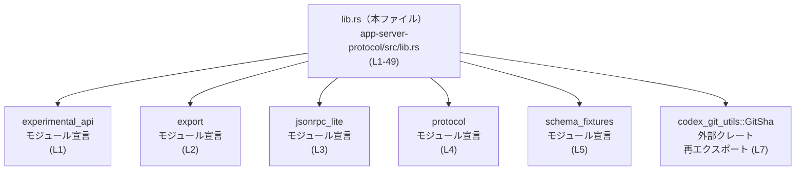
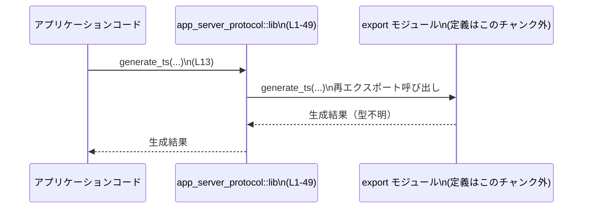
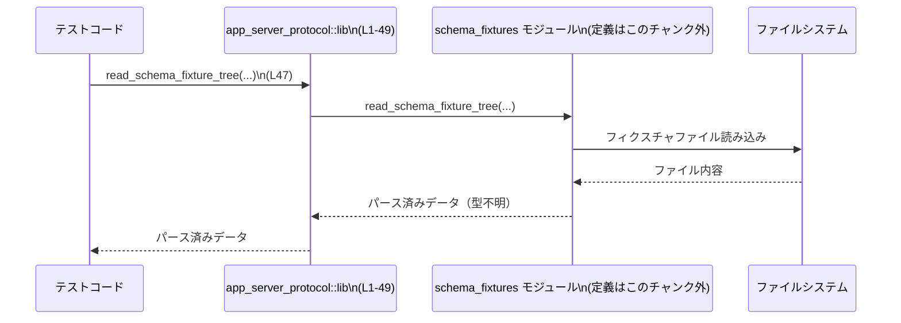

# app-server-protocol/src/lib.rs

## 0. ざっくり一言

- このファイルは **`app-server-protocol` クレートのルート（lib）** として、アプリサーバー用のプロトコル型・JSON-RPCヘルパ・スキーマ生成ユーティリティを一括して **再エクスポートする窓口** になっています（`app-server-protocol/src/lib.rs:L1-49`）。

---

## 1. このモジュールの役割

### 1.1 概要

- このモジュールは、アプリケーションから利用する際の **公開 API の統一入口** として存在し、内部モジュールで定義された型・関数を `pub use` で再エクスポートします（`L7-49`）。
- 具体的には、以下を公開します。
  - プロトコル v1 / v2 のメッセージ型・パラメータ類（`protocol::v1`, `protocol::v2`、`L20-42`）
  - JSON-RPC 関連のユーティリティ（`jsonrpc_lite::*`, `L16`）
  - 型定義・JSON Schema / TypeScript コード生成用の関数群（`export::…`, `L9-15`）
  - スキーマフィクスチャ（テスト用スキーマデータ）の読み書き関数群（`schema_fixtures::…`, `L43-49`）
  - Git コミットを表す `GitSha` 型（外部クレートより再エクスポート, `L7`）

### 1.2 アーキテクチャ内での位置づけ

このファイルはクレートのエントリポイントとして、内部モジュールや外部クレートを束ねています。



- アプリケーションコードは通常 `app_server_protocol` クレートを直接 `use` し、この `lib.rs` 経由で各モジュールの機能にアクセスする構造になっています（`L7-49`）。
- 実際の型定義・処理ロジックは、`experimental_api`, `export`, `jsonrpc_lite`, `protocol`, `schema_fixtures` 各モジュール側にあります（`L1-5`）。このチャンクにはそれらの中身は含まれていません。

### 1.3 設計上のポイント

コードから読み取れる設計上の特徴は次のとおりです。

- **集約ポイントとしてのシンプルな責務**  
  - このファイル自身には状態やロジックはなく、`mod` 宣言と `pub use` のみが存在します（`L1-5`, `L7-49`）。
  - 責務は「どの内部モジュールの何を公開 API として見せるか」を決めることに限定されています。
- **再エクスポートによる API のフラット化**  
  - `experimental_api::*`, `jsonrpc_lite::*`, `protocol::common::*`, `protocol::v2::*` などを `pub use` でそのまま外部に見せることで、利用者は深いモジュールパスを意識せずに済みます（`L8`, `L16-18`, `L42`）。
- **バージョン付きプロトコルの整理**  
  - v1 の型は `protocol::v1::…` から個別に再エクスポートされ（`L20-41`）、v2 の型は `protocol::v2::*` として一括再エクスポートされています（`L42`）。  
    具体的にどの型が v2 にあるかはこのチャンクには現れません。
- **テスト専用 API の非公開化**  
  - `generate_typescript_schema_fixture_subtree_for_tests` のみ `#[doc(hidden)]` が付いており（`L44-45`）、テスト用であること・公式ドキュメントには表示しない意図が読み取れます。

---

## 2. 主要な機能一覧

このファイルが外部に公開している主な機能カテゴリは次のとおりです。

- プロトコル v1 メッセージ型・パラメータの公開（`protocol::v1::…` 再エクスポート, `L20-41`）
- プロトコル v2 型・ユーティリティの公開（`protocol::v2::*` 再エクスポート, `L42`）
- JSON-RPC 関連ユーティリティの公開（`jsonrpc_lite::*`, `L16`）
- 型システム・JSON Schema・TypeScript コード生成のための関数群（`export::…`, `L9-15`）
- スキーマフィクスチャの読み書き関数とオプション型（`schema_fixtures::…`, `L43-49`）
- Git コミット SHA を表す `GitSha` 型の再エクスポート（`L7`）

### 2.1 コンポーネントインベントリー

#### モジュール一覧（宣言のみ）

| 名前 | 種別 | 役割 / 用途 | 根拠 |
|------|------|-------------|------|
| `experimental_api` | モジュール | 実験的な API 群を定義するモジュールと推測されますが、実体はこのチャンクにはありません。 | `app-server-protocol/src/lib.rs:L1` |
| `export` | モジュール | コード生成（JSON/TS/スキーマ）関連の関数やオプションを定義するモジュールと推測されます。 | `L2` |
| `jsonrpc_lite` | モジュール | JSON-RPC に関する型・ユーティリティをまとめたモジュールと推測されます。 | `L3` |
| `protocol` | モジュール | v1/v2 のプロトコル型・共通項目・ビルダ類を定義する中核モジュールと推測されます。 | `L4` |
| `schema_fixtures` | モジュール | スキーマのフィクスチャ（テスト用データ）を扱うモジュールと推測されます。 | `L5` |

※ 「推測」と記載した部分は名前からの解釈であり、実際の定義はこのチャンクには現れません。

#### 再エクスポートされている主な識別子一覧

> 種別（構造体/列挙体/関数など）は、このファイルには定義がないため **確定できません**。Rust の慣習から CamelCase = 型、snake_case = 関数である可能性が高いですが、その点は推測として扱っています。

| 名前 | 想定される種別 | 元モジュール | 説明（名前と文脈からの推測／事実範囲） | 根拠 |
|------|----------------|-------------|----------------------------------------|------|
| `GitSha` | 型（推測） | `codex_git_utils` | Git のコミット SHA を表す型と考えられます。 | `L7` |
| `GenerateTsOptions` | 型（推測） | `export` | TypeScript 生成処理の設定オプションと推測されます。 | `L9` |
| `generate_internal_json_schema` | 関数（推測） | `export` | 内部用の JSON Schema を生成する関数名と解釈できますが、シグネチャは不明です。 | `L10` |
| `generate_json` | 関数（推測） | `export` | JSON 出力を生成する関数と推測されます。 | `L11` |
| `generate_json_with_experimental` | 関数（推測） | `export` | 実験的 API を含めた JSON を生成する関数と推測されます。 | `L12` |
| `generate_ts` | 関数（推測） | `export` | TypeScript 型定義を生成する関数と推測されます。 | `L13` |
| `generate_ts_with_options` | 関数（推測） | `export` | オプション付きで TypeScript を生成する関数と推測されます。 | `L14` |
| `generate_types` | 関数（推測） | `export` | 何らかの型情報を生成する関数と推測されます。 | `L15` |
| `*`（複数） | 不明 | `experimental_api` | 実験的 API 一式が再エクスポートされていますが、具体的な一覧は本チャンクには現れません。 | `L8` |
| `*`（複数） | 不明 | `jsonrpc_lite` | JSON-RPC 関連の型や関数が一括公開されています。 | `L16` |
| `*`（複数） | 不明 | `protocol::common` | プロトコルの共通型・定数などが再エクスポートされています。 | `L17` |
| `*`（複数） | 不明 | `protocol::item_builders` | プロトコルメッセージのビルダー系ユーティリティと推測されます。 | `L18` |
| `*`（複数） | 不明 | `protocol::thread_history` | スレッド/会話履歴を扱う型や関数が含まれると推測されます。 | `L19` |
| `ApplyPatchApprovalParams`〜`UserSavedConfig` | 型（推測） | `protocol::v1` | v1 プロトコルで使う各種リクエスト/レスポンス/設定情報の型と考えられます。 | `L20-41` |
| `*`（複数） | 不明 | `protocol::v2` | v2 版プロトコルの型群を一括再エクスポートしていますが、具体的な内容は不明です。 | `L42` |
| `SchemaFixtureOptions` | 型（推測） | `schema_fixtures` | スキーマフィクスチャ生成・書き込み時のオプションと推測されます。 | `L43` |
| `generate_typescript_schema_fixture_subtree_for_tests` | 関数（推測） | `schema_fixtures` | テスト向けに TypeScript スキーマフィクスチャのサブツリーを生成する関数名です。`#[doc(hidden)]` でドキュメント非表示になっています。 | `L44-45` |
| `read_schema_fixture_subtree` | 関数（推測） | `schema_fixtures` | スキーマフィクスチャのサブツリーを読み込む関数と推測されます。 | `L46` |
| `read_schema_fixture_tree` | 関数（推測） | `schema_fixtures` | スキーマフィクスチャのツリー全体を読み込む関数と推測されます。 | `L47` |
| `write_schema_fixtures` | 関数（推測） | `schema_fixtures` | スキーマフィクスチャを書き出す関数と推測されます。 | `L48` |
| `write_schema_fixtures_with_options` | 関数（推測） | `schema_fixtures` | オプション付きでスキーマフィクスチャを書き出す関数と推測されます。 | `L49` |

---

## 3. 公開 API と詳細解説

### 3.1 型一覧（主な公開型）

> ※ 種別（構造体 / 列挙体 / type alias など）やフィールド構成は **このファイルには定義されていません**。ここでは「型らしい CamelCase 名」のうち、特に v1 プロトコルと設定・フィクスチャに関係しそうなものを抜粋しています。

| 名前 | 種別（このチャンクから判明している範囲） | 役割 / 用途（推測を含む） | 根拠 |
|------|----------------------------------------|----------------------------|------|
| `GitSha` | 型であることのみ分かる（外部クレート由来） | Git のコミット SHA を表すユーティリティ型と考えられます。 | `L7` |
| `GenerateTsOptions` | 型であることのみ分かる | TypeScript 生成を制御するためのオプション設定と推測されます。 | `L9` |
| `SchemaFixtureOptions` | 型であることのみ分かる | スキーマフィクスチャの生成/書き込みに関する設定オプションと推測されます。 | `L43` |
| `ApplyPatchApprovalParams` | 型であることのみ分かる | 「パッチ適用の承認」リクエストのパラメータを表す v1 プロトコル型名です。 | `L20` |
| `ApplyPatchApprovalResponse` | 型であることのみ分かる | 上記パラメータに対するレスポンス型名です。 | `L21` |
| `ClientInfo` | 型であることのみ分かる | クライアントの情報（バージョンなど）を表す型と推測されます。 | `L22` |
| `ConversationGitInfo` | 型であることのみ分かる | 会話に紐づく Git 情報を表す型名です。 | `L23` |
| `ConversationSummary` | 型であることのみ分かる | 会話の要約情報を表す型名です。 | `L24` |
| `ExecCommandApprovalParams` / `ExecCommandApprovalResponse` | 型であることのみ分かる | コマンド実行の承認に関するリクエスト/レスポンス型名です。 | `L25-26` |
| `GetAuthStatusParams` / `GetAuthStatusResponse` | 型であることのみ分かる | 認証状態取得のための v1 プロトコルメッセージのパラメータ/レスポンス型と考えられます。 | `L27-28` |
| `GetConversationSummaryParams` / `GetConversationSummaryResponse` | 型であることのみ分かる | 会話要約取得用のリクエスト/レスポンス型名です。 | `L29-30` |
| `GitDiffToRemoteParams` / `GitDiffToRemoteResponse` | 型であることのみ分かる | リモートとの差分取得に関する Git 操作用のパラメータ/レスポンス型名です。 | `L31-32` |
| `InitializeCapabilities` / `InitializeParams` / `InitializeResponse` | 型であることのみ分かる | セッションの初期化（capabilities 交渉など）に関連する v1 プロトコル型名です。 | `L33-35` |
| `InterruptConversationResponse` | 型であることのみ分かる | 会話中断リクエストに対するレスポンス型名です。 | `L36` |
| `LoginApiKeyParams` | 型であることのみ分かる | API キーログインのパラメータを表す型名です。 | `L37` |
| `Profile` | 型であることのみ分かる | ユーザープロファイル情報を表す型名です。 | `L38` |
| `SandboxSettings` | 型であることのみ分かる | サンドボックス環境の設定を表す型名です。 | `L39` |
| `Tools` | 型であることのみ分かる | 利用可能なツール群の定義を表す型名です。 | `L40` |
| `UserSavedConfig` | 型であることのみ分かる | ユーザーが保存した設定を表す型名です。 | `L41` |

> これらの型が構造体か列挙体か、フィールドが何か、といった詳細は `protocol` モジュール側にあり、このチャンクからは分かりません。

### 3.2 関数詳細（推測される主要関数）

ここでは、**関数と思われる再エクスポート** のうち、代表的なものを取り上げます。ただし、このファイルにはシグネチャや内部実装が含まれていないため、**引数・戻り値・内部処理はすべて「不明」** です。

#### `generate_json(...)`（export モジュール由来と推測）

**概要**

- 名前と `export` モジュールから再エクスポートされている点から、**プロトコルスキーマ等から JSON 形式の何かを生成する関数** である可能性が高いです（`L11`）。
- 具体的にどのような JSON（メッセージ例・スキーマ・メタデータなど）を生成するかは、このチャンクからは分かりません。

**引数**

- このファイルには関数定義がないため、引数の個数・型・意味は不明です。  
  詳細は `export` モジュールの定義を確認する必要があります（`L2`, `L11`）。

**戻り値**

- 戻り値の型や意味も不明です（このチャンクには定義がありません）。

**内部処理の流れ（アルゴリズム）**

- 内部処理は `export` モジュール内で実装されており、このチャンクには含まれていません。そのためアルゴリズムは不明です。

**Examples（使用例：概念的なもの）**

```rust
use app_server_protocol::generate_json; // L11 で再エクスポートされている

fn main() {
    // 引数や戻り値の型はこのファイルから分からないため、ここでは仮の呼び出し形だけを示します。
    // let json_output = generate_json(/* スキーマや設定など */);
    // println!("{:?}", json_output);
}
```

**Errors / Panics**

- `Result` を返すかどうか、どのような条件でエラーになるかは、このチャンクからは分かりません。

**Edge cases（エッジケース）**

- 不正な入力時の挙動や空入力の扱いなども、ここからは判断できません。

**使用上の注意点**

- 生成処理であることから、入力データに応じて CPU / メモリを消費する可能性がありますが、具体的なコストや制約は不明です。

---

#### `generate_ts(...)`（export モジュール由来と推測）

**概要**

- TypeScript を生成する関数名であり、`GenerateTsOptions` などと組み合わせて利用されると推測されます（`L9`, `L13`）。

**引数 / 戻り値・内部処理**

- すべて `export` 内に実装されており、このチャンクには現れません。詳細は不明です。

**Examples（使用例：概念的なもの）**

```rust
use app_server_protocol::{GenerateTsOptions, generate_ts}; // L9, L13

fn main() {
    // オプションや入力スキーマなどの具体的なフィールドは不明のため省略しています。
    // let options = GenerateTsOptions { /* ... */ };
    // let ts_output = generate_ts(/* options, スキーマなど */);
    // println!("{}", ts_output);
}
```

**Errors / Edge cases / 注意点**

- このチャンクには情報がなく、不明です。

---

#### `generate_ts_with_options(...)`

**概要**

- `generate_ts` と似た処理を行い、追加のオプションを受け取るバリアントと推測されます（`L14`）。

**それ以外の項目**

- 引数・戻り値・エラー・内部処理はいずれも不明です（定義が `export` 側にあるため）。

---

#### `generate_types(...)`

**概要**

- プロトコル定義から何らかの型情報（Rust / TypeScript / JSON Schema など）を生成する関数名です（`L15`）。

**詳細**

- シグネチャや内部処理は `export` モジュール側にあり、このチャンクには現れません。

---

#### `read_schema_fixture_tree(...)`

**概要**

- スキーマフィクスチャの「ツリー全体」を読み込む関数と推測されます（`L47`）。

**引数 / 戻り値 / 内部処理**

- どのようなパスやオプションを受け取り、どの型を返すかは、このチャンクからは不明です。
- IO を行う関数である可能性が高く、その場合は `Result` を返すことも多いですが、ここからは断定できません。

**Examples（概念的な例）**

```rust
use app_server_protocol::read_schema_fixture_tree; // L47

fn load_fixtures() {
    // 実際にはパスやオプションを引数に取る可能性があります。
    // let tree = read_schema_fixture_tree(/* ルートディレクトリなど */)
    //     .expect("Could not read schema fixtures");
    // println!("{:?}", tree);
}
```

**Errors / Edge cases / 注意点**

- ファイル IO に関するエラーが発生しうると考えられますが、詳細は不明です。

---

#### `write_schema_fixtures(...)` / `write_schema_fixtures_with_options(...)`

**概要**

- スキーマフィクスチャを書き出す処理を行う関数群と推測されます（`L48-49`）。

**詳細**

- 引数・戻り値・内部動作はいずれも不明です。
- `write_schema_fixtures_with_options` は、おそらく `SchemaFixtureOptions` と組み合わせて利用されますが、このチャンクでは確認できません（`L43`, `L49`）。

---

#### `generate_typescript_schema_fixture_subtree_for_tests(...)`（テスト用）

**概要**

- テストコードからのみ利用されることを意図した、TypeScript スキーマフィクスチャ生成関数です（`#[doc(hidden)]`, `L44-45`）。
- 公開 API ではありますが、ドキュメントには表示されないようマークされています。

**Errors / Edge cases / 注意点**

- テスト専用であるため、プロダクションコードから利用すると意図しない依存関係を生む可能性があります。

### 3.3 その他の関数・識別子

上記で個別に扱わなかった再エクスポートは、主に以下のカテゴリに属します。

| 名前 / パターン | 役割（このチャンクから推測される範囲） | 根拠 |
|----------------|----------------------------------------|------|
| `generate_internal_json_schema` | 内部用の JSON Schema 生成処理と推測される関数です。 | `L10` |
| `generate_json_with_experimental` | 実験的 API を含んだ JSON 生成処理のバリアントと推測されます。 | `L12` |
| `experimental_api::*` | 実験的な公開 API 群（関数/型など）をまとめて再エクスポートしていますが、具体的な中身は不明です。 | `L8` |
| `jsonrpc_lite::*` | JSON-RPC のリクエスト/レスポンス型やエンコード・デコード関数などを一括公開していると考えられます。 | `L16` |
| `protocol::common::*` | プロトコルで共通利用される型・定数などを公開しています。 | `L17` |
| `protocol::item_builders::*` | プロトコルメッセージを構築するビルダー系 API を公開しています。 | `L18` |
| `protocol::thread_history::*` | 会話スレッドの履歴管理に関する API を公開しています。 | `L19` |
| `protocol::v2::*` | v2 版プロトコルのメッセージ型・パラメータなどを一括公開していますが、具体的な種類は不明です。 | `L42` |

---

## 4. データフロー

このファイル自身にはロジックや状態はありませんが、**API 呼び出しの流れ** としては、次のようなパスが想定されます。

1. アプリケーションコードが `app_server_protocol` クレートを `use` する。
2. この `lib.rs` 経由で、`export` / `protocol` / `schema_fixtures` などの API にアクセスする。
3. 実際の処理は各モジュール内で実行され、その結果が呼び出し元に返る。

### 4.1 典型的な呼び出しフロー（例：TypeScript 生成）



- この図は、`generate_ts` を呼び出すときの **論理的な流れ** を示しています。
- `lib.rs` は単に名前の窓口として機能し、内部モジュール `export` に処理を委譲する立場になります（`L2`, `L13`）。

### 4.2 スキーマフィクスチャ読み書きの流れ（概念図）



---

## 5. 使い方（How to Use）

### 5.1 基本的な使用方法

このファイルの役割は「公開 API の窓口」であり、利用者側から見ると **深いモジュールパスを書かずに済む** ことが主な利点です。

```rust
// app_server_protocol クレートの代表的な識別子をインポートする
use app_server_protocol::{
    // プロトコル v1 の型
    InitializeParams,          // L34
    InitializeResponse,        // L35

    // コード生成関連
    GenerateTsOptions,         // L9
    generate_ts,               // L13

    // スキーマフィクスチャ関連
    read_schema_fixture_tree,  // L47
};

// 実際のフィールド・引数・戻り値はこのファイルからは分からないため、
// ここでは概念的な使い方のみを示します。
fn main() {
    // v1 プロトコルのパラメータを作る（実際のフィールド名は不明）
    // let init_params = InitializeParams { /* ... */ };

    // TypeScript コード生成
    // let ts_options = GenerateTsOptions { /* ... */ };
    // let ts_output = generate_ts(/* ts_options, スキーマなど */);

    // スキーマフィクスチャの読み込み
    // let fixtures = read_schema_fixture_tree(/* ディレクトリ・パスなど */).unwrap();
}
```

### 5.2 よくある使用パターン（推測レベル）

このチャンクだけでは詳細なシグネチャは分かりませんが、想定される利用パターンは次のようなものです。

- **プロトコルメッセージの定義共有**  
  - サーバーとクライアント双方が `app_server_protocol` を依存クレートとして参照し、同じ `InitializeParams`, `ApplyPatchApprovalParams` 等の型を共有する。
- **コード生成の一括実行**  
  - ビルドスクリプトや専用ツールから `generate_json` / `generate_ts` / `generate_types` を呼び出して、JSON Schema や TypeScript 型定義を生成する。
- **テストでのスキーマ検証**  
  - テストコードから `read_schema_fixture_tree` や `write_schema_fixtures_with_options` を呼び、スキーマの整合性を検証する。

### 5.3 よくある間違い（このチャンクから推測できる範囲）

このファイルの構造から推測される注意点を挙げます。

```rust
// （誤りになりうる例：lib.rs を経由せず深いパスをハードコードする）
use app_server_protocol::protocol::v1::InitializeParams;
// ↑ `lib.rs` からは `protocol` 自体は再エクスポートされていないため、
//   こうしたパスは将来的なリファクタリングに弱くなる可能性があります。

// 推奨される例：lib.rs 経由の再エクスポートを利用する
use app_server_protocol::InitializeParams; // L34 で再エクスポート
```

### 5.4 使用上の注意点（まとめ）

- **API の安定ポイントは `lib.rs` 経由**  
  - 直接 `protocol::v1` や `export` など内部モジュールを参照すると、モジュール構成変更の影響を受けやすくなります。
- **テスト専用 API の利用**  
  - `generate_typescript_schema_fixture_subtree_for_tests`（`L44-45`）はテスト用であり、プロダクションコードからの利用は意図されていない可能性があります。
- **エラー処理・並行性**  
  - このファイル自身は関数実装を持たないため、エラー処理やスレッド安全性に関する挙動は各モジュール (`export`, `schema_fixtures`, `protocol` 等) の実装に依存します。このチャンクからは判断できません。

---

## 6. 変更の仕方（How to Modify）

### 6.1 新しい機能を追加する場合

新しい関数・型をこのクレートの公開 API に追加したい場合、一般的には次の手順になります。

1. **適切な内部モジュールに実装を追加**  
   - たとえばコード生成関連なら `export` モジュール、プロトコル型なら `protocol::v1` または `protocol::v2` に定義を追加します（`L2`, `L4`）。
2. **`lib.rs` から `pub use` するかを決める**  
   - 外部に公開したい場合、このファイルに `pub use module::ItemName;` を追加します。
3. **バージョンや安定性ポリシーを考慮**  
   - 実験的な API であれば、`experimental_api` モジュール経由にするなどの整理が行われている可能性があります（`L1`, `L8`）。

### 6.2 既存の機能を変更する場合

- **影響範囲の確認**  
  - ある型や関数を削除・リネームするときは、このファイルから `pub use` されているかどうかを確認します（`L7-49`）。  
    `pub use` されている場合、クレート利用者すべてに影響します。
- **契約（前提条件・返り値の意味）**  
  - このファイルには契約内容は記述されていないため、各モジュール側（`export`, `protocol`, `schema_fixtures` など）のドキュメントやテストを参照する必要があります。
- **テストの確認**  
  - 特にスキーマフィクスチャ関連関数（`read_schema_fixture_tree` 等, `L46-49`）はテストで多用される可能性があり、仕様変更時には関連テストの見直しが必要です。

---

## 7. 関連ファイル

このモジュールと直接関係するファイル・ディレクトリは、以下のとおりです（すべて `mod` / `pub use` から読み取れる範囲のみ記載します）。

| パス / モジュール | 役割 / 関係（このチャンクから読み取れる範囲） | 根拠 |
|-------------------|----------------------------------------------|------|
| `app-server-protocol/src/experimental_api.rs` または `experimental_api/mod.rs` | 実験的な API を定義し、`experimental_api::*` として再エクスポートされます。 | `L1`, `L8` |
| `app-server-protocol/src/export.rs` または `export/mod.rs` | `generate_json`, `generate_ts` など、各種コード生成関数と `GenerateTsOptions` を提供します。 | `L2`, `L9-15` |
| `app-server-protocol/src/jsonrpc_lite.rs` または `jsonrpc_lite/mod.rs` | JSON-RPC 関連の型・関数を定義し、`jsonrpc_lite::*` として公開されます。 | `L3`, `L16` |
| `app-server-protocol/src/protocol/` | `common`, `item_builders`, `thread_history`, `v1`, `v2` など、プロトコルに関する中核的な型・ユーティリティを提供します。 | `L4`, `L17-19`, `L20-42` |
| `app-server-protocol/src/schema_fixtures.rs` または `schema_fixtures/mod.rs` | スキーマフィクスチャの読み書きと、`SchemaFixtureOptions`・テスト用生成関数を提供します。 | `L5`, `L43-49` |
| 外部クレート `codex_git_utils` | `GitSha` 型を提供し、このクレートから再エクスポートされます。 | `L7` |

---

### Bugs / Security / Contracts / Tests / 性能などについて

- **Bugs / Security**  
  - このファイルは単に再エクスポートを行うだけで、入力を処理したり外部リソースにアクセスしたりするロジックを持ちません。そのため、バグ・セキュリティ問題の有無は **各モジュールの実装側** に依存し、このチャンクからは評価できません。
- **Contracts / Edge Cases**  
  - 各関数・型の前提条件やエッジケースでの挙動も、実装があるモジュール側のコード・ドキュメントを参照する必要があります。このファイルからは不明です。
- **Tests**  
  - `generate_typescript_schema_fixture_subtree_for_tests` に `#[doc(hidden)]` が付与されていることから（`L44-45`）、スキーマフィクスチャ関連のテストが存在し、この関数がテスト用のユーティリティとして使われていることが示唆されます。その他のテスト構成はこのチャンクには現れません。
- **Performance / Scalability / Observability**  
  - 性能特性やログ出力等の観測性についても、このファイルには情報がありません。`export` / `schema_fixtures` などの実装側を確認する必要があります。

このファイルを理解するうえで重要なのは、「**実装の中心ではなく、API の一覧を定義するゲートウェイ**」であるという点です。実際のロジックを追いたい場合は、ここで `mod` / `pub use` されている各モジュールに進む必要があります。
