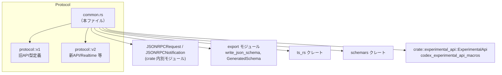
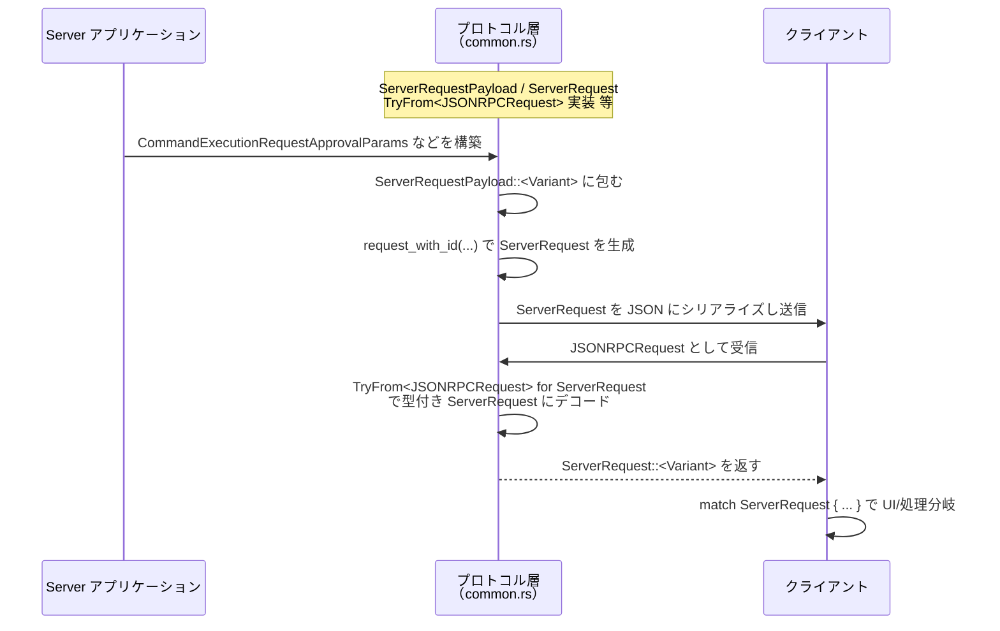
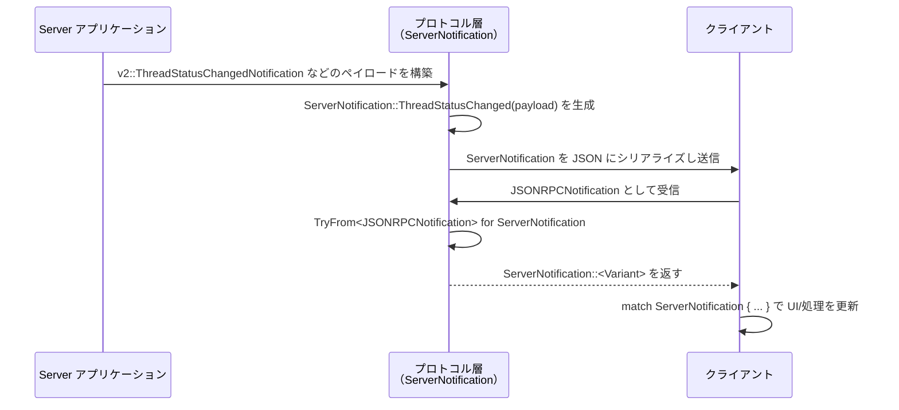
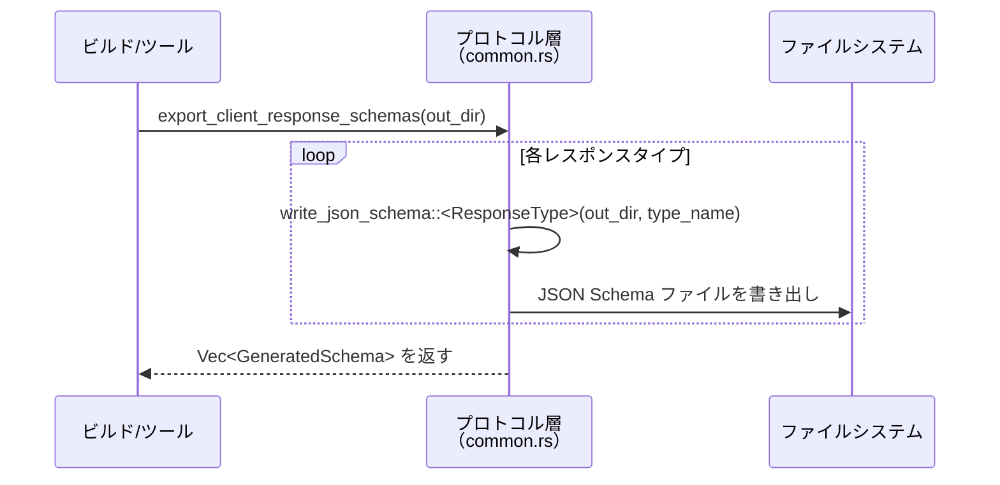

# app-server-protocol/src/protocol/common.rs コード解説

## 0. ざっくり一言

このファイルは、app-server プロトコルにおける **JSON-RPC ベースのクライアント⇔サーバー通信のコア型** を定義し、  
あわせて TypeScript 型・JSON Schema のエクスポートと、**実験的 API（experimental）判定ロジック** を提供するモジュールです。

※ 入力には行番号情報が含まれていないため、本解説では「〜の定義ブロック内」といった形で位置を説明します（正確な行番号は記載できません）。

---

## 1. このモジュールの役割

### 1.1 概要

- このモジュールは **クライアント→サーバー / サーバー→クライアントの JSON-RPC メッセージを、型安全な Rust の enum/struct にマッピングする** 役割を持ちます。
- さらに、これらの型から **TypeScript 型定義と JSON Schema を生成するためのエクスポート関数** を提供します。
- また、メソッドごとの **「experimental（実験的）」フラグ付けと、その理由文字列の取得** を実装しています。

### 1.2 アーキテクチャ内での位置づけ

このファイルはプロトコルの「共通定義」として、v1/v2 の詳細定義やエクスポート機構にまたがって利用されます。



- **上位レイヤー**（アプリケーションロジック）は `ClientRequest` / `ServerRequest` / `ServerNotification` などの enum を使って分岐処理を行います。
- **ビルド時ツール** や CLI は `export_*_schemas` や `export_*_responses` を呼び出し、TypeScript 型・JSON Schema を生成します。
- experimental 判定は `crate::experimental_api::ExperimentalApi` トレイトを通じて利用されます。

### 1.3 設計上のポイント

- **マクロによる定義の集約**
  - `client_request_definitions!`, `server_request_definitions!`, `server_notification_definitions!`, `client_notification_definitions!` によって
    大きな enum と関連関数・エクスポート関数を一括生成しています。
- **JSON-RPC タグ付き enum パターン**
  - `#[serde(tag = "method", ...)]` により、「method フィールド = enum バリアント名（または別名）」という形で JSON と対応付けています。
- **型安全とスキーマ生成の両立**
  - ほぼすべての公開型が `Serialize`, `Deserialize`, `JsonSchema`, `TS` を derive しており、
    1つの定義から Rust / TypeScript / JSON Schema を整合的に生成できる構造です。
- **実験的 API の判定ロジック**
  - 専用マクロ `experimental_reason_expr!` / `experimental_method_entry!` / `experimental_type_entry!` と
    `ExperimentalApi` トレイト実装により、「どのメソッドや型が experimental か」を問合せ可能にしています。
- **状態を持たない純粋なデータ定義**
  - 全ての型はイミュータブルな値オブジェクトであり、内部にスレッド共有状態や `unsafe` は登場しません。
  - 並行性制御はこのモジュールの外側で行う設計になっています。

---

## 2. コンポーネントインベントリー（主要な機能一覧）

### 2.1 型・enum インベントリー（公開 API）

| 名前 | 種別 | 方向 | 概要 |
|------|------|------|------|
| `AuthMode` | enum | 共通 | OpenAI バックエンドに対する認証モード（`apiKey`, `chatgpt`, `chatgptAuthTokens`） |
| `ClientRequest` | enum | クライアント→サーバー | クライアントからサーバーへ送信される JSON-RPC リクエストの総称 |
| `ClientResponse` | enum | サーバー→クライアント | `ClientRequest` に対するサーバーからクライアントへの型付きレスポンス |
| `ServerRequest` | enum | サーバー→クライアント | サーバーがクライアントに対して開始するリクエスト（承認要求など） |
| `ServerResponse` | enum | クライアント→サーバー | `ServerRequest` に対するクライアントからのレスポンス |
| `ServerRequestPayload` | enum | サーバー内部 | `ServerRequest` の request_id 付与前のペイロード専用 enum |
| `ServerNotification` | enum | サーバー→クライアント | サーバーからの通知（スレッド状態更新、Realtime イベントなど） |
| `ClientNotification` | enum | クライアント→サーバー | クライアントからの通知（現状 `Initialized` のみ） |
| `FuzzyFileSearchParams` | struct | クライアント→サーバー | ファジーファイル検索のパラメータ |
| `FuzzyFileSearchResult` | struct | サーバー→クライアント | ファジーファイル検索の結果 1 件分 |
| `FuzzyFileSearchMatchType` | enum | 共通 | ファジー検索結果の種別（ファイル / ディレクトリ） |
| `FuzzyFileSearchResponse` | struct | サーバー→クライアント | ファジーファイル検索結果の一覧 |
| `FuzzyFileSearchSessionStartParams` | struct | クライアント→サーバー | セッション型ファジー検索の開始パラメータ |
| `FuzzyFileSearchSessionStartResponse` | struct | サーバー→クライアント | セッション開始レスポンス（空オブジェクト） |
| `FuzzyFileSearchSessionUpdateParams` | struct | クライアント→サーバー | セッション中のクエリ更新パラメータ |
| `FuzzyFileSearchSessionUpdateResponse` | struct | サーバー→クライアント | セッション更新レスポンス（空オブジェクト） |
| `FuzzyFileSearchSessionStopParams` | struct | クライアント→サーバー | セッション停止パラメータ |
| `FuzzyFileSearchSessionStopResponse` | struct | サーバー→クライアント | セッション停止レスポンス（空オブジェクト） |
| `FuzzyFileSearchSessionUpdatedNotification` | struct | サーバー→クライアント | セッション更新通知（新しい検索結果を含む） |
| `FuzzyFileSearchSessionCompletedNotification` | struct | サーバー→クライアント | セッション完了通知 |

> 各バリアントごとのパラメータ型・レスポンスタイプは `crate::protocol::v1` / `v2` 側で定義されており、本ファイルではそれらを集約しています。

### 2.2 関数・メソッドインベントリー（非テスト）

マクロ展開によって以下の代表的な関数が定義されます（実体は本ファイル内のマクロ定義ブロックの中にあります）。

| 関数名 | 所属 | 概要 |
|--------|------|------|
| `ClientRequest::id(&self) -> &RequestId` | `client_request_definitions!` | 各リクエストの JSON-RPC `id` を取得 |
| `ClientRequest::method(&self) -> String` | 同上 | 自身をシリアライズして `method` フィールドからメソッド名を取得 |
| `ClientResponse::id(&self) -> &RequestId` | 同上 | 対応するリクエストの `id` を返す |
| `ClientResponse::method(&self) -> String` | 同上 | 自身をシリアライズして `method` を取得 |
| `export_client_responses(out_dir: &Path)` | 同上 | 全てのクライアントレスポンス型の TypeScript 型定義を書き出す |
| `visit_client_response_types(v: &mut impl TypeVisitor)` | 同上 | ts-rs の `TypeVisitor` でレスポンス型を列挙 |
| `export_client_response_schemas(out_dir: &Path)` | 同上 | 全クライアントレスポンスの JSON Schema を生成 |
| `export_client_param_schemas(out_dir: &Path)` | 同上 | 全クライアントリクエストパラメータの JSON Schema を生成 |
| `ServerRequest::id(&self) -> &RequestId` | `server_request_definitions!` | サーバー起点リクエストの `id` を取得 |
| `ServerResponse::id(&self) -> &RequestId` | 同上 | サーバー起点リクエストへのレスポンスの `id` を取得 |
| `ServerResponse::method(&self) -> String` | 同上 | `method` フィールドを取り出す |
| `ServerRequestPayload::request_with_id(self, RequestId) -> ServerRequest` | 同上 | ペイロード enum から `ServerRequest` を構築 |
| `export_server_responses(out_dir: &Path)` | 同上 | サーバーレスポンス型の TypeScript 定義をエクスポート |
| `visit_server_response_types(v: &mut impl TypeVisitor)` | 同上 | サーバーレスポンス型を列挙 |
| `export_server_response_schemas(out_dir: &Path)` | 同上 | サーバーレスポンスの JSON Schema を生成 |
| `export_server_param_schemas(out_dir: &Path)` | 同上 | サーバーリクエストパラメータの JSON Schema を生成 |
| `ServerNotification::to_params(self) -> Result<Value, Error>` | `server_notification_definitions!` | 通知 enum から `params` 部分だけを JSON に変換 |
| `export_server_notification_schemas(out_dir: &Path)` | 同上 | 各通知ペイロードの JSON Schema を生成 |
| `export_client_notification_schemas(out_dir: &Path)` | `client_notification_definitions!` | クライアント通知の JSON Schema を生成 |
| `<ServerNotification as TryFrom<JSONRPCNotification>>::try_from` | 手書き impl | JSON-RPC 汎用通知から型付き `ServerNotification` への変換 |
| `<ServerRequest as TryFrom<JSONRPCRequest>>::try_from` | 手書き impl | JSON-RPC 汎用リクエストから型付き `ServerRequest` への変換 |

### 2.3 マクロインベントリー

| マクロ名 | 役割 |
|---------|------|
| `experimental_reason_expr!` | experimental 理由文字列をバリアント属性とパラメータ型から選択するヘルパー |
| `experimental_method_entry!` | experimental メソッド一覧用の文字列（メソッド名 or 理由）を生成 |
| `experimental_type_entry!` | experimental なメソッドに対応するパラメータ型/レスポンス型名を抽出 |
| `client_request_definitions!` | `ClientRequest` / `ClientResponse` と関連関数・スキーマエクスポートを生成 |
| `server_request_definitions!` | `ServerRequest` / `ServerResponse` / `ServerRequestPayload` およびエクスポート関数を生成 |
| `server_notification_definitions!` | `ServerNotification` と通知用スキーマエクスポート・変換関数を生成 |
| `client_notification_definitions!` | `ClientNotification` とスキーマエクスポート関数を生成 |

---

## 3. 公開 API と詳細解説

### 3.1 主な型一覧（詳細）

すべての型は `Serialize` / `Deserialize` / `Debug` / `Clone` / `PartialEq`（一部除く）を derive しており、  
Rust 側では普通の値オブジェクトとして安全に所有・コピー・比較できます。

| 名前 | 種別 | 役割 / 用途 |
|------|------|-------------|
| `AuthMode` | enum | OpenAI バックエンドの認証モードの区別。JSON では `apiKey` / `chatgpt` / `chatgptAuthTokens` の小文字表現で表現されます。 |
| `ClientRequest` | enum（タグ付き） | クライアント→サーバーへの **全てのリクエスト** を集約する enum。`method` でタグ付けされ、`params` と `id` を持ちます。 |
| `ClientResponse` | enum（タグ付き） | `ClientRequest` に対する型付きレスポンス。`method` と `id`, `response` を持ちます。 |
| `ServerRequest` | enum（タグ付き） | サーバー発のリクエスト（承認要求・動的ツール呼び出し等）を表現。クライアント側でこれを受け取ってインタラクションします。 |
| `ServerResponse` | enum（タグ付き） | `ServerRequest` に対するクライアントの応答。 |
| `ServerRequestPayload` | enum | `ServerRequest` の `params` 部分のみを表す内部 enum。`request_with_id` で `ServerRequest` に変換可能。 |
| `ServerNotification` | enum（タグ付き） | サーバー→クライアントへの通知（スレッド状態変化、コマンド出力、Realtime など）を表現。 |
| `ClientNotification` | enum（タグ付き） | クライアント→サーバー通知（現時点では `Initialized` のみ）。 |
| `FuzzyFileSearch*` 群 | struct / enum | ファジーファイル検索 API のパラメータ・レスポンス・セッション通知に関する型。 |

### 3.2 重要関数の詳細解説（最大 7 件）

#### 1. `ClientRequest::id(&self) -> &RequestId`

**概要**

- クライアントからサーバーへ送信される任意の `ClientRequest` から、共通の JSON-RPC `id` を取り出すアクセサです。
- どのバリアントであっても統一インターフェースで `id` にアクセスできます。

**引数**

| 引数名 | 型 | 説明 |
|--------|----|------|
| `&self` | `&ClientRequest` | 任意のクライアントリクエスト |

**戻り値**

- `&RequestId`  
  整数または文字列など、JSON-RPC の `id` を表す型への参照です。

**内部処理の流れ**

マクロ `client_request_definitions!` 内の `impl ClientRequest` ブロックで、次のように実装されています。

1. `match self` で全バリアントを列挙。
2. 各バリアントのパターンで `{ request_id, .. }` を取り出し、その参照を返す。

擬似コード:

```rust
pub fn id(&self) -> &RequestId {
    match self {
        ClientRequest::Initialize { request_id, .. } => request_id,
        ClientRequest::ThreadStart { request_id, .. } => request_id,
        // ... 全バリアント分
    }
}
```

**Examples（使用例）**

```rust
// Initialize リクエストを構築
let req = ClientRequest::Initialize {
    request_id: RequestId::Integer(42),
    params: v1::InitializeParams { /* ... */ },
};

// どのバリアントかに依存せずに id を取得できる
assert_eq!(req.id(), &RequestId::Integer(42));
```

**Errors / Panics**

- 分岐が全バリアントを網羅しているため、パニックは発生しません。
- 返すのは参照のみであり、エラー型はありません。

**Edge cases**

- `ClientRequest` が将来バリアント追加されても、マクロ展開により `match` が自動更新される前提です。
- `RequestId` 自体が別モジュールで定義されており、その表現（整数 / 文字列など）に依存せず扱えます。

**使用上の注意点**

- `RequestId` は参照で返されるため、呼び出し側で所有権を移動したい場合は `req.id().clone()` などが必要です。

---

#### 2. `ClientRequest::method(&self) -> String`

**概要**

- 任意の `ClientRequest` が JSON-RPC でどの `method` としてシリアライズされるかを文字列で取得します。
- 内部で一度 self を JSON にシリアライズし、`"method"` フィールドを読み取っています。

**引数**

| 引数名 | 型 | 説明 |
|--------|----|------|
| `&self` | `&ClientRequest` | 任意のクライアントリクエスト |

**戻り値**

- `String`  
  例: `"thread/start"`, `"configRequirements/read"` など。  
  取得できなかった場合は `"<unknown>"` を返します。

**内部処理の流れ**

マクロ `client_request_definitions!` 内で次のように実装されています。

1. `serde_json::to_value(self)` で `self` を `serde_json::Value` に変換し、`Result` を `ok()` で `Option` に変換。
2. `value.get("method")` で `"method"` フィールドを取得。
3. `as_str()` で文字列かどうかを確認。
4. 文字列であれば `to_owned()` して返却。
5. いずれかのステップで `None` になった場合は `"<unknown>"` を返す。

**擬似コード**

```rust
pub fn method(&self) -> String {
    serde_json::to_value(self)
        .ok()
        .and_then(|value| value.get("method")?.as_str().map(str::to_owned))
        .unwrap_or_else(|| "<unknown>".to_string())
}
```

**Examples（使用例）**

```rust
let req = ClientRequest::GetAccountRateLimits {
    request_id: RequestId::Integer(1),
    params: None,
};

assert_eq!(req.method(), "account/rateLimits/read");
```

（この挙動はテスト `serialize_get_account_rate_limits` でも検証されています。）

**Errors / Panics**

- `serde_json::to_value` が `Err` の場合でも、`ok()` によって `None` に変換されるためパニックにはなりません。
- `"method"` フィールドが存在しない、あるいは文字列でない場合も `"<unknown>"` を返します。

**Edge cases**

- シリアライズ用の属性（`#[serde(tag = "method")]`, `#[serde(rename = "...")]`）が破壊されたり、  
  `ClientRequest` の JSON 表現が大きく変わると `"method"` が取得できず `"<unknown>"` になります。
- その場合でもこの関数はパニックしませんが、ログやデバッグ用に `method()` を使っているコードは  
  `"method"` を特定できなくなります。

**使用上の注意点**

- `method()` は内部で一度シリアライズを行うため、**頻繁な呼び出しはコストがかかる**点に留意が必要です。
  - 一般的な用途（ログ出力など）では問題になりにくいですが、ホットパスで多用するのは避ける設計が望ましいです。
- メソッド名は `ClientRequest` の設計（`#[serde(rename = "...")]`）に依存するため、  
  そちらを変更すると `method()` の結果も変わります。

---

#### 3. `ServerRequest::id(&self) -> &RequestId`

**概要**

- サーバー起点のリクエスト `ServerRequest` から JSON-RPC の `id` を取り出すアクセサです。
- 実装パターンは `ClientRequest::id` と同じです。

**引数 / 戻り値**

- 引数: `&self: &ServerRequest`
- 戻り値: `&RequestId`

**内部処理の流れ**

- `match self { ServerRequest::CommandExecutionRequestApproval { request_id, .. } => request_id, ... }` という単純なパターンマッチ。

**使用上の注意点**

- `ServerRequest` を受け取ったクライアント側で、対応するレスポンス `ServerResponse` を返す際に  
  `id` をコピーする用途で利用されるのが基本パターンです。

---

#### 4. `ServerRequestPayload::request_with_id(self, request_id: RequestId) -> ServerRequest`

**概要**

- `ServerRequest` のバリアントと同じ列挙値を持つ `ServerRequestPayload`（params のみ）から、
  指定した `request_id` を埋め込んだ `ServerRequest` を構築するヘルパーです。
- サーバーがリクエストを組み立てる際に、「先に params だけ作り、最後に id を付ける」スタイルをサポートします。

**引数**

| 引数名 | 型 | 説明 |
|--------|----|------|
| `self` | `ServerRequestPayload` | パラメータのみを含むペイロード |
| `request_id` | `RequestId` | JSON-RPC の `id` 値 |

**戻り値**

- `ServerRequest`  
  `self` のバリアントに対応する `ServerRequest::<Variant> { request_id, params }` が返されます。

**内部処理の流れ**

1. `match self` で `ServerRequestPayload` のバリアントを列挙。
2. 各バリアントで `params` を取り出し、対応する `ServerRequest::<Variant> { request_id, params }` を返す。

**Examples（使用例）**

```rust
// サーバー側でのリクエスト生成例
let params = v2::CommandExecutionRequestApprovalParams { /* ... */ };

let payload = ServerRequestPayload::CommandExecutionRequestApproval(params);
let request = payload.request_with_id(RequestId::Integer(7));

// request は ServerRequest::CommandExecutionRequestApproval { id: 7, params: ... } になる
```

このパターンはテスト `serialize_mcp_server_elicitation_request` でも使用されています。

**Errors / Panics**

- マッチは列挙値を網羅しているため、パニックは発生しません。

**使用上の注意点**

- `request_id` の重複管理は呼び出し側の責任です（この関数は単純に埋め込むだけで、衝突検出などは行いません）。

---

#### 5. `ServerResponse::method(&self) -> String`

**概要**

- `ClientRequest::method` と同様に、サーバー起点のレスポンス型 `ServerResponse` から  
  その JSON-RPC `method` を取得するユーティリティです。

**引数 / 戻り値**

- 引数: `&self: &ServerResponse`
- 戻り値: `String`（取得失敗時は `"<unknown>"`）

**内部処理の流れ**

- 実装は `ClientRequest::method` と同じパターンで、`serde_json::to_value(self)` → `"method"` フィールド抽出 → 失敗時 `"<unknown>"` です。

**Edge cases / 注意点**

- `ServerResponse` の `serde` 属性が変わると結果も変わる点、  
  およびシリアライズコストがある点は `ClientRequest::method` と同様です。

---

#### 6. `ServerNotification::to_params(self) -> Result<serde_json::Value, serde_json::Error>`

**概要**

- `ServerNotification` は `#[serde(tag = "method", content = "params")]` で定義されており、  
  この関数はバリアントの **`params` 部分だけを JSON に変換** します。
- 「`method` は別途管理し、params 部分だけ送りたい」といった場面で有用です。

**引数**

| 引数名 | 型 | 説明 |
|--------|----|------|
| `self` | `ServerNotification` | 送信したいサーバー通知 |

**戻り値**

- `Result<Value, Error>`  
  - `Ok(Value)`: `params` 相当の JSON
  - `Err(Error)`: シリアライズエラー

**内部処理の流れ**

1. `match self` で各バリアントに分岐。
2. 各バリアントで内包する payload（例: `v2::ThreadStatusChangedNotification`）を `serde_json::to_value` で JSON に変換。

擬似コード:

```rust
pub fn to_params(self) -> Result<serde_json::Value, serde_json::Error> {
    match self {
        ServerNotification::ThreadStatusChanged(params) => serde_json::to_value(params),
        ServerNotification::TurnStarted(params) => serde_json::to_value(params),
        // ... 全バリアント
    }
}
```

**Examples（使用例）**

```rust
let notif = ServerNotification::ThreadStatusChanged(
    v2::ThreadStatusChangedNotification {
        thread_id: "thr_123".to_string(),
        status: v2::ThreadStatus::Idle,
    },
);

let params_json = notif.to_params()?;
// params_json は { "threadId": "thr_123", "status": { "type": "idle" } } 相当
```

**Errors / Panics**

- 各 payload 型が `Serialize` を実装している限り、通常はエラーは発生しませんが、  
  `serde_json::to_value` の仕様に従ってエラーが伝播する可能性はあります。

**使用上の注意点**

- `self` を消費する（所有権を取る）メソッドです。通知値を再利用したい場合は、呼び出し元でクローンを取る必要があります。
- `method` 文字列はこの関数では返されないため、別途把握しておく必要があります（`Display` 由来の文字列など）。

---

#### 7. `impl TryFrom<JSONRPCNotification> for ServerNotification` / `impl TryFrom<JSONRPCRequest> for ServerRequest`

**概要**

- これら 2 つの `TryFrom` 実装は、**汎用 JSON-RPC 型から型付き enum への変換**を行います。
  - `JSONRPCNotification` → `ServerNotification`
  - `JSONRPCRequest` → `ServerRequest`

**引数 / 戻り値**

- `try_from(value: JSONRPCNotification) -> Result<ServerNotification, serde_json::Error>`
- `try_from(value: JSONRPCRequest) -> Result<ServerRequest, serde_json::Error>`

**内部処理の流れ**

`ServerNotification` 向け実装:

1. `serde_json::to_value(value)?` で一度 JSON に変換。
2. `serde_json::from_value` で `ServerNotification` としてデシリアライズ。

`ServerRequest` 向け実装もほぼ同じで、`JSONRPCRequest` → `Value` → `ServerRequest` となっています。

**擬似コード**

```rust
impl TryFrom<JSONRPCNotification> for ServerNotification {
    type Error = serde_json::Error;

    fn try_from(value: JSONRPCNotification) -> Result<Self, Self::Error> {
        let v = serde_json::to_value(value)?;
        serde_json::from_value(v)
    }
}
```

**Examples（使用例）**

クライアント側で、未型付けの JSON-RPC 通知を受信した場合の処理イメージです（実際の `JSONRPCNotification` 定義は別モジュール）。

```rust
fn handle_notification(raw: JSONRPCNotification) -> Result<(), serde_json::Error> {
    let notif: ServerNotification = raw.try_into()?; // TryFrom 実装が使われる

    match notif {
        ServerNotification::ThreadStatusChanged(params) => {
            // params.thread_id / params.status を参照して UI 更新 など
        }
        ServerNotification::FsChanged(params) => { /* ... */ }
        // ...
    }

    Ok(())
}
```

**Errors / Panics**

- JSON 構造が `ServerNotification` / `ServerRequest` の期待と合わない場合、`serde_json::Error` が返されます。
- 二段階で `to_value` → `from_value` を行っており、いずれかの段階でエラーが起こり得ます。

**Edge cases**

- 受信側が古いバージョンで、新しいバリアントに対応していない場合、デシリアライズエラーになります。
  - この場合は呼び出し側でエラー扱いにする設計か、上位で旧バージョン向けフォールバックを行う必要があります。

**使用上の注意点**

- `JSONRPCRequest` / `JSONRPCNotification` 側のフィールド名・構造が、このモジュールの `serde` 属性と常に同期していることが前提です。
- パフォーマンス的には一度 `Value` を経由するため多少のオーバーヘッドがありますが、
  構造変換を一元化するための妥当なトレードオフといえます。

---

### 3.3 その他の関数

上記以外の関数は補助的なものです。

| 関数名 | 役割（1 行） |
|--------|--------------|
| `ClientResponse::id` | クライアントレスポンスの `id` を取得 |
| `ClientResponse::method` | クライアントレスポンスの `method` 文字列を取得 |
| `export_client_responses` | 全クライアントレスポンスの TypeScript 型定義をディスクに書き出し |
| `visit_client_response_types` | ts-rs の型ビジターにクライアントレスポンス型を列挙 |
| `export_client_response_schemas` | クライアントレスポンスの JSON Schema を生成 |
| `export_client_param_schemas` | クライアントリクエストパラメータの JSON Schema を生成 |
| `export_server_responses` | サーバーレスポンスの TypeScript 型定義を生成 |
| `visit_server_response_types` | ts-rs にサーバーレスポンス型を登録 |
| `export_server_response_schemas` | サーバーレスポンスの JSON Schema を生成 |
| `export_server_param_schemas` | サーバーリクエストパラメータの JSON Schema を生成 |
| `export_server_notification_schemas` | サーバー通知の JSON Schema を生成 |
| `export_client_notification_schemas` | クライアント通知の JSON Schema を生成 |
| `absolute_path_string`（テスト用） | Unix/Windows での絶対パス文字列表現を正規化 |
| `absolute_path`（テスト用） | 上記文字列から `AbsolutePathBuf` を生成 |

---

## 4. データフロー

ここでは、**サーバー起点リクエストと通知の典型的な流れ** を例にデータフローを説明します。

### 4.1 サーバー→クライアント・リクエストの流れ



- `ServerRequestPayload::request_with_id` によって、ペイロードと `id` が結び付けられます。
- クライアント側では `TryFrom<JSONRPCRequest>` 実装により、汎用 JSON-RPC から型付き `ServerRequest` へ変換します。

### 4.2 サーバー→クライアント通知の流れ



- `ServerNotification` は `method` がタグ、`params` がコンテンツとして JSON に表現されます。
- テスト `serialize_thread_status_changed_notification` などで、シリアライズ結果が期待通りであることが検証されています。

### 4.3 スキーマ生成の流れ



- 同様のパターンで、`export_client_param_schemas` / `export_server_response_schemas` / `export_server_param_schemas` / `export_server_notification_schemas` が動作します。
- いずれも `anyhow::Result<Vec<GeneratedSchema>>` を返し、途中のエラーをそのまま伝播します。

---

## 5. 使い方（How to Use）

### 5.1 基本的な使用方法

#### クライアント → サーバー リクエストの構築とシリアライズ

```rust
use crate::protocol::common::ClientRequest;
use crate::RequestId;

// 例: モデル一覧を取得するリクエストを構築
let request = ClientRequest::ModelList {
    request_id: RequestId::Integer(1), // JSON-RPC の id
    params: v2::ModelListParams::default(), // パラメータ型は v2 側に定義
};

// JSON 文字列にシリアライズして送信
let json = serde_json::to_string(&request)?;
// => {"method":"model/list","id":1,"params":{"limit":null,"cursor":null,"includeHidden":null}}
```

#### サーバー → クライアント リクエストの構築

```rust
use crate::protocol::common::{ServerRequestPayload, ServerRequest};
use crate::RequestId;

// サーバー側で CommandExecutionRequestApproval リクエストを構築
let params = v2::CommandExecutionRequestApprovalParams {
    thread_id: "thr_123".to_string(),
    // その他フィールド...
    ..Default::default()
};

let payload = ServerRequestPayload::CommandExecutionRequestApproval(params);
let server_request: ServerRequest = payload.request_with_id(RequestId::Integer(7));

let json = serde_json::to_string(&server_request)?;
// クライアント側で JSONRPCRequest として受信・処理される
```

#### サーバー → クライアント 通知の構築

```rust
use crate::protocol::common::ServerNotification;

// スレッド状態変更通知を作成
let notif = ServerNotification::ThreadStatusChanged(
    v2::ThreadStatusChangedNotification {
        thread_id: "thr_123".to_string(),
        status: v2::ThreadStatus::Idle,
    },
);

let json = serde_json::to_string(&notif)?;
// => {"method":"thread/status/changed","params":{...}}
```

### 5.2 よくある使用パターン

#### experimental API の判定

```rust
use crate::experimental_api::ExperimentalApi;
use crate::protocol::common::ClientRequest;

let request = ClientRequest::ThreadRealtimeStart {
    request_id: RequestId::Integer(1),
    params: v2::ThreadRealtimeStartParams {
        thread_id: "thr_123".to_string(),
        prompt: Some(Some("You are on a call".to_string())),
        session_id: None,
        transport: None,
        voice: None,
    },
};

let reason = ExperimentalApi::experimental_reason(&request);
// テストで確認されている通り、Some("thread/realtime/start") が返る
assert_eq!(reason, Some("thread/realtime/start"));
```

- メソッドに `#[experimental("...")]` 属性が付いている場合、この理由文字列が返されます。
- `inspect_params: true` 指定があるメソッドでは、`params` 型側の `ExperimentalApi` 実装に委譲されます  
  （例: `CommandExecutionRequestApprovalParams` の `additional_permissions` フィールド）。

#### `Option<()>` を使った「params なし」リクエスト

`LogoutAccount` や `GetAccountRateLimits` などのメソッドでは、`params` の型が

```rust
#[ts(type = "undefined")]
#[serde(skip_serializing_if = "Option::is_none")]
Option<()>
```

となっています。

```rust
let request = ClientRequest::LogoutAccount {
    request_id: RequestId::Integer(5),
    params: None, // None を指定
};

let value = serde_json::to_value(&request)?;
// テスト serialize_account_logout より:
// {"method": "account/logout", "id": 5} （params フィールド自体が存在しない）
```

- `None` を渡すと **`params` フィールド自体が省略**されます。
- 将来的に `Some(())` を渡した場合は `params: null` という JSON になるはずですが、  
  テストや他コードからは `None` 利用が前提と読み取れます。

### 5.3 よくある間違い（推測されるもの）

```rust
// 間違い例: experimental 判定を自前で文字列ベタ書きしている
let is_experimental = matches!(req.method().as_str(), "thread/realtime/start");

// 正しい例: ExperimentalApi トレイト経由で一元的に判定
use crate::experimental_api::ExperimentalApi;
let reason = ExperimentalApi::experimental_reason(&req);
let is_experimental = reason.is_some();
```

```rust
// 間違い例: JSONRPCRequest を直接 serde_json::from_value して String の method で分岐
let value: serde_json::Value = /* ... */;
let method = value.get("method").and_then(|v| v.as_str()).unwrap_or("");
match method {
    "thread/status/changed" => { /* ... */ }
    _ => {}
}

// 正しい例: まず ServerNotification にデコードしてから enum で分岐
let notif: ServerNotification = serde_json::from_value(value)?;
match notif {
    ServerNotification::ThreadStatusChanged(params) => { /* params を型安全に利用 */ }
    _ => {}
}
```

### 5.4 使用上の注意点（まとめ）

- **シリアライズ/デシリアライズの失敗**
  - `TryFrom<JSONRPCRequest>` / `TryFrom<JSONRPCNotification>` の呼び出しは `serde_json::Error` を返します。
  - 外部から受信する JSON は必ずエラーハンドリングする必要があります。
- **`method()` のコスト**
  - 内部で `serde_json::to_value` を呼ぶため、ログ用途など軽いシーンに限定して使うのが無難です。
- **experimental API**
  - experimental フラグはメソッド単位だけでなく、**フィールド単位** でも付くことがあります  
    （例: `CommandExecutionRequestApprovalParams::additional_permissions`）。
  - フィールドレベルの experimental 判定は、パラメータ型の `ExperimentalApi` 実装に委譲されます。
- **並行性**
  - 本モジュール内では共有可変状態や `unsafe` を一切持たないため、  
    これらの型を複数スレッドで共有する場合の安全性は、Rust の通常の所有権・借用ルールに従います。

---

## 6. 変更の仕方（How to Modify）

### 6.1 新しい機能を追加する場合

#### 新しいクライアント→サーバーリクエスト

1. `crate::protocol::v2`（または v1）に、`Params` / `Response` 型を定義する。
2. 本ファイルの `client_request_definitions!` 呼び出し内に、新しいバリアントを追加する。

   ```rust
   client_request_definitions! {
       // 既存バリアントの後ろに追加
       NewFeature => "newFeature/method" {
           params: v2::NewFeatureParams,
           response: v2::NewFeatureResponse,
       },
       // ...
   }
   ```

3. experimental として扱いたい場合は、`#[experimental("newFeature/method")]` を付ける。
4. 必要に応じてテストモジュールにシリアライズ/デシリアライズのテストを追加する。

#### 新しいサーバー→クライアントリクエスト

1. `v2::NewServerRequestParams` / `v2::NewServerRequestResponse` を用意。
2. `server_request_definitions!` 呼び出しにバリアント追加。

   ```rust
   server_request_definitions! {
       // 既存...
       NewServerRequest => "newServer/request" {
           params: v2::NewServerRequestParams,
           response: v2::NewServerRequestResponse,
       },
   }
   ```

3. クライアント側で `ServerRequest` / `ServerResponse` のマッチ分岐を追加。

#### 新しい通知

1. 通知ペイロード型（例: `v2::NewNotification`）を定義。
2. `server_notification_definitions!` 呼び出しに追加。

   ```rust
   server_notification_definitions! {
       // ...
       NewNotification => "new/notification" (v2::NewNotification),
   }
   ```

3. experimental 通知にしたい場合は `#[experimental("new/notification")]` 属性を付ける。

### 6.2 既存の機能を変更する場合

- **メソッド名 (`method`) を変更する**
  - `#[serde(rename = "...")]` / `#[ts(rename = "...")]` / `#[strum(serialize = "...")]` の値を合わせて変更する必要があります。
  - 変更すると wire プロトコル互換性に影響するため、クライアント側とのバージョン整合に注意が必要です。
- **パラメータ / レスポンス型を変更する**
  - `v1` / `v2` 側の型を変更したら、対応する JSON Schema や TypeScript 型の変更も発生します。
  - 既存のテスト（特に JSON 構造を `assert_eq!` しているもの）を更新または追加し、互換性を確認します。
- **experimental 属性の変更**
  - experimental から stable にする場合は、該当の `#[experimental("...")]` を削除し、  
    `EXPERIMENTAL_CLIENT_METHODS` などの利用先に影響がないか確認が必要です。

---

## 7. 関連ファイル

| パス（推定） | 役割 / 関係 |
|--------------|------------|
| `crate::protocol::v1` | 旧バージョン API のパラメータ / レスポンス型定義。`InitializeParams` や `GetConversationSummaryParams` などを提供し、本ファイルの `ClientRequest` / `ServerRequest` の一部バリアントで使用されます。 |
| `crate::protocol::v2` | 現行の API / Realtime / MCP などのパラメータ / レスポンス / 通知ペイロード型定義。本ファイルで参照される型の大半はここにあります。 |
| `crate::export` | `GeneratedSchema` 型および `write_json_schema` 関数を提供し、`export_*_schemas` 関数群から利用されます。 |
| `crate::experimental_api` | `ExperimentalApi` トレイトの定義と、その実装（特に field-level experimental 判定）を提供します。 |
| `crate::JSONRPCRequest` / `crate::JSONRPCNotification` | 汎用 JSON-RPC メッセージの型定義。本ファイルの `TryFrom` 実装で使用され、typed enum とのブリッジとなります。 |
| `codex_protocol` クレート | テスト内で使用される補助型（`ThreadId`, `PlanType`, `ParsedCommand`, `RealtimeConversationVersion`, `RealtimeVoice` など）を提供します。 |

---

### テストコードについて

- 本ファイル末尾の `mod tests` では、主に以下を検証しています。
  - 各種 `ClientRequest` / `ServerRequest` / `ServerNotification` の JSON 表現（メソッド名、フィールド名、`camelCase` 変換など）。
  - `Option<()>` / `Option<Option<T>>` を使ったパラメータ省略・`null` の表現（特に `ThreadRealtimeStart` の `prompt` フィールド）。
  - experimental 判定 (`ExperimentalApi::experimental_reason`) が期待通りであること。
  - Windows / Unix でのファイルパス表現の違いを `absolute_path_string` で吸収していること。

これらのテストは **プロトコルのワイヤフォーマット（JSON 形式）に対する仕様の一部** とみなすことができ、  
変更時にはテストの更新・追加を通じて後方互換性を慎重に確認することが推奨されます。
