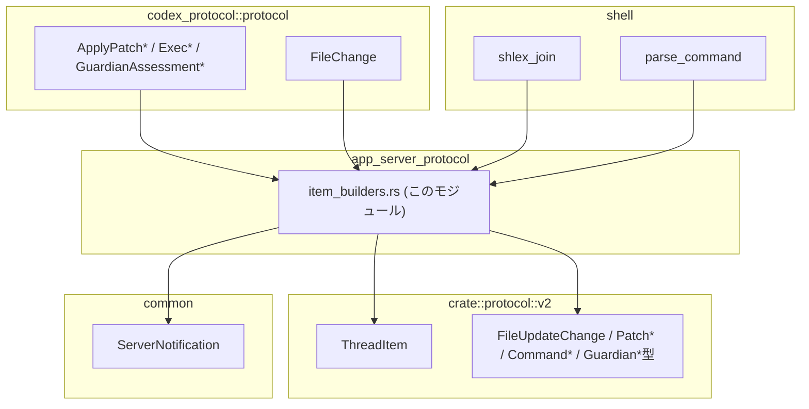
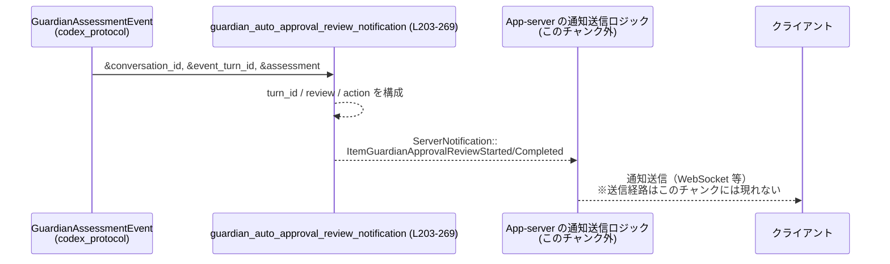
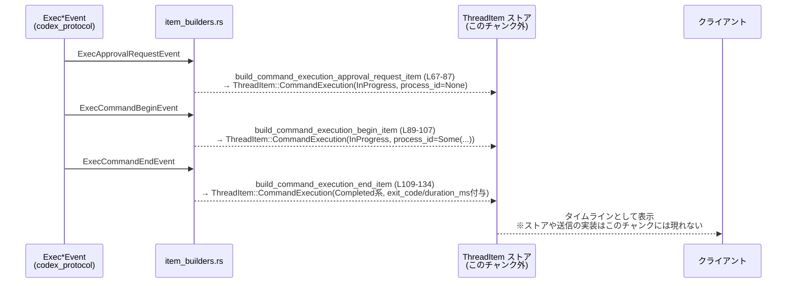

app-server-protocol/src/protocol/item_builders.rs

---

## 0. ざっくり一言

app-server がコアプロトコルのイベントから、クライアント表示用の合成 `ThreadItem` とガーディアン承認レビュー用 `ServerNotification` を組み立てるためのビルダー関数群です（根拠: item_builders.rs:L1-12, L41-201, L203-269）。

---

## 1. このモジュールの役割

### 1.1 概要

- コア層のイベント（パッチ適用、コマンド実行、ガーディアン評価）から、UI 向けの `ThreadItem` を生成します（根拠: item_builders.rs:L1-12, L41-65, L67-134, L140-201）。
- ガーディアン自動承認レビュー用の `ServerNotification` を生成します（根拠: item_builders.rs:L203-269）。
- パッチの差分情報 `FileChange` を UI 向けの `FileUpdateChange` に変換するユーティリティを提供します（根拠: item_builders.rs:L271-281, L284-309）。

### 1.2 アーキテクチャ内での位置づけ

このモジュールは、以下のコンポーネントの間に位置します。

- 入力:
  - `codex_protocol::protocol` のイベント群  
    (`ApplyPatchApprovalRequestEvent`, `PatchApplyBeginEvent`, `PatchApplyEndEvent`, `ExecApprovalRequestEvent`, `ExecCommandBeginEvent`, `ExecCommandEndEvent`, `GuardianAssessmentEvent`, `FileChange`)（根拠: item_builders.rs:L27-35, L31-33）
- 出力:
  - `crate::protocol::v2::ThreadItem`
  - `crate::protocol::common::ServerNotification`（根拠: item_builders.rs:L13, L25）
- 補助:
  - `codex_shell_command::parse_command::{parse_command, shlex_join}` によるシェルコマンドの解析・結合（根拠: item_builders.rs:L36-37）

依存関係のイメージです。



（根拠: use 文 item_builders.rs:L13-39）

### 1.3 設計上のポイント

- **合成 ThreadItem の集中管理**  
  - コメントに「Shared builders」「synthesizes them」「sharing the logic avoids drift」とあり、合成ロジックを一箇所で管理する設計になっています（根拠: item_builders.rs:L1-12）。
- **純粋な変換関数**  
  - すべての関数は引数を取り、新しい値を返すだけで、副作用（I/O やグローバル状態）はありません（根拠: 各関数本体に外部 I/O や `static` へのアクセスがないこと: item_builders.rs:L41-134, L140-201, L203-269, L271-309）。
- **エラーハンドリング方針**
  - 変換に失敗しうる部分は `Option` や安全な変換（`try_from`＋`unwrap_or`）を使って扱い、`panic!` や `unwrap()` は使用していません（根拠: item_builders.rs:L146-147, L167-168, L176-183, L115）。
- **並行性**
  - 共有可変状態を一切持たないため、これらの関数はどのスレッドからも安全に同時呼び出しできます（根拠: すべての関数が引数のみを読み取り、`mut`なグローバルや内部状態を持たない: item_builders.rs:L41-309）。
- **パッチ変換の共通化**
  - パッチ関連のビルダーは `convert_patch_changes` / `map_patch_change_kind` / `format_file_change_diff` に処理を委譲することで、処理を一元化しています（根拠: item_builders.rs:L45-47, L53-55, L61-63, L271-309）。

---

## 2. 主要な機能一覧（コンポーネントインベントリー）

このモジュールに定義されている関数の一覧です。

| 種別 | 名前 | 概要 | 定義位置 |
|------|------|------|----------|
| 公開関数 | `build_file_change_approval_request_item` | パッチ適用承認リクエストイベントを `ThreadItem::FileChange` に変換 | item_builders.rs:L41-49 |
| 公開関数 | `build_file_change_begin_item` | パッチ適用開始イベントを `ThreadItem::FileChange` に変換 | item_builders.rs:L51-57 |
| 公開関数 | `build_file_change_end_item` | パッチ適用終了イベントを `ThreadItem::FileChange` に変換 | item_builders.rs:L59-65 |
| 公開関数 | `build_command_execution_approval_request_item` | コマンド実行承認リクエストを `ThreadItem::CommandExecution` に変換 | item_builders.rs:L67-87 |
| 公開関数 | `build_command_execution_begin_item` | コマンド実行開始イベントを `ThreadItem::CommandExecution` に変換 | item_builders.rs:L89-107 |
| 公開関数 | `build_command_execution_end_item` | コマンド実行終了イベントを `ThreadItem::CommandExecution` に変換 | item_builders.rs:L109-134 |
| 公開関数 | `build_item_from_guardian_event` | ガーディアン評価イベントから `ThreadItem::CommandExecution` を合成 | item_builders.rs:L140-201 |
| 公開関数 | `guardian_auto_approval_review_notification` | ガーディアン評価から承認レビュー関連 `ServerNotification` を生成 | item_builders.rs:L203-269 |
| 公開関数 | `convert_patch_changes` | `HashMap<PathBuf, FileChange>` を `Vec<FileUpdateChange>` に変換 | item_builders.rs:L271-281 |
| 非公開関数 | `map_patch_change_kind` | `FileChange` を `PatchChangeKind` にマッピング | item_builders.rs:L284-291 |
| 非公開関数 | `format_file_change_diff` | `FileChange` から UI 表示用 diff 文字列を生成 | item_builders.rs:L294-309 |

---

## 3. 公開 API と詳細解説

### 3.1 型一覧（このモジュールが扱う主な型）

このファイル内で定義される型はありませんが、頻繁に扱う外部定義の型を整理します（定義自体は他ファイルで行われており、このチャンクには現れません）。

| 名前 | 種別 | 定義元 | 役割 / 用途 |
|------|------|--------|------------|
| `ThreadItem` | 列挙体（推測） | `crate::protocol::v2` | スレッド上のアイテム（ファイル変更・コマンド実行など）を表現（根拠: FileChange / CommandExecution バリアント利用 item_builders.rs:L44, L52, L60, L70, L90, L117, L151, L184）。 |
| `ServerNotification` | 列挙体（推測） | `crate::protocol::common` | クライアントへのサーバ通知（ガーディアン承認レビュー開始・終了）を表現（根拠: ItemGuardian* バリアント利用 item_builders.rs:L238-247, L253-267）。 |
| `ApplyPatchApprovalRequestEvent` ほか各種 `*Event` | 構造体（推測） | `codex_protocol::protocol` | コアレイヤから届くイベント（パッチ適用・コマンド実行・ガーディアン評価）（根拠: 引数に使用 item_builders.rs:L41-43, L51, L59, L67-69, L89, L109, L140-142, L203-207）。 |
| `FileChange` | 列挙体 | `codex_protocol::protocol` | ファイル追加/削除/更新とその内容・diff を表現（根拠: マッチで `Add/Delete/Update` バリアント利用 item_builders.rs:L285-290, L295-307）。 |
| `FileUpdateChange` | 構造体（推測） | `crate::protocol::v2` | API V2 におけるファイル変更表示用データ（パス・変更種別・diff）（根拠: フィールド path/kind/diff 利用 item_builders.rs:L274-278）。 |
| `PatchApplyStatus`, `PatchChangeKind` | 列挙体（推測） | `crate::protocol::v2` | パッチ適用の状態・変更種別を表す（根拠: 値 InProgress, Update などの利用 item_builders.rs:L47, L55, L63, L286-289）。 |
| `CommandExecutionStatus`, `CommandExecutionSource`, `CommandAction` | 列挙体（推測） | `crate::protocol::v2` | コマンド実行の状態・起点と、解析されたコマンドの意味付けを表す（根拠: InProgress, Agent, Unknown などの利用 item_builders.rs:L75-82, L96-102, L122-129, L148-150, L176-183, L189-191）。 |
| `GuardianAssessmentEvent`, `GuardianAssessmentAction` | 構造体/列挙体（推測） | `codex_protocol::protocol` | ガーディアンによるアクション評価の内容を保持（根拠: Command/Execve/ApplyPatch/NetworkAccess/McpToolCall バリアント利用 item_builders.rs:L144-199）。 |
| `GuardianApprovalReview`, `GuardianApprovalReviewStatus` | 構造体/列挙体（推測） | `crate::protocol::v2` | 承認レビュー内容と状態を保持（根拠: 構造体初期化とステータスマッピング item_builders.rs:L213-234）。 |
| `ItemGuardianApprovalReviewStartedNotification`, `ItemGuardianApprovalReviewCompletedNotification` | 構造体（推測） | `crate::protocol::v2` | ガーディアン承認レビュー開始・完了通知のペイロード（根拠: 構造体初期化 item_builders.rs:L239-246, L254-265）。 |

> これらの型の詳細なフィールド定義は、このチャンクには現れません。

---

### 3.2 関数詳細（重要な 7 件）

#### `build_file_change_approval_request_item(payload: &ApplyPatchApprovalRequestEvent) -> ThreadItem`

**概要**

- パッチ適用の**承認リクエスト**イベントから、進行中状態の `ThreadItem::FileChange` を生成します（根拠: item_builders.rs:L41-49）。
- 実際の適用処理が始まる前の「これから適用してよいか？」という段階の表示向けです（コメントで pre-execution flows と説明: item_builders.rs:L3-6）。

**引数**

| 引数名 | 型 | 説明 |
|--------|----|------|
| `payload` | `&ApplyPatchApprovalRequestEvent` | コアレイヤからのパッチ適用承認リクエストイベント |

**戻り値**

- `ThreadItem::FileChange`  
  - `id`: `payload.call_id` をコピー（根拠: item_builders.rs:L45）。  
  - `changes`: `convert_patch_changes(&payload.changes)` の結果（根拠: item_builders.rs:L46）。  
  - `status`: `PatchApplyStatus::InProgress` 固定（根拠: item_builders.rs:L47）。

**内部処理の流れ**

1. `payload.call_id` を `id` として `clone`（根拠: item_builders.rs:L45）。
2. `payload.changes` を `convert_patch_changes` で `Vec<FileUpdateChange>` に変換（根拠: item_builders.rs:L46, L271-281）。
3. `status` に `PatchApplyStatus::InProgress` を設定（根拠: item_builders.rs:L47）。
4. 以上をフィールドとする `ThreadItem::FileChange` を構築し返却（根拠: item_builders.rs:L44-48）。

**Examples（使用例）**

```rust
use codex_protocol::protocol::ApplyPatchApprovalRequestEvent;
use crate::protocol::item_builders::build_file_change_approval_request_item;

fn handle_approval_request(event: &ApplyPatchApprovalRequestEvent) {
    // 合成 ThreadItem を構築する
    let item = build_file_change_approval_request_item(event);
    // この item をスレッド履歴や通知として利用する（送信処理はこのチャンクには現れません）
    // send_to_client(item);
}
```

**Errors / Panics**

- この関数内で `panic!` や `unwrap` は使用されておらず、`Result` も返しません（根拠: item_builders.rs:L41-49）。
- 生成される `ThreadItem` が不正になる可能性は、入力 `payload` の内容に依存しますが、この関数自体では検証を行っていません。

**Edge cases（エッジケース）**

- `payload.changes` が空の `HashMap` の場合  
  → `convert_patch_changes` が空の `Vec` を返すため、`changes` が空の `FileChange` アイテムとなります（根拠: item_builders.rs:L271-281）。
- `payload.call_id` が空文字列でも、そのまま `id` に設定されます（この関数では検証なし: item_builders.rs:L45）。

**使用上の注意点**

- `status` は常に `InProgress` であり、「承認待ちで適用はまだ行われていない」という意味付けになることが前提です。
- 実際の適用開始・終了と混同しないよう、`build_file_change_begin_item` / `build_file_change_end_item` と併用してライフサイクルを構成する必要があります（関数分割より推測: item_builders.rs:L51-65）。

---

#### `build_file_change_end_item(payload: &PatchApplyEndEvent) -> ThreadItem`

**概要**

- パッチ適用の**終了イベント**から、最終状態の `ThreadItem::FileChange` を生成します（根拠: item_builders.rs:L59-65）。

**引数**

| 引数名 | 型 | 説明 |
|--------|----|------|
| `payload` | `&PatchApplyEndEvent` | パッチ適用完了（成功・失敗など）を表すイベント |

**戻り値**

- `ThreadItem::FileChange`
  - `id`: `payload.call_id`（根拠: item_builders.rs:L61）。
  - `changes`: `convert_patch_changes(&payload.changes)`（根拠: item_builders.rs:L62）。
  - `status`: `(&payload.status).into()` によりプロトコル側のステータスから `PatchApplyStatus` へ変換（根拠: item_builders.rs:L63）。

**内部処理の流れ**

1. `payload.call_id` を `id` にコピー（根拠: item_builders.rs:L61）。
2. `payload.changes` を `convert_patch_changes` で変換（根拠: item_builders.rs:L62）。
3. `payload.status` を `Into` 実装を使って `PatchApplyStatus` に変換（根拠: item_builders.rs:L63）。
4. これらを使って `ThreadItem::FileChange` を構築（根拠: item_builders.rs:L60-64）。

**Examples（使用例）**

```rust
use codex_protocol::protocol::PatchApplyEndEvent;
use crate::protocol::item_builders::build_file_change_end_item;

fn handle_patch_end(event: &PatchApplyEndEvent) {
    let item = build_file_change_end_item(event);
    // スレッドタイムライン上で「完了」状態として表示するなど
}
```

**Errors / Panics**

- 明示的なパニックやエラーはありません（根拠: item_builders.rs:L59-65）。
- `(&payload.status).into()` が実行時に失敗する可能性は通常なく、`Into` 実装のコンパイル時保証に依存します。

**Edge cases**

- `payload.changes` が開始時から変わっているかどうかは、この関数からは分かりません。開始時の変化と異なる場合でも、そのまま `changes` として反映されます（根拠: item_builders.rs:L62）。
- `status` がエラー状態（失敗）であっても同じビルダーが使われます。具体的な値は他ファイル側の `Into` 実装次第で、このチャンクからは分かりません。

**使用上の注意点**

- 開始アイテムと終了アイテムの `id` を一致させる前提で設計されているため、呼び出し側は同じ `call_id` のイベントを紐づける必要があります（根拠: どちらも `payload.call_id.clone()` を使用 item_builders.rs:L45, L53, L61）。

---

#### `build_command_execution_approval_request_item(payload: &ExecApprovalRequestEvent) -> ThreadItem`

**概要**

- コマンド実行の**承認リクエスト**イベントから、進行中状態の `ThreadItem::CommandExecution` を生成します（根拠: item_builders.rs:L67-87）。

**引数**

| 引数名 | 型 | 説明 |
|--------|----|------|
| `payload` | `&ExecApprovalRequestEvent` | コマンド実行承認リクエストイベント |

**戻り値**

- `ThreadItem::CommandExecution`
  - `id`: `payload.call_id`（根拠: item_builders.rs:L71）。
  - `command`: `shlex_join(&payload.command)` によるシェルコマンド文字列（根拠: item_builders.rs:L72, L37）。
  - `cwd`: `payload.cwd.clone()`（根拠: item_builders.rs:L73）。
  - `process_id`: `None`（まだプロセスは起動していない前提）（根拠: item_builders.rs:L74）。
  - `source`: `CommandExecutionSource::Agent` 固定（根拠: item_builders.rs:L75）。
  - `status`: `CommandExecutionStatus::InProgress` 固定（根拠: item_builders.rs:L76）。
  - `command_actions`: `payload.parsed_cmd` の各要素を `CommandAction::from` で変換し `Vec` に格納（根拠: item_builders.rs:L77-82）。
  - `aggregated_output`, `exit_code`, `duration_ms`: いずれも `None`（まだ実行されていないため）（根拠: item_builders.rs:L83-85）。

**内部処理の流れ**

1. 引数の `command` 配列を `shlex_join` でシェル表現文字列へ変換（根拠: item_builders.rs:L72）。
2. `parsed_cmd` を `iter()` + `cloned()` + `map(CommandAction::from)` で `CommandAction` のリストに変換（根拠: item_builders.rs:L77-82）。
3. プロセス ID・出力・終了コード・実行時間は未定義として `None` を設定（根拠: item_builders.rs:L74, L83-85）。
4. 上記を含む `ThreadItem::CommandExecution` を返却（根拠: item_builders.rs:L70-86）。

**Examples（使用例）**

```rust
use codex_protocol::protocol::ExecApprovalRequestEvent;
use crate::protocol::item_builders::build_command_execution_approval_request_item;

fn handle_exec_approval(event: &ExecApprovalRequestEvent) {
    let item = build_command_execution_approval_request_item(event);
    // UI 上で「コマンド実行の承認待ち」状態として表示する
}
```

**Errors / Panics**

- `shlex_join` や `CommandAction::from` がパニックするかどうかは、それらの実装に依存し、このチャンクからは分かりませんが、本関数内に `unwrap` 等はありません（根拠: item_builders.rs:L67-87）。

**Edge cases**

- `payload.command` が空の配列の場合  
  → `shlex_join` がどのような文字列を返すかは、このチャンクには現れず不明です。
- `payload.parsed_cmd` が空の場合  
  → `command_actions` は空の `Vec` になります（根拠: item_builders.rs:L77-82）。

**使用上の注意点**

- 実行前の承認フェーズ専用であり、`process_id` や `exit_code` など実行結果に関する情報は必ず `None` となる点を前提とした扱いが必要です。

---

#### `build_command_execution_end_item(payload: &ExecCommandEndEvent) -> ThreadItem`

**概要**

- コマンド実行の**終了イベント**から、最終状態の `ThreadItem::CommandExecution` を生成します（根拠: item_builders.rs:L109-134）。

**引数**

| 引数名 | 型 | 説明 |
|--------|----|------|
| `payload` | `&ExecCommandEndEvent` | コマンド実行完了イベント（成功・失敗・中断を含む） |

**戻り値**

- `ThreadItem::CommandExecution`（終了時点の完全な情報を持つ）
  - `aggregated_output`: 空文字列なら `None`、それ以外は `Some(payload.aggregated_output.clone())`（根拠: item_builders.rs:L110-114, L130）。
  - `duration_ms`: `payload.duration.as_millis()`（`u128`）を `i64::try_from` で変換し、範囲外なら `i64::MAX` に丸めた値（根拠: item_builders.rs:L115, L132）。

**内部処理の流れ**

1. `payload.aggregated_output` が空かどうかを判定し、空なら `None`、そうでなければ `Some(…)` として `aggregated_output` を構成（根拠: item_builders.rs:L110-114）。
2. `payload.duration.as_millis()` を `i64::try_from` で `i64` に変換し、失敗した場合は `i64::MAX` を用いる（根拠: item_builders.rs:L115）。
3. そのほかのフィールド（`id`, `command`, `cwd`, `process_id`, `source`, `status`, `command_actions`, `exit_code`）を承認/開始時と同様に設定しつつ、終了時点の値を使う（根拠: item_builders.rs:L118-123, L124-129, L131）。
4. 完成した `ThreadItem::CommandExecution` を返却（根拠: item_builders.rs:L117-133）。

**Examples（使用例）**

```rust
use codex_protocol::protocol::ExecCommandEndEvent;
use crate::protocol::item_builders::build_command_execution_end_item;

fn handle_exec_end(event: &ExecCommandEndEvent) {
    let item = build_command_execution_end_item(event);
    // UI で「終了」状態として表示し、duration_ms や exit_code をラベル表示するなど
}
```

**Errors / Panics**

- `i64::try_from(...).unwrap_or(i64::MAX)` は、変換失敗時にもパニックせず `i64::MAX` にフォールバックします（根拠: item_builders.rs:L115）。
- 他に `unwrap` や `panic!` は使用していません（根拠: item_builders.rs:L109-134）。

**Edge cases**

- 非常に長い実行時間（`as_millis()` が `i64` の範囲を超える）  
  → `duration_ms` は `i64::MAX` になります。実行時間が実際より小さい値に丸められることはなく、上限でクリップされる挙動です（根拠: item_builders.rs:L115）。
- 標準出力が空文字列の場合  
  → `aggregated_output` は `None` になり、「出力なし」と区別が付くよう設計されています（根拠: item_builders.rs:L110-114, L130）。

**使用上の注意点**

- `duration_ms` が `i64::MAX` のときは、実際の実行時間が不明もしくは非常に長いケースとして扱う必要があります。
- `aggregated_output` が `None` の場合も「出力がない」だけであり、エラーとは限りません。

---

#### `build_item_from_guardian_event(assessment: &GuardianAssessmentEvent, status: CommandExecutionStatus) -> Option<ThreadItem>`

**概要**

- ガーディアンによる評価イベントから、対象がコマンド実行 (`Command` / `Execve`) の場合に限り `ThreadItem::CommandExecution` を合成します（根拠: item_builders.rs:L136-140, L144-195）。
- 対象がパッチ適用・ネットワークアクセス・その他ツールコールの場合は `None` を返します（根拠: item_builders.rs:L197-199）。

**引数**

| 引数名 | 型 | 説明 |
|--------|----|------|
| `assessment` | `&GuardianAssessmentEvent` | ガーディアン評価イベント。`action` フィールドに対象アクションが入る（根拠: item_builders.rs:L140-145, L164-166）。 |
| `status` | `CommandExecutionStatus` | 合成する `ThreadItem` に付与するステータス（例: Approved 相当の状態） |

**戻り値**

- `Option<ThreadItem>`  
  - `Some(ThreadItem::CommandExecution { ... })`: `action` が `Command` または `Execve` の場合（根拠: item_builders.rs:L145-163, L164-195）。
  - `None`: `ApplyPatch` / `NetworkAccess` / `McpToolCall` の場合、または `assessment.target_item_id` が `None` の場合（根拠: item_builders.rs:L146-147, L167-168, L197-199）。

**内部処理の流れ**

1. `assessment.action` に対して `match` を行う（根拠: item_builders.rs:L144）。
2. `GuardianAssessmentAction::Command` の場合:
   - `assessment.target_item_id.as_ref()?` によって、ターゲット ID が `Some` なら参照を取得し、`None` なら即座に `None` を返す（`?` 演算子）（根拠: item_builders.rs:L145-147）。
   - `command` をクローンし、`CommandAction::Unknown { command: command.clone() }` のみからなる `Vec` を構築（根拠: item_builders.rs:L147-150）。
   - `ThreadItem::CommandExecution` を `source: Agent`, `process_id: None` などで構成し、`Some(...)` で返却（根拠: item_builders.rs:L151-162）。
3. `GuardianAssessmentAction::Execve` の場合:
   - 同様に `target_item_id.as_ref()?` で ID を取得（根拠: item_builders.rs:L167-168）。
   - `argv` が空なら `[program.clone()]`、空でないなら `program.clone()` を先頭に `argv` の 2 番目以降を連結して新しい `argv` ベクタを構成（根拠: item_builders.rs:L168-174）。
   - `shlex_join(&argv)` でコマンド文字列を作成（根拠: item_builders.rs:L175）。
   - `parse_command(&argv)` でパースし、結果が空なら `CommandAction::Unknown` 一件、そうでなければ各要素を `CommandAction::from` で変換（根拠: item_builders.rs:L176-183）。
   - これらを用いて `ThreadItem::CommandExecution` を構築し、`Some(...)` を返却（根拠: item_builders.rs:L184-195）。
4. `GuardianAssessmentAction::ApplyPatch` / `NetworkAccess` / `McpToolCall` の場合は `None`（根拠: item_builders.rs:L197-199）。

**Examples（使用例）**

```rust
use codex_protocol::protocol::{GuardianAssessmentEvent, GuardianAssessmentAction};
use crate::protocol::v2::CommandExecutionStatus;
use crate::protocol::item_builders::build_item_from_guardian_event;

fn project_guardian_event(event: &GuardianAssessmentEvent) {
    let status = CommandExecutionStatus::InProgress; // 例: 任意のステータスを指定
    if let Some(item) = build_item_from_guardian_event(event, status) {
        // コマンド関連の場合のみ ThreadItem として表示可能
        // push_to_thread(item);
    }
}
```

**Errors / Panics**

- `target_item_id.as_ref()?` の `?` により `None` を返すだけで、パニックにはなりません（根拠: item_builders.rs:L146-147, L167-168）。
- `shlex_join` / `parse_command` の詳細なエラーハンドリングはこのチャンクには現れませんが、本関数ではそれらの戻り値を前提として処理しています（根拠: item_builders.rs:L175-183）。

**Edge cases**

- `assessment.target_item_id` が存在しない (`None`) 場合  
  → どのバリアントでも `Some(ThreadItem)` は返らず、`None` になります（根拠: item_builders.rs:L146-147, L167-168）。
- `Execve` の `argv` が空配列  
  → 新しい `argv` は `[program.clone()]` となり、実質的に単一コマンドとして扱われます（根拠: item_builders.rs:L168-170）。
- `parse_command(&argv)` が空を返した場合  
  → `CommandAction::Unknown` の 1 要素のみからなる `Vec` にフォールバックします（根拠: item_builders.rs:L176-180）。

**使用上の注意点**

- 返り値が `Option` であるため、呼び出し側は `None` ケース（コマンド以外のアクション、および ID 不在）を必ず考慮する必要があります。
- `status` は呼び出し側から渡されるため、「ガーディアンによって許可済み」などの状態と整合する値を指定する設計が想定されます（ただし、具体的なステータス体系はこのチャンクには現れません）。

---

#### `guardian_auto_approval_review_notification(conversation_id: &ThreadId, event_turn_id: &str, assessment: &GuardianAssessmentEvent) -> ServerNotification`

**概要**

- ガーディアン評価イベントから、承認レビュー開始または完了の `ServerNotification` を生成します（根拠: item_builders.rs:L203-269）。
- 評価状態が `InProgress` の場合は「開始」通知、それ以外（Approved/Denied/TimedOut/Aborted）の場合は「完了」通知になります（根拠: item_builders.rs:L214-229, L236-268）。

**引数**

| 引数名 | 型 | 説明 |
|--------|----|------|
| `conversation_id` | `&ThreadId` | スレッド ID。通知ペイロードの `thread_id` として使用（根拠: item_builders.rs:L203-205, L240, L255）。 |
| `event_turn_id` | `&str` | 呼び出し元イベントのターン ID。`assessment.turn_id` が空の場合のフォールバックに使われる（根拠: item_builders.rs:L205, L208-212）。 |
| `assessment` | `&GuardianAssessmentEvent` | ガーディアン評価イベント本体。ステータス・リスクレベル・理由などからレビュー情報を構成（根拠: item_builders.rs:L206-207, L213-234, L236-265）。 |

**戻り値**

- `ServerNotification`  
  - `ItemGuardianApprovalReviewStarted` または  
    `ItemGuardianApprovalReviewCompleted` のいずれか（根拠: item_builders.rs:L238-247, L253-267）。

**内部処理の流れ**

1. `turn_id` を決定  
   - `assessment.turn_id` が空なら `event_turn_id.to_string()`、そうでなければ `assessment.turn_id.clone()`（根拠: item_builders.rs:L208-212）。
2. `GuardianApprovalReview` 構造体を組み立て  
   - `assessment.status` を `GuardianApprovalReviewStatus` にマッピング（InProgress/Approved/Denied/TimedOut/Aborted）（根拠: item_builders.rs:L214-229）。
   - `risk_level`, `user_authorization` を `map(Into::into)` で型変換しつつコピー（根拠: item_builders.rs:L231-232）。
   - `rationale` をクローン（根拠: item_builders.rs:L233）。
3. `action` を `assessment.action.clone().into()` で通知用の型に変換（根拠: item_builders.rs:L235）。
4. 再度 `assessment.status` で分岐（根拠: item_builders.rs:L236-237）:
   - `InProgress` → `ServerNotification::ItemGuardianApprovalReviewStarted` を生成（根拠: item_builders.rs:L238-247）。
   - それ以外 → `ServerNotification::ItemGuardianApprovalReviewCompleted` を生成し、`decision_source` は `assessment.decision_source.map(...).unwrap_or(AutoReviewDecisionSource::Agent)` で決定（根拠: item_builders.rs:L249-252, L259-262）。

**Examples（使用例）**

```rust
use codex_protocol::ThreadId;
use codex_protocol::protocol::GuardianAssessmentEvent;
use crate::protocol::item_builders::guardian_auto_approval_review_notification;

fn notify_review(thread_id: &ThreadId, turn_id: &str, assessment: &GuardianAssessmentEvent) {
    let notification = guardian_auto_approval_review_notification(thread_id, turn_id, assessment);
    // notification をクライアントへ送信する処理はこのチャンクには現れません
}
```

**Errors / Panics**

- `unwrap_or(AutoReviewDecisionSource::Agent)` は `Option` に対するメソッドであり、パニックしません（`unwrap` ではない）（根拠: item_builders.rs:L259-262）。
- その他に `panic!` や `unwrap()` はありません（根拠: item_builders.rs:L203-269）。

**Edge cases**

- `assessment.turn_id` が空文字列の場合  
  → `turn_id` として `event_turn_id` が使われます（根拠: item_builders.rs:L208-212）。
- `assessment.decision_source` が `None` の場合  
  → `decision_source` は `AutoReviewDecisionSource::Agent` になります（根拠: item_builders.rs:L259-262）。

**使用上の注意点**

- 呼び出し側は、返ってきた `ServerNotification` が「開始」か「完了」かをパターンマッチで判定し、それに応じた UI 更新を行う前提になります。
- `decision_source` が省略された場合に `Agent` と見なす仕様であるため、このデフォルトが想定する意味（「エージェント起点」）と運用上の意味付けを合わせる必要があります。

---

#### `convert_patch_changes(changes: &HashMap<PathBuf, FileChange>) -> Vec<FileUpdateChange>`

**概要**

- コアプロトコルの `FileChange` マップを、クライアント表示向けの `FileUpdateChange` のベクタに変換します（根拠: item_builders.rs:L271-281）。
- パス文字列でソートされた `Vec` を返すことで、UI 側の表示順が安定するようにしています（根拠: item_builders.rs:L280-281）。

**引数**

| 引数名 | 型 | 説明 |
|--------|----|------|
| `changes` | `&HashMap<PathBuf, FileChange>` | ファイルパスをキー、変更内容を値とするマップ |

**戻り値**

- `Vec<FileUpdateChange>`  
  - 各要素のフィールド:
    - `path`: `PathBuf` を `to_string_lossy().into_owned()` で文字列化したもの（根拠: item_builders.rs:L275）。
    - `kind`: `map_patch_change_kind(change)` の結果（Add/Delete/Update） （根拠: item_builders.rs:L276, L284-290）。
    - `diff`: `format_file_change_diff(change)` の結果（根拠: item_builders.rs:L277, L294-307）。

**内部処理の流れ**

1. `changes.iter()` で `(path, change)` ペアを反復（根拠: item_builders.rs:L272-274）。
2. 各ペアについて `FileUpdateChange { ... }` を構築（根拠: item_builders.rs:L274-278）。
3. すべて収集して `converted` ベクタとし、`converted.sort_by(|a, b| a.path.cmp(&b.path));` で `path` 昇順にソート（根拠: item_builders.rs:L279-280）。
4. ソート後の `converted` を返却（根拠: item_builders.rs:L281）。

**Examples（使用例）**

```rust
use std::collections::HashMap;
use std::path::PathBuf;
use codex_protocol::protocol::FileChange;
use crate::protocol::item_builders::convert_patch_changes;

fn to_update_changes(map: &HashMap<PathBuf, FileChange>) {
    let updates = convert_patch_changes(map);
    // updates を ThreadItem::FileChange.changes に流用するなど
}
```

**Errors / Panics**

- `to_string_lossy` は無効な UTF-8 をロスレスではない形で文字列化しますが、パニックしません（一般的な `OsStr` API の挙動に基づく。呼び出し箇所: item_builders.rs:L275）。
- ソートや `collect` にパニック要素はありません（根拠: item_builders.rs:L272-281）。

**Edge cases**

- `changes` が空の `HashMap` の場合  
  → `converted` は空の `Vec` となり、そのまま返ります（根拠: item_builders.rs:L271-281）。
- パスに非 UTF-8 文字が含まれる場合  
  → `to_string_lossy` により、置換文字などを含んだ形で文字列化されます。

**使用上の注意点**

- パスを文字列に変換する際にエンコード情報は失われるため、「元の `PathBuf`」が必要な処理はこの変換前に行う必要があります。
- diff 文字列は `format_file_change_diff` に依存しており、このモジュールではサニタイズ等は行っていません（根拠: item_builders.rs:L294-307）。

---

### 3.3 その他の関数

| 関数名 | 役割（1 行） | 定義位置 |
|--------|--------------|----------|
| `build_file_change_begin_item(payload: &PatchApplyBeginEvent) -> ThreadItem` | パッチ適用開始イベントを `InProgress` 状態の `ThreadItem::FileChange` に変換（承認リクエスト後の実際の適用開始を表現） | item_builders.rs:L51-57 |
| `build_command_execution_begin_item(payload: &ExecCommandBeginEvent) -> ThreadItem` | コマンド実行開始イベントから、実行中状態の `ThreadItem::CommandExecution` を生成（`process_id` や `source` を付与） | item_builders.rs:L89-107 |
| `map_patch_change_kind(change: &FileChange) -> PatchChangeKind` | `FileChange` のバリアント（Add/Delete/Update）を UI 用の `PatchChangeKind` にマッピング | item_builders.rs:L284-291 |
| `format_file_change_diff(change: &FileChange) -> String` | 追加/削除の場合はコンテンツ全文、更新の場合は unified diff と移動先パス（存在する場合）を組み合わせた文字列を生成 | item_builders.rs:L294-307 |

---

## 4. データフロー

### 4.1 代表的なシナリオ: ガーディアン承認レビュー通知

ガーディアン評価イベントからクライアントへの承認レビュー通知までの典型的な流れ（このモジュールが担う部分）を示します。



- このモジュールは `GuardianAssessmentEvent` を受け取り、`ServerNotification` を返すまでを担当します（根拠: item_builders.rs:L203-269）。
- `ServerNotification` の送信方法やクライアント側の処理は、このチャンクには現れません。

### 4.2 代表的なシナリオ: コマンド実行ライフサイクル表示

コマンド実行の承認 → 開始 → 終了を `ThreadItem` として構成する流れのイメージです。



---

## 5. 使い方（How to Use）

### 5.1 基本的な使用方法

コマンド実行イベント一式から `ThreadItem` を構築する一般的なパターンです。

```rust
use codex_protocol::protocol::{
    ExecApprovalRequestEvent, ExecCommandBeginEvent, ExecCommandEndEvent,
};
use crate::protocol::item_builders::{
    build_command_execution_approval_request_item,
    build_command_execution_begin_item,
    build_command_execution_end_item,
};

fn project_exec_lifecycle(
    approval: &ExecApprovalRequestEvent,
    begin: &ExecCommandBeginEvent,
    end: &ExecCommandEndEvent,
) {
    let approval_item = build_command_execution_approval_request_item(approval);
    let begin_item    = build_command_execution_begin_item(begin);
    let end_item      = build_command_execution_end_item(end);

    // これら3つの ThreadItem を同じ id（call_id）で紐づけて管理し、
    // クライアントにはライフサイクルとして順に提示する設計が想定されます。
}
```

### 5.2 よくある使用パターン

1. **パッチ適用フローの表示**

```rust
use codex_protocol::protocol::{
    ApplyPatchApprovalRequestEvent, PatchApplyBeginEvent, PatchApplyEndEvent,
};
use crate::protocol::item_builders::{
    build_file_change_approval_request_item,
    build_file_change_begin_item,
    build_file_change_end_item,
};

fn project_patch_lifecycle(
    approval: &ApplyPatchApprovalRequestEvent,
    begin: &PatchApplyBeginEvent,
    end: &PatchApplyEndEvent,
) {
    let approval_item = build_file_change_approval_request_item(approval);
    let begin_item    = build_file_change_begin_item(begin);
    let end_item      = build_file_change_end_item(end);
    // approval_item / begin_item / end_item を UI 側で連続したイベントとして扱う
}
```

1. **ガーディアン評価からのコマンド投影**

```rust
use codex_protocol::protocol::GuardianAssessmentEvent;
use crate::protocol::v2::CommandExecutionStatus;
use crate::protocol::item_builders::build_item_from_guardian_event;

fn project_guardian_command(assessment: &GuardianAssessmentEvent) {
    let status = CommandExecutionStatus::InProgress;
    if let Some(item) = build_item_from_guardian_event(assessment, status) {
        // コマンド関連のガーディアンチェックを ThreadItem として表示
    }
}
```

1. **承認レビュー通知の生成**

```rust
use codex_protocol::{ThreadId};
use codex_protocol::protocol::GuardianAssessmentEvent;
use crate::protocol::item_builders::guardian_auto_approval_review_notification;

fn send_review_notification(
    thread_id: &ThreadId,
    event_turn_id: &str,
    assessment: &GuardianAssessmentEvent,
) {
    let notif = guardian_auto_approval_review_notification(thread_id, event_turn_id, assessment);
    // notif をクライアントへ送信
}
```

### 5.3 よくある間違い

```rust
// 間違い例: ガーディアン評価イベントをそのまま ThreadItem として扱おうとする
fn wrong_usage(assessment: &GuardianAssessmentEvent) {
    // let item: ThreadItem = assessment.clone(); // コンパイルもできないし、表示形式も異なる
}

// 正しい例: ビルダー関数を通じて ThreadItem に投影する
fn correct_usage(assessment: &GuardianAssessmentEvent, status: CommandExecutionStatus) {
    if let Some(item) = build_item_from_guardian_event(assessment, status) {
        // item を使用
    }
}
```

```rust
// 間違い例: convert_patch_changes を通さずに FileChange を直接クライアントへ送る
fn wrong_patch_usage(changes: &HashMap<PathBuf, FileChange>) {
    // クライアントは FileChange の enum 構造を知らない前提だと扱いづらい
    // send_to_client(changes);
}

// 正しい例: convert_patch_changes で UI 用に整形する
fn correct_patch_usage(changes: &HashMap<PathBuf, FileChange>) {
    let updates = convert_patch_changes(changes);
    // updates を ThreadItem::FileChange.changes として送る
}
```

### 5.4 使用上の注意点（まとめ）

- **ID の一貫性**  
  - `call_id` / `target_item_id` をもとに同じ処理のライフサイクルを紐づける設計になっているため、呼び出し元は ID の整合性を維持する必要があります（根拠: item_builders.rs:L45, L53, L61, L71, L91, L118, L146, L152, L167, L185, L242-243, L257-258）。
- **Option の扱い**  
  - `build_item_from_guardian_event` や `guardian_auto_approval_review_notification` など、一部関数は `Option` を返したり `Option` フィールド（risk_level, user_authorization, decision_source 等）を持ちます。呼び出し側で `None` ケースを必ず考慮する必要があります（根拠: item_builders.rs:L140-143, L213-234, L259-262）。
- **安全性 / エラー**
  - 明示的なパニック要因（`unwrap`, `expect`, `panic!`）はなく、`?` も `Option` 上で使われているため「値がない場合は `None` を返す」設計になっています（根拠: item_builders.rs:L146-147, L167-168）。
  - `i64::try_from(...).unwrap_or(i64::MAX)` により、duration のオーバーフローは上限クリップで安全に処理されます（根拠: item_builders.rs:L115）。
- **並行性**
  - いずれの関数も共有可変状態を持たず、引数から出力を生成する純粋関数なので、複数スレッドから同時に呼び出してもデータ競合は発生しません（根拠: item_builders.rs:L41-309 にグローバル可変状態や `static mut` が存在しない）。
- **セキュリティ / サニタイズ**
  - `format_file_change_diff` は `FileChange` の内容（`content` や `unified_diff`）をそのまま文字列として返します（必要に応じて「Moved to: ...」を追記）（根拠: item_builders.rs:L295-307）。
  - このモジュールではコンテンツのサニタイズは行っていないため、表示側で XSS などの対策が必要かどうかは、クライアントの描画方式に依存します。

---

## 6. 変更の仕方（How to Modify）

### 6.1 新しい機能を追加する場合

例: 新しい種類のガーディアンアクションに対して `ThreadItem` を合成したい場合。

1. **該当アクションの判定を追加**
   - `build_item_from_guardian_event` の `match &assessment.action` に新しいバリアントの分岐を追加します（根拠: 既存バリアント判定 item_builders.rs:L144-199）。
2. **変換ロジックの実装**
   - 既存の `Command` / `Execve` 分岐にならい、必要な `ThreadItem` バリアントを構築します（根拠: item_builders.rs:L145-163, L164-195）。
3. **通知への反映**
   - 必要に応じて `guardian_auto_approval_review_notification` で `action` の型変換部分に新バリアントの対応があるか確認し、外部型の `Into` 実装との整合性を取り、テストを追加します（根拠: item_builders.rs:L235）。

### 6.2 既存の機能を変更する場合

- **影響範囲の確認**
  - 各ビルダー関数の出力は、クライアントに直接表示される `ThreadItem` / `ServerNotification` であるため、変更は UI 仕様に影響します。
  - 変更対象関数の定義位置を確認し（例: `build_command_execution_end_item` は item_builders.rs:L109-134）、その関数を呼び出している場所（このチャンクには現れません）をプロジェクト全体検索で特定する必要があります。
- **契約（前提条件・返り値の意味）**
  - たとえば `convert_patch_changes` は「パスでソートされた `Vec` を返す」という事実に依存するコードが存在しうるため、ソート順を変える場合は仕様変更として扱うべきです（根拠: item_builders.rs:L280-281）。
  - `build_item_from_guardian_event` が「コマンド以外は `None`」を返すという契約に依存している箇所がある可能性があります（根拠: item_builders.rs:L197-199）。
- **テストの観点**
  - このチャンク自身にはテストコードは含まれていません（根拠: item_builders.rs:L1-309 に `#[cfg(test)]` 等がない）。
  - 変更時は、代表的な入力（Add/Delete/Update の `FileChange`、各種 Exec イベント、各種 Guardian ステータス）に対し、期待する `ThreadItem` / `ServerNotification` が生成されることを確認するテストを用意するのが望ましいです。

---

## 7. 関連ファイル

このモジュールと密接に関係する（とコード上から読み取れる）ファイルです。実際のパスや内容はこのチャンクには現れませんが、`use` から推測されます。

| パス（推定） | 役割 / 関係 |
|-------------|------------|
| `app-server-protocol/src/protocol/common.rs` | `ServerNotification` 型を定義し、本モジュールの `guardian_auto_approval_review_notification` が返す通知の列挙体を提供（根拠: item_builders.rs:L13）。 |
| `app-server-protocol/src/protocol/v2/*.rs` | `ThreadItem`, `FileUpdateChange`, `PatchApplyStatus`, `PatchChangeKind`, `Command*`, `Guardian*` など、V2 プロトコルのペイロード型を定義（根拠: item_builders.rs:L14-25）。 |
| `codex-protocol/src/protocol/*.rs` | `*Event` や `FileChange`, `GuardianAssessment*` など、コアレイヤのイベント・データ型を定義（根拠: item_builders.rs:L26-35）。 |
| `codex-shell-command/src/parse_command.rs` | `parse_command`, `shlex_join` の実装。コマンド文字列の解析と再結合を提供（根拠: item_builders.rs:L36-37）。 |

> これらのファイルの具体的な内容や内部実装は、このチャンクには現れません。
